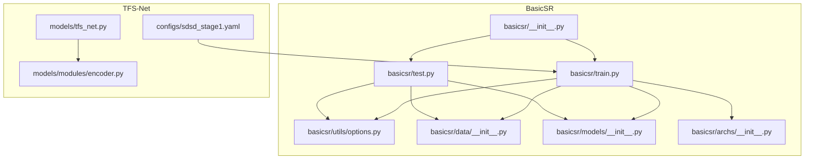
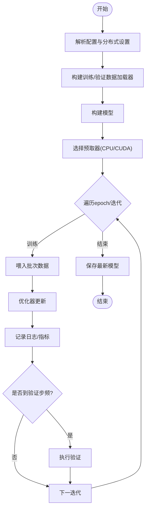
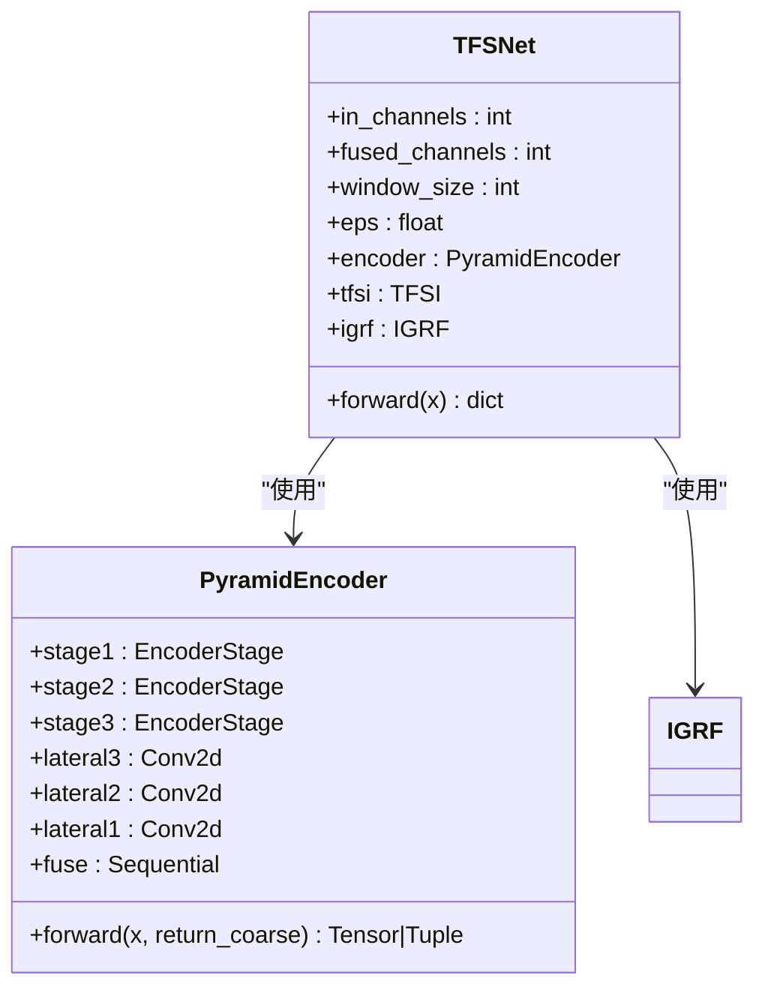
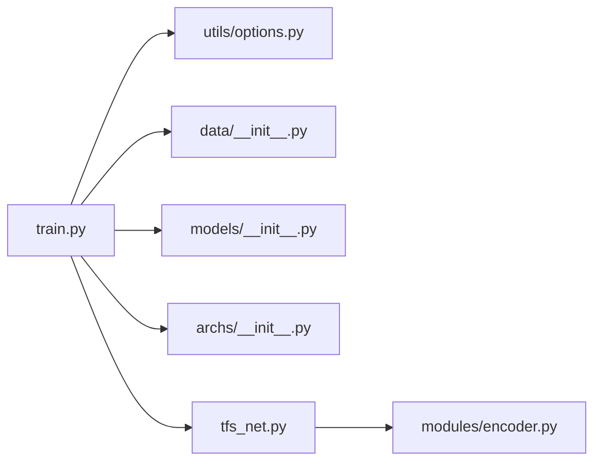

# BasicSR集成

<cite>
**本文引用的文件**
- [README.md](file://reference_repos/BasicSR/README.md)
- [basicsr/__init__.py](file://reference_repos/BasicSR/basicsr/__init__.py)
- [basicsr/train.py](file://reference_repos/BasicSR/basicsr/train.py)
- [basicsr/test.py](file://reference_repos/BasicSR/basicsr/test.py)
- [basicsr/archs/__init__.py](file://reference_repos/BasicSR/basicsr/archs/__init__.py)
- [basicsr/models/__init__.py](file://reference_repos/BasicSR/basicsr/models/__init__.py)
- [basicsr/data/__init__.py](file://reference_repos/BasicSR/basicsr/data/__init__.py)
- [basicsr/utils/options.py](file://reference_repos/BasicSR/basicsr/utils/options.py)
- [options/train/SRResNet_SRGAN/train_MSRResNet_x4.yml](file://reference_repos/BasicSR/options/train/SRResNet_SRGAN/train_MSRResNet_x4.yml)
- [docs/INSTALL.md](file://reference_repos/BasicSR/docs/INSTALL.md)
- [docs/TrainTest.md](file://reference_repos/BasicSR/docs/TrainTest.md)
- [models/tfs_net.py](file://models/tfs_net.py)
- [models/modules/encoder.py](file://models/modules/encoder.py)
- [configs/sdsd_stage1.yaml](file://configs/sdsd_stage1.yaml)
</cite>

## 目录
1. [简介](#简介)
2. [项目结构](#项目结构)
3. [核心组件](#核心组件)
4. [架构总览](#架构总览)
5. [详细组件分析](#详细组件分析)
6. [依赖关系分析](#依赖关系分析)
7. [性能考虑](#性能考虑)
8. [故障排查指南](#故障排查指南)
9. [结论](#结论)
10. [附录](#附录)

## 简介
本文件面向在TFS-Net中集成BasicSR的开发者，系统性阐述BasicSR作为图像与视频复原工具箱的核心能力与模块化设计，并结合TFS-Net的多阶段数据流（编码-时频源指示-SACE-三源恢复-融合）给出可落地的集成路径。BasicSR提供统一的训练/测试入口、数据集构建、模型注册与构建、损失与度量等基础设施，能够高效支撑超分辨率、去噪、去模糊等任务。TFS-Net当前已完成编码器与时频源指示器（TFSI），并在配置与训练脚本层面与BasicSR形成良好衔接。

## 项目结构
BasicSR采用“分层+注册表”的模块化组织方式：
- basicsr/archs：网络架构注册与自动扫描加载
- basicsr/models：模型类型注册与构建
- basicsr/data：数据集与数据加载器注册、构建与预取
- basicsr/utils：选项解析、日志、分布式工具等
- basicsr/train.py / basicsr/test.py：训练与测试主流程
- options：各任务的配置样例（YAML）

TFS-Net侧：
- models/tfs_net.py：TFS-Net主干网络，当前实现编码器与TFSI，IGRF已实现，SACE/IFPN/NDPN/MRPN待实现
- models/modules/encoder.py：金字塔编码器，支持返回粗尺度特征以供后续分支使用
- configs/sdsd_stage1.yaml：SDSD阶段1的训练配置（与BasicSR风格一致）



图表来源
- [basicsr/train.py:1-216](file://reference_repos/BasicSR/basicsr/train.py#L1-L216)
- [basicsr/test.py:1-46](file://reference_repos/BasicSR/basicsr/test.py#L1-L46)
- [basicsr/utils/options.py:1-219](file://reference_repos/BasicSR/basicsr/utils/options.py#L1-L219)
- [basicsr/data/__init__.py:1-102](file://reference_repos/BasicSR/basicsr/data/__init__.py#L1-L102)
- [basicsr/models/__init__.py:1-30](file://reference_repos/BasicSR/basicsr/models/__init__.py#L1-L30)
- [basicsr/archs/__init__.py:1-25](file://reference_repos/BasicSR/basicsr/archs/__init__.py#L1-L25)
- [basicsr/__init__.py:1-13](file://reference_repos/BasicSR/basicsr/__init__.py#L1-L13)
- [models/tfs_net.py:1-181](file://models/tfs_net.py#L1-L181)
- [models/modules/encoder.py:1-102](file://models/modules/encoder.py#L1-L102)
- [configs/sdsd_stage1.yaml:1-34](file://configs/sdsd_stage1.yaml#L1-L34)

章节来源
- [basicsr/__init__.py:1-13](file://reference_repos/BasicSR/basicsr/__init__.py#L1-L13)
- [basicsr/train.py:1-216](file://reference_repos/BasicSR/basicsr/train.py#L1-L216)
- [basicsr/test.py:1-46](file://reference_repos/BasicSR/basicsr/test.py#L1-L46)
- [basicsr/utils/options.py:1-219](file://reference_repos/BasicSR/basicsr/utils/options.py#L1-L219)
- [basicsr/data/__init__.py:1-102](file://reference_repos/BasicSR/basicsr/data/__init__.py#L1-L102)
- [basicsr/models/__init__.py:1-30](file://reference_repos/BasicSR/basicsr/models/__init__.py#L1-L30)
- [basicsr/archs/__init__.py:1-25](file://reference_repos/BasicSR/basicsr/archs/__init__.py#L1-L25)
- [models/tfs_net.py:1-181](file://models/tfs_net.py#L1-L181)
- [models/modules/encoder.py:1-102](file://models/modules/encoder.py#L1-L102)
- [configs/sdsd_stage1.yaml:1-34](file://configs/sdsd_stage1.yaml#L1-L34)

## 核心组件
- 训练/测试入口
  - 训练入口：解析配置、构建数据集/数据加载器、构建模型、循环训练与验证、保存检查点与可视化
  - 测试入口：解析配置、构建测试集与数据加载器、构建模型、逐数据集评估
- 配置解析与分布式初始化
  - 支持从YAML读取配置、覆盖参数、设置随机种子、分布式启动与rank/world_size
- 数据模块
  - 自动扫描注册数据集类型，按phase构建DataLoader，支持CPU/CUDA预取
- 模型模块
  - 自动扫描注册模型类型，按model_type构建具体模型
- 架构模块
  - 自动扫描注册网络类型，按网络类型构造具体网络

章节来源
- [basicsr/train.py:1-216](file://reference_repos/BasicSR/basicsr/train.py#L1-L216)
- [basicsr/test.py:1-46](file://reference_repos/BasicSR/basicsr/test.py#L1-L46)
- [basicsr/utils/options.py:1-219](file://reference_repos/BasicSR/basicsr/utils/options.py#L1-L219)
- [basicsr/data/__init__.py:1-102](file://reference_repos/BasicSR/basicsr/data/__init__.py#L1-L102)
- [basicsr/models/__init__.py:1-30](file://reference_repos/BasicSR/basicsr/models/__init__.py#L1-L30)
- [basicsr/archs/__init__.py:1-25](file://reference_repos/BasicSR/basicsr/archs/__init__.py#L1-L25)

## 架构总览
BasicSR通过注册表机制实现“配置驱动”的模块装配，训练/测试主流程负责生命周期管理与监控指标记录。TFS-Net在该框架下，将自身网络（编码器+TFSI+IGRF）与通用数据集/模型/损失体系对接，形成可扩展的复原流水线。

```mermaid
sequenceDiagram
participant CLI as "命令行"
participant Opt as "配置解析(options.py)"
participant DL as "数据构建(data.__init__)"
participant MD as "模型构建(models.__init__)"
participant TR as "训练主循环(train.py)"
CLI->>Opt : 解析YAML与参数
Opt-->>CLI : 返回opt与args
CLI->>DL : 构建训练/验证数据集与DataLoader
CLI->>MD : 构建模型实例
CLI->>TR : 启动训练主循环
TR->>DL : 迭代批次数据
TR->>MD : 前向/反向/优化
TR->>TR : 记录日志/保存检查点/验证
```

图表来源
- [basicsr/utils/options.py:99-201](file://reference_repos/BasicSR/basicsr/utils/options.py#L99-L201)
- [basicsr/data/__init__.py:25-94](file://reference_repos/BasicSR/basicsr/data/__init__.py#L25-L94)
- [basicsr/models/__init__.py:18-29](file://reference_repos/BasicSR/basicsr/models/__init__.py#L18-L29)
- [basicsr/train.py:91-211](file://reference_repos/BasicSR/basicsr/train.py#L91-L211)

## 详细组件分析

### 组件A：训练主流程（train.py）
- 关键职责
  - 解析配置、初始化分布式与日志、复制配置文件
  - 构建训练/验证数据加载器、模型
  - 预取器选择（CPU/CUDA）、学习率调度、训练循环、周期性验证与检查点保存
- 数据流
  - 数据加载器产出批次样本，feed至模型进行前向与优化
  - 定期记录日志、保存最新/周期性检查点
- 错误处理
  - 不支持的phase或prefetch_mode会抛出异常
  - CUDA预取器需要pin_memory开启



图表来源
- [basicsr/train.py:91-211](file://reference_repos/BasicSR/basicsr/train.py#L91-L211)

章节来源
- [basicsr/train.py:1-216](file://reference_repos/BasicSR/basicsr/train.py#L1-L216)

### 组件B：配置解析与分布式（options.py）
- 功能要点
  - YAML解析、强制覆盖参数、随机种子设置、分布式初始化
  - 自动展开用户路径（expanduser）、实验/结果目录生成
- 使用建议
  - 在训练/测试前调用parse_options，确保opt中包含datasets、models、paths等键
  - 使用force_yml可在线覆盖配置项，便于调试

章节来源
- [basicsr/utils/options.py:1-219](file://reference_repos/BasicSR/basicsr/utils/options.py#L1-L219)

### 组件C：数据模块（data/__init__.py）
- 自动注册
  - 扫描data目录下以“*_dataset.py”命名的模块，注册到DATASET_REGISTRY
- 构建流程
  - build_dataset根据type构造具体数据集
  - build_dataloader根据phase与分布式设置构造DataLoader，支持CPU/CUDA预取
- 注意事项
  - phase必须为train/val/test之一
  - 分布式训练时batch_size与num_workers按GPU数量放大

章节来源
- [basicsr/data/__init__.py:1-102](file://reference_repos/BasicSR/basicsr/data/__init__.py#L1-L102)

### 组件D：模型与架构注册（models/__init__.py、archs/__init__.py）
- 注册机制
  - 自动扫描models与archs目录下的“*_model.py”与“*_arch.py”，注册到MODEL_REGISTRY与ARCH_REGISTRY
- 构建流程
  - build_model根据opt['model_type']构造模型
  - build_network根据opt['type']构造网络
- 应用场景
  - 在TFS-Net中，可在配置中指定model_type与网络type，实现与BasicSR生态的无缝对接

章节来源
- [basicsr/models/__init__.py:1-30](file://reference_repos/BasicSR/basicsr/models/__init__.py#L1-L30)
- [basicsr/archs/__init__.py:1-25](file://reference_repos/BasicSR/basicsr/archs/__init__.py#L1-L25)

### 组件E：TFS-Net网络与编码器（tfs_net.py、modules/encoder.py）
- TFS-Net主干
  - 包含金字塔编码器（PyramidEncoder）、时频源指示器（TFSI）、强度引导融合（IGRF）
  - 当前SACE/IFPN/NDPN/MRPN为占位，IGRF已实现
- 编码器
  - 支持return_coarse参数，返回融合特征与最粗尺度特征，满足后续分支对多尺度信息的需求
- 集成建议
  - 将TFS-Net替换为BasicSR注册表中的网络类型，或在TFS-Net内部复用BasicSR的数据/模型/训练基础设施



图表来源
- [models/tfs_net.py:34-181](file://models/tfs_net.py#L34-L181)
- [models/modules/encoder.py:35-102](file://models/modules/encoder.py#L35-L102)

章节来源
- [models/tfs_net.py:1-181](file://models/tfs_net.py#L1-L181)
- [models/modules/encoder.py:1-102](file://models/modules/encoder.py#L1-L102)

### 组件F：训练/测试命令与安装（TrainTest.md、INSTALL.md）
- 安装
  - 支持从PyPI安装或本地开发安装，可选编译C++扩展或运行时JIT加载
- 训练/测试
  - 提供单卡/多卡/Slurm的命令模板，强调在BasicSR根目录执行
  - 配置文件位于options目录，按任务类型组织

章节来源
- [docs/INSTALL.md:1-133](file://reference_repos/BasicSR/docs/INSTALL.md#L1-L133)
- [docs/TrainTest.md:1-137](file://reference_repos/BasicSR/docs/TrainTest.md#L1-L137)

## 依赖关系分析
- 模块耦合
  - train.py强依赖utils/options.py（配置）、data/__init__.py（数据）、models/__init__.py（模型）、archs/__init__.py（网络）
  - TFS-Net通过注册表与BasicSR解耦，既可直接使用BasicSR的训练管线，也可在TFS-Net内部复用其数据/模型基础设施
- 外部依赖
  - PyTorch、CUDA、NCCL（分布式）
  - 可选C++扩展（DCN/StyleGAN相关）



图表来源
- [basicsr/train.py:1-216](file://reference_repos/BasicSR/basicsr/train.py#L1-L216)
- [basicsr/utils/options.py:1-219](file://reference_repos/BasicSR/basicsr/utils/options.py#L1-L219)
- [basicsr/data/__init__.py:1-102](file://reference_repos/BasicSR/basicsr/data/__init__.py#L1-L102)
- [basicsr/models/__init__.py:1-30](file://reference_repos/BasicSR/basicsr/models/__init__.py#L1-L30)
- [basicsr/archs/__init__.py:1-25](file://reference_repos/BasicSR/basicsr/archs/__init__.py#L1-L25)
- [models/tfs_net.py:1-181](file://models/tfs_net.py#L1-L181)
- [models/modules/encoder.py:1-102](file://models/modules/encoder.py#L1-L102)

章节来源
- [basicsr/train.py:1-216](file://reference_repos/BasicSR/basicsr/train.py#L1-L216)
- [basicsr/utils/options.py:1-219](file://reference_repos/BasicSR/basicsr/utils/options.py#L1-L219)
- [basicsr/data/__init__.py:1-102](file://reference_repos/BasicSR/basicsr/data/__init__.py#L1-L102)
- [basicsr/models/__init__.py:1-30](file://reference_repos/BasicSR/basicsr/models/__init__.py#L1-L30)
- [basicsr/archs/__init__.py:1-25](file://reference_repos/BasicSR/basicsr/archs/__init__.py#L1-L25)
- [models/tfs_net.py:1-181](file://models/tfs_net.py#L1-L181)
- [models/modules/encoder.py:1-102](file://models/modules/encoder.py#L1-L102)

## 性能考虑
- 预取器选择
  - CPU预取适合IO受限场景；CUDA预取可减少显存等待，但需开启pin_memory
- 分布式训练
  - 按GPU数量线性放大batch_size与num_workers，注意显存与带宽瓶颈
- 日志与可视化
  - TensorBoard/W&B仅在非debug模式启用，避免影响性能
- 混合精度
  - 可在配置中开启AMP（取决于任务与硬件），平衡速度与稳定性

## 故障排查指南
- 训练/测试命令不在BasicSR根目录
  - 现象：导入失败或路径错误
  - 处理：在BasicSR根目录执行命令
- 不支持的phase或prefetch_mode
  - 现象：抛出ValueError
  - 处理：检查配置中的datasets与prefetch_mode
- CUDA预取器未开启pin_memory
  - 现象：报错要求pin_memory=True
  - 处理：在配置中设置pin_memory为True
- C++扩展加载失败
  - 现象：ImportError找不到扩展模块
  - 处理：安装时设置BASICSR_EXT或运行时设置BASICSR_JIT；必要时指定CUDA路径重新安装

章节来源
- [basicsr/train.py:138-147](file://reference_repos/BasicSR/basicsr/train.py#L138-L147)
- [basicsr/data/__init__.py:85-94](file://reference_repos/BasicSR/basicsr/data/__init__.py#L85-L94)
- [docs/INSTALL.md:30-45](file://reference_repos/BasicSR/docs/INSTALL.md#L30-L45)

## 结论
BasicSR提供了高度模块化的训练/测试基础设施，配合注册表机制实现了“配置即工程”的快速落地。在TFS-Net中，可直接沿用BasicSR的训练/数据/模型管线，同时将自身网络（编码器+TFSI+IGRF）接入其中，形成统一的复原框架。随着SACE/IFPN/NDPN/MRPN逐步实现，TFS-Net将具备完整的端到端复原能力，并与BasicSR生态深度协同。

## 附录

### 安装与环境
- 推荐Python版本与PyTorch版本
- 可选编译C++扩展或JIT加载
- 本地开发安装与PyPI安装两种方式

章节来源
- [docs/INSTALL.md:11-133](file://reference_repos/BasicSR/docs/INSTALL.md#L11-L133)

### 训练与测试命令
- 单卡/多卡/Slurm的命令模板
- 在BasicSR根目录执行
- 配置文件位于options目录

章节来源
- [docs/TrainTest.md:24-137](file://reference_repos/BasicSR/docs/TrainTest.md#L24-L137)

### 配置示例与字段说明
- 训练配置示例（SRResNet_SRGAN）
  - name、model_type、scale、num_gpu、manual_seed
  - datasets.train/val字段：数据根路径、io_backend、裁剪尺寸、翻转旋转等
  - network_g：网络类型与超参
  - path：预训练权重、严格加载、断点续训
  - train：优化器、学习率调度、总迭代、warmup、像素损失
  - val：验证频率、指标
  - logger：打印频率、检查点保存频率、TensorBoard/W&B
  - dist_params：分布式后端与端口

章节来源
- [options/train/SRResNet_SRGAN/train_MSRResNet_x4.yml:1-127](file://reference_repos/BasicSR/options/train/SRResNet_SRGAN/train_MSRResNet_x4.yml#L1-L127)

### TFS-Net配置与集成要点
- SDSD阶段1配置（sdsd_stage1.yaml）
  - dataset：训练/验证输入与目标根路径、窗口大小、裁剪尺寸、工作进程数
  - model：输入通道、金字塔通道、融合通道、窗口大小
  - train：批大小、轮次、学习率、权重衰减、混合精度、日志与验证间隔
  - eval：滑窗推理参数
  - loss：像素/SSIM/感知/TV损失权重与预训练开关

章节来源
- [configs/sdsd_stage1.yaml:1-34](file://configs/sdsd_stage1.yaml#L1-L34)