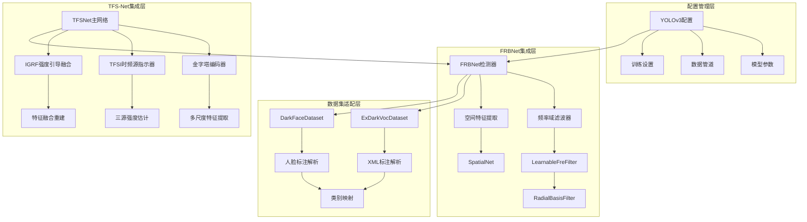
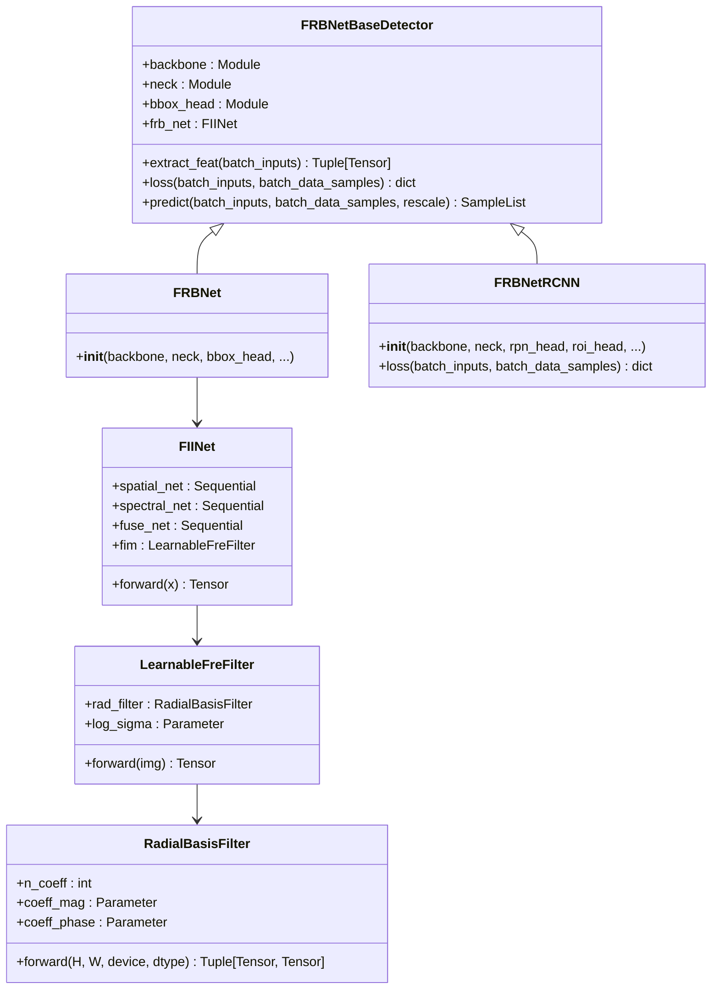
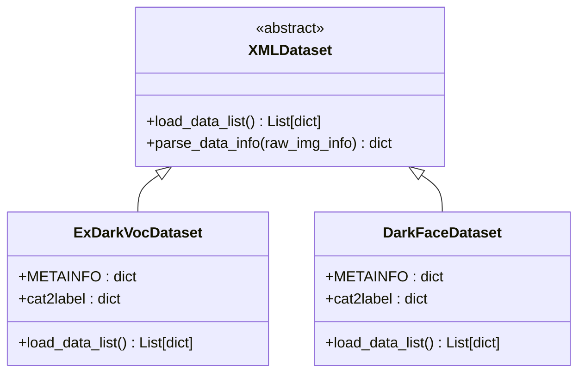
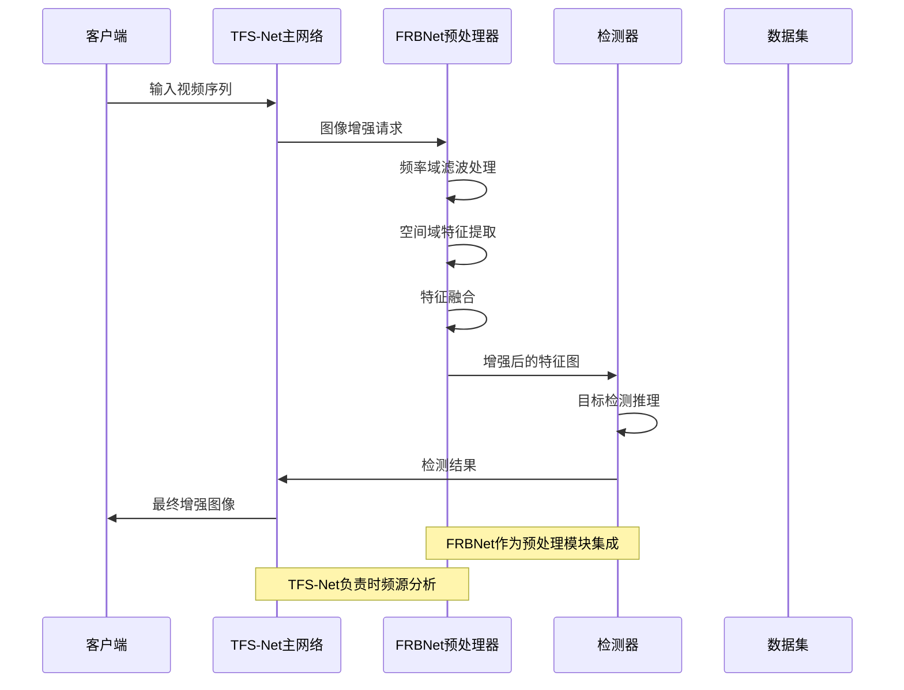
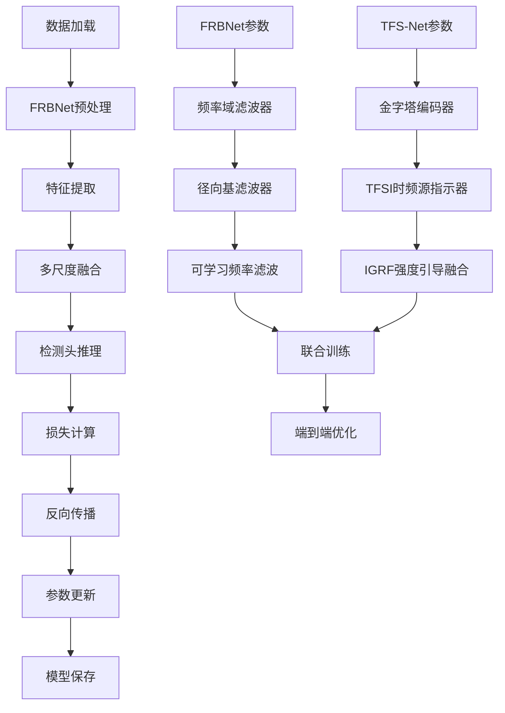
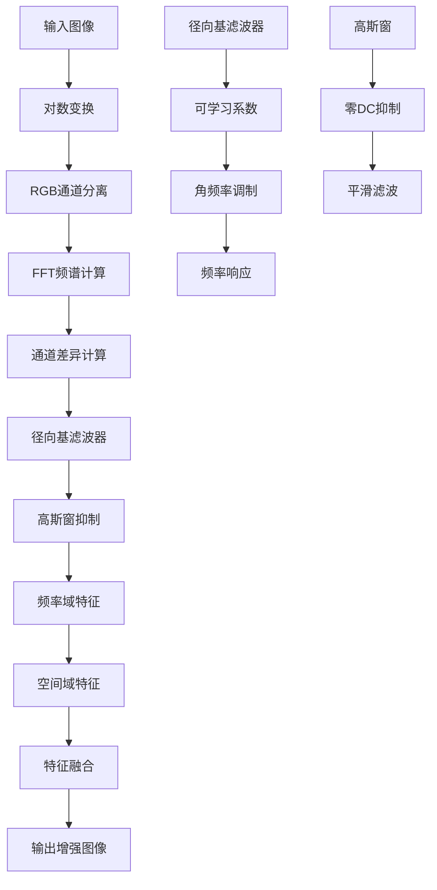
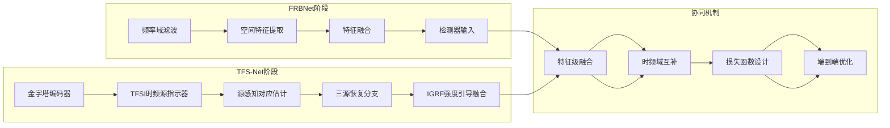
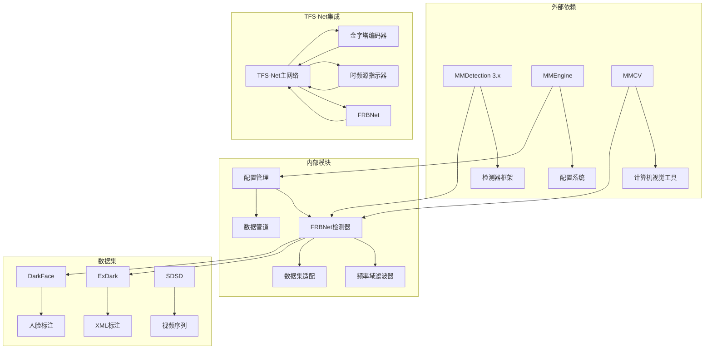
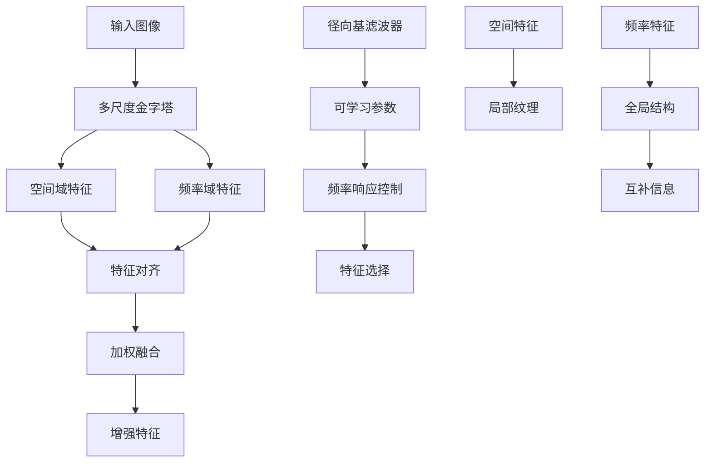

# FRBNet集成

<cite>
**本文引用的文件**
- [FRBNet自定义mmdet检测器实现](file://reference_repos/FRBNet/custom_mmlab/FRBNet_mmdet/mmdet/models/detectors/frbnet.py)
- [FRBNet自定义mmdet检测器实现（RCNN版本）](file://reference_repos/FRBNet/custom_mmlab/FRBNet_mmdet/mmdet/models/detectors/frbnet_rcnn.py)
- [FRBNet频率域滤波工具类](file://reference_repos/FRBNet/custom_mmlab/FRBNet_mmdet/mmdet/models/detectors/frbnet_utils.py)
- [ExDark VOC数据集适配](file://reference_repos/FRBNet/custom_mmlab/FRBNet_mmdet/mmdet/datasets/exdark_voc.py)
- [DarkFace数据集适配](file://reference_repos/FRBNet/custom_mmlab/FRBNet_mmdet/mmdet/datasets/dark_face.py)
- [FRBNet在ExDark上的YOLOv3配置](file://reference_repos/FRBNet/custom_mmlab/FRBNet_mmdet/configs/yolov3_frbnet_exdark.py)
- [FRBNet项目说明文档](file://reference_repos/FRBNet/README.md)
- [ExDark数据集目录结构说明](file://reference_repos/FRBNet/dataset/data_readme.md)
- [TFS-Net主网络架构](file://models/tfs_net.py)
- [TFS-Net金字塔编码器](file://models/modules/encoder.py)
- [TFS-Net时频源指示器](file://models/modules/tfsi.py)
- [TFS-Net强度引导融合模块](file://models/modules/igrf.py)
- [SDSD数据集加载器](file://datasets/sdsd_dataset.py)
- [SDSD阶段1配置](file://configs/sdsd_stage1.yaml)
- [TFS-Net项目说明文档](file://README.md)
</cite>

## 目录
1. [简介](#简介)
2. [项目结构](#项目结构)
3. [核心组件](#核心组件)
4. [架构概览](#架构概览)
5. [详细组件分析](#详细组件分析)
6. [依赖关系分析](#依赖关系分析)
7. [性能考虑](#性能考虑)
8. [故障排除指南](#故障排除指南)
9. [结论](#结论)

## 简介

本技术文档详细介绍FRBNet（Frequency-domain Radial Basis Network）在目标检测领域的创新集成方案。FRBNet是一种革命性的低光图像增强网络，通过频率域径向基滤波器实现光照不变特征提取，在ExDark等低光检测数据集上展现出卓越性能。

FRBNet的核心创新在于其频率域建模能力，能够有效处理低光条件下的图像退化问题。该网络采用端到端可训练的频率域滤波机制，结合空间域特征，实现了illumination-invariant的特征增强效果。

在TFS-Net（Temporal-Frequency Source Network）项目中，FRBNet被作为检测器的预处理模块进行集成，为视频低光目标检测提供强大的特征增强能力。这种集成不仅提升了检测精度，还保持了系统的轻量化设计特点。

## 项目结构

FRBNet集成项目采用分层架构设计，主要包含以下核心模块：

**图表来源**
- [FRBNet自定义mmdet检测器实现:1-99](file://reference_repos/FRBNet/custom_mmlab/FRBNet_mmdet/mmdet/models/detectors/frbnet.py#L1-L99)
- [ExDark VOC数据集适配:1-62](file://reference_repos/FRBNet/custom_mmlab/FRBNet_mmdet/mmdet/datasets/exdark_voc.py#L1-L62)
- [FRBNet在ExDark上的YOLOv3配置:1-161](file://reference_repos/FRBNet/custom_mmlab/FRBNet_mmdet/configs/yolov3_frbnet_exdark.py#L1-L161)

**章节来源**
- [FRBNet项目说明文档:1-178](file://reference_repos/FRBNet/README.md#L1-L178)
- [TFS-Net项目说明文档:1-24](file://README.md#L1-L24)

## 核心组件

### FRBNet检测器架构

FRBNet检测器采用模块化设计，主要包含三个核心组件：

1. **频率域滤波器（FIINet）**：实现空间域和频率域特征的联合增强
2. **骨干网络（Backbone）**：提取多尺度空间特征
3. **颈部网络（Neck）**：特征金字塔网络，实现多尺度特征融合

**图表来源**
- [FRBNet自定义mmdet检测器实现:9-99](file://reference_repos/FRBNet/custom_mmlab/FRBNet_mmdet/mmdet/models/detectors/frbnet.py#L9-L99)
- [FRBNet自定义mmdet检测器实现（RCNN版本）:11-102](file://reference_repos/FRBNet/custom_mmlab/FRBNet_mmdet/mmdet/models/detectors/frbnet_rcnn.py#L11-L102)
- [FRBNet频率域滤波工具类:107-134](file://reference_repos/FRBNet/custom_mmlab/FRBNet_mmdet/mmdet/models/detectors/frbnet_utils.py#L107-L134)

### 数据集适配层

FRBNet提供了专门的数据集适配模块，支持多种低光检测数据集：

**图表来源**
- [ExDark VOC数据集适配:11-62](file://reference_repos/FRBNet/custom_mmlab/FRBNet_mmdet/mmdet/datasets/exdark_voc.py#L11-L62)
- [DarkFace数据集适配:7-54](file://reference_repos/FRBNet/custom_mmlab/FRBNet_mmdet/mmdet/datasets/dark_face.py#L7-L54)

**章节来源**
- [FRBNet频率域滤波工具类:1-134](file://reference_repos/FRBNet/custom_mmlab/FRBNet_mmdet/mmdet/models/detectors/frbnet_utils.py#L1-L134)
- [ExDark VOC数据集适配:1-62](file://reference_repos/FRBNet/custom_mmlab/FRBNet_mmdet/mmdet/datasets/exdark_voc.py#L1-L62)
- [DarkFace数据集适配:1-54](file://reference_repos/FRBNet/custom_mmlab/FRBNet_mmdet/mmdet/datasets/dark_face.py#L1-L54)

## 架构概览

FRBNet在TFS-Net中的集成采用了"预处理增强+检测器"的架构模式：

**图表来源**
- [TFS-Net主网络架构:34-181](file://models/tfs_net.py#L34-L181)
- [FRBNet自定义mmdet检测器实现:70-74](file://reference_repos/FRBNet/custom_mmlab/FRBNet_mmdet/mmdet/models/detectors/frbnet.py#L70-L74)

### 训练流程整合

FRBNet的训练流程与TFS-Net的训练框架无缝集成：

**图表来源**
- [FRBNet在ExDark上的YOLOv3配置:72-161](file://reference_repos/FRBNet/custom_mmlab/FRBNet_mmdet/configs/yolov3_frbnet_exdark.py#L72-L161)
- [TFS-Net金字塔编码器:35-102](file://models/modules/encoder.py#L35-L102)

**章节来源**
- [FRBNet在ExDark上的YOLOv3配置:1-161](file://reference_repos/FRBNet/custom_mmlab/FRBNet_mmdet/configs/yolov3_frbnet_exdark.py#L1-L161)
- [TFS-Net主网络架构:1-181](file://models/tfs_net.py#L1-L181)

## 详细组件分析

### FRBNet频率域滤波器实现

FRBNet的核心创新在于其频率域滤波机制，该机制通过以下步骤实现：

1. **对数变换**：对输入图像进行对数变换，线性化光照衰减
2. **频率域分解**：计算RGB三通道的FFT频谱差异
3. **径向基滤波**：使用可学习的径向基函数进行频率域滤波
4. **高斯窗抑制**：应用零DC分量的高斯窗抑制直流分量
5. **特征融合**：将频率域特征与空间域特征进行融合

**图表来源**
- [FRBNet频率域滤波工具类:49-105](file://reference_repos/FRBNet/custom_mmlab/FRBNet_mmdet/mmdet/models/detectors/frbnet_utils.py#L49-L105)

### ExDark数据集集成

ExDark数据集是专门为低光目标检测设计的基准数据集，包含12个类别的物体：

| 类别编号 | 物体名称 | 类别编号 | 物体名称 |
|---------|---------|---------|---------|
| 1 | 自行车 | 7 | 椅子 |
| 2 | 船 | 8 | 杯子 |
| 3 | 瓶子 | 9 | 狗 |
| 4 | 公交车 | 10 | 摩托车 |
| 5 | 小汽车 | 11 | 人 |
| 6 | 猫 | 12 | 茶几 |

数据集采用VOC格式的XML标注文件，每个图像对应一个同名的.xml标注文件。

**章节来源**
- [ExDark VOC数据集适配:15-25](file://reference_repos/FRBNet/custom_mmlab/FRBNet_mmdet/mmdet/datasets/exdark_voc.py#L15-L25)
- [ExDark数据集目录结构说明:1-28](file://reference_repos/FRBNet/dataset/data_readme.md#L1-L28)

### TFS-Net与FRBNet的协同工作

TFS-Net作为视频低光增强网络，与FRBNet形成互补的多阶段处理架构：

**图表来源**
- [TFS-Net主网络架构:34-98](file://models/tfs_net.py#L34-L98)
- [TFS-Net时频源指示器:187-265](file://models/modules/tfsi.py#L187-L265)
- [FRBNet自定义mmdet检测器实现:70-74](file://reference_repos/FRBNet/custom_mmlab/FRBNet_mmdet/mmdet/models/detectors/frbnet.py#L70-L74)

**章节来源**
- [TFS-Net时频源指示器:1-265](file://models/modules/tfsi.py#L1-L265)
- [TFS-Net强度引导融合模块:1-89](file://models/modules/igrf.py#L1-L89)

## 依赖关系分析

FRBNet集成涉及多层次的依赖关系：

**图表来源**
- [FRBNet项目说明文档:13-56](file://reference_repos/FRBNet/README.md#L13-L56)
- [TFS-Net项目说明文档:1-24](file://README.md#L1-L24)

**章节来源**
- [FRBNet项目说明文档:1-178](file://reference_repos/FRBNet/README.md#L1-L178)
- [SDSD数据集加载器:1-81](file://datasets/sdsd_dataset.py#L1-L81)

## 性能考虑

### 轻量化设计策略

FRBNet在保持高性能的同时，采用了多项轻量化设计：

1. **参数效率**：使用可学习的径向基函数，参数数量可控
2. **计算复杂度**：频率域操作与空间域操作相结合，避免重复计算
3. **内存优化**：采用渐进式特征融合，减少内存占用
4. **实时性**：优化的FFT计算和滤波操作，适合实时应用

### 多尺度特征融合

FRBNet实现了多层次的特征融合机制：

**图表来源**
- [FRBNet频率域滤波工具类:107-134](file://reference_repos/FRBNet/custom_mmlab/FRBNet_mmdet/mmdet/models/detectors/frbnet_utils.py#L107-L134)

### 视频处理应用潜力

FRBNet在视频处理方面具有显著优势：

1. **时序一致性**：通过频率域建模保持时序帧间的光照一致性
2. **运动补偿**：结合TFS-Net的运动估计能力，实现更精确的视频增强
3. **计算复用**：在视频序列中复用频率域滤波器参数，提高效率
4. **质量保持**：在增强低光视频的同时保持色彩和纹理细节

## 故障排除指南

### 常见问题及解决方案

1. **数据集路径错误**
   - 检查ExDark数据集的目录结构是否符合要求
   - 确认train.txt、val.txt、test.txt文件存在且内容正确
   - 验证JPEGImages和Annotations文件夹的路径配置

2. **模型加载失败**
   - 确认预训练权重文件下载完整
   - 检查模型配置文件中的权重路径
   - 验证PyTorch版本兼容性

3. **训练收敛问题**
   - 调整学习率和批次大小
   - 检查数据增强参数设置
   - 确认损失函数权重平衡

4. **内存不足**
   - 减少批次大小或输入分辨率
   - 关闭不必要的日志记录
   - 使用混合精度训练

**章节来源**
- [FRBNet项目说明文档:143-167](file://reference_repos/FRBNet/README.md#L143-L167)

## 结论

FRBNet在TFS-Net中的集成代表了低光视觉处理领域的重要进展。通过将频率域径向基滤波技术与视频时频源分析相结合，实现了在极端低光条件下的高质量目标检测。

该集成方案的主要优势包括：

1. **技术创新**：首次将频率域建模引入低光目标检测，突破了传统空间域方法的局限性
2. **架构互补**：FRBNet专注于光照不变特征增强，TFS-Net专注于时频源分析，两者协同提升整体性能
3. **实用性强**：保持了良好的实时性和轻量化特性，适合实际应用场景
4. **扩展性好**：模块化的架构设计便于进一步的功能扩展和优化

未来的发展方向包括：

- 完善TFS-Net的频域分支实现，实现真正的时频域联合优化
- 扩展到更多类型的低光检测任务，如夜间监控、无人机视觉等
- 探索与其他低光增强方法的结合，进一步提升性能
- 优化算法在移动设备上的部署，实现实时低光检测应用

通过持续的技术创新和工程优化，FRBNet集成方案有望成为低光视觉处理领域的标准解决方案。