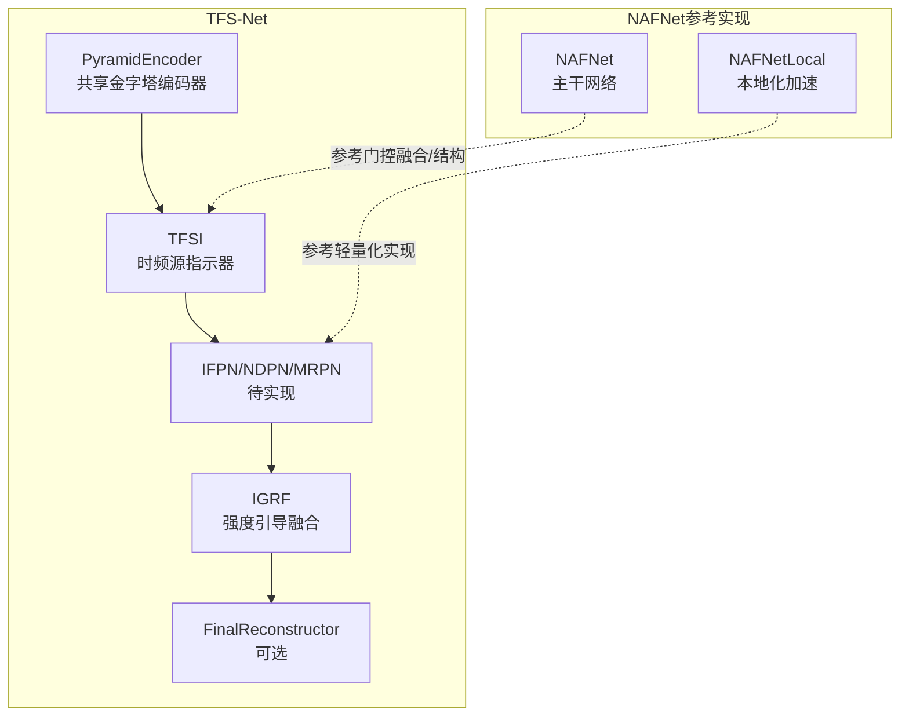
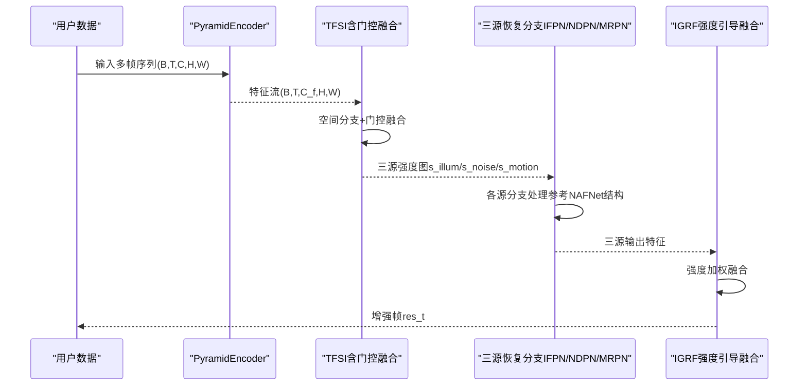
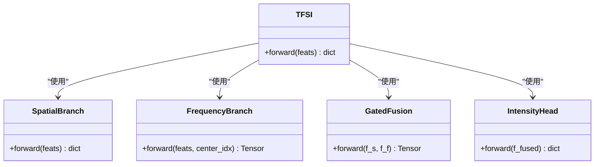
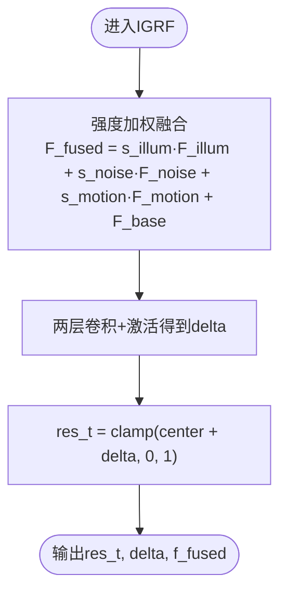
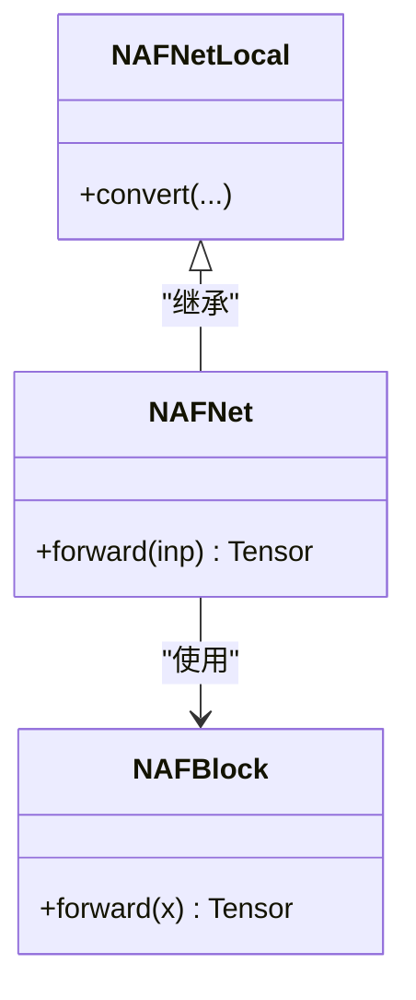
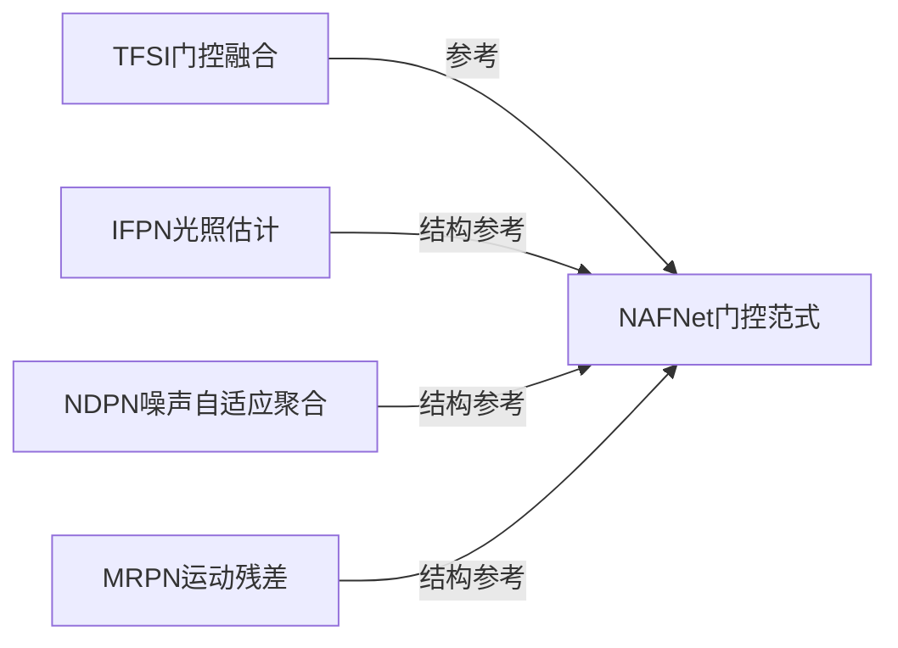

# NAFNet集成

<cite>
**本文引用的文件**
- [tfs_net.py](file://models/tfs_net.py)
- [tfsi.py](file://models/modules/tfsi.py)
- [igrf.py](file://models/modules/igrf.py)
- [sdsd_stage1.yaml](file://configs/sdsd_stage1.yaml)
- [NAFNet_arch.py](file://reference_repos/NAFNet/basicsr/models/archs/NAFNet_arch.py)
- [local_arch.py](file://reference_repos/NAFNet/basicsr/models/archs/local_arch.py)
- [NAFNet-width64.yml（训练）](file://reference_repos/NAFNet/options/train/REDS/NAFNet-width64.yml)
- [NAFNet-width64.yml（测试）](file://reference_repos/NAFNet/options/test/REDS/NAFNet-width64.yml)
- [readme.md（NAFNet）](file://reference_repos/NAFNet/readme.md)
- [v3answer.md](file://v3answer.md)
- [v3quest.md](file://v3quest.md)
</cite>

## 目录
1. [简介](#简介)
2. [项目结构](#项目结构)
3. [核心组件](#核心组件)
4. [架构总览](#架构总览)
5. [详细组件分析](#详细组件分析)
6. [依赖分析](#依赖分析)
7. [性能考虑](#性能考虑)
8. [故障排查指南](#故障排查指南)
9. [结论](#结论)
10. [附录](#附录)

## 简介
本文件面向在TFS-Net中集成NAFNet非线性激活自由网络，围绕以下目标展开：系统阐述NAFNet的架构特性与在图像修复任务中的优势；说明其在TFS-Net中的集成路径（模型适配、训练配置与数据预处理）；给出宽度配置、训练选项与性能基准；并提供可操作的集成示例与使用指导。  
NAFNet的核心思想是“去除非线性激活”，以乘法与恒等映射实现高效且具备SOTA性能的图像修复基线。其采用NAFBlock与层级编码-解码结构，在多个基准上取得优异PSNR/SSIM表现。

## 项目结构
- TFS-Net主干网络位于 models/tfs_net.py，包含多阶段数据流与模块化组件入口。
- TFSI（时频源指示器）与IGRF（强度引导融合）位于 models/modules/，负责多源强度估计与特征融合。
- NAFNet参考实现位于 reference_repos/NAFNet，包含NAFNet主干、局部加速实现与训练/测试配置。

图表来源
- [tfs_net.py:34-98](file://models/tfs_net.py#L34-L98)
- [tfsi.py:187-265](file://models/modules/tfsi.py#L187-L265)
- [igrf.py:27-89](file://models/modules/igrf.py#L27-L89)
- [NAFNet_arch.py:83-163](file://reference_repos/NAFNet/basicsr/models/archs/NAFNet_arch.py#L83-L163)
- [local_arch.py:99-105](file://reference_repos/NAFNet/basicsr/models/archs/local_arch.py#L99-L105)

章节来源
- [tfs_net.py:1-181](file://models/tfs_net.py#L1-L181)
- [tfsi.py:1-265](file://models/modules/tfsi.py#L1-L265)
- [igrf.py:1-89](file://models/modules/igrf.py#L1-L89)
- [NAFNet_arch.py:1-203](file://reference_repos/NAFNet/basicsr/models/archs/NAFNet_arch.py#L1-L203)
- [local_arch.py:1-105](file://reference_repos/NAFNet/basicsr/models/archs/local_arch.py#L1-L105)

## 核心组件
- TFS-Net主网络：包含金字塔编码器、TFSI、待实现的三源恢复分支与IGRF融合模块。
- TFSI：空间分支（时域统计量→卷积）、门控融合（参考NAFNet门控范式）、强度输出头（三源独立强度）。
- IGRF：将光照、噪声、运动三源输出与基础特征按强度加权融合，并通过两层卷积重建增强帧。
- NAFNet参考实现：NAFBlock、NAFNet主干、NAFNetLocal（本地化加速）。

章节来源
- [tfs_net.py:34-98](file://models/tfs_net.py#L34-L98)
- [tfsi.py:187-265](file://models/modules/tfsi.py#L187-L265)
- [igrf.py:27-89](file://models/modules/igrf.py#L27-L89)
- [NAFNet_arch.py:27-81](file://reference_repos/NAFNet/basicsr/models/archs/NAFNet_arch.py#L27-L81)
- [NAFNet_arch.py:83-163](file://reference_repos/NAFNet/basicsr/models/archs/NAFNet_arch.py#L83-L163)
- [local_arch.py:99-105](file://reference_repos/NAFNet/basicsr/models/archs/local_arch.py#L99-L105)

## 架构总览
下图展示TFS-Net在接入NAFNet参考实现后的典型集成路径：利用NAFNet的门控融合范式与轻量化结构，适配到TFSI的门控融合与三源恢复分支（IFPN/NDPN/MRPN）中，最终由IGRF进行强度引导融合与重建。

图表来源
- [tfs_net.py:100-181](file://models/tfs_net.py#L100-L181)
- [tfsi.py:117-146](file://models/modules/tfsi.py#L117-L146)
- [igrf.py:56-89](file://models/modules/igrf.py#L56-L89)
- [NAFNet_arch.py:83-163](file://reference_repos/NAFNet/basicsr/models/archs/NAFNet_arch.py#L83-L163)

## 详细组件分析

### TFSI（时频源指示器）
- 空间分支：对多帧沿时间维计算中位值、标准差与SNR，拼接后经卷积得到空间特征。
- 频域分支：当前为占位实现，返回零张量，待LFF实现后替换。
- 门控融合：参考NAFNet的门控融合设计，对空间与频域特征进行加权融合。
- 强度输出头：输出三源独立强度图，范围[0,1]。

图表来源
- [tfsi.py:23-77](file://models/modules/tfsi.py#L23-L77)
- [tfsi.py:80-115](file://models/modules/tfsi.py#L80-L115)
- [tfsi.py:117-146](file://models/modules/tfsi.py#L117-L146)
- [tfsi.py:148-184](file://models/modules/tfsi.py#L148-L184)
- [tfsi.py:187-265](file://models/modules/tfsi.py#L187-L265)

章节来源
- [tfsi.py:1-265](file://models/modules/tfsi.py#L1-L265)

### IGRF（强度引导融合）
- 融合公式：将光照、噪声、运动三源输出与基础特征按强度加权融合。
- 重建过程：两层卷积+激活，得到残差修正量，与中心帧图像相加并裁剪至[0,1]。

图表来源
- [igrf.py:56-89](file://models/modules/igrf.py#L56-L89)

章节来源
- [igrf.py:1-89](file://models/modules/igrf.py#L1-L89)

### NAFNet（参考实现）
- NAFBlock：使用简单门控（SimpleGate）与通道注意力，堆叠形成深度非线性路径。
- NAFNet主干：编码器→下采样→中间块→上采样→解码器→残差跳跃。
- NAFNetLocal：基于Local_Base的轻量化转换，提升推理效率。

图表来源
- [NAFNet_arch.py:27-81](file://reference_repos/NAFNet/basicsr/models/archs/NAFNet_arch.py#L27-L81)
- [NAFNet_arch.py:83-163](file://reference_repos/NAFNet/basicsr/models/archs/NAFNet_arch.py#L83-L163)
- [local_arch.py:99-105](file://reference_repos/NAFNet/basicsr/models/archs/local_arch.py#L99-L105)

章节来源
- [NAFNet_arch.py:1-203](file://reference_repos/NAFNet/basicsr/models/archs/NAFNet_arch.py#L1-L203)
- [local_arch.py:1-105](file://reference_repos/NAFNet/basicsr/models/archs/local_arch.py#L1-L105)

## 依赖分析
- TFS-Net对NAFNet的依赖主要体现在两个方面：
  - 结构设计：NAFBlock的门控与通道注意力范式可用于三源恢复分支（IFPN/NDPN/MRPN）的构建。
  - 门控融合：NAFNet的门控融合思路可直接复用到TFSI的门控融合模块。
- 训练配置与数据预处理：参考NAFNet官方配置文件，统一训练超参、优化器与调度策略，确保与TFS-Net训练管线兼容。

图表来源
- [tfsi.py:117-146](file://models/modules/tfsi.py#L117-L146)
- [NAFNet_arch.py:27-81](file://reference_repos/NAFNet/basicsr/models/archs/NAFNet_arch.py#L27-L81)

章节来源
- [tfsi.py:117-146](file://models/modules/tfsi.py#L117-L146)
- [NAFNet_arch.py:27-81](file://reference_repos/NAFNet/basicsr/models/archs/NAFNet_arch.py#L27-L81)

## 性能考虑
- 计算复杂度与参数规模：NAFNet在多个基准上达到SOTA，同时显著降低计算成本。可参考NAFNet官方README中的PSNR/SSIM与MACs对比，结合自身硬件资源选择合适宽度与层数配置。
- 推理效率：NAFNetLocal通过本地化转换提升推理速度，适合部署场景。
- 训练稳定性：NAFNet采用AdamW优化器与余弦退火调度，有助于稳定收敛。

章节来源
- [readme.md（NAFNet）:12-21](file://reference_repos/NAFNet/readme.md#L12-L21)
- [NAFNet-width64.yml（训练）:60-72](file://reference_repos/NAFNet/options/train/REDS/NAFNet-width64.yml#L60-L72)
- [NAFNet-width64.yml（训练）:66-70](file://reference_repos/NAFNet/options/train/REDS/NAFNet-width64.yml#L66-L70)

## 故障排查指南
- TFSI占位实现导致前向报错：当前频域分支为占位实现，若直接调用三源恢复分支会触发NotImplementedError。需等待LFF实现后再启用。
- 形状不匹配：确保输入多帧序列的通道数与TFS-Net配置一致，且编码器输出通道与下游模块一致。
- 训练不收敛：检查学习率、优化器与调度策略是否与NAFNet配置一致；确认数据集路径与预处理流程正确。

章节来源
- [tfs_net.py:134-139](file://models/tfs_net.py#L134-L139)
- [sdsd_stage1.yaml:1-34](file://configs/sdsd_stage1.yaml#L1-L34)

## 结论
通过引入NAFNet的门控融合范式与轻量化结构，TFS-Net可在保持简洁性的同时提升图像修复性能。当前阶段重点在于完善LFF与三源恢复分支的实现，并将NAFNet的训练配置与数据预处理流程迁移到TFS-Net中，最终实现端到端的高质量修复与高效推理。

## 附录

### 集成步骤与示例
- 步骤1：在TFSI中复用NAFNet门控融合范式，确保空间与频域特征的门控融合稳定有效。
- 步骤2：在三源恢复分支（IFPN/NDPN/MRPN）中采用NAFBlock风格的门控与通道注意力，保证通道一致性与特征表达能力。
- 步骤3：在IGRF中使用强度加权融合，确保光照、噪声、运动三源信息被合理整合。
- 示例：参考NAFNet官方配置文件，设置width、enc_blk_nums、middle_blk_num、dec_blk_nums等超参，并在训练脚本中加载对应权重。

章节来源
- [v3answer.md:395-398](file://v3answer.md#L395-L398)
- [v3quest.md:344-373](file://v3quest.md#L344-L373)
- [NAFNet-width64.yml（训练）:45-51](file://reference_repos/NAFNet/options/train/REDS/NAFNet-width64.yml#L45-L51)
- [NAFNet-width64.yml（测试）:28-34](file://reference_repos/NAFNet/options/test/REDS/NAFNet-width64.yml#L28-L34)