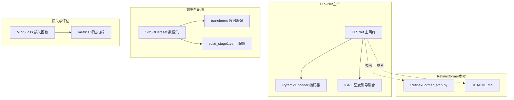
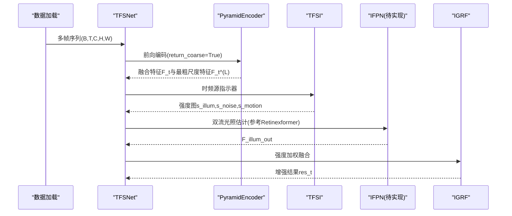
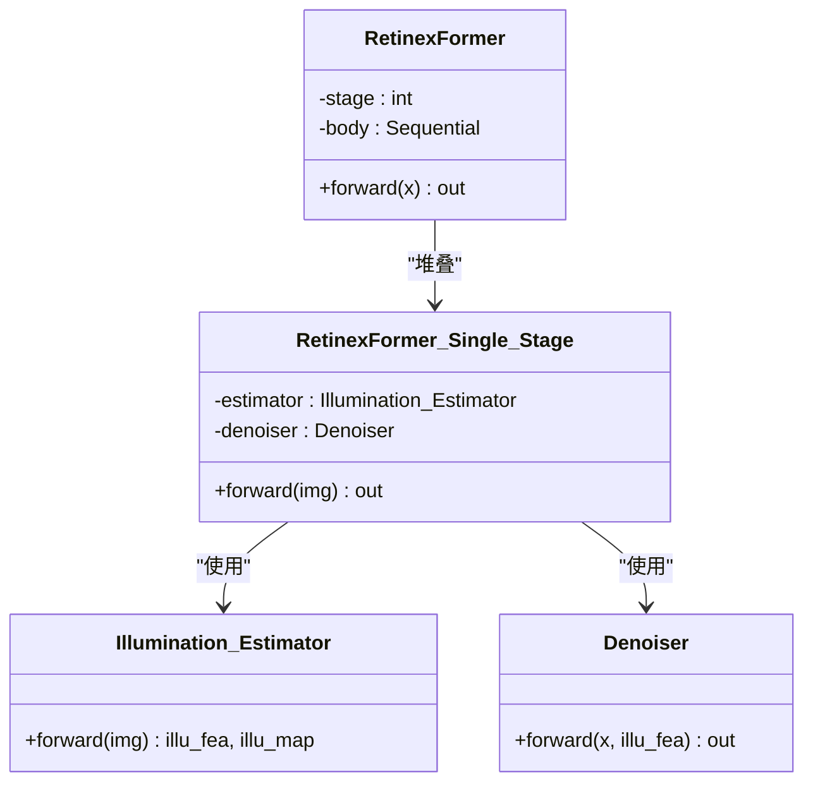
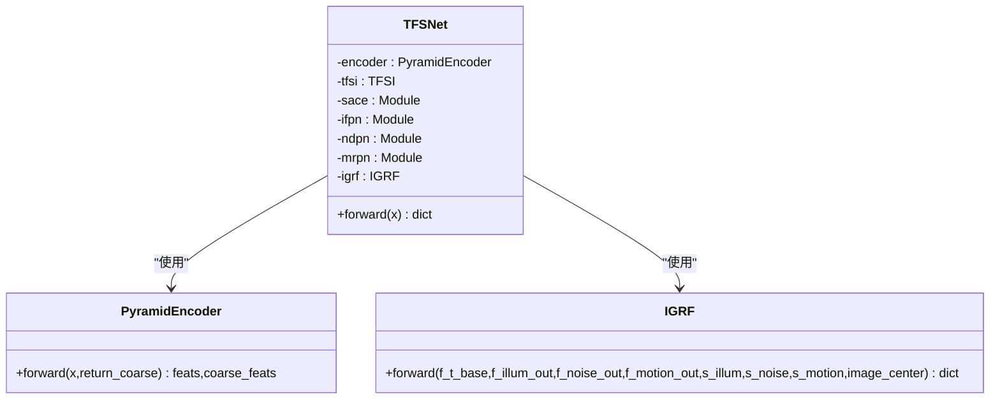
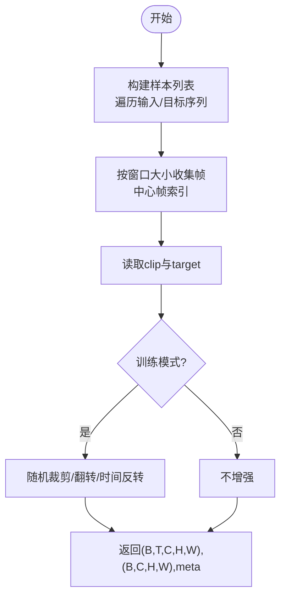
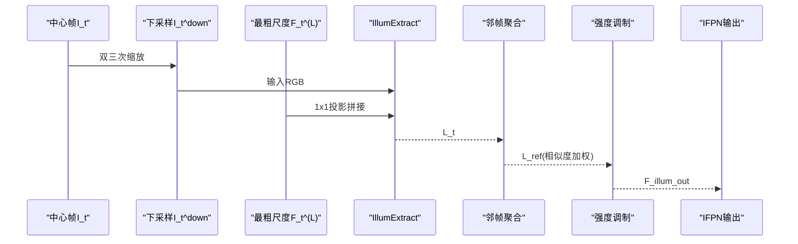
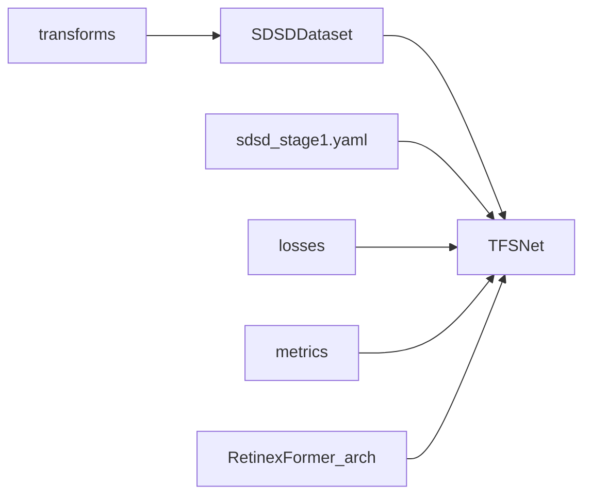

# Retinexformer集成

<cite>
**本文档引用的文件**
- [tfs_net.py](file://models/tfs_net.py)
- [sdsd_dataset.py](file://datasets/sdsd_dataset.py)
- [sdsd_stage1.yaml](file://configs/sdsd_stage1.yaml)
- [encoder.py](file://models/modules/encoder.py)
- [igrf.py](file://models/modules/igrf.py)
- [reconstruction.py](file://models/modules/reconstruction.py)
- [transforms.py](file://datasets/transforms.py)
- [losses.py](file://losses/losses.py)
- [metrics.py](file://utils/metrics.py)
- [v3quest.md](file://v3quest.md)
- [v3answer.md](file://v3answer.md)
- [RetinexFormer_arch.py](file://reference_repos/Retinexformer/basicsr/models/archs/RetinexFormer_arch.py)
- [README.md](file://reference_repos/Retinexformer/README.md)
</cite>

## 目录
1. [引言](#引言)
2. [项目结构](#项目结构)
3. [核心组件](#核心组件)
4. [架构总览](#架构总览)
5. [详细组件分析](#详细组件分析)
6. [依赖关系分析](#依赖关系分析)
7. [性能考虑](#性能考虑)
8. [故障排除指南](#故障排除指南)
9. [结论](#结论)
10. [附录](#附录)

## 引言
本文件面向Retinexformer在TFS-Net中的集成，系统阐述基于Retinex理论的图像增强架构及其在低光环境的应用策略。文档聚焦以下目标：
- 解释Retinex理论基础、多尺度变换与增强效果评估方法
- 说明Retinexformer在TFS-Net中的集成策略：SDSD数据集处理、模型架构适配与训练配置
- 提供从代码层面到系统流程的完整技术路线，帮助读者快速理解并实现Retinexformer与TFS-Net的协同

## 项目结构
本项目采用模块化组织，围绕“时频源网络”TFS-Net展开，包含数据集、模型模块、损失函数与评估工具等。Retinexformer作为低光增强的参考实现，位于`reference_repos/Retinexformer`目录，提供光照估计器、去噪器与多阶段增强的完整实现。

图表来源
- [tfs_net.py:34-98](file://models/tfs_net.py#L34-L98)
- [encoder.py:35-102](file://models/modules/encoder.py#L35-L102)
- [igrf.py:27-89](file://models/modules/igrf.py#L27-L89)
- [sdsd_dataset.py:18-81](file://datasets/sdsd_dataset.py#L18-L81)
- [sdsd_stage1.yaml:1-34](file://configs/sdsd_stage1.yaml#L1-L34)
- [transforms.py:6-32](file://datasets/transforms.py#L6-L32)
- [losses.py:80-114](file://losses/losses.py#L80-L114)
- [metrics.py:8-18](file://utils/metrics.py#L8-L18)
- [RetinexFormer_arch.py:95-371](file://reference_repos/Retinexformer/basicsr/models/archs/RetinexFormer_arch.py#L95-L371)
- [README.md:1-580](file://reference_repos/Retinexformer/README.md#L1-L580)

章节来源
- [tfs_net.py:34-98](file://models/tfs_net.py#L34-L98)
- [encoder.py:35-102](file://models/modules/encoder.py#L35-L102)
- [igrf.py:27-89](file://models/modules/igrf.py#L27-L89)
- [sdsd_dataset.py:18-81](file://datasets/sdsd_dataset.py#L18-L81)
- [sdsd_stage1.yaml:1-34](file://configs/sdsd_stage1.yaml#L1-L34)
- [transforms.py:6-32](file://datasets/transforms.py#L6-L32)
- [losses.py:80-114](file://losses/losses.py#L80-L114)
- [metrics.py:8-18](file://utils/metrics.py#L8-L18)
- [RetinexFormer_arch.py:95-371](file://reference_repos/Retinexformer/basicsr/models/archs/RetinexFormer_arch.py#L95-L371)
- [README.md:1-580](file://reference_repos/Retinexformer/README.md#L1-L580)

## 核心组件
- TFSNet主网络：包含金字塔编码器、时频源指示器、待实现的源感知对应估计(SACE)、三源恢复分支(IFPN/NDPN/MRPN)与强度引导融合(IGRF)。
- SDSDDataset：支持时序窗口裁剪、随机翻转与时间反转的数据增强，适配TFS-Net的多帧输入格式。
- 损失函数与评估：MINSLoss结合像素L1、SSIM、感知损失与TV先验；评估指标提供PSNR与SSIM。
- Retinexformer参考：提供光照估计器(Illumination_Estimator)与去噪器(Denoiser)的实现，为IFPN分支提供结构参考。

章节来源
- [tfs_net.py:14-21](file://models/tfs_net.py#L14-L21)
- [sdsd_dataset.py:18-51](file://datasets/sdsd_dataset.py#L18-L51)
- [losses.py:80-114](file://losses/losses.py#L80-L114)
- [metrics.py:8-18](file://utils/metrics.py#L8-L18)
- [RetinexFormer_arch.py:95-371](file://reference_repos/Retinexformer/basicsr/models/archs/RetinexFormer_arch.py#L95-L371)

## 架构总览
TFS-Net v3采用五阶段数据流：金字塔编码器→时频源指示器→SACE→三源恢复分支→IGRF。当前阶段实现与待实现状态如下：
- 已实现：编码器返回融合特征与最粗尺度特征；IGRF强度引导融合。
- 待实现：SACE、IFPN、NDPN、MRPN，其中IFPN依赖Retinexformer的光照估计器结构与特征定义。

图表来源
- [tfs_net.py:100-181](file://models/tfs_net.py#L100-L181)
- [encoder.py:76-102](file://models/modules/encoder.py#L76-L102)
- [igrf.py:56-89](file://models/modules/igrf.py#L56-L89)

章节来源
- [tfs_net.py:100-181](file://models/tfs_net.py#L100-L181)
- [encoder.py:76-102](file://models/modules/encoder.py#L76-L102)
- [igrf.py:56-89](file://models/modules/igrf.py#L56-L89)

## 详细组件分析

### Retinex理论基础与多尺度增强
- 光照估计器(Illumination_Estimator)：以4通道输入(3通道RGB+1通道均值通道)经1×1卷积→深度卷积→1×1卷积生成光照特征与光照图，不进行Sigmoid归一化，返回中间特征与光照图。
- 去噪器(Denoiser)：采用多尺度特征金字塔，结合光照特征进行条件去噪，最终残差加回输入特征。
- 多阶段增强：Retinexformer单阶段由光照估计与去噪组成，多阶段堆叠形成更强的增强能力。

图表来源
- [RetinexFormer_arch.py:95-122](file://reference_repos/Retinexformer/basicsr/models/archs/RetinexFormer_arch.py#L95-L122)
- [RetinexFormer_arch.py:233-322](file://reference_repos/Retinexformer/basicsr/models/archs/RetinexFormer_arch.py#L233-L322)
- [RetinexFormer_arch.py:324-361](file://reference_repos/Retinexformer/basicsr/models/archs/RetinexFormer_arch.py#L324-L361)

章节来源
- [RetinexFormer_arch.py:95-122](file://reference_repos/Retinexformer/basicsr/models/archs/RetinexFormer_arch.py#L95-L122)
- [RetinexFormer_arch.py:233-322](file://reference_repos/Retinexformer/basicsr/models/archs/RetinexFormer_arch.py#L233-L322)
- [RetinexFormer_arch.py:324-361](file://reference_repos/Retinexformer/basicsr/models/archs/RetinexFormer_arch.py#L324-L361)

### TFS-Net主网络与模块
- TFSNet：包含编码器、TFSI、待实现的SACE、IFPN/NDPN/MRPN与IGRF。当前阶段实现与占位符注释明确标注了IFPN对IllumExtract与F_t^(L)的依赖。
- IGRF：实现强度加权融合与残差重建，支持将IFPN/NDPN/MRPN输出与编码器特征融合。
- 编码器：返回融合特征与最粗尺度特征，为IFPN双流提供输入。

图表来源
- [tfs_net.py:34-98](file://models/tfs_net.py#L34-L98)
- [igrf.py:27-89](file://models/modules/igrf.py#L27-L89)
- [encoder.py:35-102](file://models/modules/encoder.py#L35-L102)

章节来源
- [tfs_net.py:34-98](file://models/tfs_net.py#L34-L98)
- [igrf.py:27-89](file://models/modules/igrf.py#L27-L89)
- [encoder.py:35-102](file://models/modules/encoder.py#L35-L102)

### SDSD数据集处理与训练配置
- SDSDDataset：构建序列样本，支持时序窗口收集、随机裁剪、翻转与时间反转，输出多帧clip与中心帧target。
- sdsd_stage1.yaml：定义训练输入/目标根路径、窗口大小、裁剪尺寸、批大小、学习率、权重衰减、混合精度、日志与验证间隔、评估瓦片大小与重叠、损失权重等超参数。
- transforms：提供随机裁剪、翻转与时间反转的数据增强策略。

图表来源
- [sdsd_dataset.py:29-81](file://datasets/sdsd_dataset.py#L29-L81)
- [transforms.py:6-32](file://datasets/transforms.py#L6-L32)
- [sdsd_stage1.yaml:3-34](file://configs/sdsd_stage1.yaml#L3-L34)

章节来源
- [sdsd_dataset.py:18-81](file://datasets/sdsd_dataset.py#L18-L81)
- [transforms.py:6-32](file://datasets/transforms.py#L6-L32)
- [sdsd_stage1.yaml:1-34](file://configs/sdsd_stage1.yaml#L1-L34)

### 模型架构适配与IFPN集成策略
- IFPN设计要点：
  - IllumExtract结构：参考Retinexformer的Illumination_Estimator，采用4通道输入(含均值通道)，1×1→深度卷积→1×1的轻量结构，不使用Sigmoid归一化，返回中间特征与光照图。
  - 双流设计：IllumExtract接收下采样中心帧与最粗尺度特征拼接，输出光照图L_t；邻帧参考光照L_ref通过相似度权重聚合；强度调制矫正公式将L_ref与L_t结合，得到光照归一化后的特征。
  - F_t^(L)定义：当前编码器仅有两次stride=2，l3分辨率为H/4×W/4，与v3文档的H/8×W/8不一致，需澄清或调整编码器结构。
- SACE与NDPN/MRPN：SACE依赖LFF与可变形注意力；NDPN使用SACE注意力图进行SNR自适应聚合；MRPN用于运动残差处理，v2设计细节缺失。

图表来源
- [v3quest.md:77-106](file://v3quest.md#L77-L106)
- [v3answer.md:148-171](file://v3answer.md#L148-L171)
- [RetinexFormer_arch.py:95-122](file://reference_repos/Retinexformer/basicsr/models/archs/RetinexFormer_arch.py#L95-L122)

章节来源
- [v3quest.md:77-106](file://v3quest.md#L77-L106)
- [v3answer.md:148-171](file://v3answer.md#L148-L171)
- [RetinexFormer_arch.py:95-122](file://reference_repos/Retinexformer/basicsr/models/archs/RetinexFormer_arch.py#L95-L122)

### 增强效果评估方法
- 指标：PSNR与SSIM，基于像素张量计算，适合批量评估。
- 损失：MINSLoss包含像素L1、SSIM、感知损失与TV先验，兼顾重建质量与先验平滑性。
- 测试策略：参考Retinexformer提供的自集成测试策略与相同设置下的对比测试选项。

章节来源
- [metrics.py:8-18](file://utils/metrics.py#L8-L18)
- [losses.py:80-114](file://losses/losses.py#L80-L114)
- [README.md:420-480](file://reference_repos/Retinexformer/README.md#L420-L480)

## 依赖关系分析
- TFSNet依赖编码器与IGRF模块；编码器返回融合特征与最粗尺度特征，为IFPN提供输入；IGRF负责融合与重建。
- 数据集与配置文件为训练提供输入与超参数；损失函数与评估工具支撑训练优化与结果评价。
- Retinexformer作为结构参考，其Illumination_Estimator与Denoiser为IFPN与后续模块提供实现思路。

图表来源
- [tfs_net.py:34-98](file://models/tfs_net.py#L34-L98)
- [sdsd_dataset.py:18-81](file://datasets/sdsd_dataset.py#L18-L81)
- [sdsd_stage1.yaml:1-34](file://configs/sdsd_stage1.yaml#L1-L34)
- [transforms.py:6-32](file://datasets/transforms.py#L6-L32)
- [losses.py:80-114](file://losses/losses.py#L80-L114)
- [metrics.py:8-18](file://utils/metrics.py#L8-L18)
- [RetinexFormer_arch.py:95-371](file://reference_repos/Retinexformer/basicsr/models/archs/RetinexFormer_arch.py#L95-L371)

章节来源
- [tfs_net.py:34-98](file://models/tfs_net.py#L34-L98)
- [sdsd_dataset.py:18-81](file://datasets/sdsd_dataset.py#L18-L81)
- [sdsd_stage1.yaml:1-34](file://configs/sdsd_stage1.yaml#L1-L34)
- [transforms.py:6-32](file://datasets/transforms.py#L6-L32)
- [losses.py:80-114](file://losses/losses.py#L80-L114)
- [metrics.py:8-18](file://utils/metrics.py#L8-L18)
- [RetinexFormer_arch.py:95-371](file://reference_repos/Retinexformer/basicsr/models/archs/RetinexFormer_arch.py#L95-L371)

## 性能考虑
- 训练稳定性：混合精度训练与梯度裁剪有助于提升收敛速度与显存占用；建议在高分辨率场景下启用AMP。
- 数据增强：随机裁剪、翻转与时间反转可提升泛化能力，但需注意边界效应与时序一致性。
- 模型复杂度：Retinexformer的光照估计器与去噪器结构相对轻量，适合嵌入IFPN作为双流分支的光照估计子模块。
- 计算开销：SACE与NDPN/MRPN涉及跨帧注意力与相似度计算，需平衡窗口大小与采样点数以控制成本。

## 故障排除指南
- 数据维度不匹配：确保输入多帧序列满足奇数窗口且中心帧索引正确；检查编码器输出形状与IGRF输入通道数一致。
- IllumExtract结构不匹配：严格遵循Retinexformer的4通道输入与中间特征输出约定，避免Sigmoid归一化导致光照图范围异常。
- F_t^(L)分辨率不一致：当前编码器l3分辨率为H/4×W/4，与v3文档的H/8×W/8不符，需调整编码器或修改IFPN设计。
- 训练不稳定：适当降低学习率、启用梯度裁剪与混合精度；检查损失权重与数据增强策略。

章节来源
- [tfs_net.py:115-139](file://models/tfs_net.py#L115-L139)
- [v3quest.md:102-106](file://v3quest.md#L102-L106)
- [sdsd_stage1.yaml:16-27](file://configs/sdsd_stage1.yaml#L16-L27)

## 结论
Retinexformer为TFS-Net在低光增强场景提供了坚实的理论与实现基础。通过将Retinex光照估计器引入IFPN双流分支，并结合编码器的多尺度特征与IGRF的强度引导融合，可实现高质量的时序增强。当前阶段主要障碍在于SACE、NDPN与MRPN的实现细节与编码器分辨率一致性问题，建议优先完成这些模块的设计与实现，再推进IFPN的集成与训练。

## 附录
- 参考实现与测试：Retinexformer提供完整的训练与测试脚本、配置文件与预训练权重，可作为TFS-Net集成的对照与验证依据。
- 数据准备：SDSD等数据集的组织方式与下载链接可参考Retinexformer的README，确保输入格式与增强策略一致。

章节来源
- [README.md:184-210](file://reference_repos/Retinexformer/README.md#L184-L210)
- [README.md:420-480](file://reference_repos/Retinexformer/README.md#L420-L480)