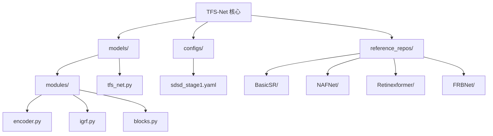
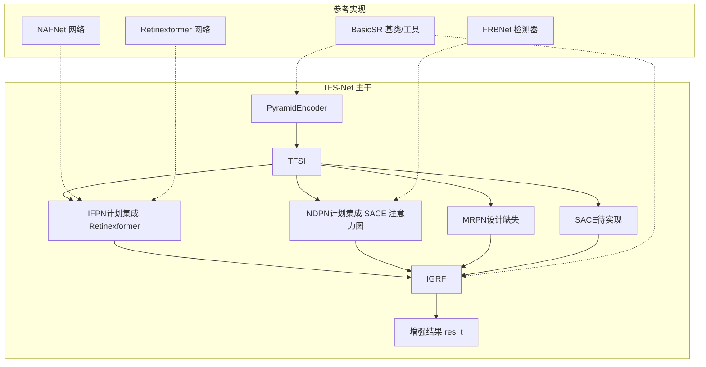
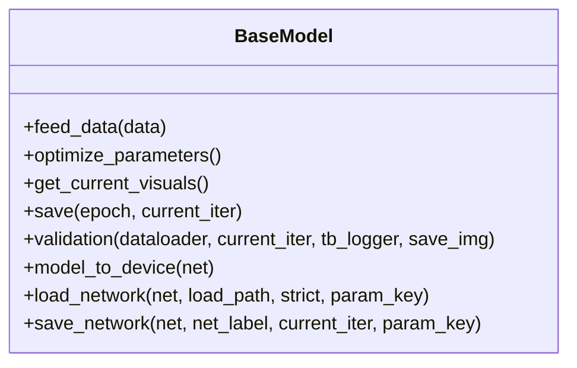
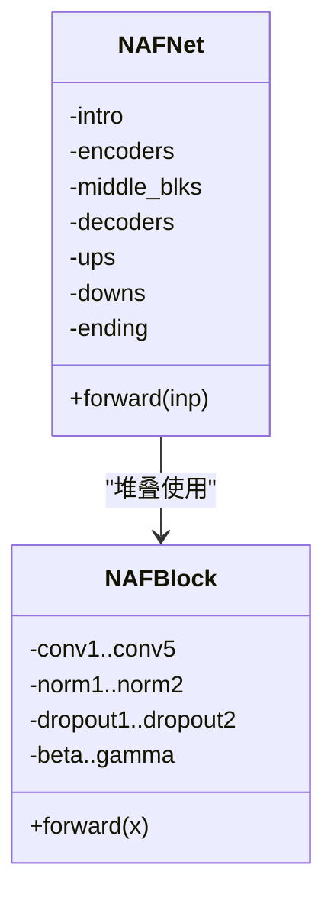
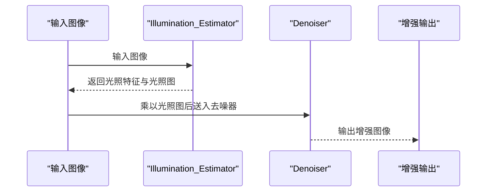
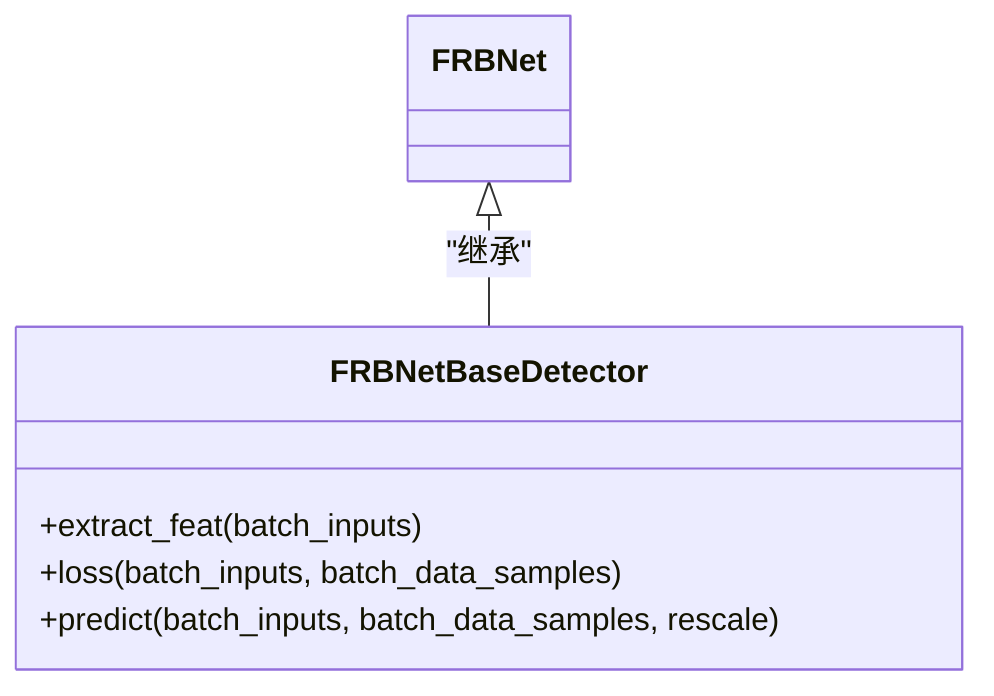
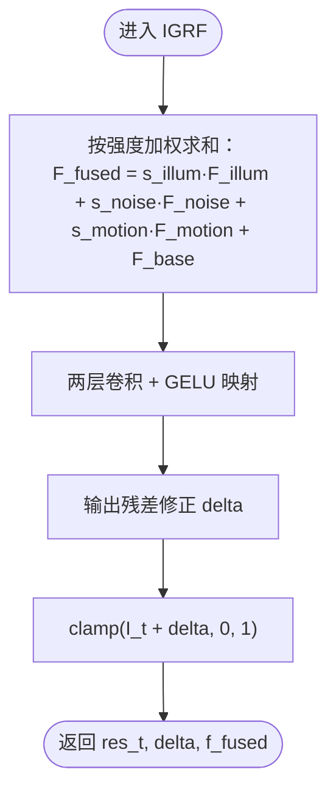
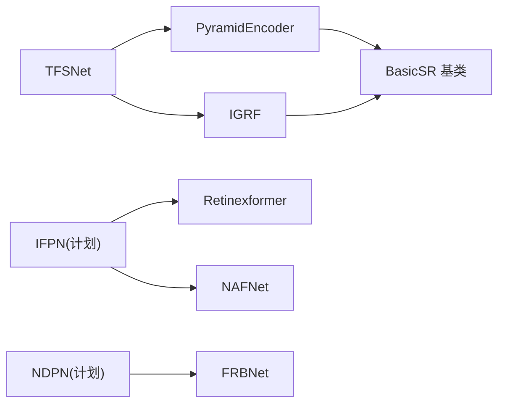

# 参考实现集成

<cite>
**本文引用的文件**
- [README.md](file://README.md)
- [tfs_net.py](file://models/tfs_net.py)
- [encoder.py](file://models/modules/encoder.py)
- [igrf.py](file://models/modules/igrf.py)
- [blocks.py](file://models/modules/blocks.py)
- [sdsd_stage1.yaml](file://configs/sdsd_stage1.yaml)
- [BasicSR/README.md](file://reference_repos/BasicSR/README.md)
- [NAFNet/readme.md](file://reference_repos/NAFNet/readme.md)
- [Retinexformer/README.md](file://reference_repos/Retinexformer/README.md)
- [FRBNet/README.md](file://reference_repos/FRBNet/README.md)
- [BasicSR/models/base_model.py](file://reference_repos/BasicSR/basicsr/models/base_model.py)
- [NAFNet/archs/NAFNet_arch.py](file://reference_repos/NAFNet/basicsr/models/archs/NAFNet_arch.py)
- [Retinexformer/archs/RetinexFormer_arch.py](file://reference_repos/Retinexformer/basicsr/models/archs/RetinexFormer_arch.py)
- [FRBNet/frbnet.py](file://reference_repos/FRBNet/custom_mmlab/FRBNet_mmdet/mmdet/models/detectors/frbnet.py)
- [NAFNet/options/test/SIDD/NAFNet-width64.yml](file://reference_repos/NAFNet/options/test/SIDD/NAFNet-width64.yml)
- [Retinexformer/Options/RetinexFormer_LOL_v1.yml](file://reference_repos/Retinexformer/Options/RetinexFormer_LOL_v1.yml)
- [FRBNet/configs/yolov3_frbnet_exdark.py](file://reference_repos/FRBNet/custom_mmlab/FRBNet_mmdet/configs/yolov3_frbnet_exdark.py)
</cite>

## 目录
1. [简介](#简介)
2. [项目结构](#项目结构)
3. [核心组件](#核心组件)
4. [架构总览](#架构总览)
5. [详细组件分析](#详细组件分析)
6. [依赖分析](#依赖分析)
7. [性能考虑](#性能考虑)
8. [故障排查指南](#故障排查指南)
9. [结论](#结论)
10. [附录](#附录)

## 简介
本文件面向“参考实现集成”的技术目标，系统梳理并整合以下开源参考项目至 TFS-Net 的可运行框架中：
- BasicSR：统一的图像/视频修复训练与推理基础设施，提供模型基类、数据集、损失、指标与分布式训练能力。
- NAFNet：非线性激活自由的图像修复基线网络，具备高效与高精度特性，适合作为增强分支或去噪子模块。
- Retinexformer：基于Retinex先验与Transformer的低光增强方法，提供光照估计与多阶段去噪模块，适合构建 IFPN（双流光照估计）分支。
- FRBNet：面向低光场景的频率域径向基网络，可作为检测/分割等下游任务的特征增强模块。

本文件将给出各参考项目的集成步骤、配置调整要点、兼容性说明，并提供扩展与定制的参考模板，帮助开发者快速在 TFS-Net 中落地这些参考实现。

## 项目结构
TFS-Net 采用分层组织：顶层为训练/推理入口与配置；models 子目录包含主干网络与模块；datasets/losses 等提供数据与损失；reference_repos 存放参考实现仓库副本以便直接调用其模型与工具。

图示来源
- [tfs_net.py:1-181](file://models/tfs_net.py#L1-L181)
- [encoder.py:1-102](file://models/modules/encoder.py#L1-L102)
- [igrf.py:1-89](file://models/modules/igrf.py#L1-L89)
- [blocks.py:1-110](file://models/modules/blocks.py#L1-L110)
- [sdsd_stage1.yaml:1-34](file://configs/sdsd_stage1.yaml#L1-L34)

章节来源
- [README.md:1-24](file://README.md#L1-L24)
- [tfs_net.py:1-181](file://models/tfs_net.py#L1-L181)

## 核心组件
- TFSNet 主干：包含金字塔编码器、时频源指示器（TFSI）、强度引导融合（IGRF），以及预留的 SACE、IFPN、NDPN、MRPN 等模块占位。
- 编码器（PyramidEncoder）：多尺度特征提取与横向连接融合，支持返回最粗尺度特征以供 IFPN 使用。
- IGRF：对三源分支输出进行强度加权融合并重建增强图像。
- 基础模块（blocks）：通用卷积块、残差块、层归一化与窗口划分/还原等工具函数。

章节来源
- [tfs_net.py:34-181](file://models/tfs_net.py#L34-L181)
- [encoder.py:35-102](file://models/modules/encoder.py#L35-L102)
- [igrf.py:27-89](file://models/modules/igrf.py#L27-L89)
- [blocks.py:8-110](file://models/modules/blocks.py#L8-L110)

## 架构总览
TFS-Net 的五阶段数据流与参考实现的集成关系如下：

图示来源
- [tfs_net.py:62-98](file://models/tfs_net.py#L62-L98)
- [encoder.py:35-102](file://models/modules/encoder.py#L35-L102)
- [igrf.py:27-89](file://models/modules/igrf.py#L27-L89)
- [NAFNet/archs/NAFNet_arch.py:83-163](file://reference_repos/NAFNet/basicsr/models/archs/NAFNet_arch.py#L83-L163)
- [Retinexformer/archs/RetinexFormer_arch.py:343-361](file://reference_repos/Retinexformer/basicsr/models/archs/RetinexFormer_arch.py#L343-L361)
- [FRBNet/frbnet.py:9-99](file://reference_repos/FRBNet/custom_mmlab/FRBNet_mmdet/mmdet/models/detectors/frbnet.py#L9-L99)

## 详细组件分析

### BasicSR 集成
- 作用：提供统一的模型基类、训练/验证流程、分布式训练、优化器/调度器、日志与权重保存等基础设施。
- 集成点：
  - 训练/验证循环可直接复用其 BaseModel 的 save/load、validation、分布式封装等能力。
  - 数据加载、指标计算、配置解析等均可沿用 BasicSR 的标准流程。
- 配置与兼容性：
  - 保持 opt 字典结构一致，确保 num_gpu、dist、path 等字段可用。
  - 若需分布式训练，遵循 BasicSR 的 dist_util 与 DistributedDataParallel 包装方式。

图示来源
- [BasicSR/models/base_model.py:13-393](file://reference_repos/BasicSR/basicsr/models/base_model.py#L13-L393)

章节来源
- [BasicSR/README.md:1-124](file://reference_repos/BasicSR/README.md#L1-L124)
- [BasicSR/models/base_model.py:13-393](file://reference_repos/BasicSR/basicsr/models/base_model.py#L13-L393)

### NAFNet 集成
- 作用：作为图像修复/去噪的骨干网络，可直接替换或拼接至 TFS-Net 的增强分支。
- 集成方式：
  - 将 NAFNet 模块嵌入 IFPN 或独立作为去噪子模块。
  - 使用 NAFNet 的 forward 输出作为 IFPN 的特征输入之一。
- 配置要点：
  - 网络宽度 width、编码器/解码器层数 enc_blk_nums/dec_blk_nums 需与下游任务匹配。
  - 测试配置示例见 NAFNet-options，便于迁移预训练权重与评估指标。

图示来源
- [NAFNet/archs/NAFNet_arch.py:83-163](file://reference_repos/NAFNet/basicsr/models/archs/NAFNet_arch.py#L83-L163)

章节来源
- [NAFNet/readme.md:1-150](file://reference_repos/NAFNet/readme.md#L1-L150)
- [NAFNet/archs/NAFNet_arch.py:83-163](file://reference_repos/NAFNet/basicsr/models/archs/NAFNet_arch.py#L83-L163)
- [NAFNet/options/test/SIDD/NAFNet-width64.yml:28-38](file://reference_repos/NAFNet/options/test/SIDD/NAFNet-width64.yml#L28-L38)

### Retinexformer 集成
- 作用：提供光照估计与多阶段去噪模块，适合构建 IFPN 的双流光照估计分支。
- 集成方式：
  - 使用 Illumination_Estimator 获取光照特征与光照图。
  - 将估计得到的光照特征作为 Denoiser 的条件输入，实现光照引导的去噪。
  - 将 RetinexFormer 的输出作为 IFPN 的光照引导特征分支。
- 关键流程（单阶段）：

图示来源
- [Retinexformer/archs/RetinexFormer_arch.py:324-361](file://reference_repos/Retinexformer/basicsr/models/archs/RetinexFormer_arch.py#L324-L361)

章节来源
- [Retinexformer/README.md:1-580](file://reference_repos/Retinexformer/README.md#L1-L580)
- [Retinexformer/archs/RetinexFormer_arch.py:95-361](file://reference_repos/Retinexformer/basicsr/models/archs/RetinexFormer_arch.py#L95-L361)
- [Retinexformer/Options/RetinexFormer_LOL_v1.yml:52-58](file://reference_repos/Retinexformer/Options/RetinexFormer_LOL_v1.yml#L52-L58)

### FRBNet 集成
- 作用：频率域径向基网络，可作为检测/分割等下游任务的特征增强模块，适合与 SACE 注意力图结合用于 NDPN。
- 集成方式：
  - 在 FRBNetBaseDetector 中，FIINet 对输入图像进行频率域增强，随后进入 backbone 与 neck。
  - 将 FRBNet 的特征输出与 SACE 注意力图结合，作为 NDPN 的输入。
- 配置要点：
  - 使用 MMDetection 配置文件定义 YOLOv3 结构与数据集路径。
  - 通过自定义数据集注册与检测头配置完成端到端训练/测试。

图示来源
- [FRBNet/frbnet.py:9-99](file://reference_repos/FRBNet/custom_mmlab/FRBNet_mmdet/mmdet/models/detectors/frbnet.py#L9-L99)

章节来源
- [FRBNet/README.md:1-178](file://reference_repos/FRBNet/README.md#L1-L178)
- [FRBNet/frbnet.py:9-99](file://reference_repos/FRBNet/custom_mmlab/FRBNet_mmdet/mmdet/models/detectors/frbnet.py#L9-L99)
- [FRBNet/configs/yolov3_frbnet_exdark.py:12-60](file://reference_repos/FRBNet/custom_mmlab/FRBNet_mmdet/configs/yolov3_frbnet_exdark.py#L12-L60)

### IGRF 融合模块
- 作用：将光照、噪声、运动三源分支与基础特征按强度加权融合，重建增强图像。
- 集成建议：
  - IFPN/NDPN/MRPN 输出通道需与 IGRF 的通道数一致（默认 C_f）。
  - F_t^base 可暂时使用编码器融合特征作为基底。

图示来源
- [igrf.py:56-89](file://models/modules/igrf.py#L56-L89)

章节来源
- [igrf.py:27-89](file://models/modules/igrf.py#L27-L89)

### 编码器与窗口划分工具
- 编码器：多尺度下采样与横向连接，支持返回最粗尺度特征以供 IFPN 使用。
- 工具函数：窗口划分/还原、层归一化、余弦相似度等，支撑视频窗口注意力与稳定性。

章节来源
- [encoder.py:35-102](file://models/modules/encoder.py#L35-L102)
- [blocks.py:32-110](file://models/modules/blocks.py#L32-L110)

## 依赖分析
- 组件耦合：
  - TFSNet 的 Stage 1/2 与参考实现耦合度较低，主要通过接口约定（特征维度、形状）衔接。
  - Stage 3/4/5 仍处于设计/实现初期，与参考实现的耦合点集中在 IFPN（Retinexformer/NAFNet）、NDPN（SACE+FRBNet）与 IGRF。
- 外部依赖：
  - BasicSR 提供训练/验证基础设施与分布式支持。
  - NAFNet/Retinexformer 提供网络结构与预训练权重。
  - FRBNet 提供检测器框架与频率域增强模块。

图示来源
- [tfs_net.py:62-98](file://models/tfs_net.py#L62-L98)
- [encoder.py:35-102](file://models/modules/encoder.py#L35-L102)
- [igrf.py:27-89](file://models/modules/igrf.py#L27-L89)
- [NAFNet/archs/NAFNet_arch.py:83-163](file://reference_repos/NAFNet/basicsr/models/archs/NAFNet_arch.py#L83-L163)
- [Retinexformer/archs/RetinexFormer_arch.py:343-361](file://reference_repos/Retinexformer/basicsr/models/archs/RetinexFormer_arch.py#L343-L361)
- [FRBNet/frbnet.py:9-99](file://reference_repos/FRBNet/custom_mmlab/FRBNet_mmdet/mmdet/models/detectors/frbnet.py#L9-L99)

## 性能考虑
- 计算效率：NAFNet 通过移除非线性激活实现高效推理，适合实时增强场景。
- 内存占用：Retinexformer 的 Transformer 层在高分辨率下显存压力较大，可采用自集成策略与混合精度训练降低内存。
- 分布式训练：BasicSR 提供分布式封装与梯度裁剪，建议在大规模数据集上启用以提升收敛速度。
- 窗口注意力：blocks 中的窗口划分/还原函数可用于视频窗口注意力，减少长序列计算开销。

## 故障排查指南
- 权重加载失败：BasicSR 的 load_network 会打印不同名/尺寸键的差异，检查参数键名与严格加载开关。
- 分布式训练异常：确认 dist_util 初始化、world_size 与 rank 设置，避免 unused parameters 导致的报错。
- 预训练权重不匹配：若通道数或形状不一致，可在 IGRF 或 IFPN 中插入通道变换层以对齐。
- 配置项缺失：参考 NAFNet/Retinexformer/FRBNet 的配置文件，补齐 network_g、datasets、path 等关键字段。

章节来源
- [BasicSR/models/base_model.py:289-316](file://reference_repos/BasicSR/basicsr/models/base_model.py#L289-L316)
- [BasicSR/models/base_model.py:317-351](file://reference_repos/BasicSR/basicsr/models/base_model.py#L317-L351)

## 结论
通过将 BasicSR 的基础设施、NAFNet 的高效修复能力、Retinexformer 的光照估计与去噪模块、以及 FRBNet 的频率域增强思想引入 TFS-Net，可形成从编码到融合的完整低光增强流水线。当前阶段重点在于 IFPN（双流光照估计）与 SACE（源感知对应估计）的实现与对接，后续可逐步完善 NDPN 与 MRPN，并在 IGRF 中完成多源融合与重建。

## 附录

### 集成步骤清单（概要）
- 准备环境与依赖：安装 BasicSR、NAFNet、Retinexformer、FRBNet 所需依赖。
- 配置迁移：
  - 将参考项目的配置文件（如 NAFNet-width64.yml、RetinexFormer_LOL_v1.yml、yolov3_frbnet_exdark.py）迁移到 TFS-Net 的配置体系。
  - 调整数据路径、网络结构参数与训练超参，使其与 TFS-Net 的 opt 结构兼容。
- 模型接入：
  - 将 NAFNet/Retinexformer 作为 IFPN 的子模块接入。
  - 将 FRBNet 的特征增强模块与 SACE 注意力图结合，作为 NDPN 的输入。
- 训练与验证：
  - 复用 BasicSR 的 BaseModel，实现训练/验证循环与分布式训练。
  - 使用 IGRF 完成多源融合与重建，记录指标并保存最佳权重。

### 参考模板（配置与模型）
- NAFNet 测试配置模板路径：[NAFNet/options/test/SIDD/NAFNet-width64.yml:28-38](file://reference_repos/NAFNet/options/test/SIDD/NAFNet-width64.yml#L28-L38)
- Retinexformer 训练配置模板路径：[Retinexformer/Options/RetinexFormer_LOL_v1.yml:52-58](file://reference_repos/Retinexformer/Options/RetinexFormer_LOL_v1.yml#L52-L58)
- FRBNet 检测器配置模板路径：[FRBNet/configs/yolov3_frbnet_exdark.py:12-60](file://reference_repos/FRBNet/custom_mmlab/FRBNet_mmdet/configs/yolov3_frbnet_exdark.py#L12-L60)
- TFS-Net 主干与模块路径：
  - [tfs_net.py:34-181](file://models/tfs_net.py#L34-L181)
  - [encoder.py:35-102](file://models/modules/encoder.py#L35-L102)
  - [igrf.py:27-89](file://models/modules/igrf.py#L27-L89)
  - [blocks.py:32-110](file://models/modules/blocks.py#L32-L110)