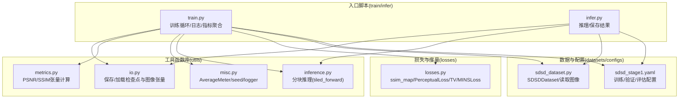
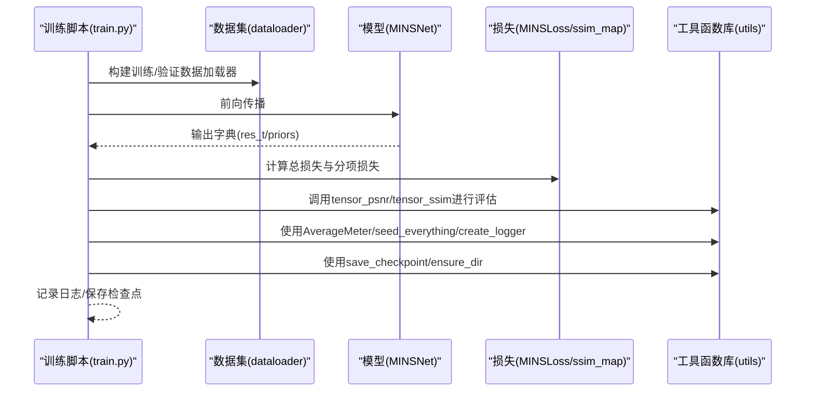
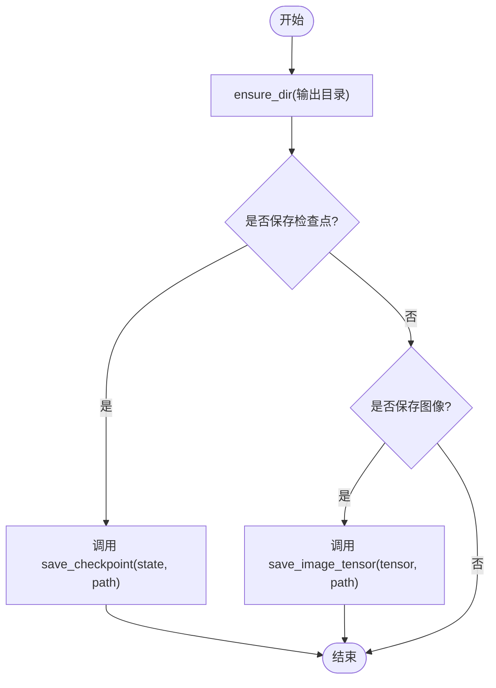
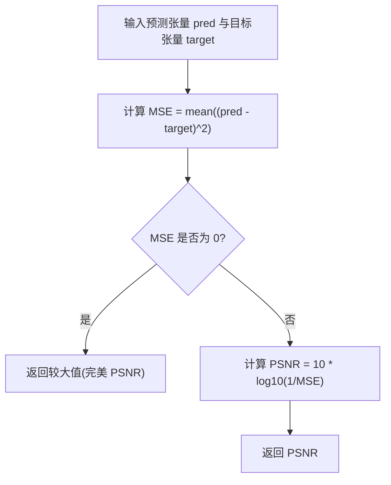
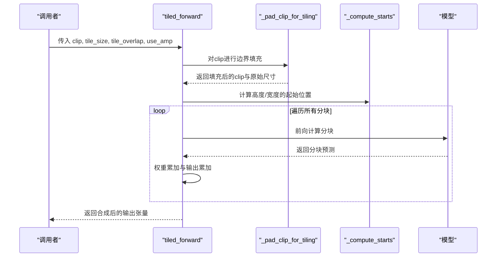
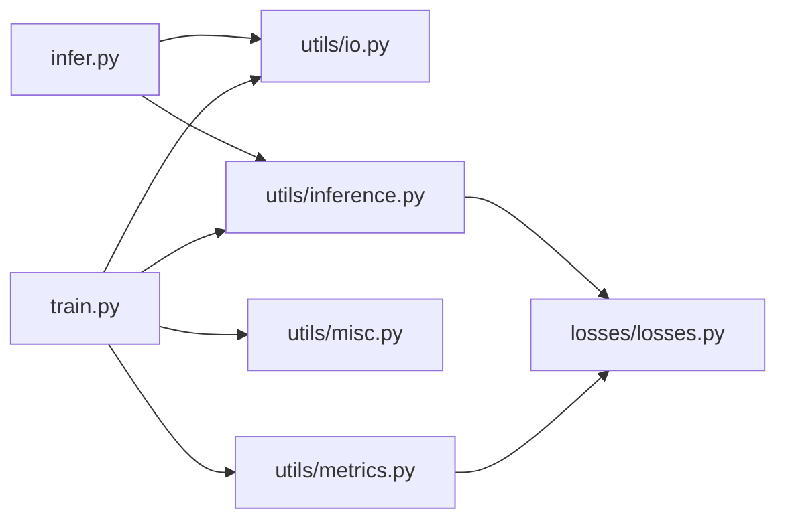

# 工具函数库

<cite>
**本文引用的文件**
- [utils/io.py](file://utils/io.py)
- [utils/metrics.py](file://utils/metrics.py)
- [utils/misc.py](file://utils/misc.py)
- [utils/inference.py](file://utils/inference.py)
- [losses/losses.py](file://losses/losses.py)
- [datasets/sdsd_dataset.py](file://datasets/sdsd_dataset.py)
- [train.py](file://train.py)
- [infer.py](file://infer.py)
- [configs/sdsd_stage1.yaml](file://configs/sdsd_stage1.yaml)
</cite>

## 目录
1. [简介](#简介)
2. [项目结构](#项目结构)
3. [核心组件](#核心组件)
4. [架构总览](#架构总览)
5. [详细组件分析](#详细组件分析)
6. [依赖分析](#依赖分析)
7. [性能考虑](#性能考虑)
8. [故障排查指南](#故障排查指南)
9. [结论](#结论)
10. [附录](#附录)

## 简介
本文件为工具函数库的详细API文档，聚焦于以下三类工具：
- IO处理工具：负责模型检查点与图像张量的保存与加载、目录确保等。
- 指标计算函数：基于张量的PSNR与SSIM计算，用于训练与推理阶段的质量评估。
- 辅助工具函数：包括平均值统计器、随机种子设置、日志记录器以及大图分块推理（打补丁）能力。

文档将逐项说明每个工具函数的用途、参数、返回值、典型用法与组合方式，并结合训练与推理脚本展示在实际项目中的应用路径。

## 项目结构
工具函数库位于项目根目录的utils子包中，配合losses、datasets、train.py、infer.py等模块共同完成从数据到模型再到评估的完整流程。

图表来源
- [utils/io.py:1-27](file://utils/io.py#L1-L27)
- [utils/metrics.py:1-18](file://utils/metrics.py#L1-L18)
- [utils/misc.py:1-49](file://utils/misc.py#L1-L49)
- [utils/inference.py:1-61](file://utils/inference.py#L1-L61)
- [losses/losses.py:1-114](file://losses/losses.py#L1-L114)
- [datasets/sdsd_dataset.py:1-81](file://datasets/sdsd_dataset.py#L1-L81)
- [train.py:1-264](file://train.py#L1-L264)
- [infer.py:1-109](file://infer.py#L1-L109)
- [configs/sdsd_stage1.yaml:1-34](file://configs/sdsd_stage1.yaml#L1-L34)

章节来源
- [utils/io.py:1-27](file://utils/io.py#L1-L27)
- [utils/metrics.py:1-18](file://utils/metrics.py#L1-L18)
- [utils/misc.py:1-49](file://utils/misc.py#L1-L49)
- [utils/inference.py:1-61](file://utils/inference.py#L1-L61)
- [losses/losses.py:1-114](file://losses/losses.py#L1-L114)
- [datasets/sdsd_dataset.py:1-81](file://datasets/sdsd_dataset.py#L1-L81)
- [train.py:1-264](file://train.py#L1-L264)
- [infer.py:1-109](file://infer.py#L1-L109)
- [configs/sdsd_stage1.yaml:1-34](file://configs/sdsd_stage1.yaml#L1-L34)

## 核心组件
- IO处理工具
  - ensure_dir(path): 确保目录存在，不存在则创建。
  - save_checkpoint(state, path): 保存模型检查点至指定路径。
  - load_checkpoint(path, map_location="cpu"): 加载检查点，支持设备映射。
  - save_image_tensor(tensor, path): 将归一化张量保存为图像文件。
- 指标计算函数
  - tensor_psnr(pred, target): 基于张量计算峰值信噪比。
  - tensor_ssim(pred, target): 基于张量计算结构相似性指数。
- 辅助工具函数
  - AverageMeter: 动态均值统计器，支持批量更新。
  - seed_everything(seed): 设置Python、NumPy、PyTorch随机种子。
  - create_logger(save_dir): 创建日志器，输出到文件与控制台。
  - tiled_forward(model, clip, tile_size=256, tile_overlap=32, use_amp=False): 大图分块推理，避免显存不足。
- 关键依赖
  - ssim_map(pred, target): 计算SSIM映射，被tensor_ssim调用；由MINSLoss在损失计算中复用。

章节来源
- [utils/io.py:8-26](file://utils/io.py#L8-L26)
- [utils/metrics.py:8-16](file://utils/metrics.py#L8-L16)
- [utils/misc.py:9-47](file://utils/misc.py#L9-L47)
- [utils/inference.py:6-59](file://utils/inference.py#L6-L59)
- [losses/losses.py:23-35](file://losses/losses.py#L23-L35)

## 架构总览
工具函数库在训练与推理流程中的位置如下：

图表来源
- [train.py:108-184](file://train.py#L108-L184)
- [losses/losses.py:90-112](file://losses/losses.py#L90-L112)
- [utils/metrics.py:8-16](file://utils/metrics.py#L8-L16)
- [utils/misc.py:9-47](file://utils/misc.py#L9-L47)
- [utils/io.py:12-18](file://utils/io.py#L12-L18)

## 详细组件分析

### IO处理工具
- ensure_dir(path)
  - 作用：确保给定路径对应的目录存在，若不存在则递归创建。
  - 参数：path (字符串) — 目录路径。
  - 返回：无（副作用：创建目录）。
  - 典型用法：在保存检查点或图像前先确保输出目录存在。
  - 章节来源
    - [utils/io.py:8-9](file://utils/io.py#L8-L9)

- save_checkpoint(state, path)
  - 作用：将模型状态字典保存为检查点文件。
  - 参数：state (dict) — 模型状态；path (字符串) — 保存路径。
  - 返回：无（保存文件）。
  - 典型用法：训练过程中定期保存最佳或最新检查点。
  - 章节来源
    - [utils/io.py:12-14](file://utils/io.py#L12-L14)

- load_checkpoint(path, map_location="cpu")
  - 作用：从指定路径加载检查点，支持设备映射。
  - 参数：path (字符串) — 检查点路径；map_location (字符串/设备) — 加载目标设备。
  - 返回：字典对象（检查点内容）。
  - 典型用法：推理或继续训练时加载预训练权重。
  - 章节来源
    - [utils/io.py:17-18](file://utils/io.py#L17-L18)

- save_image_tensor(tensor, path)
  - 作用：将归一化的张量转换为图像并保存为文件。
  - 参数：tensor (Tensor) — 形状为C×H×W且数值范围在[0,1]的张量；path (字符串) — 图像保存路径。
  - 返回：无（保存图像文件）。
  - 典型用法：推理后将结果张量保存为PNG/JPEG等格式。
  - 章节来源
    - [utils/io.py:21-25](file://utils/io.py#L21-L25)

图表来源
- [utils/io.py:8-25](file://utils/io.py#L8-L25)

章节来源
- [utils/io.py:8-25](file://utils/io.py#L8-L25)

### 指标计算函数
- tensor_psnr(pred, target)
  - 作用：计算两个张量之间的峰值信噪比（PSNR），用于评估重建质量。
  - 参数：pred (Tensor) — 预测张量；target (Tensor) — 目标张量。
  - 返回：浮点数（PSNR值）。
  - 特殊情况：当MSE为0时返回一个较大值（表示完美匹配）。
  - 典型用法：训练/验证阶段对每批次或每样本进行PSNR统计。
  - 章节来源
    - [utils/metrics.py:8-12](file://utils/metrics.py#L8-L12)

- tensor_ssim(pred, target)
  - 作用：计算两个张量之间的结构相似性指数（SSIM）。
  - 参数：pred (Tensor) — 预测张量；target (Tensor) — 目标张量。
  - 返回：浮点数（SSIM均值）。
  - 实现细节：内部调用ssim_map计算SSIM映射并取均值。
  - 典型用法：与PSNR配合评估图像结构保持程度。
  - 章节来源
    - [utils/metrics.py:15-16](file://utils/metrics.py#L15-L16)

- ssim_map(x, y, window_size=11, sigma=1.5)
  - 作用：计算两幅图像的SSIM映射，用于感知质量评估。
  - 参数：x/y (Tensor) — 输入张量；window_size (整数) — 高斯窗口大小；sigma (浮点数) — 高斯核标准差。
  - 返回：Tensor — SSIM映射。
  - 实现细节：使用高斯窗口进行局部统计，计算均值、方差与协方差，再按SSIM公式求解。
  - 章节来源
    - [losses/losses.py:23-35](file://losses/losses.py#L23-L35)

图表来源
- [utils/metrics.py:8-12](file://utils/metrics.py#L8-L12)

章节来源
- [utils/metrics.py:8-16](file://utils/metrics.py#L8-L16)
- [losses/losses.py:23-35](file://losses/losses.py#L23-L35)

### 辅助工具函数
- AverageMeter
  - 作用：动态维护当前值、累计和、计数与平均值，适合训练过程中的指标滚动统计。
  - 方法：
    - reset(): 重置所有统计量。
    - update(val, n=1): 更新当前值与累计和、计数。
    - avg: 当前平均值。
  - 典型用法：在训练/验证循环中对损失与指标进行滑动平均。
  - 章节来源
    - [utils/misc.py:9-23](file://utils/misc.py#L9-L23)

- seed_everything(seed)
  - 作用：统一设置Python、NumPy、PyTorch的随机种子，保证实验可复现。
  - 参数：seed (整数) — 随机种子。
  - 返回：无。
  - 典型用法：训练开始前调用一次。
  - 章节来源
    - [utils/misc.py:26-30](file://utils/misc.py#L26-L30)

- create_logger(save_dir)
  - 作用：创建日志器，同时输出到文件与控制台，便于调试与监控。
  - 参数：save_dir (字符串) — 日志文件所在目录。
  - 返回：logging.Logger — 配置好的日志器实例。
  - 典型用法：训练脚本初始化日志系统。
  - 章节来源
    - [utils/misc.py:33-47](file://utils/misc.py#L33-L47)

- tiled_forward(model, clip, tile_size=256, tile_overlap=32, use_amp=False)
  - 作用：对大尺寸视频片段进行分块推理，避免显存溢出。
  - 参数：
    - model (Module) — 待推理的模型。
    - clip (Tensor) — 形状为B×T×C×H×W的视频片段。
    - tile_size (整数) — 分块大小，默认256。
    - tile_overlap (整数) — 分块重叠，默认32。
    - use_amp (布尔) — 是否启用自动混合精度。
  - 返回：Tensor — 合成后的输出张量。
  - 实现要点：
    - 自动填充边界以满足整除；
    - 计算每个分块的权重累积，最后做加权平均；
    - 支持CUDA上的自动混合精度；
    - 对batch维度有严格限制（仅支持B=1）。
  - 典型用法：验证阶段或推理阶段对大分辨率输入进行稳健处理。
  - 章节来源
    - [utils/inference.py:26-59](file://utils/inference.py#L26-L59)

图表来源
- [utils/inference.py:6-59](file://utils/inference.py#L6-L59)

章节来源
- [utils/misc.py:9-47](file://utils/misc.py#L9-L47)
- [utils/inference.py:6-59](file://utils/inference.py#L6-L59)

### 组合使用与扩展开发指导
- 组合使用示例（训练阶段）
  - 数据准备：使用SDSDDataset读取序列帧并裁剪翻转增强。
  - 模型训练：前向得到res_t与priors，MINSLoss计算总损失与分项损失。
  - 指标评估：tensor_psnr与tensor_ssim对每批次输出进行评估。
  - 日志与保存：create_logger输出训练日志，AverageMeter滚动统计，save_checkpoint保存检查点。
  - 参考路径
    - [train.py:48-184](file://train.py#L48-L184)
    - [datasets/sdsd_dataset.py:18-81](file://datasets/sdsd_dataset.py#L18-L81)
    - [losses/losses.py:90-112](file://losses/losses.py#L90-L112)
    - [utils/metrics.py:8-16](file://utils/metrics.py#L8-L16)
    - [utils/misc.py:9-47](file://utils/misc.py#L9-L47)
    - [utils/io.py:12-18](file://utils/io.py#L12-L18)

- 组合使用示例（推理阶段）
  - 加载配置与模型：从检查点恢复权重。
  - 分块推理：对单帧或多帧序列进行tiled_forward。
  - 结果保存：将输出张量保存为图像文件。
  - 参考路径
    - [infer.py:68-104](file://infer.py#L68-L104)
    - [utils/inference.py:26-59](file://utils/inference.py#L26-L59)
    - [utils/io.py:21-25](file://utils/io.py#L21-L25)

- 扩展开发建议
  - 新增指标：在metrics.py中添加新的张量级指标函数，并在训练/验证循环中调用。
  - 新增IO：在io.py中扩展保存/加载逻辑（如多模态张量、压缩存储）。
  - 新增推理策略：在inference.py中扩展更复杂的分块策略或融合规则。
  - 配置驱动：通过configs/*.yaml集中管理超参，避免硬编码。
  - 参考路径
    - [configs/sdsd_stage1.yaml:1-34](file://configs/sdsd_stage1.yaml#L1-L34)

章节来源
- [train.py:48-184](file://train.py#L48-L184)
- [infer.py:68-104](file://infer.py#L68-L104)
- [utils/metrics.py:8-16](file://utils/metrics.py#L8-L16)
- [utils/io.py:12-25](file://utils/io.py#L12-L25)
- [utils/inference.py:26-59](file://utils/inference.py#L26-L59)
- [configs/sdsd_stage1.yaml:1-34](file://configs/sdsd_stage1.yaml#L1-L34)

## 依赖分析
- 内部依赖
  - utils/metrics.py依赖losses/losses.py中的ssim_map。
  - train.py与infer.py分别依赖utils中的各类工具函数。
- 外部依赖
  - NumPy、PIL、torch、torchvision（用于VGG特征提取）、PyYAML（配置解析）。
- 参考路径
  - [losses/losses.py:1-12](file://losses/losses.py#L1-L12)
  - [train.py:1-33](file://train.py#L1-L33)
  - [infer.py:1-28](file://infer.py#L1-L28)

图表来源
- [train.py:1-33](file://train.py#L1-L33)
- [infer.py:1-28](file://infer.py#L1-L28)
- [utils/io.py:1-27](file://utils/io.py#L1-L27)
- [utils/metrics.py:1-18](file://utils/metrics.py#L1-L18)
- [utils/misc.py:1-49](file://utils/misc.py#L1-L49)
- [utils/inference.py:1-61](file://utils/inference.py#L1-L61)
- [losses/losses.py:1-114](file://losses/losses.py#L1-L114)

章节来源
- [train.py:1-33](file://train.py#L1-L33)
- [infer.py:1-28](file://infer.py#L1-L28)
- [utils/metrics.py:1-18](file://utils/metrics.py#L1-L18)
- [utils/inference.py:1-61](file://utils/inference.py#L1-L61)
- [losses/losses.py:1-114](file://losses/losses.py#L1-L114)

## 性能考虑
- 分块推理（tiled_forward）
  - 通过合理设置tile_size与tile_overlap，可在显存受限情况下稳定运行大图推理。
  - use_amp可开启自动混合精度以提升吞吐量。
- 指标计算
  - tensor_psnr与tensor_ssim均为纯张量运算，适合GPU加速。
- 日志与统计
  - AverageMeter采用在线更新，内存占用低，适合高频统计。
- 参考路径
  - [utils/inference.py:26-59](file://utils/inference.py#L26-L59)
  - [utils/metrics.py:8-16](file://utils/metrics.py#L8-L16)
  - [utils/misc.py:9-23](file://utils/misc.py#L9-L23)

## 故障排查指南
- 显存不足
  - 现象：报错提示显存不足。
  - 解决：减小tile_size或增大tile_overlap，或关闭use_amp。
  - 参考路径
    - [utils/inference.py:26-59](file://utils/inference.py#L26-L59)
- batch维度限制
  - 现象：tiled_forward抛出异常提示仅支持batch=1。
  - 解决：在调用前将输入张量的batch维设为1，或将批处理拆分为单batch循环。
  - 参考路径
    - [utils/inference.py:34-35](file://utils/inference.py#L34-L35)
- 检查点加载失败
  - 现象：加载检查点时报错。
  - 解决：确认map_location参数与设备一致；检查保存路径是否存在。
  - 参考路径
    - [utils/io.py:17-18](file://utils/io.py#L17-L18)
- 日志未输出
  - 现象：训练日志不显示。
  - 解决：确认create_logger已正确初始化并添加了文件与控制台处理器。
  - 参考路径
    - [utils/misc.py:33-47](file://utils/misc.py#L33-L47)

章节来源
- [utils/inference.py:26-35](file://utils/inference.py#L26-L35)
- [utils/io.py:17-18](file://utils/io.py#L17-L18)
- [utils/misc.py:33-47](file://utils/misc.py#L33-L47)

## 结论
工具函数库提供了完整的IO、指标与辅助能力，覆盖训练与推理的关键环节。通过合理的参数配置与分块推理策略，能够在资源受限环境下稳定运行高质量的视频低光增强任务。建议在新项目中遵循配置驱动与模块化设计，持续扩展更多指标与推理策略。

## 附录
- 常用配置参考
  - 训练/验证/评估参数集中在configs/sdsd_stage1.yaml中，便于统一管理。
  - 参考路径
    - [configs/sdsd_stage1.yaml:1-34](file://configs/sdsd_stage1.yaml#L1-L34)