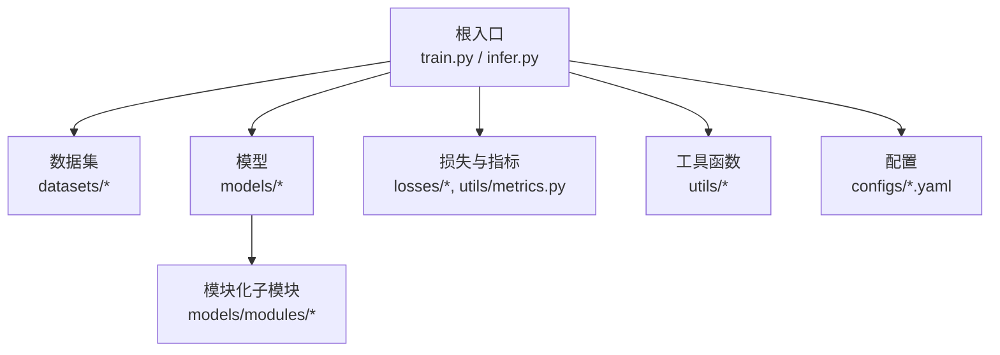
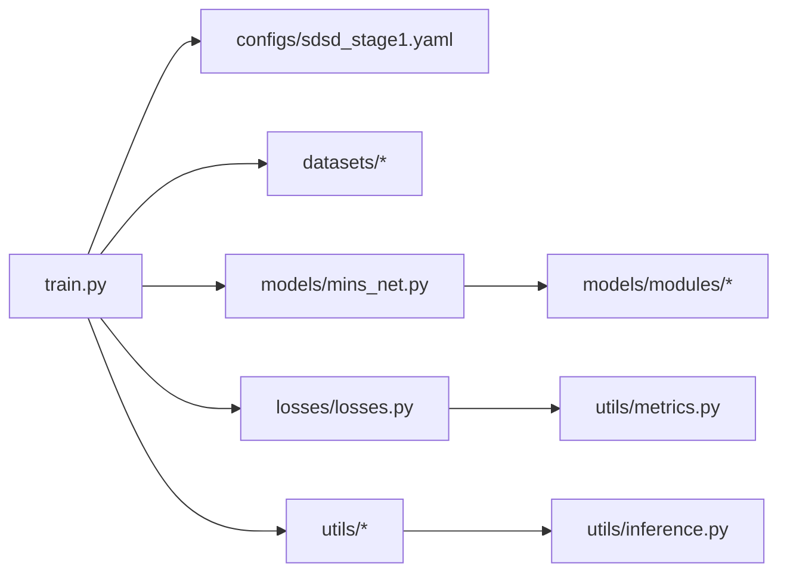

# 代码规范与最佳实践

<cite>
**本文引用的文件**
- [README.md](file://README.md)
- [requirements.txt](file://requirements.txt)
- [configs/sdsd_stage1.yaml](file://configs/sdsd_stage1.yaml)
- [datasets/__init__.py](file://datasets/__init__.py)
- [models/modules/blocks.py](file://models/modules/blocks.py)
- [models/modules/encoder.py](file://models/modules/encoder.py)
- [models/modules/reconstruction.py](file://models/modules/reconstruction.py)
- [losses/losses.py](file://losses/losses.py)
- [utils/metrics.py](file://utils/metrics.py)
- [models/mins_net.py](file://models/mins_net.py)
- [models/tfs_net.py](file://models/tfs_net.py)
- [utils/io.py](file://utils/io.py)
- [utils/inference.py](file://utils/inference.py)
- [train.py](file://train.py)
</cite>

## 目录
1. [引言](#引言)
2. [项目结构](#项目结构)
3. [核心组件](#核心组件)
4. [架构总览](#架构总览)
5. [详细组件分析](#详细组件分析)
6. [依赖关系分析](#依赖关系分析)
7. [性能考虑](#性能考虑)
8. [故障排查指南](#故障排查指南)
9. [结论](#结论)
10. [附录](#附录)

## 引言
本文件面向本项目的Python代码，系统性地制定代码规范与最佳实践，覆盖风格要求、命名约定、注释与文档字符串格式、模块组织、类与函数设计、变量命名、代码审查要点、提交信息格式以及版本控制最佳实践。目标是帮助团队统一风格、提升可读性与可维护性，并降低协作成本。

## 项目结构
项目采用按功能分层的模块化组织方式：
- 根目录提供训练入口、推理入口、配置与依赖声明
- datasets：数据集加载与变换
- models：模型定义与模块化子模块
- losses：损失函数与评估指标
- utils：工具函数（IO、推理切片、指标计算等）
- configs：训练/推理配置文件（YAML）



图表来源
- [train.py:187-264](file://train.py#L187-L264)
- [models/mins_net.py:11-67](file://models/mins_net.py#L11-L67)
- [models/tfs_net.py:34-181](file://models/tfs_net.py#L34-L181)
- [losses/losses.py:80-114](file://losses/losses.py#L80-L114)
- [utils/metrics.py:8-18](file://utils/metrics.py#L8-L18)
- [configs/sdsd_stage1.yaml:1-34](file://configs/sdsd_stage1.yaml#L1-L34)

章节来源
- [README.md:1-24](file://README.md#L1-L24)
- [requirements.txt:1-8](file://requirements.txt#L1-L8)
- [datasets/__init__.py:1-3](file://datasets/__init__.py#L1-L3)
- [configs/sdsd_stage1.yaml:1-34](file://configs/sdsd_stage1.yaml#L1-L34)

## 核心组件
- 训练入口：负责参数解析、配置加载、数据构建、模型/损失/优化器/调度器初始化、训练循环与验证、日志与检查点保存
- 模型组件：以模块化子模块组合为主，便于复用与扩展
- 损失与指标：封装常用损失与评估指标，支持可选预训练特征提取
- 工具函数：IO、推理切片（滑窗）、指标计算

章节来源
- [train.py:36-264](file://train.py#L36-L264)
- [models/mins_net.py:11-67](file://models/mins_net.py#L11-L67)
- [models/tfs_net.py:34-181](file://models/tfs_net.py#L34-L181)
- [losses/losses.py:38-114](file://losses/losses.py#L38-L114)
- [utils/metrics.py:8-18](file://utils/metrics.py#L8-L18)
- [utils/io.py:8-27](file://utils/io.py#L8-L27)
- [utils/inference.py:26-61](file://utils/inference.py#L26-L61)

## 架构总览
训练流程从配置文件读取参数，构建数据集与数据加载器，实例化模型与损失，进入训练循环并在指定间隔进行验证与保存。

```mermaid
sequenceDiagram
participant CLI as "命令行"
participant Train as "train.py.main()"
participant Loader as "DataLoader"
participant Model as "MINSNet"
participant Loss as "MINSLoss"
participant Opt as "AdamW+Scheduler"
participant AMP as "GradScaler/Autocast"
CLI->>Train : 解析参数(--config, --smoke)
Train->>Train : 加载配置(load_config)
Train->>Loader : 构建训练/验证数据集
Train->>Model : 初始化模型(build_model)
Train->>Loss : 初始化损失(build_loss)
loop 每个epoch
Train->>Opt : 优化器重置梯度
Train->>AMP : autocast启用(可选)
Train->>Model : 前向输出
Train->>Loss : 计算损失与拆解项
Train->>AMP : 反向传播(GradScaler)
Train->>Opt : 更新参数
alt 验证周期
Train->>Model : 推理(tiled_forward)
Train->>Train : 记录PSNR/SSIM/L1
Train->>Train : 保存最新/最优检查点
end
end
```

图表来源
- [train.py:187-264](file://train.py#L187-L264)
- [train.py:108-161](file://train.py#L108-L161)
- [train.py:163-184](file://train.py#L163-L184)
- [models/mins_net.py:20-67](file://models/mins_net.py#L20-L67)
- [losses/losses.py:80-114](file://losses/losses.py#L80-L114)
- [utils/inference.py:26-61](file://utils/inference.py#L26-L61)

## 详细组件分析

### Python代码风格与命名规范
- 文件与模块
  - 模块名使用小写与下划线，避免大写驼峰
  - 包含明确的导出列表（如 datasets/__init__.py），仅暴露必要接口
- 类与方法
  - 类名使用大写开头的驼峰命名
  - 方法与属性使用小写与下划线
  - 私有成员以单下划线前缀标识
- 常量与全局
  - 常量使用全大写与下划线
  - 配置常量建议集中于配置文件或模块级常量
- 变量
  - 使用语义化名称，避免缩写；对临时变量可使用短名但需在上下文清晰
  - 对张量形状与维度，优先使用有意义的变量名（如 b,t,c,h,w）
- 导入
  - 标准库、第三方库、项目内模块分组导入，组间空行分隔
  - 避免通配符导入，显式导入所需对象
- 行长度与缩进
  - 单行不超过100字符；必要时使用括号换行
  - 统一使用4空格缩进

章节来源
- [datasets/__init__.py:1-3](file://datasets/__init__.py#L1-L3)
- [models/modules/blocks.py:8-110](file://models/modules/blocks.py#L8-L110)
- [models/modules/encoder.py:35-102](file://models/modules/encoder.py#L35-L102)
- [models/modules/reconstruction.py:5-24](file://models/modules/reconstruction.py#L5-L24)
- [losses/losses.py:38-114](file://losses/losses.py#L38-L114)
- [models/mins_net.py:11-67](file://models/mins_net.py#L11-L67)
- [models/tfs_net.py:34-181](file://models/tfs_net.py#L34-L181)
- [utils/io.py:12-27](file://utils/io.py#L12-L27)
- [utils/inference.py:26-61](file://utils/inference.py#L26-L61)
- [train.py:36-264](file://train.py#L36-L264)

### 注释与文档字符串规范
- 模块级文档字符串
  - 使用三引号字符串，简述模块职责与关键行为
- 类与函数文档字符串
  - 使用三引号字符串，描述用途、参数、返回值与异常
  - 参数与返回值建议标注类型与含义
- 行内注释
  - 仅在复杂逻辑处提供必要说明，避免显而易见的注释
- TODO/注释标记
  - 使用明确标记（如 TODO/NOTE/XXX），并附带简要说明与跟踪信息

章节来源
- [models/modules/encoder.py:1-14](file://models/modules/encoder.py#L1-L14)
- [models/modules/encoder.py:51-75](file://models/modules/encoder.py#L51-L75)
- [models/modules/encoder.py:76-102](file://models/modules/encoder.py#L76-L102)
- [models/tfs_net.py:1-24](file://models/tfs_net.py#L1-L24)
- [models/tfs_net.py:34-46](file://models/tfs_net.py#L34-L46)
- [models/tfs_net.py:100-114](file://models/tfs_net.py#L100-L114)

### 函数与类设计标准
- 函数
  - 单一职责，尽量短小；长流程拆分为多个小函数
  - 明确输入输出，必要时使用类型注解
  - 对可选参数提供合理默认值
- 类
  - 尽量无状态或最小状态；通过构造函数注入依赖
  - 明确公共接口与私有实现
  - 在forward等关键路径上提供清晰的输入输出说明
- 模块化
  - 将相关功能收敛到同一模块，避免跨模块循环依赖
  - 子模块内部保持高内聚、低耦合

章节来源
- [models/modules/blocks.py:8-110](file://models/modules/blocks.py#L8-L110)
- [models/modules/encoder.py:23-102](file://models/modules/encoder.py#L23-L102)
- [models/modules/reconstruction.py:5-24](file://models/modules/reconstruction.py#L5-L24)
- [models/mins_net.py:11-67](file://models/mins_net.py#L11-L67)
- [models/tfs_net.py:34-181](file://models/tfs_net.py#L34-L181)

### 变量命名规则
- 形状与维度
  - 使用 b,t,c,h,w 表示批大小、时间步、通道、高、宽
- 功能语义
  - 以语义化命名替代缩写，如 feats、coarse_feats、pred、target
- 常量与阈值
  - 使用全大写与下划线命名，如 eps、tile_size、tile_overlap

章节来源
- [models/mins_net.py:20-67](file://models/mins_net.py#L20-L67)
- [models/tfs_net.py:100-114](file://models/tfs_net.py#L100-L114)
- [models/modules/blocks.py:46-110](file://models/modules/blocks.py#L46-L110)
- [utils/inference.py:6-61](file://utils/inference.py#L6-L61)

### 模块组织原则
- 包与模块边界
  - 每个功能域一个模块或子包，避免过深层级
  - 通过 __init__.py 显式导出公共接口
- 相对导入与绝对导入
  - 项目内模块使用绝对导入，避免相对导入导致的脆弱性
- 配置与代码分离
  - 配置集中于 YAML 文件，运行时动态加载

章节来源
- [datasets/__init__.py:1-3](file://datasets/__init__.py#L1-L3)
- [configs/sdsd_stage1.yaml:1-34](file://configs/sdsd_stage1.yaml#L1-L34)
- [train.py:43-46](file://train.py#L43-L46)

### 代码审查标准
- 可读性
  - 保持一致的缩进、空行与注释风格
  - 避免魔法数字与字符串，使用常量或配置
- 正确性
  - 对张量形状与维度进行断言或注释说明
  - 对数值稳定项（如 eps）统一处理
- 性能
  - 合理使用 autocast/GradScaler，避免不必要的张量拷贝
  - 在推理阶段使用滑窗策略减少显存占用
- 可测试性
  - 将关键逻辑拆分为独立函数，便于单元测试
- 日志与错误处理
  - 对异常与非预期情况记录日志并优雅降级
  - 对不可继续训练的情况跳过该步并继续后续步骤

章节来源
- [models/modules/blocks.py:46-110](file://models/modules/blocks.py#L46-L110)
- [losses/losses.py:38-114](file://losses/losses.py#L38-L114)
- [utils/inference.py:26-61](file://utils/inference.py#L26-L61)
- [train.py:108-161](file://train.py#L108-L161)
- [train.py:163-184](file://train.py#L163-L184)

### 提交消息格式与版本控制最佳实践
- 提交消息
  - 类型: 简洁主题（不超过50字符）
  - 说明正文（可选，解释动机与影响）
  - 关联问题/任务（可选）
- 分支管理
  - 开发分支以功能命名，合并前进行清理与审查
  - 热修复分支直接指向主干并回溯合并
- 版本与发布
  - 使用语义化版本，变更日志记录重大改动
  - 发布前确保通过CI与关键测试

（本节为通用实践指导，不直接分析具体文件）

## 依赖关系分析
- 训练入口依赖配置、数据集、模型、损失与工具模块
- 模型由多个子模块组成，遵循“共享特征提取—多源估计—重建”的流水线
- 损失模块依赖指标函数与可选预训练特征提取器
- 推理模块依赖滑窗策略与自动混合精度



图表来源
- [train.py:27-33](file://train.py#L27-L33)
- [models/mins_net.py:4-8](file://models/mins_net.py#L4-L8)
- [losses/losses.py:1-12](file://losses/losses.py#L1-L12)
- [utils/metrics.py:5](file://utils/metrics.py#L5)
- [utils/inference.py:1-3](file://utils/inference.py#L1-L3)

章节来源
- [train.py:27-33](file://train.py#L27-L33)
- [models/mins_net.py:4-8](file://models/mins_net.py#L4-L8)
- [losses/losses.py:1-12](file://losses/losses.py#L1-L12)
- [utils/metrics.py:5](file://utils/metrics.py#L5)
- [utils/inference.py:1-3](file://utils/inference.py#L1-L3)

## 性能考虑
- 混合精度与自动梯度缩放
  - 在GPU可用时启用 autocast 与 GradScaler，减少显存占用并加速训练
- 推理滑窗
  - 使用滑窗策略与权重累加，避免大图一次性前向导致显存溢出
- I/O与数据加载
  - 合理设置 num_workers、pin_memory、drop_last，平衡吞吐与内存
- 数值稳定性
  - 在除法与归一化中加入稳定项（如 eps），避免除零与不稳定

章节来源
- [train.py:6,204-205](file://train.py#L6,L204-L205)
- [utils/inference.py:26-61](file://utils/inference.py#L26-L61)
- [losses/losses.py:97-98](file://losses/losses.py#L97-L98)

## 故障排查指南
- 损失非有限
  - 若出现非有限损失，记录步数并跳过该步，检查学习率与数据质量
- 推理尺寸不匹配
  - 滑窗推理要求批大小为1，若不满足则抛出异常
- 预训练特征不可用
  - 当无法加载预训练特征时，损失模块会发出警告并返回零损失
- 配置路径与参数
  - 确认配置文件中的路径与参数与实际环境一致

章节来源
- [train.py:126-129](file://train.py#L126-L129)
- [utils/inference.py:34-35](file://utils/inference.py#L34-L35)
- [losses/losses.py:42-46](file://losses/losses.py#L42-L46)
- [configs/sdsd_stage1.yaml:3-8](file://configs/sdsd_stage1.yaml#L3-L8)

## 结论
本规范从风格、命名、注释、模块组织、类与函数设计、变量命名、代码审查与版本控制等方面给出了统一标准。建议在团队内推广并结合自动化工具（如lint与格式化）持续执行，以保障代码质量与长期可维护性。

## 附录

### 示例：正确实现的函数签名与文档字符串
- 函数签名应包含类型注解与默认值
- 文档字符串应说明用途、参数、返回值与异常
- 示例参考路径：
  - [models/modules/blocks.py:46-110](file://models/modules/blocks.py#L46-L110)
  - [models/modules/encoder.py:51-102](file://models/modules/encoder.py#L51-L102)
  - [losses/losses.py:80-114](file://losses/losses.py#L80-L114)

### 示例：训练循环中的关键步骤
- 参数解析与配置加载
- 数据集与数据加载器构建
- 模型、损失、优化器、调度器初始化
- 训练与验证循环、日志与检查点保存
- 示例参考路径：
  - [train.py:36-264](file://train.py#L36-L264)