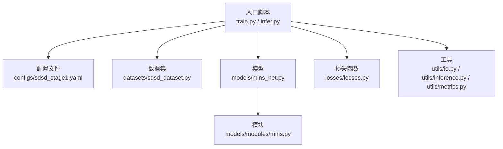
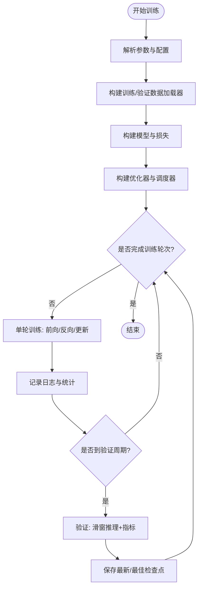
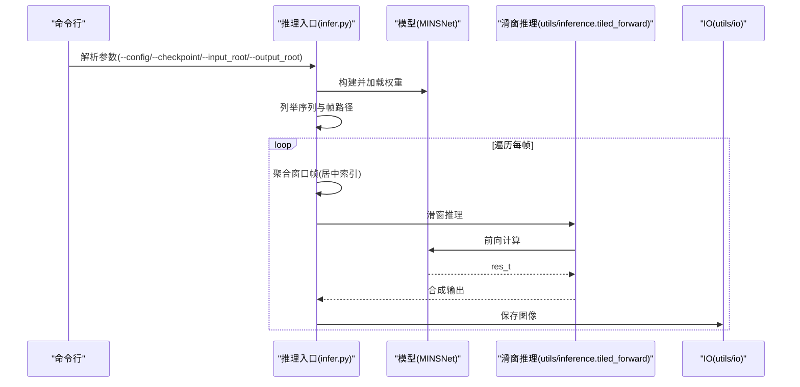
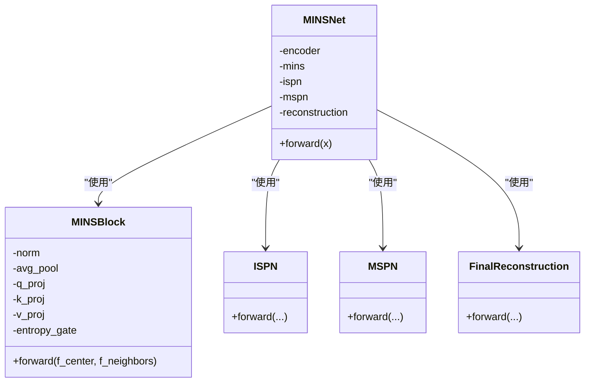
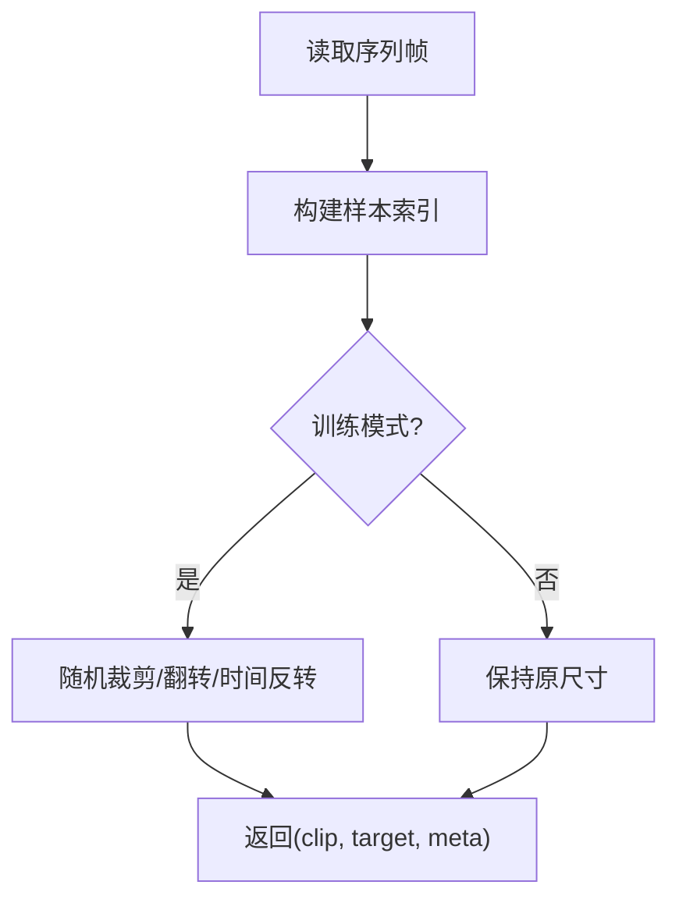
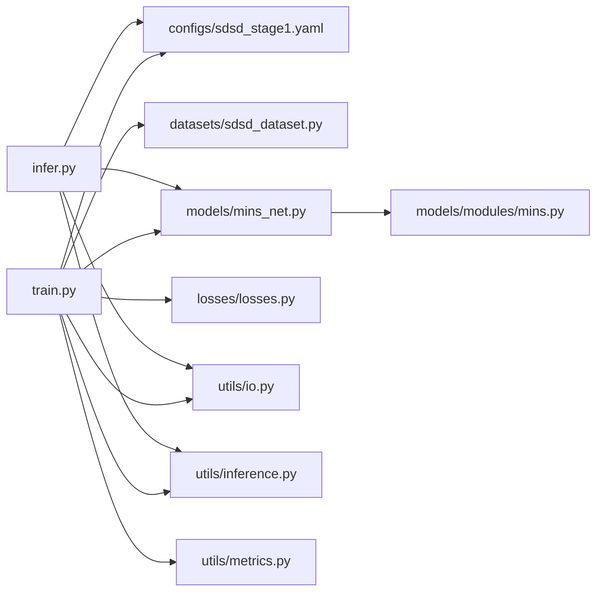

# 开发指南

<cite>
**本文引用的文件**
- [README.md](file://README.md)
- [requirements.txt](file://requirements.txt)
- [train.py](file://train.py)
- [infer.py](file://infer.py)
- [configs/sdsd_stage1.yaml](file://configs/sdsd_stage1.yaml)
- [models/mins_net.py](file://models/mins_net.py)
- [models/modules/mins.py](file://models/modules/mins.py)
- [datasets/sdsd_dataset.py](file://datasets/sdsd_dataset.py)
- [losses/losses.py](file://losses/losses.py)
- [utils/inference.py](file://utils/inference.py)
- [utils/io.py](file://utils/io.py)
- [utils/metrics.py](file://utils/metrics.py)
</cite>

## 目录
1. [简介](#简介)
2. [项目结构](#项目结构)
3. [核心组件](#核心组件)
4. [架构总览](#架构总览)
5. [详细组件分析](#详细组件分析)
6. [依赖关系分析](#依赖关系分析)
7. [性能考虑](#性能考虑)
8. [故障排查指南](#故障排查指南)
9. [结论](#结论)
10. [附录](#附录)

## 简介
本指南面向参与 MINS-Net（基于 PyTorch 的视频低光照增强）项目开发与维护的工程师，系统阐述模块开发规范、代码结构要求、最佳实践，以及单元测试、集成测试与性能测试方法；同时给出贡献流程、版本管理与发布流程建议，并提供问题排查、调试技巧与性能优化建议，帮助团队高效协作。

## 项目结构
项目采用按功能域分层的组织方式：入口脚本负责训练与推理；配置文件集中管理超参；模型由多个子模块组合而成；数据集与损失函数分别位于独立目录；工具模块提供通用 IO、指标与推理切片等能力。



图示来源
- [train.py:1-264](file://train.py#L1-L264)
- [infer.py:1-109](file://infer.py#L1-L109)
- [configs/sdsd_stage1.yaml:1-34](file://configs/sdsd_stage1.yaml#L1-L34)
- [datasets/sdsd_dataset.py:1-81](file://datasets/sdsd_dataset.py#L1-L81)
- [models/mins_net.py:1-67](file://models/mins_net.py#L1-L67)
- [models/modules/mins.py:1-131](file://models/modules/mins.py#L1-L131)
- [losses/losses.py:1-114](file://losses/losses.py#L1-L114)
- [utils/io.py:1-27](file://utils/io.py#L1-L27)
- [utils/inference.py:1-61](file://utils/inference.py#L1-L61)
- [utils/metrics.py:1-18](file://utils/metrics.py#L1-L18)

章节来源
- [README.md:1-24](file://README.md#L1-L24)
- [requirements.txt:1-8](file://requirements.txt#L1-L8)
- [configs/sdsd_stage1.yaml:1-34](file://configs/sdsd_stage1.yaml#L1-L34)

## 核心组件
- 训练入口：解析参数、加载配置、构建数据加载器、模型、损失、优化器与调度器，执行训练循环与验证、保存检查点。
- 推理入口：加载配置与权重，遍历序列帧进行滑窗推理并保存结果。
- 模型：MINSNet 由金字塔编码器、MINS 注意力、ISPN、MSPN 与最终重建组成。
- 数据集：SDSDDataset 支持窗口采样、随机裁剪翻转与时间反转增强。
- 损失：像素 L1、SSIM、感知损失与先验 TV 正则化组合。
- 工具：IO（保存/加载）、推理切片（tiled_forward）、指标（PSNR/SSIM）。

章节来源
- [train.py:36-264](file://train.py#L36-L264)
- [infer.py:31-109](file://infer.py#L31-L109)
- [models/mins_net.py:11-67](file://models/mins_net.py#L11-L67)
- [datasets/sdsd_dataset.py:18-81](file://datasets/sdsd_dataset.py#L18-L81)
- [losses/losses.py:80-114](file://losses/losses.py#L80-L114)
- [utils/inference.py:26-61](file://utils/inference.py#L26-L61)
- [utils/io.py:12-27](file://utils/io.py#L12-L27)
- [utils/metrics.py:8-18](file://utils/metrics.py#L8-L18)

## 架构总览
下图展示训练与推理两条主路径及其关键交互：

```mermaid
sequenceDiagram
participant CLI as "命令行"
participant Train as "训练入口(train.py)"
participant Loader as "数据加载器(DataLoader)"
participant Net as "模型(MINSNet)"
participant Loss as "损失(MINSLoss)"
participant Opt as "优化器/调度器"
participant Utils as "工具(IO/指标/推理)"
CLI->>Train : 解析参数与配置
Train->>Loader : 构建训练/验证集
loop 训练轮次
Train->>Loader : 批次迭代
Loader-->>Train : (clip, target, meta)
Train->>Net : 前向计算
Net-->>Train : 输出(res_t, priors, features...)
Train->>Loss : 计算总损失与分项
Train->>Opt : 反向传播与优化
alt 需要验证
Train->>Utils : tiled_forward 推理
Utils-->>Train : 预测图像
Train->>Utils : 计算PSNR/SSIM
end
end
Train->>Utils : 保存最新/最佳检查点
```

图示来源
- [train.py:48-264](file://train.py#L48-L264)
- [datasets/sdsd_dataset.py:48-81](file://datasets/sdsd_dataset.py#L48-L81)
- [models/mins_net.py:20-67](file://models/mins_net.py#L20-L67)
- [losses/losses.py:90-114](file://losses/losses.py#L90-L114)
- [utils/inference.py:26-61](file://utils/inference.py#L26-L61)
- [utils/io.py:12-27](file://utils/io.py#L12-L27)

## 详细组件分析

### 训练流程与控制流
- 参数解析与配置加载：支持 --config 与 --smoke 快速验证模式。
- 数据加载：训练/验证集均使用 Subset 进行小规模 Smoke 测试；DataLoader 使用多进程与内存驻留。
- 模型/损失构建：根据配置实例化 MINSNet 与 MINSLoss。
- 优化与调度：AdamW + CosineAnnealingLR；AMP 自动混合精度可选。
- 训练循环：前向、反向、更新、日志记录；非有限损失跳过。
- 验证流程：滑窗推理（tiled_forward），计算 L1、PSNR、SSIM 并保存检查点。



图示来源
- [train.py:36-264](file://train.py#L36-L264)

章节来源
- [train.py:36-264](file://train.py#L36-L264)

### 推理流程与滑窗策略
- 加载配置与权重，逐序列、逐帧读取。
- 以中心帧索引为中心，按窗口大小收集前后帧构成时序片段。
- 使用 tiled_forward 对大尺寸输入进行滑窗预测，避免显存不足。
- 将张量结果写回图像文件。



图示来源
- [infer.py:68-109](file://infer.py#L68-L109)
- [utils/inference.py:26-61](file://utils/inference.py#L26-L61)
- [utils/io.py:21-27](file://utils/io.py#L21-L27)

章节来源
- [infer.py:68-109](file://infer.py#L68-L109)
- [utils/inference.py:26-61](file://utils/inference.py#L26-L61)
- [utils/io.py:21-27](file://utils/io.py#L21-L27)

### 模块类图（MINSNet 与核心子模块）


图示来源
- [models/mins_net.py:11-67](file://models/mins_net.py#L11-L67)
- [models/modules/mins.py:22-131](file://models/modules/mins.py#L22-L131)

章节来源
- [models/mins_net.py:11-67](file://models/mins_net.py#L11-L67)
- [models/modules/mins.py:22-131](file://models/modules/mins.py#L22-L131)

### 数据集与损失
- SDSDDataset：按序列读取 LQ/GT，构建样本列表，支持随机裁剪、翻转与时间反转。
- MINSLoss：组合 L1、SSIM、感知损失与先验 TV 正则，返回总损失与分项字典。



图示来源
- [datasets/sdsd_dataset.py:18-81](file://datasets/sdsd_dataset.py#L18-L81)

章节来源
- [datasets/sdsd_dataset.py:18-81](file://datasets/sdsd_dataset.py#L18-L81)
- [losses/losses.py:80-114](file://losses/losses.py#L80-L114)

## 依赖关系分析
- 入口脚本依赖配置、数据集、模型、损失与工具模块。
- 模型内部依赖各子模块；损失依赖感知网络与局部窗口 SSIM 实现。
- 工具模块提供 IO、推理切片与指标计算，被训练/推理共同调用。



图示来源
- [train.py:27-33](file://train.py#L27-L33)
- [infer.py:26-28](file://infer.py#L26-L28)
- [models/mins_net.py:4-8](file://models/mins_net.py#L4-L8)
- [models/modules/mins.py:6](file://models/modules/mins.py#L6)]
- [losses/losses.py:7-11](file://losses/losses.py#L7-L11)
- [utils/io.py:1-27](file://utils/io.py#L1-L27)
- [utils/inference.py:1-61](file://utils/inference.py#L1-L61)
- [utils/metrics.py:1-18](file://utils/metrics.py#L1-L18)

章节来源
- [train.py:27-33](file://train.py#L27-L33)
- [infer.py:26-28](file://infer.py#L26-L28)
- [models/mins_net.py:4-8](file://models/mins_net.py#L4-L8)
- [models/modules/mins.py:6](file://models/modules/mins.py#L6)
- [losses/losses.py:7-11](file://losses/losses.py#L7-L11)
- [utils/io.py:1-27](file://utils/io.py#L1-L27)
- [utils/inference.py:1-61](file://utils/inference.py#L1-L61)
- [utils/metrics.py:1-18](file://utils/metrics.py#L1-L18)

## 性能考虑
- AMP 自动混合精度：在 CUDA 设备上启用可显著降低显存占用与加速训练。
- 滑窗推理：对大分辨率图像进行分块预测，避免 OOM；合理设置 tile_size 与 tile_overlap。
- 数据加载：num_workers 与 pin_memory 提升吞吐；Smoke 测试用于快速回归验证。
- 损失设计：TV 先验有助于平滑先验分布，提升视觉质量；感知损失可选预训练权重。
- 日志与验证频率：通过 log_interval 与 val_interval 控制开销与可观测性平衡。

章节来源
- [train.py:203-205](file://train.py#L203-L205)
- [train.py:230-233](file://train.py#L230-L233)
- [utils/inference.py:26-61](file://utils/inference.py#L26-L61)
- [configs/sdsd_stage1.yaml:10-10](file://configs/sdsd_stage1.yaml#L10-L10)
- [configs/sdsd_stage1.yaml:21-21](file://configs/sdsd_stage1.yaml#L21-L21)
- [configs/sdsd_stage1.yaml:27-27](file://configs/sdsd_stage1.yaml#L27-L27)
- [losses/losses.py:80-114](file://losses/losses.py#L80-L114)

## 故障排查指南
- 非有限损失导致训练中断：训练循环会跳过非有限损失并记录警告，需检查学习率、损失权重或数据异常。
- 显存不足：启用 AMP 或减小 batch_size/tile_size；确保仅在 batch=1 时使用滑窗推理。
- 预训练感知损失不可用：当 torchvision 不可用或下载失败时，感知损失退化为零，可通过配置关闭预训练。
- 配置路径不匹配：确认配置中的路径与实际数据一致，尤其是训练/验证集根目录。
- 验证指标异常：检查滑窗参数与输入归一化范围，确保张量在 [0,1] 区间内保存。

章节来源
- [train.py:126-129](file://train.py#L126-L129)
- [train.py:230-233](file://train.py#L230-L233)
- [losses/losses.py:38-71](file://losses/losses.py#L38-L71)
- [configs/sdsd_stage1.yaml:4-7](file://configs/sdsd_stage1.yaml#L4-L7)
- [utils/inference.py:26-61](file://utils/inference.py#L26-L61)
- [utils/io.py:21-27](file://utils/io.py#L21-L27)

## 结论
本指南从结构、流程、模块与工具四个维度梳理了 MINS-Net 的开发要点，并结合配置与实现细节给出了性能优化与故障排查建议。遵循本文规范可有效提升开发效率与代码质量。

## 附录

### 单元测试编写指南
- 测试目标
  - 模型前向稳定性：断言输入形状约束与输出键存在。
  - 损失函数数值稳定性：断言损失为标量且对小扰动有界。
  - 数据集采样一致性：断言窗口采样边界处理正确。
  - 工具函数行为：断言滑窗切片与重拼接正确。
- 示例断言思路
  - 模型：对固定形状输入运行前向，检查 res_t/priors/features 键是否存在。
  - 损失：对相同 pred/target 断言损失非负且有限。
  - 数据集：对边界索引断言窗口帧数量与顺序。
  - 工具：对 pad/reverse 与权重累加进行一致性校验。

章节来源
- [models/mins_net.py:20-67](file://models/mins_net.py#L20-L67)
- [losses/losses.py:90-114](file://losses/losses.py#L90-L114)
- [datasets/sdsd_dataset.py:56-62](file://datasets/sdsd_dataset.py#L56-L62)
- [utils/inference.py:16-59](file://utils/inference.py#L16-L59)

### 集成测试方法
- 端到端训练/验证：使用小规模 Smoke 数据集，验证训练循环与验证流程可正常收敛与保存检查点。
- 推理管线：对少量序列帧进行滑窗推理，断言输出图像尺寸与范围。
- 多 GPU/AMP：在具备 CUDA 的环境中开启 AMP，对比显存占用与速度。

章节来源
- [train.py:64-67](file://train.py#L64-L67)
- [train.py:225-258](file://train.py#L225-L258)
- [infer.py:87-104](file://infer.py#L87-L104)
- [utils/inference.py:26-61](file://utils/inference.py#L26-L61)

### 性能测试流程
- 基准指标：FPS（每秒帧数）、显存峰值、PSNR/SSIM。
- 测试步骤
  - 固定 batch_size 与 tile_size，测量不同分辨率下的吞吐。
  - 对比 AMP 开关与不同 num_workers 的效果。
  - 使用验证集评估 PSNR/SSIM，作为质量指标。
- 报告模板
  - 环境信息（CUDA 版本、驱动、GPU 型号）。
  - 配置参数与硬件条件。
  - 指标数值与可视化图表。

章节来源
- [train.py:203-205](file://train.py#L203-L205)
- [train.py:230-233](file://train.py#L230-L233)
- [utils/metrics.py:8-18](file://utils/metrics.py#L8-L18)

### 代码贡献流程
- 分支策略：主分支保护，特性开发在 feature/* 分支，修复在 hotfix/* 分支。
- 提交规范：简短标题 + 详细描述，引用相关 Issue。
- 审查流程：提交 Pull Request，至少一名维护者审查，通过 CI 与本地测试。
- 合并策略：squash 合并，保持历史整洁。

### 版本管理与发布流程
- 版本号：语义化版本（主.次.修订），变更记录写入文档。
- 发布步骤
  - 更新版本号与变更日志。
  - 打标签并推送。
  - 生成发布包（如适用）。
- 文档同步：随版本更新 README 与配置示例。

### 调试技巧
- 使用 Python -m torch.distributed.run（如需要）定位分布式问题。
- 在关键节点打印中间张量形状与统计值，辅助定位 NaN/Inf。
- 使用 torch.cuda.empty_cache() 清理缓存，缓解 OOM。
- 将 AMP 关闭以排除数值精度问题。