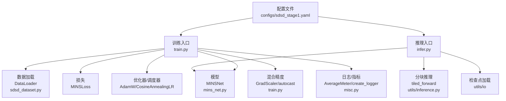
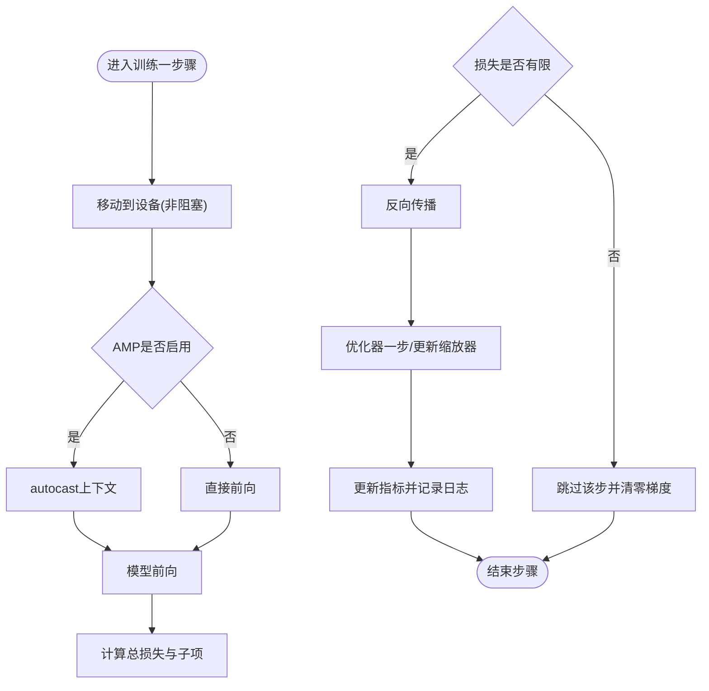
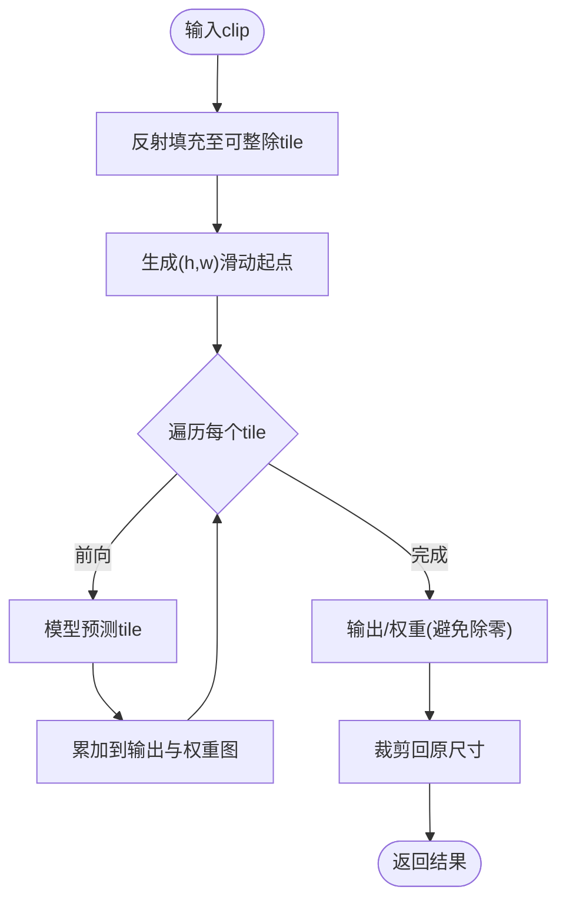
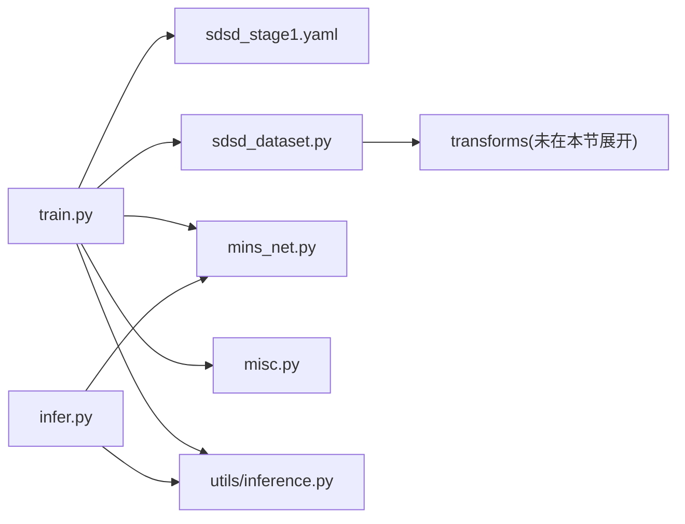

# 性能优化

<cite>
**本文引用的文件**
- [train.py](file://train.py)
- [infer.py](file://infer.py)
- [sdsd_stage1.yaml](file://configs/sdsd_stage1.yaml)
- [inference.py](file://utils/inference.py)
- [mins_net.py](file://models/mins_net.py)
- [sdsd_dataset.py](file://datasets/sdsd_dataset.py)
- [misc.py](file://utils/misc.py)
- [requirements.txt](file://requirements.txt)
- [README.md](file://README.md)
- [prefetch_dataloader.py（BasicSR）](file://reference_repos/BasicSR/basicsr/data/prefetch_dataloader.py)
- [prefetch_dataloader.py（Retinexformer）](file://reference_repos/Retinexformer/basicsr/data/prefetch_dataloader.py)
- [throughput（DAT）](file://reference_repos/DAT/slurm_main.py)
- [throughput（DAT）](file://reference_repos/DAT/main.py)
- [arch_util（NAFNet）](file://reference_repos/NAFNet/basicsr/models/arch_util.py)
- [deform_conv.py（BasicSR）](file://reference_repos/BasicSR/basicsr/ops/dcn/deform_conv.py)
</cite>

## 目录
1. [简介](#简介)
2. [项目结构](#项目结构)
3. [核心组件](#核心组件)
4. [架构总览](#架构总览)
5. [详细组件分析](#详细组件分析)
6. [依赖分析](#依赖分析)
7. [性能考虑](#性能考虑)
8. [故障排查指南](#故障排查指南)
9. [结论](#结论)
10. [附录](#附录)

## 简介
本指南面向视频超分辨率与低光照增强任务，围绕训练性能优化、推理速度提升与内存使用优化展开，系统覆盖混合精度训练、梯度累积、分布式训练、数据加载优化、GPU显存控制与计算效率提升，并结合仓库现有实现给出可落地的优化建议与监控方法。同时提供针对视频序列的特殊优化技巧与硬件加速利用策略。

## 项目结构
本项目采用“配置驱动 + 模块化组件”的组织方式：训练入口负责构建数据加载器、模型、损失与优化器；推理入口负责加载权重与执行分块推理；工具模块提供日志、指标与推理切片策略；模型与数据集分别封装网络结构与数据读取逻辑。



图表来源
- [train.py:187-264](file://train.py#L187-L264)
- [infer.py:68-109](file://infer.py#L68-L109)
- [sdsd_dataset.py:18-81](file://datasets/sdsd_dataset.py#L18-L81)
- [mins_net.py:11-67](file://models/mins_net.py#L11-L67)
- [inference.py:26-61](file://utils/inference.py#L26-L61)
- [misc.py:9-49](file://utils/misc.py#L9-L49)
- [sdsd_stage1.yaml:1-34](file://configs/sdsd_stage1.yaml#L1-L34)

章节来源
- [README.md:1-24](file://README.md#L1-L24)
- [requirements.txt:1-8](file://requirements.txt#L1-L8)

## 核心组件
- 训练主流程：解析配置、构建数据集与DataLoader、初始化模型、损失、优化器、学习率调度器与混合精度缩放器，循环训练与验证，周期性保存检查点。
- 推理主流程：加载配置与权重，按序列遍历帧，构造时序窗口，调用分块推理函数进行大图处理，保存结果。
- 数据加载：支持多进程、内存锁页、随机裁剪与翻转、时间反转增强；支持小规模冒烟测试。
- 混合精度：在CUDA可用时启用autocast与GradScaler，显著降低显存占用并提升吞吐。
- 分块推理：通过滑动窗口与反射填充，避免一次性加载超大图像导致OOM，支持AMP加速。

章节来源
- [train.py:108-161](file://train.py#L108-L161)
- [train.py:163-184](file://train.py#L163-L184)
- [train.py:187-264](file://train.py#L187-L264)
- [infer.py:68-109](file://infer.py#L68-L109)
- [sdsd_dataset.py:18-81](file://datasets/sdsd_dataset.py#L18-L81)
- [inference.py:26-61](file://utils/inference.py#L26-L61)

## 架构总览
下图展示训练与推理的关键交互路径，以及与参考实现中数据预取、吞吐测量与CUDA算子的关联。

```mermaid
sequenceDiagram
participant CLI as "命令行"
participant Train as "训练入口(train.py)"
participant DS as "数据集(sdsd_dataset.py)"
participant DL as "DataLoader"
participant Net as "模型(mins_net.py)"
participant Utils as "工具(inference.py/misc.py)"
CLI->>Train : 解析参数与配置
Train->>DS : 构建训练/验证数据集
Train->>DL : 初始化DataLoader(多进程/锁页)
loop 训练循环
Train->>DL : 迭代批次
DL-->>Train : (clip, target)
Train->>Net : 前向(AMP)
Train->>Train : 反向传播与优化
Train->>Utils : 日志/指标记录
end
Train-->>CLI : 保存检查点/最佳模型
CLI->>Infer as "推理入口(infer.py)"
Infer->>Net : 加载权重/评估模式
loop 序列遍历
Infer->>Utils : tiled_forward(分块推理)
Utils-->>Infer : 输出帧
Infer-->>CLI : 保存结果
end
```

图表来源
- [train.py:48-84](file://train.py#L48-L84)
- [train.py:108-161](file://train.py#L108-L161)
- [sdsd_dataset.py:18-81](file://datasets/sdsd_dataset.py#L18-L81)
- [mins_net.py:11-67](file://models/mins_net.py#L11-L67)
- [inference.py:26-61](file://utils/inference.py#L26-L61)
- [infer.py:68-109](file://infer.py#L68-L109)

## 详细组件分析

### 训练流程与混合精度
- AMP启用条件：仅在CUDA可用时开启AMP，使用GradScaler缩放损失，自动降级回FP32以保证数值稳定。
- 非有限损失跳过：若损失非有限则跳过该步，避免NaN/Inf传播。
- 学习率调度：余弦退火调度器随epoch推进调整学习率。
- 日志与指标：使用AverageMeter聚合各类损失与指标，定期输出到文件与控制台。



图表来源
- [train.py:108-161](file://train.py#L108-L161)

章节来源
- [train.py:108-161](file://train.py#L108-L161)
- [train.py:203-205](file://train.py#L203-L205)
- [misc.py:9-24](file://utils/misc.py#L9-L24)

### 验证与检查点管理
- 验证阶段使用分块推理，避免单次大图导致显存溢出。
- 定期保存最新检查点，当PSNR提升时保存最佳模型。
- 使用非阻塞张量传输与延迟释放中间变量，降低峰值显存。

章节来源
- [train.py:163-184](file://train.py#L163-L184)
- [train.py:235-257](file://train.py#L235-L257)

### 推理与分块策略
- 分块推理：对输入clip进行反射填充，按步长滑动生成多个tile，分别前向后加权平均，最后裁剪回原始尺寸。
- AMP支持：在CUDA上可选择启用AMP以加速推理。
- 批大小限制：当前实现要求批大小为1，便于分块拼接与内存控制。



图表来源
- [inference.py:26-61](file://utils/inference.py#L26-L61)

章节来源
- [inference.py:26-61](file://utils/inference.py#L26-L61)

### 数据加载与增强
- 多进程加载：num_workers配置决定数据加载并发度。
- 内存锁页：pin_memory提升CPU到GPU拷贝效率。
- 增强策略：随机裁剪、随机翻转、时间反转，提升泛化能力。
- 冒烟测试：Subset裁剪训练/验证集，快速验证流程正确性。

章节来源
- [train.py:48-84](file://train.py#L48-L84)
- [sdsd_dataset.py:18-81](file://datasets/sdsd_dataset.py#L18-L81)

### 模型结构与前向路径
- 结构组成：编码器金字塔、MINS时空特征交互、ISPN与MSPN融合分支、最终重建。
- 前向断言：时窗必须为奇数且至少为3，确保中心帧对齐。
- 输出丰富：提供残差、先验分布、特征映射与对应关系等，便于损失设计与可视化。

章节来源
- [mins_net.py:11-67](file://models/mins_net.py#L11-L67)

### 配置与默认行为
- 默认AMP关闭：出于兼容性考虑，默认不启用AMP，可在需要时开启。
- 验证间隔与日志间隔：可按需调整以平衡性能与可观测性。
- 瓦片大小与重叠：影响分块推理的吞吐与显存占用，需权衡设置。

章节来源
- [sdsd_stage1.yaml:16-27](file://configs/sdsd_stage1.yaml#L16-L27)

## 依赖分析
- 训练入口依赖：配置解析、数据集、模型、损失、优化器、调度器、混合精度、日志与指标。
- 推理入口依赖：模型、分块推理工具、检查点加载与保存。
- 数据加载依赖：PIL读图、NumPy数组转换、随机增强变换。
- 工具模块：日志、指标统计、随机种子固定。



图表来源
- [train.py:187-264](file://train.py#L187-L264)
- [infer.py:68-109](file://infer.py#L68-L109)
- [sdsd_dataset.py:18-81](file://datasets/sdsd_dataset.py#L18-L81)
- [inference.py:26-61](file://utils/inference.py#L26-L61)
- [misc.py:33-49](file://utils/misc.py#L33-L49)

## 性能考虑

### 训练性能优化技巧
- 混合精度训练
  - 启用AMP与GradScaler，显著降低显存占用并提升吞吐；仅在CUDA可用时生效。
  - 在大规模或高分辨率场景下建议开启AMP。
  - 参考路径：[train.py:205](file://train.py#L205)、[train.py:122](file://train.py#L122)

- 梯度累积
  - 通过增大总步数与在优化器更新前累计梯度，模拟更大批量的效果，缓解显存压力。
  - 实施要点：在每N步执行一次优化器更新，其余步仅反向不更新。
  - 参考路径：[train.py:131-133](file://train.py#L131-L133)

- 分布式训练
  - 可借鉴参考实现中的分布式初始化、学习率线性缩放与梯度归一化策略，配合DDP实现多卡并行。
  - 参考路径：[DAT main.py:73-100](file://reference_repos/DAT/main.py#L73-L100)、[DAT slurm_main.py:163-179](file://reference_repos/DAT/slurm_main.py#L163-L179)

- 学习率调度与稳定性
  - 使用余弦退火或重启调度器，有助于收敛稳定性与最终性能。
  - 参考路径：[train.py:204](file://train.py#L204)

- 数据加载优化
  - 提升num_workers与启用pin_memory，结合CPU/GPU预取器进一步缩短等待时间。
  - 参考路径：[BasicSR 预取器:40-61](file://reference_repos/BasicSR/basicsr/data/prefetch_dataloader.py#L40-L61)、[Retinexformer 预取器:40-61](file://reference_repos/Retinexformer/basicsr/data/prefetch_dataloader.py#L40-L61)

- 梯度裁剪与数值稳定
  - 在AMP场景下，先unscale再裁剪，防止缩放因子影响裁剪阈值。
  - 参考路径：[DAT slurm_main.py:209-218](file://reference_repos/DAT/slurm_main.py#L209-L218)

- CUDA算子与内核
  - 对于需要DCN等CUDA扩展的模块，确保编译与运行环境一致，避免CPU回退带来的性能损失。
  - 参考路径：[BasicSR DCN:148-168](file://reference_repos/BasicSR/basicsr/ops/dcn/deform_conv.py#L148-L168)

### 推理速度提升方法
- 分块推理(tiled_forward)
  - 通过合理设置瓦片大小与重叠，平衡吞吐与显存；在CUDA上可启用AMP加速。
  - 参考路径：[inference.py:26-61](file://utils/inference.py#L26-L61)

- 预取与流水线
  - 使用CPU/GPU预取器将数据搬运与模型前向解耦，减少等待时间。
  - 参考路径：[BasicSR 预取器:40-61](file://reference_repos/BasicSR/basicsr/data/prefetch_dataloader.py#L40-L61)、[Retinexformer 预取器:40-61](file://reference_repos/Retinexformer/basicsr/data/prefetch_dataloader.py#L40-L61)

- 非阻塞传输与及时释放
  - 使用non_blocking传输与del及时释放中间变量，降低峰值显存与等待时间。
  - 参考路径：[train.py:118-119](file://train.py#L118-L119)、[train.py:183](file://train.py#L183)

### 内存使用优化策略
- AMP与半精度
  - 在CUDA上启用AMP，可显著降低显存占用并提升吞吐。
  - 参考路径：[train.py:205](file://train.py#L205)

- 分块推理
  - 将大图切分为小块，避免一次性加载导致OOM；注意反射填充与权重归一化。
  - 参考路径：[inference.py:16-23](file://utils/inference.py#L16-L23)、[inference.py:40-52](file://utils/inference.py#L40-L52)

- 数据加载器参数
  - 合理设置num_workers与pin_memory，避免过多线程竞争与锁页不足。
  - 参考路径：[train.py:72-82](file://train.py#L72-L82)

- 检查点与中间变量
  - 验证阶段与推理阶段及时删除中间变量，减少峰值显存。
  - 参考路径：[train.py:183](file://train.py#L183)、[infer.py:104](file://infer.py#L104)

### 视频超分辨率特殊优化
- 时序窗口与中心监督
  - 保持时序窗口为奇数且≥3，确保中心帧对齐与监督一致性。
  - 参考路径：[mins_net.py:22](file://models/mins_net.py#L22)

- 窗口采样与裁剪
  - 训练时随机裁剪与翻转，推理时按序列顺序滑动，兼顾多样性与稳定性。
  - 参考路径：[sdsd_dataset.py:70-74](file://datasets/sdsd_dataset.py#L70-L74)

- 瓦片大小与重叠
  - 根据分辨率与显存动态调整tile_size与tile_overlap，找到吞吐与显存的最佳平衡。
  - 参考路径：[sdsd_stage1.yaml:24-27](file://configs/sdsd_stage1.yaml#L24-L27)、[inference.py:37-38](file://utils/inference.py#L37-L38)

### 硬件加速利用
- CUDA流与非阻塞传输
  - 利用non_blocking与CUDA流减少主机等待，提升带宽利用率。
  - 参考路径：[train.py:118-119](file://train.py#L118-L119)、[Retinexformer 预取器:118-122](file://reference_repos/Retinexformer/basicsr/data/prefetch_dataloader.py#L118-L122)

- 批大小与学习率线性缩放
  - 在多卡场景下按总批大小线性缩放学习率，保持收敛稳定性。
  - 参考路径：[DAT main.py:91-98](file://reference_repos/DAT/main.py#L91-L98)

- 吞吐测量
  - 通过多次前向与同步测量吞吐，定位瓶颈并评估优化效果。
  - 参考路径：[DAT throughput:298-315](file://reference_repos/DAT/slurm_main.py#L298-L315)、[DAT throughput:304-321](file://reference_repos/DAT/main.py#L304-L321)、[NAFNet 基准:315-350](file://reference_repos/NAFNet/basicsr/models/arch_util.py#L315-L350)

## 故障排查指南
- 损失非有限
  - 现象：出现NaN/Inf导致训练中断。
  - 处理：启用AMP、检查学习率、梯度裁剪与数值范围；跳过非有限步并记录日志。
  - 参考路径：[train.py:126-129](file://train.py#L126-L129)

- 显存溢出(OOM)
  - 现象：CUDA out of memory。
  - 处理：减小batch_size、tile_size，增加tile_overlap，启用AMP，使用分块推理。
  - 参考路径：[train.py:72-82](file://train.py#L72-L82)、[inference.py:26-61](file://utils/inference.py#L26-L61)

- 数据加载卡顿
  - 现象：GPU空等，CPU成为瓶颈。
  - 处理：提升num_workers、启用pin_memory、使用CPU/GPU预取器。
  - 参考路径：[train.py:72-82](file://train.py#L72-L82)、[BasicSR 预取器:40-61](file://reference_repos/BasicSR/basicsr/data/prefetch_dataloader.py#L40-L61)

- 推理结果边界伪影
  - 现象：分块拼接边缘出现不连续。
  - 处理：增大tile_overlap，确保权重归一化有效。
  - 参考路径：[inference.py:40-52](file://utils/inference.py#L40-L52)

- CUDA算子不可用
  - 现象：DCN等模块报错或回退CPU。
  - 处理：确认编译环境与CUDA版本匹配，避免CPU回退。
  - 参考路径：[BasicSR DCN:148-168](file://reference_repos/BasicSR/basicsr/ops/dcn/deform_conv.py#L148-L168)

章节来源
- [train.py:126-129](file://train.py#L126-L129)
- [train.py:72-82](file://train.py#L72-L82)
- [inference.py:26-61](file://utils/inference.py#L26-L61)
- [BasicSR DCN:148-168](file://reference_repos/BasicSR/basicsr/ops/dcn/deform_conv.py#L148-L168)

## 结论
本项目已具备混合精度、分块推理与高效数据加载的基础能力。为进一步提升性能，建议在多卡环境下引入分布式训练与学习率线性缩放，结合CPU/GPU预取器与吞吐基准测试持续优化数据管线与模型前向路径，并针对视频超分辨率任务微调瓦片策略与增强方案，以获得更优的吞吐与显存表现。

## 附录

### 性能基准测试与监控方法
- 吞吐测量
  - 通过固定次数前向与同步计时，计算平均吞吐；建议跳过前几轮热身迭代。
  - 参考路径：[DAT throughput:298-315](file://reference_repos/DAT/slurm_main.py#L298-L315)、[NAFNet 基准:315-350](file://reference_repos/NAFNet/basicsr/models/arch_util.py#L315-L350)

- 日志与指标
  - 使用AverageMeter聚合损失与指标，定期输出到文件与控制台，便于追踪。
  - 参考路径：[misc.py:9-24](file://utils/misc.py#L9-L24)

- 验证与检查点
  - 定期验证并在指标提升时保存最佳模型，便于离线评估与部署。
  - 参考路径：[train.py:225-257](file://train.py#L225-L257)