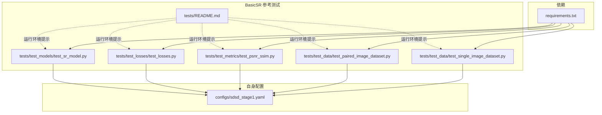
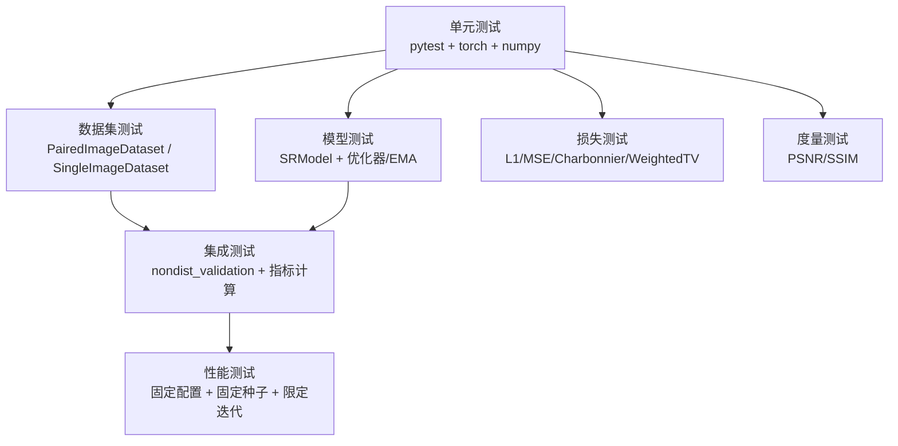
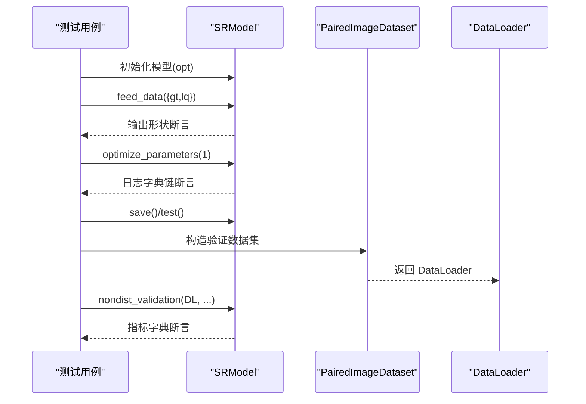
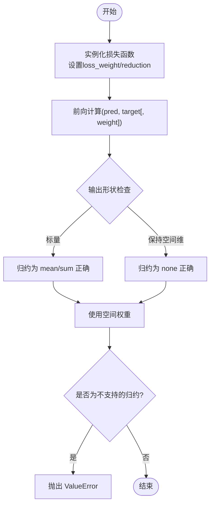
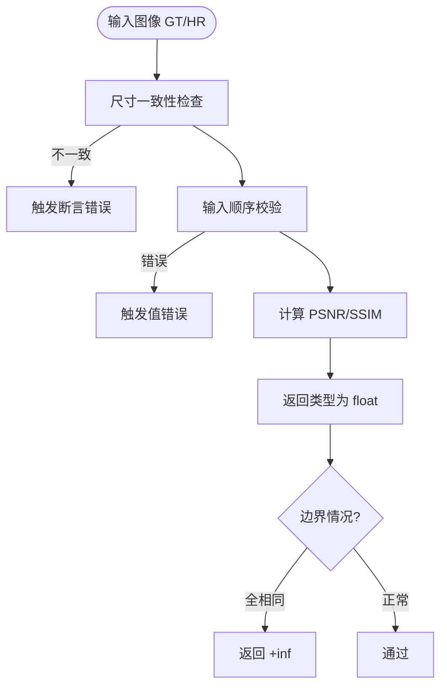
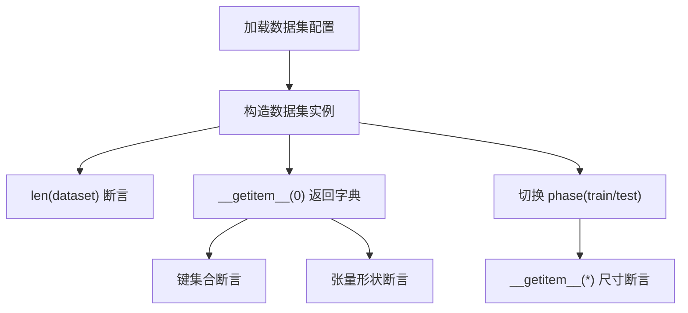
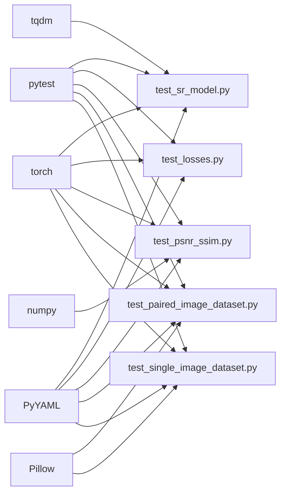

# 测试指南

<cite>
**本文引用的文件**
- [test_sr_model.py](file://reference_repos/BasicSR/tests/test_models/test_sr_model.py)
- [test_losses.py](file://reference_repos/BasicSR/tests/test_losses/test_losses.py)
- [test_psnr_ssim.py](file://reference_repos/BasicSR/tests/test_metrics/test_psnr_ssim.py)
- [test_paired_image_dataset.py](file://reference_repos/BasicSR/tests/test_data/test_paired_image_dataset.py)
- [test_single_image_dataset.py](file://reference_repos/BasicSR/tests/test_data/test_single_image_dataset.py)
- [README.md（BasicSR 测试）](file://reference_repos/BasicSR/tests/README.md)
- [sdsd_stage1.yaml](file://configs/sdsd_stage1.yaml)
- [requirements.txt](file://requirements.txt)
</cite>

## 目录
1. [引言](#引言)
2. [项目结构](#项目结构)
3. [核心组件](#核心组件)
4. [架构总览](#架构总览)
5. [详细组件分析](#详细组件分析)
6. [依赖分析](#依赖分析)
7. [性能考虑](#性能考虑)
8. [故障排查指南](#故障排查指南)
9. [结论](#结论)
10. [附录](#附录)

## 引言
本测试指南面向 TFS-Net 项目，提供从单元测试到集成测试与性能测试的完整实践路径。内容涵盖：
- 单元测试编写方法：如何为模型、损失函数、度量指标与数据集构建可重复、可验证的测试用例
- 集成测试策略：围绕训练/验证流程、数据加载与模型推理的端到端验证
- 性能测试流程：在受限硬件条件下进行稳定可靠的性能评估
- 测试框架与工具：pytest、临时目录、随机种子与配置驱动的测试参数化
- 测试数据准备：LMDB/LMDB 扫描、磁盘后端、图像尺寸与通道一致性校验
- 覆盖率与 CI：覆盖率目标建议、持续集成配置思路与自动化测试流程
- 调试技巧：断点定位、日志输出、最小可复现样例与常见问题排查

## 项目结构
本仓库包含多个参考实现与自身代码。与测试直接相关的关键位置如下：
- BasicSR 参考实现中的 tests 子目录，覆盖模型、损失、度量与数据集的单元测试
- 自身 configs 中的训练配置文件，用于指导训练与推理阶段的测试场景
- requirements.txt 提供运行测试所需的 Python 包

**图表来源**
- [test_sr_model.py:1-166](file://reference_repos/BasicSR/tests/test_models/test_sr_model.py#L1-L166)
- [test_losses.py:1-73](file://reference_repos/BasicSR/tests/test_losses/test_losses.py#L1-L73)
- [test_psnr_ssim.py:1-39](file://reference_repos/BasicSR/tests/test_metrics/test_psnr_ssim.py#L1-L39)
- [test_paired_image_dataset.py:1-98](file://reference_repos/BasicSR/tests/test_data/test_paired_image_dataset.py#L1-L98)
- [test_single_image_dataset.py:1-63](file://reference_repos/BasicSR/tests/test_data/test_single_image_dataset.py#L1-L63)
- [README.md（BasicSR 测试）:1-4](file://reference_repos/BasicSR/tests/README.md#L1-L4)
- [sdsd_stage1.yaml:1-34](file://configs/sdsd_stage1.yaml#L1-L34)
- [requirements.txt:1-8](file://requirements.txt#L1-L8)

**章节来源**
- [test_sr_model.py:1-166](file://reference_repos/BasicSR/tests/test_models/test_sr_model.py#L1-L166)
- [test_losses.py:1-73](file://reference_repos/BasicSR/tests/test_losses/test_losses.py#L1-L73)
- [test_psnr_ssim.py:1-39](file://reference_repos/BasicSR/tests/test_metrics/test_psnr_ssim.py#L1-L39)
- [test_paired_image_dataset.py:1-98](file://reference_repos/BasicSR/tests/test_data/test_paired_image_dataset.py#L1-L98)
- [test_single_image_dataset.py:1-63](file://reference_repos/BasicSR/tests/test_data/test_single_image_dataset.py#L1-L63)
- [README.md（BasicSR 测试）:1-4](file://reference_repos/BasicSR/tests/README.md#L1-L4)
- [sdsd_stage1.yaml:1-34](file://configs/sdsd_stage1.yaml#L1-L34)
- [requirements.txt:1-8](file://requirements.txt#L1-L8)

## 核心组件
- 模型层测试：验证模型初始化、前向输出形状、优化器与 EMA、保存/恢复、验证流程与指标返回
- 损失函数测试：验证像素级损失与加权总变差损失在不同归约方式下的输出形状与异常处理
- 度量指标测试：验证 PSNR/SSIM 计算在不同输入顺序、裁剪边界与通道模式下的行为与异常
- 数据集测试：验证配对/单张图像数据集在磁盘与 LMDB 后端、不同颜色通道与数据划分阶段的行为与输出形状

**章节来源**
- [test_sr_model.py:11-166](file://reference_repos/BasicSR/tests/test_models/test_sr_model.py#L11-L166)
- [test_losses.py:7-73](file://reference_repos/BasicSR/tests/test_losses/test_losses.py#L7-L73)
- [test_psnr_ssim.py:7-39](file://reference_repos/BasicSR/tests/test_metrics/test_psnr_ssim.py#L7-L39)
- [test_paired_image_dataset.py:6-98](file://reference_repos/BasicSR/tests/test_data/test_paired_image_dataset.py#L6-L98)
- [test_single_image_dataset.py:6-63](file://reference_repos/BasicSR/tests/test_data/test_single_image_dataset.py#L6-L63)

## 架构总览
下图展示了测试金字塔在本项目中的落地：以单元测试为基础，结合针对数据集与模型的集成测试，最终通过配置驱动的训练/验证流程完成端到端验证。

**图表来源**
- [test_sr_model.py:11-166](file://reference_repos/BasicSR/tests/test_models/test_sr_model.py#L11-L166)
- [test_losses.py:7-73](file://reference_repos/BasicSR/tests/test_losses/test_losses.py#L7-L73)
- [test_psnr_ssim.py:7-39](file://reference_repos/BasicSR/tests/test_metrics/test_psnr_ssim.py#L7-L39)
- [test_paired_image_dataset.py:6-98](file://reference_repos/BasicSR/tests/test_data/test_paired_image_dataset.py#L6-L98)
- [test_single_image_dataset.py:6-63](file://reference_repos/BasicSR/tests/test_data/test_single_image_dataset.py#L6-L63)

## 详细组件分析

### 模型测试（SRModel）
- 目标：验证模型初始化、优化器类型、损失函数装配、前向输出形状、EMA 状态、保存/恢复、验证流程与指标字典
- 关键断言点：
  - 类型与组件装配正确性
  - 输入/输出张量形状与设备/精度一致性
  - 日志字典键集合与指标字典存在性
  - 验证阶段返回的指标类型与数值范围
- 建议扩展：
  - 参数化不同网络结构与损失组合
  - 添加多卡分布式训练/验证的断言
  - 加入 EMA 开关切换的分支测试

**图表来源**
- [test_sr_model.py:85-166](file://reference_repos/BasicSR/tests/test_models/test_sr_model.py#L85-L166)

**章节来源**
- [test_sr_model.py:11-166](file://reference_repos/BasicSR/tests/test_models/test_sr_model.py#L11-L166)

### 损失函数测试（Pixel Losses & WeightedTV）
- 目标：验证 L1/MSE/Charbonnier 与 WeightedTV 在不同归约方式（mean/sum/none）下的输出形状与异常处理
- 关键断言点：
  - 归约为 mean/sum 时输出为标量张量
  - 归约为 none 时输出保持空间维度
  - 使用空间权重时输出形状一致
  - 不支持的归约方式抛出异常
- 建议扩展：
  - 参数化不同权重与空间形状
  - 对比数值稳定性与梯度范数

**图表来源**
- [test_losses.py:7-73](file://reference_repos/BasicSR/tests/test_losses/test_losses.py#L7-L73)

**章节来源**
- [test_losses.py:1-73](file://reference_repos/BasicSR/tests/test_losses/test_losses.py#L1-L73)

### 度量指标测试（PSNR/SSIM）
- 目标：验证 PSNR/SSIM 在不同输入顺序、裁剪边界与通道模式下的行为与异常
- 关键断言点：
  - 图像尺寸不匹配触发断言错误
  - 错误的输入顺序触发值错误
  - 正常输入返回浮点结果
  - 全相同图像返回正无穷
- 建议扩展：
  - 参数化亮度/色彩空间与 Y 通道测试
  - 多尺度/窗口大小敏感性测试

**图表来源**
- [test_psnr_ssim.py:7-39](file://reference_repos/BasicSR/tests/test_metrics/test_psnr_ssim.py#L7-L39)

**章节来源**
- [test_psnr_ssim.py:1-39](file://reference_repos/BasicSR/tests/test_metrics/test_psnr_ssim.py#L1-L39)

### 数据集测试（PairedImageDataset / SingleImageDataset）
- 目标：验证配对/单张图像数据集的元信息读取、IO 后端（磁盘/LMDB）、颜色通道与数据划分阶段的行为
- 关键断言点：
  - 元信息文件与扫描模式长度一致
  - 返回字典包含必要键（如 lq/gt/lq_path/gt_path）
  - 输出张量形状符合预期（含 Y 通道单通道情形）
  - 不同 phase 下的输出尺寸差异
- 建议扩展：
  - 参数化不同 IO 后端与颜色模式
  - 增加大图/分块读取的边界测试

**图表来源**
- [test_paired_image_dataset.py:6-98](file://reference_repos/BasicSR/tests/test_data/test_paired_image_dataset.py#L6-L98)
- [test_single_image_dataset.py:6-63](file://reference_repos/BasicSR/tests/test_data/test_single_image_dataset.py#L6-L63)

**章节来源**
- [test_paired_image_dataset.py:1-98](file://reference_repos/BasicSR/tests/test_data/test_paired_image_dataset.py#L1-L98)
- [test_single_image_dataset.py:1-63](file://reference_repos/BasicSR/tests/test_data/test_single_image_dataset.py#L1-L63)

## 依赖分析
- 测试框架与工具：pytest、临时目录、随机种子、YAML 配置
- 数值与张量：torch、numpy
- 文件与 IO：PyYAML、Pillow、tqdm
- 运行环境：BasicSR 测试要求 GPU CUDA 环境

**图表来源**
- [test_sr_model.py:1-166](file://reference_repos/BasicSR/tests/test_models/test_sr_model.py#L1-L166)
- [test_losses.py:1-73](file://reference_repos/BasicSR/tests/test_losses/test_losses.py#L1-L73)
- [test_psnr_ssim.py:1-39](file://reference_repos/BasicSR/tests/test_metrics/test_psnr_ssim.py#L1-L39)
- [test_paired_image_dataset.py:1-98](file://reference_repos/BasicSR/tests/test_data/test_paired_image_dataset.py#L1-L98)
- [test_single_image_dataset.py:1-63](file://reference_repos/BasicSR/tests/test_data/test_single_image_dataset.py#L1-L63)
- [requirements.txt:1-8](file://requirements.txt#L1-L8)

**章节来源**
- [requirements.txt:1-8](file://requirements.txt#L1-L8)
- [README.md（BasicSR 测试）:1-4](file://reference_repos/BasicSR/tests/README.md#L1-L4)

## 性能考虑
- 固定随机种子：在配置中设置 seed，确保测试结果可复现
- 限制数据规模与迭代次数：在训练配置中降低 batch_size、epochs 或启用小尺寸裁剪
- 禁用 AMP/Auto-Mixed Precision：在性能测试中关闭以避免数值波动
- 控制日志与可视化频率：减少 IO 压力，聚焦吞吐与延迟
- 使用 CPU 或受限 GPU：在 CI 环境中模拟真实资源约束

**章节来源**
- [sdsd_stage1.yaml:1-34](file://configs/sdsd_stage1.yaml#L1-L34)

## 故障排查指南
- CUDA 环境缺失：BasicSR 测试要求 GPU CUDA 环境；若无 GPU，需在本地或 CI 中安装对应驱动与 CUDA 工具链
- 数据路径与后端：确保 tests/data 下存在 LMDB 或磁盘数据；若使用 LMDB，请确认数据库已生成且路径正确
- 输入形状不匹配：在度量与数据集测试中，注意图像尺寸与通道数必须一致；Y 通道单通道输入需与均值/方差长度一致
- 归约方式异常：损失函数仅支持特定归约方式，错误输入会抛出异常；请对照测试用例修正
- 权重形状不匹配：使用空间权重时，权重与预测/目标张量形状需广播兼容
- 验证阶段指标缺失：确认验证流程中指标字典键存在且类型为数值

**章节来源**
- [README.md（BasicSR 测试）:1-4](file://reference_repos/BasicSR/tests/README.md#L1-L4)
- [test_psnr_ssim.py:10-16](file://reference_repos/BasicSR/tests/test_metrics/test_psnr_ssim.py#L10-L16)
- [test_losses.py:36-38](file://reference_repos/BasicSR/tests/test_losses/test_losses.py#L36-L38)
- [test_paired_image_dataset.py:60-66](file://reference_repos/BasicSR/tests/test_data/test_paired_image_dataset.py#L60-L66)
- [test_single_image_dataset.py:43-48](file://reference_repos/BasicSR/tests/test_data/test_single_image_dataset.py#L43-L48)

## 结论
通过以上测试金字塔与具体组件的实践，可以系统地保障 TFS-Net 的数据加载、模型训练与推理、损失与度量的正确性与稳定性。建议在团队内推广参数化测试、最小可复现样例与 CI 自动化，持续提升代码质量与交付效率。

## 附录

### A. 单元测试编写方法
- 组织结构：按模块拆分测试文件，命名与被测模块一一对应
- 断言策略：优先断言输出形状、类型与关键字存在性；对异常路径进行显式断言
- 参数化：使用 pytest.mark.parametrize 对多种配置进行批量测试
- 临时资源：使用临时目录存放中间产物，避免污染工作区

**章节来源**
- [test_losses.py:7-38](file://reference_repos/BasicSR/tests/test_losses/test_losses.py#L7-L38)
- [test_paired_image_dataset.py:46-57](file://reference_repos/BasicSR/tests/test_data/test_paired_image_dataset.py#L46-L57)

### B. 集成测试策略
- 数据到模型：构造数据集与 DataLoader，调用模型验证流程，断言指标字典与输出形状
- 配置驱动：通过 YAML 配置控制训练/验证参数，保证测试场景可复现
- 分阶段验证：区分训练、验证与测试阶段的数据划分与输出尺寸

**章节来源**
- [test_sr_model.py:127-165](file://reference_repos/BasicSR/tests/test_models/test_sr_model.py#L127-L165)
- [test_paired_image_dataset.py:83-97](file://reference_repos/BasicSR/tests/test_data/test_paired_image_dataset.py#L83-L97)

### C. 性能测试流程
- 固定种子与配置：在训练配置中设置 seed 与较小的训练规模
- 关闭 AMP：在性能测试中禁用混合精度
- 控制日志与可视化：降低 IO 干扰，专注吞吐与延迟
- 多轮采样：多次运行取统计值，排除偶发抖动

**章节来源**
- [sdsd_stage1.yaml:1-34](file://configs/sdsd_stage1.yaml#L1-L34)

### D. 测试覆盖率与持续集成
- 覆盖率目标建议：核心模块（模型、损失、数据集）达到中高覆盖率，关键分支与异常路径 100%
- CI 配置思路：在流水线中安装 CUDA 与依赖，执行 pytest 并收集覆盖率报告
- 自动化流程：提交触发测试，合并前强制通过所有测试与覆盖率阈值

[本节为通用实践建议，无需特定文件引用]

### E. 测试数据准备
- 本地数据：确保 tests/data 下存在 GT/LQ 图像与元信息文件
- LMDB 数据：使用参考实现脚本生成 LMDB 数据库，并在测试中指定正确的路径与后端
- 颜色通道：根据测试需求选择 RGB 或 Y 通道，确保均值/方差与通道数一致

**章节来源**
- [test_paired_image_dataset.py:59-71](file://reference_repos/BasicSR/tests/test_data/test_paired_image_dataset.py#L59-L71)
- [test_single_image_dataset.py:43-53](file://reference_repos/BasicSR/tests/test_data/test_single_image_dataset.py#L43-L53)