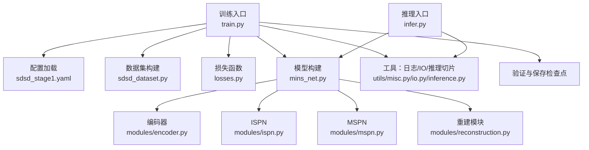
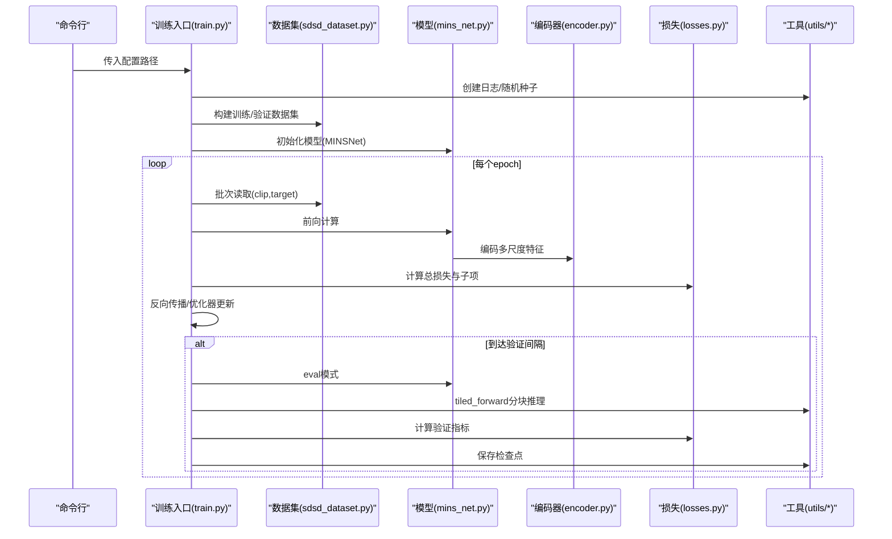
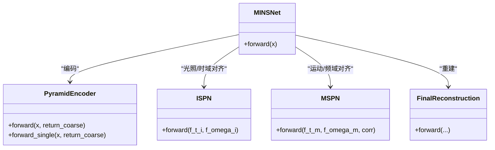
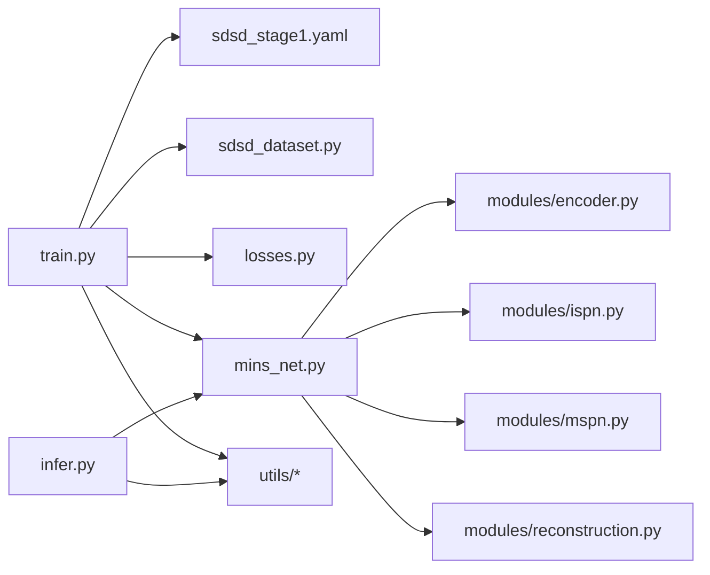

# 调试与故障排除

<cite>
**本文引用的文件**
- [train.py](file://train.py)
- [infer.py](file://infer.py)
- [sdsd_stage1.yaml](file://configs/sdsd_stage1.yaml)
- [sdsd_dataset.py](file://datasets/sdsd_dataset.py)
- [transforms.py](file://datasets/transforms.py)
- [losses.py](file://losses/losses.py)
- [misc.py](file://utils/misc.py)
- [inference.py](file://utils/inference.py)
- [io.py](file://utils/io.py)
- [mins_net.py](file://models/mins_net.py)
- [encoder.py](file://models/modules/encoder.py)
- [reconstruction.py](file://models/modules/reconstruction.py)
- [blocks.py](file://models/modules/blocks.py)
- [ispn.py](file://models/modules/ispn.py)
- [mspn.py](file://models/modules/mspn.py)
</cite>

## 目录
1. [简介](#简介)
2. [项目结构](#项目结构)
3. [核心组件](#核心组件)
4. [架构总览](#架构总览)
5. [详细组件分析](#详细组件分析)
6. [依赖分析](#依赖分析)
7. [性能考虑](#性能考虑)
8. [故障排除指南](#故障排除指南)
9. [结论](#结论)
10. [附录](#附录)

## 简介
本指南聚焦于训练与推理阶段的调试与故障排除，覆盖常见错误类型、诊断方法与解决方案，并结合本项目的训练脚本、数据集、损失函数与网络模块，给出可操作的排查步骤与优化建议。内容涵盖：
- 张量形状检查与断言
- 内存泄漏检测与显存管理
- 性能瓶颈分析与加速策略
- 日志系统使用与可视化
- 典型问题场景：模型不收敛、内存不足、梯度异常等

## 项目结构
本项目采用按功能分层组织：入口脚本负责训练/推理流程编排，配置文件定义超参与路径，数据集模块提供时序裁剪与增强，损失模块组合像素、感知与先验项，网络模块由编码器、多源处理分支与重建模块组成，工具模块提供日志、检查点与推理切片。

图表来源
- [train.py:187-264](file://train.py#L187-L264)
- [infer.py:68-109](file://infer.py#L68-L109)
- [sdsd_dataset.py:18-81](file://datasets/sdsd_dataset.py#L18-L81)
- [losses.py:80-114](file://losses/losses.py#L80-L114)
- [mins_net.py:11-67](file://models/mins_net.py#L11-L67)
- [encoder.py:35-102](file://models/modules/encoder.py#L35-L102)
- [reconstruction.py:5-24](file://models/modules/reconstruction.py#L5-L24)
- [inference.py:26-61](file://utils/inference.py#L26-L61)
- [io.py:12-27](file://utils/io.py#L12-L27)
- [misc.py:33-49](file://utils/misc.py#L33-L49)

章节来源
- [train.py:187-264](file://train.py#L187-L264)
- [infer.py:68-109](file://infer.py#L68-L109)
- [sdsd_dataset.py:18-81](file://datasets/sdsd_dataset.py#L18-L81)
- [losses.py:80-114](file://losses/losses.py#L80-L114)
- [mins_net.py:11-67](file://models/mins_net.py#L11-L67)
- [encoder.py:35-102](file://models/modules/encoder.py#L35-L102)
- [reconstruction.py:5-24](file://models/modules/reconstruction.py#L5-L24)
- [inference.py:26-61](file://utils/inference.py#L26-L61)
- [io.py:12-27](file://utils/io.py#L12-L27)
- [misc.py:33-49](file://utils/misc.py#L33-L49)

## 核心组件
- 训练主循环与统计：在每个epoch内迭代训练集，记录多类损失均值；每若干步打印日志；周期性在验证集上评估PSNR/SSIM/L1。
- 数据集与增强：时序窗口裁剪、随机裁剪、翻转与时序反转；训练样本来自输入/目标序列的交集帧。
- 损失函数：像素L1、SSIM相似度互补、感知损失（可选预训练VGG）、TV先验正则；输出包含总损失与子项明细。
- 网络结构：编码器多尺度融合+金字塔横向连接；MINS主干分别得到时域/频域特征；ISPN与MSPN进行跨模态对齐与融合；最终通过重建模块得到增强结果。
- 推理切片：大图分块推理并加权合并，避免显存溢出；支持半精度自动混合。

章节来源
- [train.py:108-161](file://train.py#L108-L161)
- [train.py:163-185](file://train.py#L163-L185)
- [sdsd_dataset.py:18-81](file://datasets/sdsd_dataset.py#L18-L81)
- [transforms.py:6-32](file://datasets/transforms.py#L6-L32)
- [losses.py:80-114](file://losses/losses.py#L80-L114)
- [mins_net.py:11-67](file://models/mins_net.py#L11-L67)
- [inference.py:26-61](file://utils/inference.py#L26-L61)

## 架构总览
训练与推理的关键交互如下：

图表来源
- [train.py:187-264](file://train.py#L187-L264)
- [sdsd_dataset.py:18-81](file://datasets/sdsd_dataset.py#L18-L81)
- [mins_net.py:11-67](file://models/mins_net.py#L11-L67)
- [encoder.py:35-102](file://models/modules/encoder.py#L35-L102)
- [losses.py:80-114](file://losses/losses.py#L80-L114)
- [inference.py:26-61](file://utils/inference.py#L26-L61)

## 详细组件分析

### 训练主循环与日志
- 关键点
  - 每步记录总损失与子项，按配置周期打印日志。
  - 对非有限损失进行跳过，避免NaN/Inf影响后续优化。
  - 验证阶段使用分块推理，逐样本累积PSNR/SSIM/L1。
  - 保存最新与最佳检查点，以PSNR作为早停/择优标准。
- 调试要点
  - 若日志显示“跳过非有限损失”，优先检查输入数据、损失权重与学习率。
  - 验证指标波动大时，检查tile大小/重叠与半精度开关。

章节来源
- [train.py:108-161](file://train.py#L108-L161)
- [train.py:163-185](file://train.py#L163-L185)
- [misc.py:33-49](file://utils/misc.py#L33-L49)

### 数据集与增强
- 关键点
  - 时序窗口大小必须为奇数且≥3；中心帧索引用于对齐。
  - 训练时对clip/target进行随机裁剪、水平/垂直翻转与时间反转。
  - 输入/目标序列帧名交集为空会触发错误。
- 调试要点
  - 若出现“无重叠帧”错误，核对输入/目标根目录与序列命名一致性。
  - 小于裁剪尺寸的样本会触发裁剪异常，需调整配置或数据预处理。

章节来源
- [sdsd_dataset.py:18-81](file://datasets/sdsd_dataset.py#L18-L81)
- [transforms.py:6-32](file://datasets/transforms.py#L6-L32)

### 损失函数
- 组成
  - 像素L1、SSIM互补、感知损失（可选预训练VGG）、TV先验正则。
  - 输出包含总损失与子项字典，便于日志与可视化。
- 调试要点
  - 感知损失依赖torchvision；若不可用将返回零并告警。
  - TV先验仅作用于先验变量，注意其缩放系数对收敛的影响。

章节来源
- [losses.py:80-114](file://losses/losses.py#L80-L114)

### 网络模块与张量形状
- 编码器
  - 支持返回最粗尺度特征，便于下游分支使用。
  - 多尺度横向连接融合，输出统一通道数。
- ISPN与MSPN
  - ISPN计算跨模态相似度并生成共享表征，再进行细化。
  - MSPN对邻居特征按窗口进行对齐与门控融合。
- 重建模块
  - 以中心帧与加权融合特征重构增强结果，限制输出范围。
- 形状断言
  - 网络与数据集均要求时序窗口为奇数且≥3，否则抛出断言错误。

图表来源
- [mins_net.py:11-67](file://models/mins_net.py#L11-L67)
- [encoder.py:35-102](file://models/modules/encoder.py#L35-L102)
- [ispn.py:7-26](file://models/modules/ispn.py#L7-L26)
- [mspn.py:7-41](file://models/modules/mspn.py#L7-L41)
- [reconstruction.py:5-24](file://models/modules/reconstruction.py#L5-L24)

章节来源
- [mins_net.py:11-67](file://models/mins_net.py#L11-L67)
- [encoder.py:35-102](file://models/modules/encoder.py#L35-L102)
- [ispn.py:7-26](file://models/modules/ispn.py#L7-L26)
- [mspn.py:7-41](file://models/modules/mspn.py#L7-L41)
- [reconstruction.py:5-24](file://models/modules/reconstruction.py#L5-L24)

### 推理切片与半精度
- 切片策略
  - 自动计算起始位置与步长，按tile_size与overlap拼接输出。
  - 对不足tile_size的边界进行反射填充，再裁剪回原尺寸。
- 半精度
  - 在CUDA设备上启用autocast，减少显存占用并提升吞吐。
- 调试要点
  - 若批大小非1，会直接报错；确保推理时单批次输入。
  - 大图推理需平衡tile_size与overlap，避免过多重叠导致冗余计算。

章节来源
- [inference.py:26-61](file://utils/inference.py#L26-L61)

## 依赖分析
- 训练入口依赖：配置、数据集、损失、模型、工具模块。
- 模型依赖：编码器、ISPN、MSPN、重建模块。
- 数据集依赖：变换模块。
- 工具模块：日志、IO、推理切片。

图表来源
- [train.py:187-264](file://train.py#L187-L264)
- [infer.py:68-109](file://infer.py#L68-L109)
- [sdsd_dataset.py:18-81](file://datasets/sdsd_dataset.py#L18-L81)
- [losses.py:80-114](file://losses/losses.py#L80-L114)
- [mins_net.py:11-67](file://models/mins_net.py#L11-L67)
- [encoder.py:35-102](file://models/modules/encoder.py#L35-L102)
- [reconstruction.py:5-24](file://models/modules/reconstruction.py#L5-L24)
- [inference.py:26-61](file://utils/inference.py#L26-L61)
- [io.py:12-27](file://utils/io.py#L12-L27)
- [misc.py:33-49](file://utils/misc.py#L33-L49)

章节来源
- [train.py:187-264](file://train.py#L187-L264)
- [infer.py:68-109](file://infer.py#L68-L109)
- [sdsd_dataset.py:18-81](file://datasets/sdsd_dataset.py#L18-L81)
- [losses.py:80-114](file://losses/losses.py#L80-L114)
- [mins_net.py:11-67](file://models/mins_net.py#L11-L67)
- [encoder.py:35-102](file://models/modules/encoder.py#L35-L102)
- [reconstruction.py:5-24](file://models/modules/reconstruction.py#L5-L24)
- [inference.py:26-61](file://utils/inference.py#L26-L61)
- [io.py:12-27](file://utils/io.py#L12-L27)
- [misc.py:33-49](file://utils/misc.py#L33-L49)

## 性能考虑
- 显存与吞吐
  - 启用混合精度（若GPU支持），在训练与推理中均可降低显存占用。
  - 使用分块推理（tile_size/overlap）处理大图，避免一次性加载。
- 数据加载
  - 合理设置num_workers与pin_memory；注意CPU与GPU资源分配。
- 模型与损失
  - 感知损失依赖VGG特征，禁用预训练可减少初始化开销。
  - TV先验正则系数过大可能导致欠拟合细节，应与像素/SSIM权重协同调优。
- 日志与可视化
  - 通过日志文件与周期性指标观察收敛趋势，及时发现异常。

[本节为通用指导，无需列出章节来源]

## 故障排除指南

### 场景一：模型不收敛/指标停滞
- 可能原因
  - 学习率过高/过低、损失权重不平衡、数据增强过度破坏信号。
  - 感知损失不可用导致无风格约束。
- 排查步骤
  - 固定学习率与权重衰减，逐步调整lambda_ssim/lambda_perc/lambda_tv。
  - 检查日志中的loss_pix、loss_ssim、loss_perc是否合理分布。
  - 临时关闭感知损失，对比收敛曲线判断风格项影响。
  - 减少随机翻转/时间反转比例，观察是否改善。
- 解决方案
  - 适当降低学习率，增加warmup或使用更稳定的优化器。
  - 平衡各损失权重，使总损失主导项与子项处于同一数量级。
  - 确保输入/目标配对正确，避免噪声/伪影干扰。

章节来源
- [train.py:108-161](file://train.py#L108-L161)
- [losses.py:80-114](file://losses/losses.py#L80-L114)

### 场景二：内存不足/显存溢出
- 可能原因
  - 图像尺寸过大、batch_size过大、未启用分块推理。
- 排查步骤
  - 降低tile_size或增大tile_overlap，减少峰值显存。
  - 在配置中开启eval.amp或train.amp（若硬件支持）。
  - 减小batch_size或num_workers，释放CPU内存给数据传输。
- 解决方案
  - 使用分块推理（tiled_forward）处理高分辨率图像。
  - 在验证阶段同样启用半精度与分块策略。

章节来源
- [inference.py:26-61](file://utils/inference.py#L26-L61)
- [sdsd_stage1.yaml:24-27](file://configs/sdsd_stage1.yaml#L24-L27)

### 场景三：梯度异常（NaN/Inf）
- 可能原因
  - 学习率过高、数值不稳定、输入数据异常。
- 排查步骤
  - 训练日志中若出现“跳过非有限损失”，立即检查最近一次batch的数据与标签。
  - 降低学习率，启用梯度裁剪（可在优化器外添加）。
  - 检查输入张量是否包含NaN/Inf或极端像素值。
- 解决方案
  - 严格校验数据预处理，确保归一化与裁剪逻辑正确。
  - 在反向传播前插入梯度检查与裁剪，防止爆炸传播。

章节来源
- [train.py:126-133](file://train.py#L126-L133)

### 场景四：张量形状不匹配/断言失败
- 可能原因
  - 时序窗口非奇数或小于3；编码器/重建模块输入维度不一致。
- 排查步骤
  - 检查配置中的window_size与数据集构造参数是否一致。
  - 核对网络forward中对输入形状的断言与实际数据流。
- 解决方案
  - 统一配置与数据集参数，确保T为奇数且≥3。
  - 如需修改网络断言，请同步更新数据与模块实现。

章节来源
- [sdsd_dataset.py:20-27](file://datasets/sdsd_dataset.py#L20-L27)
- [mins_net.py:21-22](file://models/mins_net.py#L21-L22)

### 场景五：验证指标异常波动
- 可能原因
  - 分块推理边界效应、半精度误差、评估指标计算不稳定。
- 排查步骤
  - 调整tile_size与overlap，观察指标稳定性变化。
  - 关闭eval.amp进行对比测试，确认半精度影响。
  - 检查PSNR/SSIM计算是否受裁剪边界影响。
- 解决方案
  - 适度增大overlap，减少边界误差。
  - 在稳定版本中关闭半精度，优先保证数值稳定。

章节来源
- [train.py:163-185](file://train.py#L163-L185)
- [inference.py:26-61](file://utils/inference.py#L26-L61)

### 场景六：日志与可视化
- 日志系统
  - 使用create_logger创建文件与控制台处理器，输出时间戳、级别与消息。
  - 训练期间按配置周期打印损失子项，验证阶段记录PSNR/SSIM/L1。
- 可视化建议
  - 结合指标日志绘制曲线，定位收敛异常。
  - 保存中间特征或重建结果（如需要）以便人工检查。

章节来源
- [misc.py:33-49](file://utils/misc.py#L33-L49)
- [train.py:142-152](file://train.py#L142-L152)

## 结论
本指南提供了从训练到推理的系统化调试路径：以日志为线索、以形状断言为边界、以分块策略为安全网、以损失权重与半精度为优化手段。针对常见问题（不收敛、显存溢出、梯度异常、形状不匹配、指标波动），建议采用“最小扰动法”逐步定位根因，并结合配置文件与模块实现进行交叉验证。

[本节为总结性内容，无需列出章节来源]

## 附录

### 常用配置与参数速查
- 训练与验证
  - batch_size、epochs、lr、weight_decay、amp开关、log_interval、val_interval
- 数据集
  - train_input_root/train_target_root、val_input_root/val_target_root、window_size、crop_size、num_workers
- 模型
  - in_channels、level_channels、fused_channels、mins_window_size
- 损失
  - lambda_pix、lambda_ssim、lambda_perc、lambda_tv、perceptual_pretrained
- 评估
  - tile_size、tile_overlap、amp

章节来源
- [sdsd_stage1.yaml:1-34](file://configs/sdsd_stage1.yaml#L1-L34)