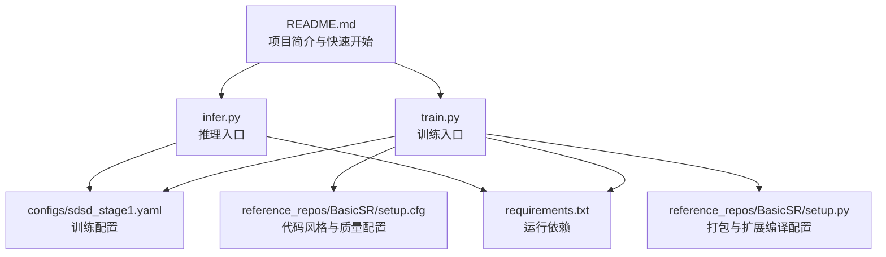
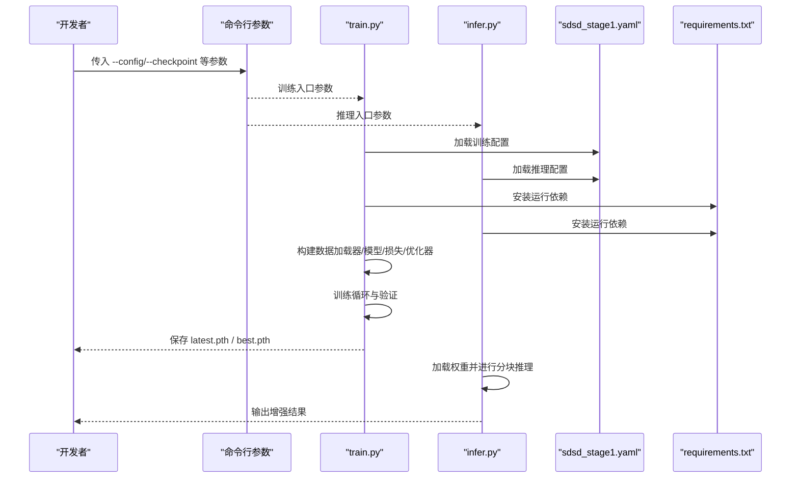
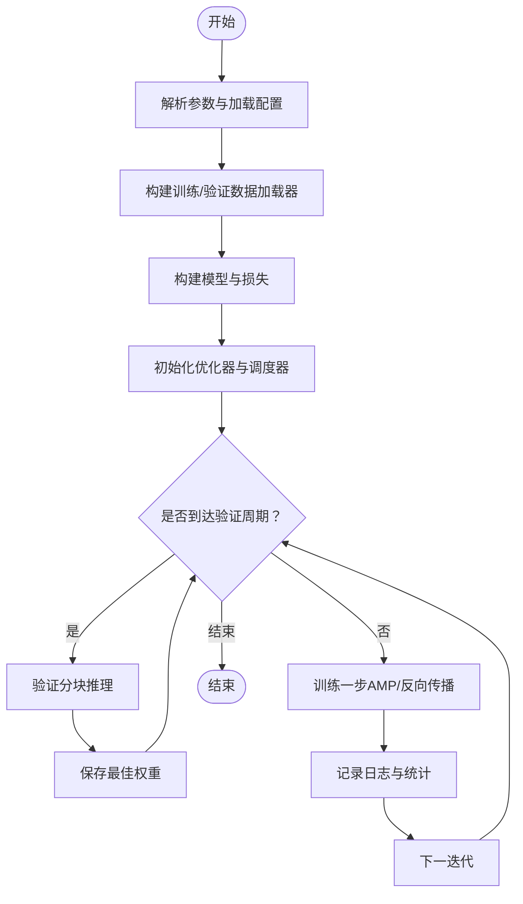
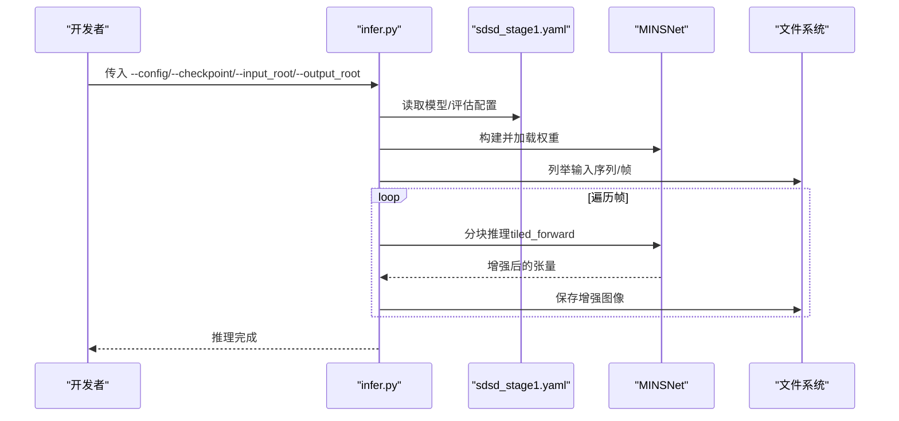
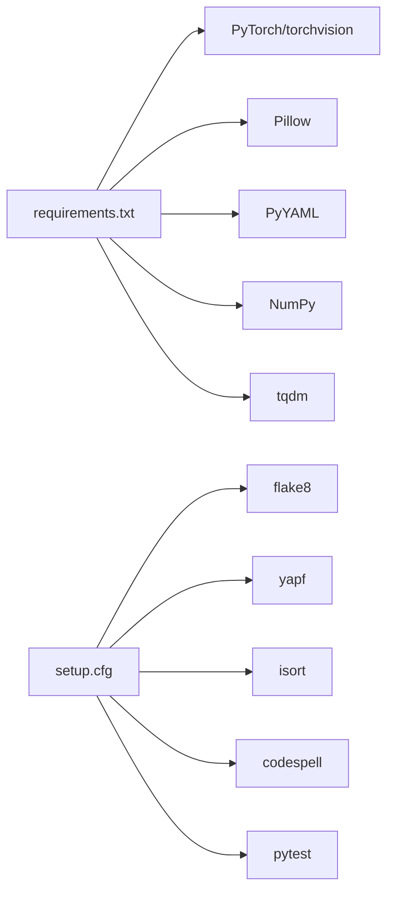

# 贡献流程

<cite>
**本文引用的文件**
- [README.md](file://README.md)
- [requirements.txt](file://requirements.txt)
- [train.py](file://train.py)
- [infer.py](file://infer.py)
- [sdsd_stage1.yaml](file://configs/sdsd_stage1.yaml)
- [setup.cfg](file://reference_repos/BasicSR/setup.cfg)
- [setup.py](file://reference_repos/BasicSR/setup.py)
</cite>

## 目录
1. 引言
2. 项目结构
3. 核心组件
4. 架构总览
5. 详细组件分析
6. 依赖分析
7. 性能考虑
8. 故障排查指南
9. 结论
10. 附录

## 引言
本文件旨在为新贡献者提供清晰、可操作的代码贡献流程与规范，涵盖开发环境搭建、依赖安装、本地训练与推理、Git 工作流、分支管理策略、Pull Request 规范、代码审查流程、贡献者协议与许可证要求、社区行为准则以及常见问题解答。内容基于仓库现有脚本与配置文件进行提炼总结，确保新成员能够快速上手并高质量地参与项目开发。

## 项目结构
本项目采用“功能模块化 + 配置驱动”的组织方式：
- 训练入口：通过命令行参数加载 YAML 配置，构建数据集、模型、损失函数与优化器，执行训练与验证循环，并周期性保存检查点。
- 推理入口：读取预训练权重，对输入序列按窗口裁取中心帧监督进行增强输出。
- 配置文件：以 YAML 统一管理数据路径、网络结构、训练超参、评估策略与损失权重等。
- 参考实现：参考仓库提供了成熟的工程化实践（如 flake8/yapf/isort/codespell 等工具配置），可作为本项目质量保障的借鉴模板。

图表来源
- [README.md:1-24](file://README.md#L1-L24)
- [train.py:1-264](file://train.py#L1-L264)
- [infer.py:1-109](file://infer.py#L1-L109)
- [sdsd_stage1.yaml:1-34](file://configs/sdsd_stage1.yaml#L1-L34)
- [requirements.txt:1-8](file://requirements.txt#L1-L8)
- [setup.cfg:1-35](file://reference_repos/BasicSR/setup.cfg#L1-L35)
- [setup.py:1-173](file://reference_repos/BasicSR/setup.py#L1-L173)

章节来源
- [README.md:1-24](file://README.md#L1-L24)
- [requirements.txt:1-8](file://requirements.txt#L1-L8)
- [train.py:1-264](file://train.py#L1-L264)
- [infer.py:1-109](file://infer.py#L1-L109)
- [sdsd_stage1.yaml:1-34](file://configs/sdsd_stage1.yaml#L1-L34)
- [setup.cfg:1-35](file://reference_repos/BasicSR/setup.cfg#L1-L35)
- [setup.py:1-173](file://reference_repos/BasicSR/setup.py#L1-L173)

## 核心组件
- 训练脚本（train.py）
  - 负责解析命令行参数与 YAML 配置、构建数据加载器、模型、损失与优化器、执行训练与验证、周期性保存检查点。
  - 支持混合精度训练、余弦退火学习率调度、滑窗验证与日志记录。
- 推理脚本（infer.py）
  - 加载配置与权重，遍历输入序列，按窗口收集中心帧监督进行增强输出，支持分块推理以降低显存占用。
- 配置文件（sdsd_stage1.yaml）
  - 定义种子、输出目录、数据集路径、模型通道、训练批次、轮数、学习率、权重衰减、AMP 开关、日志间隔、验证间隔、评估分块大小与重叠、损失权重等。
- 依赖清单（requirements.txt）
  - 指定 PyTorch 生态、图像处理、YAML 解析、数值计算与进度条等核心依赖。
- 参考质量配置（setup.cfg）
  - 提供 flake8、yapf、isort、codespell 等工具的风格与质量规则，便于统一代码风格与提升可维护性。
- 参考打包配置（setup.py）
  - 展示如何生成版本信息、条件编译 CUDA 扩展、声明安装依赖与打包元数据，可作为本项目工程化的参考。

章节来源
- [train.py:36-264](file://train.py#L36-L264)
- [infer.py:31-109](file://infer.py#L31-L109)
- [sdsd_stage1.yaml:1-34](file://configs/sdsd_stage1.yaml#L1-L34)
- [requirements.txt:1-8](file://requirements.txt#L1-L8)
- [setup.cfg:1-35](file://reference_repos/BasicSR/setup.cfg#L1-L35)
- [setup.py:59-173](file://reference_repos/BasicSR/setup.py#L59-L173)

## 架构总览
下图展示了从命令行到训练/推理执行的关键交互关系，以及配置驱动的数据流。

图表来源
- [train.py:36-264](file://train.py#L36-L264)
- [infer.py:31-109](file://infer.py#L31-L109)
- [sdsd_stage1.yaml:1-34](file://configs/sdsd_stage1.yaml#L1-L34)
- [requirements.txt:1-8](file://requirements.txt#L1-L8)

## 详细组件分析

### 训练流程（train.py）
- 关键职责
  - 参数解析与配置加载
  - 数据加载器构建（训练/验证）
  - 模型与损失构建
  - 优化器与学习率调度初始化
  - 训练循环（含混合精度、梯度缩放、日志记录）
  - 周期性验证与检查点保存（最佳与最新）
- 处理逻辑要点
  - 使用滑动窗口中心帧监督进行训练与验证
  - 支持 AMP（自动混合精度）在 CUDA 设备上启用
  - 训练统计与验证指标（PSNR/SSIM/L1）定期记录
  - 非有限损失时跳过该步，避免训练中断
- 错误处理
  - 对非有限损失进行告警并跳过，防止 NaN/Inf 导致训练崩溃
  - 训练/验证阶段均使用 no_grad 上下文控制内存与计算开销

图表来源
- [train.py:108-264](file://train.py#L108-L264)

章节来源
- [train.py:108-264](file://train.py#L108-L264)

### 推理流程（infer.py）
- 关键职责
  - 加载配置与权重
  - 遍历输入序列，按窗口收集帧并进行增强输出
  - 分块推理以降低显存占用
- 处理逻辑要点
  - 自动识别序列目录或单帧输入
  - 中心帧监督窗口大小由配置决定
  - 输出图像按原文件名保存至指定目录

图表来源
- [infer.py:68-109](file://infer.py#L68-L109)
- [sdsd_stage1.yaml:24-27](file://configs/sdsd_stage1.yaml#L24-L27)

章节来源
- [infer.py:68-109](file://infer.py#L68-L109)
- [sdsd_stage1.yaml:24-27](file://configs/sdsd_stage1.yaml#L24-L27)

### 配置驱动的数据流（sdsd_stage1.yaml）
- 数据集路径与窗口
  - 训练/验证输入与目标根目录、窗口大小、裁剪尺寸、数据加载线程数
- 模型结构
  - 输入通道、各层级通道数、融合通道数、MINS 窗口大小
- 训练超参
  - 批次大小、轮数、学习率、权重衰减、AMP 开关、日志间隔、验证间隔
- 评估策略
  - 分块大小与重叠、AMP 开关
- 损失权重
  - 像素损失、SSIM 损失、感知损失、总变差损失、感知预训练开关

章节来源
- [sdsd_stage1.yaml:1-34](file://configs/sdsd_stage1.yaml#L1-L34)

### 依赖与环境（requirements.txt）
- 必需依赖包括 PyTorch 生态、Pillow、PyYAML、NumPy、tqdm 等
- 建议使用虚拟环境隔离依赖，确保与参考仓库一致的运行环境

章节来源
- [requirements.txt:1-8](file://requirements.txt#L1-L8)

### 代码质量与工程化（setup.cfg / setup.py）
- 代码风格与静态检查
  - flake8：忽略特定规则、最大行长限制
  - yapf：PEP8 风格、行长限制、类前空行
  - isort：第三方库分组、行长限制
  - codespell：拼写检查忽略项与静默级别
- 测试与别名
  - pytest 别名 test=pytest，测试目录默认 tests/
- 打包与扩展
  - 版本文件生成、条件编译 CUDA 扩展、安装依赖声明

章节来源
- [setup.cfg:1-35](file://reference_repos/BasicSR/setup.cfg#L1-L35)
- [setup.py:59-173](file://reference_repos/BasicSR/setup.py#L59-L173)

## 依赖分析
- 运行时依赖
  - PyTorch 与 torchvision：深度学习框架与视觉工具
  - Pillow：图像读写与格式转换
  - PyYAML：配置文件解析
  - NumPy：数值计算
  - tqdm：进度显示
- 开发与质量工具
  - flake8/yapf/isort/codespell：风格与拼写检查
  - pytest：单元测试与集成测试

图表来源
- [requirements.txt:1-8](file://requirements.txt#L1-L8)
- [setup.cfg:1-35](file://reference_repos/BasicSR/setup.cfg#L1-L35)

章节来源
- [requirements.txt:1-8](file://requirements.txt#L1-L8)
- [setup.cfg:1-35](file://reference_repos/BasicSR/setup.cfg#L1-L35)

## 性能考虑
- 混合精度训练（AMP）
  - 在 CUDA 设备上启用 AMP 可显著降低显存占用并加速训练；若设备不支持或不稳定，可在配置中关闭
- 分块推理（Tile Inference）
  - 通过设置评估分块大小与重叠，平衡显存占用与边界效应
- 数据加载与并行
  - 合理设置 num_workers 与 pin_memory，减少 I/O 阻塞
- 学习率调度
  - 余弦退火调度有助于稳定收敛，建议结合验证策略使用

## 故障排查指南
- 训练过程中出现非有限损失（NaN/Inf）
  - 行为：跳过该步并记录告警
  - 建议：检查学习率、损失权重、输入数据范围与预处理
- 显存不足导致 OOM
  - 行为：分块推理与 AMP 可缓解
  - 建议：降低分块大小、增大重叠、关闭 AMP 或减少批次大小
- 权重加载失败
  - 行为：严格模式加载失败会报错
  - 建议：确认权重文件与模型结构一致，必要时重新导出权重
- 配置路径错误
  - 行为：训练/推理无法定位数据或输出目录
  - 建议：核对 YAML 中路径字段，确保存在且权限正确

章节来源
- [train.py:126-133](file://train.py#L126-L133)
- [infer.py:79-81](file://infer.py#L79-L81)
- [sdsd_stage1.yaml:4-7](file://configs/sdsd_stage1.yaml#L4-L7)

## 结论
本贡献流程文档围绕“配置驱动 + 工具链标准化”的思路，给出了从环境搭建、训练推理到代码质量与工程化的完整实践路径。建议新贡献者在提交任何改动前先完成本地验证，并遵循后续章节中的 Git 工作流与 PR 规范，以保证高质量协作与可维护性。

## 附录

### Git 工作流与分支管理策略
- 分支命名
  - feat/xxx：新增功能
  - fix/xxx：修复缺陷
  - refactor/xxx：重构但不改变行为
  - docs/xxx：仅文档更新
  - test/xxx：仅测试用例
- 提交信息
  - 类型: 概括性描述（不超过 50 字）
  - 正文: 问题背景、解决方案、影响范围
  - 脚注: 关联 Issue 编号（如 Closes #123）
- 合并与保护
  - 主干分支受保护，禁止直接推送
  - 通过 Pull Request 合并，至少一名维护者批准

### Pull Request 规范
- 标题与描述
  - 清晰说明变更目的与范围
  - 包含测试方法与验证结果
- 代码审查
  - 优先关注正确性、性能与可读性
  - 保持小步提交，便于审查
- CI 与质量
  - 通过 flake8/yapf/isort/codespell 等检查
  - 单元测试与端到端测试通过

### 代码审查流程
- 自检清单
  - 本地已通过 flake8/yapf/isort/codespell
  - 新增/修改逻辑有对应测试
  - 文档同步更新（如有）
- 审查要点
  - 是否满足需求与设计约束
  - 是否引入不必要的复杂度
  - 是否影响现有功能稳定性

### 贡献者协议与许可证
- 贡献者协议
  - 贡献即表示同意遵守项目许可证条款
  - 请在首次提交 PR 时确认
- 许可证要求
  - 本项目未内置许可证文件，请参照参考仓库的许可证模板进行补充与标注
- 社区行为准则
  - 尊重、包容、专业、安全
  - 禁止骚扰、歧视与攻击性言论

### 开发环境搭建与本地测试
- 环境准备
  - 创建并激活虚拟环境
  - 安装依赖：pip install -r requirements.txt
- 本地训练
  - 修改配置文件中的数据路径后运行：python train.py --config configs/sdsd_stage1.yaml
  - 可使用烟雾测试：添加 --smoke 快速验证流程
- 本地推理
  - 准备权重文件与输入序列，运行：python infer.py --config configs/sdsd_stage1.yaml --checkpoint path/to/best.pth --input_root ... --output_root ...
- 代码质量
  - 使用 flake8/yapf/isort/codespell 检查并修正
  - pytest 运行测试（如存在）

### 常见问题解答
- 如何选择合适的窗口大小？
  - 根据视频序列的运动幅度与 GPU 内存选择，过大易 OOM，过小可能丢失上下文
- 为什么开启 AMP 后训练不稳定？
  - 可能由于数值精度波动，建议先关闭 AMP 验证，再逐步开启
- 如何批量评估多个序列？
  - 将每个序列放在独立子目录中，脚本会自动递归扫描
- 如何导出最佳权重？
  - 训练过程中会在输出目录生成 best.pth，用于后续推理