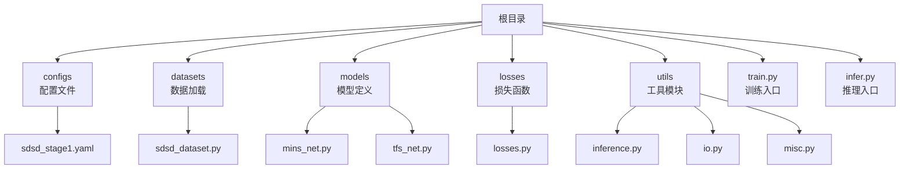
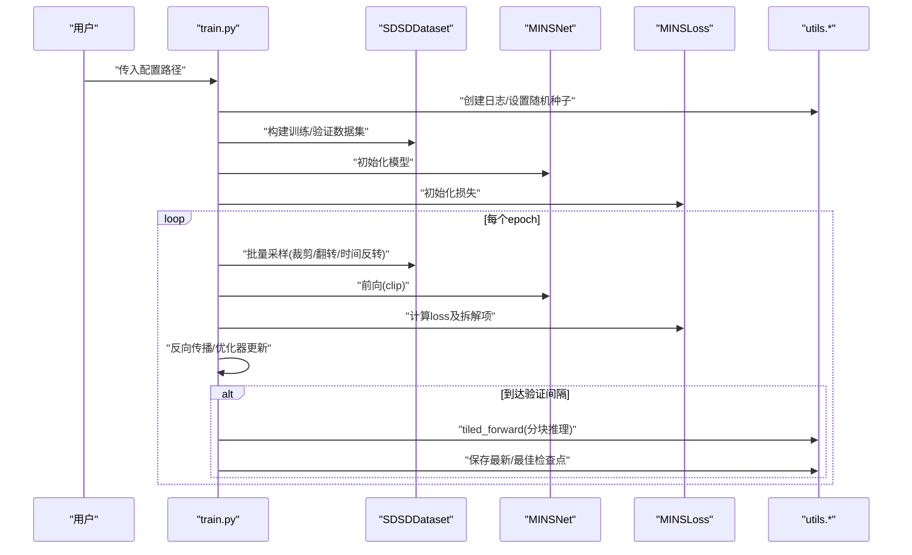
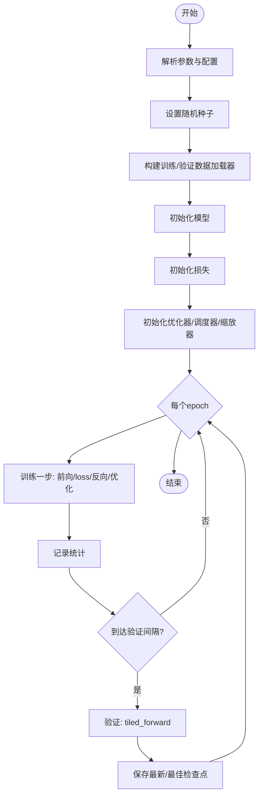
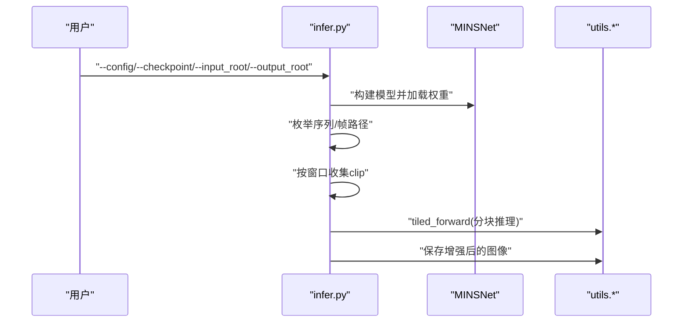
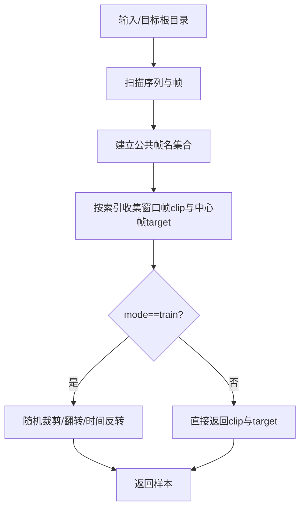
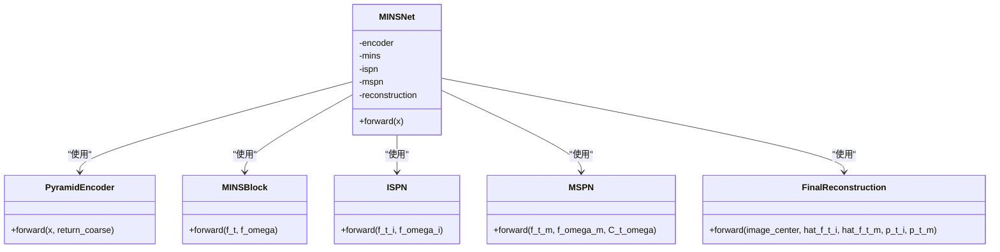
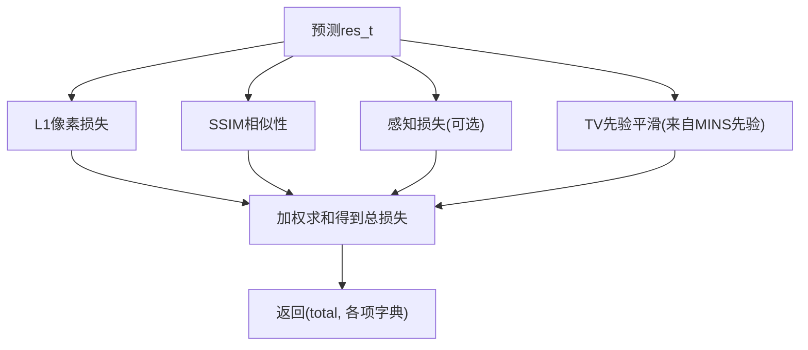
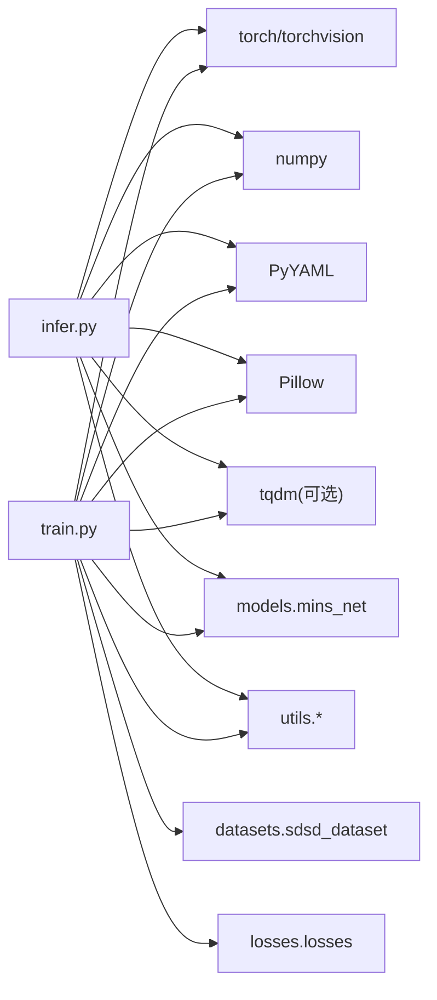

# 快速开始

<cite>
**本文引用的文件**   
- [README.md](file://README.md)
- [requirements.txt](file://requirements.txt)
- [configs/sdsd_stage1.yaml](file://configs/sdsd_stage1.yaml)
- [train.py](file://train.py)
- [infer.py](file://infer.py)
- [models/mins_net.py](file://models/mins_net.py)
- [models/tfs_net.py](file://models/tfs_net.py)
- [datasets/sdsd_dataset.py](file://datasets/sdsd_dataset.py)
- [losses/losses.py](file://losses/losses.py)
- [utils/inference.py](file://utils/inference.py)
- [utils/io.py](file://utils/io.py)
- [utils/misc.py](file://utils/misc.py)
</cite>

## 目录
1. [简介](#简介)
2. [项目结构](#项目结构)
3. [核心组件](#核心组件)
4. [架构总览](#架构总览)
5. [详细组件分析](#详细组件分析)
6. [依赖关系分析](#依赖关系分析)
7. [性能注意事项](#性能注意事项)
8. [故障排除指南](#故障排除指南)
9. [结论](#结论)
10. [附录](#附录)

## 简介
本指南面向首次接触 TFS-Net 的用户，帮助你在最短时间内完成环境准备、依赖安装、配置调整与训练/推理运行，并提供常见问题排查建议。项目当前以 MINS-Net 的可运行版本为基础，支持 SDSD 数据集上的视频低光增强训练与推理。

## 项目结构
- 根目录包含入口脚本、配置文件、模型定义、数据集与损失函数、工具模块等。
- 训练入口：train.py
- 推理入口：infer.py
- 配置文件：configs/sdsd_stage1.yaml
- 模型：models/mins_net.py（当前主干）、models/tfs_net.py（设计骨架）
- 数据集：datasets/sdsd_dataset.py
- 损失函数：losses/losses.py
- 推理切片与IO工具：utils/inference.py、utils/io.py、utils/misc.py

图表来源
- [train.py:1-264](file://train.py#L1-L264)
- [infer.py:1-109](file://infer.py#L1-L109)
- [configs/sdsd_stage1.yaml:1-34](file://configs/sdsd_stage1.yaml#L1-L34)
- [datasets/sdsd_dataset.py:1-81](file://datasets/sdsd_dataset.py#L1-L81)
- [models/mins_net.py:1-67](file://models/mins_net.py#L1-L67)
- [models/tfs_net.py:1-181](file://models/tfs_net.py#L1-L181)
- [losses/losses.py:1-114](file://losses/losses.py#L1-L114)
- [utils/inference.py:1-61](file://utils/inference.py#L1-L61)
- [utils/io.py:1-27](file://utils/io.py#L1-L27)
- [utils/misc.py:1-49](file://utils/misc.py#L1-L49)

章节来源
- [README.md:1-24](file://README.md#L1-L24)
- [requirements.txt:1-8](file://requirements.txt#L1-L8)

## 核心组件
- 训练入口：解析配置、构建数据加载器、模型、损失与优化器，执行训练循环与验证保存。
- 推理入口：加载配置与权重，对输入序列按窗口裁取与拼接推理，分块推理避免显存不足。
- 数据集：从输入/目标目录读取序列帧，按窗口大小生成多帧片段与中心帧标签。
- 模型：MINSNet 主干（金字塔编码器+MINS/ISPN/MSPN+重建），TFSNet 设计骨架（部分模块待实现）。
- 损失：像素L1、SSIM、感知损失与先验平滑TV损失组合。
- 工具：日志记录、随机种子、检查点保存/加载、图像保存、分块推理。

章节来源
- [train.py:36-264](file://train.py#L36-L264)
- [infer.py:31-109](file://infer.py#L31-L109)
- [datasets/sdsd_dataset.py:18-81](file://datasets/sdsd_dataset.py#L18-L81)
- [models/mins_net.py:11-67](file://models/mins_net.py#L11-L67)
- [models/tfs_net.py:34-181](file://models/tfs_net.py#L34-L181)
- [losses/losses.py:80-114](file://losses/losses.py#L80-L114)
- [utils/inference.py:26-61](file://utils/inference.py#L26-L61)
- [utils/io.py:12-27](file://utils/io.py#L12-L27)
- [utils/misc.py:33-49](file://utils/misc.py#L33-L49)

## 架构总览
训练与推理的关键交互如下：

图表来源
- [train.py:187-264](file://train.py#L187-L264)
- [datasets/sdsd_dataset.py:18-81](file://datasets/sdsd_dataset.py#L18-L81)
- [models/mins_net.py:11-67](file://models/mins_net.py#L11-L67)
- [losses/losses.py:80-114](file://losses/losses.py#L80-L114)
- [utils/inference.py:26-61](file://utils/inference.py#L26-L61)

## 详细组件分析

### 训练流程（train.py）
- 解析参数与配置，设置随机种子与日志。
- 构建训练/验证数据集（支持小规模Smoke测试）。
- 初始化模型、损失、优化器、学习率调度器与混合精度缩放器。
- 训练循环：前向、损失计算、反向传播、优化器更新；周期性记录与验证。
- 验证阶段使用分块推理，保存最新与最佳检查点。

图表来源
- [train.py:187-264](file://train.py#L187-L264)

章节来源
- [train.py:36-264](file://train.py#L36-L264)

### 推理流程（infer.py）
- 加载配置与设备，构建相同结构的模型并加载权重。
- 遍历输入序列（支持子目录序列或多图），按窗口收集帧，调用分块推理，逐帧保存结果。

图表来源
- [infer.py:68-109](file://infer.py#L68-L109)
- [utils/inference.py:26-61](file://utils/inference.py#L26-L61)

章节来源
- [infer.py:31-109](file://infer.py#L31-L109)

### 数据集（SDSDDataset）
- 从输入/目标根目录扫描序列，建立公共帧名映射，按窗口大小读取多帧clip与中心帧目标。
- 训练模式下进行随机裁剪、随机翻转与随机时间反转增强。

图表来源
- [datasets/sdsd_dataset.py:18-81](file://datasets/sdsd_dataset.py#L18-L81)

章节来源
- [datasets/sdsd_dataset.py:18-81](file://datasets/sdsd_dataset.py#L18-L81)

### 模型（MINSNet）
- 结构：金字塔编码器（共享特征）→ MINS（时域-频域分解）→ ISPN（光谱域）→ MSPN（多尺度频域）→ 最终重建。
- 前向输出包含增强结果、先验与中间特征字典，便于损失与可视化。

图表来源
- [models/mins_net.py:11-67](file://models/mins_net.py#L11-L67)
- [models/modules/encoder.py:35-102](file://models/modules/encoder.py#L35-L102)
- [models/modules/reconstruction.py:5-24](file://models/modules/reconstruction.py#L5-L24)

章节来源
- [models/mins_net.py:11-67](file://models/mins_net.py#L11-L67)

### 损失（MINSLoss）
- 组合：L1像素误差、SSIM相似性、感知损失（可选预训练VGG特征）、TV先验平滑损失。
- 输出包含总损失与各项拆解，便于日志记录与分析。

图表来源
- [losses/losses.py:80-114](file://losses/losses.py#L80-L114)

章节来源
- [losses/losses.py:80-114](file://losses/losses.py#L80-L114)

### 工具模块
- 日志与随机种子：统一设置随机种子与训练日志输出。
- 检查点：保存/加载模型、优化器、调度器与配置。
- 推理切片：按瓦片大小与重叠区域分块推理，避免显存溢出。

章节来源
- [utils/misc.py:26-49](file://utils/misc.py#L26-L49)
- [utils/io.py:12-27](file://utils/io.py#L12-L27)
- [utils/inference.py:26-61](file://utils/inference.py#L26-L61)

## 依赖关系分析
- 训练/推理依赖 PyTorch 生态与常用科学计算库。
- 训练脚本动态导入 tqdm，若缺失则降级为无进度条版本。
- 感知损失依赖 torchvision VGG16，若不可用会发出警告并返回零损失。

图表来源
- [requirements.txt:1-8](file://requirements.txt#L1-L8)
- [train.py:1-34](file://train.py#L1-L34)
- [infer.py:1-29](file://infer.py#L1-L29)

章节来源
- [requirements.txt:1-8](file://requirements.txt#L1-L8)
- [train.py:1-34](file://train.py#L1-L34)
- [infer.py:1-29](file://infer.py#L1-L29)

## 性能注意事项
- 混合精度：训练与推理均可通过配置启用 AMP，加速并节省显存。
- 分块推理：在高分辨率或大尺寸输入上使用瓦片大小与重叠，平衡速度与内存占用。
- 数据加载：合理设置 num_workers 与 pin_memory，提升IO吞吐。
- 学习率与调度：余弦退火调度有助于稳定收敛。
- 梯度检查与跳过：遇到非有限损失时自动跳过，避免训练中断。

章节来源
- [configs/sdsd_stage1.yaml:16-27](file://configs/sdsd_stage1.yaml#L16-L27)
- [train.py:108-161](file://train.py#L108-L161)
- [train.py:203-205](file://train.py#L203-L205)
- [utils/inference.py:26-61](file://utils/inference.py#L26-L61)

## 故障排除指南
- 无法找到依赖包
  - 现象：导入失败或功能受限（如感知损失为零）。
  - 处理：安装 requirements.txt 中列出的依赖；若缺少 tqdm，程序会自动降级为无进度条版本。
  - 参考：[requirements.txt:1-8](file://requirements.txt#L1-8)，[train.py:11-25](file://train.py#L11-L25)

- 感知损失警告
  - 现象：提示无法加载预训练VGG权重或torchvision不可用。
  - 处理：保持配置中的感知损失开关；若网络受限，可关闭预训练以避免下载失败。
  - 参考：[losses/losses.py:38-71](file://losses/losses.py#L38-L71)，[configs/sdsd_stage1.yaml:28-34](file://configs/sdsd_stage1.yaml#L28-L34)

- 显存不足
  - 现象：CUDA OOM。
  - 处理：降低 eval.tile_size 或增大 tile_overlap；减小 batch_size；关闭 AMP。
  - 参考：[utils/inference.py:26-61](file://utils/inference.py#L26-L61)，[configs/sdsd_stage1.yaml:16-27](file://configs/sdsd_stage1.yaml#L16-L27)

- 数据路径错误
  - 现象：找不到序列或输入/目标帧不匹配。
  - 处理：核对配置中的路径与实际目录结构；确保输入/目标目录下存在同名帧。
  - 参考：[datasets/sdsd_dataset.py:29-51](file://datasets/sdsd_dataset.py#L29-L51)，[configs/sdsd_stage1.yaml:3-8](file://configs/sdsd_stage1.yaml#L3-L8)

- 训练中断或NaN
  - 现象：loss非有限或梯度异常。
  - 处理：检查学习率是否过大；尝试关闭AMP；查看日志 train.log。
  - 参考：[train.py:126-129](file://train.py#L126-L129)，[train.py:194-196](file://train.py#L194-L196)

- 权重加载失败
  - 现象：加载检查点时报错。
  - 处理：确认 checkpoint 路径正确且与模型结构一致；必要时在加载时指定 map_location。
  - 参考：[infer.py:79-81](file://infer.py#L79-L81)，[utils/io.py:17-18](file://utils/io.py#L17-L18)

## 结论
通过本指南，你可以在本地完成依赖安装、配置校验与首次训练/推理。建议先用 Smoke 测试快速跑通流程，再逐步调整配置与超参。若遇到问题，请优先检查路径、显存与依赖版本，并参考故障排除章节。

## 附录

### 环境与依赖安装
- Python 版本：建议使用 Python 3.8+。
- 依赖安装：使用 pip 安装 requirements.txt 中的包。
- 可选：安装 tqdm 以获得进度条显示。

章节来源
- [requirements.txt:1-8](file://requirements.txt#L1-L8)

### 配置文件设置
- 关键字段
  - seed：随机种子
  - output_dir：训练输出目录
  - dataset：训练/验证输入/目标根目录、窗口大小、裁剪尺寸、工作线程数
  - model：输入通道、各层通道、融合通道、MINS窗口大小
  - train：批大小、轮数、学习率、权重衰减、AMP开关、日志与验证间隔
  - eval：分块推理的瓦片大小与重叠、AMP开关
  - loss：各损失权重、感知损失是否使用预训练权重

章节来源
- [configs/sdsd_stage1.yaml:1-34](file://configs/sdsd_stage1.yaml#L1-L34)

### 基本使用方法
- 训练
  - 步骤：安装依赖 → 编辑配置路径 → 执行训练命令
  - 参考：[README.md:12-18](file://README.md#L12-L18)，[train.py:187-264](file://train.py#L187-L264)

- 推理
  - 步骤：准备权重 → 准备输入序列 → 执行推理命令 → 查看输出
  - 参考：[README.md:17-18](file://README.md#L17-L18)，[infer.py:68-109](file://infer.py#L68-L109)

### 第一个训练/推理示例（操作指引）
- 训练
  - 在项目根目录执行：python train.py --config configs/sdsd_stage1.yaml
  - 训练日志保存在 output_dir/train.log
  - 最佳模型保存为 latest.pth 与 best.pth
- 推理
  - 在项目根目录执行：python infer.py --config configs/sdsd_stage1.yaml --checkpoint outputs/sdsd_stage1/best.pth --input_root F:/DatasetDL/SDSD/test/low-light --output_root outputs/infer
  - 输出图像保存在 --output_root 下对应序列目录

章节来源
- [README.md:12-18](file://README.md#L12-L18)
- [train.py:187-264](file://train.py#L187-L264)
- [infer.py:68-109](file://infer.py#L68-L109)