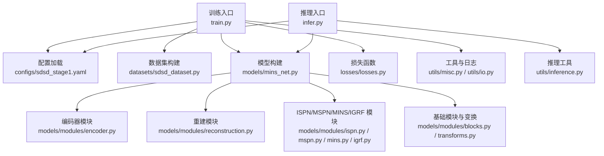
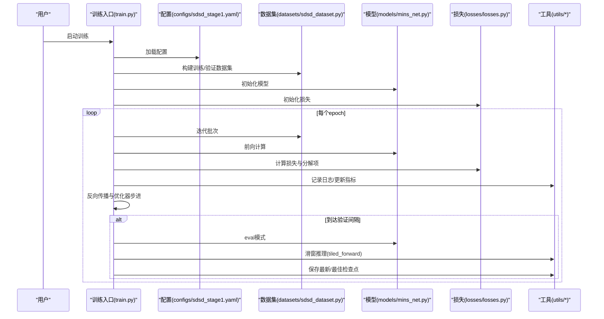
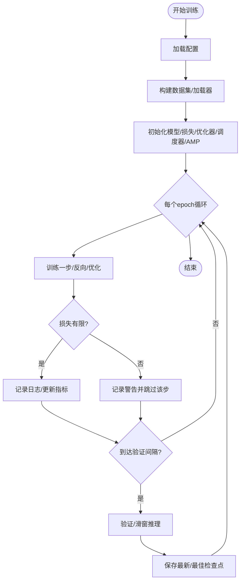
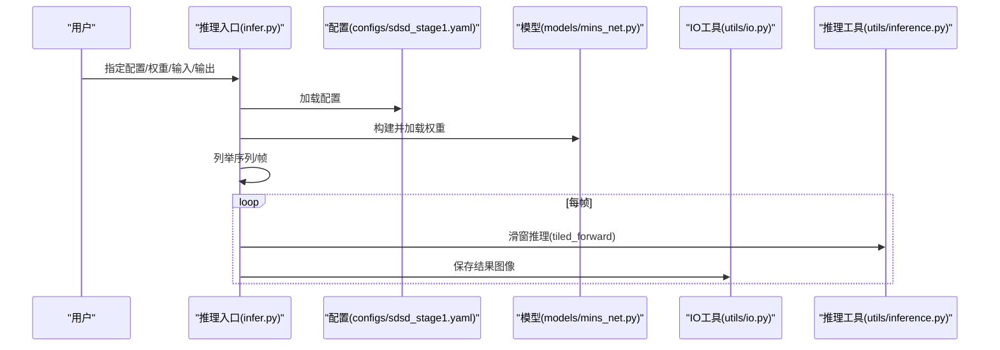
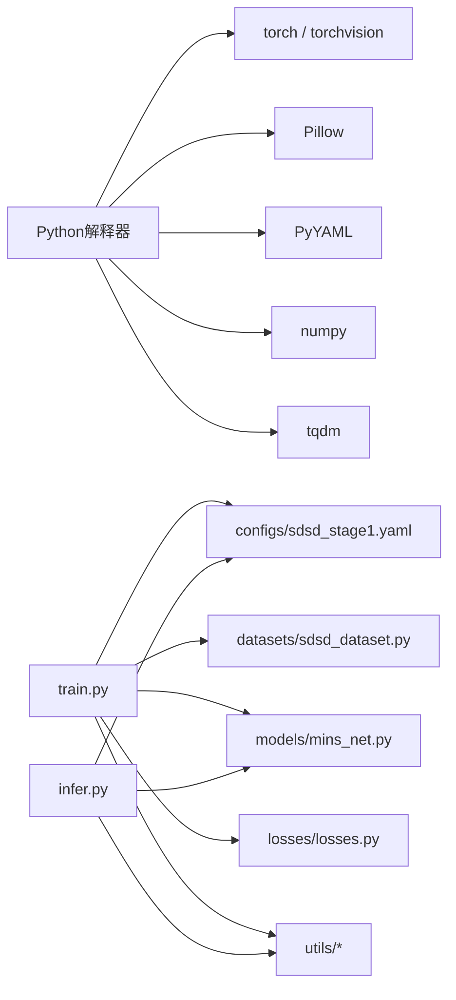

# 故障排除与FAQ

<cite>
**本文引用的文件**
- [README.md](file://README.md)
- [requirements.txt](file://requirements.txt)
- [configs/sdsd_stage1.yaml](file://configs/sdsd_stage1.yaml)
- [train.py](file://train.py)
- [infer.py](file://infer.py)
- [utils/misc.py](file://utils/misc.py)
- [utils/io.py](file://utils/io.py)
- [datasets/sdsd_dataset.py](file://datasets/sdsd_dataset.py)
- [models/mins_net.py](file://models/mins_net.py)
- [models/tfs_net.py](file://models/tfs_net.py)
- [models/modules/encoder.py](file://models/modules/encoder.py)
- [models/modules/reconstruction.py](file://models/modules/reconstruction.py)
- [models/modules/ispn.py](file://models/modules/ispn.py)
- [models/modules/mspn.py](file://models/modules/mspn.py)
- [models/modules/mins.py](file://models/modules/mins.py)
- [models/modules/igrf.py](file://models/modules/igrf.py)
- [models/modules/blocks.py](file://models/modules/blocks.py)
- [models/modules/transforms.py](file://models/modules/transforms.py)
- [losses/losses.py](file://losses/losses.py)
- [reference_repos/BasicSR/basicsr/utils/logger.py](file://reference_repos/BasicSR/basicsr/utils/logger.py)
- [reference_repos/BasicSR/basicsr/data/prefetch_dataloader.py](file://reference_repos/BasicSR/basicsr/data/prefetch_dataloader.py)
- [reference_repos/NAFNet/basicsr/models/archs/arch_util.py](file://reference_repos/NAFNet/basicsr/models/archs/arch_util.py)
</cite>

## 目录
1. [简介](#简介)
2. [项目结构](#项目结构)
3. [核心组件](#核心组件)
4. [架构总览](#架构总览)
5. [详细组件分析](#详细组件分析)
6. [依赖关系分析](#依赖关系分析)
7. [性能考虑](#性能考虑)
8. [故障排除指南](#故障排除指南)
9. [结论](#结论)
10. [附录](#附录)

## 简介
本文件面向使用本项目的用户，提供从安装、配置、训练到推理的完整故障排除与常见问题解答（FAQ）。内容涵盖错误诊断方法、性能调优建议、系统兼容性说明、日志分析与调试工具使用方法，并给出问题反馈与社区支持渠道，帮助您快速定位并解决问题。

## 项目结构
本项目采用“脚本驱动 + 配置优先”的组织方式：训练与推理入口脚本分别位于根目录，配置文件集中于 configs 目录，模型、损失、数据集与工具模块按功能分层组织。下图展示与故障排查相关的关键文件与模块：

图表来源
- [train.py:1-264](file://train.py#L1-L264)
- [infer.py:1-109](file://infer.py#L1-L109)
- [configs/sdsd_stage1.yaml:1-34](file://configs/sdsd_stage1.yaml#L1-L34)
- [datasets/sdsd_dataset.py](file://datasets/sdsd_dataset.py)
- [models/mins_net.py](file://models/mins_net.py)
- [models/modules/encoder.py](file://models/modules/encoder.py)
- [models/modules/reconstruction.py](file://models/modules/reconstruction.py)
- [models/modules/ispn.py](file://models/modules/ispn.py)
- [models/modules/mspn.py](file://models/modules/mspn.py)
- [models/modules/mins.py](file://models/modules/mins.py)
- [models/modules/igrf.py](file://models/modules/igrf.py)
- [models/modules/blocks.py](file://models/modules/blocks.py)
- [models/modules/transforms.py](file://models/modules/transforms.py)
- [losses/losses.py](file://losses/losses.py)
- [utils/misc.py:1-49](file://utils/misc.py#L1-L49)
- [utils/io.py:1-27](file://utils/io.py#L1-L27)

章节来源
- [README.md:1-24](file://README.md#L1-L24)
- [requirements.txt:1-8](file://requirements.txt#L1-L8)
- [configs/sdsd_stage1.yaml:1-34](file://configs/sdsd_stage1.yaml#L1-L34)

## 核心组件
- 训练入口与流程控制：负责参数解析、配置加载、数据集构建、模型与损失初始化、优化器与学习率调度、训练循环、验证与检查点保存。
- 推理入口与流程控制：负责参数解析、配置加载、模型构建与权重加载、序列/帧遍历、滑窗推理与图像保存。
- 工具与日志：统一的日志记录器、随机种子设置、平均值统计器、检查点与图像IO工具。
- 数据集与数据管线：基于窗口采样的视频低光数据集，支持裁剪、多进程加载与预取。
- 模型与模块：MINS-Net 主干网络及金字塔编码器、重建与多分支模块（ISPN/MSPN/MINS/IGRF）等。
- 损失函数：像素损失、SSIM、感知损失与先验平滑正则化组合。

章节来源
- [train.py:187-260](file://train.py#L187-L260)
- [infer.py:68-105](file://infer.py#L68-L105)
- [utils/misc.py:9-49](file://utils/misc.py#L9-L49)
- [utils/io.py:8-27](file://utils/io.py#L8-L27)
- [datasets/sdsd_dataset.py](file://datasets/sdsd_dataset.py)
- [models/mins_net.py](file://models/mins_net.py)
- [losses/losses.py](file://losses/losses.py)

## 架构总览
下图展示训练与推理两条主线的数据流与关键交互点，有助于定位问题发生环节。

图表来源
- [train.py:108-257](file://train.py#L108-L257)
- [configs/sdsd_stage1.yaml:1-34](file://configs/sdsd_stage1.yaml#L1-L34)
- [datasets/sdsd_dataset.py](file://datasets/sdsd_dataset.py)
- [models/mins_net.py](file://models/mins_net.py)
- [losses/losses.py](file://losses/losses.py)
- [utils/misc.py:33-47](file://utils/misc.py#L33-L47)
- [utils/io.py:12-18](file://utils/io.py#L12-L18)

## 详细组件分析

### 训练流程与常见问题定位
- 训练入口负责参数解析、配置加载、数据集构建、模型与损失初始化、优化器与调度器、AMP混合精度、训练循环、验证与检查点保存。
- 关键断点：
  - 配置路径与字段缺失：检查配置文件路径是否正确、字段是否齐全。
  - 设备选择与CUDA可用性：若无GPU或驱动异常，会回退CPU；需关注显存不足导致的OOM。
  - 损失非有限值跳过：当损失非有限时会记录警告并跳过该步，需检查学习率、损失权重与输入数据。
  - 验证与检查点：验证周期、滑窗推理参数与输出目录权限。

图表来源
- [train.py:108-257](file://train.py#L108-L257)

章节来源
- [train.py:187-260](file://train.py#L187-L260)
- [utils/misc.py:33-47](file://utils/misc.py#L33-L47)
- [utils/io.py:12-18](file://utils/io.py#L12-L18)

### 推理流程与常见问题定位
- 推理入口负责参数解析、配置加载、模型构建与权重加载、序列/帧遍历、滑窗推理与图像保存。
- 关键断点：
  - 权重文件路径与格式：确保checkpoint存在且可被torch.load加载。
  - 输入序列组织：支持子目录序列与单目录帧，需确认路径层级与文件排序。
  - 滑窗推理参数：tile_size与tile_overlap影响显存占用与速度，需根据显存调整。
  - 输出目录权限：确保输出根目录可写。

图表来源
- [infer.py:68-105](file://infer.py#L68-L105)
- [utils/io.py:21-26](file://utils/io.py#L21-L26)

章节来源
- [infer.py:68-105](file://infer.py#L68-L105)
- [utils/io.py:8-27](file://utils/io.py#L8-L27)

### 日志与环境信息
- 统一日志：训练日志同时输出至文件与标准流，便于离线分析与实时观察。
- 环境信息：可打印PyTorch/TorchVision/版本信息，用于复现与兼容性核对。

章节来源
- [utils/misc.py:33-47](file://utils/misc.py#L33-L47)
- [reference_repos/BasicSR/basicsr/utils/logger.py:110-154](file://reference_repos/BasicSR/basicsr/utils/logger.py#L110-L154)

### 数据加载与预取
- 多进程数据加载与pin_memory提升吞吐，必要时可启用prefetch增强GPU利用率。
- 若出现数据加载卡顿或CPU瓶颈，可降低num_workers或关闭pin_memory。

章节来源
- [train.py:48-84](file://train.py#L48-L84)
- [reference_repos/BasicSR/basicsr/data/prefetch_dataloader.py:99-122](file://reference_repos/BasicSR/basicsr/data/prefetch_dataloader.py#L99-L122)

### 性能基准与推理速度测量
- 提供推理速度测量工具，可用于评估不同tile参数下的吞吐与延迟。

章节来源
- [reference_repos/NAFNet/basicsr/models/archs/arch_util.py:312-320](file://reference_repos/NAFNet/basicsr/models/archs/arch_util.py#L312-L320)

## 依赖关系分析
- Python运行时与第三方库：torch、torchvision、Pillow、PyYAML、numpy、tqdm。
- 训练与推理均依赖配置文件中的路径与超参数；模型与损失模块之间松耦合，便于替换与扩展。
- 数据集模块与模型模块通过张量接口解耦，便于替换不同数据源或网络结构。

图表来源
- [requirements.txt:1-8](file://requirements.txt#L1-L8)
- [train.py:1-34](file://train.py#L1-L34)
- [infer.py:1-29](file://infer.py#L1-L29)
- [configs/sdsd_stage1.yaml:1-34](file://configs/sdsd_stage1.yaml#L1-L34)

章节来源
- [requirements.txt:1-8](file://requirements.txt#L1-L8)
- [train.py:1-34](file://train.py#L1-L34)
- [infer.py:1-29](file://infer.py#L1-L29)

## 性能考虑
- 显存与批大小：增大batch_size或tile_size会显著增加显存占用，建议从小到大逐步调优。
- AMP混合精度：在支持的设备上开启可减少显存与加速训练/推理，但需注意数值稳定性。
- 数据加载：合理设置num_workers与pin_memory，避免CPU瓶颈；必要时启用prefetch。
- 滑窗策略：tile_overlap越大，边缘拼接越平滑但速度更慢；可根据场景平衡质量与速度。
- 学习率与损失权重：过高的学习率易导致损失爆炸，需结合损失分解项监控收敛情况。

## 故障排除指南

### 安装与环境
- 依赖未安装或版本不匹配
  - 现象：导入失败、运行时报错。
  - 处理：使用提供的依赖清单安装，确保PyTorch与TorchVision版本兼容。
  - 参考
    - [requirements.txt:1-8](file://requirements.txt#L1-L8)
- CUDA/驱动不兼容
  - 现象：无法使用GPU、报CUDA相关错误。
  - 处理：确认CUDA与PyTorch匹配；若无GPU，代码会自动回退CPU。
  - 参考
    - [train.py:197-198](file://train.py#L197-L198)
- 权重下载失败（感知损失）
  - 现象：首次运行感知损失时报下载失败。
  - 处理：按项目说明禁用在线下载或手动准备权重。
  - 参考
    - [README.md:20-22](file://README.md#L20-L22)

章节来源
- [requirements.txt:1-8](file://requirements.txt#L1-L8)
- [train.py:197-198](file://train.py#L197-L198)
- [README.md:20-22](file://README.md#L20-L22)

### 配置与路径
- 配置文件路径错误
  - 现象：无法加载配置。
  - 处理：确认命令行传入的配置路径正确。
  - 参考
    - [train.py:36-45](file://train.py#L36-L45)
    - [infer.py:31-42](file://infer.py#L31-L42)
- 数据路径不存在或格式不符
  - 现象：数据集构建失败或空数据集。
  - 处理：检查训练/验证输入与目标根目录是否存在、层级是否正确。
  - 参考
    - [configs/sdsd_stage1.yaml:4-7](file://configs/sdsd_stage1.yaml#L4-L7)
    - [datasets/sdsd_dataset.py](file://datasets/sdsd_dataset.py)
- 输出目录不可写
  - 现象：保存检查点/图像失败。
  - 处理：确保输出目录存在且有写权限。
  - 参考
    - [utils/io.py:8-14](file://utils/io.py#L8-L14)

章节来源
- [train.py:36-45](file://train.py#L36-L45)
- [infer.py:31-42](file://infer.py#L31-L42)
- [configs/sdsd_stage1.yaml:4-7](file://configs/sdsd_stage1.yaml#L4-L7)
- [utils/io.py:8-14](file://utils/io.py#L8-L14)

### 训练过程
- 损失非有限值
  - 现象：日志出现警告并跳过该步。
  - 处理：降低学习率、检查输入范围、确认标签与模型输出形状一致、适当增大正则权重。
  - 参考
    - [train.py:126-129](file://train.py#L126-L129)
- 显存不足（OOM）
  - 现象：CUDA out of memory。
  - 处理：减小batch_size、tile_size或关闭AMP；检查是否有其他进程占用显存。
  - 参考
    - [train.py:205-205](file://train.py#L205-L205)
    - [infer.py:99-101](file://infer.py#L99-L101)
- 验证阶段耗时过长
  - 现象：验证迭代缓慢。
  - 处理：增大tile_overlap以减少显存占用，或提高tile_size以提升吞吐。
  - 参考
    - [train.py:230-233](file://train.py#L230-L233)
- 学习率调度无效
  - 现象：学习率不变。
  - 处理：确认调度器实例与优化器绑定，检查是否在验证后才step。
  - 参考
    - [train.py:204-222](file://train.py#L204-L222)

章节来源
- [train.py:126-129](file://train.py#L126-L129)
- [train.py:205-205](file://train.py#L205-L205)
- [infer.py:99-101](file://infer.py#L99-L101)
- [train.py:230-233](file://train.py#L230-L233)
- [train.py:204-222](file://train.py#L204-L222)

### 推理过程
- 权重加载失败
  - 现象：提示权重文件不存在或格式错误。
  - 处理：确认checkpoint路径正确、权重文件完整。
  - 参考
    - [infer.py:79-80](file://infer.py#L79-L80)
    - [utils/io.py:17-18](file://utils/io.py#L17-L18)
- 输入序列为空或帧名不连续
  - 现象：推理无输出或报错。
  - 处理：确保输入根目录包含有效序列或帧，文件名可排序。
  - 参考
    - [infer.py:84-94](file://infer.py#L84-L94)
- 输出图像保存失败
  - 现象：部分帧未保存。
  - 处理：检查输出根目录权限与磁盘空间。
  - 参考
    - [utils/io.py:21-26](file://utils/io.py#L21-L26)

章节来源
- [infer.py:79-80](file://infer.py#L79-L80)
- [utils/io.py:17-18](file://utils/io.py#L17-L18)
- [infer.py:84-94](file://infer.py#L84-L94)
- [utils/io.py:21-26](file://utils/io.py#L21-L26)

### 日志分析与调试
- 查看训练日志
  - 位置：输出目录下的train.log。
  - 内容：每步损失分解、验证指标、设备信息等。
  - 参考
    - [utils/misc.py:33-47](file://utils/misc.py#L33-L47)
- 打印环境信息
  - 用途：复现问题时提供PyTorch/TorchVision版本。
  - 参考
    - [reference_repos/BasicSR/basicsr/utils/logger.py:157-182](file://reference_repos/BasicSR/basicsr/utils/logger.py#L157-L182)
- 使用进度条与断点
  - 用途：定位卡顿发生在数据加载、前向还是后处理。
  - 参考
    - [train.py:116-116](file://train.py#L116-L116)
    - [infer.py:94-94](file://infer.py#L94-L94)

章节来源
- [utils/misc.py:33-47](file://utils/misc.py#L33-L47)
- [reference_repos/BasicSR/basicsr/utils/logger.py:157-182](file://reference_repos/BasicSR/basicsr/utils/logger.py#L157-L182)
- [train.py:116-116](file://train.py#L116-L116)
- [infer.py:94-94](file://infer.py#L94-L94)

### 性能调优建议
- 显存与速度权衡
  - 减小tile_size或tile_overlap以降低显存；增大可提升吞吐但更占显存。
  - 参考
    - [configs/sdsd_stage1.yaml:24-27](file://configs/sdsd_stage1.yaml#L24-L27)
- AMP开关
  - 在支持设备上开启AMP可加速并节省显存；若不稳定可关闭。
  - 参考
    - [train.py:205-205](file://train.py#L205-L205)
    - [infer.py:99-101](file://infer.py#L99-L101)
- 数据加载优化
  - 调整num_workers与pin_memory；必要时启用prefetch。
  - 参考
    - [train.py:68-83](file://train.py#L68-L83)
    - [reference_repos/BasicSR/basicsr/data/prefetch_dataloader.py:99-122](file://reference_repos/BasicSR/basicsr/data/prefetch_dataloader.py#L99-L122)
- 学习率与损失权重
  - 若损失发散，尝试降低学习率或增大正则权重。
  - 参考
    - [configs/sdsd_stage1.yaml:16-23](file://configs/sdsd_stage1.yaml#L16-L23)

章节来源
- [configs/sdsd_stage1.yaml:24-27](file://configs/sdsd_stage1.yaml#L24-L27)
- [train.py:205-205](file://train.py#L205-L205)
- [infer.py:99-101](file://infer.py#L99-L101)
- [train.py:68-83](file://train.py#L68-L83)
- [reference_repos/BasicSR/basicsr/data/prefetch_dataloader.py:99-122](file://reference_repos/BasicSR/basicsr/data/prefetch_dataloader.py#L99-L122)
- [configs/sdsd_stage1.yaml:16-23](file://configs/sdsd_stage1.yaml#L16-L23)

### 兼容性说明
- Python与PyTorch版本
  - 请确保Python与PyTorch版本满足requirements要求。
  - 参考
    - [requirements.txt:1-8](file://requirements.txt#L1-L8)
- CUDA与驱动
  - 若CUDA不可用，程序会回退CPU执行；如需GPU，请安装匹配的CUDA与驱动。
  - 参考
    - [train.py:197-198](file://train.py#L197-L198)

章节来源
- [requirements.txt:1-8](file://requirements.txt#L1-L8)
- [train.py:197-198](file://train.py#L197-L198)

### 问题反馈与社区支持
- 收集信息
  - 系统环境：操作系统、Python版本、PyTorch版本、CUDA版本（如适用）。
  - 配置与命令：使用的配置文件片段、启动命令。
  - 日志：训练日志与错误堆栈。
- 提交渠道
  - 仓库Issue区提交问题，附带上述信息以便复现与定位。
- 社区资源
  - 参考项目README中的使用说明与注意事项。

章节来源
- [README.md:12-24](file://README.md#L12-L24)

## 结论
通过明确的配置、清晰的日志与完善的工具链，本项目提供了从安装到部署的全链路支持。遇到问题时，建议按“配置—环境—训练/推理—日志—性能”顺序逐层排查，并结合本指南中的具体断点与建议进行修复。对于复杂问题，可借助环境信息与日志提供更完整的上下文。

## 附录

### 快速检查清单
- 依赖安装完成且版本匹配
- 配置文件路径正确、字段齐全
- 数据路径存在且格式符合预期
- 输出目录可写
- 显存充足或已调优滑窗参数
- AMP与CUDA状态符合预期

### 常用命令参考
- 训练：指定配置文件路径
  - 参考
    - [README.md:15-16](file://README.md#L15-L16)
- 推理：指定配置、权重、输入与输出根目录
  - 参考
    - [README.md:17-18](file://README.md#L17-L18)