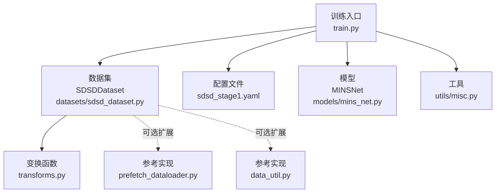
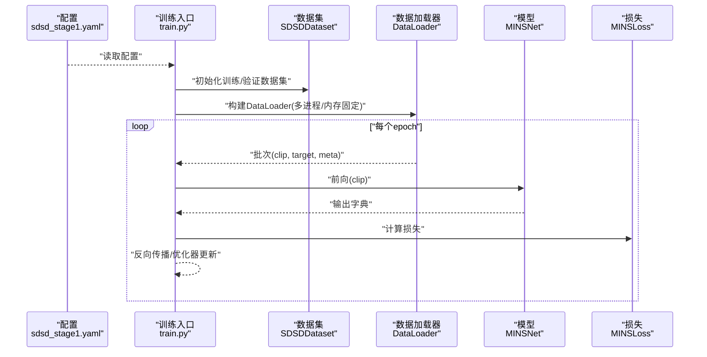
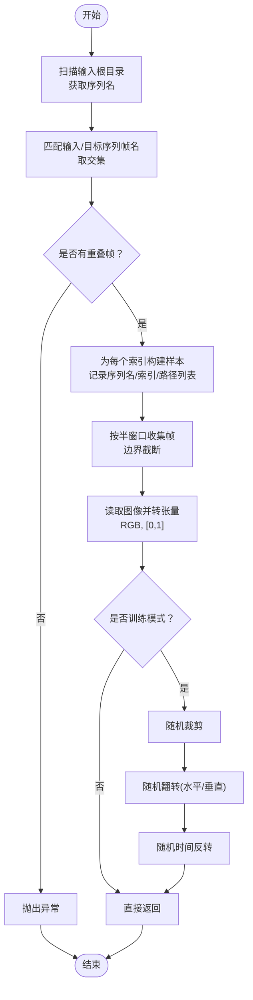
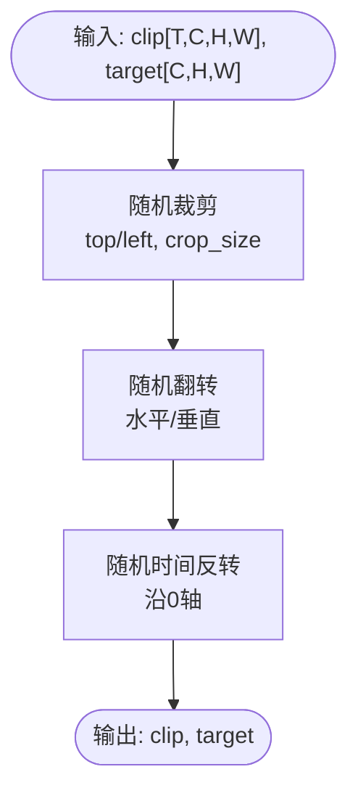
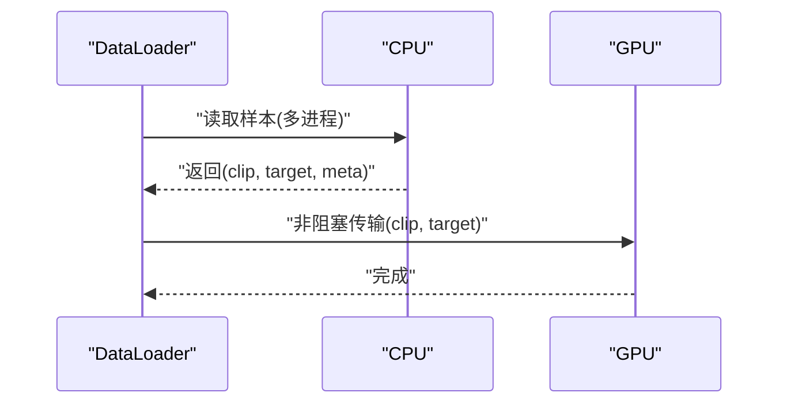
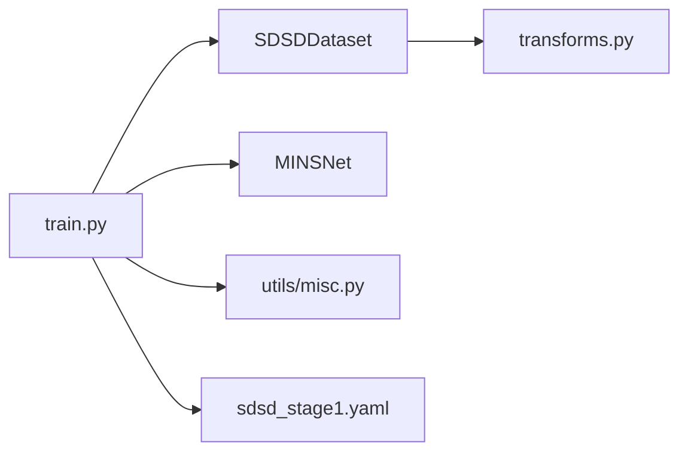

# 数据处理

<cite>
**本文引用的文件**
- [datasets/sdsd_dataset.py](file://datasets/sdsd_dataset.py)
- [datasets/transforms.py](file://datasets/transforms.py)
- [datasets/__init__.py](file://datasets/__init__.py)
- [configs/sdsd_stage1.yaml](file://configs/sdsd_stage1.yaml)
- [train.py](file://train.py)
- [utils/misc.py](file://utils/misc.py)
- [models/mins_net.py](file://models/mins_net.py)
- [reference_repos/BasicSR/basicsr/data/prefetch_dataloader.py](file://reference_repos/BasicSR/basicsr/data/prefetch_dataloader.py)
- [reference_repos/BasicSR/basicsr/data/data_util.py](file://reference_repos/BasicSR/basicsr/data/data_util.py)
</cite>

## 目录
1. [引言](#引言)
2. [项目结构](#项目结构)
3. [核心组件](#核心组件)
4. [架构总览](#架构总览)
5. [详细组件分析](#详细组件分析)
6. [依赖分析](#依赖分析)
7. [性能考虑](#性能考虑)
8. [故障排查指南](#故障排查指南)
9. [结论](#结论)
10. [附录](#附录)

## 引言
本文件面向“数据处理模块”的技术文档，聚焦于以下目标：
- 深入解释 SDSDDataset 的实现原理与多帧序列数据加载机制
- 详述数据增强（裁剪、翻转、时间反转）与数据变换流程
- 说明批处理机制与内存管理策略
- 给出数据格式规范、预处理步骤与质量控制方法
- 提供数据集准备指南与自定义数据集集成方案

## 项目结构
围绕数据处理的关键文件与职责如下：
- 数据集与变换
  - datasets/sdsd_dataset.py：实现多帧序列的读取、窗口采样与训练时增强
  - datasets/transforms.py：提供随机裁剪、随机翻转、时间反转等变换
  - datasets/__init__.py：导出 SDSDDataset
- 训练入口与配置
  - configs/sdsd_stage1.yaml：训练阶段一的配置项（输入/目标根目录、窗口大小、裁剪尺寸、工作进程数等）
  - train.py：构建数据加载器、模型、损失与优化器，并执行训练与验证
- 工具与模型
  - utils/misc.py：日志、随机种子与平均统计
  - models/mins_net.py：模型前向接口，明确输入时序窗口约束
- 参考实现（可选扩展）
  - reference_repos/BasicSR/basicsr/data/prefetch_dataloader.py：异步预取数据加载器实现思路
  - reference_repos/BasicSR/basicsr/data/data_util.py：序列图像读取、索引生成等通用工具

**图示来源**
- [train.py:48-84](file://train.py#L48-L84)
- [datasets/sdsd_dataset.py:18-81](file://datasets/sdsd_dataset.py#L18-L81)
- [datasets/transforms.py:6-31](file://datasets/transforms.py#L6-L31)
- [configs/sdsd_stage1.yaml:3-10](file://configs/sdsd_stage1.yaml#L3-L10)
- [models/mins_net.py:20-39](file://models/mins_net.py#L20-L39)
- [reference_repos/BasicSR/basicsr/data/prefetch_dataloader.py:39-58](file://reference_repos/BasicSR/basicsr/data/prefetch_dataloader.py#L39-L58)
- [reference_repos/BasicSR/basicsr/data/data_util.py:11-41](file://reference_repos/BasicSR/basicsr/data/data_util.py#L11-L41)

**章节来源**
- [datasets/sdsd_dataset.py:18-81](file://datasets/sdsd_dataset.py#L18-L81)
- [datasets/transforms.py:6-31](file://datasets/transforms.py#L6-L31)
- [datasets/__init__.py:1-3](file://datasets/__init__.py#L1-L3)
- [configs/sdsd_stage1.yaml:3-10](file://configs/sdsd_stage1.yaml#L3-L10)
- [train.py:48-84](file://train.py#L48-L84)
- [utils/misc.py:33-47](file://utils/misc.py#L33-L47)
- [models/mins_net.py:20-39](file://models/mins_net.py#L20-L39)
- [reference_repos/BasicSR/basicsr/data/prefetch_dataloader.py:39-58](file://reference_repos/BasicSR/basicsr/data/prefetch_dataloader.py#L39-L58)
- [reference_repos/BasicSR/basicsr/data/data_util.py:11-41](file://reference_repos/BasicSR/basicsr/data/data_util.py#L11-L41)

## 核心组件
- SDSDDataset：负责按序列组织样本，构建多帧窗口，读取图像并进行训练时增强，返回时序张量、目标张量与元信息
- 变换函数：random_crop_pair、random_flip_pair、random_time_reverse
- DataLoader：在训练入口中构建，支持多进程、内存固定与丢弃不完整批次
- 预处理与质量控制：读取为RGB浮点张量、归一化到[0,1]、检查裁剪尺寸合法性、非有限损失跳过
- 内存管理：使用 pin_memory、非阻塞传输至GPU、及时释放中间变量

**章节来源**
- [datasets/sdsd_dataset.py:18-81](file://datasets/sdsd_dataset.py#L18-L81)
- [datasets/transforms.py:6-31](file://datasets/transforms.py#L6-L31)
- [train.py:68-83](file://train.py#L68-L83)
- [train.py:117-139](file://train.py#L117-L139)
- [train.py:169-183](file://train.py#L169-L183)

## 架构总览
下图展示从配置到数据加载、模型前向与损失计算的整体流程。

**图示来源**
- [configs/sdsd_stage1.yaml:3-10](file://configs/sdsd_stage1.yaml#L3-L10)
- [train.py:48-84](file://train.py#L48-L84)
- [train.py:108-160](file://train.py#L108-L160)
- [models/mins_net.py:20-39](file://models/mins_net.py#L20-L39)

## 详细组件分析

### SDSDDataset 实现原理与多帧序列加载
- 序列组织
  - 输入/目标根目录分别指向低光照序列与对应GT序列
  - 遍历输入根目录下的子目录作为序列名，匹配输入与目标序列中的共同帧名
  - 若无重叠帧则报错，确保配对完整性
- 窗口采样
  - 使用半窗口大小 window_size/2，对中心帧前后各扩展若干帧
  - 边界采用截断策略，避免越界访问
- 图像读取与张量构造
  - 读取为RGB，转换为浮点张量并归一化到[0,1]
  - 多帧堆叠为时序张量，形状通常为[T, C, H, W]
- 训练时增强
  - 随机裁剪、随机水平/垂直翻转、随机时间反转（时序维度）
- 返回值
  - clip: 时序张量
  - target: 中心帧目标
  - meta: 包含序列名、中心索引、帧文件名

**图示来源**
- [datasets/sdsd_dataset.py:29-51](file://datasets/sdsd_dataset.py#L29-L51)
- [datasets/sdsd_dataset.py:56-62](file://datasets/sdsd_dataset.py#L56-L62)
- [datasets/sdsd_dataset.py:64-80](file://datasets/sdsd_dataset.py#L64-L80)

**章节来源**
- [datasets/sdsd_dataset.py:18-81](file://datasets/sdsd_dataset.py#L18-L81)

### 数据变换流程与增强策略
- 随机裁剪
  - 在高宽方向上随机选择左上角坐标，裁剪为指定尺寸
  - 若裁剪尺寸大于输入尺寸则报错
- 随机翻转
  - 以一定概率沿水平或垂直方向翻转时序与目标
- 随机时间反转
  - 以一定概率沿时间维度翻转时序

**图示来源**
- [datasets/transforms.py:6-31](file://datasets/transforms.py#L6-L31)

**章节来源**
- [datasets/transforms.py:6-31](file://datasets/transforms.py#L6-L31)

### 批处理机制与内存管理
- DataLoader 参数
  - batch_size：训练批次大小
  - shuffle：训练时打乱
  - num_workers：数据加载并行度
  - pin_memory：使用锁页内存加速GPU传输
  - drop_last：是否丢弃不完整批次
- 设备传输
  - 使用非阻塞传输至GPU，减少等待
  - 验证阶段使用瓦片推理，降低显存占用
- 内存释放
  - 显式删除中间变量，避免累积占用

**图示来源**
- [train.py:68-83](file://train.py#L68-L83)
- [train.py:117-119](file://train.py#L117-L119)
- [train.py:169-171](file://train.py#L169-L171)

**章节来源**
- [train.py:68-83](file://train.py#L68-L83)
- [train.py:117-119](file://train.py#L117-L119)
- [train.py:169-183](file://train.py#L169-L183)

### 数据格式说明与预处理步骤
- 输入格式
  - 低光照序列与对应GT序列按子目录组织，帧名为相同集合
  - 帧文件为常见图像格式（如PNG/JPEG），读取为RGB
- 预处理
  - 转换为浮点张量并归一化到[0,1]
  - 时序维度T由窗口大小决定，需满足模型要求（见下一节）
- 质量控制
  - 若裁剪尺寸超过图像尺寸则报错
  - 非有限损失时跳过该步，避免破坏训练稳定性

**章节来源**
- [datasets/sdsd_dataset.py:12-15](file://datasets/sdsd_dataset.py#L12-L15)
- [datasets/sdsd_dataset.py:8-9](file://datasets/sdsd_dataset.py#L8-L9)
- [datasets/transforms.py:8-9](file://datasets/transforms.py#L8-L9)
- [train.py:126-129](file://train.py#L126-L129)

### 模型输入约束与数据一致性
- 模型前向要求时序窗口为奇数且至少为3
- 数据集保证返回的时序张量满足该约束

**章节来源**
- [models/mins_net.py:20-23](file://models/mins_net.py#L20-L23)
- [datasets/sdsd_dataset.py:23-24](file://datasets/sdsd_dataset.py#L23-L24)

### 数据集准备指南
- 目录结构
  - 输入根目录与目标根目录下应存在相同的子目录（序列名）
  - 每个序列内包含同名帧文件
- 配置项
  - 在配置文件中设置训练/验证输入/目标根目录、窗口大小、裁剪尺寸与工作进程数
- 质量检查
  - 确保输入与目标序列存在重叠帧
  - 确保裁剪尺寸不大于图像尺寸

**章节来源**
- [configs/sdsd_stage1.yaml:3-10](file://configs/sdsd_stage1.yaml#L3-L10)
- [datasets/sdsd_dataset.py:31-39](file://datasets/sdsd_dataset.py#L31-L39)
- [datasets/transforms.py:8-9](file://datasets/transforms.py#L8-L9)

### 自定义数据集集成方案
- 新增数据集类
  - 继承 torch.utils.data.Dataset，实现 __init__、__len__、__getitem__
  - 在 __getitem__ 中返回 (clip, target, meta)，其中 clip 为时序张量，target 为中心帧
- 注册导出
  - 在 datasets/__init__.py 中导出新类，便于训练入口导入
- 集成到训练
  - 在训练入口中按现有模式构建 DataLoader 并传入模型

**章节来源**
- [datasets/sdsd_dataset.py:18-81](file://datasets/sdsd_dataset.py#L18-L81)
- [datasets/__init__.py:1-3](file://datasets/__init__.py#L1-L3)
- [train.py:48-84](file://train.py#L48-L84)

## 依赖分析
- 组件耦合
  - SDSDDataset 依赖 PIL、NumPy、Torch 与自定义变换函数
  - 训练入口依赖数据集、模型、损失与工具模块
- 外部依赖
  - Torch、PIL、glob、os、random 等
- 可能的循环依赖
  - 当前模块间无循环导入迹象

**图示来源**
- [datasets/sdsd_dataset.py:9](file://datasets/sdsd_dataset.py#L9)
- [train.py:27-33](file://train.py#L27-L33)
- [models/mins_net.py:11-18](file://models/mins_net.py#L11-L18)
- [utils/misc.py:33-47](file://utils/misc.py#L33-L47)
- [configs/sdsd_stage1.yaml:1-34](file://configs/sdsd_stage1.yaml#L1-L34)

**章节来源**
- [datasets/sdsd_dataset.py:9](file://datasets/sdsd_dataset.py#L9)
- [train.py:27-33](file://train.py#L27-L33)
- [models/mins_net.py:11-18](file://models/mins_net.py#L11-L18)
- [utils/misc.py:33-47](file://utils/misc.py#L33-L47)
- [configs/sdsd_stage1.yaml:1-34](file://configs/sdsd_stage1.yaml#L1-L34)

## 性能考虑
- 并行数据加载
  - 通过 num_workers 提升I/O吞吐；结合 pin_memory 加速CPU到GPU传输
- 异步预取
  - 可参考 BasicSR 的 PrefetchDataLoader/CUDAPrefetcher 实现进一步降低等待
- 显存优化
  - 验证阶段采用瓦片推理，减小单次前向所需显存
- 数据增强
  - 增强操作在CPU侧进行，建议保持合理裁剪尺寸与翻转概率以平衡多样性与速度

**章节来源**
- [train.py:68-83](file://train.py#L68-L83)
- [train.py:169-178](file://train.py#L169-L178)
- [reference_repos/BasicSR/basicsr/data/prefetch_dataloader.py:39-122](file://reference_repos/BasicSR/basicsr/data/prefetch_dataloader.py#L39-L122)

## 故障排查指南
- “序列无重叠输入/GT帧”
  - 现象：初始化数据集时报错
  - 排查：确认输入/目标根目录结构一致，序列帧名完全匹配
- “裁剪尺寸过大”
  - 现象：随机裁剪时报错
  - 排查：调整配置中的裁剪尺寸或检查输入图像分辨率
- “非有限损失导致跳过”
  - 现象：日志出现警告并跳过该步
  - 排查：检查学习率、损失权重与数值稳定性；必要时启用混合精度或梯度裁剪
- “显存不足”
  - 现象：验证阶段OOM
  - 排查：减小瓦片尺寸或重叠，或降低批大小；确认未保留不必要的中间变量

**章节来源**
- [datasets/sdsd_dataset.py:38-39](file://datasets/sdsd_dataset.py#L38-L39)
- [datasets/transforms.py:8-9](file://datasets/transforms.py#L8-L9)
- [train.py:126-129](file://train.py#L126-L129)
- [train.py:169-183](file://train.py#L169-L183)

## 结论
本文系统梳理了 SDSDDataset 的实现细节、多帧序列加载与增强策略、批处理与内存管理，并给出了数据准备与自定义集成方案。结合配置文件与训练入口，可高效搭建稳定的数据流水线，支撑后续模型训练与评估。

## 附录
- 参考实现要点
  - 序列图像读取与索引生成：参考 data_util.py 中的序列读取与索引生成函数
  - 异步预取：参考 prefetch_dataloader.py 中的预取生成器与CUDA预取器

**章节来源**
- [reference_repos/BasicSR/basicsr/data/data_util.py:11-41](file://reference_repos/BasicSR/basicsr/data/data_util.py#L11-L41)
- [reference_repos/BasicSR/basicsr/data/data_util.py:43-92](file://reference_repos/BasicSR/basicsr/data/data_util.py#L43-L92)
- [reference_repos/BasicSR/basicsr/data/prefetch_dataloader.py:7-36](file://reference_repos/BasicSR/basicsr/data/prefetch_dataloader.py#L7-L36)
- [reference_repos/BasicSR/basicsr/data/prefetch_dataloader.py:82-122](file://reference_repos/BasicSR/basicsr/data/prefetch_dataloader.py#L82-L122)