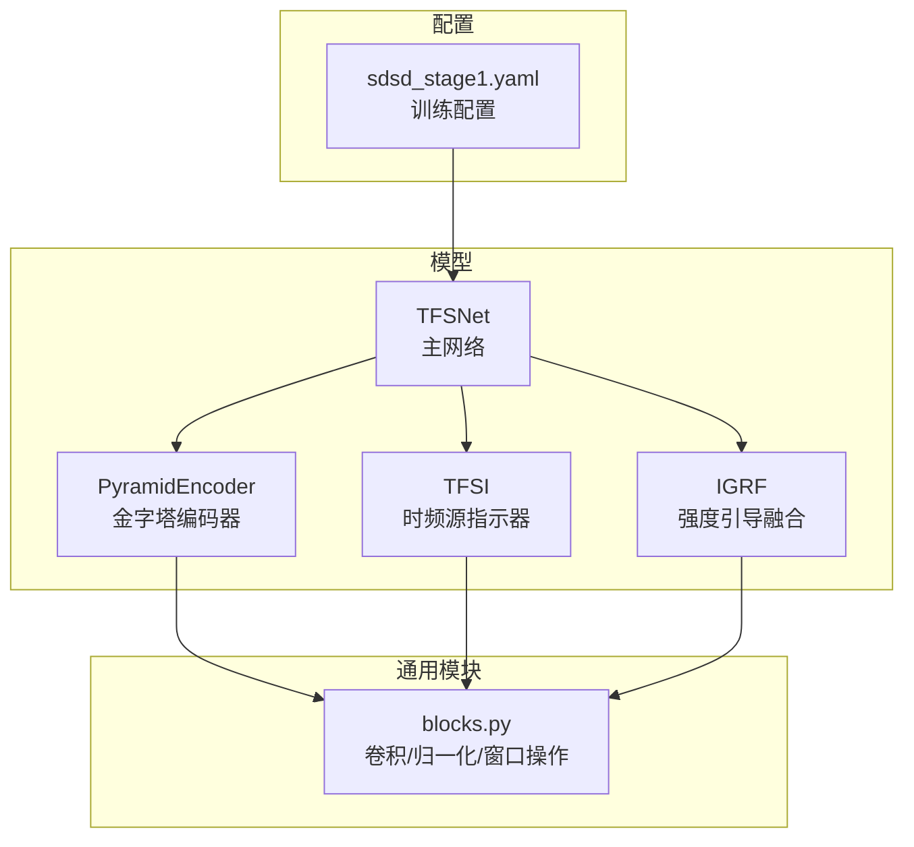
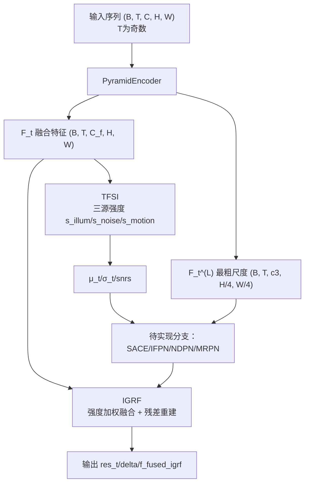
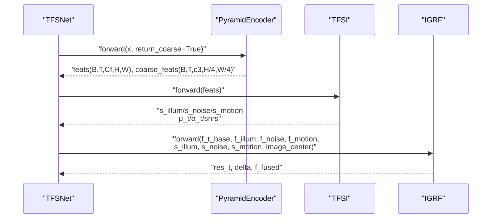
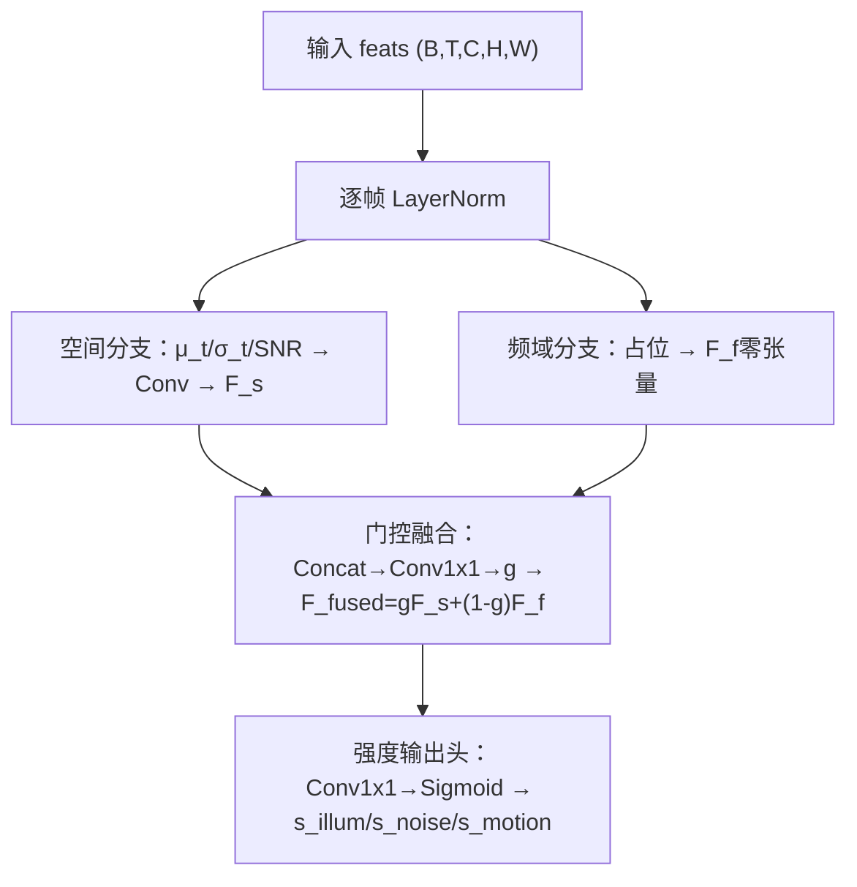
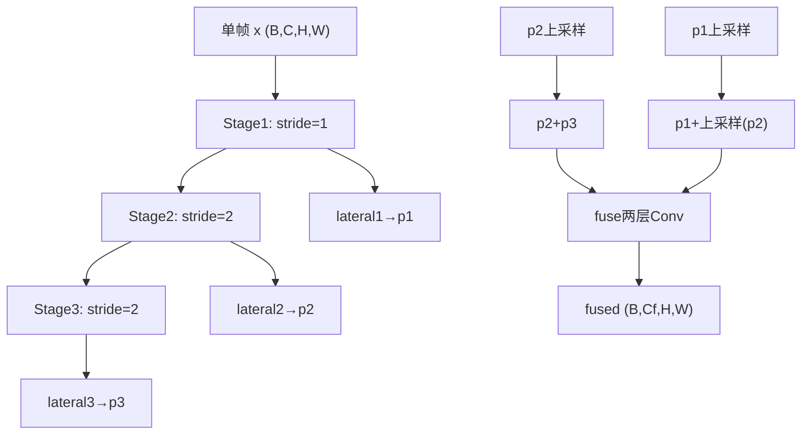
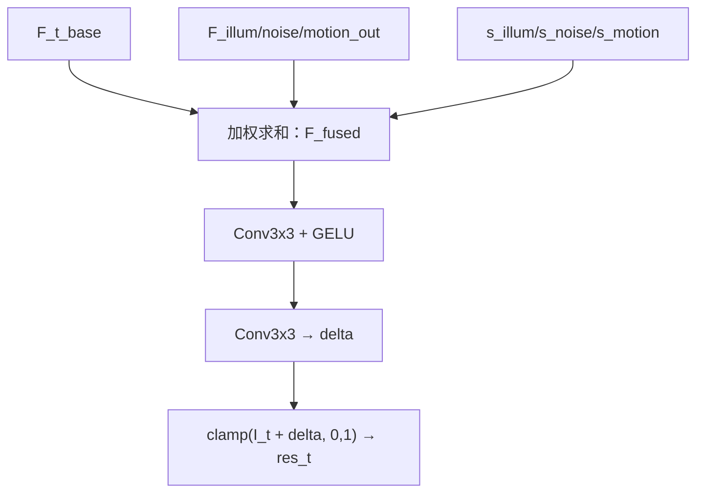
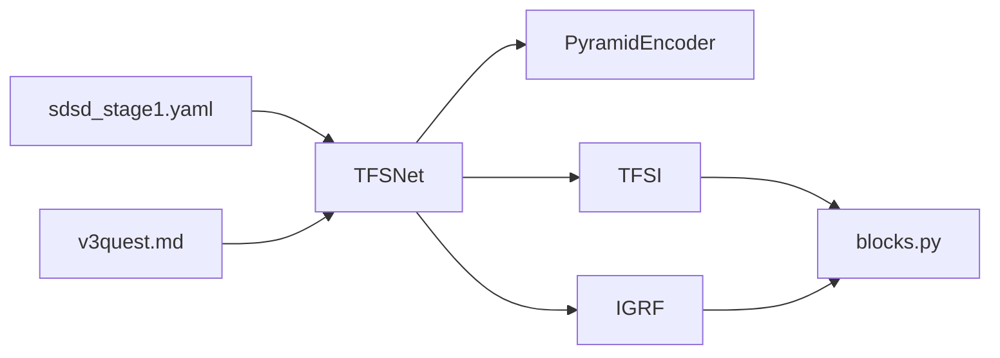

# 主网络架构

<cite>
**本文引用的文件**   
- [tfs_net.py](file://models/tfs_net.py)
- [encoder.py](file://models/modules/encoder.py)
- [tfsi.py](file://models/modules/tfsi.py)
- [igrf.py](file://models/modules/igrf.py)
- [blocks.py](file://models/modules/blocks.py)
- [mins_net.py](file://models/mins_net.py)
- [sdsd_stage1.yaml](file://configs/sdsd_stage1.yaml)
- [v3quest.md](file://v3quest.md)
</cite>

## 目录
1. [简介](#简介)
2. [项目结构](#项目结构)
3. [核心组件](#核心组件)
4. [架构总览](#架构总览)
5. [详细组件分析](#详细组件分析)
6. [依赖分析](#依赖分析)
7. [性能考量](#性能考量)
8. [故障排查指南](#故障排查指南)
9. [结论](#结论)
10. [附录](#附录)

## 简介
本文件面向开发者，系统性阐述 TFSNet 主网络的架构设计与实现要点，重点覆盖：
- TFSNet 类的初始化参数、模块组合方式与前向传播流程
- 多帧序列处理机制与中心帧选择策略
- 关键模块（编码器、TFSI、IGRF）的数据结构与处理逻辑
- 当前实现状态与未来模块（SACE/IFPN/NDPN/MRPN）的衔接点
- 面向训练与推理的配置建议与常见问题定位

## 项目结构
TFSNet 所属目录采用“模型/模块”分层组织，主网络位于 models/tfs_net.py，核心子模块位于 models/modules/，并辅以通用工具模块 blocks.py。配置文件位于 configs/，用于训练阶段的超参管理。

图表来源
- [tfs_net.py:34-98](file://models/tfs_net.py#L34-L98)
- [encoder.py:35-101](file://models/modules/encoder.py#L35-L101)
- [tfsi.py:187-265](file://models/modules/tfsi.py#L187-L265)
- [igrf.py:27-89](file://models/modules/igrf.py#L27-L89)
- [blocks.py:1-110](file://models/modules/blocks.py#L1-L110)
- [sdsd_stage1.yaml:1-34](file://configs/sdsd_stage1.yaml#L1-L34)

章节来源
- [tfs_net.py:1-181](file://models/tfs_net.py#L1-L181)
- [encoder.py:1-102](file://models/modules/encoder.py#L1-L102)
- [tfsi.py:1-265](file://models/modules/tfsi.py#L1-L265)
- [igrf.py:1-89](file://models/modules/igrf.py#L1-L89)
- [blocks.py:1-110](file://models/modules/blocks.py#L1-L110)
- [sdsd_stage1.yaml:1-34](file://configs/sdsd_stage1.yaml#L1-L34)

## 核心组件
- TFSNet 主网络：负责组织编码器、TFSI、IGRF 三大已实现模块，并预留 SACE/IFPN/NDPN/MRPN 四大模块的接入点。
- PyramidEncoder：多尺度金字塔编码器，支持返回融合特征与最粗尺度特征，满足 IFPN 双流分支的最粗尺度需求。
- TFSI：时频源指示器，输出三源强度图（光照/噪声/运动），并提供统计量（μ_t、σ_t、snr）供下游模块使用。
- IGRF：强度引导融合，将三源输出与基础特征按强度加权融合，再经卷积生成残差修正量并重建中心帧。

章节来源
- [tfs_net.py:34-98](file://models/tfs_net.py#L34-L98)
- [encoder.py:35-101](file://models/modules/encoder.py#L35-L101)
- [tfsi.py:187-265](file://models/modules/tfsi.py#L187-L265)
- [igrf.py:27-89](file://models/modules/igrf.py#L27-L89)

## 架构总览
TFSNet 的 5 阶段数据流如下：
- 阶段 1：共享金字塔编码器，输出融合特征与最粗尺度特征
- 阶段 2：TFSI 时频源指示器，输出三源强度与统计量
- 阶段 3：SACE 源感知对应估计（待实现）
- 阶段 4：三源恢复分支（IFPN/NDPN/MRPN，均待实现）
- 阶段 5：IGRF 强度引导融合，重建中心帧增强结果

图表来源
- [tfs_net.py:100-181](file://models/tfs_net.py#L100-L181)
- [encoder.py:76-101](file://models/modules/encoder.py#L76-L101)
- [tfsi.py:217-265](file://models/modules/tfsi.py#L217-L265)
- [igrf.py:56-89](file://models/modules/igrf.py#L56-L89)

## 详细组件分析

### TFSNet 类设计与初始化
- 初始化参数
  - in_channels：输入图像通道数，默认 3（RGB）
  - level_channels：编码器各级通道元组，默认 (32, 64, 96)
  - fused_channels：编码器融合后通道数 C_f，默认 48
  - window_size：窗口注意力大小（为后续模块预留）
  - eps：数值稳定系数
- 模块组合
  - 编码器：PyramidEncoder，支持返回融合特征与最粗尺度特征
  - TFSI：时频源指示器，输出三源强度与统计量
  - IGRF：强度引导融合，将三源输出与基础特征加权融合
  - SACE/IFPN/NDPN/MRPN：预留占位，等待实现后接入

章节来源
- [tfs_net.py:48-98](file://models/tfs_net.py#L48-L98)

### 多帧序列处理与中心帧选择
- 输入要求：(B, T, C, H, W)，T 必须为奇数且 ≥ 3
- 中心帧索引：center_idx = T // 2
- 当前实现：编码器对整个序列进行特征提取，TFSI 对所有帧的特征进行统计与融合，IGRF 使用编码器融合特征作为基础项

章节来源
- [tfs_net.py:100-117](file://models/tfs_net.py#L100-L117)
- [encoder.py:76-101](file://models/modules/encoder.py#L76-L101)
- [igrf.py:56-66](file://models/modules/igrf.py#L56-L66)

### 前向传播流程（已实现部分）

图表来源
- [tfs_net.py:120-129](file://models/tfs_net.py#L120-L129)
- [tfs_net.py:159-181](file://models/tfs_net.py#L159-L181)
- [encoder.py:76-101](file://models/modules/encoder.py#L76-L101)
- [tfsi.py:217-265](file://models/modules/tfsi.py#L217-L265)
- [igrf.py:56-89](file://models/modules/igrf.py#L56-L89)

### TFSI 模块：时频源指示器
- 空间分支
  - 统计量：对时间维计算中位值 μ_t、方差 σ_t 与 SNR = μ_t/(σ_t+ε)
  - 特征映射：将 [μ_t, σ_t, SNR] 拼接后经卷积得到 F_s
- 频域分支（占位）
  - 当前返回零张量，待实现后替换为 LFF（可学习频率滤波）
- 门控融合
  - Concat[F_s, F_f] 经 1×1 卷积得门控权重 g，执行 F_fused = g⊙F_s + (1−g)⊙F_f
- 强度输出头
  - 对 F_fused 做 1×1 卷积并 Sigmoid 得三源强度图 s_illum/s_noise/s_motion

图表来源
- [tfsi.py:23-78](file://models/modules/tfsi.py#L23-L78)
- [tfsi.py:80-115](file://models/modules/tfsi.py#L80-L115)
- [tfsi.py:117-146](file://models/modules/tfsi.py#L117-L146)
- [tfsi.py:148-185](file://models/modules/tfsi.py#L148-L185)
- [tfsi.py:217-265](file://models/modules/tfsi.py#L217-L265)

章节来源
- [tfsi.py:1-265](file://models/modules/tfsi.py#L1-L265)

### PyramidEncoder：多尺度金字塔编码器
- 结构组成
  - 三层编码阶段，分别进行 1×1/2×下采样
  - 三层横向连接（lateral）+ 双线性插值融合
  - 最终通过两层卷积融合得到 F_t
- 多帧处理
  - 将 (B×T, C, H, W) 送入单帧前向，再 reshape 为 (B, T, C_f, H, W)
  - 支持返回最粗尺度特征 l3（当前实现为 H/4 分辨率，与 v3 文档的 H/8 存在结构差异）

图表来源
- [encoder.py:35-75](file://models/modules/encoder.py#L35-L75)
- [encoder.py:76-101](file://models/modules/encoder.py#L76-L101)

章节来源
- [encoder.py:1-102](file://models/modules/encoder.py#L1-L102)

### IGRF：强度引导融合
- 输入
  - F_t^base：基础特征（当前假设为编码器融合特征）
  - F_illum/noise/motion_out：三源输出特征
  - s_illum/s_noise/s_motion：三源强度图
  - image_center：中心帧原始图像
- 融合与重建
  - F_fused = s_illum·F_illum + s_noise·F_noise + s_motion·F_motion + F_base
  - 通过两层卷积与激活得到残差 delta，并与中心帧相加，clamp 到 [0,1]

图表来源
- [igrf.py:56-89](file://models/modules/igrf.py#L56-L89)

章节来源
- [igrf.py:1-89](file://models/modules/igrf.py#L1-L89)

### 与 MINSNet 的对比与演进
- MINSNet：包含 TFSI 的前身 MINSBlock，以及 ISPN、MSPN、FinalReconstruction 等模块，强调时频域分解与对应估计
- TFSNet：以 TFSI 替代 MINSBlock，统一输出三源强度；以 IGRF 替代 FinalReconstruction，采用强度加权融合；保留窗口注意力与多帧处理范式

章节来源
- [mins_net.py:11-67](file://models/mins_net.py#L11-L67)

## 依赖分析
- 模块内聚与耦合
  - TFSNet 与各子模块通过 forward 接口解耦，便于后续模块接入
  - TFSI 依赖 blocks 中的卷积、归一化与统计函数
  - IGRF 依赖 blocks 中的卷积与激活
- 外部依赖
  - 训练配置由 sdsd_stage1.yaml 提供，包含输入通道、金字塔通道、窗口大小等关键参数
  - v3quest.md 记录了各模块实现细节与待澄清问题，指导后续开发

图表来源
- [tfs_net.py:29-31](file://models/tfs_net.py#L29-L31)
- [tfsi.py:20](file://models/modules/tfsi.py#L20)
- [igrf.py:24](file://models/modules/igrf.py#L24)
- [sdsd_stage1.yaml:11-15](file://configs/sdsd_stage1.yaml#L11-L15)
- [v3quest.md:1-200](file://v3quest.md#L1-L200)

章节来源
- [tfs_net.py:29-31](file://models/tfs_net.py#L29-L31)
- [tfsi.py:20](file://models/modules/tfsi.py#L20)
- [igrf.py:24](file://models/modules/igrf.py#L24)
- [sdsd_stage1.yaml:11-15](file://configs/sdsd_stage1.yaml#L11-L15)
- [v3quest.md:1-200](file://v3quest.md#L1-L200)

## 性能考量
- 计算复杂度
  - 编码器多尺度融合与 TFSI 的统计量计算为主要开销来源
  - IGRF 的加权融合与两层卷积成本可控
- 内存占用
  - 多帧序列在编码器前展平处理，注意批大小与分辨率的平衡
- 并行性
  - TFSI 的统计量可在时间维并行计算（中位值/方差）
- 稳定性
  - eps 用于避免除零与数值不稳定，建议与损失函数中的 eps 保持一致

## 故障排查指南
- 输入尺寸错误
  - 症状：断言失败
  - 原因：T 必须为奇数且 ≥ 3
  - 处理：检查数据加载与配置文件中的 window_size
- 分辨率不一致
  - 症状：IFPN 需要 H/8×W/8 的最粗尺度特征，但当前编码器输出为 H/4×W/4
  - 处理：根据 v3quest.md 的讨论，考虑增加 stage 或调整下采样策略
- 模块未实现
  - 症状：调用 SACE/IFPN/NDPN/MRPN 时报 NotImplementedError
  - 处理：按照 v3quest.md 的指引完成相应模块实现，并确保通道数与分辨率一致

章节来源
- [tfs_net.py:115-117](file://models/tfs_net.py#L115-L117)
- [v3quest.md:102-106](file://v3quest.md#L102-L106)
- [v3quest.md:197-200](file://v3quest.md#L197-L200)

## 结论
TFSNet 在 v3 设计框架下，已完成编码器、TFSI 与 IGRF 的核心实现，形成稳定的五阶段数据通路。多帧序列处理与中心帧选择策略清晰，参数配置与训练流程可直接落地。后续 SACE/IFPN/NDPN/MRPN 的实现将决定整体性能上限与应用适配范围。建议优先完成 TFSI 频域分支与 SACE 的 cross-attention 实现，再推进 IFPN/NDPN/MRPN 的工程化集成。

## 附录
- 关键参数速查
  - in_channels：输入通道数（默认 3）
  - level_channels：编码器各级通道（默认 (32, 64, 96)）
  - fused_channels：融合后通道数（默认 48）
  - window_size：窗口注意力大小（为后续模块预留）
  - eps：数值稳定系数（默认 1e-6）
- 训练配置参考
  - sdsd_stage1.yaml 中包含输入根路径、窗口大小、裁剪尺寸、批大小、学习率等关键设置

章节来源
- [tfs_net.py:48-55](file://models/tfs_net.py#L48-L55)
- [sdsd_stage1.yaml:3-34](file://configs/sdsd_stage1.yaml#L3-L34)