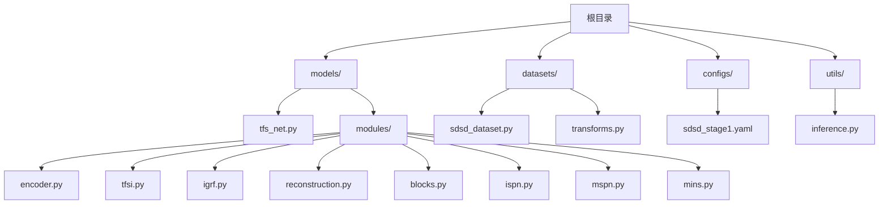
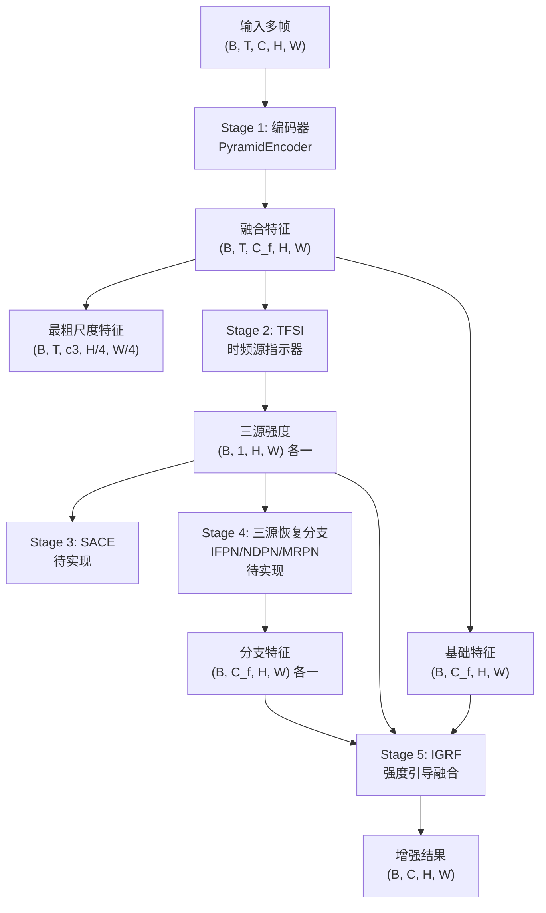
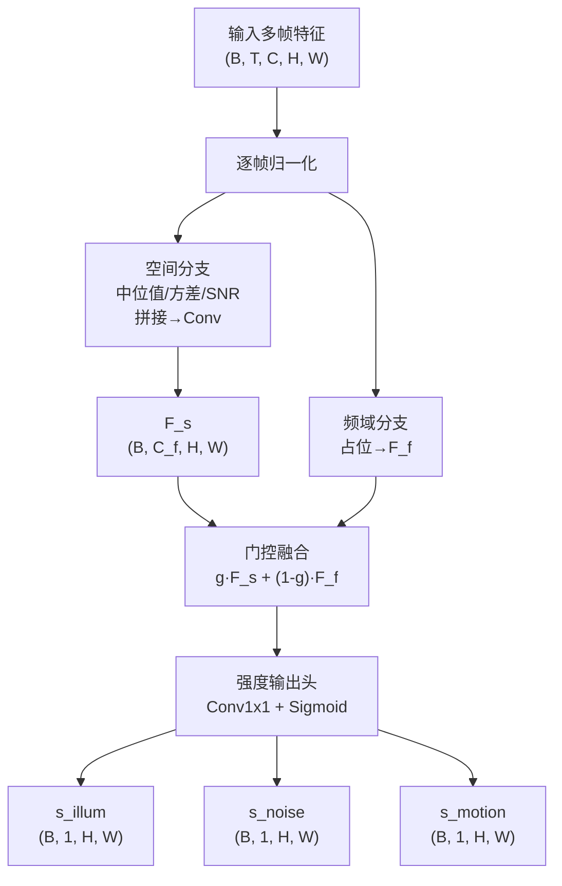
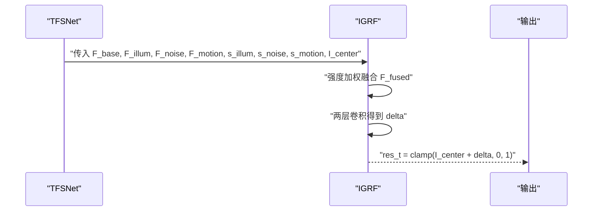
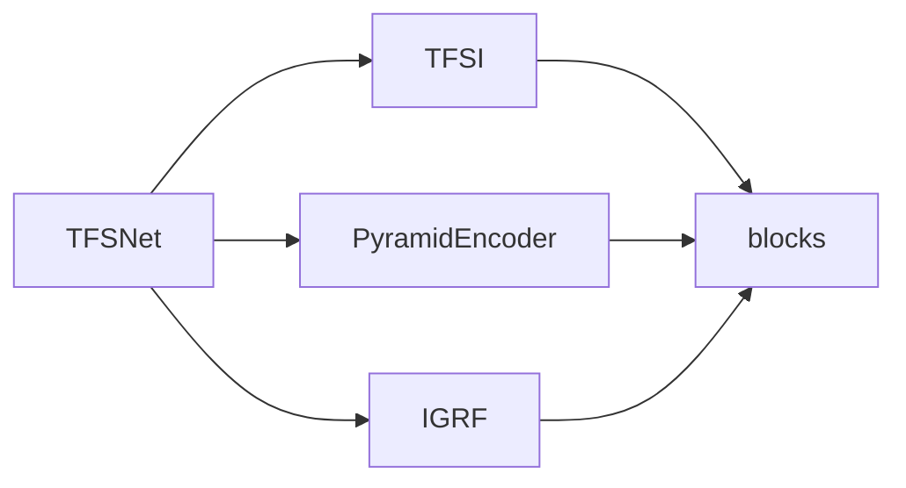

# 数据流设计

<cite>
**本文引用的文件**   
- [models/tfs_net.py](file://models/tfs_net.py)
- [models/modules/__init__.py](file://models/modules/__init__.py)
- [models/modules/encoder.py](file://models/modules/encoder.py)
- [models/modules/tfsi.py](file://models/modules/tfsi.py)
- [models/modules/igrf.py](file://models/modules/igrf.py)
- [models/modules/reconstruction.py](file://models/modules/reconstruction.py)
- [models/modules/blocks.py](file://models/modules/blocks.py)
- [models/modules/ispn.py](file://models/modules/ispn.py)
- [models/modules/mspn.py](file://models/modules/mspn.py)
- [models/modules/mins.py](file://models/modules/mins.py)
- [configs/sdsd_stage1.yaml](file://configs/sdsd_stage1.yaml)
- [datasets/sdsd_dataset.py](file://datasets/sdsd_dataset.py)
- [datasets/transforms.py](file://datasets/transforms.py)
- [utils/inference.py](file://utils/inference.py)
- [README.md](file://README.md)
</cite>

## 目录
1. [简介](#简介)
2. [项目结构](#项目结构)
3. [核心组件](#核心组件)
4. [架构总览](#架构总览)
5. [详细组件分析](#详细组件分析)
6. [依赖分析](#依赖分析)
7. [性能考虑](#性能考虑)
8. [故障排查指南](#故障排查指南)
9. [结论](#结论)
10. [附录](#附录)

## 简介
本技术文档围绕 TFS-Net 的 5-stage 数据流设计进行系统化阐述，覆盖从多帧输入到最终输出的完整数据转换链路。文档重点解释每阶段的数据变换、特征提取与信息融合过程，并给出数据流图与张量形状变化说明，帮助开发者全面理解该数据流的设计原理与实现要点。

## 项目结构
仓库采用“模块化 + 功能分层”的组织方式：
- models：网络主体与模块定义，包含主干网络 TFSNet 与各功能模块（编码器、时频源指示器、强度引导融合等）
- datasets：数据集与数据增强逻辑
- configs：训练/验证配置
- utils：推理工具（如滑窗推理）
- README：快速开始与使用说明

图表来源
- [models/tfs_net.py:1-181](file://models/tfs_net.py#L1-L181)
- [models/modules/encoder.py:1-102](file://models/modules/encoder.py#L1-L102)
- [models/modules/tfsi.py:1-265](file://models/modules/tfsi.py#L1-L265)
- [models/modules/igrf.py:1-89](file://models/modules/igrf.py#L1-L89)
- [models/modules/reconstruction.py:1-24](file://models/modules/reconstruction.py#L1-L24)
- [models/modules/blocks.py:1-110](file://models/modules/blocks.py#L1-L110)
- [models/modules/ispn.py:1-26](file://models/modules/ispn.py#L1-L26)
- [models/modules/mspn.py:1-41](file://models/modules/mspn.py#L1-L41)
- [models/modules/mins.py:1-131](file://models/modules/mins.py#L1-L131)
- [datasets/sdsd_dataset.py:1-81](file://datasets/sdsd_dataset.py#L1-L81)
- [datasets/transforms.py:1-32](file://datasets/transforms.py#L1-L32)
- [configs/sdsd_stage1.yaml:1-34](file://configs/sdsd_stage1.yaml#L1-L34)
- [utils/inference.py:1-61](file://utils/inference.py#L1-L61)

章节来源
- [README.md:1-24](file://README.md#L1-L24)

## 核心组件
- 主网络 TFSNet：串联 5 个阶段，负责多帧输入到增强结果的端到端处理
- 编码器 PyramidEncoder：多尺度金字塔编码，生成融合特征与可选的最粗尺度特征
- 时频源指示器 TFSI：从多帧特征中估计三源强度（光照、噪声、运动）
- 强度引导融合 IGRF：根据三源强度对分支特征进行加权融合并重建增强图像
- 辅助模块：通用卷积/残差/归一化/窗口划分等基础能力，以及 ISPN/MSPN/MINSBlock 等分支模块（当前部分尚未接入主干）

章节来源
- [models/tfs_net.py:34-181](file://models/tfs_net.py#L34-L181)
- [models/modules/encoder.py:35-102](file://models/modules/encoder.py#L35-L102)
- [models/modules/tfsi.py:187-265](file://models/modules/tfsi.py#L187-L265)
- [models/modules/igrf.py:27-89](file://models/modules/igrf.py#L27-L89)
- [models/modules/reconstruction.py:5-24](file://models/modules/reconstruction.py#L5-L24)

## 架构总览
TFS-Net 的 5-stage 数据流如下：
- Stage 1：共享金字塔编码器，输出融合特征与可选的最粗尺度特征
- Stage 2：TFSI 时频源指示器，输出三源强度图
- Stage 3：SACE 源感知对应估计（当前未实现）
- Stage 4：三源恢复分支（IFPN/NDPN/MRPN，当前未实现）
- Stage 5：IGRF 强度引导融合，将分支特征与基础特征按三源强度加权融合并重建

图表来源
- [models/tfs_net.py:100-181](file://models/tfs_net.py#L100-L181)
- [models/modules/encoder.py:76-102](file://models/modules/encoder.py#L76-L102)
- [models/modules/tfsi.py:217-265](file://models/modules/tfsi.py#L217-L265)
- [models/modules/igrf.py:56-89](file://models/modules/igrf.py#L56-L89)

## 详细组件分析

### Stage 1：共享金字塔编码器（PyramidEncoder）
- 输入：单帧或多帧图像
- 输出：融合特征（用于后续阶段）与可选的最粗尺度特征（供 IFPN 双流使用）
- 关键点：
  - 三层编码器阶段，前两层做步长为 2 的下采样，得到 c1/c2/c3 通道数
  - 通过横向投影与双线性插值融合，得到融合特征
  - 支持 return_coarse 参数，返回最粗尺度特征以供 IFPN 使用

张量形状示意
- 输入：(B, T, C, H, W)
- 融合特征：(B, T, C_f, H, W)
- 最粗尺度特征（可选）：(B, T, c3, H/4, W/4)

章节来源
- [models/modules/encoder.py:35-102](file://models/modules/encoder.py#L35-L102)

### Stage 2：时频源指示器（TFSI）
- 功能：从多帧特征中估计三源强度（光照、噪声、运动）
- 数据流：
  - 对每帧进行归一化
  - 空间分支：沿时间维计算中位值、方差与 SNR，拼接后经卷积得到空间特征 F_s
  - 频域分支：当前为占位（返回零张量），未来将引入 LFF
  - 门控融合：对 F_s 与 F_f 进行门控融合得到 F_fused
  - 强度输出：对 F_fused 进行 1×1 卷积并经 Sigmoid 得到三源强度图

张量形状示意
- 输入：(B, T, C, H, W)
- F_s/F_f/F_fused：(B, C_f, H, W)
- 三源强度：(B, 1, H, W) 三路

图表来源
- [models/modules/tfsi.py:23-265](file://models/modules/tfsi.py#L23-L265)

章节来源
- [models/modules/tfsi.py:187-265](file://models/modules/tfsi.py#L187-L265)

### Stage 3：源感知对应估计（SACE）
- 当前状态：未实现，抛出 NotImplementedError
- 设计说明：需要 LFF 实现细节与可变形交叉注意力参考（DAT/EDVR），用于估计源间对应关系与注意力图，供 NDPN/MRPN 使用

章节来源
- [models/tfs_net.py:130-139](file://models/tfs_net.py#L130-L139)

### Stage 4：三源恢复分支（IFPN/NDPN/MRPN）
- 当前状态：均未实现，预留伪代码注释
- 设计说明：
  - IFPN：双流光照估计，依赖 IllumExtract（Retinexformer 参考）与 F_t^(L) 定义
  - NDPN：SNR 自适应聚合，依赖 SACE 注意力图
  - MRPN：运动残差处理（v3 文档提及，v2 无实现）

章节来源
- [models/tfs_net.py:141-158](file://models/tfs_net.py#L141-L158)

### Stage 5：强度引导融合（IGRF）
- 功能：将三源恢复分支输出与基础特征按三源强度加权融合，并通过两层卷积重建增强图像
- 公式要点：
  - F_fused = s_illum·F_illum + s_noise·F_noise + s_motion·F_motion + F_base
  - 通过 GELU 与 3×3 卷积得到残差修正 delta，并与中心帧图像相加并裁剪至 [0,1]

张量形状示意
- 输入：F_illum/F_noise/F_motion/F_base 与 s_illum/s_noise/s_motion
- 输出：增强结果（B, C, H, W），残差修正（B, C, H, W），融合特征（B, C_f, H, W）

图表来源
- [models/modules/igrf.py:56-89](file://models/modules/igrf.py#L56-L89)

章节来源
- [models/modules/igrf.py:27-89](file://models/modules/igrf.py#L27-L89)

### 辅助模块与通用能力
- 通用模块 blocks：提供卷积块、残差块、层归一化、窗口划分/反划分、安全除法、余弦相似度等
- ISPN/MSPN/MINSBlock：用于分支模块（当前未接入主干），分别用于光照估计、运动聚合与熵门控的视频注意力

章节来源
- [models/modules/blocks.py:1-110](file://models/modules/blocks.py#L1-L110)
- [models/modules/ispn.py:1-26](file://models/modules/ispn.py#L1-L26)
- [models/modules/mspn.py:1-41](file://models/modules/mspn.py#L1-L41)
- [models/modules/mins.py:1-131](file://models/modules/mins.py#L1-L131)

## 依赖分析
- 模块导入关系
  - TFSNet 导入 PyramidEncoder、TFSI、IGRF
  - 各模块内部依赖 blocks 提供的基础算子
  - 模块导出统一在 modules/__init__.py 中管理

图表来源
- [models/tfs_net.py:29-31](file://models/tfs_net.py#L29-L31)
- [models/modules/__init__.py:1-10](file://models/modules/__init__.py#L1-L10)

章节来源
- [models/tfs_net.py:29-31](file://models/tfs_net.py#L29-L31)
- [models/modules/__init__.py:1-10](file://models/modules/__init__.py#L1-L10)

## 性能考虑
- 计算复杂度
  - 编码器：多尺度卷积与上采样，复杂度与分辨率与通道数成正比
  - TFSI：沿时间维统计与门控融合，复杂度与空间分辨率与通道数线性相关
  - IGRF：加权融合与两层卷积，复杂度与特征通道数线性相关
- 内存占用
  - 多帧张量在 Stage 1 展平后处理，注意批大小与分辨率对显存的影响
- 推理优化
  - 支持滑窗推理（tiled_forward），避免大分辨率下的显存不足

章节来源
- [utils/inference.py:26-61](file://utils/inference.py#L26-L61)

## 故障排查指南
- 输入尺寸断言
  - 多帧窗口必须为奇数且至少为 3，否则会触发断言错误
- 未实现模块
  - SACE/IFPN/NDPN/MRPN 当前抛出 NotImplementedError，无法继续执行后续流程
- 数据加载与增强
  - SDSDDataset 使用固定窗口大小读取序列帧，确保输入路径与序列名一致
  - 训练时随机裁剪、翻转与时间反转，推理时建议关闭随机性

章节来源
- [models/tfs_net.py:115-117](file://models/tfs_net.py#L115-L117)
- [models/tfs_net.py:130-139](file://models/tfs_net.py#L130-L139)
- [datasets/sdsd_dataset.py:64-81](file://datasets/sdsd_dataset.py#L64-L81)
- [datasets/transforms.py:6-32](file://datasets/transforms.py#L6-L32)

## 结论
TFS-Net 的 5-stage 数据流以“多帧→编码→时频源指示→分支恢复→强度融合”为主线，具备清晰的阶段性职责与可扩展性。当前已实现 Stage 1、2、5，Stage 3/4 仍处于设计与实现过渡期。开发者可基于现有模块（编码器、TFSI、IGRF）进行扩展与联调，逐步完善 SACE/IFPN/NDPN/MRPN，最终形成完整的端到端低光增强流水线。

## 附录
- 训练与推理配置示例
  - 训练配置：窗口大小、裁剪尺寸、损失权重等
  - 推理配置：瓦片大小与重叠策略

章节来源
- [configs/sdsd_stage1.yaml:1-34](file://configs/sdsd_stage1.yaml#L1-L34)
- [utils/inference.py:26-61](file://utils/inference.py#L26-L61)