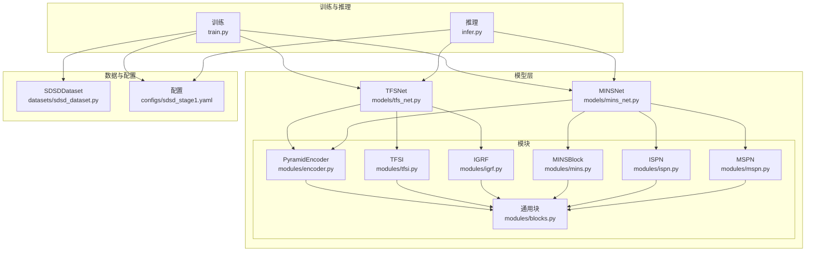
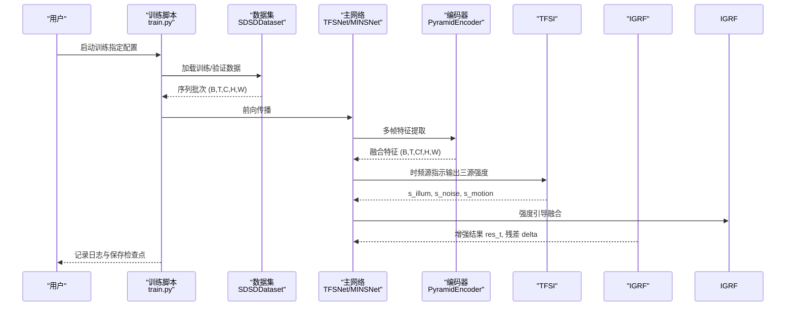
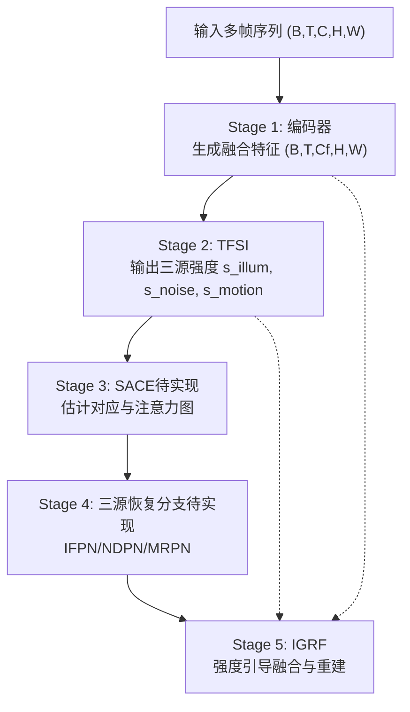
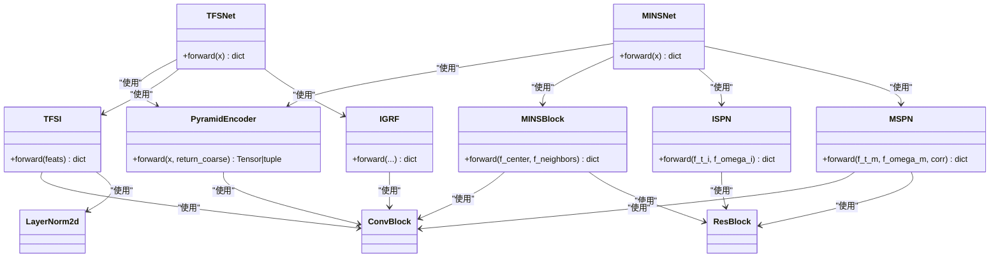
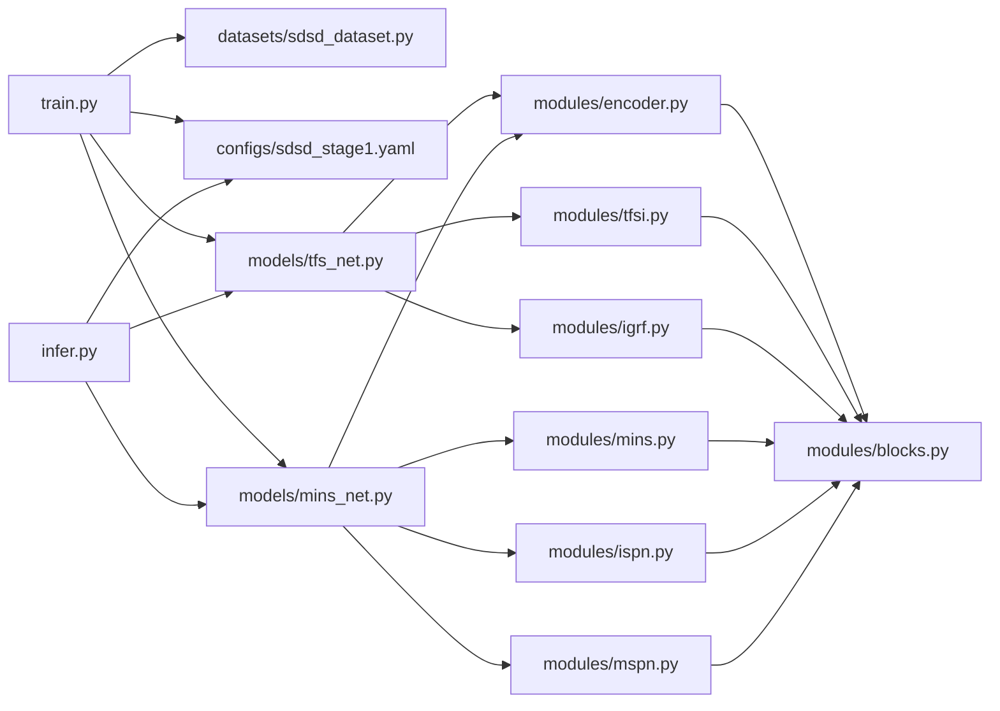

# 整体架构概览

<cite>
**本文引用的文件**
- [models/tfs_net.py](file://models/tfs_net.py)
- [models/mins_net.py](file://models/mins_net.py)
- [models/modules/encoder.py](file://models/modules/encoder.py)
- [models/modules/tfsi.py](file://models/modules/tfsi.py)
- [models/modules/igrf.py](file://models/modules/igrf.py)
- [models/modules/blocks.py](file://models/modules/blocks.py)
- [models/modules/mins.py](file://models/modules/mins.py)
- [models/modules/ispn.py](file://models/modules/ispn.py)
- [models/modules/mspn.py](file://models/modules/mspn.py)
- [configs/sdsd_stage1.yaml](file://configs/sdsd_stage1.yaml)
- [datasets/sdsd_dataset.py](file://datasets/sdsd_dataset.py)
- [train.py](file://train.py)
- [infer.py](file://infer.py)
- [README.md](file://README.md)
</cite>

## 目录
1. [简介](#简介)
2. [项目结构](#项目结构)
3. [核心组件](#核心组件)
4. [架构总览](#架构总览)
5. [详细组件分析](#详细组件分析)
6. [依赖分析](#依赖分析)
7. [性能考量](#性能考量)
8. [故障排查指南](#故障排查指南)
9. [结论](#结论)
10. [附录](#附录)

## 简介
本文件面向 TFS-Net 项目，提供整体架构概览与 5-stage 数据流设计的系统化说明。文档围绕“时频源网络 v3”的设计思想，阐述从共享金字塔编码、时频源指示、源感知对应估计、三源恢复分支到强度引导融合的完整流程，并结合当前实现状态与未来扩展点，帮助开发者建立清晰的架构理解框架。

## 项目结构
项目采用模块化分层组织，核心包括：
- 模型层：主网络与子模块（编码器、时频源指示、强度引导融合等）
- 数据集与配置：视频低光增强专用数据集与训练配置
- 训练与推理脚本：完整的训练循环、验证策略与推理管线
- 工具模块：指标、IO、推断切片等辅助能力

**图表来源**
- [models/tfs_net.py:1-181](file://models/tfs_net.py#L1-L181)
- [models/mins_net.py:1-67](file://models/mins_net.py#L1-L67)
- [models/modules/encoder.py:1-102](file://models/modules/encoder.py#L1-L102)
- [models/modules/tfsi.py:1-265](file://models/modules/tfsi.py#L1-L265)
- [models/modules/igrf.py:1-89](file://models/modules/igrf.py#L1-L89)
- [models/modules/blocks.py:1-110](file://models/modules/blocks.py#L1-L110)
- [models/modules/mins.py:1-131](file://models/modules/mins.py#L1-L131)
- [models/modules/ispn.py:1-26](file://models/modules/ispn.py#L1-L26)
- [models/modules/mspn.py:1-41](file://models/modules/mspn.py#L1-L41)
- [datasets/sdsd_dataset.py:1-81](file://datasets/sdsd_dataset.py#L1-L81)
- [configs/sdsd_stage1.yaml:1-34](file://configs/sdsd_stage1.yaml#L1-L34)
- [train.py:1-264](file://train.py#L1-L264)
- [infer.py:1-109](file://infer.py#L1-L109)

**章节来源**
- [README.md:1-24](file://README.md#L1-L24)
- [configs/sdsd_stage1.yaml:1-34](file://configs/sdsd_stage1.yaml#L1-L34)

## 核心组件
- 共享金字塔编码器（PyramidEncoder）：对单帧与多帧序列进行多尺度特征提取与横向融合，支持返回最粗尺度特征以供后续分支使用。
- 时频源指示器（TFSI）：基于时域统计量与可选频域分支，输出三源强度图（光照、噪声、运动），并进行门控融合。
- 强度引导融合（IGRF）：根据三源强度对各分支输出进行加权融合，并在中心帧基础上重建增强结果。
- MINS 系列模块（MINSBlock、ISPN、MSPN）：用于对比与参考的早期版本流水线，体现窗口化注意力、熵门控与跨帧对齐的思想。
- 数据集与配置（SDSDDataset、sdsd_stage1.yaml）：提供低光视频序列的读取、裁剪、翻转与时序反转等增强策略与训练超参。
- 训练与推理（train.py、infer.py）：封装了完整的训练循环、验证与滑窗推理流程。

**章节来源**
- [models/modules/encoder.py:35-102](file://models/modules/encoder.py#L35-L102)
- [models/modules/tfsi.py:187-265](file://models/modules/tfsi.py#L187-L265)
- [models/modules/igrf.py:27-89](file://models/modules/igrf.py#L27-L89)
- [models/modules/mins.py:22-131](file://models/modules/mins.py#L22-L131)
- [models/modules/ispn.py:7-26](file://models/modules/ispn.py#L7-L26)
- [models/modules/mspn.py:7-41](file://models/modules/mspn.py#L7-L41)
- [datasets/sdsd_dataset.py:18-81](file://datasets/sdsd_dataset.py#L18-L81)
- [configs/sdsd_stage1.yaml:1-34](file://configs/sdsd_stage1.yaml#L1-L34)
- [train.py:48-264](file://train.py#L48-L264)
- [infer.py:68-109](file://infer.py#L68-L109)

## 架构总览
TFS-Net v3 提出 5-stage 数据流设计，强调“源分离 + 强度引导 + 多分支协同”的整体思路。当前仓库主要实现了 Stage 1（编码器）、Stage 2（TFSI）、Stage 5（IGRF），并预留了 Stage 3（SACE）与 Stage 4（IFPN/NDPN/MRPN）的扩展接口。

**图表来源**
- [train.py:108-264](file://train.py#L108-L264)
- [datasets/sdsd_dataset.py:64-81](file://datasets/sdsd_dataset.py#L64-L81)
- [models/tfs_net.py:100-181](file://models/tfs_net.py#L100-L181)
- [models/modules/encoder.py:76-102](file://models/modules/encoder.py#L76-L102)
- [models/modules/tfsi.py:217-265](file://models/modules/tfsi.py#L217-L265)
- [models/modules/igrf.py:56-89](file://models/modules/igrf.py#L56-L89)

## 详细组件分析

### 5-stage 数据流设计与理念
- Stage 1：共享金字塔编码器
  - 功能：对输入多帧序列进行多尺度特征提取与横向融合，生成统一通道数的融合特征；可选择返回最粗尺度特征以供后续分支使用。
  - 设计要点：通过 lateral 投影与上采样融合，保证高层语义与空间分辨率的平衡；为后续分支提供一致的特征基座。
- Stage 2：时频源指示器（TFSI）
  - 功能：基于时域统计量（中位值、方差、SNR）与可选频域分支，输出三源强度图，并进行门控融合。
  - 设计要点：空间分支直接利用时域统计；频域分支为占位实现，便于后续接入 LFF；门控融合与强度输出头确保三源独立建模。
- Stage 3：源感知对应估计（SACE）
  - 状态：尚未实现，依赖 LFF 与可变形交叉注意力参考（如 DAT/EDVR）。
  - 设计目标：估计跨帧对应关系与注意力图，为 NDPN/MRPN 提供条件。
- Stage 4：三源恢复分支（IFPN/NDPN/MRPN）
  - 状态：均未实现。
  - IFPN：双流光照估计，依赖 IllumExtract（Retinexformer）与 F_t^(L) 定义。
  - NDPN：SNR 自适应聚合，依赖 SACE 注意力图。
  - MRPN：运动残差处理，设计参考 v2，但当前仓库无 v2 实现。
- Stage 5：强度引导融合（IGRF）
  - 功能：根据三源强度对各分支输出进行加权融合，并在中心帧基础上重建增强结果。
  - 设计要点：当前假设 F_t^base 为编码器融合特征 F_t；输出残差修正量与增强结果。

**图表来源**
- [models/tfs_net.py:76-98](file://models/tfs_net.py#L76-L98)
- [models/modules/tfsi.py:187-265](file://models/modules/tfsi.py#L187-L265)
- [models/modules/igrf.py:27-89](file://models/modules/igrf.py#L27-L89)

**章节来源**
- [models/tfs_net.py:7-24](file://models/tfs_net.py#L7-L24)
- [models/tfs_net.py:100-181](file://models/tfs_net.py#L100-L181)
- [models/modules/tfsi.py:1-15](file://models/modules/tfsi.py#L1-L15)
- [models/modules/igrf.py:1-21](file://models/modules/igrf.py#L1-L21)

### 模块化设计优势与扩展性
- 解耦性强：各阶段模块职责清晰，便于独立开发与测试；例如编码器与 TFSI 可独立演进。
- 可插拔扩展：TFSI 的频域分支目前为占位实现，便于后续接入 LFF；IGRF 作为融合头，可适配不同恢复分支输出。
- 通道一致性：通过 fused_channels 统一下游模块通道数，降低对接成本。
- 参考复用：MINS 系列模块提供了窗口化注意力、熵门控与跨帧对齐的实现范式，为 SACE/NDPN/MRPN 提供设计参考。

**章节来源**
- [models/modules/encoder.py:35-102](file://models/modules/encoder.py#L35-L102)
- [models/modules/tfsi.py:187-265](file://models/modules/tfsi.py#L187-L265)
- [models/modules/igrf.py:27-89](file://models/modules/igrf.py#L27-L89)
- [models/modules/mins.py:22-131](file://models/modules/mins.py#L22-L131)
- [models/modules/ispn.py:7-26](file://models/modules/ispn.py#L7-L26)
- [models/modules/mspn.py:7-41](file://models/modules/mspn.py#L7-L41)

### 关键类关系图（代码级）

**图表来源**
- [models/tfs_net.py:34-98](file://models/tfs_net.py#L34-L98)
- [models/mins_net.py:11-18](file://models/mins_net.py#L11-L18)
- [models/modules/encoder.py:35-102](file://models/modules/encoder.py#L35-L102)
- [models/modules/tfsi.py:187-265](file://models/modules/tfsi.py#L187-L265)
- [models/modules/igrf.py:27-89](file://models/modules/igrf.py#L27-L89)
- [models/modules/mins.py:22-131](file://models/modules/mins.py#L22-L131)
- [models/modules/ispn.py:7-26](file://models/modules/ispn.py#L7-L26)
- [models/modules/mspn.py:7-41](file://models/modules/mspn.py#L7-L41)
- [models/modules/blocks.py:8-44](file://models/modules/blocks.py#L8-L44)

## 依赖分析
- 组件内聚与耦合
  - TFSNet 与 MINSNet 均依赖共享模块（编码器、通用块），体现了良好的内聚与低耦合。
  - TFSI 与 IGRF 作为独立模块，便于在不同主干网络（TFSNet/MINSNet）之间复用。
- 外部依赖
  - 训练与推理脚本依赖 PyTorch、YAML、TQDM 等基础库；数据集读取依赖 PIL 与 numpy。
- 潜在环依赖
  - 模块间均为单向依赖（如 encoder -> blocks），未发现环依赖风险。

**图表来源**
- [train.py:27-33](file://train.py#L27-L33)
- [infer.py:26-28](file://infer.py#L26-L28)
- [models/tfs_net.py:29-31](file://models/tfs_net.py#L29-L31)
- [models/mins_net.py:4-8](file://models/mins_net.py#L4-L8)
- [models/modules/encoder.py:20](file://models/modules/encoder.py#L20)
- [models/modules/tfsi.py:20](file://models/modules/tfsi.py#L20)
- [models/modules/igrf.py:24](file://models/modules/igrf.py#L24)
- [models/modules/mins.py:6](file://models/modules/mins.py#L6)
- [models/modules/ispn.py:4](file://models/modules/ispn.py#L4)
- [models/modules/mspn.py:4](file://models/modules/mspn.py#L4)
- [models/modules/blocks.py:1-110](file://models/modules/blocks.py#L1-L110)

**章节来源**
- [train.py:1-264](file://train.py#L1-L264)
- [infer.py:1-109](file://infer.py#L1-L109)
- [models/tfs_net.py:1-181](file://models/tfs_net.py#L1-L181)
- [models/mins_net.py:1-67](file://models/mins_net.py#L1-L67)

## 性能考量
- 计算复杂度
  - 编码器采用多尺度卷积与横向融合，特征通道统一后可减少后续模块的计算负担。
  - TFSI 的空间分支基于时域统计与卷积，频域分支当前为占位，不影响整体性能。
  - IGRF 仅进行加权融合与少量卷积，计算开销较小。
- 内存与显存
  - 训练脚本支持混合精度（AMP）与梯度缩放，有助于提升吞吐并降低显存占用。
  - 推理脚本采用滑窗（tile）策略，避免大尺寸输入导致的 OOM。
- 并行与批处理
  - 数据加载器支持多进程与内存驻留，训练循环中使用异步进度条与日志记录，提升开发效率。

**章节来源**
- [models/modules/encoder.py:35-102](file://models/modules/encoder.py#L35-L102)
- [models/modules/tfsi.py:187-265](file://models/modules/tfsi.py#L187-L265)
- [models/modules/igrf.py:27-89](file://models/modules/igrf.py#L27-L89)
- [train.py:108-161](file://train.py#L108-L161)
- [infer.py:162-184](file://infer.py#L162-L184)

## 故障排查指南
- 训练损失异常
  - 检查损失函数是否产生非有限数值，训练脚本会跳过非有限损失并记录警告；建议调整学习率或检查数据预处理。
- 数据路径与序列对齐
  - SDSDDataset 要求输入与目标序列存在重叠帧名；若不存在重叠，将抛出错误。请核对输入/目标根目录与序列命名。
- 推理输出为空或异常
  - 确认配置中的窗口大小与裁剪尺寸设置合理；滑窗推理时注意重叠区域的拼接稳定性。
- 模型未收敛或效果不佳
  - 可尝试调整损失权重（像素、SSIM、感知、先验平滑）与优化器参数；参考配置文件中的默认设置进行微调。

**章节来源**
- [train.py:126-130](file://train.py#L126-L130)
- [datasets/sdsd_dataset.py:38-41](file://datasets/sdsd_dataset.py#L38-L41)
- [configs/sdsd_stage1.yaml:28-34](file://configs/sdsd_stage1.yaml#L28-L34)

## 结论
TFS-Net v3 的 5-stage 数据流以“源分离 + 强度引导 + 多分支协同”为核心理念，当前仓库已实现编码、时频源指示与融合的关键模块，并为后续 SACE 与三源恢复分支预留了清晰的扩展接口。模块化设计提升了系统的可维护性与可扩展性，配合滑窗推理与混合精度训练，具备良好的工程落地潜力。建议在后续迭代中优先完善 SACE 与 IFPN/NDPN/MRPN 的实现细节，并持续优化频域分支与注意力机制，以进一步提升低光增强质量。

## 附录
- 快速开始
  - 安装依赖后，编辑配置文件中的数据路径，使用训练脚本启动训练；推理时指定检查点与输入/输出目录。
- 配置项概览
  - 数据集：训练/验证输入与目标根目录、窗口大小、裁剪尺寸、工作进程数。
  - 模型：输入通道、各级别通道数、融合通道数、窗口大小。
  - 训练：批量大小、轮次、学习率、权重衰减、混合精度开关、日志与验证间隔。
  - 评估：滑窗尺寸与重叠、混合精度开关。
  - 损失：像素、SSIM、感知与 TV 损失权重及预训练开关。

**章节来源**
- [README.md:12-24](file://README.md#L12-L24)
- [configs/sdsd_stage1.yaml:1-34](file://configs/sdsd_stage1.yaml#L1-L34)