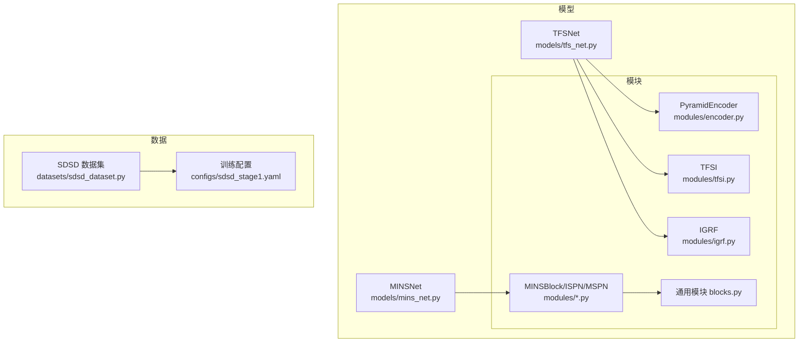
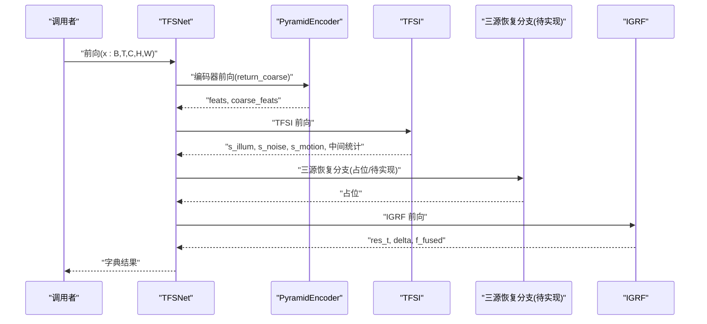
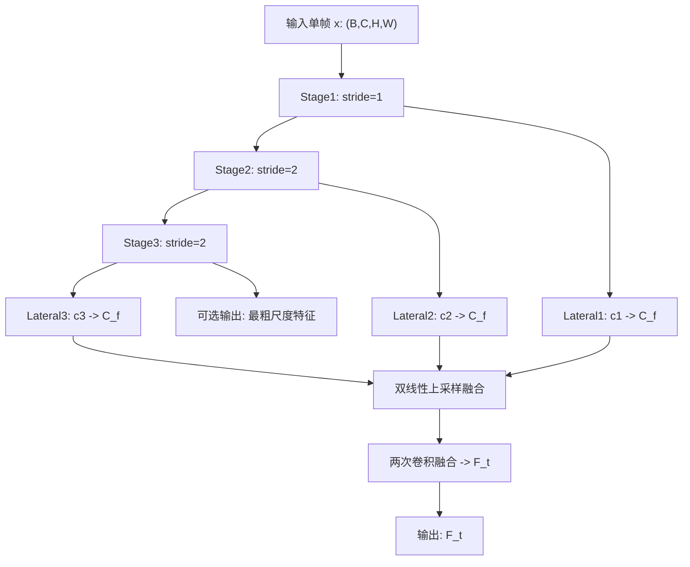
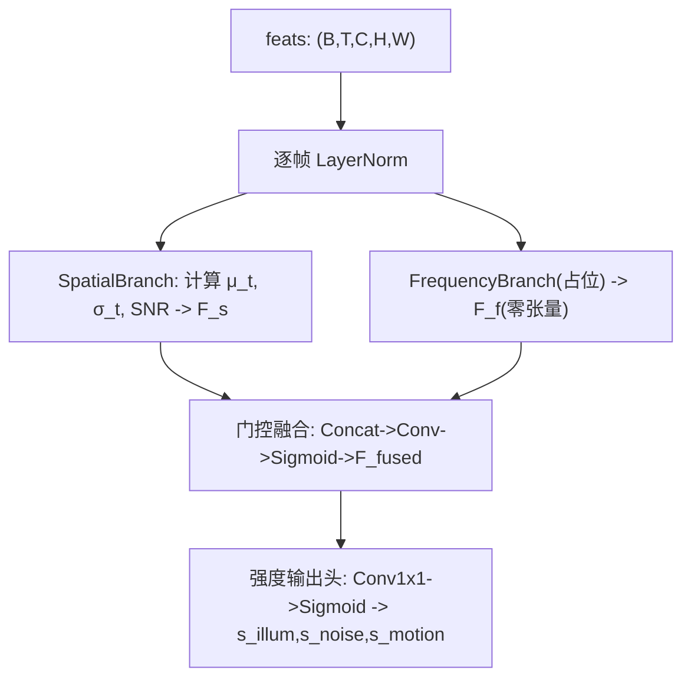
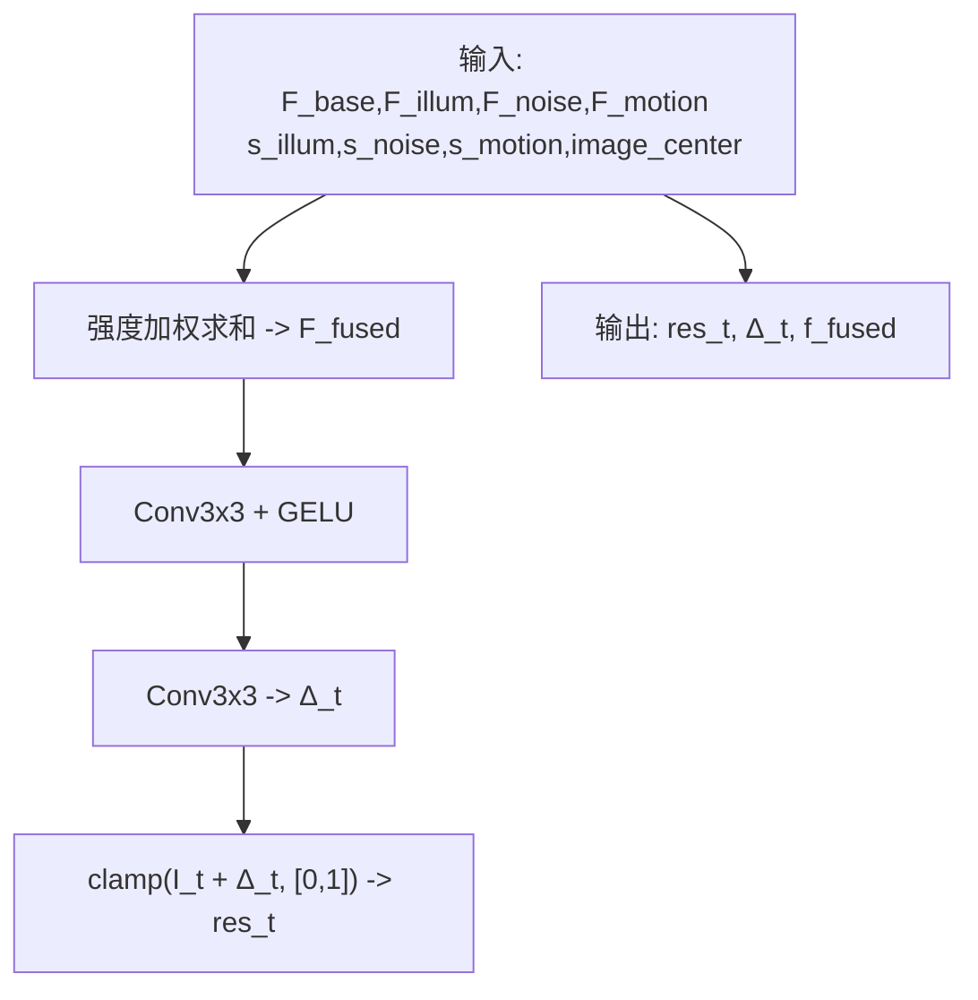
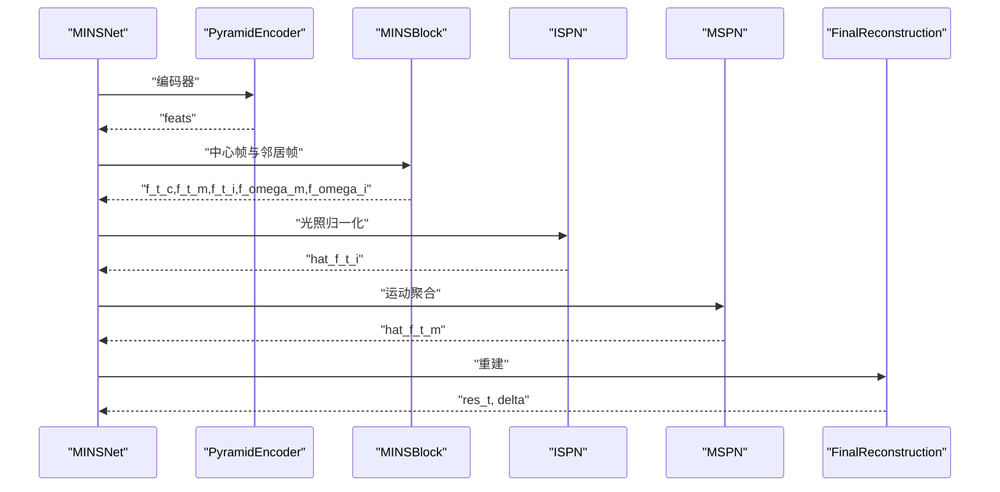
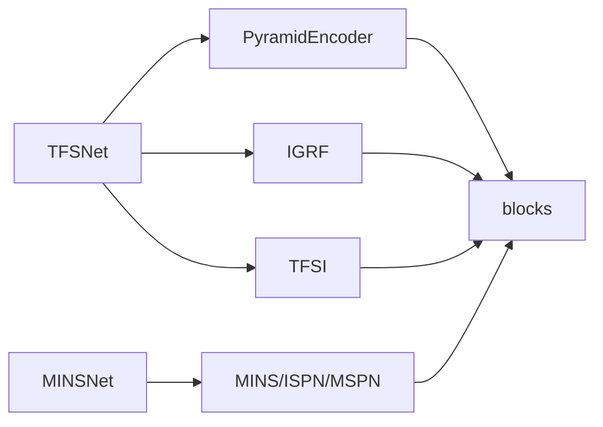

# 架构设计

<cite>
**本文引用的文件**
- [models/tfs_net.py](file://models/tfs_net.py)
- [models/mins_net.py](file://models/mins_net.py)
- [models/modules/__init__.py](file://models/modules/__init__.py)
- [models/modules/encoder.py](file://models/modules/encoder.py)
- [models/modules/tfsi.py](file://models/modules/tfsi.py)
- [models/modules/igrf.py](file://models/modules/igrf.py)
- [models/modules/blocks.py](file://models/modules/blocks.py)
- [models/modules/mins.py](file://models/modules/mins.py)
- [models/modules/ispn.py](file://models/modules/ispn.py)
- [models/modules/mspn.py](file://models/modules/mspn.py)
- [configs/sdsd_stage1.yaml](file://configs/sdsd_stage1.yaml)
- [datasets/sdsd_dataset.py](file://datasets/sdsd_dataset.py)
- [README.md](file://README.md)
</cite>

## 目录
1. [简介](#简介)
2. [项目结构](#项目结构)
3. [核心组件](#核心组件)
4. [架构总览](#架构总览)
5. [详细组件分析](#详细组件分析)
6. [依赖分析](#依赖分析)
7. [性能考量](#性能考量)
8. [故障排查指南](#故障排查指南)
9. [结论](#结论)
10. [附录](#附录)

## 简介
本文件面向 TFS-Net v3 的架构设计，围绕“5-stage 数据流”展开，系统性阐述主网络 TFSNet 的模块化结构、模块间交互关系与数据流向。TFSNet 采用分阶段的时频源分离与强度引导融合策略：Stage 1 共享金字塔编码器提取多尺度特征；Stage 2 TFSI 时频源指示器输出三源强度图；Stage 3 SACE 源感知对应估计（待实现）；Stage 4 三源恢复分支（IFPN/NDPN/MRPN，均待实现）；Stage 5 IGRF 强度引导融合进行最终重建。本文还给出架构图、组件关系图与设计决策说明，并结合配置与数据集脚本解释训练与推理流程。

## 项目结构
仓库采用“功能模块化 + 分层组织”的方式：
- models：主干网络与模块定义
  - tfs_net.py：TFSNet 主网络
  - mins_net.py：对比基线 MINSNet（用于理解 v1 流程）
  - modules：子模块集合
    - encoder.py：金字塔编码器
    - tfsi.py：时频源指示器
    - igrf.py：强度引导融合
    - mins.py、ispn.py、mspn.py、blocks.py：MINSNet 子模块（对比参考）
    - __init__.py：模块导出入口
- datasets：数据集与变换
  - sdsd_dataset.py：SDSD 数据加载与窗口采样
- configs：训练配置
  - sdsd_stage1.yaml：示例配置
- utils、reference_repos、scripts 等：工具与参考实现（本架构文档聚焦 models 与 configs）

**图示来源**
- [models/tfs_net.py:34-98](file://models/tfs_net.py#L34-L98)
- [models/mins_net.py:11-18](file://models/mins_net.py#L11-L18)
- [models/modules/encoder.py:35-101](file://models/modules/encoder.py#L35-L101)
- [models/modules/tfsi.py:187-264](file://models/modules/tfsi.py#L187-L264)
- [models/modules/igrf.py:27-88](file://models/modules/igrf.py#L27-L88)
- [models/modules/mins.py:22-130](file://models/modules/mins.py#L22-L130)
- [models/modules/ispn.py:7-25](file://models/modules/ispn.py#L7-L25)
- [models/modules/mspn.py:7-40](file://models/modules/mspn.py#L7-L40)
- [models/modules/blocks.py:8-110](file://models/modules/blocks.py#L8-L110)
- [datasets/sdsd_dataset.py:18-80](file://datasets/sdsd_dataset.py#L18-L80)
- [configs/sdsd_stage1.yaml:1-34](file://configs/sdsd_stage1.yaml#L1-L34)

**章节来源**
- [README.md:1-24](file://README.md#L1-L24)
- [configs/sdsd_stage1.yaml:1-34](file://configs/sdsd_stage1.yaml#L1-L34)
- [datasets/sdsd_dataset.py:18-80](file://datasets/sdsd_dataset.py#L18-L80)

## 核心组件
- TFSNet 主网络：封装 5-stage 数据流，当前实现 Stage 1、2、5，Stage 3/4 为占位或待实现。
- PyramidEncoder：共享金字塔编码器，支持返回粗尺度特征以供后续分支使用。
- TFSI：时频源指示器，输出三源强度图（光照、噪声、运动），具备空间/频域分支与门控融合。
- IGRF：强度引导融合，将三源分支与基础特征按强度加权融合并重建。
- MINSNet（对比）：v1 流程的参考，包含 MINSBlock、ISPN、MSPN 与重建模块。
- 通用模块 blocks：提供卷积块、残差块、层归一化、窗口划分/还原等工具函数。

**章节来源**
- [models/tfs_net.py:34-98](file://models/tfs_net.py#L34-L98)
- [models/modules/encoder.py:35-101](file://models/modules/encoder.py#L35-L101)
- [models/modules/tfsi.py:187-264](file://models/modules/tfsi.py#L187-L264)
- [models/modules/igrf.py:27-88](file://models/modules/igrf.py#L27-L88)
- [models/mins_net.py:11-67](file://models/mins_net.py#L11-L67)
- [models/modules/blocks.py:8-110](file://models/modules/blocks.py#L8-L110)

## 架构总览
TFS-Net v3 的 5-stage 数据流如下：
- Stage 1：共享金字塔编码器，输出融合特征与可选粗尺度特征。
- Stage 2：TFSI 时频源指示器，输出三源强度图与中间统计量。
- Stage 3：SACE 源感知对应估计（待实现）。
- Stage 4：三源恢复分支（IFPN/NDPN/MRPN，待实现）。
- Stage 5：IGRF 强度引导融合，将三源输出与基础特征加权融合并重建。

**图示来源**
- [models/tfs_net.py:100-181](file://models/tfs_net.py#L100-L181)
- [models/modules/encoder.py:76-101](file://models/modules/encoder.py#L76-L101)
- [models/modules/tfsi.py:217-264](file://models/modules/tfsi.py#L217-L264)
- [models/modules/igrf.py:56-88](file://models/modules/igrf.py#L56-L88)

## 详细组件分析

### TFSNet 主网络
- 结构要点
  - 支持输入多帧序列 (B, T, C, H, W)，T 为奇数且中心帧索引为 T//2。
  - Stage 1：PyramidEncoder，返回融合特征与可选粗尺度特征。
  - Stage 2：TFSI，输出三源强度图与中间统计量。
  - Stage 3：SACE 占位，当前抛出 NotImplementedError。
  - Stage 4：IFPN/NDPN/MRPN 占位，当前为伪代码注释。
  - Stage 5：IGRF，将三源输出与基础特征加权融合并重建。
- 设计决策
  - 将 TFSI 置于 Stage 2，强调在早期即进行时频源强度估计，为后续分支提供先验。
  - IGRF 作为最终融合器，采用强度加权与残差修正，保证物理意义与数值稳定性。
  - 保留 window_size 等参数以适配未来 SACE/NDPN 的实现。

```mermaid
classDiagram
class TFSNet {
+forward(x) dict
-encoder : PyramidEncoder
-tfsi : TFSI
-sace : Module?
-ifpn : Module?
-ndpn : Module?
-mrpn : Module?
-igrf : IGRF
}
class PyramidEncoder {
+forward(x, return_coarse) Tensor/Tuple
}
class TFSI {
+forward(feats) dict
}
class IGRF {
+forward(...) dict
}
TFSNet --> PyramidEncoder : "使用"
TFSNet --> TFSI : "使用"
TFSNet --> IGRF : "使用"
```

**图示来源**
- [models/tfs_net.py:34-98](file://models/tfs_net.py#L34-L98)
- [models/modules/encoder.py:35-101](file://models/modules/encoder.py#L35-L101)
- [models/modules/tfsi.py:187-264](file://models/modules/tfsi.py#L187-L264)
- [models/modules/igrf.py:27-88](file://models/modules/igrf.py#L27-L88)

**章节来源**
- [models/tfs_net.py:34-181](file://models/tfs_net.py#L34-L181)

### 金字塔编码器（PyramidEncoder）
- 功能
  - 三层卷积阶段，stride=1/2/2，输出多尺度特征。
  - lateral 投影与双线性上采样融合，得到融合特征。
  - 支持 return_coarse=True 返回最粗尺度特征，供 IFPN 双流使用。
- 关键假设
  - 当前最粗尺度分辨率为 H/4×W/4，与 v3 文档中的 H/8×W/8 不一致，需后续澄清或调整。

**图示来源**
- [models/modules/encoder.py:35-101](file://models/modules/encoder.py#L35-L101)

**章节来源**
- [models/modules/encoder.py:35-101](file://models/modules/encoder.py#L35-L101)

### 时频源指示器（TFSI）
- 数据流
  - 对每帧做 LayerNorm 归一化。
  - 空间分支：沿时间维计算中位值、方差与 SNR，拼接后经卷积得到 F_s。
  - 频域分支：占位（返回零张量），待 LFF 实现。
  - 门控融合：Concat[F_s, F_f] 经卷积与 Sigmoid 得到门控权重，融合得到 F_fused。
  - 强度输出头：Conv1x1(F_fused) -> 3 通道 Sigmoid，得到三源强度图。
- 设计动机
  - 以独立强度图指导后续分支，避免注意力耦合带来的不确定性。
  - 频域分支为占位，便于当前阶段验证空间分支与门控融合的有效性。

**图示来源**
- [models/modules/tfsi.py:23-264](file://models/modules/tfsi.py#L23-L264)

**章节来源**
- [models/modules/tfsi.py:187-264](file://models/modules/tfsi.py#L187-L264)

### 强度引导融合（IGRF）
- 公式
  - F_fused = s_illum·F_illum + s_noise·F_noise + s_motion·F_motion + F_base
  - Δ_t = Conv3x3(SiLU(Conv3x3(F_fused)))，res_t = clamp(I_t + Δ_t, [0,1])
- 设计要点
  - F_base 当前假设为编码器融合特征 F_t，具体设计见 v3 文档与问题记录。
  - 三分支通道一致性假设为 C_f，确保加权融合的可行性。

**图示来源**
- [models/modules/igrf.py:56-88](file://models/modules/igrf.py#L56-L88)

**章节来源**
- [models/modules/igrf.py:27-88](file://models/modules/igrf.py#L27-L88)

### 对比：MINSNet（v1）
- 流程概览
  - 编码器 -> MINSBlock（熵门与邻域注意）-> ISPN（光照归一化）-> MSPN（运动聚合）-> 重建。
- 与 TFSNet 的差异
  - TFSI 替代了 MINSBlock 的注意力与熵门，直接输出三源强度图。
  - IGRF 替代了 FinalReconstruction，采用强度加权融合。
  - TFSNet 明确区分“源估计（Stage 2）+ 源恢复（Stage 4）+ 融合（Stage 5）”。

**图示来源**
- [models/mins_net.py:20-65](file://models/mins_net.py#L20-L65)
- [models/modules/mins.py:62-130](file://models/modules/mins.py#L62-L130)
- [models/modules/ispn.py:13-24](file://models/modules/ispn.py#L13-L24)
- [models/modules/mspn.py:27-39](file://models/modules/mspn.py#L27-L39)

**章节来源**
- [models/mins_net.py:11-67](file://models/mins_net.py#L11-L67)

## 依赖分析
- 模块内聚与耦合
  - TFSNet 对外仅依赖 encoder、tfsi、igrf 三个模块，Stage 3/4 为占位，降低耦合风险。
  - encoder 与 igrf 依赖 blocks 提供的通用工具函数（卷积、归一化、窗口操作）。
  - tfsi 内部自包含空间/频域分支与门控融合，便于独立测试。
- 外部依赖
  - 训练与推理由 configs 与 datasets 驱动，与模型内部解耦。

**图示来源**
- [models/tfs_net.py:29-31](file://models/tfs_net.py#L29-L31)
- [models/modules/encoder.py:20](file://models/modules/encoder.py#L20)
- [models/modules/igrf.py:24](file://models/modules/igrf.py#L24)
- [models/modules/tfsi.py:20](file://models/modules/tfsi.py#L20)
- [models/mins_net.py:4-8](file://models/mins_net.py#L4-L8)

**章节来源**
- [models/modules/__init__.py:1-10](file://models/modules/__init__.py#L1-L10)

## 性能考量
- 计算复杂度
  - TFSI 的空间分支涉及沿时间维统计与拼接卷积，复杂度近似 O(T·C·H·W)。
  - IGRF 的强度加权与两层卷积为 O(C_f·H·W) 与 O(3·H·W)。
  - Stage 3/4 为占位，不影响当前性能。
- 内存占用
  - return_coarse=True 会额外保存最粗尺度特征，增加显存占用。
- 窗口化与裁剪
  - blocks 提供窗口划分与反划分，有助于大分辨率下的内存管理；训练配置支持裁剪与重叠推理。

**章节来源**
- [models/modules/blocks.py:65-94](file://models/modules/blocks.py#L65-L94)
- [configs/sdsd_stage1.yaml:24-27](file://configs/sdsd_stage1.yaml#L24-L27)

## 故障排查指南
- 输入尺寸断言
  - TFSNet forward 要求 T 为奇数且 ≥ 3，否则抛出断言错误。请检查数据集与配置中的 window_size。
- SACE 未实现
  - 当前抛出 NotImplementedError，无法进入 IFPN/NDPN/MRPN。请等待 SACE 实现后再继续。
- IGRF 输入缺失
  - 若尝试调用 IGRF，需确保传入 F_illum/F_noise/F_motion 与 s_illum/s_noise/s_motion。当前 TFSNet 仅提供 s_*，其余分支占位。
- 数据集路径与窗口
  - SDSDDataset 依据输入/目标根目录与 window_size 构建样本列表，请核对配置文件路径与序列对齐情况。

**章节来源**
- [models/tfs_net.py:115-139](file://models/tfs_net.py#L115-L139)
- [datasets/sdsd_dataset.py:18-80](file://datasets/sdsd_dataset.py#L18-L80)
- [configs/sdsd_stage1.yaml:3-8](file://configs/sdsd_stage1.yaml#L3-L8)

## 结论
TFS-Net v3 通过“时频源指示 + 三源恢复 + 强度引导融合”的 5-stage 数据流，提供了清晰的模块化设计与可扩展的实现路径。当前版本已完成 Stage 1、2、5，Stage 3/4 为占位，便于逐步迭代。编码器与 IGRF 的设计兼顾了多尺度特征融合与物理意义的强度加权，blocks 提供了窗口化与归一化的通用能力。建议在后续实现中优先完成 SACE 与 IFPN/NDPN/MRPN，以形成完整的端到端流程。

## 附录
- 训练与推理
  - 使用 sdsd_stage1.yaml 配置进行训练与推理，数据集采用 SDSDDataset 的滑动窗口采样。
- 参考实现
  - 可参考 reference_repos 中 BasicSR、NAFNet、Retinexformer 等项目的训练脚本与模型结构，作为扩展与优化的参考。

**章节来源**
- [README.md:12-24](file://README.md#L12-L24)
- [configs/sdsd_stage1.yaml:16-34](file://configs/sdsd_stage1.yaml#L16-L34)
- [datasets/sdsd_dataset.py:64-80](file://datasets/sdsd_dataset.py#L64-L80)