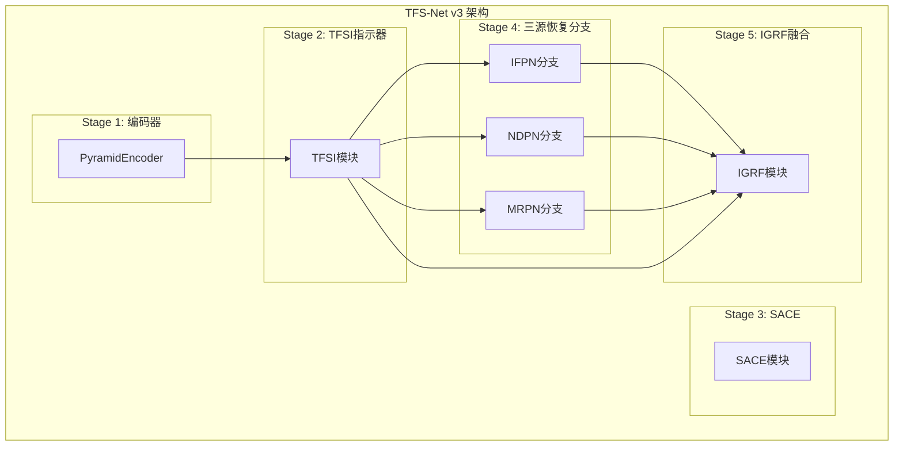
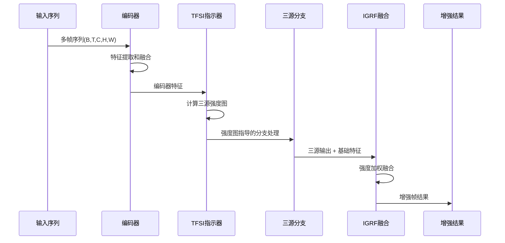
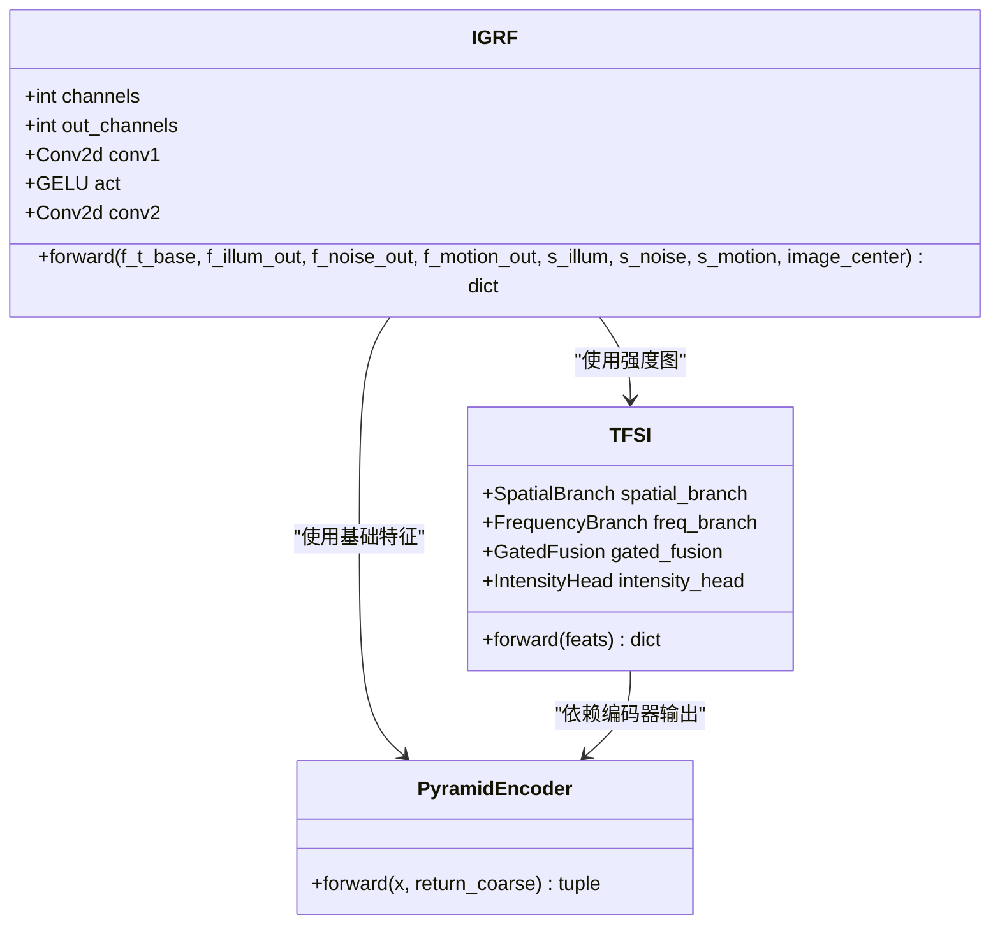
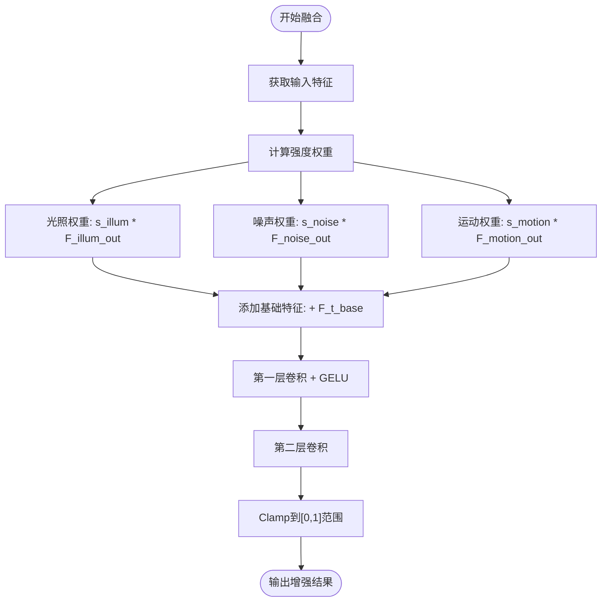
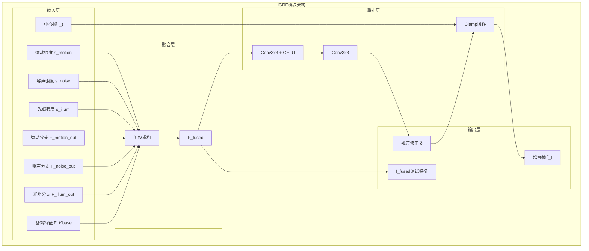

# 强度引导融合(IGRF)技术文档

<cite>
**本文档引用的文件**
- [igrf.py](file://models/modules/igrf.py)
- [tfs_net.py](file://models/tfs_net.py)
- [tfsi.py](file://models/modules/tfsi.py)
- [reconstruction.py](file://models/modules/reconstruction.py)
- [blocks.py](file://models/modules/blocks.py)
- [v3quest.md](file://v3quest.md)
- [TFSv3-result.md](file://TFSv3-result.md)
</cite>

## 目录
1. [简介](#简介)
2. [项目结构](#项目结构)
3. [核心组件](#核心组件)
4. [架构概览](#架构概览)
5. [详细组件分析](#详细组件分析)
6. [数学模型](#数学模型)
7. [网络架构](#网络架构)
8. [输入输出规范](#输入输出规范)
9. [实现细节](#实现细节)
10. [性能考虑](#性能考虑)
11. [故障排除指南](#故障排除指南)
12. [结论](#结论)

## 简介

强度引导融合(IGRF)是TFS-Net v3架构中的关键模块，负责将来自三个独立源估计分支的特征进行强度加权融合，从而实现高质量的视频帧增强。该模块基于TFSI模块输出的三源强度图，对光照、噪声和运动退化进行精确建模，并通过两层卷积网络实现残差重建。

IGRF模块的设计目标是在保持计算效率的同时，最大化利用多源退化信息的互补性，为后续的视频增强任务提供高质量的特征表示。

## 项目结构

IGRF模块位于TFS-Net项目的模块化架构中，与编码器、TFSI指示器和其他功能模块协同工作：



**图表来源**
- [tfs_net.py:94-98](file://models/tfs_net.py#L94-L98)
- [tfsi.py:187-265](file://models/modules/tfsi.py#L187-L265)
- [igrf.py:27-89](file://models/modules/igrf.py#L27-L89)

**章节来源**
- [tfs_net.py:1-25](file://models/tfs_net.py#L1-L25)
- [tfs_net.py:94-98](file://models/tfs_net.py#L94-L98)

## 核心组件

IGRF模块的核心由以下组件构成：

### 主要组件
- **强度加权融合器**: 将三个源分支的特征与基础特征进行加权融合
- **两层卷积网络**: 实现残差修正量的预测
- **GELU激活函数**: 提供非线性变换
- **Clamp操作**: 确保输出在有效范围内

### 关键特性
- 支持三源强度图的独立建模
- 保持通道数一致性要求
- 提供调试友好的中间特征输出
- 实现数值稳定性保护

**章节来源**
- [igrf.py:27-89](file://models/modules/igrf.py#L27-L89)

## 架构概览

IGRF模块在整个TFS-Net v3架构中的位置和作用：



**图表来源**
- [tfs_net.py:100-181](file://models/tfs_net.py#L100-L181)
- [tfsi.py:217-265](file://models/modules/tfsi.py#L217-L265)
- [igrf.py:56-89](file://models/modules/igrf.py#L56-L89)

## 详细组件分析

### IGRF类结构分析



**图表来源**
- [igrf.py:27-89](file://models/modules/igrf.py#L27-L89)
- [tfsi.py:187-265](file://models/modules/tfsi.py#L187-L265)
- [tfs_net.py:34-98](file://models/tfs_net.py#L34-L98)

### 强度加权融合流程



**图表来源**
- [igrf.py:70-82](file://models/modules/igrf.py#L70-L82)

**章节来源**
- [igrf.py:27-89](file://models/modules/igrf.py#L27-L89)

## 数学模型

### 融合公式

IGRF模块的核心数学模型基于强度加权的特征融合：

**融合特征计算**:
```
F_fused = s_illum · F_t^{illum_out} + s_noise · F_t^{noise_out} + s_motion · F_t^{motion_out} + F_t^{base}
```

**增强帧重建**:
```
Î_t = clamp(I_t + Conv3x3(GELU(Conv3x3(F_fused))), 0, 1)
```

其中：
- `s_illum, s_noise, s_motion` ∈ [0,1] 为对应的强度图
- `F_t^{illum_out}, F_t^{noise_out}, F_t^{motion_out}` 为各源分支的输出特征
- `F_t^{base}` 为基础特征（当前实现中使用编码器融合特征）
- `I_t` 为中心帧原始图像

### 强度图约束条件

强度图必须满足以下约束：
- `s_illum, s_noise, s_motion` ∈ [0,1]
- `s_illum + s_noise + s_motion ≤ 1`（物理上允许多源叠加）

### 残差重建网络

两层卷积网络的数学表达：

**第一层**:
```
u_t = GELU(Conv_{3×3}(F_fused))
```

**第二层**:
```
δ = Conv_{3×3}(u_t)
```

**最终输出**:
```
Î_t = clamp(I_t + δ, 0, 1)
```

**章节来源**
- [igrf.py:14-21](file://models/modules/igrf.py#L14-L21)
- [igrf.py:70-82](file://models/modules/igrf.py#L70-L82)

## 网络架构

### 模块化设计

IGRF模块采用模块化设计，确保与其他组件的松耦合：



**图表来源**
- [igrf.py:56-89](file://models/modules/igrf.py#L56-L89)

### 通道配置

模块的通道配置遵循以下约定：

| 组件 | 通道数 | 用途 | 形状 |
|------|--------|------|------|
| 输入特征 | C_f | 基础特征 | (B, C_f, H, W) |
| 分支输出 | C_f | 各源分支 | (B, C_f, H, W) |
| 强度图 | 1 | 退化强度 | (B, 1, H, W) |
| 中心帧 | 3 | 原始图像 | (B, 3, H, W) |
| 融合特征 | C_f | 加权融合 | (B, C_f, H, W) |
| 残差修正 | 3 | 像素级修正 | (B, 3, H, W) |

**章节来源**
- [igrf.py:47-54](file://models/modules/igrf.py#L47-L54)

## 输入输出规范

### 输入规范

IGRF模块接受以下输入：

**必需输入**:
- `f_t_base`: 基础特征，形状为(B, C_f, H, W)
- `f_illum_out`: 光照分支输出，形状为(B, C_f, H, W)
- `f_noise_out`: 噪声分支输出，形状为(B, C_f, H, W)
- `f_motion_out`: 运动分支输出，形状为(B, C_f, H, W)
- `image_center`: 中心帧原始图像，形状为(B, 3, H, W)

**强度图输入**:
- `s_illum`: 光照强度图，形状为(B, 1, H, W)
- `s_noise`: 噪声强度图，形状为(B, 1, H, W)
- `s_motion`: 运动强度图，形状为(B, 1, H, W)

### 输出规范

IGRF模块返回以下输出:

**主要输出**:
- `res_t`: 增强帧，形状为(B, 3, H, W)
- `delta`: 残差修正量，形状为(B, 3, H, W)

**调试输出**:
- `f_fused`: 融合后的特征，形状为(B, C_f, H, W)

### 数据类型和范围

- **输入数据类型**: torch.Tensor (float32)
- **强度图范围**: [0, 1]
- **输出范围**: [0, 1]（通过clamp操作保证）
- **特征通道数**: C_f = 48（默认配置）

**章节来源**
- [igrf.py:31-45](file://models/modules/igrf.py#L31-L45)
- [igrf.py:66-88](file://models/modules/igrf.py#L66-L88)

## 实现细节

### 基础特征假设

当前实现中，基础特征`F_t^{base}`采用编码器融合特征作为占位实现：

```python
# 当前假设：F_t^base = 编码器融合特征 F_t
f_t_base = feats[:, center_idx]  # (B, C_f, H, W)
```

这种设计的优势：
- 利用编码器提供的丰富上下文信息
- 保持与TFSI输出的一致性
- 简化实现复杂度

### 通道一致性要求

为了确保加法运算的合法性，三个分支的输出特征必须具有相同的通道数：

```python
# 通道数一致性检查
assert f_illum_out.shape[1] == f_noise_out.shape[1] == f_motion_out.shape[1] == channels
```

默认通道数设置为48，这是基于编码器融合通道数的选择。

### 数值稳定性措施

实现中采用了多项数值稳定性措施：

1. **Clamp操作**: 确保输出在[0,1]范围内
2. **GELU激活**: 提供平滑的非线性变换
3. **权重广播**: 通过形状兼容性实现强度图与特征的逐元素乘法

### 计算复杂度分析

IGRF模块的计算复杂度分析：

- **融合阶段**: O(B × C_f × H × W)
- **第一层卷积**: O(B × C_f × H × W)
- **第二层卷积**: O(B × 3 × H × W)
- **总复杂度**: O(B × C_f × H × W)

内存占用主要来自中间特征存储，约为原始输入的2-3倍。

**章节来源**
- [igrf.py:70-82](file://models/modules/igrf.py#L70-L82)
- [igrf.py:47-54](file://models/modules/igrf.py#L47-L54)

## 性能考虑

### 计算优化

1. **内存优化**: 使用in-place操作减少中间变量分配
2. **并行化**: 利用PyTorch的向量化操作
3. **混合精度**: 支持半精度浮点数以提高吞吐量

### 实时性能

IGRF模块设计考虑了实时应用的需求：
- 卷积核大小为3×3，计算开销适中
- 两层网络深度适中，平衡精度和速度
- 批处理支持，适合GPU并行计算

### 内存管理

建议的内存管理策略：
- 合理设置batch size以平衡内存和吞吐量
- 使用梯度检查点技术减少训练内存占用
- 及时释放不需要的中间变量

## 故障排除指南

### 常见问题及解决方案

**问题1: 形状不匹配错误**
```
RuntimeError: The size of tensor a (48) must match the size of tensor b (64) at dimension 1
```

**解决方案**:
- 确保所有分支输出特征具有相同的通道数
- 检查编码器配置是否正确
- 验证`fused_channels`参数设置

**问题2: 强度图范围异常**
```
ValueError: Expected all tensors to be on the same device
```

**解决方案**:
- 确保所有输入张量在同一设备上
- 检查GPU/CPU设备配置
- 验证张量数据类型一致性

**问题3: 输出超出范围**
```
Warning: Output values outside [0,1] range
```

**解决方案**:
- 检查clamp操作是否正常执行
- 验证输入图像是否在[0,1]范围内
- 检查网络权重是否合理初始化

### 调试技巧

1. **中间特征可视化**: 利用`f_fused`输出进行调试
2. **强度图分析**: 检查`s_illum`, `s_noise`, `s_motion`的分布
3. **渐进式测试**: 逐步验证每个组件的功能

**章节来源**
- [igrf.py:70-82](file://models/modules/igrf.py#L70-L82)

## 结论

IGRF模块作为TFS-Net v3架构的关键组件，实现了基于强度权重的特征融合机制。该模块通过以下关键特性实现了高效的视频增强：

1. **多源信息融合**: 利用光照、噪声和运动退化的互补信息
2. **强度指导**: 基于TFSI输出的强度图进行自适应融合
3. **残差重建**: 通过两层卷积网络实现精确的像素级修正
4. **模块化设计**: 与其他组件保持良好的接口兼容性

IGRF模块的设计充分体现了现代视频增强技术的发展趋势，即通过多源信息的协同来提升重建质量。随着IFPN、NDPN和MRPN分支的逐步实现，IGRF将在完整的TFS-Net v3系统中发挥更加重要的作用。

未来的工作方向包括：
- 完善基础特征的定义和实现
- 优化融合策略以适应不同的退化场景
- 探索更复杂的强度图建模方法
- 提升模块的泛化能力和鲁棒性