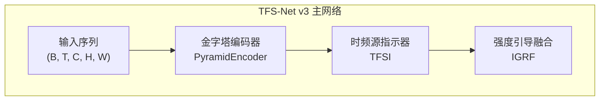
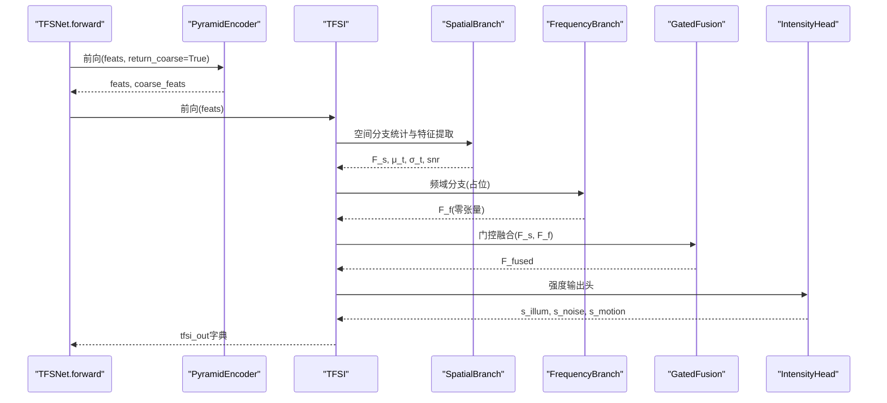
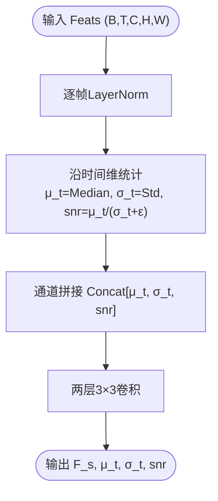
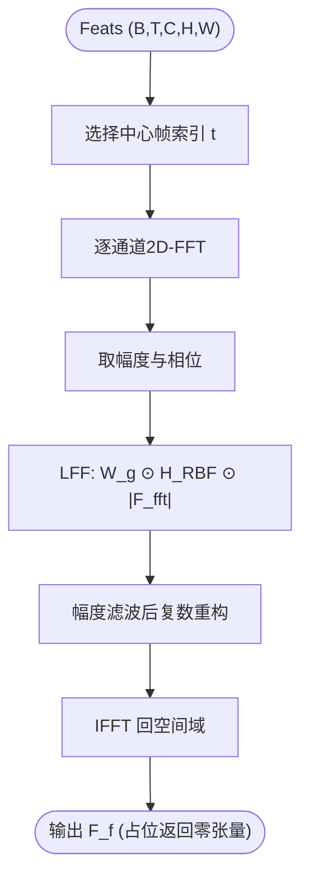
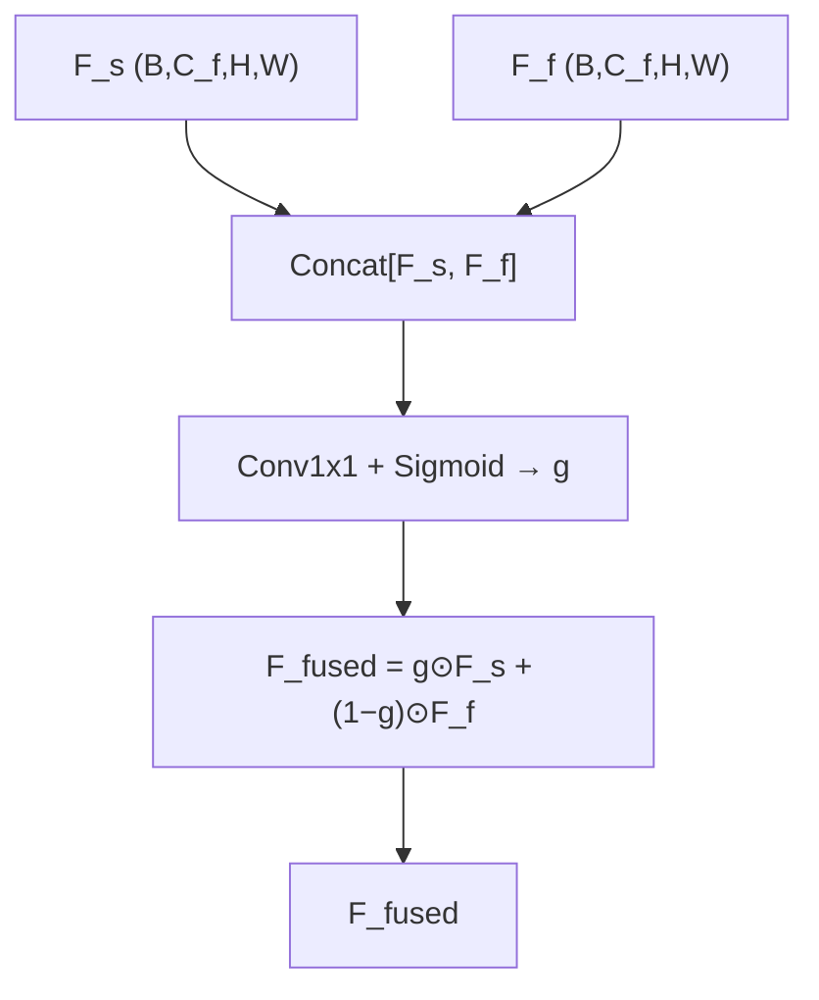
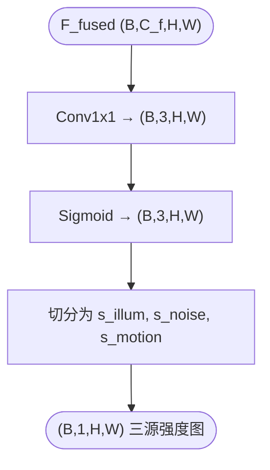
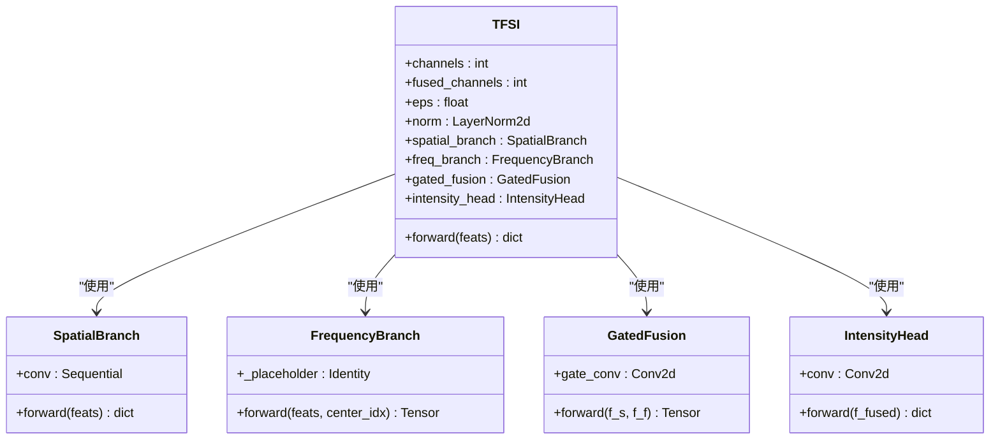
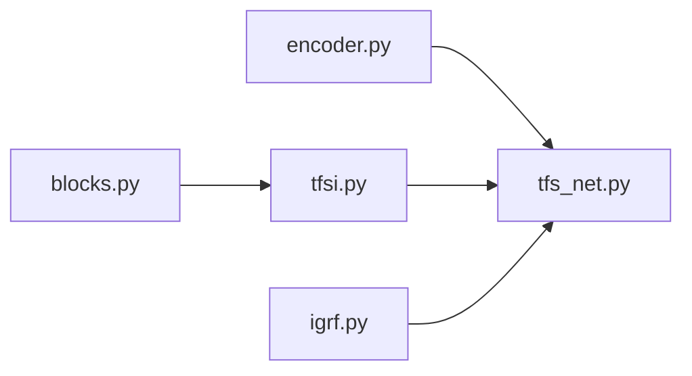

# 时频源指示器(TFSI)

<cite>
**本文引用的文件**
- [tfsi.py](file://models/modules/tfsi.py)
- [blocks.py](file://models/modules/blocks.py)
- [encoder.py](file://models/modules/encoder.py)
- [igrf.py](file://models/modules/igrf.py)
- [tfs_net.py](file://models/tfs_net.py)
- [v3quest.md](file://v3quest.md)
- [v3answer.md](file://v3answer.md)
- [README.md](file://README.md)
- [losses.py](file://losses/losses.py)
- [sdsd_stage1.yaml](file://configs/sdsd_stage1.yaml)
</cite>

## 目录
1. [简介](#简介)
2. [项目结构](#项目结构)
3. [核心组件](#核心组件)
4. [架构总览](#架构总览)
5. [详细组件分析](#详细组件分析)
6. [依赖关系分析](#依赖关系分析)
7. [性能考量](#性能考量)
8. [故障排查指南](#故障排查指南)
9. [结论](#结论)
10. [附录](#附录)

## 简介
本技术文档围绕时频源指示器(TFSI)模块展开，系统阐述其双分支架构与门控融合机制，解释如何通过强度输出实现三源独立强度估计（光照、噪声、运动）。文档结合v3设计文档与实现现状，提供数学公式推导、网络结构图解、参数配置说明与实际应用示例，并给出面向开发者的实现指南与调优建议。

## 项目结构
TFSI位于TFS-Net v3主干网络中，作为第二阶段的核心模块，负责从多帧编码器特征中提取“时频源指示”并输出三源强度图，为后续SACE、IFPN、NDPN、MRPN与IGRF提供基础信号。

图表来源
- [tfs_net.py:100-181](file://models/tfs_net.py#L100-L181)
- [encoder.py:35-102](file://models/modules/encoder.py#L35-L102)
- [tfsi.py:187-265](file://models/modules/tfsi.py#L187-L265)
- [igrf.py:27-89](file://models/modules/igrf.py#L27-L89)

章节来源
- [tfs_net.py:34-99](file://models/tfs_net.py#L34-L99)
- [encoder.py:35-102](file://models/modules/encoder.py#L35-L102)
- [tfsi.py:187-265](file://models/modules/tfsi.py#L187-L265)
- [igrf.py:27-89](file://models/modules/igrf.py#L27-L89)

## 核心组件
- 空间分支(SpatialBranch)：对多帧特征沿时间维计算中位值、方差与SNR，拼接后经卷积得到空间特征F_s，并输出μ_t、σ_t、snr供下游使用。
- 频域分支(FrequencyBranch)：当前为占位实现，返回零张量；待LFF实现后替换为可学习频率滤波器。
- 门控融合(GatedFusion)：基于Concat[F_s, F_f]经1×1卷积得到门控权重g，进行加权融合F_fused = g⊙F_s + (1−g)⊙F_f。
- 强度输出头(IntensityHead)：对F_fused经1×1卷积后经Sigmoid得到三源强度图s_illum、s_noise、s_motion。

章节来源
- [tfsi.py:23-78](file://models/modules/tfsi.py#L23-L78)
- [tfsi.py:80-115](file://models/modules/tfsi.py#L80-L115)
- [tfsi.py:117-146](file://models/modules/tfsi.py#L117-L146)
- [tfsi.py:148-185](file://models/modules/tfsi.py#L148-L185)

## 架构总览
TFSI在TFS-Net中的数据流如下：多帧归一化特征经空间分支与频域分支，经门控融合后送入强度输出头，得到三源强度图。当前频域分支以零张量占位，不影响整体前向流程。

图表来源
- [tfs_net.py:100-181](file://models/tfs_net.py#L100-L181)
- [tfsi.py:217-265](file://models/modules/tfsi.py#L217-L265)
- [encoder.py:76-102](file://models/modules/encoder.py#L76-L102)

章节来源
- [tfs_net.py:100-181](file://models/tfs_net.py#L100-L181)
- [tfsi.py:217-265](file://models/modules/tfsi.py#L217-L265)

## 详细组件分析

### 空间分支：时域统计量提取
- 统计量定义
  - 中位值：μ_t(x,y) = Median_i{F_i(x,y)}，作为结构先验。
  - 方差：σ_t²(x,y) = Var_i{F_i(x,y)}，作为噪声/运动度量。
  - SNR估计：snr = μ_t / (σ_t + ε)，作为输入特征的第三通道。
- 特征映射：将[μ_t, σ_t, snr]在通道维拼接，经两层3×3卷积得到F_s。
- 输出：F_s、μ_t、σ_t、snr，供SACE与NDPN使用。

图表来源
- [tfsi.py:46-77](file://models/modules/tfsi.py#L46-L77)

章节来源
- [tfsi.py:23-78](file://models/modules/tfsi.py#L23-L78)

### 频域分支：LFF可学习频率滤波（占位）
- 设计目标：对中心帧或每帧做可学习频率滤波，提取光照不变特征，辅助强度估计。
- 当前状态：以零张量占位，返回形状与空间分支一致的张量，保证整体前向可用。
- 待实现要点（依据v3quest.md与v3answer.md）：
  - RBF基函数族与参数：K（基函数数）、μ_k（径向中心）、σ_h（带宽）、a_k（权重）。
  - 角度调制：N（谐波数）、c_n、s_n、λ（调制强度）。
  - 零DC高斯窗：σ_g（带宽）。
  - FFT操作：对每通道独立2D-FFT，取幅度与相位，幅度经LFF滤波，相位可独立处理。
  - 作用帧：对中心帧或每帧独立做LFF，再做时域统计（如中位值）。

图表来源
- [tfsi.py:101-115](file://models/modules/tfsi.py#L101-L115)
- [v3quest.md:12-41](file://v3quest.md#L12-L41)
- [v3answer.md:7-106](file://v3answer.md#L7-L106)

章节来源
- [tfsi.py:80-115](file://models/modules/tfsi.py#L80-L115)
- [v3quest.md:12-41](file://v3quest.md#L12-L41)
- [v3answer.md:7-106](file://v3answer.md#L7-L106)

### 门控融合：加权融合策略
- 输入：F_s（空间分支特征）、F_f（频域分支特征）。
- 门控权重：g = σ(Conv1x1(Concat[F_s, F_f]))，形状(B, C_f, H, W)。
- 融合公式：F_fused = g ⊙ F_s + (1 − g) ⊙ F_f。
- 作用：在空间与频域之间自适应加权，兼顾结构先验与频率域不变性。

图表来源
- [tfsi.py:133-145](file://models/modules/tfsi.py#L133-L145)

章节来源
- [tfsi.py:117-146](file://models/modules/tfsi.py#L117-L146)

### 强度输出头：三源独立强度估计
- 输入：F_fused。
- 输出：三通道强度图，经Sigmoid归一化至[0,1]，分别对应光照、噪声、运动强度。
- 物理意义：允许多源叠加，强度独立估计，便于后续分支融合。

图表来源
- [tfsi.py:164-184](file://models/modules/tfsi.py#L164-L184)

章节来源
- [tfsi.py:148-185](file://models/modules/tfsi.py#L148-L185)

### TFSI整体类结构
- 成员组成：LayerNorm2d、SpatialBranch、FrequencyBranch、GatedFusion、IntensityHead。
- 前向流程：逐帧归一化 → 空间分支 → 频域分支(占位) → 门控融合 → 强度输出。
- 返回字典：包含F_fused、F_s、F_f、μ_t、σ_t、snr、s_illum、s_noise、s_motion。

图表来源
- [tfsi.py:187-265](file://models/modules/tfsi.py#L187-L265)

章节来源
- [tfsi.py:187-265](file://models/modules/tfsi.py#L187-L265)

## 依赖关系分析
- 模块内依赖
  - TFSI依赖blocks中的LayerNorm2d与ConvBlock。
  - TFSI的频域分支当前为占位，未来将依赖LFF实现。
- 网络级依赖
  - TFSNet在forward中调用PyramidEncoder与TFSI，随后在SACE/IFPN/NDPN/MRPN未实现时抛出NotImplementedError。
  - IGRF依赖TFSI输出的三源强度图与各分支输出进行加权融合。

图表来源
- [tfsi.py:20](file://models/modules/tfsi.py#L20)
- [tfs_net.py:29-31](file://models/tfs_net.py#L29-L31)
- [igrf.py:23-24](file://models/modules/igrf.py#L23-L24)

章节来源
- [tfsi.py:20](file://models/modules/tfsi.py#L20)
- [tfs_net.py:29-31](file://models/tfs_net.py#L29-L31)
- [igrf.py:23-24](file://models/modules/igrf.py#L23-L24)

## 性能考量
- 计算复杂度
  - 空间分支：对T维统计与两层3×3卷积，复杂度与输入通道数线性相关。
  - 频域分支：当前占位，不引入额外计算；实现LFF后，FFT与可学习滤波参数规模较小。
  - 门控融合与强度输出：均为轻量卷积，参数量与F_fused通道数线性相关。
- 内存占用
  - 多帧特征存储与统计计算会带来内存峰值，建议在数据加载与批大小上平衡。
- 训练稳定性
  - LayerNorm2d逐帧归一化有助于稳定训练。
  - 强度输出经Sigmoid限制在[0,1]，有利于多源强度估计的物理合理性。

## 故障排查指南
- 前向报错：SACE/IFPN/NDPN/MRPN未实现
  - 现象：TFSNet.forward在SACE处抛出NotImplementedError。
  - 原因：v3设计中SACE/IFPN/NDPN/MRPN尚未实现。
  - 解决：等待相应模块实现后再取消注释相关代码段。
- 频域分支异常
  - 现象：TFSI输出的F_f为零张量。
  - 原因：FrequencyBranch为占位实现。
  - 解决：实现LFF模块并替换占位，参考v3quest.md与v3answer.md中的参数与FFT策略。
- 强度图异常
  - 现象：s_illum、s_noise、s_motion不稳定或饱和。
  - 原因：Sigmoid输出与网络初始化/学习率有关。
  - 解决：检查初始化、学习率与损失函数权重，确保训练稳定。

章节来源
- [tfs_net.py:134-139](file://models/tfs_net.py#L134-L139)
- [tfsi.py:80-115](file://models/modules/tfsi.py#L80-L115)

## 结论
TFSI模块以双分支架构为核心，通过空间分支与时域统计量提取结构先验，通过门控融合整合空间与频率域信息，并以独立强度输出实现光照、噪声、运动三源估计。当前频域分支以占位实现，不影响整体流程；待LFF实现后，TFSI将为SACE、IFPN、NDPN、MRPN提供高质量的源指示信号，最终由IGRF进行强度引导融合，形成完整的视频低光照增强管线。

## 附录

### 参数配置说明
- TFSNet
  - in_channels：输入图像通道数，默认3（RGB）。
  - level_channels：编码器各级通道数，默认(32, 64, 96)。
  - fused_channels：融合后通道数，默认48。
  - window_size：窗口注意力大小（当前未使用）。
  - eps：数值稳定系数，默认1e-6。
- TFSI
  - channels：输入特征通道数（与编码器fused_channels一致）。
  - fused_channels：融合通道数。
  - eps：数值稳定系数。
- IGRF
  - channels：融合特征通道数。
  - out_channels：输出图像通道数。

章节来源
- [tfs_net.py:48-60](file://models/tfs_net.py#L48-L60)
- [tfsi.py:204-208](file://models/modules/tfsi.py#L204-L208)
- [igrf.py:47-50](file://models/modules/igrf.py#L47-L50)

### 实际应用示例
- 训练配置
  - 使用sdsd_stage1.yaml进行训练，窗口大小为5帧，分辨率为256×256。
- 推理流程
  - 输入：(B, T, C, H, W)，T为奇数，中心帧索引center_idx = T//2。
  - 输出：res_t、delta、f_fused_igrf、s_illum、s_noise、s_motion、tfsi_out。

章节来源
- [sdsd_stage1.yaml:8-15](file://configs/sdsd_stage1.yaml#L8-L15)
- [tfs_net.py:100-114](file://models/tfs_net.py#L100-L114)

### 实现指南与调优建议
- LFF实现要点
  - 参考v3answer.md中的参数与FFT策略，确保逐通道独立应用LFF，幅度与相位分离处理。
  - 建议K=8、N=4、σ_g=0.1、σ_h≈1/(2K)、λ=0.5作为默认初始化。
- 训练建议
  - 保持LayerNorm2d逐帧归一化，有助于稳定统计量估计。
  - 强度输出头使用Sigmoid，避免梯度爆炸；可结合损失函数中的TV与Perceptual正则提升视觉质量。
- 融合策略
  - 门控融合权重g应与F_s、F_f的分布相匹配；若F_f为占位，g将偏向F_s，随LFF实现逐步调整。

章节来源
- [v3answer.md:7-106](file://v3answer.md#L7-L106)
- [tfsi.py:117-146](file://models/modules/tfsi.py#L117-L146)
- [losses.py:80-114](file://losses/losses.py#L80-L114)