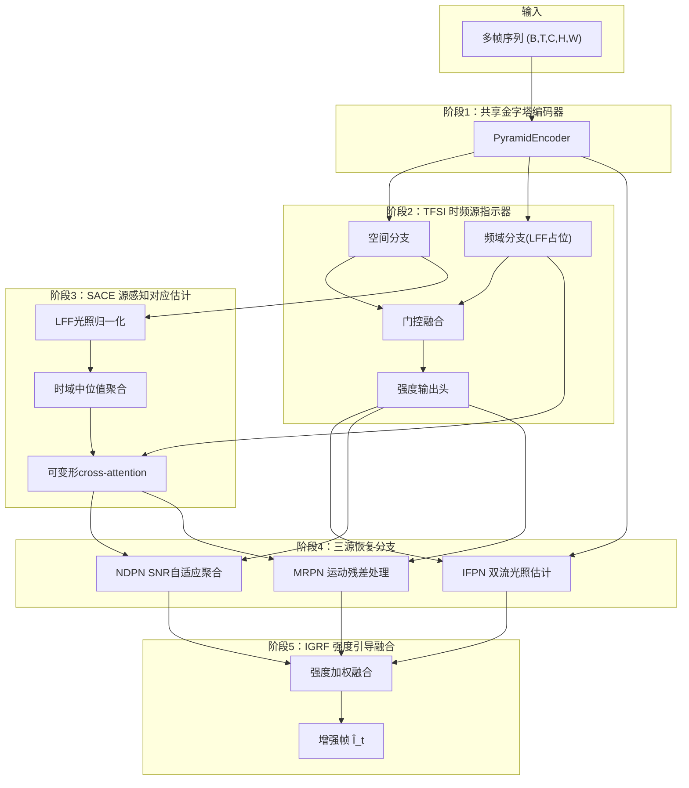
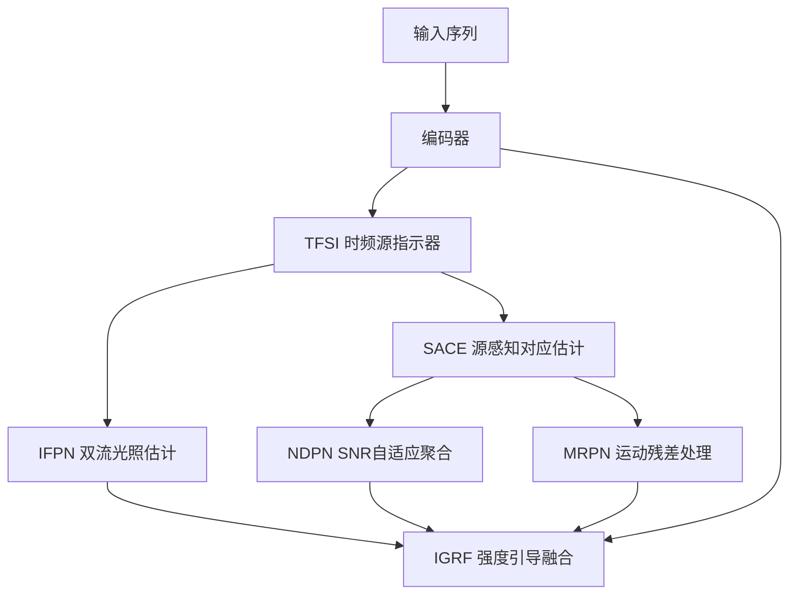
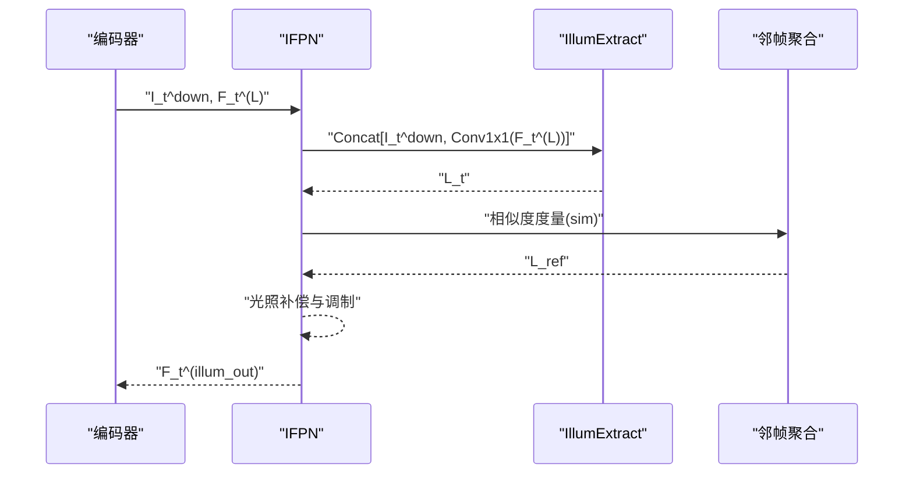
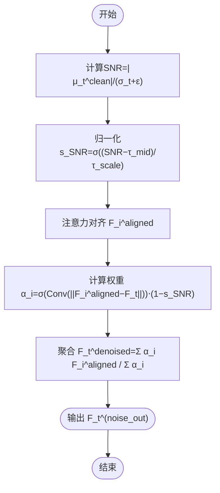
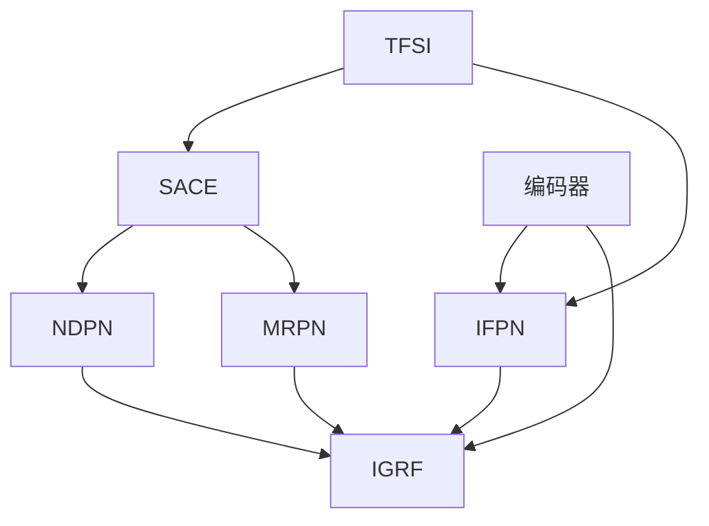

# 重建模块集合

<cite>
**本文档引用的文件**
- [models/modules/reconstruction.py](file://models/modules/reconstruction.py)
- [models/modules/ispn.py](file://models/modules/ispn.py)
- [models/modules/mspn.py](file://models/modules/mspn.py)
- [models/modules/mins.py](file://models/modules/mins.py)
- [models/modules/blocks.py](file://models/modules/blocks.py)
- [models/modules/encoder.py](file://models/modules/encoder.py)
- [models/modules/igrf.py](file://models/modules/igrf.py)
- [models/modules/tfsi.py](file://models/modules/tfsi.py)
- [models/tfs_net.py](file://models/tfs_net.py)
- [models/mins_net.py](file://models/mins_net.py)
- [configs/sdsd_stage1.yaml](file://configs/sdsd_stage1.yaml)
- [README.md](file://README.md)
- [TFSv3-result.md](file://TFSv3-result.md)
- [v3quest.md](file://v3quest.md)
</cite>

## 目录
1. [简介](#简介)
2. [项目结构](#项目结构)
3. [核心组件](#核心组件)
4. [架构总览](#架构总览)
5. [详细组件分析](#详细组件分析)
6. [依赖分析](#依赖分析)
7. [性能考虑](#性能考虑)
8. [故障排查指南](#故障排查指南)
9. [结论](#结论)
10. [附录](#附录)

## 简介
本文件面向“重建模块集合”的技术文档，聚焦于 IFPN、NDPN、MRPN 等重建分支模块的设计原理、实现差异与适用场景。结合 TFS-Net v3 的设计文档与现有代码骨架，系统阐述三源恢复分支的网络架构、参数配置、使用方法与性能基准，并提供模块选择指南与实际应用案例，帮助开发者根据具体任务需求选择合适的重建模块。

## 项目结构
本项目围绕视频低光照增强任务构建，采用“编码器-时频源指示器-SACE-三源恢复分支-强度引导融合”的五阶段流水线。其中：
- 编码器负责多尺度特征提取与融合；
- TFSI 输出三源强度图；
- SACE 进行光照归一化后的时域聚合与可变形注意力估计；
- 三源恢复分支（IFPN/NDPN/MRPN）分别处理光照、噪声与运动退化；
- IGRF 将三源输出与基础特征按强度加权融合并重建。

**图表来源**
- [models/tfs_net.py:100-181](file://models/tfs_net.py#L100-L181)
- [models/modules/tfsi.py:187-265](file://models/modules/tfsi.py#L187-L265)
- [models/modules/igrf.py:27-89](file://models/modules/igrf.py#L27-L89)

**章节来源**
- [README.md:1-24](file://README.md#L1-L24)
- [TFSv3-result.md:153-200](file://TFSv3-result.md#L153-L200)
- [models/tfs_net.py:34-99](file://models/tfs_net.py#L34-L99)

## 核心组件
本节概述三源恢复分支（IFPN、NDPN、MRPN）在 TFS-Net v3 中的设计定位与功能职责，并指出当前实现状态与依赖关系。

- IFPN（双流光照估计）
  - 设计目标：利用低分辨率原图与最粗尺度特征双流，估计光照图并进行强度调制矫正。
  - 当前状态：频域分支占位，IllumExtract、L_ref、F_t^(L) 定义尚未明确，需参考 Retinexformer 与 v3 设计文档。
  - 适用场景：光照闪烁主导的低光视频增强，强调光照一致性与多源叠加强度估计。
  - 性能特点：双流设计提升光照估计鲁棒性，但需额外的 F_t^(L) 通道与分辨率匹配。

- NDPN（SNR 自适应聚合）
  - 设计目标：基于时域统计量估计 SNR，对邻帧聚合权重进行自适应调节，实现“对齐残差小+SNR低”区域的强聚合。
  - 当前状态：依赖 SACE attention map 与 TFSI 的 SNR 估计，权重计算与卷积结构未实现。
  - 适用场景：噪声/运动叠加的复杂退化，强调在低信噪比区域提升鲁棒性。
  - 性能特点：SNR 归一化参数可学习，聚合权重动态变化，计算开销与精度平衡良好。

- MRPN（运动残差处理）
  - 设计目标：通过残差驱动隐式遮挡估计，对运动退化进行降权处理。
  - 当前状态：v2 设计细节缺失，无法实现；需补充 v2 文档或替代方案。
  - 适用场景：运动模糊与遮挡并存的视频增强。
  - 性能特点：残差驱动的隐式遮挡估计可减少误融合，但实现复杂度较高。

- IGRF（强度引导融合）
  - 设计目标：将三源输出与基础特征按强度加权融合，生成增强帧。
  - 当前状态：已实现融合公式与残差重建，F_t^base 假设待确认。
  - 适用场景：三源强度估计稳定时的最终重建阶段。
  - 性能特点：独立 Sigmoid 强度输出允许多源叠加，融合稳定性好。

**章节来源**
- [TFSv3-result.md:255-308](file://TFSv3-result.md#L255-L308)
- [v3quest.md:77-150](file://v3quest.md#L77-L150)
- [models/modules/igrf.py:27-89](file://models/modules/igrf.py#L27-L89)

## 架构总览
下图展示 TFS-Net v3 的五阶段数据流与模块依赖关系，突出三源恢复分支在系统中的位置与交互。

**图表来源**
- [models/tfs_net.py:100-181](file://models/tfs_net.py#L100-L181)
- [TFSv3-result.md:153-200](file://TFSv3-result.md#L153-L200)

## 详细组件分析

### IFPN（双流光照估计）
- 设计原理
  - 双流输入：低分辨率原图 I_t^down 与最粗尺度特征 F_t^(L)。
  - 光照估计器 IllumExtract 将双流拼接后映射为光照图 L_t。
  - 邻帧参考光照 L_ref 通过相似度权重对齐后聚合。
  - 强度调制矫正：按 s_illum 对 F_t^(illum) 进行光照补偿。

- 网络架构
  - IllumExtract 结构：参考 Retinexformer 的 Illumination Estimator，通常为若干卷积层，末尾 sigmoid 输出单通道或多通道光照图。
  - 相似度度量：可采用余弦相似度或可学习相似度函数，用于计算邻帧权重。
  - F_t^(L) 定义：v3 设计文档要求 H/8×W/8 分辨率，当前编码器 l3 为 H/4×W/4，需澄清或修改设计。

- 参数配置
  - 输入通道：I_t^down 为 3 通道，F_t^(L) 为 C 通道（fused_channels=48）。
  - 输出通道：L_t 通常为 1 或 C，取决于光照图类型。
  - 相似度核：可学习卷积或余弦相似度，建议使用可学习相似度以提升鲁棒性。

- 使用方法
  - 训练：IllumExtract 与相似度网络联合训练，L_ref 通过 softmax 相似度加权。
  - 推理：仅使用 IllumExtract 与相似度度量，无需 GT。

- 性能基准
  - 优势：双流设计提升光照估计鲁棒性，尤其在光照闪烁严重场景。
  - 挑战：IllumExtract 与 F_t^(L) 定义需与 v3 设计一致，否则会引入偏差。

**图表来源**
- [TFSv3-result.md:255-272](file://TFSv3-result.md#L255-L272)
- [v3quest.md:84-106](file://v3quest.md#L84-L106)

**章节来源**
- [TFSv3-result.md:255-272](file://TFSv3-result.md#L255-L272)
- [v3quest.md:77-106](file://v3quest.md#L77-L106)

### NDPN（SNR 自适应聚合）
- 设计原理
  - SNR 估计：基于光照归一化后的时域中位值与方差，计算 SNR(x,y)=|μ_t^clean(x,y)|/(σ_t(x,y)+ε)。
  - 归一化：通过可学习参数 τ_mid、τ_scale 将 SNR 归一化为 s_SNR。
  - 聚合权重：α_i(x,y)=σ(Conv(||F_i^aligned−F_t||))⋅(1−s_SNR(x,y))，对齐残差小且 SNR 低的邻帧权重更大。

- 网络架构
  - 注意力对齐：复用 SACE 的 attention map，将邻帧特征对齐到中心帧。
  - 聚合输出：F_t^denoised=Σ_i α_i F_i^aligned / Σ_i α_i，随后按 s_noise 进行混合。

- 参数配置
  - 卷积核：建议使用 3×3 卷积，输出通道为 1，激活函数为 sigmoid。
  - 可学习参数：τ_mid、τ_scale 初始化为合理标量（如 1.0），可学习优化。

- 使用方法
  - 训练：使用 TFSI 输出的 μ_t、σ_t 计算 SNR，监督权重学习。
  - 推理：仅使用 μ_t、σ_t，无需 GT。

- 性能基准
  - 优势：在低 SNR 区域提升邻帧聚合权重，有效抑制噪声与运动模糊。
  - 挑战：权重计算依赖对齐质量，需配合高质量 attention map。

**图表来源**
- [TFSv3-result.md:274-294](file://TFSv3-result.md#L274-L294)
- [v3quest.md:112-130](file://v3quest.md#L112-L130)

**章节来源**
- [TFSv3-result.md:274-294](file://TFSv3-result.md#L274-L294)
- [v3quest.md:107-130](file://v3quest.md#L107-L130)

### MRPN（运动残差处理）
- 设计原理
  - 残差驱动：通过中心帧与邻帧对齐后的残差估计遮挡区域。
  - 隐式遮挡：对残差大的区域降低邻帧权重，保留结构信息。
  - 输出：生成 F_t^(motion_out)，与 s_motion 参与 IGRF 融合。

- 网络架构
  - 残差定义：对齐帧与中心帧的差值，或基于 attention 的对齐残差。
  - 遮挡估计：通过网络结构估计遮挡 map，用于降权。
  - 特征输出：通道数与 IGRF 输入一致（C=48）。

- 参数配置
  - 残差计算：建议使用 attention 对齐残差，提高鲁棒性。
  - 遮挡网络：可采用轻量卷积网络，输出遮挡权重。

- 使用方法
  - 训练：依赖 SACE attention map 与对齐残差，监督遮挡估计。
  - 推理：与 NDPN 类似，仅使用对齐残差与注意力。

- 性能基准
  - 优势：在运动模糊与遮挡场景下减少误融合，提升结构保真度。
  - 挑战：v2 设计细节缺失，需补充实现或替代方案。

**章节来源**
- [TFSv3-result.md:297-300](file://TFSv3-result.md#L297-L300)
- [v3quest.md:130-150](file://v3quest.md#L130-L150)

### IGRF（强度引导融合）
- 设计原理
  - 强度加权融合：F_fused=s_illum·F_t^(illum_out)+s_noise·F_t^(noise_out)+s_motion·F_t^(motion_out)+F_t^base。
  - 残差重建：通过两层卷积将融合特征映射到残差修正 ΔI_t，最终输出 Î_t=clamp(I_t+ΔI_t,0,1)。

- 网络架构
  - 融合层：Conv3x3(GELU(Conv3x3()))，输出与输入通道一致。
  - 基础特征：当前假设 F_t^base≈编码器融合特征 F_t，需进一步确认。

- 参数配置
  - 通道数：输入与输出通道分别为 C_f 与 3。
  - Clamp：输出像素值限制在 [0,1]。

- 使用方法
  - 训练：与三源分支联合优化，监督重建误差。
  - 推理：直接前向传播，输出增强帧。

- 性能基准
  - 优势：独立强度输出允许多源叠加，融合稳定性好。
  - 挑战：F_t^base 定义需与设计一致，避免引入偏差。

**章节来源**
- [models/modules/igrf.py:27-89](file://models/modules/igrf.py#L27-L89)
- [TFSv3-result.md:303-308](file://TFSv3-result.md#L303-L308)

## 依赖分析
- 模块耦合
  - TFSI 为上游模块，输出三源强度图与统计量（μ_t、σ_t、snr）。
  - SACE 复用 TFSI 的 LFF（待实现），输出 attention map 供 NDPN/MRPN 使用。
  - IFPN 依赖 TFSI 的 s_illum 与编码器提供的 F_t^(L)。
  - NDPN 依赖 SACE 的 attention map 与 TFSI 的 SNR 估计。
  - MRPN 依赖 SACE 的 attention map，当前无 v2 设计细节。
  - IGRF 依赖三源输出与基础特征 F_t^base。

- 外部依赖
  - RAFT 光流（时序一致性损失，需冻结参数）。
  - Retinexformer 的 IlluminationEstimator（IFPN）。
  - DAT 的可变形注意力（SACE）。
  - FRBNet 的 LFF（TFSI 频域分支）。

**图表来源**
- [models/tfs_net.py:100-181](file://models/tfs_net.py#L100-L181)
- [v3quest.md:205-232](file://v3quest.md#L205-L232)

**章节来源**
- [v3quest.md:205-232](file://v3quest.md#L205-L232)

## 性能考虑
- 计算复杂度
  - IFPN：IllumExtract 与相似度计算，计算量中等，需注意 F_t^(L) 通道与分辨率匹配。
  - NDPN：注意力对齐与权重计算，依赖高质量 attention map；SNR 归一化参数可学习，提升鲁棒性。
  - MRPN：残差驱动遮挡估计，计算量与 IFPN 类似，但实现细节缺失。
  - IGRF：两层卷积与加权融合，计算量较低，适合实时应用。

- 内存占用
  - 三源分支输出通道数需与 IGRF 输入一致（C=48），避免额外投影带来内存开销。
  - attention map 与对齐特征需缓存，注意显存管理。

- 稳定性
  - 独立 Sigmoid 强度输出允许多源叠加，提升融合稳定性。
  - SNR 归一化参数可学习，减少手工超参影响。

## 故障排查指南
- IFPN 未实现
  - 症状：调用 TFSNet 前向报错，提示 IFPN 未实现。
  - 解决：实现 IllumExtract、L_ref 计算与 F_t^(L) 定义，确保与 v3 设计一致。

- NDPN 未实现
  - 症状：调用 TFSNet 前向报错，提示 SACE/NDPN 未实现。
  - 解决：实现 SACE 的 attention map 与可变形注意力，补充 NDPN 的权重计算与聚合。

- MRPN 未实现
  - 症状：v3 文档提到“详见 v2”，但代码库无 v2 实现。
  - 解决：补充 v2 设计细节或寻找替代方案（如基于残差的降权策略）。

- IGRF 假设未确认
  - 症状：增强结果不稳定或与期望不符。
  - 解决：确认 F_t^base 的定义（当前假设为编码器融合特征），必要时改为其他基础特征。

**章节来源**
- [models/tfs_net.py:134-139](file://models/tfs_net.py#L134-L139)
- [v3quest.md:156-165](file://v3quest.md#L156-L165)

## 结论
IFPN、NDPN、MRPN 三源恢复分支在 TFS-Net v3 中承担光照、噪声与运动退化的分离与重建任务。当前 IFPN/NDPN/MRPN 仍处于占位或待实现状态，需结合 v3 设计文档与参考论文代码逐步补齐。IGRF 已实现，可作为融合阶段的稳定基线。建议开发者根据退化类型与资源约束选择合适模块组合，并在实现过程中关注模块间的依赖关系与参数一致性。

## 附录

### 模块选择指南
- 光照主导（低光闪烁）
  - 优先：IFPN（双流光照估计）
  - 次选：NDPN（SNR 自适应聚合）辅助提升鲁棒性
- 噪声/运动叠加
  - 优先：NDPN（SNR 自适应聚合）
  - 次选：MRPN（运动残差处理，需补齐 v2 设计）
- 多源叠加
  - 优先：IGRF（独立强度输出，允许多源叠加）

### 实际应用案例
- 场景：室内低光视频增强
  - 数据：SDSD 数据集（低光/GT 对齐）
  - 配置：参考 sdsd_stage1.yaml，设置 batch_size、crop_size、window_size
  - 流程：训练阶段使用 IGRF 融合，推理阶段输出增强帧

**章节来源**
- [configs/sdsd_stage1.yaml:1-34](file://configs/sdsd_stage1.yaml#L1-L34)
- [README.md:12-24](file://README.md#L12-L24)