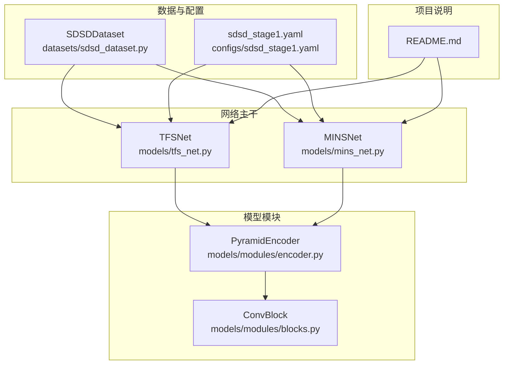
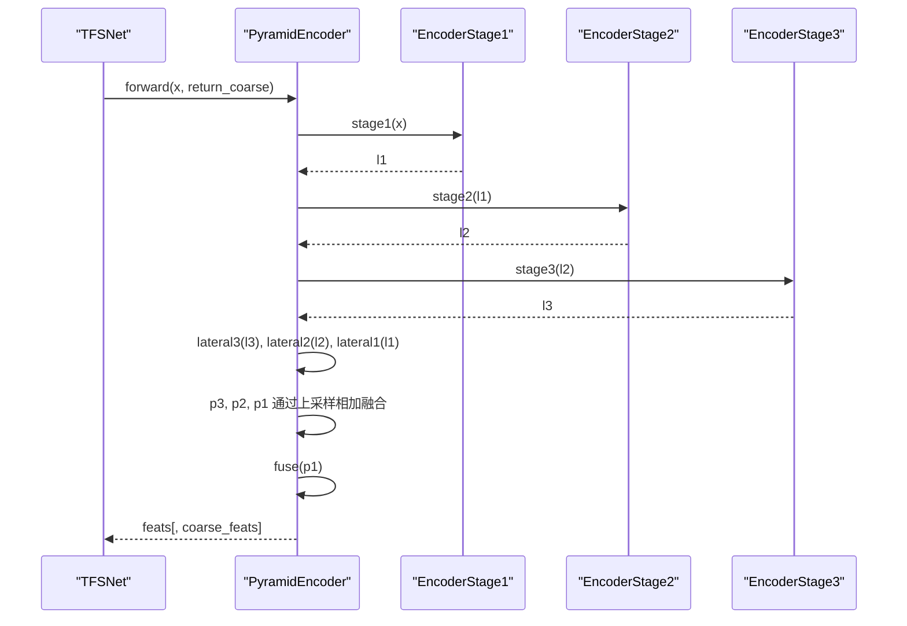
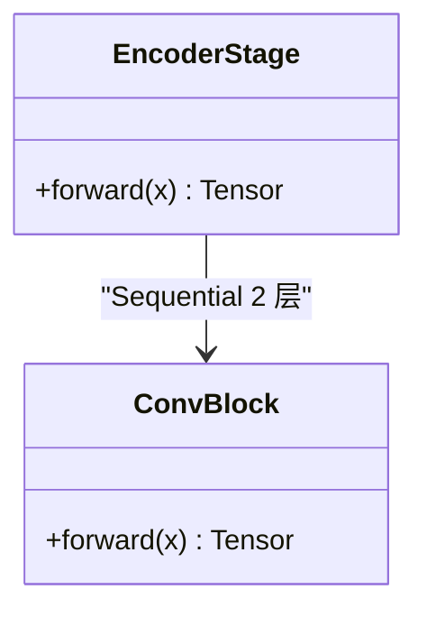
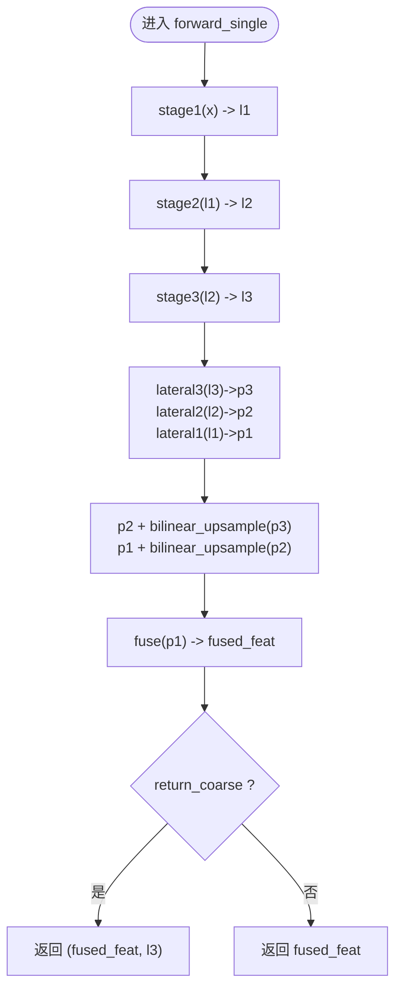
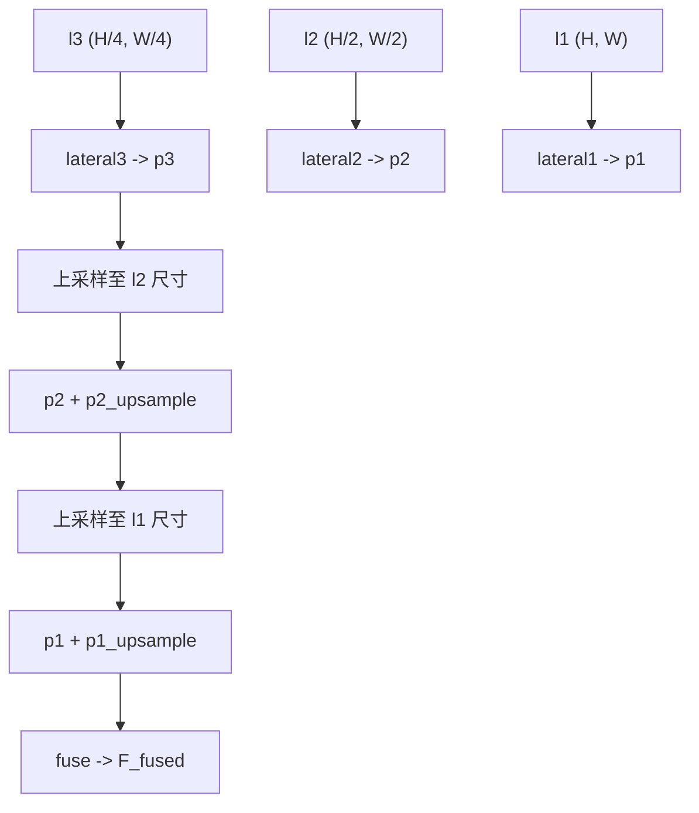
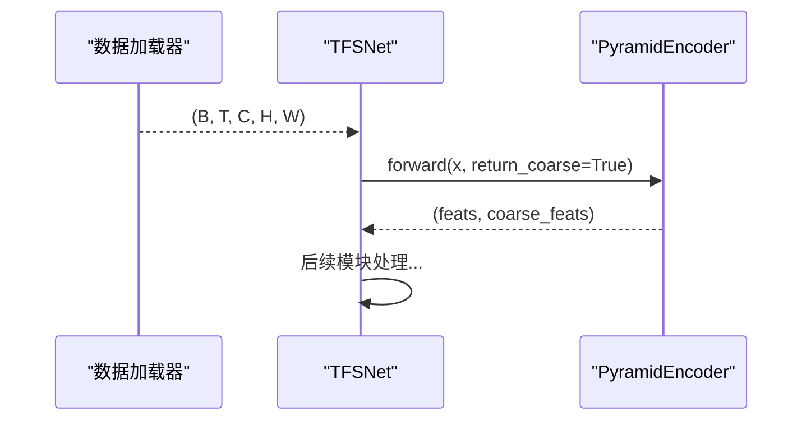
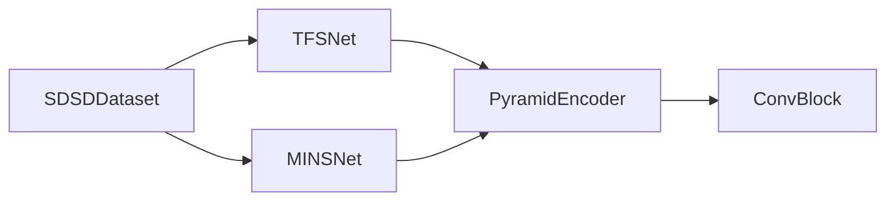

# 金字塔编码器(PyramidEncoder)

<cite>
**本文引用的文件列表**
- [encoder.py](file://models/modules/encoder.py)
- [blocks.py](file://models/modules/blocks.py)
- [tfs_net.py](file://models/tfs_net.py)
- [mins_net.py](file://models/mins_net.py)
- [sdsd_dataset.py](file://datasets/sdsd_dataset.py)
- [sdsd_stage1.yaml](file://configs/sdsd_stage1.yaml)
- [README.md](file://README.md)
</cite>

## 目录
1. [简介](#简介)
2. [项目结构](#项目结构)
3. [核心组件](#核心组件)
4. [架构总览](#架构总览)
5. [详细组件分析](#详细组件分析)
6. [依赖关系分析](#依赖关系分析)
7. [性能考量](#性能考量)
8. [故障排查指南](#故障排查指南)
9. [结论](#结论)
10. [附录](#附录)

## 简介
本技术文档围绕 PyTorch 实现的 PyramidEncoder 金字塔编码器展开，系统阐述其多尺度特征提取的实现原理、三个编码阶段的设计思路与通道配置、横向连接机制与特征融合过程，并解释 lateral 卷积与上采样融合的数学原理。文档还给出编码器的输入输出格式、参数配置选项、forward_single 与 forward 方法的区别，以及在 TFS-Net 中的使用方式与性能分析，帮助开发者在 TFS-Net 中正确使用该编码器模块。

## 项目结构
PyramidEncoder 位于模型模块目录下，作为 TFS-Net 的第一阶段共享特征提取器，负责从多帧序列中提取多尺度融合特征，并可选择性地返回最粗尺度特征以供后续模块使用。其主要文件组织如下：
- 模块层：models/modules/encoder.py（编码器主体）、models/modules/blocks.py（通用卷积块等基础组件）
- 网络层：models/tfs_net.py（TFS-Net 主干网络，集成编码器）、models/mins_net.py（MINS-Net 主干网络，集成编码器）
- 数据与配置：datasets/sdsd_dataset.py（时序窗口采样）、configs/sdsd_stage1.yaml（训练配置）
- 项目说明：README.md（快速开始与功能概览）

图表来源
- [encoder.py:1-102](file://models/modules/encoder.py#L1-L102)
- [blocks.py:1-110](file://models/modules/blocks.py#L1-L110)
- [tfs_net.py:1-181](file://models/tfs_net.py#L1-L181)
- [mins_net.py:1-67](file://models/mins_net.py#L1-L67)
- [sdsd_dataset.py:1-81](file://datasets/sdsd_dataset.py#L1-L81)
- [sdsd_stage1.yaml:1-34](file://configs/sdsd_stage1.yaml#L1-L34)
- [README.md:1-24](file://README.md#L1-L24)

章节来源
- [encoder.py:1-102](file://models/modules/encoder.py#L1-L102)
- [blocks.py:1-110](file://models/modules/blocks.py#L1-L110)
- [tfs_net.py:1-181](file://models/tfs_net.py#L1-L181)
- [mins_net.py:1-67](file://models/mins_net.py#L1-L67)
- [sdsd_dataset.py:1-81](file://datasets/sdsd_dataset.py#L1-L81)
- [sdsd_stage1.yaml:1-34](file://configs/sdsd_stage1.yaml#L1-L34)
- [README.md:1-24](file://README.md#L1-L24)

## 核心组件
- EncoderStage：单个编码阶段，由两个卷积块组成，支持可选步长进行下采样。
- PyramidEncoder：三层金字塔编码器，包含三个 EncoderStage，以及 lateral 卷积与上采样融合路径，最终输出融合特征；支持返回最粗尺度特征以供下游模块使用。

章节来源
- [encoder.py:23-50](file://models/modules/encoder.py#L23-L50)
- [encoder.py:35-102](file://models/modules/encoder.py#L35-L102)

## 架构总览
PyramidEncoder 在 TFS-Net 中作为 Stage 1 的共享特征提取器，接收多帧序列输入，输出融合特征与可选的最粗尺度特征。其内部通过三个编码阶段逐步降低分辨率并增加通道数，随后通过 lateral 卷积将不同尺度的特征映射到统一通道数，再经上采样与逐级相加完成横向连接与特征融合。

图表来源
- [tfs_net.py:100-122](file://models/tfs_net.py#L100-L122)
- [encoder.py:51-102](file://models/modules/encoder.py#L51-L102)

## 详细组件分析

### 组件一：EncoderStage（编码阶段）
- 设计要点
  - 采用两层卷积块堆叠，每层使用 3×3 卷积与 GELU 激活，保证非线性变换与特征提取能力。
  - 支持可变步长（stride），用于控制下采样倍率。
- 数据流
  - 输入：(B, Cin, H, W)
  - 输出：(B, Cout, H/stride, W/stride)
- 性能特性
  - 步长为 1 的阶段保持分辨率不变，仅改变通道数。
  - 步长为 2 的阶段进行二倍下采样，有效降低后续计算负担。

图表来源
- [encoder.py:23-33](file://models/modules/encoder.py#L23-L33)
- [blocks.py:8-18](file://models/modules/blocks.py#L8-L18)

章节来源
- [encoder.py:23-33](file://models/modules/encoder.py#L23-L33)
- [blocks.py:8-18](file://models/modules/blocks.py#L8-L18)

### 组件二：PyramidEncoder（金字塔编码器）
- 结构组成
  - 三个编码阶段：stage1、stage2、stage3，分别对应不同分辨率与通道数。
  - lateral 卷积：将各阶段输出映射到统一通道数（fused_channels）。
  - 上采样融合：通过双线性插值将高层特征上采样并与低层特征相加。
  - 融合卷积：对融合后的特征进行进一步卷积以稳定特征表示。
- 输入输出格式
  - 单帧 forward_single：
    - 输入：x ∈ (B, C_in, H, W)
    - 输出：fused_feat ∈ (B, C_f, H, W)，或 (fused_feat, coarse_feat) ∈ ((B, C_f, H, W), (B, c3, H/4, W/4)) 若开启 return_coarse
  - 多帧 forward：
    - 输入：x ∈ (B, T, C_in, H, W)
    - 输出：feats ∈ (B, T, C_f, H, W)，或 (feats, coarse_feats) ∈ ((B, T, C_f, H, W), (B, T, c3, H/4, W/4)) 若开启 return_coarse
- 参数配置
  - in_channels：输入通道数，默认 3（RGB 图像）
  - level_channels：各阶段通道数元组，默认 (32, 64, 96)
  - fused_channels：融合后通道数，默认 48
- 关键差异：forward_single 与 forward
  - forward_single：面向单帧图像，直接返回融合特征或（融合特征，最粗尺度特征）。
  - forward：面向多帧序列，将时间维展平后调用 forward_single，再按 (B, T, ...) 恢复形状。

图表来源
- [encoder.py:51-75](file://models/modules/encoder.py#L51-L75)

章节来源
- [encoder.py:35-102](file://models/modules/encoder.py#L35-L102)

### 组件三：横向连接与特征融合（lateral 卷积与上采样融合）
- lateral 卷积
  - 将不同尺度的特征映射到统一通道数（fused_channels），确保后续融合的维度一致性。
- 上采样融合
  - 采用双线性插值将高层特征上采样至低层尺寸，然后逐级相加，形成自顶向下的横向连接。
- 数学原理
  - 设第 l 层特征为 F_l，经过 1×1 卷积得到 P_l。
  - 第 l-1 层融合特征 P_{l-1} = Lateral_{l-1}(F_{l-1}) + Upsample(P_l)。
  - 最终融合特征 P_1 经过若干卷积后得到融合特征 F_fused。
- 优势
  - 保留高层语义信息的同时融合底层细节，提升多尺度表达能力。

图表来源
- [encoder.py:65-68](file://models/modules/encoder.py#L65-L68)

章节来源
- [encoder.py:43-49](file://models/modules/encoder.py#L43-L49)
- [encoder.py:65-68](file://models/modules/encoder.py#L65-L68)

### 组件四：在 TFS-Net 中的使用
- TFS-Net 主干网络
  - 将 PyramidEncoder 作为 Stage 1 的共享特征提取器，接收多帧序列输入，返回融合特征与可选的最粗尺度特征。
  - 后续阶段（TFSI、SACE、IFPN/NDPN/MRPN、IGRF）可利用这些特征进行时频源指示、源感知对应估计、光照/噪声/运动恢复与强度引导融合。
- 使用示例（概念性流程）
  - 准备输入：(B, T, C, H, W)，其中 T 为奇数且 ≥ 3。
  - 调用编码器：feats, coarse_feats = encoder(x, return_coarse=True)。
  - 传入后续模块：如 TFSI 使用 feats，IFPN 可结合 coarse_feats 与 s_illum 等。

图表来源
- [tfs_net.py:100-122](file://models/tfs_net.py#L100-L122)
- [encoder.py:76-102](file://models/modules/encoder.py#L76-L102)

章节来源
- [tfs_net.py:34-99](file://models/tfs_net.py#L34-L99)
- [tfs_net.py:100-122](file://models/tfs_net.py#L100-L122)

### 组件五：在 MINS-Net 中的使用
- MINS-Net 主干网络
  - 同样使用 PyramidEncoder 提取融合特征，随后进入 MINS、ISPN、MSPN 与重建模块，完成时域与频域的联合优化与重建。
- 适用场景
  - 适用于 SDSD（单日多帧去噪）任务，强调滑动窗口中心帧监督与多源特征融合。

章节来源
- [mins_net.py:11-67](file://models/mins_net.py#L11-L67)

## 依赖关系分析
- 内部依赖
  - PyramidEncoder 依赖 ConvBlock 实现卷积与激活。
- 外部依赖
  - TFS-Net 与 MINS-Net 将 PyramidEncoder 作为共享特征提取器，分别接入各自的后续模块。
  - SDSDDataset 提供多帧序列输入，遵循时序窗口约定（奇数窗口大小）。

图表来源
- [encoder.py:20](file://models/modules/encoder.py#L20)
- [blocks.py:8-18](file://models/modules/blocks.py#L8-L18)
- [tfs_net.py:29](file://models/tfs_net.py#L29)
- [mins_net.py:4](file://models/mins_net.py#L4)
- [sdsd_dataset.py:64-80](file://datasets/sdsd_dataset.py#L64-L80)

章节来源
- [encoder.py:20](file://models/modules/encoder.py#L20)
- [blocks.py:8-18](file://models/modules/blocks.py#L8-L18)
- [tfs_net.py:29](file://models/tfs_net.py#L29)
- [mins_net.py:4](file://models/mins_net.py#L4)
- [sdsd_dataset.py:64-80](file://datasets/sdsd_dataset.py#L64-L80)

## 性能考量
- 计算复杂度
  - 三层编码阶段分别进行下采样，显著降低特征分辨率，减少后续模块的计算开销。
  - lateral 卷积与上采样融合均为轻量操作，整体融合路径计算成本可控。
- 存储与内存
  - fused_channels 控制融合后通道数，建议根据下游模块的通道需求与显存限制合理设置。
- 时序效率
  - forward 对多帧序列的处理通过展平与重塑实现，避免循环遍历，提升批处理效率。
- 训练稳定性
  - GELU 激活与卷积块组合有助于稳定梯度传播，适合长时间序列训练。

[本节为通用性能讨论，无需特定文件引用]

## 故障排查指南
- 输入维度错误
  - 确保输入张量维度为 (B, T, C, H, W)，且 T 为奇数且 ≥ 3。
  - 参考：[tfs_net.py:115-118](file://models/tfs_net.py#L115-L118)
- 分辨率与通道不匹配
  - 确认 level_channels 与 fused_channels 设置合理，避免 lateral 卷积或上采样出现维度不一致。
  - 参考：[encoder.py:36-49](file://models/modules/encoder.py#L36-L49)
- 返回特征缺失
  - 若下游模块需要最粗尺度特征，请在调用编码器时启用 return_coarse=True。
  - 参考：[encoder.py:70-74](file://models/modules/encoder.py#L70-L74)
- 数据加载时序窗口
  - SDSDDataset 会根据 window_size 构建时序窗口，确保输入序列长度满足要求。
  - 参考：[sdsd_dataset.py:18-51](file://datasets/sdsd_dataset.py#L18-L51)

章节来源
- [tfs_net.py:115-118](file://models/tfs_net.py#L115-L118)
- [encoder.py:36-49](file://models/modules/encoder.py#L36-L49)
- [encoder.py:70-74](file://models/modules/encoder.py#L70-L74)
- [sdsd_dataset.py:18-51](file://datasets/sdsd_dataset.py#L18-L51)

## 结论
PyramidEncoder 通过三层编码阶段与横向连接融合，实现了从多帧序列中提取多尺度融合特征的目标。其 lateral 卷积与上采样融合机制在保留高层语义的同时融合底层细节，具备良好的表达能力与较低的计算成本。在 TFS-Net 中，编码器作为 Stage 1 的共享特征提取器，为后续时频源指示、源感知对应估计与强度引导融合提供了高质量特征基础。开发者可根据下游模块的需求调整通道配置与是否返回最粗尺度特征，以获得最佳性能与效果。

[本节为总结性内容，无需特定文件引用]

## 附录
- 快速开始
  - 安装依赖并运行训练脚本，参考 README 的快速开始说明。
  - 参考：[README.md:12-24](file://README.md#L12-L24)
- 配置示例
  - sdsd_stage1.yaml 提供了 in_channels、level_channels、fused_channels 等关键参数的默认值，便于快速启动。
  - 参考：[sdsd_stage1.yaml:11-14](file://configs/sdsd_stage1.yaml#L11-L14)

章节来源
- [README.md:12-24](file://README.md#L12-L24)
- [sdsd_stage1.yaml:11-14](file://configs/sdsd_stage1.yaml#L11-L14)