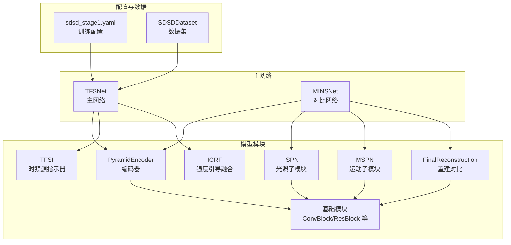
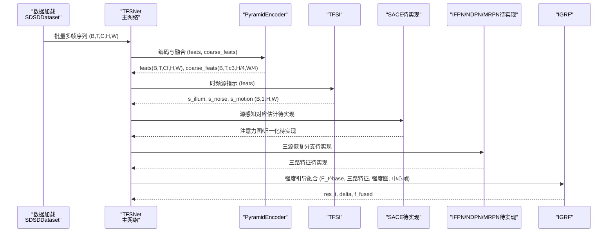
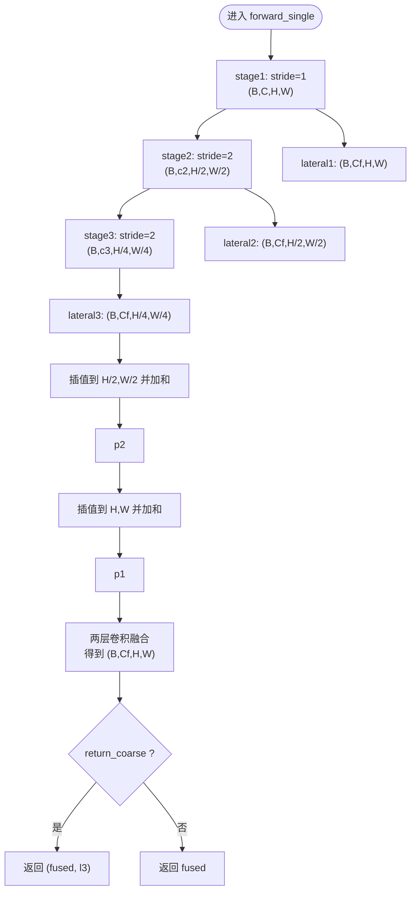
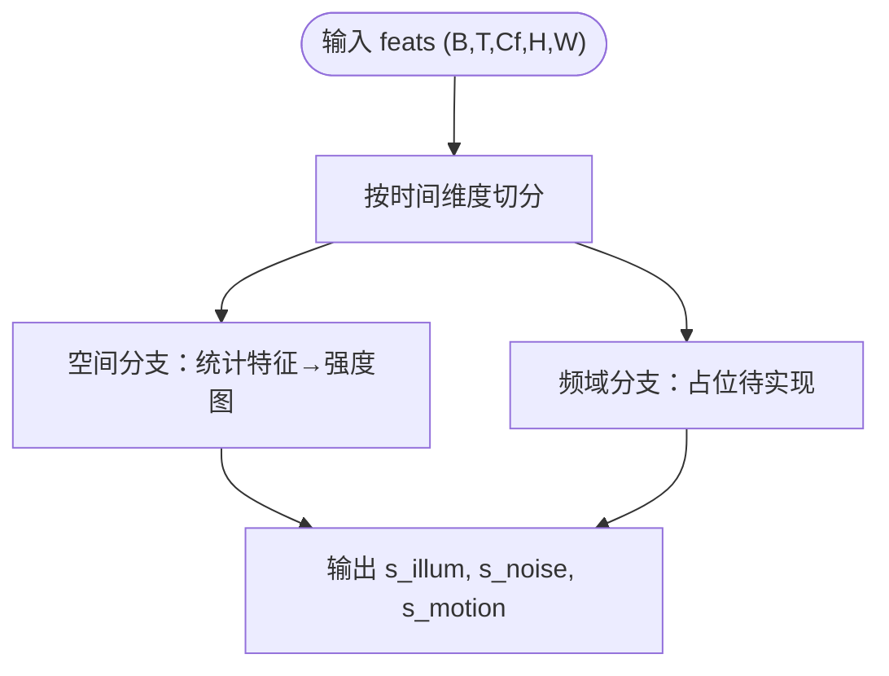
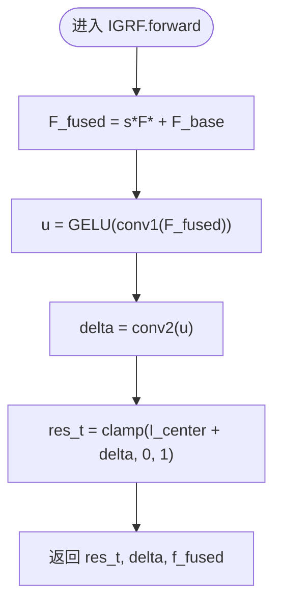
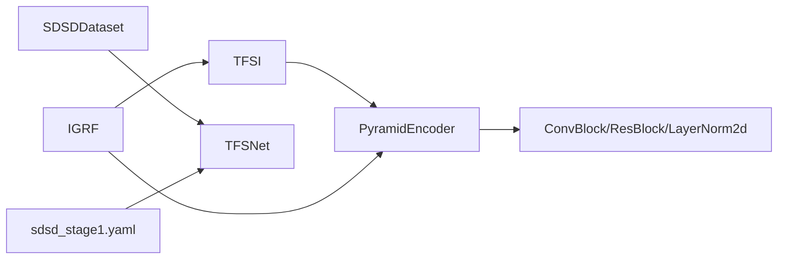

# 阶段模块详解

<cite>
**本文引用的文件**
- [models/modules/encoder.py](file://models/modules/encoder.py)
- [models/modules/igrf.py](file://models/modules/igrf.py)
- [models/modules/ispn.py](file://models/modules/ispn.py)
- [models/modules/mspn.py](file://models/modules/mspn.py)
- [models/modules/blocks.py](file://models/modules/blocks.py)
- [models/modules/reconstruction.py](file://models/modules/reconstruction.py)
- [models/tfs_net.py](file://models/tfs_net.py)
- [models/mins_net.py](file://models/mins_net.py)
- [models/modules/__init__.py](file://models/modules/__init__.py)
- [configs/sdsd_stage1.yaml](file://configs/sdsd_stage1.yaml)
- [datasets/sdsd_dataset.py](file://datasets/sdsd_dataset.py)
- [v3quest.md](file://v3quest.md)
</cite>

## 目录
1. [引言](#引言)
2. [项目结构](#项目结构)
3. [核心组件](#核心组件)
4. [架构总览](#架构总览)
5. [详细组件分析](#详细组件分析)
6. [依赖分析](#依赖分析)
7. [性能考虑](#性能考虑)
8. [故障排查指南](#故障排查指南)
9. [结论](#结论)
10. [附录](#附录)

## 引言
本文件面向开发者，系统性解析 TFS-Net v3 的“阶段模块”实现，重点覆盖：
- 编码器（PyramidEncoder）：多尺度金字塔特征提取与融合
- 时频源指示器（TFSI）：空间与频域分支的时频源强度估计（当前空间分支已实现，频域分支占位）
- 强度引导融合（IGRF）：三分支加权融合与重建
- 与之相关的中间模块：ISPN、MSPN、FinalReconstruction、基础构建块（ConvBlock/ResBlock 等）

文档从输入输出、内部计算逻辑、参数配置、模块间接口与数据流等方面进行说明，并结合 v3 设计文档与实现现状，帮助开发者理解当前实现与后续扩展点。

## 项目结构
围绕“阶段模块”的关键文件组织如下：
- 编码器与基础模块：models/modules/encoder.py、blocks.py
- 时频源指示器：models/modules/tfsi.py（由 tfs_net.py 引入）
- 强度引导融合：models/modules/igrf.py
- 对比参考（MINSNet）：models/mins_net.py
- 模块导出：models/modules/__init__.py
- 训练配置：configs/sdsd_stage1.yaml
- 数据集与采样：datasets/sdsd_dataset.py
- 设计与待澄清事项：v3quest.md

图表来源
- [models/tfs_net.py:34-98](file://models/tfs_net.py#L34-L98)
- [models/mins_net.py:11-18](file://models/mins_net.py#L11-L18)
- [models/modules/encoder.py:35-102](file://models/modules/encoder.py#L35-L102)
- [models/modules/igrf.py:27-89](file://models/modules/igrf.py#L27-L89)
- [models/modules/ispn.py:7-26](file://models/modules/ispn.py#L7-L26)
- [models/modules/mspn.py:7-41](file://models/modules/mspn.py#L7-L41)
- [models/modules/reconstruction.py:5-24](file://models/modules/reconstruction.py#L5-L24)
- [models/modules/blocks.py:8-110](file://models/modules/blocks.py#L8-L110)
- [configs/sdsd_stage1.yaml:11-34](file://configs/sdsd_stage1.yaml#L11-L34)
- [datasets/sdsd_dataset.py:18-81](file://datasets/sdsd_dataset.py#L18-L81)

章节来源
- [models/tfs_net.py:1-181](file://models/tfs_net.py#L1-L181)
- [models/mins_net.py:1-67](file://models/mins_net.py#L1-L67)
- [models/modules/__init__.py:1-10](file://models/modules/__init__.py#L1-L10)
- [configs/sdsd_stage1.yaml:1-34](file://configs/sdsd_stage1.yaml#L1-L34)
- [datasets/sdsd_dataset.py:1-81](file://datasets/sdsd_dataset.py#L1-L81)

## 核心组件
本节聚焦于五个阶段模块的职责、输入输出与内部流程要点。

- 编码器（PyramidEncoder）
  - 职责：对多帧输入执行共享金字塔编码，生成融合特征与可选的最粗尺度特征，用于后续时频源估计与融合。
  - 关键参数：in_channels、level_channels、fused_channels
  - 返回：单帧或批量帧的融合特征；当启用 return_coarse=True 时，额外返回最粗尺度特征（用于 IFPN 双流）
  - 接口：forward(x, return_coarse=False)；forward_single(x, return_coarse=False)

- 时频源指示器（TFSI）
  - 职责：估计三类时频源强度图（光照、噪声、运动），作为 IGRF 的加权因子。
  - 当前状态：空间分支已实现（SpatialBranch），频域分支占位（等待 LFF 实现细节与参考）
  - 输入：编码器融合特征序列（B, T, C_f, H, W）
  - 输出：s_illum、s_noise、s_motion（均为 (B, 1, H, W)）

- 强度引导融合（IGRF）
  - 职责：以强度权重融合三路特征与基础特征，经两层卷积重建增强帧。
  - 输入：F_t^base（当前假设为编码器融合特征）、三路特征、三类强度图、中心帧图像
  - 输出：增强帧、残差修正量、融合特征（便于调试/可视化）

- 对比参考（ISPN、MSPN、FinalReconstruction）
  - ISPN：基于余弦相似的注意力分配，生成光照细化特征
  - MSPN：窗口化邻域聚合与门控融合，生成运动细化特征
  - FinalReconstruction：早期重建思路（MINSNet），与 IGRF 的思路不同

章节来源
- [models/modules/encoder.py:35-102](file://models/modules/encoder.py#L35-L102)
- [models/modules/igrf.py:27-89](file://models/modules/igrf.py#L27-L89)
- [models/modules/ispn.py:7-26](file://models/modules/ispn.py#L7-L26)
- [models/modules/mspn.py:7-41](file://models/modules/mspn.py#L7-L41)
- [models/modules/reconstruction.py:5-24](file://models/modules/reconstruction.py#L5-L24)
- [models/tfs_net.py:34-98](file://models/tfs_net.py#L34-L98)

## 架构总览
TFS-Net v3 的五阶段数据流如下：
- Stage 1：PyramidEncoder（共享编码 + 融合 + 可选最粗尺度特征）
- Stage 2：TFSI（时频源指示，估计光照/噪声/运动强度）
- Stage 3：SACE（源感知对应估计，待实现）
- Stage 4：IFPN/NDPN/MRPN（三源恢复分支，待实现）
- Stage 5：IGRF（强度引导融合与重建）

图表来源
- [models/tfs_net.py:100-181](file://models/tfs_net.py#L100-L181)
- [models/modules/encoder.py:76-102](file://models/modules/encoder.py#L76-L102)
- [models/modules/igrf.py:56-89](file://models/modules/igrf.py#L56-L89)
- [datasets/sdsd_dataset.py:64-81](file://datasets/sdsd_dataset.py#L64-L81)

章节来源
- [models/tfs_net.py:1-181](file://models/tfs_net.py#L1-L181)
- [datasets/sdsd_dataset.py:1-81](file://datasets/sdsd_dataset.py#L1-L81)

## 详细组件分析

### 编码器（PyramidEncoder）
- 结构与流程
  - 三个编码阶段（stride=1/2/2），逐级降采样
  - 三层横向投影（lateral conv 1×1）至统一通道数
  - 双线性插值上采样融合，最终经两层卷积得到融合特征
  - 支持返回最粗尺度特征（用于 IFPN 双流），保持与 v1 MINSNet 的接口兼容（可选）

- 输入输出
  - 单帧 forward_single：输入 (B, C, H, W)，输出 (B, C_f, H, W)；开启 return_coarse 时额外输出 (B, c3, H/4, W/4)
  - 批量 forward：输入 (B, T, C, H, W)，输出 (B, T, C_f, H, W)；开启 return_coarse 时额外输出 (B, T, c3, H/4, W/4)

- 关键参数
  - level_channels：各级通道数 (c1, c2, c3)
  - fused_channels：融合后通道数 C_f
  - return_coarse：是否返回最粗尺度特征

- 设计考量
  - 金字塔结构兼顾局部细节与全局上下文
  - lateral 投影与双线性插值融合保证多尺度信息整合
  - return_coarse 为后续 IFPN 提供更粗粒度特征，提升鲁棒性

图表来源
- [models/modules/encoder.py:51-74](file://models/modules/encoder.py#L51-L74)

章节来源
- [models/modules/encoder.py:35-102](file://models/modules/encoder.py#L35-L102)

### 时频源指示器（TFSI）
- 结构与流程
  - 空间分支：基于窗口统计（中位数、方差）与归一化组合，输出光照/噪声/运动强度图
  - 频域分支：占位，等待 LFF（可学习频率滤波）实现细节与 FRBNet 参考
  - 输出：s_illum、s_noise、s_motion（(B, 1, H, W)）

- 输入输出
  - 输入：编码器融合特征序列 (B, T, C_f, H, W)
  - 输出：字典，包含三类强度图

- 设计考量
  - 将时域与频域信息解耦，分别估计源强度，提升融合灵活性
  - 频域分支依赖 LFF 的具体实现细节（RBF 参数、FFT 处理方式、跨帧聚合策略等）

图表来源
- [models/tfs_net.py:124-129](file://models/tfs_net.py#L124-L129)
- [v3quest.md:12-49](file://v3quest.md#L12-L49)

章节来源
- [models/tfs_net.py:100-139](file://models/tfs_net.py#L100-L139)
- [v3quest.md:12-49](file://v3quest.md#L12-L49)

### 强度引导融合（IGRF）
- 结构与流程
  - 强度加权融合：F_fused = s_illum·F_illum + s_noise·F_noise + s_motion·F_motion + F_base
  - 两层卷积映射到残差修正 delta，增强帧 res_t = clamp(I_center + delta, 0, 1)
  - 输出：增强帧、残差修正量、融合特征（便于可视化/调试）

- 输入输出
  - 输入：F_t^base、三路特征、三类强度图、中心帧图像
  - 输出：res_t、delta、f_fused

- 设计考量
  - F_t^base 的假设（当前为编码器融合特征）需在后续设计中明确
  - 通过 GELU 与卷积核实现非线性映射，确保数值稳定与边界约束

图表来源
- [models/modules/igrf.py:56-89](file://models/modules/igrf.py#L56-L89)

章节来源
- [models/modules/igrf.py:27-89](file://models/modules/igrf.py#L27-L89)
- [models/tfs_net.py:159-180](file://models/tfs_net.py#L159-L180)

### 对比参考：ISPN、MSPN、FinalReconstruction
- ISPN
  - 通过余弦相似计算注意力权重，对共享表征进行归一化与细化
  - 输出：注意力权重、共享表征、细化特征

- MSPN
  - 将邻域特征按相关性窗口化聚合，经门控融合与残差细化
  - 输出：对齐后的邻域特征、融合特征、细化特征

- FinalReconstruction（MINSNet）
  - 早期重建思路：对两类细化特征按先验权重融合，再经卷积与裁剪得到增强帧
  - 与 IGRF 的差异：IGRF 采用强度引导的加权融合，且引入基础特征

章节来源
- [models/modules/ispn.py:7-26](file://models/modules/ispn.py#L7-L26)
- [models/modules/mspn.py:7-41](file://models/modules/mspn.py#L7-L41)
- [models/modules/reconstruction.py:5-24](file://models/modules/reconstruction.py#L5-L24)
- [models/mins_net.py:20-67](file://models/mins_net.py#L20-L67)

## 依赖分析
- 组件内聚与耦合
  - 编码器与基础模块（ConvBlock/ResBlock/LayerNorm2d/窗口操作）内聚度高，耦合主要体现在形状约定与通道数
  - TFSI 依赖编码器输出的统一通道数（C_f），并与后续模块（IFPN/NDPN/MRPN/IGRF）形成接口契约
  - IGRF 依赖三路特征与强度图，接口清晰，便于替换/扩展

- 外部依赖与集成点
  - 数据集：SDSDDataset 提供多帧窗口采样与中心帧对齐
  - 训练配置：sdsd_stage1.yaml 控制通道数、窗口大小、损失权重等

图表来源
- [models/modules/encoder.py:20-29](file://models/modules/encoder.py#L20-L29)
- [models/modules/blocks.py:8-110](file://models/modules/blocks.py#L8-L110)
- [models/tfs_net.py:62-98](file://models/tfs_net.py#L62-L98)
- [datasets/sdsd_dataset.py:18-81](file://datasets/sdsd_dataset.py#L18-L81)
- [configs/sdsd_stage1.yaml:11-34](file://configs/sdsd_stage1.yaml#L11-L34)

章节来源
- [models/modules/__init__.py:1-10](file://models/modules/__init__.py#L1-L10)
- [models/tfs_net.py:1-181](file://models/tfs_net.py#L1-L181)
- [datasets/sdsd_dataset.py:1-81](file://datasets/sdsd_dataset.py#L1-L81)
- [configs/sdsd_stage1.yaml:1-34](file://configs/sdsd_stage1.yaml#L1-L34)

## 性能考虑
- 计算复杂度
  - 编码器：三次卷积 + 两次下采样，近似 O(T·Cf·H·W) 的融合成本
  - TFSI：空间分支涉及窗口统计与归一化，复杂度与窗口大小相关
  - IGRF：两层卷积与逐点乘法，开销可控

- 内存与显存
  - 多帧序列批处理会放大内存占用，建议合理设置批次与分辨率
  - 窗口化操作（如 MSPN）需要填充与反填充，注意 pad/trim 的开销

- 优化建议
  - 在编码器与融合阶段统一通道数，减少后续卷积与内存搬运
  - 对大窗口场景，优先使用窗口化实现（如 MSPN 的窗口化聚合）
  - 使用 AMP（混合精度）训练（配置中提供开关）

## 故障排查指南
- 形状不匹配
  - 确认编码器输出通道数与 TFSI/IGRF 的期望一致（fused_channels）
  - 多帧窗口必须为奇数且≥3，否则断言失败

- 强度图异常
  - 若 s_illum/s_noise/s_motion 出现 NaN/Inf，检查 TFSI 输出与 IGRF 输入的张量范围
  - 确保中心帧图像与特征在同一空间分辨率上

- 最粗尺度特征缺失
  - 若 IFPN 双流需要使用最粗尺度特征，调用编码器时启用 return_coarse=True

- 频域分支未实现
  - TFSI 频域分支目前占位，无法直接使用；请等待 LFF 实现后再接入

章节来源
- [models/tfs_net.py:115-117](file://models/tfs_net.py#L115-L117)
- [models/modules/encoder.py:76-102](file://models/modules/encoder.py#L76-L102)
- [v3quest.md:12-49](file://v3quest.md#L12-L49)

## 结论
TFS-Net v3 的阶段模块以编码器为起点，通过 TFSI 估计时频源强度，再由 IGRF 进行强度引导融合与重建。当前实现中，编码器与 IGRF 已具备可用接口，TFSI 的空间分支已实现、频域分支占位，SACE/IFPN/NDPN/MRPN 仍待实现。开发者应重点关注：
- 明确 F_t^base 的定义与来源
- 补齐 TFSI 频域分支与 SACE 的实现细节
- 逐步替换 MINSNet 的 ISPN/MSPN/FinalReconstruction 为 TFS-Net 的新模块族

## 附录
- 关键参数速查
  - 编码器：level_channels、fused_channels、return_coarse
  - TFSI：channels、fused_channels、eps
  - IGRF：channels、out_channels
  - 数据集：window_size、crop_size
  - 训练：batch_size、epochs、lr、weight_decay、loss 权重

- 参考文件
  - v3 设计与待澄清事项：v3quest.md
  - 训练配置：configs/sdsd_stage1.yaml
  - 数据集采样：datasets/sdsd_dataset.py
  - 模块导出：models/modules/__init__.py

章节来源
- [configs/sdsd_stage1.yaml:11-34](file://configs/sdsd_stage1.yaml#L11-L34)
- [datasets/sdsd_dataset.py:18-81](file://datasets/sdsd_dataset.py#L18-L81)
- [models/modules/__init__.py:1-10](file://models/modules/__init__.py#L1-L10)
- [v3quest.md:251-276](file://v3quest.md#L251-L276)