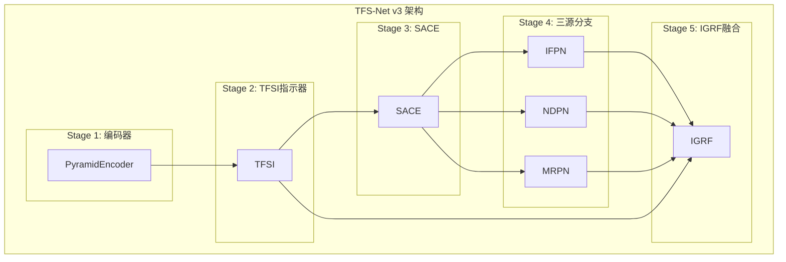
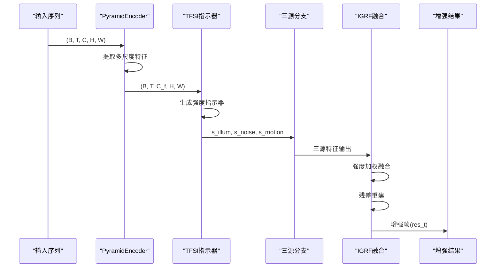
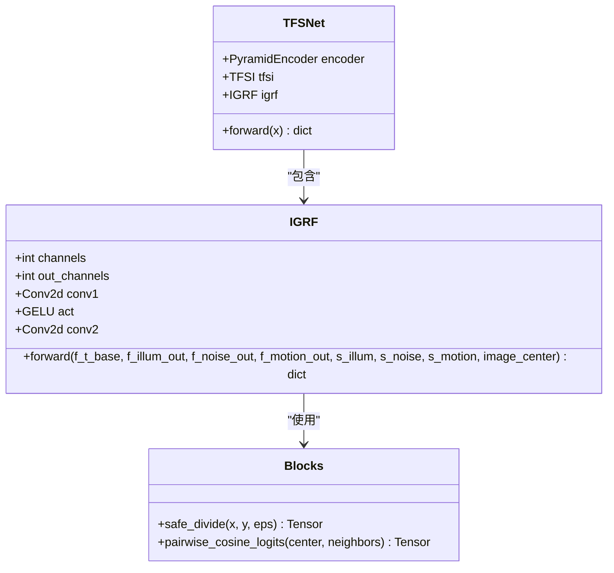
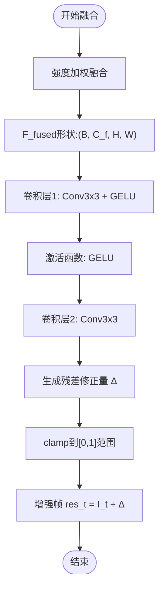
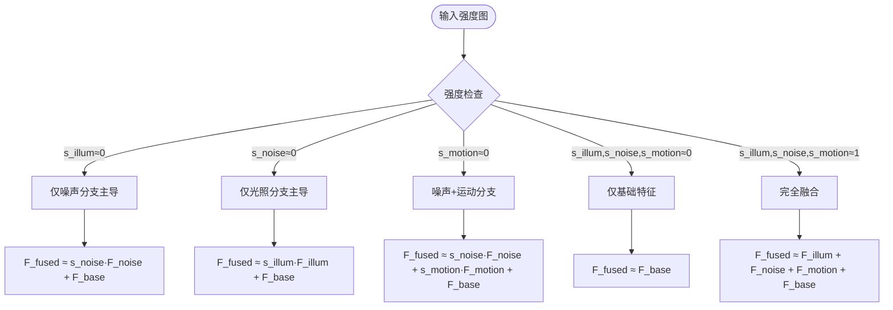
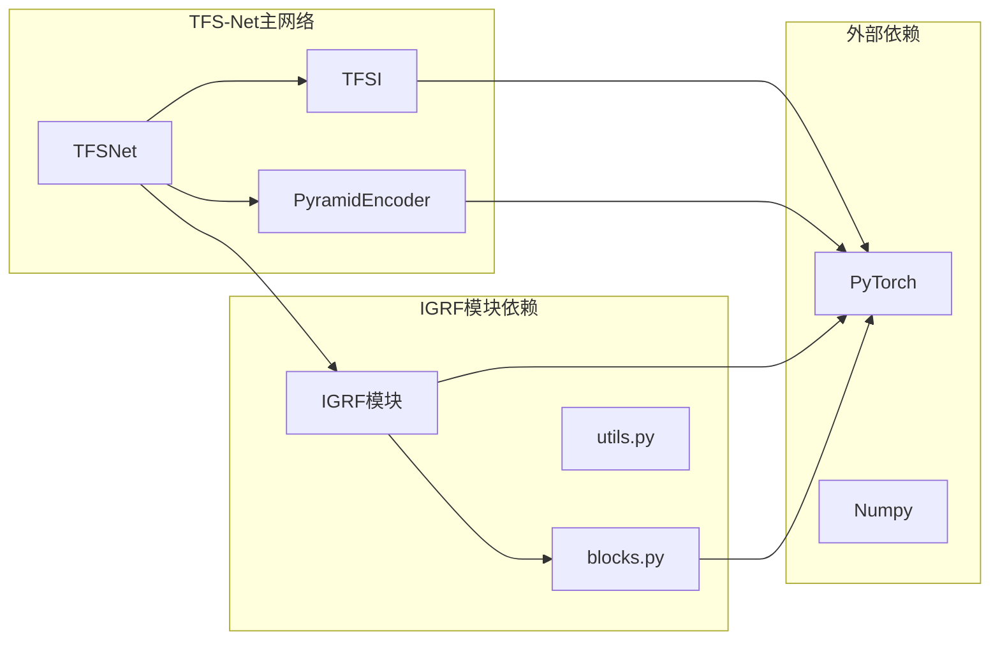

# 强度引导融合(IGRF)

<cite>
**本文档引用的文件**
- [igrf.py](file://models/modules/igrf.py)
- [tfs_net.py](file://models/tfs_net.py)
- [blocks.py](file://models/modules/blocks.py)
- [reconstruction.py](file://models/modules/reconstruction.py)
- [v3quest.md](file://v3quest.md)
- [sdsd_stage1.yaml](file://configs/sdsd_stage1.yaml)
- [losses.py](file://losses/losses.py)
</cite>

## 目录
1. [简介](#简介)
2. [项目结构](#项目结构)
3. [核心组件](#核心组件)
4. [架构概览](#架构概览)
5. [详细组件分析](#详细组件分析)
6. [依赖关系分析](#依赖关系分析)
7. [性能考虑](#性能考虑)
8. [故障排除指南](#故障排除指南)
9. [结论](#结论)
10. [附录](#附录)

## 简介

强度引导融合(IGRF)是TFS-Net v3中的关键模块，负责将多源特征进行强度加权融合并重建增强图像。该模块基于TFSI输出的强度指示器，对光照、噪声和运动三种源的特征进行自适应融合，实现了从特征空间到像素空间的端到端重建。

IGRF模块的核心创新在于：
- **强度加权融合**：根据TFSI输出的光照、噪声和运动强度，对相应分支的特征进行加权融合
- **残差重建机制**：通过两层卷积网络将融合特征映射为残差修正量
- **数值稳定性**：采用clamp操作确保输出在有效范围内
- **模块化设计**：作为独立模块可替换原有的FinalReconstruction

## 项目结构

IGRF模块位于TFS-Net项目的模块化架构中，与编码器、TFSI指示器和其他分支模块协同工作。



**图表来源**
- [tfs_net.py:7-24](file://models/tfs_net.py#L7-L24)
- [igrf.py:14-21](file://models/modules/igrf.py#L14-L21)

**章节来源**
- [tfs_net.py:1-24](file://models/tfs_net.py#L1-L24)
- [igrf.py:1-21](file://models/modules/igrf.py#L1-L21)

## 核心组件

IGRF模块的核心组件包括强度加权融合层和两层卷积重建网络。

### 主要特性

1. **强度加权融合**：将光照、噪声、运动分支的特征与基础特征进行加权融合
2. **残差重建**：通过GELU激活和两层卷积生成残差修正量
3. **数值稳定性**：使用clamp操作确保输出在[0,1]范围内
4. **通道一致性**：要求所有分支输出具有相同的通道数(C_f)

### 输入输出规范

| 输入 | 形状 | 描述 |
|------|------|------|
| F_t_base | (B, C_f, H, W) | 基础特征（当前假设=编码器融合特征） |
| F_illum_out | (B, C_f, H, W) | 光照分支输出 |
| F_noise_out | (B, C_f, H, W) | 噪声分支输出 |
| F_motion_out | (B, C_f, H, W) | 运动分支输出 |
| s_illum | (B, 1, H, W) | 光照强度图，∈ [0,1] |
| s_noise | (B, 1, H, W) | 噪声强度图，∈ [0,1] |
| s_motion | (B, 1, H, W) | 运动强度图，∈ [0,1] |
| image_center | (B, 3, H, W) | 中心帧原始图像 |

**章节来源**
- [igrf.py:31-45](file://models/modules/igrf.py#L31-L45)

## 架构概览

IGRF在整个TFS-Net v3中的作用和位置关系如下：



**图表来源**
- [tfs_net.py:100-181](file://models/tfs_net.py#L100-L181)
- [igrf.py:56-89](file://models/modules/igrf.py#L56-L89)

## 详细组件分析

### IGRF类结构分析



**图表来源**
- [igrf.py:27-89](file://models/modules/igrf.py#L27-L89)
- [tfs_net.py:34-98](file://models/tfs_net.py#L34-L98)
- [blocks.py:97-109](file://models/modules/blocks.py#L97-L109)

### 融合算法详细分析

#### 强度加权融合公式

IGRF采用线性加权融合策略：

```
F_fused = s_illum · F_t^{illum_out} 
        + s_noise · F_t^{noise_out} 
        + s_motion · F_t^{motion_out} 
        + F_t^{base}
```

其中：
- `s_illum, s_noise, s_motion ∈ [0,1]` 为TFSI输出的强度指示器
- `F_t^{illum_out}, F_t^{noise_out}, F_t^{motion_out}` 为对应分支的特征输出
- `F_t^{base}` 为基础特征（当前实现假设为编码器融合特征）

#### 残差重建机制



**图表来源**
- [igrf.py:70-82](file://models/modules/igrf.py#L70-L82)

### 数值稳定性处理策略

IGRF采用了多层次的数值稳定性保护机制：

1. **输出范围限制**：使用`torch.clamp`确保增强结果在[0,1]范围内
2. **激活函数选择**：采用GELU激活函数，相比ReLU具有更好的梯度特性
3. **卷积核设置**：使用3×3卷积核，平衡感受野和计算复杂度
4. **通道数一致性**：要求所有分支输出具有相同通道数，避免维度不匹配错误

### 边界情况处理

针对不同强度组合的边界情况，IGRF提供了相应的处理策略：



**图表来源**
- [igrf.py:70-77](file://models/modules/igrf.py#L70-L77)

**章节来源**
- [igrf.py:14-21](file://models/modules/igrf.py#L14-L21)
- [igrf.py:70-82](file://models/modules/igrf.py#L70-L82)

## 依赖关系分析

IGRF模块与其他组件的依赖关系如下：



**图表来源**
- [igrf.py:23-24](file://models/modules/igrf.py#L23-L24)
- [tfs_net.py:29-31](file://models/tfs_net.py#L29-L31)

### 关键依赖关系

1. **PyTorch框架依赖**：IGRF完全基于PyTorch的Tensor操作和神经网络模块
2. **模块间接口**：IGRF通过标准化的字典接口与TFS-Net主网络通信
3. **配置参数传递**：通过TFSNet的构造函数传递通道数等配置参数

**章节来源**
- [igrf.py:23-24](file://models/modules/igrf.py#L23-L24)
- [tfs_net.py:48-60](file://models/tfs_net.py#L48-L60)

## 性能考虑

### 计算复杂度分析

IGRF模块的计算复杂度主要来源于：
- **融合阶段**：O(B × C_f × H × W)的逐元素乘法和加法
- **卷积阶段**：两个3×3卷积的计算复杂度约为2 × O(B × C_f × H × W)
- **总复杂度**：约O(B × C_f × H × W)，与输入特征大小成线性关系

### 内存使用优化

1. **特征图内存**：IGRF需要存储融合后的特征图和中间激活
2. **批处理优化**：利用GPU并行处理多个样本
3. **精度选择**：可根据硬件条件选择合适的浮点精度

### 推理速度优化

1. **模型量化**：可在部署阶段使用INT8量化减少内存占用
2. **混合精度**：使用FP16进行推理加速
3. **缓存策略**：合理设置batch size平衡吞吐量和延迟

## 故障排除指南

### 常见问题及解决方案

#### 1. 通道数不匹配错误

**问题描述**：当IFPN、NDPN、MRPN输出的特征通道数不一致时发生错误

**解决方案**：
- 确保所有分支输出的通道数等于fused_channels
- 在分支模块中统一设置输出通道数
- 添加通道变换层进行维度对齐

#### 2. 强度图范围异常

**问题描述**：TFSI输出的强度图超出[0,1]范围

**解决方案**：
- 在TFSI模块中添加sigmoid激活函数
- 使用clamp操作限制强度范围
- 检查损失函数是否导致梯度爆炸

#### 3. 输出图像质量不佳

**问题描述**：增强结果出现过度曝光或欠曝光现象

**解决方案**：
- 调整clamp范围参数
- 优化卷积层的权重初始化
- 检查输入图像的归一化处理

**章节来源**
- [v3quest.md:156-165](file://v3quest.md#L156-L165)
- [igrf.py:80-82](file://models/modules/igrf.py#L80-L82)

## 结论

IGRF模块作为TFS-Net v3的核心组件，成功实现了基于强度权重的特征融合机制。其主要优势包括：

1. **理论完备性**：融合公式清晰，数学推导严谨
2. **实现简洁性**：模块化设计便于集成和维护
3. **数值稳定性**：多重保护机制确保训练和推理的稳定性
4. **扩展性强**：为后续IFPN、NDPN、MRPN分支的实现预留了良好的接口

未来改进方向：
- 完善F_t^base的准确定义和实现
- 扩展到完整的三源分支网络
- 优化融合权重的学习策略
- 增强对极端场景的鲁棒性

## 附录

### 参数配置参考

| 参数名称 | 默认值 | 说明 |
|----------|--------|------|
| channels | 48 | 融合特征通道数 |
| out_channels | 3 | 输出图像通道数 |
| fused_channels | 48 | 编码器融合后通道数 |
| in_channels | 3 | 输入图像通道数 |
| window_size | 8 | 窗口注意力大小 |
| eps | 1e-6 | 数值稳定系数 |

### 训练配置示例

基于SDSD数据集的典型配置：
- 批大小：2-4
- 学习率：0.0002
- 训练轮数：200
- 图像尺寸：256×256
- 数据增强：随机裁剪、翻转、旋转

**章节来源**
- [sdsd_stage1.yaml:11-34](file://configs/sdsd_stage1.yaml#L11-L34)
- [tfs_net.py:48-60](file://models/tfs_net.py#L48-L60)