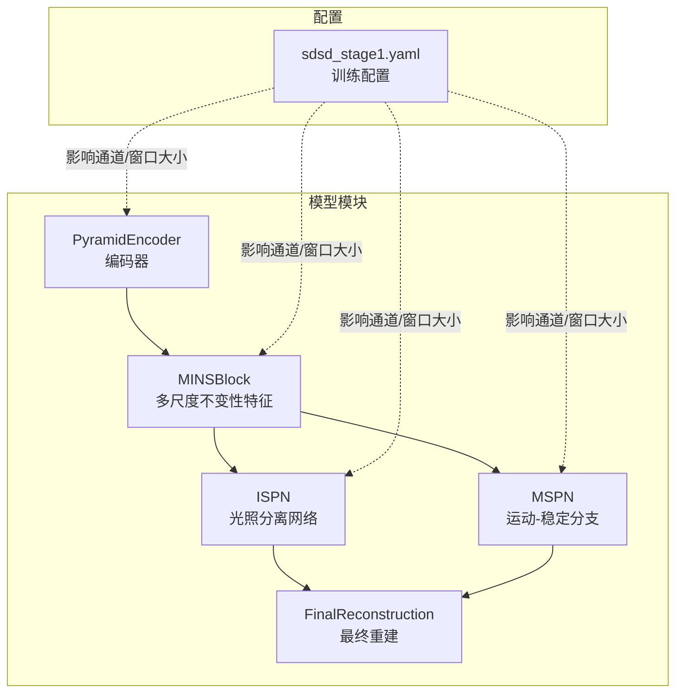
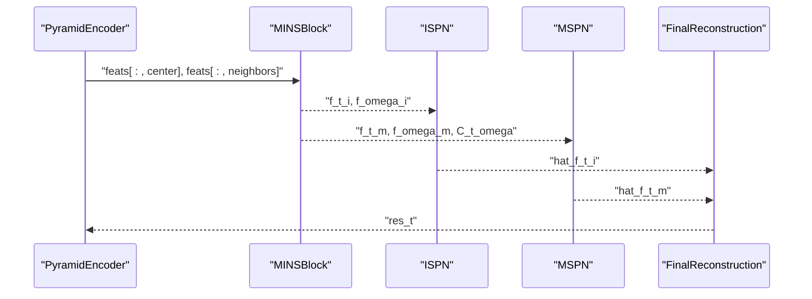
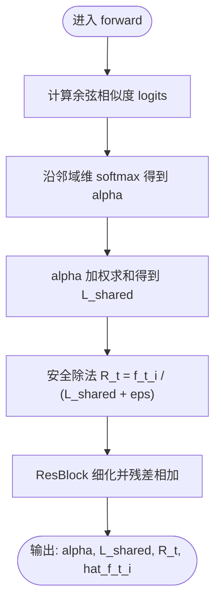
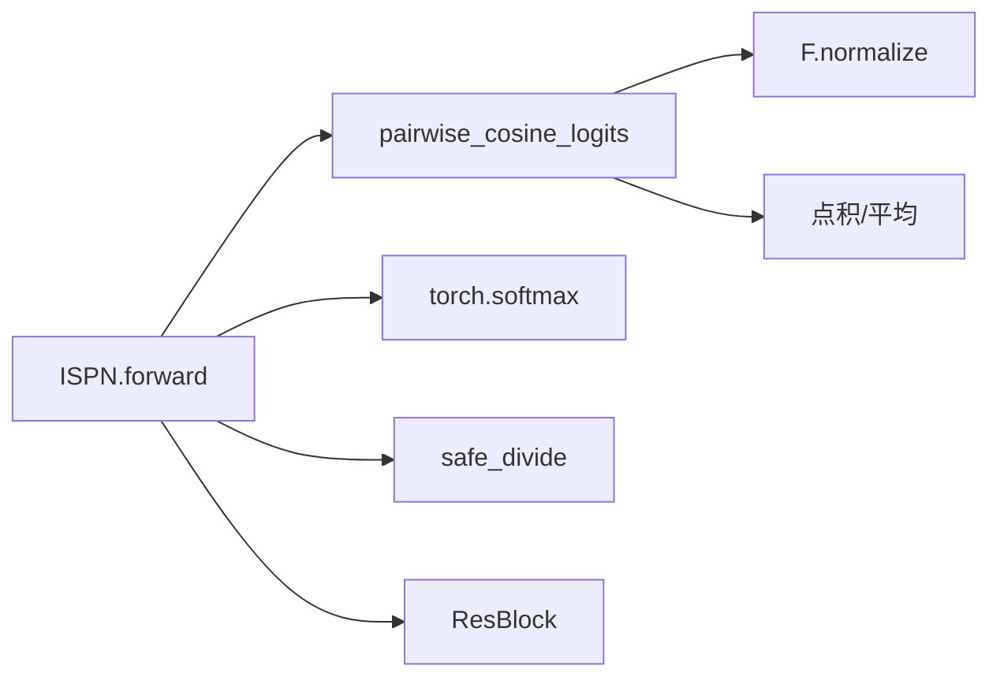

# ISPN光照分离网络

<cite>
**本文引用的文件**
- [models/modules/ispn.py](file://models/modules/ispn.py)
- [models/modules/blocks.py](file://models/modules/blocks.py)
- [models/modules/reconstruction.py](file://models/modules/reconstruction.py)
- [models/mins_net.py](file://models/mins_net.py)
- [models/modules/mspn.py](file://models/modules/mspn.py)
- [models/modules/encoder.py](file://models/modules/encoder.py)
- [models/modules/igrf.py](file://models/modules/igrf.py)
- [configs/sdsd_stage1.yaml](file://configs/sdsd_stage1.yaml)
- [README.md](file://README.md)
</cite>

## 目录
1. [引言](#引言)
2. [项目结构](#项目结构)
3. [核心组件](#核心组件)
4. [架构总览](#架构总览)
5. [详细组件分析](#详细组件分析)
6. [依赖分析](#依赖分析)
7. [性能考虑](#性能考虑)
8. [故障排查指南](#故障排查指南)
9. [结论](#结论)
10. [附录](#附录)

## 引言
本文件围绕ISPN（光照分离网络）模块进行系统化技术文档整理，重点阐述其在网络架构中的角色、余弦相似度计算、注意力权重分配与光照分离机制，以及forward函数的完整处理流程：特征对齐、注意力计算、共享光照估计与残差重建。同时给出ISPN在处理光照不均退化时的优势解析，包括余弦相似度的数学原理、softmax归一化的意义与safe_divide的安全除法机制，并提供与MINS、MSPN等其他恢复分支的对比分析及参数调优建议。

## 项目结构
ISPN位于模型子模块目录中，作为MINSNet流水线中的一个关键分支，负责从MINSBlock输出的光照不变特征中估计共享光照分量并进行光照分离与残差重建。其主要依赖于通用工具函数（余弦相似度与安全除法），并与MINS、MSPN、最终重建模块协同工作。

图示来源
- [models/mins_net.py:20-37](file://models/mins_net.py#L20-L37)
- [models/modules/encoder.py:35-102](file://models/modules/encoder.py#L35-L102)
- [models/modules/ispn.py:7-24](file://models/modules/ispn.py#L7-L24)
- [models/modules/mspn.py:7-39](file://models/modules/mspn.py#L7-L39)
- [models/modules/reconstruction.py:5-22](file://models/modules/reconstruction.py#L5-L22)
- [configs/sdsd_stage1.yaml:11-16](file://configs/sdsd_stage1.yaml#L11-L16)

章节来源
- [README.md:1-24](file://README.md#L1-L24)
- [configs/sdsd_stage1.yaml:11-16](file://configs/sdsd_stage1.yaml#L11-L16)

## 核心组件
- ISPN：接收来自MINSBlock的光照不变特征与邻域特征，计算余弦相似度得到注意力权重，估计共享光照分量，进行安全除法与残差细化，输出hat_f_t_i用于后续重建。
- 通用工具：pairwise_cosine_logits（余弦相似度）、safe_divide（安全除法）、ResBlock（残差细化）。
- 上游MINSBlock：将中心帧与邻域帧分解为光照不变/光照变化两分量，并生成对应先验概率与对应矩阵。
- 下游重建：将ISPN与MSPN的输出按先验权重融合，经两层卷积得到残差修正并叠加到中心帧。

章节来源
- [models/modules/ispn.py:7-24](file://models/modules/ispn.py#L7-L24)
- [models/modules/blocks.py:20-29](file://models/modules/blocks.py#L20-L29)
- [models/modules/blocks.py:97-108](file://models/modules/blocks.py#L97-L108)
- [models/mins_net.py:28-37](file://models/mins_net.py#L28-L37)
- [models/modules/reconstruction.py:5-22](file://models/modules/reconstruction.py#L5-L22)

## 架构总览
ISPN在MINSNet中的位置与数据流如下：

图示来源
- [models/mins_net.py:20-37](file://models/mins_net.py#L20-L37)
- [models/modules/ispn.py:13-24](file://models/modules/ispn.py#L13-L24)
- [models/modules/mspn.py:27-39](file://models/modules/mspn.py#L27-L39)
- [models/modules/reconstruction.py:12-22](file://models/modules/reconstruction.py#L12-L22)

## 详细组件分析

### ISPN模块详解
ISPN的forward函数实现包含以下步骤：
- 余弦相似度计算：对中心帧与邻域帧的特征进行展平与归一化，计算逐像素的余弦相似度，得到注意力logits。
- softmax归一化：将logits沿邻域维度做softmax，得到注意力权重alpha，表示每个邻域对共享光照的贡献。
- 共享光照估计：使用alpha对邻域特征f_omega_i进行加权求和，得到L_shared。
- 安全除法：以L_shared为光照估计，对中心帧特征f_t_i进行安全除法，得到中间比值R_t，避免除零风险。
- 残差细化：通过ResBlock对R_t进行残差细化，再与原输入f_t_i相加，得到光照分离后的特征hat_f_t_i。

图示来源
- [models/modules/ispn.py:13-24](file://models/modules/ispn.py#L13-L24)
- [models/modules/blocks.py:101-108](file://models/modules/blocks.py#L101-L108)
- [models/modules/blocks.py:97-98](file://models/modules/blocks.py#L97-L98)
- [models/modules/blocks.py:20-29](file://models/modules/blocks.py#L20-L29)

章节来源
- [models/modules/ispn.py:7-24](file://models/modules/ispn.py#L7-L24)
- [models/modules/blocks.py:97-108](file://models/modules/blocks.py#L97-L108)

### 余弦相似度与softmax归一化
- 余弦相似度：将中心帧与邻域帧特征展平并L2归一化，通过点积平均得到相似度logits，衡量局部特征在光照变化下的对齐程度。
- softmax归一化：确保注意力权重alpha在邻域维和像素维上满足非负且和为1，便于后续加权求和估计共享光照。

章节来源
- [models/modules/blocks.py:101-108](file://models/modules/blocks.py#L101-L108)

### 安全除法机制
- safe_divide采用加eps的分母稳定策略，避免L_shared接近零导致的数值不稳定与梯度爆炸，提升训练鲁棒性。

章节来源
- [models/modules/blocks.py:97-98](file://models/modules/blocks.py#L97-L98)

### 与MINS、MSPN的对比
- MINSBlock：将中心帧与邻域帧分解为光照不变/光照变化两分量，生成先验概率与对应矩阵，为ISPN与MSPN提供输入。
- ISPN：专注于光照分离，估计共享光照并进行安全除法与残差细化。
- MSPN：关注运动/稳定分支，利用对应矩阵对邻域特征进行窗口化对齐与门控融合，侧重动态一致性。

章节来源
- [models/mins_net.py:28-37](file://models/mins_net.py#L28-L37)
- [models/modules/mspn.py:27-39](file://models/modules/mspn.py#L27-L39)

### 最终重建与残差修正
- ISPN与MSPN的输出按先验权重融合，经两层卷积得到残差修正delta，并与中心帧clamp叠加得到增强结果res_t。

章节来源
- [models/modules/reconstruction.py:12-22](file://models/modules/reconstruction.py#L12-L22)

## 依赖分析
ISPN的直接依赖关系如下：

图示来源
- [models/modules/ispn.py:13-24](file://models/modules/ispn.py#L13-L24)
- [models/modules/blocks.py:101-108](file://models/modules/blocks.py#L101-L108)
- [models/modules/blocks.py:97-98](file://models/modules/blocks.py#L97-L98)
- [models/modules/blocks.py:20-29](file://models/modules/blocks.py#L20-L29)

章节来源
- [models/modules/ispn.py:7-24](file://models/modules/ispn.py#L7-L24)
- [models/modules/blocks.py:97-108](file://models/modules/blocks.py#L97-L108)

## 性能考虑
- 计算复杂度：余弦相似度涉及展平与归一化，时间复杂度近似O(B·T·C·H·W)，softmax与加权求和为O(B·T·H·W)。窗口化对齐的MSPN在大窗口时会增加内存与计算开销。
- 内存占用：窗口化操作需要临时展开与反向还原，窗口尺寸越大，显存峰值越高。
- 数值稳定性：safe_divide与LayerNorm2d的eps共同保障训练稳定；建议在不同光照条件下监控L_shared分布，避免极端稀疏或饱和。

## 故障排查指南
- 除零/NaN问题：若L_shared过小导致R_t异常，检查输入特征是否归一化、通道数是否匹配、邻域数量是否合理。
- 注意力退化：alpha过于集中在少数邻域时，可检查MINSBlock的熵门控与对应矩阵质量，适当调整窗口大小与归一化策略。
- 重建偏暗/偏亮：检查FinalReconstruction的delta范围与clamp边界，必要时降低学习率或调整损失权重。

## 结论
ISPN通过余弦相似度与softmax注意力估计共享光照，结合安全除法与残差细化，在光照不均退化场景中有效分离光照变化，提升重建质量。与MINS、MSPN形成互补：前者专注光照分离，后者关注运动/稳定一致性。配合合理的窗口大小与数值稳定策略，可在低光照视频增强任务中取得稳健效果。

## 附录

### 关键参数与调优建议
- 通道数与窗口大小：由配置文件决定，建议在光照变化剧烈场景增大窗口以提升对齐精度，同时注意显存限制。
- eps：控制数值稳定，若出现不稳定可小幅增大。
- 先验权重：ISPN与MSPN的先验P_t_i/P_t_m影响融合比例，可结合任务需求微调。

章节来源
- [configs/sdsd_stage1.yaml:11-16](file://configs/sdsd_stage1.yaml#L11-L16)
- [models/mins_net.py:12-18](file://models/mins_net.py#L12-L18)