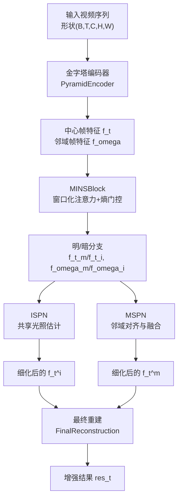
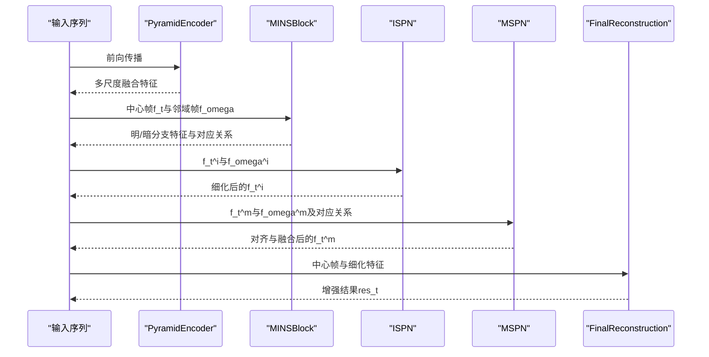
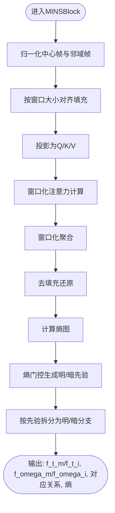
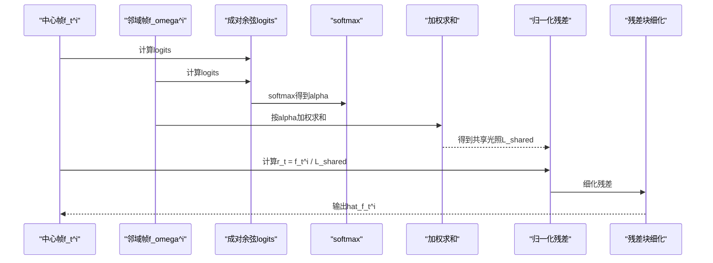
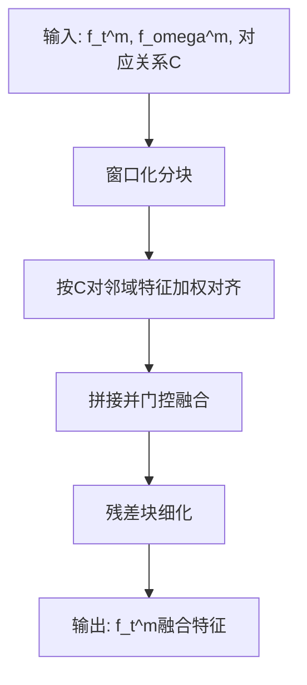
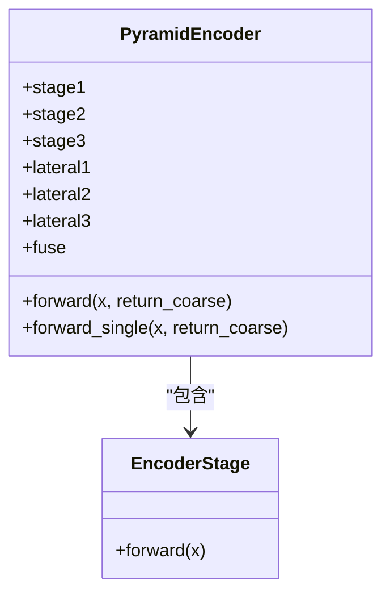
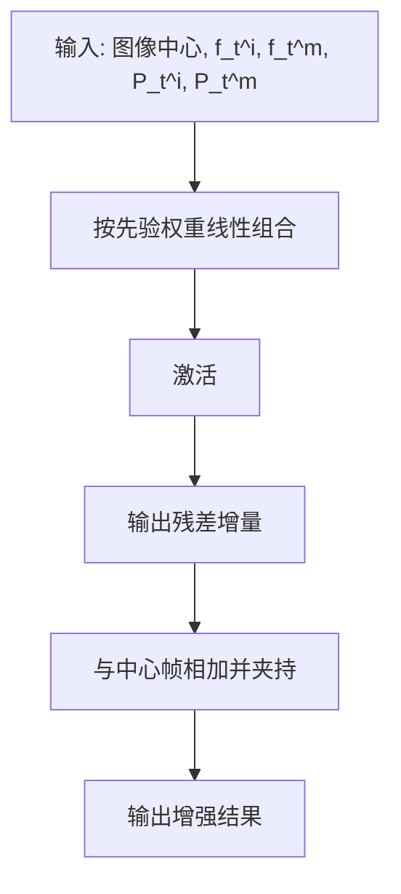
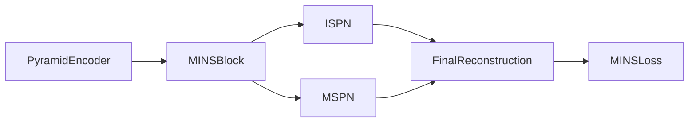

# MINS多尺度光照网络

<cite>
**本文引用的文件**
- [models/modules/mins.py](file://models/modules/mins.py)
- [models/modules/ispn.py](file://models/modules/ispn.py)
- [models/modules/mspn.py](file://models/modules/mspn.py)
- [models/modules/encoder.py](file://models/modules/encoder.py)
- [models/modules/reconstruction.py](file://models/modules/reconstruction.py)
- [models/modules/blocks.py](file://models/modules/blocks.py)
- [models/mains_net.py](file://models/mains_net.py)
- [losses/losses.py](file://losses/losses.py)
- [README.md](file://README.md)
</cite>

## 目录
1. [引言](#引言)
2. [项目结构](#项目结构)
3. [核心组件](#核心组件)
4. [架构总览](#架构总览)
5. [详细组件分析](#详细组件分析)
6. [依赖分析](#依赖分析)
7. [性能考量](#性能考量)
8. [故障排查指南](#故障排查指南)
9. [结论](#结论)
10. [附录](#附录)

## 引言
本文件为MINS（多尺度光照网络）模块的综合技术文档。MINS面向视频低光增强任务，围绕“中心帧监督 + 多尺度特征金字塔 + 窗口化注意力”的整体框架，实现对复杂光照变化与空间不均匀性的鲁棒建模。其关键创新点包括：
- 多尺度特征金字塔：由轻量化金字塔编码器生成不同分辨率的语义特征，支撑跨尺度信息融合。
- 窗口化注意力与熵门控：在局部窗口内进行邻域聚合与对应关系建模，并以熵值引导明/暗区域的自适应加权。
- 双分支光照分离：将中心帧与邻域帧分别分解为“明”（m）与“暗”（i）两支，分别经ISPN与MSPN处理，再在重建阶段融合。

本文件将系统阐述MINS的网络层次、卷积核设计、特征金字塔构建、尺度间信息融合策略，并与ISPN进行对比，给出适用场景、参数配置与性能优化建议。

## 项目结构
MINS位于models/modules目录下，核心模块包括：
- 特征编码：PyramidEncoder（多尺度金字塔编码器）
- 核心块：MINSBlock（窗口化注意力 + 熵门控 + 明/暗分支）
- 光照分离：ISPN（共享光照估计 + 归一化残差细化）
- 邻域聚合：MSPN（基于对应关系的邻域对齐与门控融合）
- 最终重建：FinalReconstruction（线性组合 + 非线性映射 + 夹持输出）

训练与推理流程由MINSNet统一编排，损失函数MINSLoss结合像素级、结构相似性、感知一致性与先验平滑正则项。

图表来源
- [models/mains_net.py:20-65](file://models/mains_net.py#L20-L65)
- [models/modules/encoder.py:35-102](file://models/modules/encoder.py#L35-L102)
- [models/modules/mins.py:22-131](file://models/modules/mins.py#L22-L131)
- [models/modules/ispn.py:7-26](file://models/modules/ispn.py#L7-L26)
- [models/modules/mspn.py:7-41](file://models/modules/mspn.py#L7-L41)
- [models/modules/reconstruction.py:5-24](file://models/modules/reconstruction.py#L5-L24)

章节来源
- [README.md:1-24](file://README.md#L1-L24)
- [models/mains_net.py:11-67](file://models/mains_net.py#L11-L67)

## 核心组件
- MINSBlock：实现窗口化注意力与熵门控，将输入特征分解为明/暗两支；输出包含中心帧与邻域帧的明/暗特征、对应关系矩阵与熵图。
- ISPN：对“暗”分支进行共享光照估计与归一化残差细化，提升光照一致性与细节保留。
- MSPN：利用MINS提供的对应关系，对邻域“明”分支进行对齐与门控融合，抑制噪声与伪影。
- PyramidEncoder：轻量级三阶段编码器，输出多尺度横向投影与双线性上采样融合后的特征，作为MINS输入。
- FinalReconstruction：以中心帧为基准，按明/暗先验权重线性组合细化特征，经非线性映射得到增强结果。

章节来源
- [models/modules/mins.py:22-131](file://models/modules/mins.py#L22-L131)
- [models/modules/ispn.py:7-26](file://models/modules/ispn.py#L7-L26)
- [models/modules/mspn.py:7-41](file://models/modules/mspn.py#L7-L41)
- [models/modules/encoder.py:35-102](file://models/modules/encoder.py#L35-L102)
- [models/modules/reconstruction.py:5-24](file://models/modules/reconstruction.py#L5-L24)

## 架构总览
MINS的整体数据流如下：
- 输入序列经编码器得到多尺度融合特征，选取中心帧与两侧邻域帧；
- MINSBlock在窗口化注意力与熵门控下，将中心帧与邻域帧分别分解为明/暗两支；
- ISPN对“暗”分支做光照估计与细化；
- MSPN对“明”分支做邻域对齐与门控融合；
- 最终重建模块以中心帧为基，按明/暗先验权重融合细化特征，输出增强结果。

图表来源
- [models/mains_net.py:20-65](file://models/mains_net.py#L20-L65)
- [models/modules/encoder.py:35-102](file://models/modules/encoder.py#L35-L102)
- [models/modules/mins.py:22-131](file://models/modules/mins.py#L22-L131)
- [models/modules/ispn.py:7-26](file://models/modules/ispn.py#L7-L26)
- [models/modules/mspn.py:7-41](file://models/modules/mspn.py#L7-L41)
- [models/modules/reconstruction.py:5-24](file://models/modules/reconstruction.py#L5-L24)

## 详细组件分析

### MINSBlock：窗口化注意力与熵门控
- 窗口化注意力：将中心帧与邻域帧按固定窗口大小分块，在窗口内计算注意力并聚合邻域特征，随后逆变换恢复到原分辨率。
- 熵估计：从注意力分布计算熵，作为窗口内不确定性的度量，用于指导明/暗门控。
- 明/暗门控：基于熵构造中心帧与邻域帧的明/暗先验概率，实现自适应加权；输出中心帧与邻域帧的明/暗特征。

图表来源
- [models/modules/mins.py:22-131](file://models/modules/mins.py#L22-L131)
- [models/modules/blocks.py:46-79](file://models/modules/blocks.py#L46-L79)

章节来源
- [models/modules/mins.py:22-131](file://models/modules/mins.py#L22-L131)
- [models/modules/blocks.py:46-79](file://models/modules/blocks.py#L46-L79)

### ISPN：共享光照估计与归一化残差细化
- 计算中心帧与邻域帧之间的成对余弦logits，softmax得到对应权重；
- 按权重对邻域帧进行加权求和，得到共享光照表征；
- 将中心帧按共享光照进行归一化残差，经残差块细化后与原输入相加。

图表来源
- [models/modules/ispn.py:7-26](file://models/modules/ispn.py#L7-L26)
- [models/modules/blocks.py:101-108](file://models/modules/blocks.py#L101-L108)

章节来源
- [models/modules/ispn.py:7-26](file://models/modules/ispn.py#L7-L26)
- [models/modules/blocks.py:101-108](file://models/modules/blocks.py#L101-L108)

### MSPN：邻域对齐与门控融合
- 利用MINS提供的对应关系，将邻域“明”分支按注意力权重进行窗口化对齐；
- 将对齐后的邻域特征与中心帧“明”分支拼接，经门控生成融合特征；
- 通过残差块细化融合特征，得到细化后的中心帧“明”特征。

图表来源
- [models/modules/mspn.py:7-41](file://models/modules/mspn.py#L7-L41)

章节来源
- [models/modules/mspn.py:7-41](file://models/modules/mspn.py#L7-L41)

### PyramidEncoder：多尺度特征金字塔
- 三阶段编码器：第一阶段步幅为1，第二、三阶段步幅为2，输出分辨率为原图的1/4（两次下采样）；
- 横向连接：对各阶段输出进行1×1卷积投影至融合通道数，再通过双线性插值与加和进行上采样融合；
- 输出：融合后的特征图作为MINS输入，可选择同时返回最粗尺度特征以供后续模块使用。

图表来源
- [models/modules/encoder.py:23-102](file://models/modules/encoder.py#L23-L102)

章节来源
- [models/modules/encoder.py:23-102](file://models/modules/encoder.py#L23-L102)

### FinalReconstruction：最终重建
- 将细化后的“明”、“暗”特征按各自先验权重线性组合；
- 经卷积与激活得到残差增量，与中心帧进行夹持，输出增强结果。

图表来源
- [models/modules/reconstruction.py:5-24](file://models/modules/reconstruction.py#L5-L24)

章节来源
- [models/modules/reconstruction.py:5-24](file://models/modules/reconstruction.py#L5-L24)

### MINSNet：端到端流水线
- 编排顺序：编码器 → MINS → ISPN → MSPN → 重建；
- 接口约束：时间窗口必须为奇数且至少为3；
- 输出内容：增强结果、中间特征、先验权重、对应关系与辅助统计量。

章节来源
- [models/mains_net.py:11-67](file://models/mains_net.py#L11-L67)

## 依赖分析
- 模块内聚与耦合：
  - MINSBlock依赖窗口化工具与层归一化，独立性强；
  - ISPN与MSPN分别处理“暗”与“明”分支，耦合于MINS输出的对应关系与先验；
  - FinalReconstruction依赖MINS/MSPN/ISPN的输出，形成闭环。
- 外部依赖：
  - 损失函数MINSLoss依赖感知特征提取器（可选），并引入先验平滑正则。

图表来源
- [models/mains_net.py:11-67](file://models/mains_net.py#L11-L67)
- [losses/losses.py:80-114](file://losses/losses.py#L80-L114)

章节来源
- [models/mains_net.py:11-67](file://models/mains_net.py#L11-L67)
- [losses/losses.py:80-114](file://losses/losses.py#L80-L114)

## 性能考量
- 计算复杂度
  - 窗口化注意力：对每个窗口计算注意力与聚合，复杂度近似O((HW/Ws)^2·C·Ws^2)，其中Ws为窗口尺寸；可通过增大窗口或批次降低每窗口计算频率。
  - 熵门控：O(HW·C)，开销较小。
  - 感知损失：若启用预训练特征，会引入额外前向开销，但可提升感知质量。
- 内存消耗
  - 窗口化分块与逆变换带来临时张量峰值；合理设置窗口大小与批大小可平衡显存占用。
  - 损失中的先验平滑正则对显存影响有限。
- 实用建议
  - 在保证效果的前提下优先使用较小窗口（如8）以降低复杂度；
  - 若显存紧张，可减少时间窗口长度或批量大小；
  - 感知损失可按需开启，避免不必要的下载与前向。

## 故障排查指南
- 输入维度错误
  - 现象：报错提示时间窗口需为奇数且≥3；
  - 处理：确保输入序列的时间维满足断言条件。
- 窗口尺寸与分辨率不匹配
  - 现象：填充/去填充后形状不一致；
  - 处理：确保输入分辨率可被窗口整除，必要时调整窗口大小。
- 感知损失不可用
  - 现象：警告提示无法加载预训练权重或torchvision不可用；
  - 处理：关闭预训练选项或安装torchvision。
- 先验平滑导致过平滑
  - 现象：增强结果偏灰、细节不足；
  - 处理：降低先验平滑权重或关闭该项。

章节来源
- [models/mains_net.py:20-23](file://models/mains_net.py#L20-L23)
- [losses/losses.py:80-114](file://losses/losses.py#L80-L114)

## 结论
MINS通过“多尺度特征金字塔 + 窗口化注意力 + 熵门控 + 双分支光照分离”的组合，有效应对复杂光照变化与空间不均匀性。相较ISPN，MINS在邻域对齐与门控融合方面引入了更精细的对应关系建模，适合需要更强时空一致性的低光增强任务。实践中可根据硬件条件调整窗口大小与时间窗口，以在精度与效率之间取得平衡。

## 附录
- 适用场景
  - 视频低光增强、弱光环境下的动态场景；
  - 对光照一致性与细节保留要求较高的应用。
- 关键参数
  - 窗口大小：控制局部注意力感受野与计算强度；
  - 时间窗口：中心帧监督的邻域范围；
  - 多尺度通道：金字塔横向投影通道数，影响融合表达能力。
- 与ISPN的差异
  - ISPN仅对“暗”分支进行光照估计与细化，MINS在此基础上增加“明”分支的邻域对齐与门控融合，整体更强调双流互补与先验平滑正则。