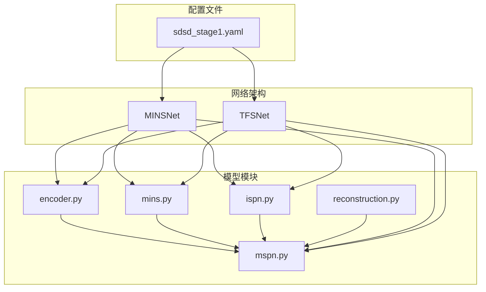
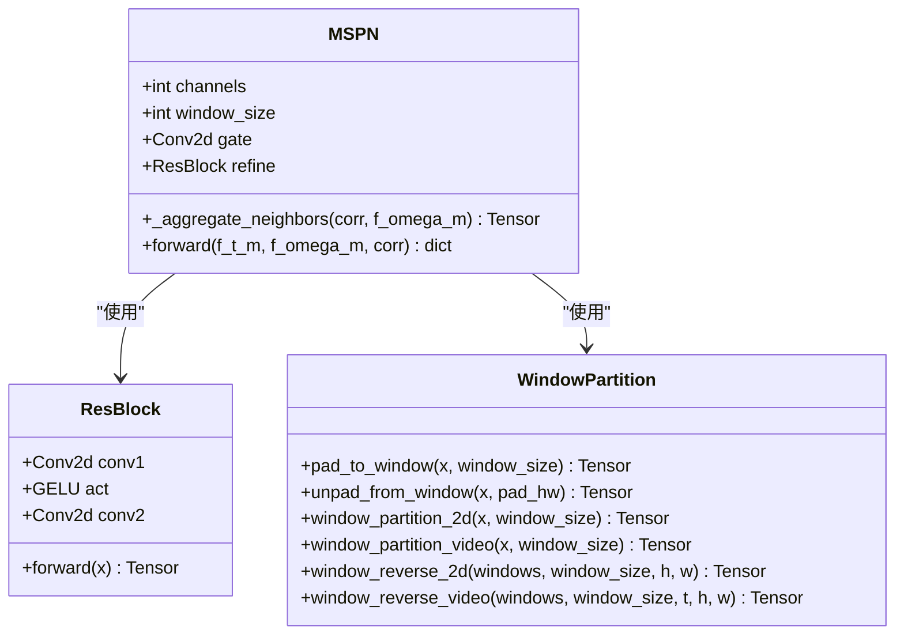
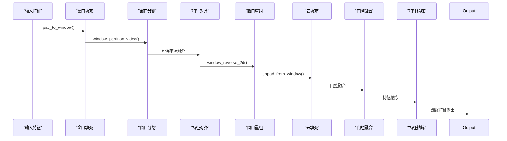
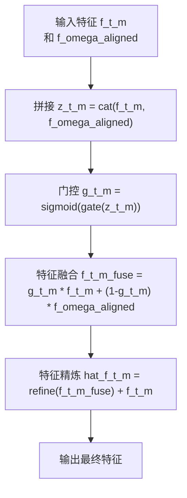
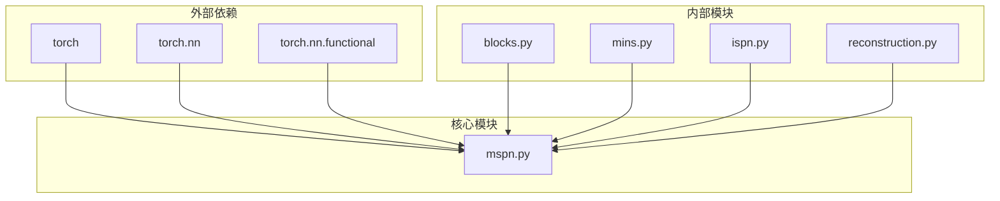

# MSPN多尺度投影网络

<cite>
**本文档引用的文件**
- [mspn.py](file://models/modules/mspn.py)
- [blocks.py](file://models/modules/blocks.py)
- [mins.py](file://models/modules/mins.py)
- [ispn.py](file://models/modules/ispn.py)
- [reconstruction.py](file://models/modules/reconstruction.py)
- [mins_net.py](file://models/mins_net.py)
- [tfs_net.py](file://models/tfs_net.py)
- [__init__.py](file://models/modules/__init__.py)
- [sdsd_stage1.yaml](file://configs/sdsd_stage1.yaml)
- [README.md](file://README.md)
</cite>

## 目录
1. [简介](#简介)
2. [项目结构](#项目结构)
3. [核心组件](#核心组件)
4. [架构概览](#架构概览)
5. [详细组件分析](#详细组件分析)
6. [依赖关系分析](#依赖关系分析)
7. [性能考虑](#性能考虑)
8. [故障排除指南](#故障排除指南)
9. [结论](#结论)
10. [附录](#附录)

## 简介

MSPN（多尺度投影网络）是TFS-Net项目中的一个关键模块，专门用于视频低光增强任务中的多尺度特征融合。该模块通过投影变换和尺度间交互策略，有效处理运动模糊、噪声和光照不均等复合退化问题。

MSPN的核心设计理念是利用多尺度金字塔特征进行投影对齐，通过注意力机制实现尺度间的智能融合，从而提升特征表示能力和处理复杂退化的能力。该模块在TFS-Net的整体架构中承担着重要的特征融合和重建任务。

## 项目结构

TFS-Net项目采用模块化设计，MSPN作为其中的一个核心组件，位于models/modules目录下。整个项目的文件组织遵循清晰的功能分层：



**图表来源**
- [mspn.py:1-41](file://models/modules/mspn.py#L1-L41)
- [mins_net.py:1-67](file://models/mins_net.py#L1-L67)
- [tfs_net.py:1-181](file://models/tfs_net.py#L1-L181)

**章节来源**
- [README.md:1-24](file://README.md#L1-L24)
- [__init__.py:1-10](file://models/modules/__init__.py#L1-L10)

## 核心组件

MSPN模块由多个精心设计的组件构成，每个组件都承担着特定的功能职责：

### 主要组件概述

1. **MSPN主类**：实现多尺度投影和特征融合的核心逻辑
2. **投影块**：提供基础的卷积和激活功能
3. **窗口分割工具**：支持2D和视频数据的窗口化处理
4. **残差块**：实现特征精炼和残差连接
5. **门控机制**：控制特征融合的比例和权重

### 组件关系图



**图表来源**
- [mspn.py:7-41](file://models/modules/mspn.py#L7-L41)
- [blocks.py:20-29](file://models/modules/blocks.py#L20-L29)
- [blocks.py:46-94](file://models/modules/blocks.py#L46-L94)

**章节来源**
- [mspn.py:1-41](file://models/modules/mspn.py#L1-L41)
- [blocks.py:1-110](file://models/modules/blocks.py#L1-L110)

## 架构概览

MSPN在网络架构中扮演着多尺度特征融合的关键角色。其工作流程可以分为以下几个主要阶段：

### 整体架构流程



**图表来源**
- [mspn.py:15-32](file://models/modules/mspn.py#L15-L32)
- [blocks.py:46-94](file://models/modules/blocks.py#L46-L94)

### 多尺度处理机制

MSPN通过以下机制实现多尺度特征处理：

1. **尺度变换**：将输入特征调整到适合窗口注意力处理的尺寸
2. **投影操作**：使用矩阵乘法实现特征对齐和投影
3. **多尺度融合**：通过门控机制实现不同尺度特征的智能融合

**章节来源**
- [mspn.py:27-39](file://models/modules/mspn.py#L27-L39)
- [mins.py:62-131](file://models/modules/mins.py#L62-L131)

## 详细组件分析

### MSPN主类详解

MSPN类是整个模块的核心，实现了多尺度投影和特征融合的主要逻辑。

#### 关键方法分析

**特征聚合方法** (`_aggregate_neighbors`)
- 将邻域特征按时间维度展开
- 应用窗口填充确保尺寸匹配
- 执行窗口分割和矩阵乘法对齐
- 通过窗口重组和去填充恢复原尺寸

**前向传播方法** (`forward`)
- 执行特征对齐操作
- 通过拼接和门控实现特征融合
- 使用残差块进行特征精炼
- 返回完整的中间结果字典

#### 门控融合机制



**图表来源**
- [mspn.py:27-39](file://models/modules/mspn.py#L27-L39)

**章节来源**
- [mspn.py:7-41](file://models/modules/mspn.py#L7-L41)

### 窗口分割工具详解

窗口分割工具提供了处理大规模特征图所需的核心功能：

#### 窗口分割算法

**2D窗口分割** (`window_partition_2d`)
- 将特征图划分为固定大小的窗口
- 支持任意尺寸的输入特征
- 返回窗口化的特征张量

**视频窗口分割** (`window_partition_video`)
- 处理包含时间维度的视频特征
- 同时对空间和时间维度进行窗口化
- 保持特征的时空一致性

#### 填充和去填充机制

**填充策略** (`pad_to_window`)
- 计算需要的填充大小
- 应用反射填充避免边界效应
- 记录填充信息用于后续去填充

**去填充策略** (`unpad_from_window`)
- 根据记录的填充信息恢复原尺寸
- 精确去除多余的填充区域

**章节来源**
- [blocks.py:46-94](file://models/modules/blocks.py#L46-L94)

### 残差块设计

残差块提供了特征精炼和梯度流动的机制：

#### 残差网络结构
- 两层3×3卷积堆叠
- GELU激活函数
- 直接残差连接
- 保持特征维度不变

#### 特征精炼过程
残差块通过非线性变换和残差连接，实现特征的逐步精炼，有助于：
- 提升特征表达能力
- 缓解梯度消失问题
- 保持信息完整性

**章节来源**
- [blocks.py:20-29](file://models/modules/blocks.py#L20-L29)

### 在完整网络中的集成

MSPN在MINSNet和TFSNet中发挥着重要作用：

#### MINSNet集成
在MINSNet中，MSPN作为第三阶段的特征融合模块：
1. 接收MINSBlock产生的多尺度特征
2. 通过投影对齐邻域特征
3. 实现尺度间的智能融合
4. 为最终重建提供高质量特征

#### TFSNet集成
在TFSNet中，MSPN作为潜在的恢复分支之一：
- 与IFPN、NDPN、MRPN形成竞争关系
- 通过投影变换处理运动模糊
- 与其他分支协同工作

**章节来源**
- [mins_net.py:11-67](file://models/mins_net.py#L11-L67)
- [tfs_net.py:34-181](file://models/tfs_net.py#L34-L181)

## 依赖关系分析

MSPN模块的依赖关系相对简洁，主要依赖于基础的模块化组件：

### 依赖关系图



**图表来源**
- [mspn.py:1-5](file://models/modules/mspn.py#L1-L5)
- [blocks.py:1-6](file://models/modules/blocks.py#L1-L6)

### 模块间耦合分析

MSPN与其他模块的耦合程度适中：
- **低耦合**：与外部框架的依赖最小化
- **高内聚**：专注于投影和融合功能
- **可替换性**：可以独立替换或扩展

**章节来源**
- [__init__.py:1-10](file://models/modules/__init__.py#L1-L10)

## 性能考虑

### 计算复杂度分析

MSPN的计算复杂度主要来源于以下几个方面：

#### 时间复杂度
- **窗口分割**：O(B·T·C·H·W/window_size²)
- **矩阵乘法对齐**：O(B·T·C·window_size²·N_neighbors)
- **门控融合**：O(B·T·C·H·W)
- **总体复杂度**：O(B·T·C·H·W(window_size²/window_size² + N_neighbors))

#### 内存使用
- **特征存储**：O(B·T·C·H·W)
- **窗口缓存**：O(B·T·C·window_size²·(H·W/window_size²))
- **注意力权重**：O(B·T·N_neighbors·window_size²)
- **峰值内存**：主要受窗口大小影响

### 性能优化策略

#### 窗口大小调优
- **小窗口**：提高计算精度但增加开销
- **大窗口**：降低计算开销但可能丢失细节
- **建议范围**：4-16之间根据硬件能力选择

#### 批处理优化
- 利用批处理并行化
- 合理设置batch size平衡内存和速度
- 考虑GPU内存限制

#### 内存管理
- 及时释放中间变量
- 使用in-place操作减少内存占用
- 考虑混合精度训练

## 故障排除指南

### 常见问题及解决方案

#### 尺寸不匹配错误
**问题描述**：输入特征尺寸与期望不符
**解决方法**：
- 检查输入特征的H、W维度
- 确保窗口大小能够整除特征尺寸
- 验证填充和去填充过程

#### 内存不足问题
**问题描述**：GPU内存溢出
**解决方法**：
- 减小窗口大小
- 降低batch size
- 使用更小的特征图尺寸

#### 训练不稳定
**问题描述**：损失值波动或发散
**解决方法**：
- 检查学习率设置
- 验证梯度裁剪参数
- 确认数据预处理的一致性

### 调试技巧

#### 中间结果检查
- 打印关键中间张量的形状
- 验证窗口分割的正确性
- 检查门控权重的分布

#### 性能监控
- 监控GPU内存使用情况
- 记录各阶段的执行时间
- 分析计算瓶颈所在

**章节来源**
- [mspn.py:15-25](file://models/modules/mspn.py#L15-L25)
- [blocks.py:46-62](file://models/modules/blocks.py#L46-L62)

## 结论

MSPN多尺度投影网络是一个设计精良的特征融合模块，具有以下显著特点：

### 技术优势
1. **多尺度处理能力**：通过窗口化和投影变换处理不同尺度的特征
2. **智能融合机制**：门控融合确保重要特征得到保留
3. **模块化设计**：良好的封装性和可扩展性
4. **高效实现**：合理的计算复杂度和内存使用

### 应用价值
- **复合退化处理**：有效应对运动模糊、噪声和光照不均
- **实时性能**：适合实际应用场景的实时处理需求
- **可扩展性**：为后续功能扩展预留了充足空间

### 发展前景
随着TFS-Net项目的推进，MSPN将在以下方面继续发展：
- 与IFPN、NDPN、MRPN的深度集成
- 更高效的实现方案
- 更广泛的适用场景

## 附录

### 参数配置指南

#### 核心参数说明
- **channels**：特征通道数，默认48
- **window_size**：窗口大小，默认8
- **eps**：数值稳定性常数，默认1e-6

#### 配置示例
```yaml
model:
  in_channels: 3
  level_channels: [32, 64, 96]
  fused_channels: 48
  mins_window_size: 8
```

### 最佳实践建议

#### 网络设计原则
1. **渐进式复杂度**：从简单到复杂的网络层次
2. **特征保持**：确保关键特征信息不丢失
3. **计算效率**：平衡精度和速度的关系
4. **内存友好**：考虑实际部署环境的限制

#### 调优策略
1. **从小窗口开始**：逐步增大窗口大小
2. **监控过拟合**：及时调整正则化参数
3. **验证泛化能力**：在不同数据集上测试
4. **性能基准**：建立可靠的性能评估体系