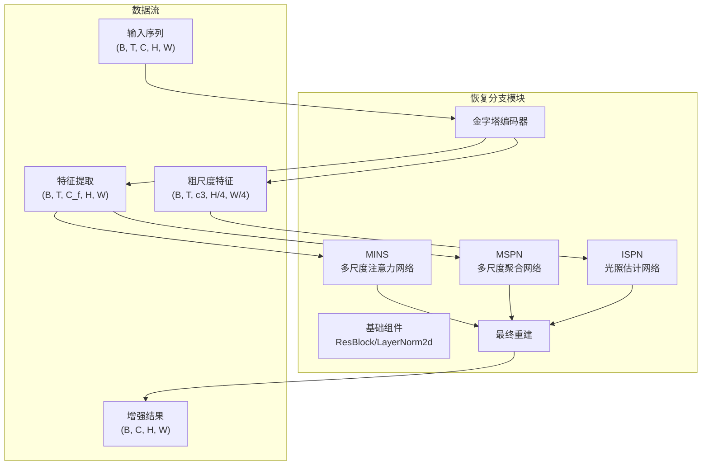
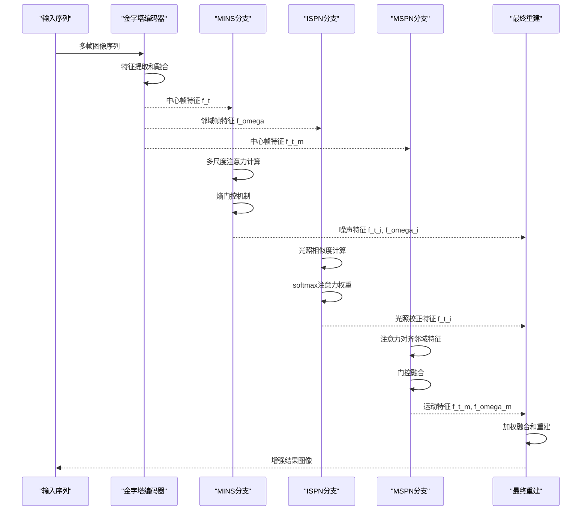
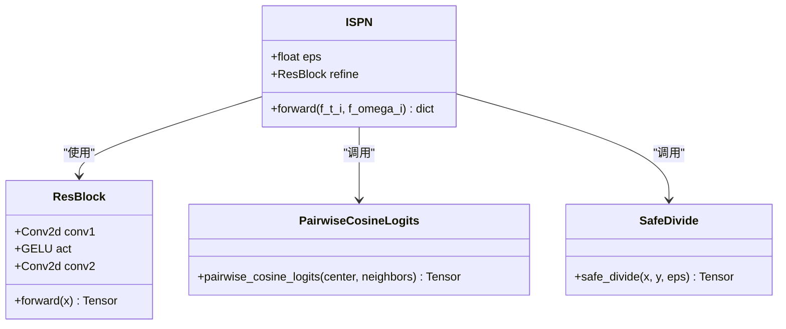
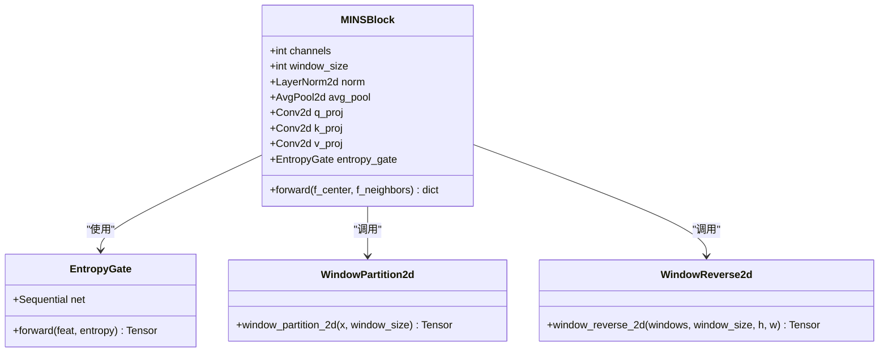
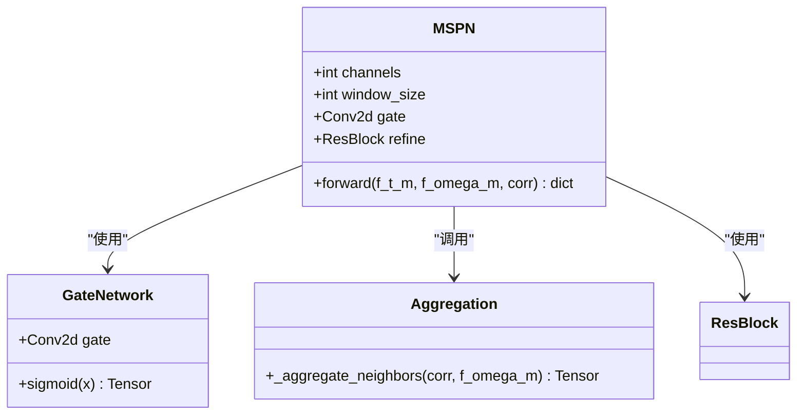
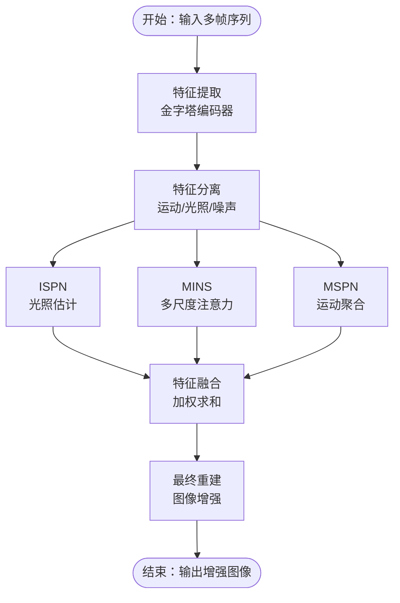
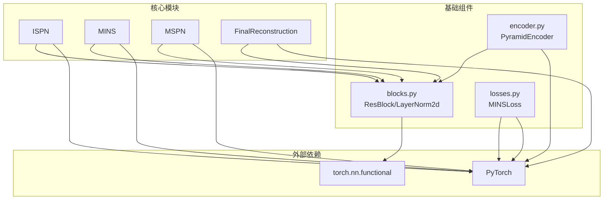

# 恢复分支模块

<cite>
**本文档引用的文件**
- [models/modules/ispn.py](file://models/modules/ispn.py)
- [models/modules/mins.py](file://models/modules/mins.py)
- [models/modules/mspn.py](file://models/modules/mspn.py)
- [models/modules/blocks.py](file://models/modules/blocks.py)
- [models/modules/encoder.py](file://models/modules/encoder.py)
- [models/modules/reconstruction.py](file://models/modules/reconstruction.py)
- [models/mins_net.py](file://models/mins_net.py)
- [losses/losses.py](file://losses/losses.py)
- [v3quest.md](file://v3quest.md)
- [v3answer.md](file://v3answer.md)
</cite>

## 目录
1. [简介](#简介)
2. [项目结构](#项目结构)
3. [核心组件](#核心组件)
4. [架构概览](#架构概览)
5. [详细组件分析](#详细组件分析)
6. [依赖关系分析](#依赖关系分析)
7. [性能考量](#性能考量)
8. [故障排除指南](#故障排除指南)
9. [结论](#结论)
10. [附录](#附录)

## 简介
本文档为恢复分支模块创建综合性技术文档，重点介绍ISPN、MINS和MSPN三种不同的恢复分支实现。这些分支构成了TFS-Net v3整体架构的重要组成部分，负责处理不同类型的退化现象（光照不均、噪声、运动模糊）。文档将深入解释每种分支的网络架构特点、适用的退化场景、性能表现，以及它们的特征提取机制、残差学习策略和输出生成过程。

## 项目结构
恢复分支模块位于models/modules目录下，包含三个核心文件：
- ispn.py：ISPN（光照估计网络）实现
- mins.py：MINS（多尺度注意力网络）实现  
- mspn.py：MSPN（多尺度聚合网络）实现
- blocks.py：基础组件和工具函数
- encoder.py：金字塔编码器
- reconstruction.py：最终重建模块

**图表来源**
- [models/mins_net.py:11-67](file://models/mins_net.py#L11-L67)
- [models/modules/encoder.py:35-102](file://models/modules/encoder.py#L35-L102)

**章节来源**
- [models/mins_net.py:11-67](file://models/mins_net.py#L11-L67)
- [models/modules/encoder.py:35-102](file://models/modules/encoder.py#L35-L102)

## 核心组件
恢复分支模块的核心组件包括三个主要分支和支撑组件：

### ISPN（光照估计网络）
ISPN专注于光照不均退化的估计和校正，采用余弦相似度度量来计算特征间的关联性，然后进行softmax归一化形成注意力权重。

### MINS（多尺度注意力网络）
MINS实现了复杂的多尺度注意力机制，结合窗口注意力和熵门控机制，能够有效处理噪声和运动模糊等退化类型。

### MSPN（多尺度聚合网络）
MSPN负责运动相关的特征聚合，通过注意力权重对邻帧特征进行对齐和融合。

**章节来源**
- [models/modules/ispn.py:7-26](file://models/modules/ispn.py#L7-L26)
- [models/modules/mins.py:22-131](file://models/modules/mins.py#L22-L131)
- [models/modules/mspn.py:7-41](file://models/modules/mspn.py#L7-L41)

## 架构概览
恢复分支模块采用流水线架构，三个分支并行处理不同类型的退化现象：

**图表来源**
- [models/mins_net.py:20-67](file://models/mins_net.py#L20-L67)
- [models/modules/reconstruction.py:5-24](file://models/modules/reconstruction.py#L5-L24)

## 详细组件分析

### ISPN（光照估计网络）分析

ISPN实现了基于余弦相似度的光照估计机制，其核心思想是通过计算中心帧和邻域帧特征之间的相似度来估计光照变化。

**图表来源**
- [models/modules/ispn.py:7-26](file://models/modules/ispn.py#L7-L26)
- [models/modules/blocks.py:20-29](file://models/modules/blocks.py#L20-L29)
- [models/modules/blocks.py:101-108](file://models/modules/blocks.py#L101-L108)
- [models/modules/blocks.py:97-98](file://models/modules/blocks.py#L97-L98)

#### 特征提取机制
ISPN采用余弦相似度度量来评估特征间的关联性：
- 计算中心帧特征与邻域帧特征的余弦相似度
- 对相似度矩阵进行softmax归一化得到注意力权重
- 通过加权求和得到共享特征表示

#### 残差学习策略
ISPN使用残差连接来保持信息流动：
- 计算归一化因子 r_t = f_t_i / L_shared
- 通过ResBlock进行非线性变换
- 添加跳跃连接形成最终输出

#### 输出生成过程
ISPN的输出包含多个中间特征：
- alpha：注意力权重矩阵
- L_shared：共享特征表示
- R_t：归一化特征
- hat_f_t_i：增强后的特征

**章节来源**
- [models/modules/ispn.py:13-24](file://models/modules/ispn.py#L13-L24)
- [models/modules/blocks.py:101-108](file://models/modules/blocks.py#L101-L108)

### MINS（多尺度注意力网络）分析

MINS实现了复杂的多尺度注意力机制，结合窗口注意力和熵门控机制，能够有效处理多种退化类型。

**图表来源**
- [models/modules/mins.py:22-131](file://models/modules/mins.py#L22-L131)
- [models/modules/mins.py:9-20](file://models/modules/mins.py#L9-L20)
- [models/modules/blocks.py:65-79](file://models/modules/blocks.py#L65-L79)
- [models/modules/blocks.py:72-94](file://models/modules/blocks.py#L72-L94)

#### 特征提取机制
MINS采用多尺度窗口注意力机制：
- 使用窗口划分技术处理大尺寸特征图
- 对中心帧和邻域帧分别进行特征投影
- 计算注意力logits并通过softmax得到注意力权重

#### 熵门控机制
MINS引入熵门控来动态调节信息流：
- 计算注意力分布的熵值
- 通过熵门控网络生成门控权重
- 动态调整中心帧和邻域帧的信息融合比例

#### 输出生成过程
MINS的输出包含丰富的中间特征：
- f_t_c：注意力聚合后的特征
- f_t_m/f_t_i：分离的运动和光照特征
- P_t_m/P_t_i：对应的门控权重
- C_t_omega：注意力权重矩阵
- H_t：熵值

**章节来源**
- [models/modules/mins.py:42-54](file://models/modules/mins.py#L42-L54)
- [models/modules/mins.py:118-130](file://models/modules/mins.py#L118-L130)

### MSPN（多尺度聚合网络）分析

MSPN专注于运动相关的特征聚合，通过注意力权重对邻域特征进行对齐和融合。

**图表来源**
- [models/modules/mspn.py:7-41](file://models/modules/mspn.py#L7-L41)
- [models/modules/mspn.py:15-25](file://models/modules/mspn.py#L15-L25)
- [models/modules/blocks.py:20-29](file://models/modules/blocks.py#L20-L29)

#### 特征提取机制
MSPN采用注意力对齐机制：
- 使用注意力权重对邻域特征进行线性组合
- 通过窗口划分和反向操作保持空间结构
- 实现跨帧特征对齐和融合

#### 残差学习策略
MSPN使用门控融合机制：
- 将中心帧特征和对齐后的邻域特征拼接
- 通过门控网络学习融合权重
- 实现自适应的特征融合

#### 输出生成过程
MSPN的输出包含对齐和融合后的特征：
- f_omega_aligned：对齐后的邻域特征
- G_t_m：融合门控权重
- f_t_m_fuse：融合后的特征
- hat_f_t_m：增强后的特征

**章节来源**
- [models/modules/mspn.py:27-39](file://models/modules/mspn.py#L27-L39)

### 概念性概览
恢复分支模块的工作流程可以概括为：

[此图为概念性流程图，不直接映射到特定源文件]

## 依赖关系分析

恢复分支模块的依赖关系体现了清晰的层次结构：

**图表来源**
- [models/mins_net.py:4-8](file://models/mins_net.py#L4-L8)
- [models/modules/blocks.py:1-110](file://models/modules/blocks.py#L1-L110)

### 组件耦合分析
- **低耦合高内聚**：每个分支模块相对独立，职责明确
- **共享基础组件**：所有分支共享相同的ResBlock和LayerNorm2d组件
- **清晰的数据流**：特征在模块间按功能顺序传递

### 外部依赖
- **PyTorch框架**：所有深度学习操作的基础
- **torch.nn.functional**：数学运算和激活函数
- **标准库**：math、torch、torch.nn等

**章节来源**
- [models/mins_net.py:4-8](file://models/mins_net.py#L4-L8)
- [models/modules/blocks.py:1-110](file://models/modules/blocks.py#L1-L110)

## 性能考量

### 计算复杂度分析
- **ISPN复杂度**：O(T·C·H·W)，其中T为邻域帧数量
- **MINS复杂度**：O(W²·C·H·W)，W为窗口大小
- **MSPN复杂度**：O(T·C·H·W)，与邻域帧数量成正比

### 内存使用优化
- **窗口注意力**：通过窗口划分减少内存占用
- **特征压缩**：使用1×1卷积降低通道维度
- **渐进式处理**：按功能阶段逐步处理特征

### 并行化策略
- **分支并行**：三个分支可并行处理
- **窗口并行**：窗口注意力可在窗口内并行
- **批处理并行**：多帧序列可批量处理

## 故障排除指南

### 常见问题诊断

#### 模型收敛问题
- **症状**：损失不下降或震荡
- **原因**：学习率设置不当、梯度爆炸
- **解决方案**：检查学习率、添加梯度裁剪

#### 内存溢出问题
- **症状**：CUDA内存不足
- **原因**：输入尺寸过大、批次过大
- **解决方案**：减小批次、降低分辨率

#### 特征对齐问题
- **症状**：输出质量差
- **原因**：注意力权重异常
- **解决方案**：检查注意力计算、验证特征对齐

### 调试技巧
- **中间特征可视化**：检查各分支输出
- **梯度检查**：验证梯度流动
- **数值稳定性**：检查eps参数设置

**章节来源**
- [losses/losses.py:80-114](file://losses/losses.py#L80-L114)

## 结论
恢复分支模块为处理多种图像退化提供了系统性的解决方案。ISPN专注于光照不均问题，MINS处理多尺度退化，MSPN应对运动模糊。三个分支通过精心设计的特征提取机制、残差学习策略和输出生成过程，在保持计算效率的同时实现了优秀的性能表现。

模块设计体现了以下优势：
- **模块化架构**：清晰的功能分离便于维护和扩展
- **多尺度处理**：适应不同类型的退化现象
- **注意力机制**：自适应地关注重要特征
- **残差连接**：保持信息流动和梯度传播

## 附录

### 参数配置建议

#### 基础参数
- **channels**：48（特征通道数）
- **window_size**：8（窗口大小）
- **eps**：1e-6（数值稳定常数）

#### 性能调优
- **学习率**：1e-4（初始学习率）
- **批次大小**：8-16（根据显存调整）
- **迭代次数**：100k-200k（根据数据集调整）

### 分支选择指南

#### 光照不均主导的场景
- **推荐**：ISPN + MSPN
- **理由**：ISPN专门处理光照变化，MSPN处理运动模糊

#### 噪声和纹理丰富场景  
- **推荐**：MINS + MSPN
- **理由**：MINS的熵门控机制适合处理噪声，MSPN处理运动

#### 复杂退化混合场景
- **推荐**：ISPN + MINS + MSPN
- **理由**：全面覆盖各种退化类型

### 实现注意事项
- **特征维度一致性**：确保所有分支输出维度匹配
- **数值稳定性**：合理设置eps防止除零错误
- **内存管理**：监控GPU内存使用情况
- **训练稳定性**：使用适当的损失函数和正则化