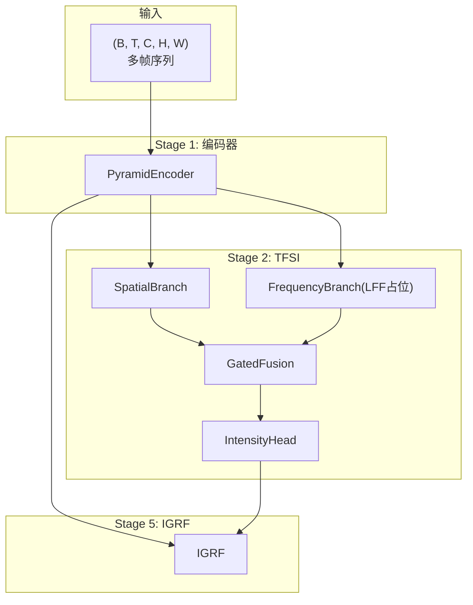
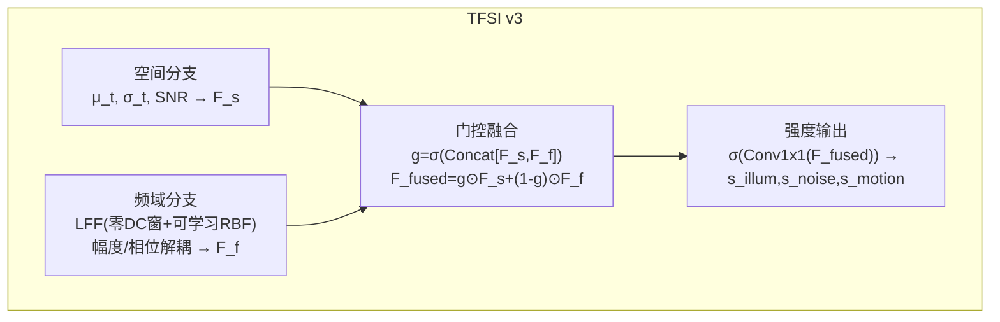
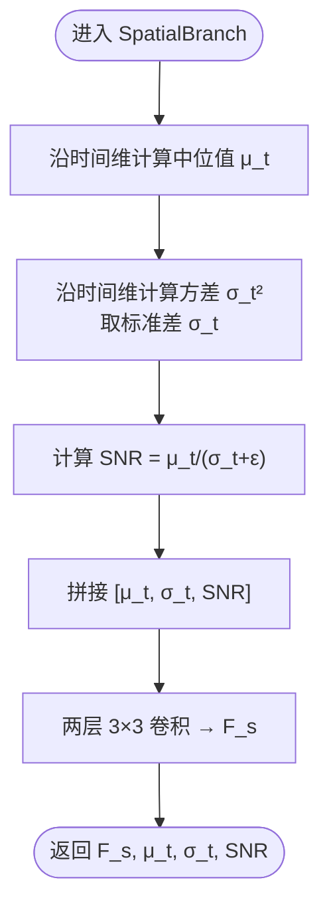
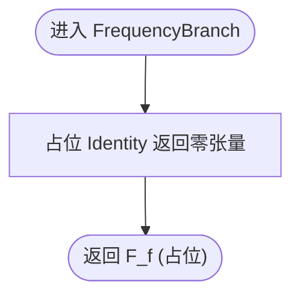
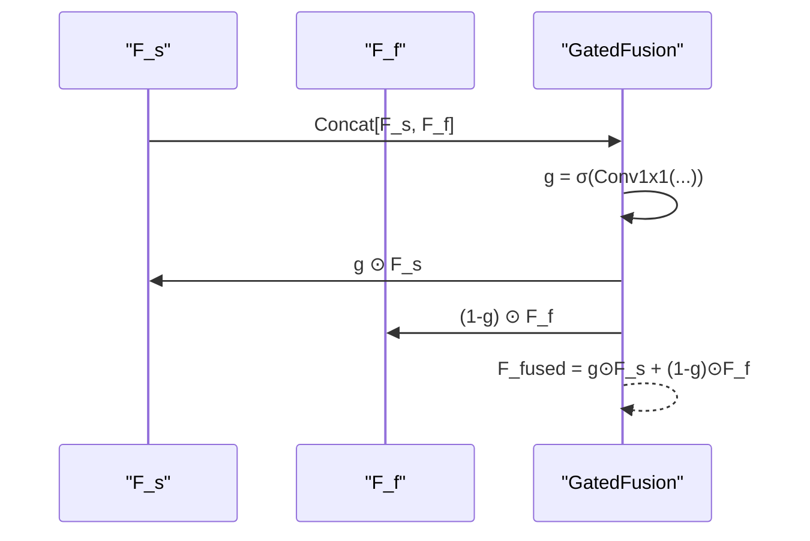
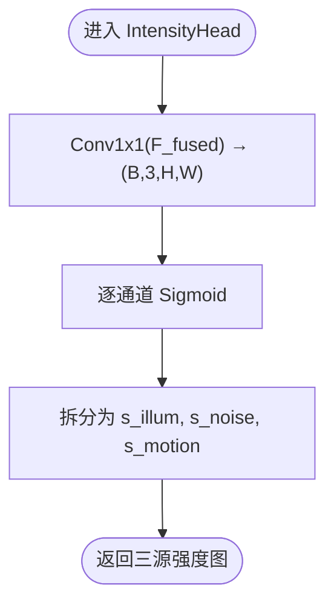
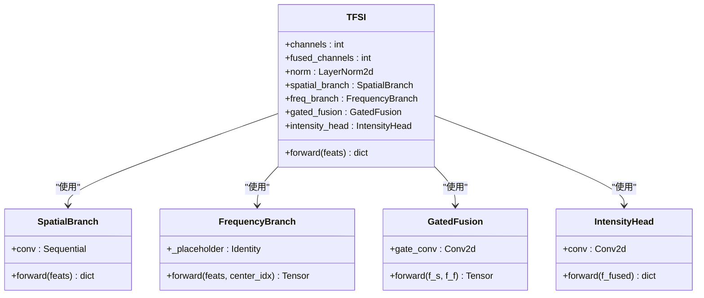
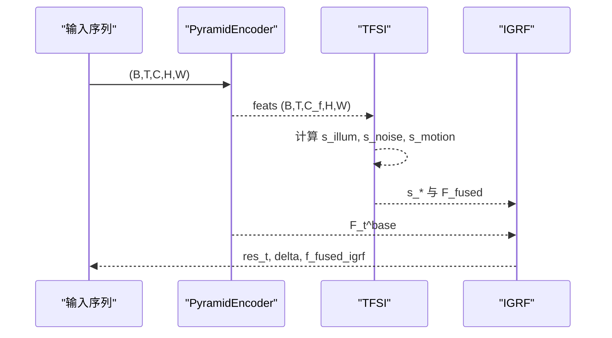
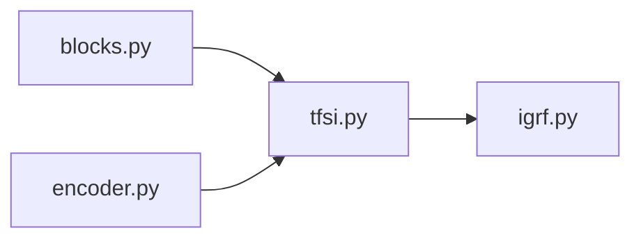

# 时频源指示器(TFSI)

<cite>
**本文档引用的文件**
- [tfsi.py](file://models/modules/tfsi.py)
- [tfs_net.py](file://models/tfs_net.py)
- [blocks.py](file://models/modules/blocks.py)
- [encoder.py](file://models/modules/encoder.py)
- [igrf.py](file://models/modules/igrf.py)
- [TFSv3-result.md](file://TFSv3-result.md)
- [v3quest.md](file://v3quest.md)
</cite>

## 目录
1. [简介](#简介)
2. [项目结构](#项目结构)
3. [核心组件](#核心组件)
4. [架构总览](#架构总览)
5. [详细组件分析](#详细组件分析)
6. [依赖关系分析](#依赖关系分析)
7. [性能考量](#性能考量)
8. [故障排查指南](#故障排查指南)
9. [结论](#结论)
10. [附录](#附录)

## 简介
本文件面向时频源指示器(TFSI)模块，系统化阐述其双分支架构设计与实现要点，包括：
- 空间分支：基于时域统计量的特征提取与门控融合
- 频域分支：可学习频率滤波(LFF)的占位实现与后续扩展
- 门控融合机制：非跨域注意力的稳健融合策略
- 三源强度估计：光照(s_illum)、噪声(s_noise)、运动(s_motion)的独立输出
- 数学公式推导、代码实现细节、参数配置说明
- 不同退化场景下的强度图可视化示例与调试技巧

## 项目结构
TFSI位于TFS-Net v3主干网络的第二阶段，与编码器、强度引导融合(IGRF)等模块协同工作。当前实现状态：
- 空间分支与门控融合已实现
- 频域分支以零张量占位，等待LFF实现细节澄清后补全
- 主网络TFSNet在SACE/IFPN/NDPN/MRPN模块处以NotImplementedError占位

图表来源
- [tfs_net.py:100-120](file://models/tfs_net.py#L100-L120)
- [tfsi.py:187-265](file://models/modules/tfsi.py#L187-L265)
- [encoder.py:76-102](file://models/modules/encoder.py#L76-L102)
- [igrf.py:56-89](file://models/modules/igrf.py#L56-L89)

章节来源
- [tfs_net.py:1-181](file://models/tfs_net.py#L1-L181)
- [tfsi.py:1-265](file://models/modules/tfsi.py#L1-L265)
- [encoder.py:1-102](file://models/modules/encoder.py#L1-L102)
- [igrf.py:1-89](file://models/modules/igrf.py#L1-L89)

## 核心组件
- 空间分支(SpatialBranch)：对多帧特征沿时间维计算中位值μ_t、方差σ_t与SNR，拼接后经卷积得到空间特征F_s，并输出μ_t、σ_t、snr供下游模块使用
- 频域分支(FrequencyBranch)：当前以零张量占位，返回形状与空间分支一致的占位特征，待LFF实现后替换
- 门控融合(GatedFusion)：基于Concat[F_s, F_f]的门控权重g，对F_s与F_f进行加权融合
- 强度输出头(IntensityHead)：对融合特征F_fused经1×1卷积后经Sigmoid得到三源强度图s_illum、s_noise、s_motion
- TFSI主模块：整合上述组件，提供完整前向流程与调试输出

章节来源
- [tfsi.py:23-185](file://models/modules/tfsi.py#L23-L185)

## 架构总览
TFSI v3在v2跨域注意力的基础上，采用“并行双分支 + 门控融合”的稳健设计，结合FRBNet的LFF实现频域退化分离，并在幅度/相位维度上引入ExpoMamba的解耦依据，从而实现光照、噪声、运动三源的独立强度估计。

图表来源
- [TFSv3-result.md:205-234](file://TFSv3-result.md#L205-L234)
- [tfsi.py:187-265](file://models/modules/tfsi.py#L187-L265)

## 详细组件分析

### 空间分支(SpatialBranch)
- 输入：多帧特征(B, T, C, H, W)
- 统计量计算：
  - μ_t(x,y) = Median_i{F_i(x,y)}
  - σ_t²(x,y) = Var_i{F_i(x,y)}
  - SNR(x,y) = μ_t / (σ_t + ε)
- 特征提取：将[μ_t, σ_t, SNR]在通道维拼接，经两层3×3卷积得到F_s
- 输出：F_s、μ_t、σ_t、snr

图表来源
- [tfsi.py:46-77](file://models/modules/tfsi.py#L46-L77)

章节来源
- [tfsi.py:23-77](file://models/modules/tfsi.py#L23-L77)

### 频域分支(FrequencyBranch)
- 当前状态：以Identity占位，返回与空间分支相同形状的零张量
- 设计目标：实现FRBNet风格的LFF，包含零DC高斯窗与可学习径向基滤波器，对幅度谱与相位谱分别处理
- 待实现细节：RBF基函数数量K、φ_k形式、μ_k/θ_k/ω_k初始化、σ_g初始化、FFT多通道处理方式、对哪一帧做LFF、跨帧聚合策略等

图表来源
- [tfsi.py:80-115](file://models/modules/tfsi.py#L80-L115)

章节来源
- [tfsi.py:80-115](file://models/modules/tfsi.py#L80-L115)
- [v3quest.md:12-41](file://v3quest.md#L12-L41)

### 门控融合(GatedFusion)
- 输入：F_s、F_f，均为(B, C_f, H, W)
- 计算：g = σ(Conv1x1(Concat[F_s, F_f]))
- 融合：F_fused = g ⊙ F_s + (1 - g) ⊙ F_f
- 优势：避免跨域注意力的不确定性，采用标准门控融合策略

图表来源
- [tfsi.py:117-145](file://models/modules/tfsi.py#L117-L145)

章节来源
- [tfsi.py:117-145](file://models/modules/tfsi.py#L117-L145)

### 强度输出头(IntensityHead)
- 输入：F_fused (B, C_f, H, W)
- 计算：σ(Conv1x1(F_fused)) → (B, 3, H, W)
- 输出：s_illum、s_noise、s_motion，各自独立Sigmoid，允许多源叠加

图表来源
- [tfsi.py:148-184](file://models/modules/tfsi.py#L148-L184)

章节来源
- [tfsi.py:148-184](file://models/modules/tfsi.py#L148-L184)

### TFSI主模块(TFSI)
- 数据流：feats → SpatialBranch → F_s；feats → FrequencyBranch → F_f；Concat[F_s, F_f] → GatedFusion → F_fused；F_fused → IntensityHead → s_illum/s_noise/s_motion
- 归一化：对每帧独立LayerNorm，提高统计量稳定性
- 调试输出：F_fused、F_s、F_f、μ_t、σ_t、snr、s_*，便于可视化与分析

图表来源
- [tfsi.py:187-265](file://models/modules/tfsi.py#L187-L265)

章节来源
- [tfsi.py:187-265](file://models/modules/tfsi.py#L187-L265)

### TFSNet主网络
- Stage 1：PyramidEncoder返回融合特征与最粗尺度特征
- Stage 2：TFSI输出三源强度图
- Stage 3/4：SACE/IFPN/NDPN/MRPN目前以NotImplementedError占位
- Stage 5：IGRF将三源输出按强度加权融合并重建

图表来源
- [tfs_net.py:100-181](file://models/tfs_net.py#L100-L181)
- [igrf.py:56-89](file://models/modules/igrf.py#L56-L89)

章节来源
- [tfs_net.py:34-181](file://models/tfs_net.py#L34-L181)

## 依赖关系分析
- TFSI依赖基础模块：
  - blocks.ConvBlock、LayerNorm2d用于构建卷积与归一化
  - encoder.PyramidEncoder提供多尺度融合特征
  - igsf.IGRF在后续阶段进行强度引导融合
- TFSI内部组件耦合度低，便于独立扩展与测试
- 频域分支依赖LFF实现细节，当前以占位形式存在

图表来源
- [tfsi.py:17-21](file://models/modules/tfsi.py#L17-L21)
- [encoder.py:16-21](file://models/modules/encoder.py#L16-L21)
- [igrf.py:23-25](file://models/modules/igrf.py#L23-L25)

章节来源
- [tfsi.py:17-21](file://models/modules/tfsi.py#L17-L21)
- [encoder.py:16-21](file://models/modules/encoder.py#L16-L21)
- [igrf.py:23-25](file://models/modules/igrf.py#L23-L25)

## 性能考量
- 计算复杂度
  - 空间分支：O(T·C·H·W)用于统计量计算，随后两层3×3卷积
  - 频域分支：当前占位，未来LFF涉及FFT、滤波与幅度/相位处理，计算量显著上升
  - 门控融合：O(C_f·H·W)的1×1卷积与逐元素运算
  - 强度输出：O(C_f·H·W)的1×1卷积
- 内存占用
  - 多帧统计与频域变换会增加显存峰值，需注意批大小与序列长度
- 稳健性
  - 门控融合避免跨域注意力的不稳定，适合资源受限场景
  - LayerNorm逐帧独立归一化有助于提升统计量稳定性

## 故障排查指南
- 输入尺寸校验
  - TFSI要求时间窗口T为奇数且≥3，否则断言失败
- 中心帧索引
  - center_idx = T//2，确保空间分支与频域分支使用一致的中心帧
- 归一化与数值稳定
  - eps用于防止除零与数值不稳定，建议保持默认值
- 频域分支占位
  - 当前返回零张量，不影响TFSI整体运行，但会降低频域退化分离能力
- 调试输出
  - 利用TFSI.forward返回的F_s、F_f、F_fused、μ_t、σ_t、snr进行可视化与分析
- IGRF融合
  - 若出现重建异常，检查s_*与F_fused的形状与范围，确保通道数一致

章节来源
- [tfs_net.py:115-118](file://models/tfs_net.py#L115-L118)
- [tfsi.py:234-236](file://models/modules/tfsi.py#L234-L236)
- [tfsi.py:217-265](file://models/modules/tfsi.py#L217-L265)

## 结论
TFSI v3通过双分支架构与门控融合，在不引入跨域注意力的前提下实现了稳健的时频源指示。空间分支提供可靠的时域统计量，频域分支以LFF为核心，具备明确的物理依据与扩展潜力。当前频域分支以占位实现，建议尽快完成LFF细节澄清与实现，以充分发挥TFSI在光照、噪声、运动三源分离上的优势。

## 附录

### 数学公式与实现对照
- 空间分支统计量
  - μ_t = Median_i{F_i}
  - σ_t² = Var_i{F_i}
  - SNR = μ_t / (σ_t + ε)
- 频域分支设计（待实现）
  - F̃_i = W_g ⊙ H_RBF ⊙ FFT(F_i)
  - F_f = Conv1x1(Concat[|F̃_i|, ∠F̃_i])
- 门控融合
  - g = σ(Conv1x1(Concat[F_s, F_f]))
  - F_fused = g ⊙ F_s + (1 - g) ⊙ F_f
- 强度输出
  - [s_illum, s_noise, s_motion] = σ(Conv1x1(F_fused))

章节来源
- [TFSv3-result.md:209-234](file://TFSv3-result.md#L209-L234)
- [tfsi.py:23-184](file://models/modules/tfsi.py#L23-L184)

### 参数配置说明
- TFSI
  - channels：输入特征通道数，默认48
  - fused_channels：融合后通道数，默认48
  - eps：数值稳定常数，默认1e-6
- TFSNet
  - in_channels：输入图像通道数，默认3
  - level_channels：编码器各级通道数，默认(32, 64, 96)
  - fused_channels：融合通道数，默认48
  - window_size：窗口注意力大小（当前未使用）
  - eps：数值稳定常数，默认1e-6

章节来源
- [tfsi.py:204-216](file://models/modules/tfsi.py#L204-L216)
- [tfs_net.py:48-60](file://models/tfs_net.py#L48-L60)

### 可视化示例与调试技巧
- 强度图可视化
  - s_illum：光照退化强度，越亮表示光照退化越严重
  - s_noise：噪声退化强度，越亮表示噪声越强
  - s_motion：运动退化强度，越亮表示运动模糊越明显
- 调试技巧
  - 使用TFSI.forward返回的μ_t、σ_t、snr进行统计量分析
  - 对比F_s与F_f的特征分布，评估频域分支占位对融合效果的影响
  - 在IGRF阶段检查F_fused与res_t的重建质量，逐步替换频域分支实现

章节来源
- [tfsi.py:254-264](file://models/modules/tfsi.py#L254-L264)
- [igrf.py:56-89](file://models/modules/igrf.py#L56-L89)