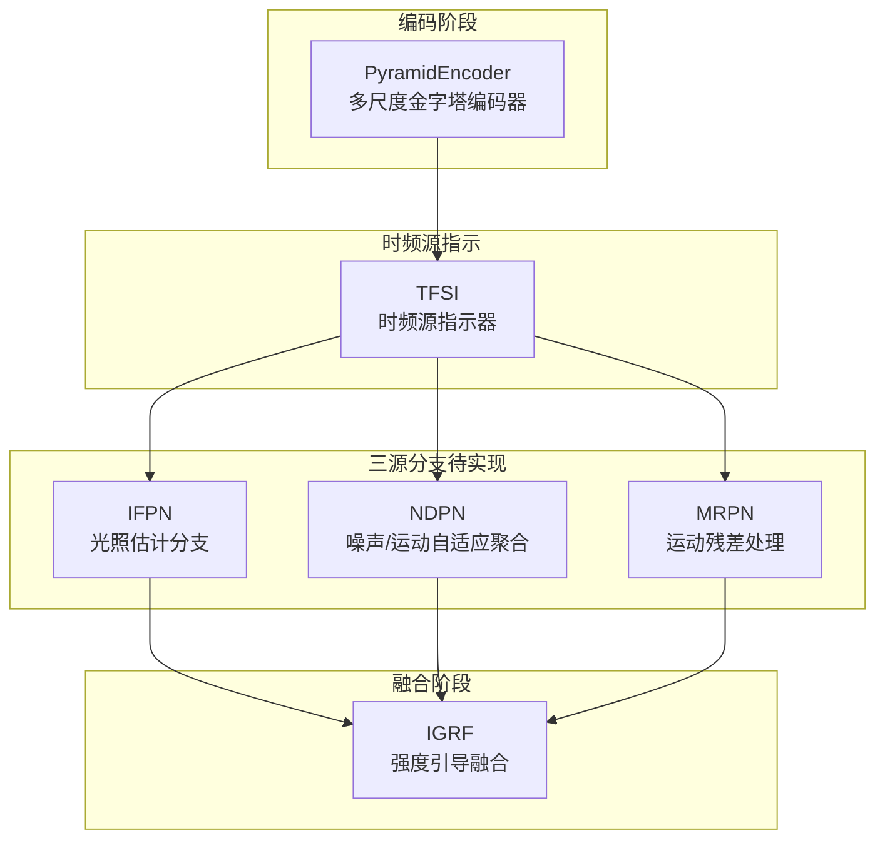
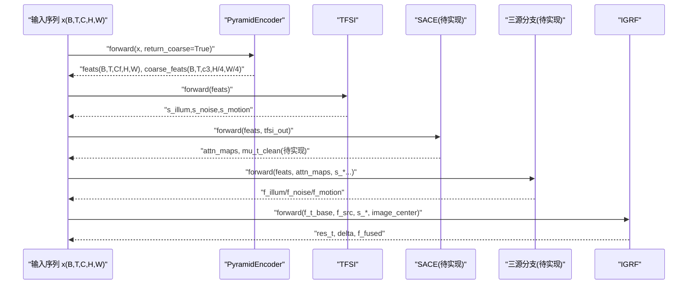
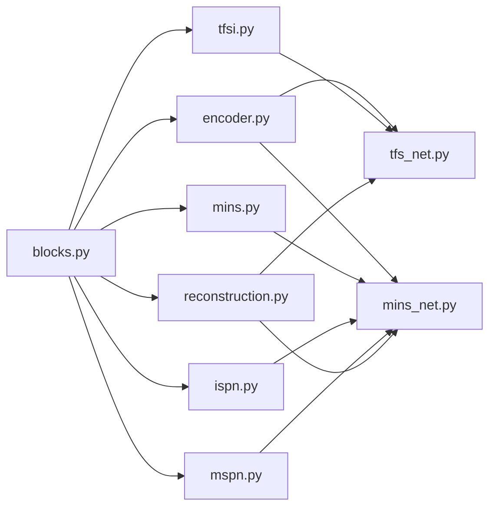

# 核心模块

<cite>
**本文引用的文件**
- [models/modules/encoder.py](file://models/modules/encoder.py)
- [models/modules/tfsi.py](file://models/modules/tfsi.py)
- [models/modules/igrf.py](file://models/modules/igrf.py)
- [models/modules/ispn.py](file://models/modules/ispn.py)
- [models/modules/mins.py](file://models/modules/mins.py)
- [models/modules/mspn.py](file://models/modules/mspn.py)
- [models/modules/reconstruction.py](file://models/modules/reconstruction.py)
- [models/modules/blocks.py](file://models/modules/blocks.py)
- [models/tfs_net.py](file://models/tfs_net.py)
- [models/mins_net.py](file://models/mins_net.py)
- [v3quest.md](file://v3quest.md)
</cite>

## 目录
1. [简介](#简介)
2. [项目结构](#项目结构)
3. [核心组件](#核心组件)
4. [架构总览](#架构总览)
5. [详细组件分析](#详细组件分析)
6. [依赖关系分析](#依赖关系分析)
7. [性能考量](#性能考量)
8. [故障排查指南](#故障排查指南)
9. [结论](#结论)
10. [附录](#附录)

## 简介
本文件面向开发者，系统性梳理并讲解 TFS-Net v3 的核心模块：PyramidEncoder、TFSI、IGRF、ISPN、MINS、MSPN。内容涵盖功能职责、数据流、接口设计、输入输出格式、参数配置、实现要点与性能特性，并提供最佳实践与排障建议。读者无需深入数学背景即可理解模块的工程实现与使用方法。

## 项目结构
核心模块位于 models/modules 目录，主干网络位于 models 目录。TFS-Net v3 的整体流程由“编码器 → TFSI → SACE（待实现）→ 三源分支（待实现）→ IGRF”构成；MINSNet 为 v2 架构，仍可作为对比参考。

图表来源
- [models/tfs_net.py:34-98](file://models/tfs_net.py#L34-L98)
- [models/modules/encoder.py:35-102](file://models/modules/encoder.py#L35-L102)
- [models/modules/tfsi.py:187-265](file://models/modules/tfsi.py#L187-L265)
- [models/modules/igrf.py:27-89](file://models/modules/igrf.py#L27-L89)

章节来源
- [models/tfs_net.py:1-181](file://models/tfs_net.py#L1-L181)
- [models/mins_net.py:11-67](file://models/mins_net.py#L11-L67)

## 核心组件
- PyramidEncoder：多尺度金字塔编码器，输出融合特征与可选的最粗尺度特征，用于后续 TFSI 与三源分支。
- TFSI：时频源指示器，从多帧特征中估计光照、噪声、运动三类退化强度图，采用空间分支与门控融合，频域分支为占位实现。
- IGRF：强度引导融合，将三源分支输出与基础特征按强度加权融合，再通过两层卷积重建增强帧。
- ISPN：在 v2 中用于光照信息的交互与细化，v3 将被 IFPN 替代。
- MINS：在 v2 中承担对应估计与熵门控，v3 将被 TFSI + SACE 替代。
- MSPN：在 v2 中承担邻居特征对齐与门控融合，v3 将被 NDPN + MRPN 替代。
- FinalReconstruction：v2 的重建头，v3 被 IGRF 替代。

章节来源
- [models/modules/encoder.py:35-102](file://models/modules/encoder.py#L35-L102)
- [models/modules/tfsi.py:187-265](file://models/modules/tfsi.py#L187-L265)
- [models/modules/igrf.py:27-89](file://models/modules/igrf.py#L27-L89)
- [models/modules/ispn.py:7-26](file://models/modules/ispn.py#L7-L26)
- [models/modules/mins.py:22-131](file://models/modules/mins.py#L22-L131)
- [models/modules/mspn.py:7-41](file://models/modules/mspn.py#L7-L41)
- [models/modules/reconstruction.py:5-24](file://models/modules/reconstruction.py#L5-L24)

## 架构总览
TFS-Net v3 的五阶段数据流如下：
- Stage 1：PyramidEncoder 提取多尺度特征并进行横向融合，可选择返回最粗尺度特征。
- Stage 2：TFSI 估计三源强度图，空间分支基于时域统计，频域分支占位。
- Stage 3：SACE（源感知对应估计）——待实现，计划引入 LFF 与可变形注意力。
- Stage 4：三源分支（IFPN/NDPN/MRPN）——待实现，分别负责光照、噪声/运动聚合与运动残差。
- Stage 5：IGRF 强度引导融合，将三源输出与基础特征加权融合并重建增强帧。

图表来源
- [models/tfs_net.py:100-181](file://models/tfs_net.py#L100-L181)
- [models/modules/encoder.py:76-102](file://models/modules/encoder.py#L76-L102)
- [models/modules/tfsi.py:217-265](file://models/modules/tfsi.py#L217-L265)
- [models/modules/igrf.py:56-89](file://models/modules/igrf.py#L56-L89)

章节来源
- [models/tfs_net.py:1-181](file://models/tfs_net.py#L1-L181)

## 详细组件分析

### PyramidEncoder（多尺度金字塔编码器）
- 功能职责
  - 对单帧或多帧图像进行多尺度特征提取，构建金字塔结构。
  - 通过横向连接与上采样融合生成细粒度融合特征。
  - 支持返回最粗尺度特征，供 IFPN 双流使用。
- 接口设计
  - 输入：单帧 (B, C, H, W) 或多帧 (B, T, C, H, W)。
  - 关键参数：in_channels、level_channels、fused_channels。
  - 输出：融合特征 (B, T, C_f, H, W)，可选返回最粗尺度特征 (B, T, c3, H/4, W/4)。
- 实现要点
  - 两个阶段 stride=2 下采样，最终分辨率为 H/4×W/4。
  - lateral 投影与 bilinear 上采样融合，最终经两层卷积稳定输出。
  - forward_single 支持 return_coarse 控制是否返回粗尺度特征。
- 性能特性
  - 计算复杂度与输入分辨率和通道数线性相关。
  - 通过横向连接减少高层语义损失，提升细节重建能力。
- 使用场景与最佳实践
  - 多帧序列输入时，建议 T 为奇数且 ≥3，确保中心帧索引唯一。
  - 若需 IFPN 双流，启用 return_coarse 获取最粗尺度特征。
- 代码片段路径
  - [PyramidEncoder.forward:76-102](file://models/modules/encoder.py#L76-L102)
  - [PyramidEncoder.forward_single:51-75](file://models/modules/encoder.py#L51-L75)

章节来源
- [models/modules/encoder.py:35-102](file://models/modules/encoder.py#L35-L102)

### TFSI（时频源指示器）
- 功能职责
  - 估计光照、噪声、运动三类退化强度图，作为后续三源分支的权重。
  - 空间分支：基于时域统计（中位值、方差、SNR）生成空间特征。
  - 频域分支：可学习频率滤波（LFF）占位，当前返回零张量。
  - 门控融合：将空间与频域特征按门控权重融合。
  - 强度输出：三个独立的 Sigmoid 强度图。
- 接口设计
  - 输入：多帧编码器特征 (B, T, C, H, W)。
  - 输出：s_illum、s_noise、s_motion，以及中间特征用于调试。
- 实现要点
  - 空间分支：对时间维计算中位值与方差，拼接后经两层卷积得到 F_s。
  - 频域分支：占位实现，返回与空间分支同形状的零张量。
  - 门控融合：Concat 后经 1×1 卷积与 sigmoid 得到门控权重。
  - 强度头：1×1 卷积输出三通道，经 sigmoid 归一到 [0,1]。
- 性能特性
  - 空间分支计算量与通道数和分辨率线性相关。
  - 频域分支当前为占位，不影响整体运行。
- 使用场景与最佳实践
  - 作为 TFS-Net v3 的第二阶段，需等待 SACE 与三源分支实现后完整串联。
  - 若仅使用空间分支，频域分支可忽略。
- 代码片段路径
  - [TFSI.forward:217-265](file://models/modules/tfsi.py#L217-L265)
  - [SpatialBranch.forward:46-77](file://models/modules/tfsi.py#L46-L77)
  - [FrequencyBranch.forward:101-114](file://models/modules/tfsi.py#L101-L114)
  - [GatedFusion.forward:133-145](file://models/modules/tfsi.py#L133-L145)
  - [IntensityHead.forward:164-184](file://models/modules/tfsi.py#L164-L184)

章节来源
- [models/modules/tfsi.py:1-265](file://models/modules/tfsi.py#L1-L265)
- [v3quest.md:12-49](file://v3quest.md#L12-L49)

### IGRF（强度引导融合）
- 功能职责
  - 将三源分支输出与基础特征按强度加权融合，再通过两层卷积重建增强帧。
  - 输出增强帧、残差修正量与融合特征，便于调试与可视化。
- 接口设计
  - 输入：基础特征 f_t_base、三源输出 f_illum/noise/motion、强度图 s_illum/noise/motion、中心帧图像。
  - 输出：增强帧 res_t、残差 delta、融合特征 f_fused。
- 实现要点
  - 强度加权融合：F_fused = s_illum·F_illum + s_noise·F_noise + s_motion·F_motion + F_base。
  - 残差重建：两层卷积 + GELU + 1×1 卷积，clamp 到 [0,1]。
- 性能特性
  - 计算量与通道数和分辨率线性相关。
  - 通过残差修正避免过度放大噪声。
- 使用场景与最佳实践
  - 作为 TFS-Net v3 的第五阶段，需在三源分支完成后接入。
  - 建议在训练时监控 s_* 强度分布，防止某一源主导。
- 代码片段路径
  - [IGRF.forward:56-89](file://models/modules/igrf.py#L56-L89)

章节来源
- [models/modules/igrf.py:1-89](file://models/modules/igrf.py#L1-L89)

### ISPN（光照交互细化）
- 功能职责
  - 在 v2 中用于光照信息的交互与细化，通过余弦相似度计算注意力并进行细化。
  - v3 将被 IFPN 替代，当前模块暂保留用于对比。
- 接口设计
  - 输入：f_t_i、f_omega_i（来自 MINS 的光照子空间特征）。
  - 输出：注意力 alpha、共享表征 L_shared、归一化比值 R_t、细化后的特征 hat_f_t_i。
- 实现要点
  - 余弦相似度 logits，softmax 得到注意力 alpha。
  - 加权求和得到共享表征 L_shared。
  - 安全除法与 ResBlock 细化，残差连接。
- 使用场景与最佳实践
  - 作为 v2 的光照分支，v3 中可直接跳过或迁移至 IFPN。
- 代码片段路径
  - [ISPN.forward:13-24](file://models/modules/ispn.py#L13-L24)

章节来源
- [models/modules/ispn.py:1-26](file://models/modules/ispn.py#L1-L26)

### MINS（对应估计与熵门控）
- 功能职责
  - v2 中承担对应估计与熵门控，将中心帧与邻居帧在窗口内进行注意力聚合。
  - 输出光照/运动两类子空间及其门控权重，供 ISPN 与 MSPN 使用。
- 接口设计
  - 输入：中心帧特征 f_t、邻居帧特征 f_omega。
  - 输出：f_t_c、f_t_m/i、f_omega_m/i、P_t_m/i、P_omega_m/i、C_t_omega、H_t 等。
- 实现要点
  - 窗口划分与注意力：对中心帧做局部平均池化，邻居帧按视频窗口聚合。
  - 熵门控：基于注意力分布的熵估计，生成门控权重 p_center_m/i。
  - 反向投影邻居门控：将中心帧门控投影回邻居帧，形成跨帧门控。
- 性能特性
  - 窗口大小影响内存与计算，窗口越大越平滑但细节损失。
  - 熵估计有助于抑制噪声区域的错误对齐。
- 使用场景与最佳实践
  - 作为 v2 的骨干模块，v3 中被 TFSI + SACE 替代。
- 代码片段路径
  - [MINSBlock.forward:62-131](file://models/modules/mins.py#L62-L131)

章节来源
- [models/modules/mins.py:1-131](file://models/modules/mins.py#L1-L131)

### MSPN（邻居对齐与门控融合）
- 功能职责
  - v2 中承担邻居特征对齐与门控融合，将邻居对齐后的特征与中心帧融合。
  - v3 将被 NDPN + MRPN 替代，当前模块暂保留用于对比。
- 接口设计
  - 输入：中心帧运动子空间 f_t_m、邻居帧运动子空间 f_omega_m、注意力矩阵 corr。
  - 输出：对齐后的邻居特征 f_omega_aligned、融合门控 G_t_m、融合后特征 f_t_m_fuse、细化后的特征 hat_f_t_m。
- 实现要点
  - 注意力对齐：corr 与邻居窗口聚合，反向还原到原分辨率。
  - 门控融合：concat 后经 sigmoid 得到门控，加权融合并残差连接细化。
- 使用场景与最佳实践
  - 作为 v2 的运动分支，v3 中可直接跳过或迁移至 NDPN/MRPN。
- 代码片段路径
  - [MSPN.forward:27-40](file://models/modules/mspn.py#L27-L40)

章节来源
- [models/modules/mspn.py:1-41](file://models/modules/mspn.py#L1-L41)

### FinalReconstruction（重建头）
- 功能职责
  - v2 的重建头，将光照与运动子空间特征按门控权重融合，再通过两层卷积重建增强帧。
  - v3 被 IGRF 替代，当前模块暂保留用于对比。
- 接口设计
  - 输入：中心帧图像、光照细化特征、运动细化特征、光照/运动门控权重。
  - 输出：增强帧、残差修正量与中间特征。
- 实现要点
  - 门控融合：p_t_i·hat_f_t_i + p_t_m·hat_f_t_m。
  - 残差重建：两层卷积 + GELU + 1×1 卷积，clamp 到 [0,1]。
- 使用场景与最佳实践
  - 作为 v2 的重建头，v3 中可直接跳过或迁移至 IGRF。
- 代码片段路径
  - [FinalReconstruction.forward:12-22](file://models/modules/reconstruction.py#L12-L22)

章节来源
- [models/modules/reconstruction.py:1-24](file://models/modules/reconstruction.py#L1-L24)

## 依赖关系分析
- 模块内依赖
  - 所有模块均依赖 blocks.py 中的基础组件：ConvBlock、ResBlock、LayerNorm2d、窗口划分与反向还原工具、安全除法与余弦相似度等。
- 网络级依赖
  - TFSNet 依赖 PyramidEncoder、TFSI、IGRF；MINSNet 依赖 PyramidEncoder、MINS、ISPN、MSPN、FinalReconstruction。
- 设计文档依赖
  - v3quest.md 明确了 TFSI 频域分支、SACE、IFPN/NDPN/MRPN 的实现缺口与参考来源。

图表来源
- [models/modules/blocks.py:1-110](file://models/modules/blocks.py#L1-L110)
- [models/modules/encoder.py:1-102](file://models/modules/encoder.py#L1-L102)
- [models/modules/tfsi.py:1-265](file://models/modules/tfsi.py#L1-L265)
- [models/modules/igrf.py:1-89](file://models/modules/igrf.py#L1-L89)
- [models/modules/ispn.py:1-26](file://models/modules/ispn.py#L1-L26)
- [models/modules/mins.py:1-131](file://models/modules/mins.py#L1-L131)
- [models/modules/mspn.py:1-41](file://models/modules/mspn.py#L1-L41)
- [models/modules/reconstruction.py:1-24](file://models/modules/reconstruction.py#L1-L24)
- [models/tfs_net.py:29-31](file://models/tfs_net.py#L29-L31)
- [models/mins_net.py:4-8](file://models/mins_net.py#L4-L8)

章节来源
- [models/modules/blocks.py:1-110](file://models/modules/blocks.py#L1-L110)
- [models/tfs_net.py:29-31](file://models/tfs_net.py#L29-L31)
- [models/mins_net.py:4-8](file://models/mins_net.py#L4-L8)

## 性能考量
- 计算复杂度
  - PyramidEncoder：与分辨率和通道数线性相关，横向融合增加少量计算。
  - TFSI：空间分支主要为卷积与统计操作，频域分支当前为占位。
  - MINS：窗口注意力与熵估计，复杂度与窗口大小成正比。
  - MSPN：注意力对齐与门控融合，复杂度与注意力矩阵规模相关。
  - IGRF：两层卷积与加权求和，线性复杂度。
- 内存占用
  - 窗口划分与注意力矩阵会显著增加显存占用，需合理设置窗口大小。
  - 多帧输入时，注意批大小与序列长度的平衡。
- 并行与加速
  - 窗口注意力可利用分块与并行化策略优化。
  - 使用混合精度训练可降低显存占用。
- 最佳实践
  - 在训练初期使用较小窗口与较短序列，逐步增大。
  - 保存中间特征与注意力图用于调试，避免不必要的大张量常驻内存。

## 故障排查指南
- 输入尺寸断言失败
  - 症状：报错提示 T 必须为奇数且 ≥3。
  - 原因：模块要求中心帧唯一。
  - 解决：确保输入序列长度为奇数且至少3。
  - 参考路径：[MINSNet.forward:22-23](file://models/mins_net.py#L22-L23)、[TFSNet.forward:116-117](file://models/tfs_net.py#L116-L117)
- 频域分支占位导致输出异常
  - 症状：频域分支输出为零张量，导致强度估计不稳定。
  - 原因：LFF 实现尚未完成。
  - 解决：暂时仅使用空间分支，或等待 LFF 实现后再启用频域分支。
  - 参考路径：[FrequencyBranch.forward:101-114](file://models/modules/tfsi.py#L101-L114)
- 通道不匹配
  - 症状：三源分支输出与 IGRF 输入通道不一致。
  - 原因：不同模块通道数不统一。
  - 解决：确保所有下游模块使用统一的融合通道数 fused_channels。
  - 参考路径：[TFSNet.__init__:48-55](file://models/tfs_net.py#L48-L55)、[MINSNet.__init__:12-18](file://models/mins_net.py#L12-L18)
- 数值稳定性
  - 症状：除零或梯度爆炸。
  - 原因：分母项未加 epsilon。
  - 解决：使用 safe_divide 与 LayerNorm2d 的 eps。
  - 参考路径：[safe_divide:97-99](file://models/modules/blocks.py#L97-L99)、[LayerNorm2d:32-44](file://models/modules/blocks.py#L32-L44)

章节来源
- [models/mins_net.py:20-38](file://models/mins_net.py#L20-L38)
- [models/tfs_net.py:100-117](file://models/tfs_net.py#L100-L117)
- [models/modules/tfsi.py:80-114](file://models/modules/tfsi.py#L80-L114)
- [models/modules/blocks.py:32-44](file://models/modules/blocks.py#L32-L44)

## 结论
TFS-Net v3 的核心模块围绕“多尺度特征提取 → 时频源指示 → 三源分支 → 强度引导融合”的流水线展开。PyramidEncoder 与 TFSI 已实现，IGRF 已可用，SACE 与三源分支尚待实现。开发者应优先完成频域分支（LFF）与 SACE 的实现，再接入 IFPN/NDPN/MRPN，最终完成端到端训练与推理。MINSNet 作为 v2 对比参考，展示了窗口注意力与熵门控的有效性。

## 附录
- 参数配置建议
  - fused_channels：建议 48，保证下游模块通道一致性。
  - window_size：建议 8，兼顾细节与效率。
  - eps：默认 1e-6，确保数值稳定。
- 推荐工作流
  - 先验证 PyramidEncoder 与 TFSI 的联合运行。
  - 实现 LFF 与 SACE 后，再接入三源分支。
  - 最终以 IGRF 完成重建，评估增强质量。