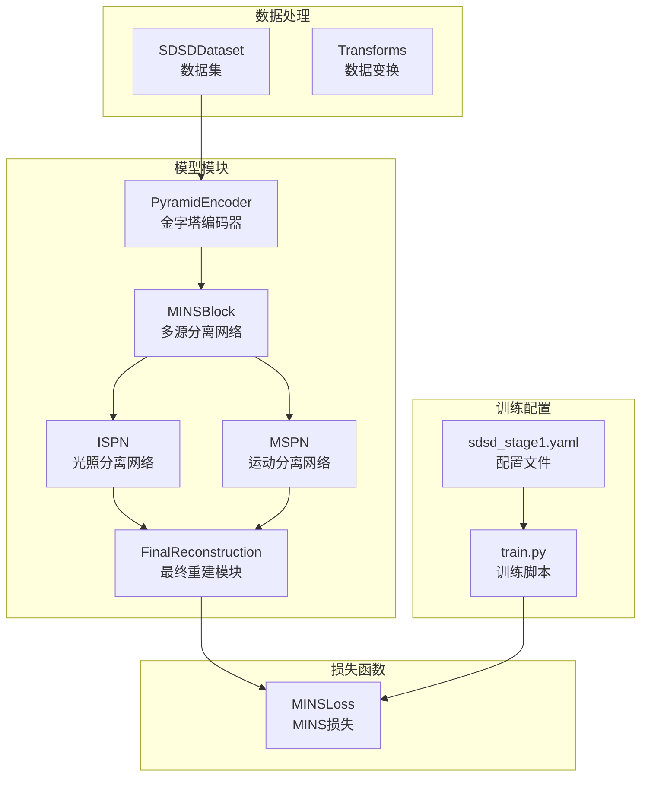
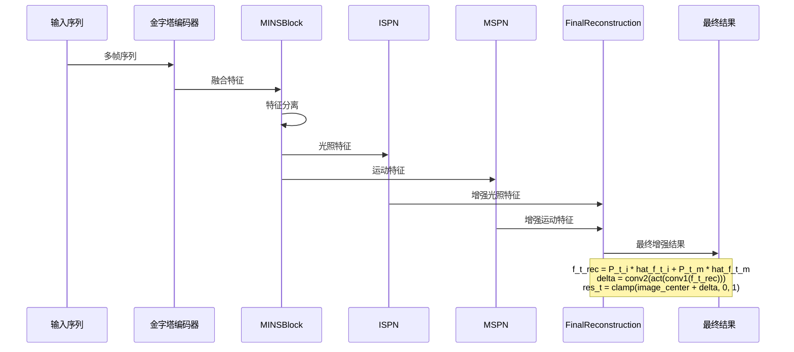
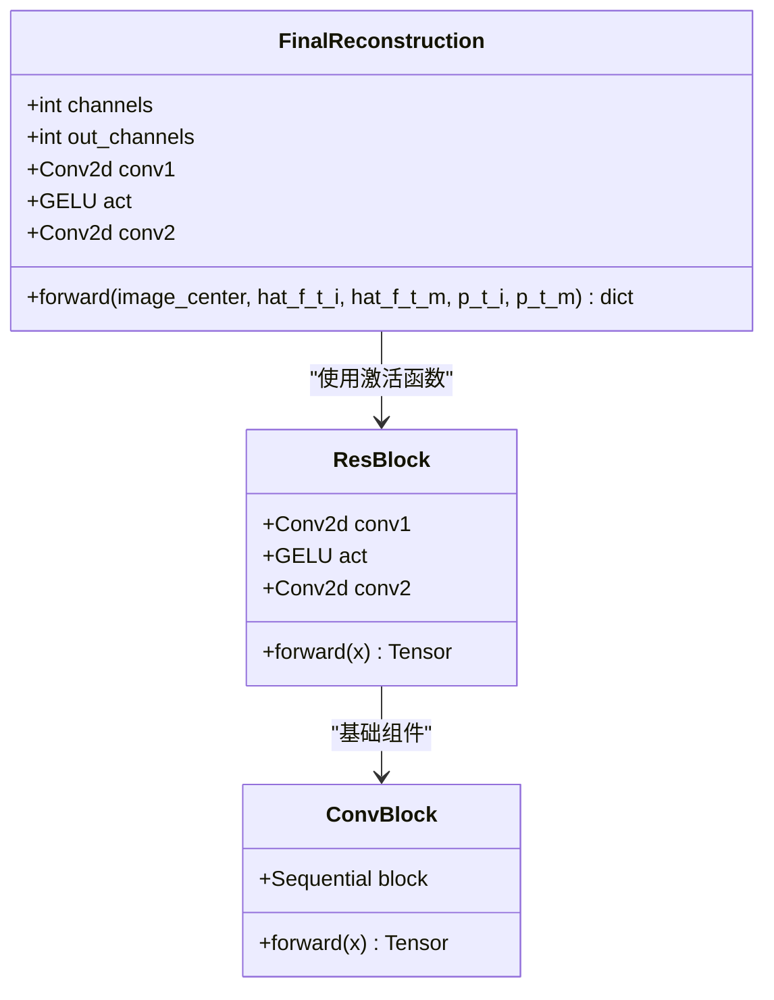
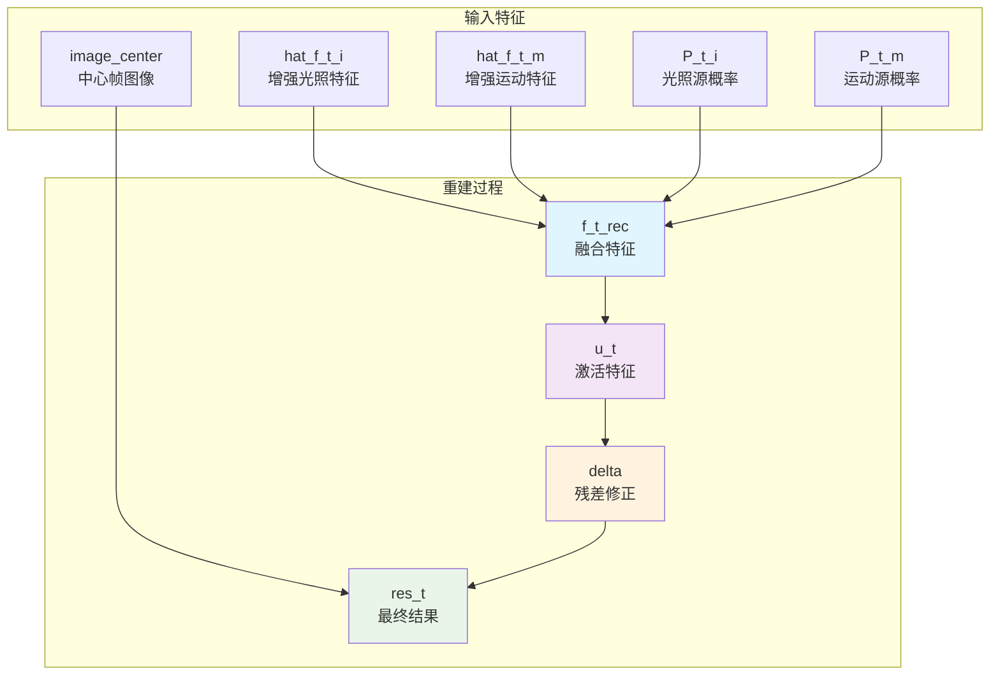
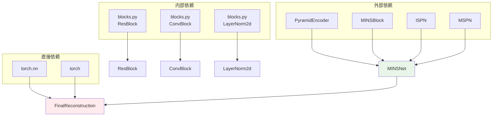

# 重建模块

<cite>
**本文档引用的文件**
- [reconstruction.py](file://models/modules/reconstruction.py)
- [mins_net.py](file://models/mins_net.py)
- [encoder.py](file://models/modules/encoder.py)
- [ispn.py](file://models/modules/ispn.py)
- [mspn.py](file://models/modules/mspn.py)
- [mins.py](file://models/modules/mins.py)
- [blocks.py](file://models/modules/blocks.py)
- [losses.py](file://losses/losses.py)
- [sdsd_dataset.py](file://datasets/sdsd_dataset.py)
- [inference.py](file://utils/inference.py)
- [sdsd_stage1.yaml](file://configs/sdsd_stage1.yaml)
- [train.py](file://train.py)
</cite>

## 目录
1. [简介](#简介)
2. [项目结构](#项目结构)
3. [核心组件](#核心组件)
4. [架构概览](#架构概览)
5. [详细组件分析](#详细组件分析)
6. [依赖关系分析](#依赖关系分析)
7. [性能考虑](#性能考虑)
8. [故障排除指南](#故障排除指南)
9. [结论](#结论)
10. [附录](#附录)

## 简介

重建模块是TFS-Net和MINSNet系统中的关键组件，负责将多源恢复特征转换为最终的增强结果。该模块实现了从多源恢复特征到最终增强结果的转换机制，通过加权融合不同来源的特征来生成高质量的重建图像。

在MINSNet架构中，重建模块位于整个处理流程的末端，接收来自ISPN（光照分离网络）和MSPN（运动分离网络）的增强特征，以及来自MINSBlock的源指示概率，通过最终的重建过程生成最终的增强结果。

## 项目结构

重建模块在项目中的位置和相关组件如下：



**图表来源**
- [mins_net.py:11-18](file://models/mins_net.py#L11-L18)
- [reconstruction.py:5-22](file://models/modules/reconstruction.py#L5-L22)
- [sdsd_dataset.py:18-81](file://datasets/sdsd_dataset.py#L18-L81)

**章节来源**
- [mins_net.py:1-67](file://models/mins_net.py#L1-L67)
- [reconstruction.py:1-24](file://models/modules/reconstruction.py#L1-L24)

## 核心组件

重建模块的核心组件包括：

### FinalReconstruction类
- **输入特征**: 来自ISPN和MSPN的增强特征
- **权重参数**: 源指示概率P_t_i和P_t_m
- **输出**: 最终增强结果res_t

### 网络架构
重建模块采用简单的两层卷积结构：
1. 第一层卷积：将输入特征映射到相同维度
2. GELU激活函数：提供非线性变换
3. 第二层卷积：输出残差修正量

**章节来源**
- [reconstruction.py:5-22](file://models/modules/reconstruction.py#L5-L22)

## 架构概览

重建模块在整个MINSNet系统中的位置和数据流如下：



**图表来源**
- [mins_net.py:20-37](file://models/mins_net.py#L20-L37)
- [reconstruction.py:12-16](file://models/modules/reconstruction.py#L12-L16)

## 详细组件分析

### FinalReconstruction类分析



**图表来源**
- [reconstruction.py:5-22](file://models/modules/reconstruction.py#L5-L22)
- [blocks.py:20-29](file://models/modules/blocks.py#L20-L29)

#### 数学公式实现

重建模块的核心数学公式：

1. **特征融合**：
   ```
   f_t_rec = P_t_i × hat_f_t_i + P_t_m × hat_f_t_m
   ```

2. **特征变换**：
   ```
   u_t = GELU(conv1(f_t_rec))
   ```

3. **残差计算**：
   ```
   delta = conv2(u_t)
   ```

4. **最终输出**：
   ```
   res_t = clamp(image_center + delta, 0.0, 1.0)
   ```

其中：
- `P_t_i` 和 `P_t_m` 是源指示概率，控制不同来源特征的权重
- `hat_f_t_i` 和 `hat_f_t_m` 是经过增强的特征
- `image_center` 是中心帧的原始图像

**章节来源**
- [reconstruction.py:12-16](file://models/modules/reconstruction.py#L12-L16)

### 组件协作关系

重建模块与各恢复分支的协作关系：



**图表来源**
- [mins_net.py:31-37](file://models/mins_net.py#L31-L37)
- [reconstruction.py:17-22](file://models/modules/reconstruction.py#L17-L22)

**章节来源**
- [mins_net.py:28-37](file://models/mins_net.py#L28-L37)

### 数据流向分析

重建模块的数据流遵循以下路径：

1. **特征接收**：接收来自ISPN和MSPN的增强特征
2. **概率加权**：根据源指示概率对特征进行加权
3. **特征变换**：通过卷积和激活函数进行特征变换
4. **残差生成**：生成残差修正量
5. **结果输出**：将残差添加到原始图像并进行裁剪

**章节来源**
- [reconstruction.py:12-16](file://models/modules/reconstruction.py#L12-L16)

## 依赖关系分析

重建模块与其他组件的依赖关系：



**图表来源**
- [reconstruction.py:1-2](file://models/modules/reconstruction.py#L1-L2)
- [mins_net.py:4-8](file://models/mins_net.py#L4-L8)

**章节来源**
- [mins_net.py:4-8](file://models/mins_net.py#L4-L8)
- [reconstruction.py:1-2](file://models/modules/reconstruction.py#L1-L2)

## 性能考虑

### 计算复杂度分析

重建模块的计算复杂度主要由以下因素决定：

1. **卷积操作**：两个3×3卷积层，参数数量相对较少
2. **特征尺寸**：输入特征通常为48通道，空间尺寸为H×W
3. **内存占用**：主要消耗在中间特征存储上

### 优化技巧

1. **混合精度训练**：使用AMP技术减少内存占用
2. **梯度检查点**：对于更复杂的重建网络可以考虑使用
3. **特征缓存**：避免重复计算相同的特征
4. **批处理优化**：合理设置batch size以平衡速度和内存

### 内存管理

重建模块的内存使用特点：
- 输入特征张量大小：B × C × H × W
- 中间特征张量大小：B × 48 × H × W
- 输出特征张量大小：B × 3 × H × W

**章节来源**
- [train.py:108-160](file://train.py#L108-L160)

## 故障排除指南

### 常见问题及解决方案

1. **数值不稳定**
   - 症状：输出出现NaN或Inf值
   - 解决方案：检查输入特征的数值范围，确保概率和特征都在合理范围内

2. **重建质量差**
   - 症状：重建结果模糊或有伪影
   - 解决方案：调整损失函数权重，检查源指示概率的合理性

3. **内存不足**
   - 症状：训练过程中OOM错误
   - 解决方案：减小batch size，使用梯度累积，启用AMP

### 调试工具

1. **特征可视化**：检查中间特征的分布
2. **损失监控**：跟踪各分量损失的变化
3. **梯度检查**：验证梯度流动情况

**章节来源**
- [train.py:126-129](file://train.py#L126-L129)

## 结论

重建模块作为MINSNet系统的关键组件，实现了从多源恢复特征到最终增强结果的高效转换。其简洁而有效的设计确保了良好的重建质量和计算效率。

通过合理的源指示概率分配和特征融合策略，重建模块能够充分利用来自不同恢复分支的信息，生成高质量的增强结果。配合系统的其他组件，形成了完整的低光图像增强解决方案。

## 附录

### 参数配置

重建模块的主要参数配置：

| 参数 | 默认值 | 说明 |
|------|--------|------|
| channels | 48 | 输入特征通道数 |
| out_channels | 3 | 输出图像通道数 |
| window_size | 8 | 窗口大小（用于邻域聚合） |

### 训练配置示例

```yaml
model:
  in_channels: 3
  level_channels: [32, 64, 96]
  fused_channels: 48
  mins_window_size: 8
```

**章节来源**
- [sdsd_stage1.yaml:11-15](file://configs/sdsd_stage1.yaml#L11-L15)