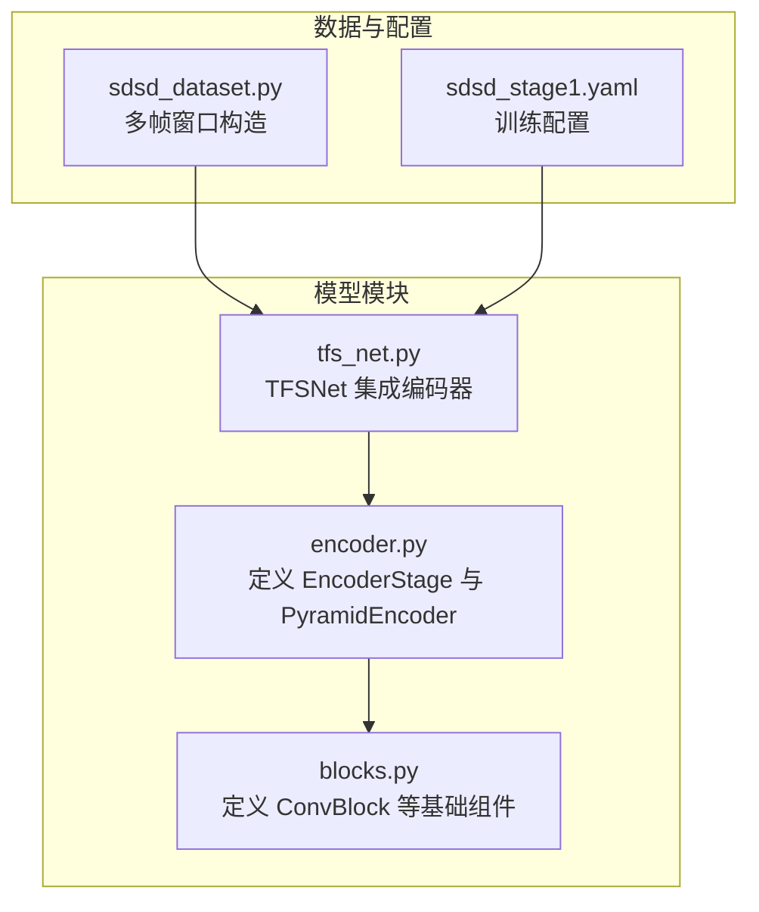
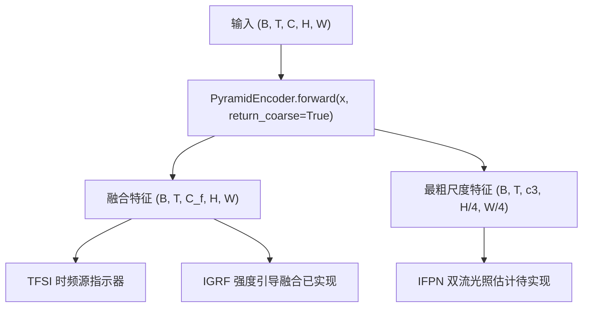
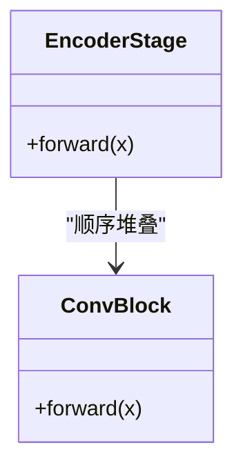
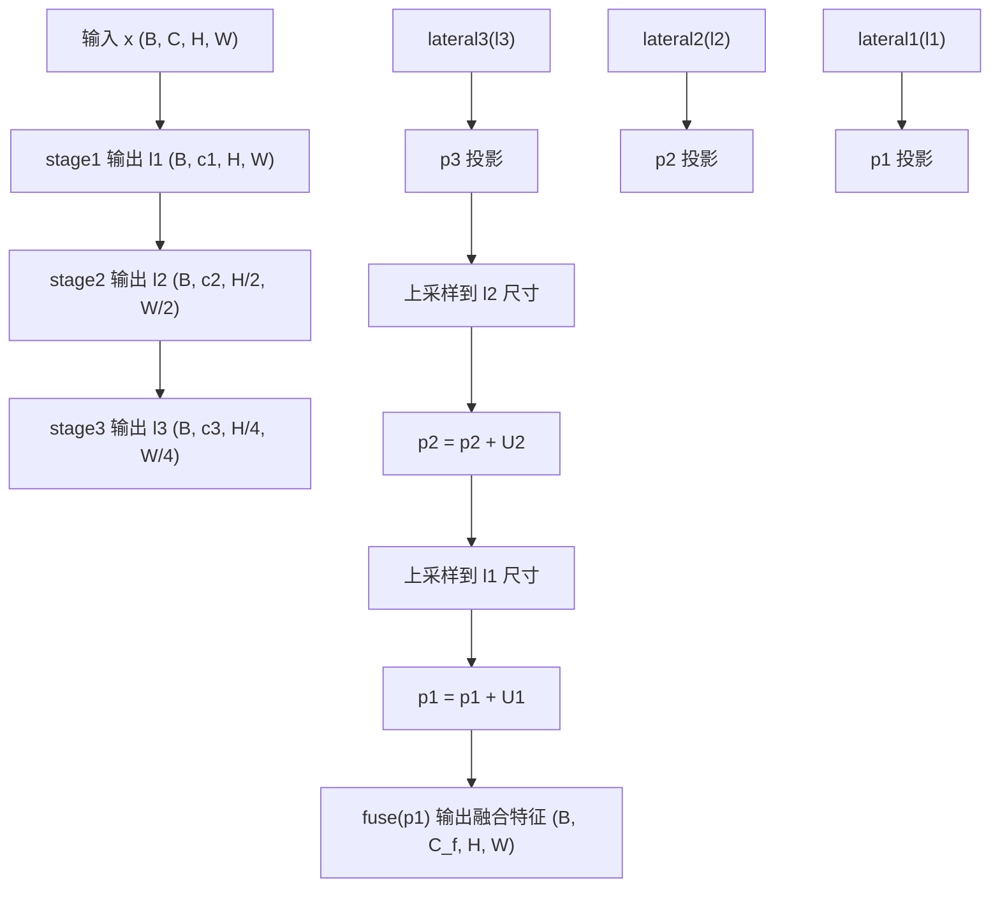
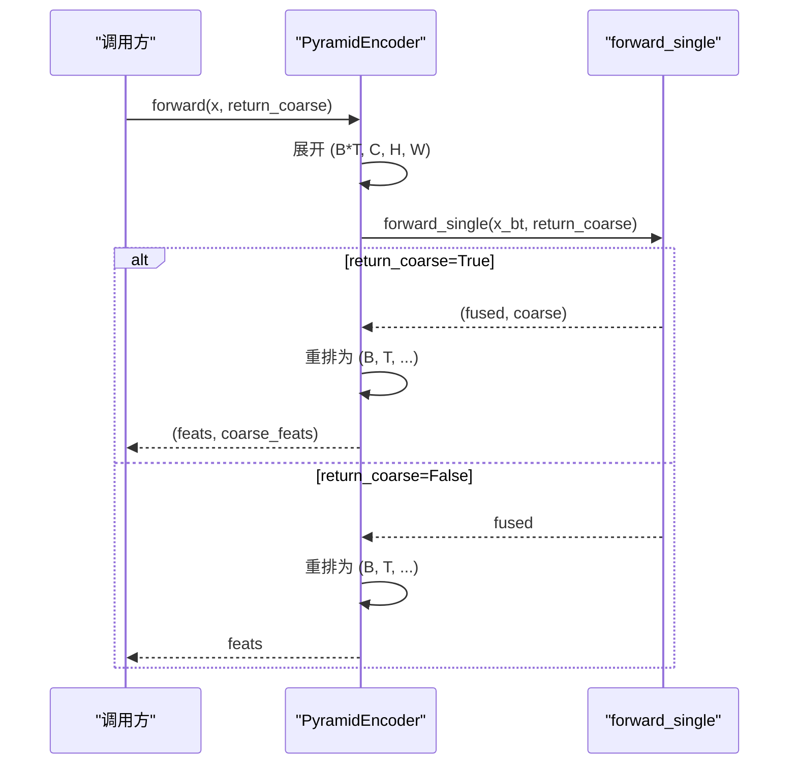
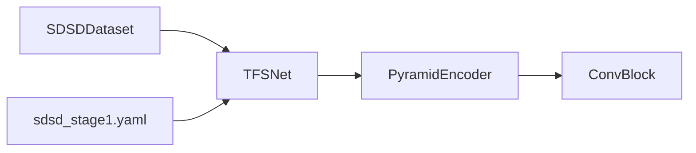

# 金字塔编码器(PyramidEncoder)

<cite>
**本文引用的文件列表**
- [encoder.py](file://models/modules/encoder.py)
- [blocks.py](file://models/modules/blocks.py)
- [tfs_net.py](file://models/tfs_net.py)
- [sdsd_dataset.py](file://datasets/sdsd_dataset.py)
- [sdsd_stage1.yaml](file://configs/sdsd_stage1.yaml)
</cite>

## 目录
1. [简介](#简介)
2. [项目结构](#项目结构)
3. [核心组件](#核心组件)
4. [架构总览](#架构总览)
5. [详细组件分析](#详细组件分析)
6. [依赖关系分析](#依赖关系分析)
7. [性能考量](#性能考量)
8. [故障排查指南](#故障排查指南)
9. [结论](#结论)
10. [附录](#附录)

## 简介
本技术文档围绕 PyramidalEncoder（多尺度金字塔编码器）展开，系统阐述其三层编码阶段（EncoderStage）的设计理念、横向连接（lateral）与特征融合策略，以及 forward_single 与 forward 的差异及 return_coarse 参数的作用。文档还给出单帧与多帧图像的使用范式、输入输出张量形状变化与通道配置说明，并提供性能优化建议与常见问题解决方案，帮助读者快速理解并正确使用该模块。

## 项目结构
与金字塔编码器相关的核心文件位于 models/modules 目录，主要包含：
- encoder.py：定义 EncoderStage 与 PyramidEncoder
- blocks.py：定义通用卷积块 ConvBlock 等基础组件
- tfs_net.py：TFSNet 主网络中对 PyramidEncoder 的集成与调用
- sdsd_dataset.py：数据集构造多帧窗口，验证编码器对 (B, T, C, H, W) 的输入格式
- sdsd_stage1.yaml：训练配置，包含 level_channels 与 fused_channels 等关键参数

图表来源
- [encoder.py:1-102](file://models/modules/encoder.py#L1-L102)
- [blocks.py:1-110](file://models/modules/blocks.py#L1-L110)
- [tfs_net.py:1-181](file://models/tfs_net.py#L1-L181)
- [sdsd_dataset.py:1-81](file://datasets/sdsd_dataset.py#L1-L81)
- [sdsd_stage1.yaml:1-34](file://configs/sdsd_stage1.yaml#L1-L34)

章节来源
- [encoder.py:1-102](file://models/modules/encoder.py#L1-L102)
- [blocks.py:1-110](file://models/modules/blocks.py#L1-L110)
- [tfs_net.py:1-181](file://models/tfs_net.py#L1-L181)
- [sdsd_dataset.py:1-81](file://datasets/sdsd_dataset.py#L1-L81)
- [sdsd_stage1.yaml:1-34](file://configs/sdsd_stage1.yaml#L1-L34)

## 核心组件
- EncoderStage：每阶段由两个卷积块组成，采用 3×3 卷积与 GELU 激活，第一层可选步幅 stride 控制下采样。
- PyramidEncoder：包含三个 EncoderStage，分别输出不同分辨率与通道数的特征；通过横向连接与上采样融合生成统一分辨率的融合特征；支持返回最粗尺度特征用于后续双流分支。

章节来源
- [encoder.py:23-49](file://models/modules/encoder.py#L23-L49)

## 架构总览
金字塔编码器在 TFSNet 中作为“共享金字塔特征提取”阶段，负责从多帧序列中提取融合特征与最粗尺度特征，供后续 TFSI、SACE、IFPN/NDPN/MRPN 与 IGRF 等阶段使用。

图表来源
- [tfs_net.py:100-122](file://models/tfs_net.py#L100-L122)
- [encoder.py:76-101](file://models/modules/encoder.py#L76-L101)

章节来源
- [tfs_net.py:62-98](file://models/tfs_net.py#L62-L98)
- [encoder.py:35-101](file://models/modules/encoder.py#L35-L101)

## 详细组件分析

### EncoderStage 设计思路
- 结构：两层卷积块，第一层可设置 stride 实现下采样，第二层保持分辨率不变。
- 作用：逐级提取更高层次语义特征，控制分辨率与通道数增长。
- 关键点：stride=1 的 stage1 保持分辨率；stride=2 的 stage2、stage3 各进行一次 2 倍下采样。

图表来源
- [encoder.py:23-32](file://models/modules/encoder.py#L23-L32)
- [blocks.py:8-17](file://models/modules/blocks.py#L8-L17)

章节来源
- [encoder.py:23-32](file://models/modules/encoder.py#L23-L32)
- [blocks.py:8-17](file://models/modules/blocks.py#L8-L17)

### 横向连接与特征融合策略
- 横向连接：对每个阶段输出使用 1×1 卷积投影到统一通道数 fused_channels。
- 上采样融合：自底向上，将高层特征通过双线性插值上采样到低层尺寸，与低层横向投影相加，再经两层卷积块融合。
- 最终输出：统一分辨率为输入分辨率，通道数为 fused_channels。

图表来源
- [encoder.py:51-74](file://models/modules/encoder.py#L51-L74)

章节来源
- [encoder.py:43-49](file://models/modules/encoder.py#L43-L49)
- [encoder.py:65-68](file://models/modules/encoder.py#L65-L68)

### forward_single 与 forward 的区别
- forward_single：接收单帧图像 (B, C, H, W)，内部执行三阶段编码与横向融合，返回融合特征；当 return_coarse=True 时额外返回最粗尺度特征 l3。
- forward：接收多帧序列 (B, T, C, H, W)，将时间维展平为批维，调用 forward_single，再将结果还原为 (B, T, C_f, H, W) 或 (B, T, c3, H/4, W/4)。

图表来源
- [encoder.py:76-101](file://models/modules/encoder.py#L76-L101)

章节来源
- [encoder.py:51-74](file://models/modules/encoder.py#L51-L74)
- [encoder.py:76-101](file://models/modules/encoder.py#L76-L101)

### return_coarse 参数的作用
- 向后兼容：当 return_coarse=False 时，接口与 v1 MINSNet 保持一致，仅返回融合特征。
- v3 扩展：当 return_coarse=True 时，额外返回最粗尺度特征 l3，用于 IFPN 双流分支等场景；当前实现假设最粗尺度特征为 stage3 直接输出（通道 c3，分辨率 H/4×W/4）。

章节来源
- [encoder.py:5-13](file://models/modules/encoder.py#L5-L13)
- [encoder.py:51-74](file://models/modules/encoder.py#L51-L74)

### 输入输出张量形状与通道配置
- 默认配置（来自训练配置）：level_channels=(32, 64, 96)，fused_channels=48。
- forward_single：
  - 输入：(B, C, H, W)
  - 输出：(B, C_f, H, W)；当 return_coarse=True 时，额外输出 (B, c3, H/4, W/4)
- forward：
  - 输入：(B, T, C, H, W)
  - 输出：(B, T, C_f, H, W)；当 return_coarse=True 时，额外输出 (B, T, c3, H/4, W/4)

章节来源
- [sdsd_stage1.yaml:12-14](file://configs/sdsd_stage1.yaml#L12-L14)
- [encoder.py:51-74](file://models/modules/encoder.py#L51-L74)
- [encoder.py:76-101](file://models/modules/encoder.py#L76-L101)

### 使用示例（路径指引）
- 单帧图像处理（forward_single）：
  - 示例路径：[forward_single 方法:51-74](file://models/modules/encoder.py#L51-L74)
- 多帧图像处理（forward）：
  - 示例路径：[forward 方法:76-101](file://models/modules/encoder.py#L76-L101)
  - 在 TFSNet 中的调用示例：[TFSNet.forward:100-122](file://models/tfs_net.py#L100-L122)
  - 数据准备示例（多帧窗口）：[SDSDDataset.__getitem__:64-80](file://datasets/sdsd_dataset.py#L64-L80)

章节来源
- [encoder.py:51-101](file://models/modules/encoder.py#L51-L101)
- [tfs_net.py:100-122](file://models/tfs_net.py#L100-L122)
- [sdsd_dataset.py:64-80](file://datasets/sdsd_dataset.py#L64-L80)

## 依赖关系分析
- 组件耦合：
  - PyramidEncoder 依赖 ConvBlock 构建卷积块。
  - TFSNet 依赖 PyramidEncoder 提供融合特征与最粗尺度特征。
- 外部依赖：
  - 训练配置通过 sdsd_stage1.yaml 提供 level_channels 与 fused_channels 等参数。
  - 数据集 SDSDDataset 提供 (B, T, C, H, W) 的输入格式。

图表来源
- [encoder.py:20-20](file://models/modules/encoder.py#L20-L20)
- [tfs_net.py:29-29](file://models/tfs_net.py#L29-L29)
- [sdsd_dataset.py:64-80](file://datasets/sdsd_dataset.py#L64-L80)
- [sdsd_stage1.yaml:11-15](file://configs/sdsd_stage1.yaml#L11-L15)

章节来源
- [encoder.py:20-20](file://models/modules/encoder.py#L20-L20)
- [tfs_net.py:29-29](file://models/tfs_net.py#L29-L29)
- [sdsd_dataset.py:64-80](file://datasets/sdsd_dataset.py#L64-L80)
- [sdsd_stage1.yaml:11-15](file://configs/sdsd_stage1.yaml#L11-L15)

## 性能考量
- 计算复杂度：
  - 三层编码阶段分别引入下采样与通道扩展，融合过程涉及多次上采样与卷积，整体复杂度随分辨率与通道数增加而上升。
- 内存占用：
  - fused_channels 与 level_channels 的选择直接影响中间特征图显存占用；可通过调整 fused_channels 与 level_channels 平衡精度与内存。
- 速度优化建议：
  - 使用合适的 fused_channels 与 level_channels，避免过高的通道数导致计算瓶颈。
  - 在推理阶段可考虑分块（tile）策略以降低显存峰值（参见配置中的 tile_size 与 tile_overlap）。
  - 若仅需融合特征且不需要最粗尺度特征，保持 return_coarse=False 以减少一次额外输出与处理。

章节来源
- [sdsd_stage1.yaml:24-27](file://configs/sdsd_stage1.yaml#L24-L27)
- [encoder.py:36-49](file://models/modules/encoder.py#L36-L49)

## 故障排查指南
- 形状不匹配错误：
  - 确认输入张量维度为 (B, T, C, H, W)，且 T 为奇数且≥3（TFSNet 断言要求）。
  - 章节来源：[tfs_net.py:115-117](file://models/tfs_net.py#L115-L117)
- 分辨率不一致：
  - 横向连接与上采样依赖不同分辨率的特征图，确保 stage2 与 stage3 的 stride=2 导致的 H/2、H/4 分辨率符合预期。
  - 章节来源：[encoder.py:61-63](file://models/modules/encoder.py#L61-L63)
- 通道数不一致：
  - lateral 投影与 fuse 块的通道数应与 fused_channels 一致；若自定义 fused_channels，请同步调整。
  - 章节来源：[encoder.py:43-49](file://models/modules/encoder.py#L43-L49)
- 返回值类型：
  - 使用 return_coarse=True 时，forward 返回二元组；否则返回单一特征张量。
  - 章节来源：[encoder.py:76-101](file://models/modules/encoder.py#L76-L101)
- 向后兼容性：
  - 若历史代码未传入 return_coarse，默认行为与 v1 MINSNet 一致。
  - 章节来源：[encoder.py:13-13](file://models/modules/encoder.py#L13-L13)

## 结论
PyramidEncoder 通过三层 EncoderStage 实现多尺度特征提取，结合横向连接与上采样融合，形成统一分辨率与通道数的融合特征，满足 TFSNet v3 的多阶段处理需求。return_coarse 参数在保持向后兼容的同时，为 IFPN 等后续模块提供了最粗尺度特征。合理配置 level_channels 与 fused_channels，可在精度与效率之间取得平衡。

## 附录
- 参数与默认值：
  - in_channels：输入通道数（默认 3，RGB）
  - level_channels：各 stage 通道数（默认 (32, 64, 96)）
  - fused_channels：融合后通道数（默认 48）
- 使用建议：
  - 在多帧任务中优先使用 forward，并开启 return_coarse=True 以获取最粗尺度特征。
  - 推理时根据硬件条件选择合适的 tile_size 与 tile_overlap，避免 OOM。

章节来源
- [encoder.py:36-36](file://models/modules/encoder.py#L36-L36)
- [sdsd_stage1.yaml:12-14](file://configs/sdsd_stage1.yaml#L12-L14)
- [tfs_net.py:48-55](file://models/tfs_net.py#L48-L55)