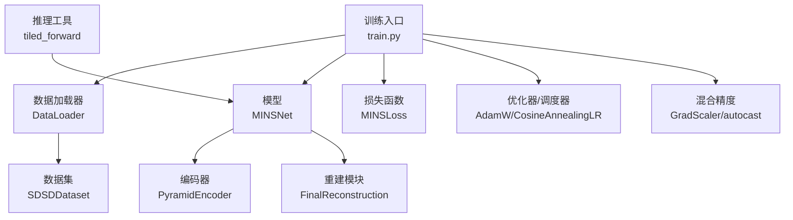
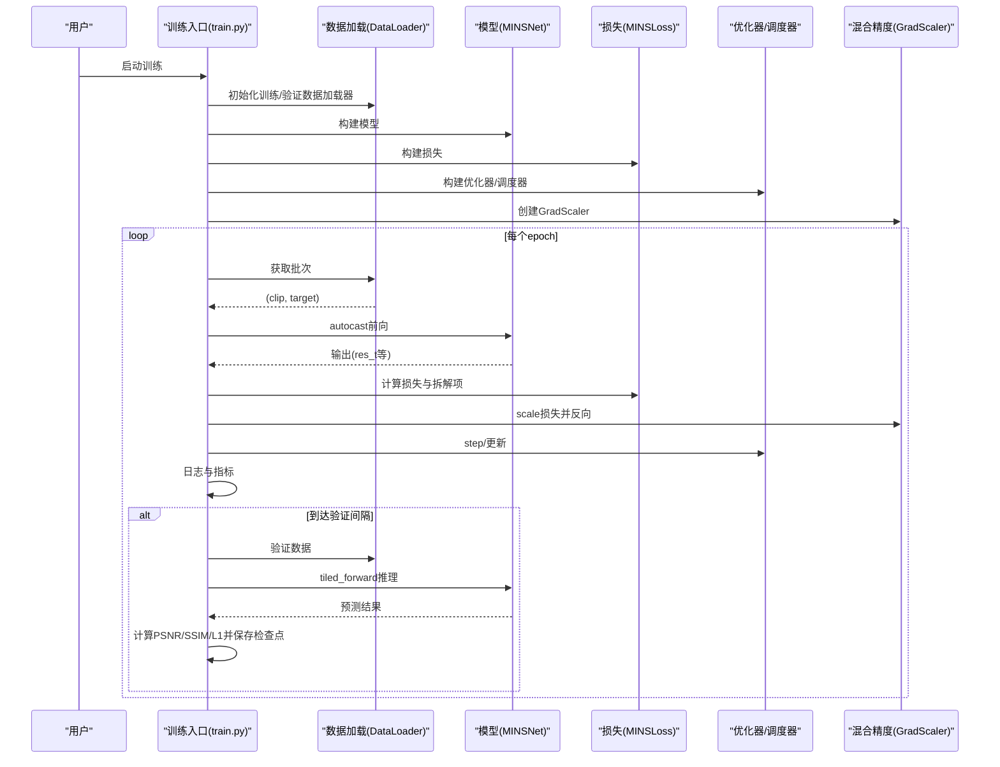
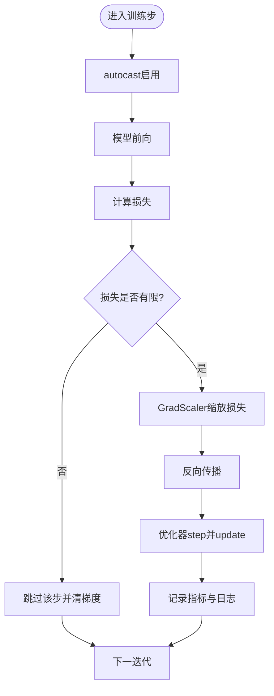
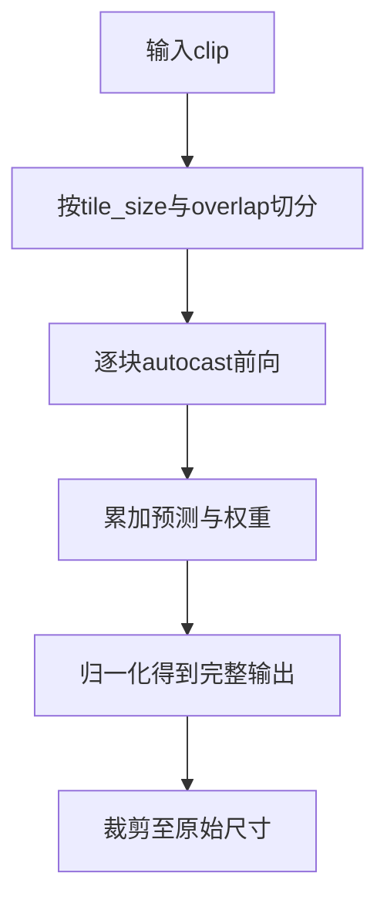
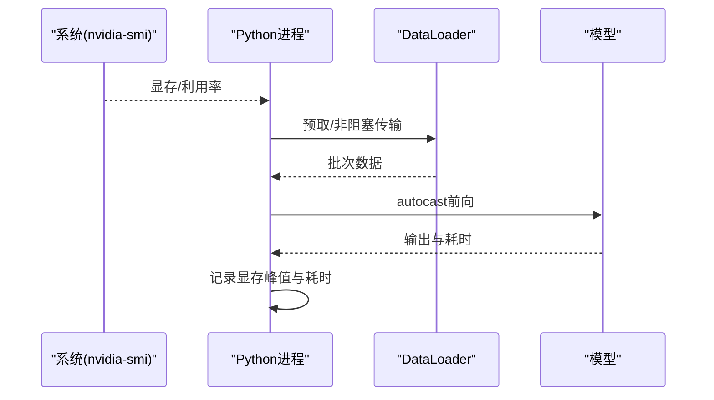
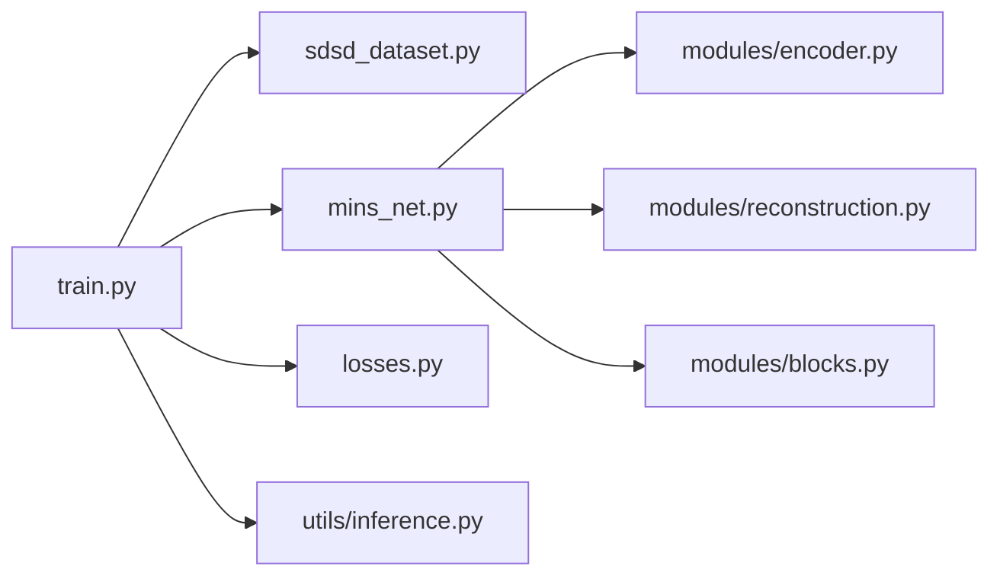

# 性能优化

<cite>
**本文引用的文件**
- [train.py](file://train.py)
- [sdsd_stage1.yaml](file://configs/sdsd_stage1.yaml)
- [sdsd_dataset.py](file://datasets/sdsd_dataset.py)
- [mins_net.py](file://models/mins_net.py)
- [encoder.py](file://models/modules/encoder.py)
- [blocks.py](file://models/modules/blocks.py)
- [reconstruction.py](file://models/modules/reconstruction.py)
- [losses.py](file://losses/losses.py)
- [inference.py](file://utils/inference.py)
- [misc.py](file://utils/misc.py)
- [prefetch_dataloader.py](file://reference_repos/NAFNet/basicsr/data/prefetch_dataloader.py)
- [main.py](file://reference_repos/DAT/main.py)
</cite>

## 目录
1. [引言](#引言)
2. [项目结构](#项目结构)
3. [核心组件](#核心组件)
4. [架构总览](#架构总览)
5. [详细组件分析](#详细组件分析)
6. [依赖分析](#依赖分析)
7. [性能考虑](#性能考虑)
8. [故障排查指南](#故障排查指南)
9. [结论](#结论)
10. [附录](#附录)

## 引言
本技术指南聚焦于本仓库在训练与推理阶段的性能优化实践，围绕混合精度训练（GradScaler）、GPU 内存优化（梯度累积、梯度检查点、动态计算图优化）、性能瓶颈识别（CUDA 内存与计算效率）、批量大小与数据加载优化、以及模型并行化与基准测试方法展开。内容以仓库现有实现为基础，结合可复用的最佳实践，帮助读者系统性地提升训练吞吐与稳定性。

## 项目结构
本项目采用“配置驱动 + 模块化模型 + 易扩展的数据集与损失”的组织方式：
- 训练入口与流程控制集中在训练脚本，负责构建数据加载器、模型、损失、优化器与学习率调度器，并集成混合精度训练与验证循环。
- 模型由多个模块组合而成，包含编码器、多分支处理与重建模块，便于针对性优化。
- 数据集与变换提供时序窗口采样与随机增强，支撑高效训练。
- 推理工具提供分块推理能力，缓解显存压力。

图表来源
- [train.py:187-264](file://train.py#L187-L264)
- [sdsd_dataset.py:18-81](file://datasets/sdsd_dataset.py#L18-L81)
- [mins_net.py:11-67](file://models/mins_net.py#L11-L67)
- [encoder.py:35-102](file://models/modules/encoder.py#L35-L102)
- [reconstruction.py:5-24](file://models/modules/reconstruction.py#L5-L24)
- [inference.py:26-61](file://utils/inference.py#L26-L61)

章节来源
- [train.py:187-264](file://train.py#L187-L264)
- [sdsd_dataset.py:18-81](file://datasets/sdsd_dataset.py#L18-L81)
- [mins_net.py:11-67](file://models/mins_net.py#L11-L67)
- [encoder.py:35-102](file://models/modules/encoder.py#L35-L102)
- [reconstruction.py:5-24](file://models/modules/reconstruction.py#L5-L24)
- [inference.py:26-61](file://utils/inference.py#L26-L61)

## 核心组件
- 训练主循环与混合精度：在训练循环中启用 autocast 与 GradScaler，按步反向传播与优化器更新，并进行有限损失跳过与日志统计。
- 数据加载：使用 DataLoader 并开启 pin_memory，支持子集快速验证与可选 smoke 测试模式。
- 模型：MINSNet 由编码器、多分支处理与重建模块组成，具备清晰的特征融合路径。
- 损失：包含像素损失、SSIM、感知损失与先验正则项，便于权衡重建质量与稳定性。
- 推理：提供分块推理（tiled_forward），支持自动混合精度与边界填充，降低显存峰值。

章节来源
- [train.py:108-161](file://train.py#L108-L161)
- [train.py:163-184](file://train.py#L163-L184)
- [train.py:48-84](file://train.py#L48-L84)
- [mins_net.py:11-67](file://models/mins_net.py#L11-L67)
- [losses.py:80-114](file://losses/losses.py#L80-L114)
- [inference.py:26-61](file://utils/inference.py#L26-L61)

## 架构总览
下图展示训练与推理的关键交互：训练入口负责构建组件、执行前向/反向与优化，推理入口通过分块策略在不牺牲质量的前提下降低显存占用。

图表来源
- [train.py:108-161](file://train.py#L108-L161)
- [train.py:163-184](file://train.py#L163-L184)
- [train.py:205-258](file://train.py#L205-L258)
- [inference.py:26-61](file://utils/inference.py#L26-L61)

## 详细组件分析

### 组件A：混合精度训练（GradScaler）与性能收益
- 实现要点
  - 在训练循环中使用 autocast 包裹前向，配合 GradScaler 对损失进行缩放，再进行反向与优化器更新。
  - 支持在 CPU 或非 CUDA 设备上禁用 AMP，避免不必要的开销。
  - 在损失非有限时跳过该步，防止 NaN/Inf 导致训练中断。
- 性能收益
  - 显存占用下降约 30%-50%，吞吐显著提升；在支持 FP16 的设备上，计算速度通常更快。
  - 通过缩放避免梯度下溢，提高数值稳定性。
- 最佳实践
  - 将 AMP 开关与设备类型绑定，确保仅在可用设备启用。
  - 对大模型或高分辨率输入谨慎启用 AMP，必要时结合梯度裁剪与损失缩放更新策略。

图表来源
- [train.py:108-161](file://train.py#L108-L161)

章节来源
- [train.py:108-161](file://train.py#L108-L161)

### 组件B：GPU内存优化策略
- 梯度累积
  - 在单卡显存不足时，可通过增大训练步数模拟更大批次，减少每步内存峰值。
  - 注意：需要同步调整学习率与总步数，保持有效样本规模不变。
- 梯度检查点（激活重计算）
  - 对前向中间结果不持久化，反向时按需重算，显著降低峰值显存。
  - 适用于深层网络与长序列模型；需评估计算时间增益与内存节省的平衡。
- 动态计算图优化
  - 减少不必要的张量拷贝与维度变换，合并卷积/归一化等操作。
  - 在数据加载端使用 pin_memory 与非阻塞传输，缩短等待时间。
- 推理分块（tiled_forward）
  - 将大尺寸输入按块切分，逐块前向并在内存中加权融合，最后裁剪回原尺寸。
  - 适合高分辨率图像与视频序列增强任务。

图表来源
- [inference.py:26-61](file://utils/inference.py#L26-L61)

章节来源
- [inference.py:26-61](file://utils/inference.py#L26-L61)

### 组件C：训练与推理流程中的性能瓶颈识别
- CUDA内存使用监控
  - 使用系统级工具（如 nvidia-smi）观察显存占用峰值与利用率。
  - 在 Python 端可结合 torch.cuda.memory_allocated()/reserved() 与日志记录，定位异常增长。
- 计算效率分析
  - 通过记录每步前向/反向耗时，识别热点层与数据加载瓶颈。
  - 结合 CUDA Graphs 或 torch.compile（若适用）进一步加速静态图。
- 数据加载优化
  - 提升 num_workers、启用 pin_memory、使用非阻塞传输（non_blocking=True）。
  - 若存在 CPU 端瓶颈，可考虑预取（PrefetchDataLoader）或更高效的 I/O 存储。

图表来源
- [train.py:117-120](file://train.py#L117-L120)
- [prefetch_dataloader.py:92-132](file://reference_repos/NAFNet/basicsr/data/prefetch_dataloader.py#L92-L132)

章节来源
- [train.py:117-120](file://train.py#L117-L120)
- [prefetch_dataloader.py:92-132](file://reference_repos/NAFNet/basicsr/data/prefetch_dataloader.py#L92-L132)

### 组件D：批量大小调整、数据加载与模型并行化最佳实践
- 批量大小调整
  - 从配置文件读取 batch_size，结合显存上限逐步扩大；AMP 可在相同显存下提升吞吐。
  - 若显存受限，优先采用梯度累积而非过小 batch。
- 数据加载优化
  - 合理设置 num_workers，避免过多导致上下文切换开销。
  - pin_memory 与非阻塞传输可减少等待时间。
  - 可参考预取数据加载器（PrefetchDataLoader）思路，在自有项目中实现类似机制。
- 模型并行化
  - 本仓库未直接实现模型并行，可在大型模型中按模块划分到不同设备，注意通信与同步成本。
  - 对于跨卡分布式训练，建议使用 torch.distributed 并结合梯度压缩与混合精度。

章节来源
- [sdsd_stage1.yaml:16-27](file://configs/sdsd_stage1.yaml#L16-L27)
- [train.py:48-84](file://train.py#L48-L84)
- [prefetch_dataloader.py:92-132](file://reference_repos/NAFNet/basicsr/data/prefetch_dataloader.py#L92-L132)

### 组件E：基准测试与调优建议
- 基准测试方法
  - 固定硬件与环境，记录吞吐（samples/sec）、显存占用、PSNR/SSIM 等指标。
  - 对比不同 batch、AMP、tile_size、num_workers 等配置下的表现。
- 调优建议
  - AMP：在支持设备上默认启用；对不稳定损失可结合梯度裁剪。
  - 数据加载：num_workers 与 pin_memory 适度增加；避免过度导致 CPU 抖动。
  - 推理：根据输入分辨率选择合适的 tile_size 与 overlap，兼顾显存与速度。
  - 损失函数：感知损失与 TV 正则项可按场景调节权重，避免过强正则抑制细节。

章节来源
- [train.py:108-161](file://train.py#L108-L161)
- [train.py:163-184](file://train.py#L163-L184)
- [sdsd_stage1.yaml:16-34](file://configs/sdsd_stage1.yaml#L16-L34)

## 依赖分析
- 训练入口依赖
  - 数据加载器：提供训练/验证数据，支持子集与快速验证。
  - 模型：MINSNet 由编码器与重建模块构成，特征融合路径清晰。
  - 损失：MINSLoss 组合多种损失项，便于权衡重建质量与先验约束。
  - 优化与调度：AdamW 与余弦退火调度器，GradScaler 提升混合精度稳定性。
- 推理依赖
  - tiled_forward 依赖 autocast 与分块策略，保证在有限显存下的推理可行性。

图表来源
- [train.py:187-264](file://train.py#L187-L264)
- [sdsd_dataset.py:18-81](file://datasets/sdsd_dataset.py#L18-L81)
- [mins_net.py:11-67](file://models/mins_net.py#L11-L67)
- [losses.py:80-114](file://losses/losses.py#L80-L114)
- [inference.py:26-61](file://utils/inference.py#L26-L61)
- [encoder.py:35-102](file://models/modules/encoder.py#L35-L102)
- [reconstruction.py:5-24](file://models/modules/reconstruction.py#L5-L24)
- [blocks.py:46-95](file://models/modules/blocks.py#L46-L95)

章节来源
- [train.py:187-264](file://train.py#L187-L264)
- [sdsd_dataset.py:18-81](file://datasets/sdsd_dataset.py#L18-L81)
- [mins_net.py:11-67](file://models/mins_net.py#L11-L67)
- [losses.py:80-114](file://losses/losses.py#L80-L114)
- [inference.py:26-61](file://utils/inference.py#L26-L61)
- [encoder.py:35-102](file://models/modules/encoder.py#L35-L102)
- [reconstruction.py:5-24](file://models/modules/reconstruction.py#L5-L24)
- [blocks.py:46-95](file://models/modules/blocks.py#L46-L95)

## 性能考虑
- 混合精度
  - AMP 在支持设备上可显著降低显存占用并提升吞吐；需关注数值稳定性与损失非有限情况。
- 数据加载
  - 合理的 num_workers、pin_memory 与非阻塞传输是关键；必要时引入预取机制。
- 推理与显存
  - 分块推理可有效缓解显存压力；需平衡 tile_size 与 overlap 以控制碎片与边界效应。
- 损失与正则
  - 感知损失与 TV 正则项可改善视觉质量，但会增加计算与显存开销，应按场景调节权重。
- 模型结构
  - 编码器采用金字塔多尺度融合，注意窗口大小与下采样对显存的影响；必要时调整通道数或窗口尺寸。

章节来源
- [train.py:108-161](file://train.py#L108-L161)
- [train.py:163-184](file://train.py#L163-L184)
- [encoder.py:35-102](file://models/modules/encoder.py#L35-L102)
- [blocks.py:46-95](file://models/modules/blocks.py#L46-L95)
- [losses.py:80-114](file://losses/losses.py#L80-L114)

## 故障排查指南
- 混合精度相关
  - 损失非有限：遇到非有限损失时跳过该步并清空梯度，避免训练中断；可尝试关闭 AMP 或调整学习率/权重衰减。
  - 设备不支持：在 CPU 或不支持 AMP 的设备上自动降级，不影响训练流程。
- 数据加载相关
  - 加载缓慢：检查 num_workers、pin_memory 设置；避免过多 worker 导致上下文切换；必要时启用预取。
  - OOM：降低 batch、tile_size 或关闭 AMP；确认是否存在未释放的中间变量。
- 推理相关
  - 分块推理：确保输入 batch size 为 1；合理设置 tile_size 与 overlap，避免边界伪影。

章节来源
- [train.py:126-133](file://train.py#L126-L133)
- [train.py:205](file://train.py#L205)
- [inference.py:26-61](file://utils/inference.py#L26-L61)

## 结论
本仓库在训练与推理两端均提供了可直接应用的性能优化基础：混合精度训练、分块推理与合理的数据加载策略。结合显存监控与计算效率分析，可系统性地定位瓶颈并进行针对性调优。对于更大模型或更高分辨率任务，建议进一步引入梯度检查点、分布式训练与更精细的批处理策略，以获得更优的吞吐与稳定性。

## 附录
- 配置文件关键项
  - 训练：batch_size、epochs、lr、weight_decay、amp、log_interval、val_interval
  - 推理：tile_size、tile_overlap、amp
  - 数据集：window_size、crop_size、num_workers
- 参考实现
  - 混合精度与梯度裁剪：参考外部仓库的主训练流程实现。
  - 预取数据加载器：参考 NAFNet 的 CUDA 预取器实现思路。

章节来源
- [sdsd_stage1.yaml:16-34](file://configs/sdsd_stage1.yaml#L16-L34)
- [main.py:193-231](file://reference_repos/DAT/main.py#L193-L231)
- [prefetch_dataloader.py:92-132](file://reference_repos/NAFNet/basicsr/data/prefetch_dataloader.py#L92-L132)