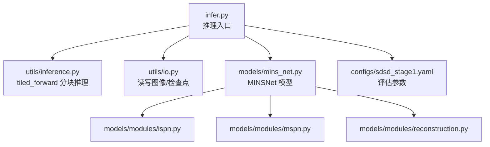
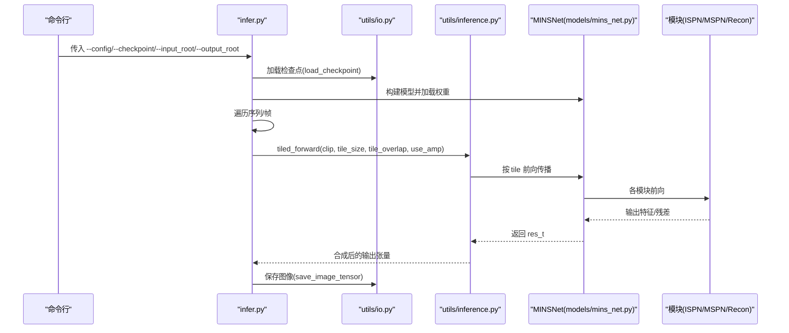
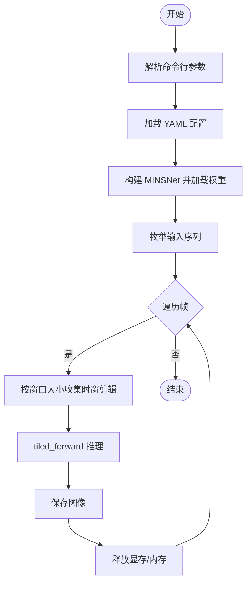
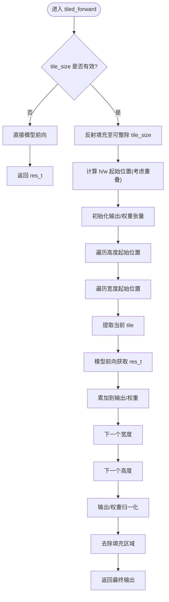
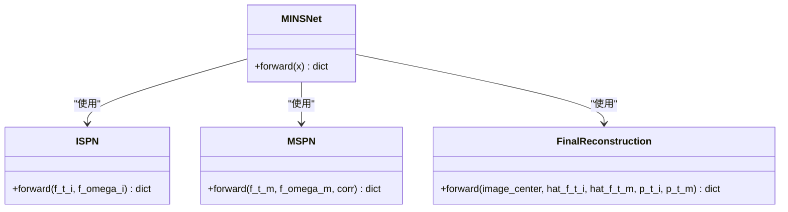
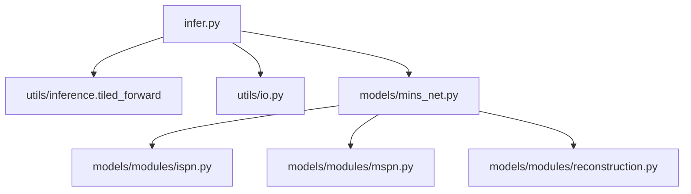

# 推理流程

<cite>
**本文引用的文件**
- [infer.py](file://infer.py)
- [utils/inference.py](file://utils/inference.py)
- [utils/io.py](file://utils/io.py)
- [models/mins_net.py](file://models/mins_net.py)
- [models/modules/reconstruction.py](file://models/modules/reconstruction.py)
- [models/modules/mspn.py](file://models/modules/mspn.py)
- [models/modules/ispn.py](file://models/modules/ispn.py)
- [configs/sdsd_stage1.yaml](file://configs/sdsd_stage1.yaml)
- [README.md](file://README.md)
</cite>

## 目录
1. [简介](#简介)
2. [项目结构](#项目结构)
3. [核心组件](#核心组件)
4. [架构总览](#架构总览)
5. [详细组件分析](#详细组件分析)
6. [依赖分析](#依赖分析)
7. [性能考虑](#性能考虑)
8. [故障排查指南](#故障排查指南)
9. [结论](#结论)
10. [附录](#附录)

## 简介
本指南面向使用推理脚本进行视频低光增强任务的用户，围绕 infer.py 的使用方法、模型加载、输入数据预处理、推理执行以及分块推理（tiled_forward）的实现原理展开，帮助您在保证精度的前提下高效完成大图像或长序列的推理。

## 项目结构
- 推理入口：infer.py
- 推理核心：utils/inference.py 中的分块推理函数 tiled_forward
- 模型定义：models/mins_net.py 及其子模块（ISPN、MSPN、FinalReconstruction）
- 输入输出工具：utils/io.py（读取图像、保存张量为图像）
- 配置文件：configs/sdsd_stage1.yaml（包含 eval.tile_size、eval.tile_overlap 等关键参数）

图表来源
- [infer.py:68-109](file://infer.py#L68-L109)
- [utils/inference.py:26-61](file://utils/inference.py#L26-L61)
- [utils/io.py:17-26](file://utils/io.py#L17-L26)
- [models/mins_net.py:11-67](file://models/mins_net.py#L11-L67)
- [models/modules/ispn.py:7-26](file://models/modules/ispn.py#L7-L26)
- [models/modules/mspn.py:7-41](file://models/modules/mspn.py#L7-L41)
- [models/modules/reconstruction.py:5-24](file://models/modules/reconstruction.py#L5-L24)
- [configs/sdsd_stage1.yaml:24-27](file://configs/sdsd_stage1.yaml#L24-L27)

章节来源
- [infer.py:68-109](file://infer.py#L68-L109)
- [configs/sdsd_stage1.yaml:24-27](file://configs/sdsd_stage1.yaml#L24-L27)

## 核心组件
- 推理入口与控制流
  - 解析命令行参数（配置路径、检查点、输入根目录、输出根目录）
  - 加载 YAML 配置并构建设备
  - 实例化 MINSNet 并加载训练好的权重
  - 遍历输入序列，按帧读取并组织时窗剪辑（window_size）
  - 调用分块推理函数 tiled_forward 执行推理
  - 将输出张量保存为图像
- 分块推理（tiled_forward）
  - 自动计算平铺起始位置（考虑重叠）
  - 对输入进行反射填充以满足整数 tile 布局
  - 在每个 tile 上运行模型，累加预测与权重，最后做归一化
  - 去除填充区域，返回原尺寸输出
- 模型与模块
  - MINSNet：编码器 + MINS + ISPN + MSPN + 最终重建
  - ISPN：时域特征对齐与融合
  - MSPN：邻域聚合与门控融合
  - FinalReconstruction：基于先验的残差重建

章节来源
- [infer.py:68-109](file://infer.py#L68-L109)
- [utils/inference.py:26-61](file://utils/inference.py#L26-L61)
- [models/mins_net.py:11-67](file://models/mins_net.py#L11-L67)
- [models/modules/ispn.py:7-26](file://models/modules/ispn.py#L7-L26)
- [models/modules/mspn.py:7-41](file://models/modules/mspn.py#L7-L41)
- [models/modules/reconstruction.py:5-24](file://models/modules/reconstruction.py#L5-L24)

## 架构总览
下图展示了从命令行到模型推理再到结果保存的整体流程。

图表来源
- [infer.py:68-109](file://infer.py#L68-L109)
- [utils/inference.py:26-61](file://utils/inference.py#L26-L61)
- [utils/io.py:17-26](file://utils/io.py#L17-L26)
- [models/mins_net.py:11-67](file://models/mins_net.py#L11-L67)
- [models/modules/ispn.py:7-26](file://models/modules/ispn.py#L7-L26)
- [models/modules/mspn.py:7-41](file://models/modules/mspn.py#L7-L41)
- [models/modules/reconstruction.py:5-24](file://models/modules/reconstruction.py#L5-L24)

## 详细组件分析

### infer.py 使用与控制流
- 命令行参数
  - --config：YAML 配置路径
  - --checkpoint：模型权重路径
  - --input_root：输入序列或帧的根目录
  - --output_root：输出根目录
- 数据读取与组织
  - 读取 RGB 图像并归一化到 [0,1]，转换为 CHW 张量
  - 支持多序列（按目录分组），若根目录即为单序列则直接使用
  - 使用 window_size 在时间维上截取中心帧及其前后帧组成剪辑
- 推理执行
  - 设备选择（CUDA/CPU）
  - 加载权重并设置 eval 模式
  - 对每帧调用 tiled_forward，并将结果保存为图像

图表来源
- [infer.py:31-109](file://infer.py#L31-L109)

章节来源
- [infer.py:31-109](file://infer.py#L31-L109)
- [README.md:17-18](file://README.md#L17-L18)

### 分块推理（tiled_forward）实现原理
- 参数与行为
  - 当 tile_size 为 None 或非正值时，直接全图推理（不切片）
  - 否则：对高度和宽度分别计算平铺起始位置，步幅为 tile_size - overlap
  - 若输入尺寸小于 tile_size，则进行反射填充至满足最小尺寸
- 计算过程
  - 初始化输出张量与权重张量
  - 遍历所有 tile，前向得到 res_t，累加到输出并计数权重
  - 归一化输出张量（避免重复累加导致的强度偏移）
  - 去除填充区域，返回原始尺寸输出
- AMP 与设备
  - use_amp 仅在 CUDA 设备上启用自动混合精度

图表来源
- [utils/inference.py:26-61](file://utils/inference.py#L26-L61)

章节来源
- [utils/inference.py:6-13](file://utils/inference.py#L6-L13)
- [utils/inference.py:16-23](file://utils/inference.py#L16-L23)
- [utils/inference.py:26-61](file://utils/inference.py#L26-L61)

### 模型与模块（MINSNet）
- 结构概览
  - 编码器：将多帧输入映射到共享特征空间
  - MINS：中心帧与邻域帧交互，生成多尺度特征与先验
  - ISPN：基于余弦相似度的时域对齐与融合
  - MSPN：邻域聚合与门控融合
  - 最终重建：基于先验与中心帧残差合成增强结果
- 关键接口
  - forward 返回字典，其中 res_t 为最终增强结果

图表来源
- [models/mins_net.py:11-67](file://models/mins_net.py#L11-L67)
- [models/modules/ispn.py:7-26](file://models/modules/ispn.py#L7-L26)
- [models/modules/mspn.py:7-41](file://models/modules/mspn.py#L7-L41)
- [models/modules/reconstruction.py:5-24](file://models/modules/reconstruction.py#L5-L24)

章节来源
- [models/mins_net.py:11-67](file://models/mins_net.py#L11-L67)
- [models/modules/ispn.py:7-26](file://models/modules/ispn.py#L7-L26)
- [models/modules/mspn.py:7-41](file://models/modules/mspn.py#L7-L41)
- [models/modules/reconstruction.py:5-24](file://models/modules/reconstruction.py#L5-L24)

## 依赖分析
- infer.py 依赖
  - utils/inference.tiled_forward：分块推理
  - utils/io.load_checkpoint / save_image_tensor：权重与结果 I/O
  - models.MINSNet：模型定义
- 分块推理依赖
  - torch.nn.functional.pad：反射填充
  - autocast：AMP（仅 CUDA）
- 模型依赖
  - 各模块内部依赖自定义的窗口划分/反划分与残差块等工具

图表来源
- [infer.py:26-28](file://infer.py#L26-L28)
- [utils/inference.py:1-3](file://utils/inference.py#L1-L3)
- [utils/io.py:17-26](file://utils/io.py#L17-L26)
- [models/mins_net.py:4-8](file://models/mins_net.py#L4-L8)

章节来源
- [infer.py:26-28](file://infer.py#L26-L28)
- [utils/inference.py:1-3](file://utils/inference.py#L1-L3)
- [utils/io.py:17-26](file://utils/io.py#L17-L26)
- [models/mins_net.py:4-8](file://models/mins_net.py#L4-L8)

## 性能考虑
- 分块大小与重叠
  - tile_size：越大单次推理吞吐越高，但显存占用越大；越小显存压力越小，但重叠区域拼接开销增加
  - tile_overlap：建议为 stride 的 25%~50%，以平衡拼接伪影与计算开销
- AMP 使用
  - use_amp 仅在 CUDA 上启用，可显著降低显存占用并提升吞吐
- 内存管理
  - 推理循环中及时删除中间变量（如 clip、output）以释放显存
- I/O 与批处理
  - 本实现 batch_size 固定为 1，适合大图像切片；若显存充足可扩展批量以提升吞吐
- 大图像最佳实践
  - 先估算单 tile 显存占用，结合 GPU 显存设定 tile_size
  - 适当增大 tile_overlap 以减少边界伪影
  - 若图像尺寸接近但略小于 tile_size，尽量通过预处理调整尺寸，减少反射填充带来的边缘效应

章节来源
- [utils/inference.py:26-61](file://utils/inference.py#L26-L61)
- [configs/sdsd_stage1.yaml:24-27](file://configs/sdsd_stage1.yaml#L24-L27)
- [infer.py:87-105](file://infer.py#L87-L105)

## 故障排查指南
- CUDA OOM（显存不足）
  - 降低 tile_size 或增大 tile_overlap（减小单 tile 占用）
  - 关闭 AMP 或切换到 CPU 推理（速度较慢）
  - 确保及时清理中间变量
- 推理结果出现边界伪影
  - 增大 tile_overlap，确保重叠区域足够覆盖模型感受野
  - 检查输入尺寸是否过小，必要时进行缩放
- 权重加载失败
  - 确认 checkpoint 路径正确且与模型结构匹配
  - 检查 map_location 设置与设备类型一致
- 输入格式问题
  - 确保输入为 RGB 图像，数值范围在 [0,1]，通道顺序为 CHW
  - 检查 window_size 是否与模型要求一致（奇数且 ≥3）

章节来源
- [utils/inference.py:26-61](file://utils/inference.py#L26-L61)
- [utils/io.py:17-26](file://utils/io.py#L17-L26)
- [infer.py:45-48](file://infer.py#L45-L48)
- [models/mins_net.py:20-22](file://models/mins_net.py#L20-L22)

## 结论
通过 infer.py 与 tiled_forward 的组合，可以在保证精度的同时高效处理大图像与长序列。合理设置 tile_size 与 tile_overlap、启用 AMP、及时释放显存，是获得稳定性能的关键。建议在实际部署前先在小样本上调试参数，再逐步扩大到完整数据集。

## 附录

### 推理命令示例
- 基本用法
  - python infer.py --config configs/sdsd_stage1.yaml --checkpoint path/to/best.pth --input_root F:/DatasetDL/SDSD/test/low-light --output_root outputs/infer
- 参数说明
  - --config：评估阶段的配置文件路径
  - --checkpoint：训练好的权重文件路径
  - --input_root：输入图像序列或帧的根目录
  - --output_root：输出图像保存目录

章节来源
- [README.md:17-18](file://README.md#L17-L18)

### 配置项与参数选择要点
- eval.tile_size：默认 256，可根据显存与图像尺寸调整
- eval.tile_overlap：默认 32，建议为 stride 的 25%~50%
- eval.amp：默认 false，建议在 CUDA 上开启以节省显存
- dataset.window_size：决定时窗大小（奇数且 ≥3），用于构造剪辑

章节来源
- [configs/sdsd_stage1.yaml:24-27](file://configs/sdsd_stage1.yaml#L24-L27)
- [models/mins_net.py:20-22](file://models/mins_net.py#L20-L22)