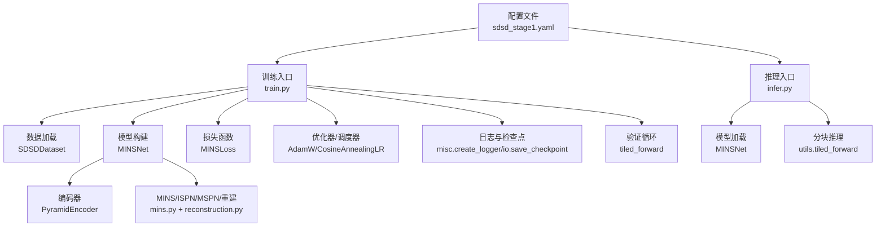
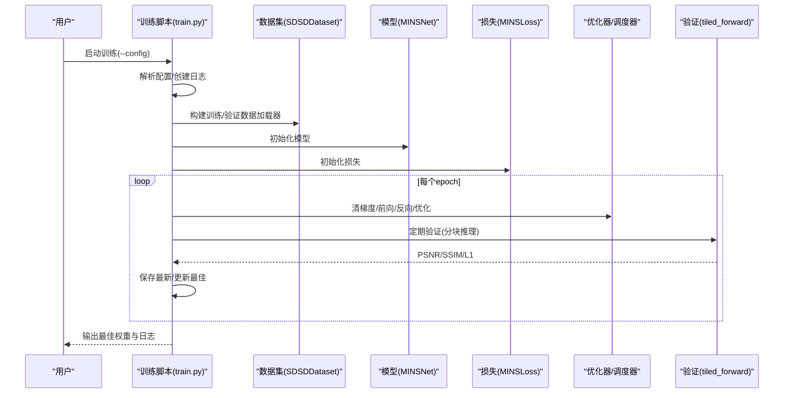
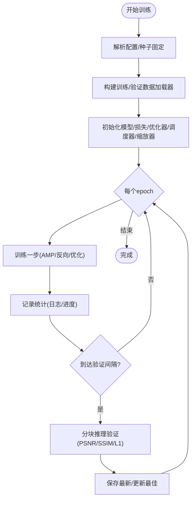
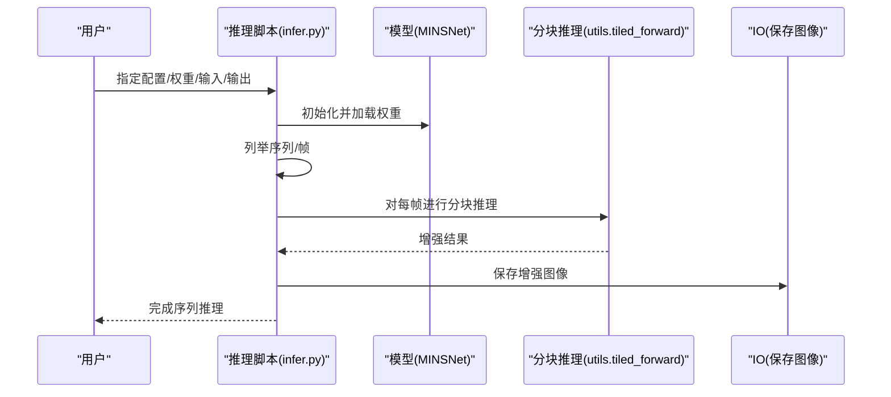
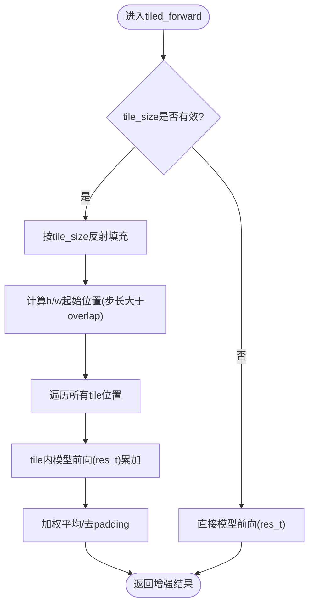
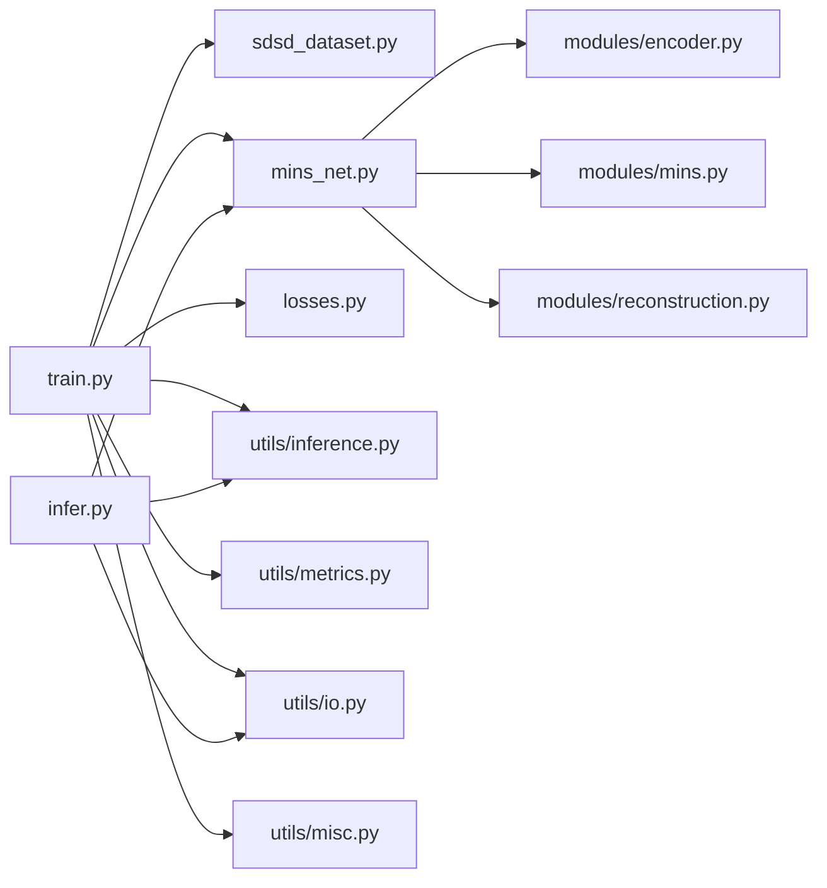

# 训练与推理

<cite>
**本文引用的文件**
- [train.py](file://train.py)
- [infer.py](file://infer.py)
- [sdsd_stage1.yaml](file://configs/sdsd_stage1.yaml)
- [README.md](file://README.md)
- [sdsd_dataset.py](file://datasets/sdsd_dataset.py)
- [mins_net.py](file://models/mins_net.py)
- [tfs_net.py](file://models/tfs_net.py)
- [inference.py](file://utils/inference.py)
- [metrics.py](file://utils/metrics.py)
- [losses.py](file://losses/losses.py)
- [io.py](file://utils/io.py)
- [misc.py](file://utils/misc.py)
- [encoder.py](file://models/modules/encoder.py)
- [mins.py](file://models/modules/mins.py)
- [reconstruction.py](file://models/modules/reconstruction.py)
</cite>

## 目录
1. [简介](#简介)
2. [项目结构](#项目结构)
3. [核心组件](#核心组件)
4. [架构总览](#架构总览)
5. [详细组件分析](#详细组件分析)
6. [依赖分析](#依赖分析)
7. [性能考虑](#性能考虑)
8. [故障排查指南](#故障排查指南)
9. [结论](#结论)
10. [附录](#附录)

## 简介
本指南面向训练与推理全流程，覆盖训练脚本使用、配置文件管理、优化器与学习率调度、损失函数与训练监控；以及推理脚本工作原理、分块推理技术与大图像处理策略。文档还提供参数调优建议、性能监控方法与结果分析路径，并给出完整可运行示例，帮助快速上手。

## 项目结构
- 训练入口：train.py
- 推理入口：infer.py
- 配置文件：configs/sdsd_stage1.yaml
- 数据集：datasets/sdsd_dataset.py
- 模型：models/mins_net.py（主模型）、models/tfs_net.py（对比性参考）
- 推理工具：utils/inference.py（分块推理）
- 指标：utils/metrics.py（PSNR/SSIM）
- 损失：losses/losses.py（像素、SSIM、感知、先验TV）
- IO与日志：utils/io.py、utils/misc.py
- 模块：models/modules/*（编码器、MINS、重建等）

图表来源
- [train.py:187-260](file://train.py#L187-L260)
- [infer.py:68-105](file://infer.py#L68-L105)
- [sdsd_dataset.py:18-81](file://datasets/sdsd_dataset.py#L18-L81)
- [mins_net.py:11-67](file://models/mins_net.py#L11-L67)
- [inference.py:26-61](file://utils/inference.py#L26-L61)
- [sdsd_stage1.yaml:1-34](file://configs/sdsd_stage1.yaml#L1-L34)

章节来源
- [README.md:12-24](file://README.md#L12-L24)
- [sdsd_stage1.yaml:1-34](file://configs/sdsd_stage1.yaml#L1-L34)

## 核心组件
- 训练脚本：负责解析配置、构建数据加载器、模型、损失、优化器与学习率调度器；执行训练与验证；周期性保存最新与最佳权重。
- 推理脚本：按序列读取输入帧，构造窗口片段，调用分块推理得到增强结果并保存。
- 数据集：SDSDDataset 支持按序列组织的多帧对齐读取、随机裁剪翻转与时间反转增强。
- 模型：MINSNet 采用金字塔编码器+MINS/ISPN/MSPN/重建流水线，输出中心帧增强结果与中间特征。
- 推理工具：tiled_forward 提供滑窗分块推理，避免显存不足。
- 指标：tensor_psnr、tensor_ssim 基于 L1 与 SSIM 映射计算。
- 损失：MINSLoss 组合像素、SSIM、感知与先验平滑项，支持可选预训练感知特征。
- IO/日志：保存检查点、图像与训练日志。

章节来源
- [train.py:108-260](file://train.py#L108-L260)
- [infer.py:68-105](file://infer.py#L68-L105)
- [sdsd_dataset.py:18-81](file://datasets/sdsd_dataset.py#L18-L81)
- [mins_net.py:11-67](file://models/mins_net.py#L11-L67)
- [inference.py:26-61](file://utils/inference.py#L26-L61)
- [metrics.py:8-18](file://utils/metrics.py#L8-L18)
- [losses.py:80-114](file://losses/losses.py#L80-L114)
- [io.py:12-26](file://utils/io.py#L12-L26)
- [misc.py:33-48](file://utils/misc.py#L33-L48)

## 架构总览
训练与推理在统一配置驱动下协同工作：训练阶段通过配置文件指定数据路径、模型与训练超参；推理阶段复用相同配置加载权重，进行分块增强。

图表来源
- [train.py:187-260](file://train.py#L187-L260)
- [sdsd_dataset.py:48-81](file://datasets/sdsd_dataset.py#L48-L81)
- [inference.py:26-61](file://utils/inference.py#L26-L61)
- [losses.py:80-114](file://losses/losses.py#L80-L114)

## 详细组件分析

### 训练脚本（train.py）
- 配置加载与命令行参数：--config 指定 YAML；--smoke 快速冒烟测试。
- 数据加载：构建训练/验证集，支持 Subset 快速验证；DataLoader 参数由配置控制。
- 模型与损失：MINSNet；MINSLoss；权重衰减与余弦退火调度。
- 训练循环：混合精度自动缩放；非有限损失跳过；定期日志记录。
- 验证循环：使用分块推理评估 PSNR/SSIM/L1；周期性保存最新与最佳权重。

图表来源
- [train.py:187-260](file://train.py#L187-L260)
- [train.py:108-161](file://train.py#L108-L161)
- [train.py:163-184](file://train.py#L163-L184)

章节来源
- [train.py:36-46](file://train.py#L36-L46)
- [train.py:48-84](file://train.py#L48-L84)
- [train.py:87-106](file://train.py#L87-L106)
- [train.py:108-161](file://train.py#L108-L161)
- [train.py:163-184](file://train.py#L163-L184)
- [train.py:187-260](file://train.py#L187-L260)

### 推理脚本（infer.py）
- 加载配置与设备；构建同构模型；加载权重；遍历序列与帧；按中心帧索引收集窗口片段；调用分块推理；保存增强结果。

图表来源
- [infer.py:68-105](file://infer.py#L68-L105)
- [inference.py:26-61](file://utils/inference.py#L26-L61)
- [io.py:21-26](file://utils/io.py#L21-L26)

章节来源
- [infer.py:31-43](file://infer.py#L31-L43)
- [infer.py:51-66](file://infer.py#L51-L66)
- [infer.py:68-105](file://infer.py#L68-L105)

### 数据集（SDSDDataset）
- 按序列目录组织，对齐输入/目标帧名；支持随机裁剪、翻转与时间反转；按窗口大小收集多帧作为 clip 的中心帧对齐 GT。

章节来源
- [sdsd_dataset.py:18-81](file://datasets/sdsd_dataset.py#L18-L81)

### 模型（MINSNet）
- 结构：金字塔编码器 → MINS（中心-邻域注意与熵门） → ISPN/MSPN → 最终重建。
- 前向：断言窗口大小为奇数且≥3；取中心帧索引；拼接除中心外的邻帧特征；输出 res_t 与中间特征字典。

章节来源
- [mins_net.py:11-67](file://models/mins_net.py#L11-L67)
- [encoder.py:35-102](file://models/modules/encoder.py#L35-L102)
- [mins.py:22-131](file://models/modules/mins.py#L22-L131)
- [reconstruction.py:5-24](file://models/modules/reconstruction.py#L5-L24)

### 损失与指标（MINSLoss、PSNR/SSIM）
- MINSLoss：组合 L1 像素误差、1-SSIM 映射、感知损失与 TV 先验平滑项；输出各项明细。
- 指标：PSNR 基于 MSE；SSIM 基于局部窗口均值/方差与 SSIM 映射。

章节来源
- [losses.py:80-114](file://losses/losses.py#L80-L114)
- [metrics.py:8-18](file://utils/metrics.py#L8-L18)

### 分块推理（tiled_forward）
- 功能：当 tile_size 有效时，对输入进行反射填充至可被 tile_size 整除，按步长滑窗切片，分别前向得到预测并加权平均，最后裁剪回原始尺寸。
- 注意：当前实现要求批大小为 1；支持 AMP；对齐 pad 与原尺寸。

图表来源
- [inference.py:26-61](file://utils/inference.py#L26-L61)

章节来源
- [inference.py:6-24](file://utils/inference.py#L6-L24)
- [inference.py:26-61](file://utils/inference.py#L26-L61)

### 配置文件（sdsd_stage1.yaml）
- 关键键值：seed、output_dir、dataset（路径、窗口、裁剪、worker）、model（通道、融合通道、窗口大小）、train（batch、epoch、lr、权重衰减、AMP、日志/验证间隔）、eval（tile、overlap、AMP）、loss（权重与感知开关）。
- 使用：训练/推理脚本均通过 YAML 加载配置；路径需与本地数据一致。

章节来源
- [sdsd_stage1.yaml:1-34](file://configs/sdsd_stage1.yaml#L1-L34)

## 依赖分析
- 训练脚本依赖：数据集、损失、模型、分块推理、指标、IO、日志与随机种子。
- 推理脚本依赖：模型、分块推理、IO。
- 模型内部依赖：编码器、MINS、ISPN、MSPN、重建模块。
- 损失依赖：感知损失（可选预训练权重）、TV 损失。
- 工具模块：日志、检查点、指标、图像 IO。

图表来源
- [train.py:27-33](file://train.py#L27-L33)
- [infer.py:26-28](file://infer.py#L26-L28)
- [mins_net.py:4-8](file://models/mins_net.py#L4-L8)

章节来源
- [train.py:27-33](file://train.py#L27-L33)
- [infer.py:26-28](file://infer.py#L26-L28)
- [mins_net.py:4-8](file://models/mins_net.py#L4-L8)

## 性能考虑
- 混合精度：启用 AMP 可显著降低显存占用与加速训练，仅在 CUDA 设备上生效。
- 分块推理：合理设置 tile_size 与 overlap，在显存与速度之间折中；overlap 过小可能导致块边界伪影，过大增加计算冗余。
- 数据加载：num_workers 与 pin_memory 可提升 IO 吞吐；crop_size 影响内存与训练稳定性。
- 学习率与调度：余弦退火在长程训练中更稳定；若出现震荡可适当降低初始学习率或增大权重衰减。
- 损失权重：感知与先验 TV 权重影响纹理细节与平滑度平衡；可根据验证集表现微调。

## 故障排查指南
- 非有限损失导致跳过：检查学习率是否过高、梯度爆炸迹象；必要时降低 lr 或启用梯度裁剪。
- 验证集 PSNR/SSIM 波动：确认 eval AMP 设置与分块 overlap 是否一致；确保验证集路径正确。
- 内存不足：减小 batch_size、tile_size 或关闭 AMP；检查是否存在未释放的张量。
- 预训练感知失败：关闭感知预训练或安装 torchvision 并确保网络可用。
- 权重加载失败：确认 checkpoint 与模型结构一致；严格模式下键名需匹配。

章节来源
- [train.py:126-129](file://train.py#L126-L129)
- [losses.py:38-71](file://losses/losses.py#L38-L71)
- [inference.py:28-30](file://utils/inference.py#L28-L30)

## 结论
本项目提供了从配置驱动到训练/推理的完整闭环：以 MINSNet 为核心，结合金字塔编码、中心-邻域注意与多源重建，配合分块推理与多损失训练，可在低光视频增强任务上取得稳健效果。通过合理调参与监控，可进一步提升质量与效率。

## 附录

### 训练操作步骤
- 安装依赖并准备数据路径。
- 编辑配置文件中的数据路径与超参。
- 启动训练：python train.py --config configs/sdsd_stage1.yaml
- 查看输出目录下的日志与检查点。

章节来源
- [README.md:12-24](file://README.md#L12-L24)
- [sdsd_stage1.yaml:1-34](file://configs/sdsd_stage1.yaml#L1-L34)

### 推理操作步骤
- 准备权重文件（如 best.pth）。
- 指定输入序列根目录与输出目录。
- 启动推理：python infer.py --config configs/sdsd_stage1.yaml --checkpoint path/to/best.pth --input_root ... --output_root ...

章节来源
- [README.md:17-18](file://README.md#L17-L18)
- [infer.py:68-105](file://infer.py#L68-L105)

### 关键参数说明（来自配置）
- 数据集：train_input_root、train_target_root、val_input_root、val_target_root、window_size、crop_size、num_workers
- 模型：in_channels、level_channels、fused_channels、mins_window_size
- 训练：batch_size、epochs、lr、weight_decay、amp、log_interval、val_interval
- 评估：tile_size、tile_overlap、amp
- 损失：lambda_pix、lambda_ssim、lambda_perc、lambda_tv、perceptual_pretrained

章节来源
- [sdsd_stage1.yaml:3-34](file://configs/sdsd_stage1.yaml#L3-L34)