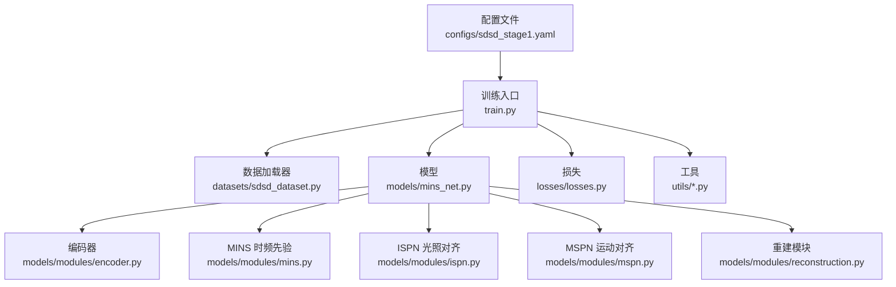
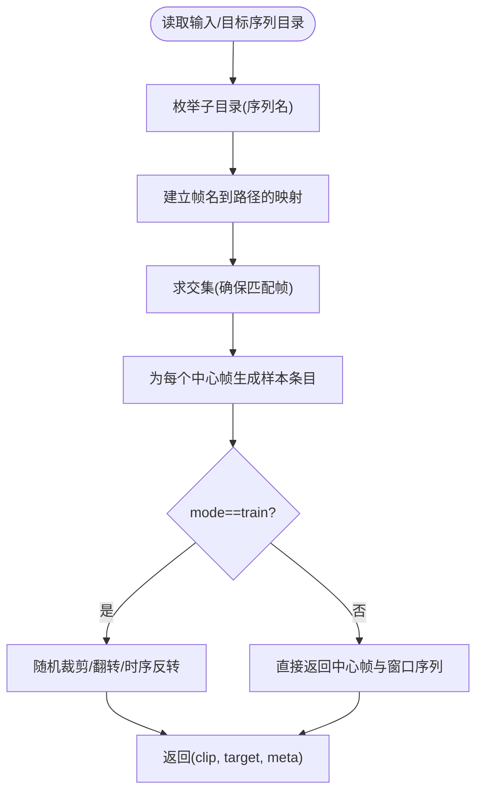
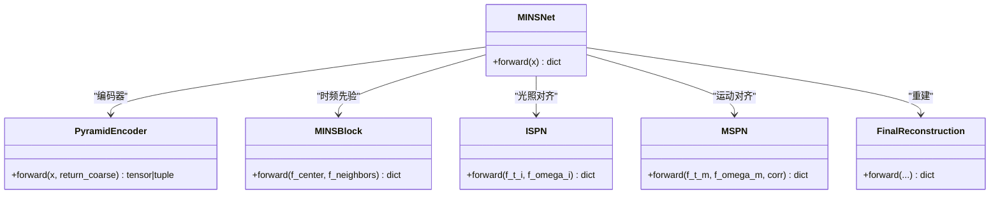
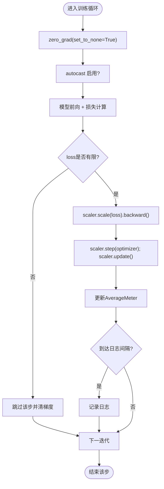
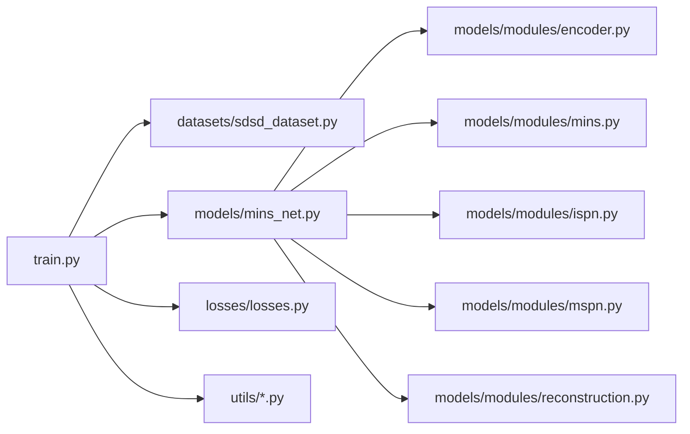

# 训练流程

<cite>
**本文引用的文件**
- [train.py](file://train.py)
- [sdsd_stage1.yaml](file://configs/sdsd_stage1.yaml)
- [sdsd_dataset.py](file://datasets/sdsd_dataset.py)
- [transforms.py](file://datasets/transforms.py)
- [mins_net.py](file://models/mins_net.py)
- [tfs_net.py](file://models/tfs_net.py)
- [losses.py](file://losses/losses.py)
- [encoder.py](file://models/modules/encoder.py)
- [mins.py](file://models/modules/mins.py)
- [ispn.py](file://models/modules/ispn.py)
- [mspn.py](file://models/modules/mspn.py)
- [reconstruction.py](file://models/modules/reconstruction.py)
- [inference.py](file://utils/inference.py)
- [metrics.py](file://utils/metrics.py)
- [misc.py](file://utils/misc.py)
</cite>

## 目录
1. [简介](#简介)
2. [项目结构](#项目结构)
3. [核心组件](#核心组件)
4. [架构总览](#架构总览)
5. [详细组件分析](#详细组件分析)
6. [依赖分析](#依赖分析)
7. [性能考虑](#性能考虑)
8. [故障排查指南](#故障排查指南)
9. [结论](#结论)
10. [附录](#附录)

## 简介
本指南面向训练流程的实施与优化，围绕 train.py 的完整训练生命周期展开，涵盖配置加载、数据集与数据加载器构建、模型初始化、损失函数与优化器配置、训练循环机制（前向/反向传播、梯度缩放、学习率调度）、混合精度训练、梯度累积策略、训练监控指标与日志记录，并提供可直接使用的训练命令示例与参数调优建议。读者无需深入的底层实现知识即可理解并高效开展训练。

## 项目结构
本项目采用“配置驱动 + 组件化模块”的组织方式：
- 配置文件：通过 YAML 文件集中管理训练超参、数据路径、评估策略等。
- 数据层：自定义视频序列数据集，按时间窗口采样并进行随机裁剪、翻转与时序反转增强。
- 模型层：MINSNet 作为主干网络，包含编码器、MINS 时频先验模块、ISPN 和 MSPN 对齐融合模块以及最终重建模块。
- 损失层：像素 L1、SSIM、感知损失与总变损失组合，支持可选预训练感知特征。
- 工具层：日志、指标计算、推理分块预测、随机种子统一等。



图表来源
- [train.py:187-264](file://train.py#L187-L264)
- [sdsd_dataset.py:18-81](file://datasets/sdsd_dataset.py#L18-L81)
- [mins_net.py:11-67](file://models/mins_net.py#L11-L67)
- [losses.py:80-114](file://losses/losses.py#L80-L114)
- [encoder.py:35-102](file://models/modules/encoder.py#L35-L102)
- [mins.py:22-131](file://models/modules/mins.py#L22-L131)
- [ispn.py:7-26](file://models/modules/ispn.py#L7-L26)
- [mspn.py:7-41](file://models/modules/mspn.py#L7-L41)
- [reconstruction.py:5-24](file://models/modules/reconstruction.py#L5-L24)

章节来源
- [train.py:187-264](file://train.py#L187-L264)
- [sdsd_stage1.yaml:1-34](file://configs/sdsd_stage1.yaml#L1-L34)

## 核心组件
- 配置加载与解析
  - 通过命令行传入配置路径，读取 YAML 并解析为字典，用于控制训练、数据、模型、损失与评估等全部参数。
- 数据加载器构建
  - 构建训练集与验证集，支持小规模烟幕测试（Subset），并配置 DataLoader 的批大小、并行线程、内存驻留与丢弃策略。
- 模型初始化
  - 基于配置实例化 MINSNet，确保输入时间窗口为奇数且≥3。
- 损失函数与优化器
  - 使用 MINSLoss 组合多任务损失；优化器为 AdamW；学习率调度器为余弦退火。
- 训练循环与监控
  - 每步前向在 autocast 下执行，使用 GradScaler 进行混合精度；反向传播后更新优化器与缩放器；周期性记录多粒度损失指标。
- 推理与评估
  - 验证阶段采用分块推理（tiled_forward）以缓解显存压力，计算 PSNR/SSIM/L1 并保存最新与最佳权重。

章节来源
- [train.py:36-46](file://train.py#L36-L46)
- [train.py:48-84](file://train.py#L48-L84)
- [train.py:87-106](file://train.py#L87-L106)
- [train.py:108-161](file://train.py#L108-L161)
- [train.py:163-185](file://train.py#L163-L185)
- [train.py:187-264](file://train.py#L187-L264)

## 架构总览
训练主流程从配置加载开始，依次完成数据准备、模型与损失初始化、优化器与调度器配置，进入多轮训练与周期性验证，期间记录日志并保存检查点。

```mermaid
sequenceDiagram
participant CLI as "命令行"
participant Train as "train.py.main()"
participant Cfg as "load_config()"
participant Data as "build_dataloaders()"
participant Model as "build_model()"
participant Loss as "build_loss()"
participant Opt as "AdamW"
participant Sch as "CosineAnnealingLR"
participant Amp as "GradScaler/autocast"
CLI->>Train : 解析参数(--config, --smoke)
Train->>Cfg : 读取YAML配置
Train->>Data : 构建训练/验证数据集与DataLoader
Train->>Model : 初始化MINSNet
Train->>Loss : 初始化MINSLoss
Train->>Opt : 创建优化器
Train->>Sch : 创建学习率调度器
loop 每个epoch
Train->>Amp : 混合精度上下文
Train->>Model : 前向计算
Train->>Loss : 计算多任务损失
Train->>Amp : 反向传播与优化器更新
Train->>Sch : 更新学习率
alt 到达验证间隔
Train->>Model : eval模式
Train->>Amp : 分块推理(tiled_forward)
Train->>Train : 计算PSNR/SSIM/L1并保存检查点
end
end
```

图表来源
- [train.py:187-264](file://train.py#L187-L264)
- [train.py:108-161](file://train.py#L108-L161)
- [train.py:163-185](file://train.py#L163-L185)
- [inference.py:26-61](file://utils/inference.py#L26-L61)

## 详细组件分析

### 配置文件与参数
- 关键字段
  - seed：随机种子，保证可复现性。
  - output_dir：日志与检查点输出目录。
  - dataset：训练/验证输入与目标根路径、时间窗口大小、裁剪尺寸、并行工作进程数。
  - model：输入通道、编码器层级通道、融合通道、MINS 窗口大小。
  - train：批大小、训练轮数、学习率、权重衰减、是否启用混合精度、日志间隔、验证间隔。
  - eval：分块推理的 tile_size、tile_overlap、是否启用混合精度。
  - loss：像素、SSIM、感知、TV 损失的权重与感知预训练开关。
- 示例路径
  - [configs/sdsd_stage1.yaml:1-34](file://configs/sdsd_stage1.yaml#L1-L34)

章节来源
- [sdsd_stage1.yaml:1-34](file://configs/sdsd_stage1.yaml#L1-L34)

### 数据加载器与数据集
- 数据集类
  - SDSDDataset：按序列名枚举输入/目标帧集合，构造样本列表；每个样本包含中心帧索引与对应路径映射。
  - 时间窗口：根据 half_window 从路径列表中收集中心帧前后若干帧，形成 (B, T, C, H, W) 序列。
  - 训练模式增强：随机裁剪、水平/垂直翻转、随机时序反转。
- DataLoader
  - 训练：shuffle=True，pin_memory=True，drop_last=False。
  - 验证：batch_size=1，便于分块推理。
  - 支持 Subset 快速验证（烟幕测试）。



图表来源
- [sdsd_dataset.py:18-81](file://datasets/sdsd_dataset.py#L18-L81)
- [transforms.py:6-32](file://datasets/transforms.py#L6-L32)

章节来源
- [sdsd_dataset.py:18-81](file://datasets/sdsd_dataset.py#L18-L81)
- [transforms.py:6-32](file://datasets/transforms.py#L6-L32)

### 模型初始化与前向流程
- 模型选择
  - MINSNet：当前训练脚本使用的主干网络，包含编码器、MINS 时频先验、ISPN 光照对齐、MSPN 运动对齐与重建模块。
  - TFSNet：另一套设计文档中的网络骨架，当前训练脚本未使用。
- 前向流程要点
  - 输入必须满足时间窗口 T 为奇数且 ≥3。
  - 编码器输出融合特征与可选最粗尺度特征，供后续模块使用。
  - MINS 产出中心帧与邻域的模态分离特征及熵门先验。
  - ISPN 与 MSPN 分别进行光照与运动对齐融合。
  - 最终重建模块将加权融合后的特征与中心帧结合得到增强结果。



图表来源
- [mins_net.py:11-67](file://models/mins_net.py#L11-L67)
- [encoder.py:35-102](file://models/modules/encoder.py#L35-L102)
- [mins.py:22-131](file://models/modules/mins.py#L22-L131)
- [ispn.py:7-26](file://models/modules/ispn.py#L7-L26)
- [mspn.py:7-41](file://models/modules/mspn.py#L7-L41)
- [reconstruction.py:5-24](file://models/modules/reconstruction.py#L5-L24)

章节来源
- [mins_net.py:11-67](file://models/mins_net.py#L11-L67)
- [encoder.py:35-102](file://models/modules/encoder.py#L35-L102)
- [mins.py:22-131](file://models/modules/mins.py#L22-L131)
- [ispn.py:7-26](file://models/modules/ispn.py#L7-L26)
- [mspn.py:7-41](file://models/modules/mspn.py#L7-L41)
- [reconstruction.py:5-24](file://models/modules/reconstruction.py#L5-L24)

### 损失函数与优化器
- 损失组成
  - 像素 L1：预测与目标的绝对误差。
  - SSIM：结构相似性映射的均值。
  - 感知损失：基于 VGG 特征的 L1 误差（可选预训练权重）。
  - 总变损失：对先验 P_t_m 与 P_t_i 的平滑约束。
- 优化器与调度器
  - 优化器：AdamW，学习率与权重衰减来自配置。
  - 学习率调度：余弦退火，周期等于总轮数。

章节来源
- [losses.py:80-114](file://losses/losses.py#L80-L114)
- [train.py:203-205](file://train.py#L203-L205)

### 训练循环与监控
- 每步流程
  - 将批次数据搬至设备；清零梯度；在 autocast 上下文中前向；若损失非有限则跳过该步；反向传播并更新优化器与 GradScaler。
  - 使用 AverageMeter 累积多粒度损失，周期性打印与记录日志。
- 验证流程
  - eval 模式；对每个样本使用分块推理；计算 L1、PSNR、SSIM；保存最新与更高 PSNR 的检查点。



图表来源
- [train.py:108-161](file://train.py#L108-L161)

章节来源
- [train.py:108-161](file://train.py#L108-L161)
- [train.py:163-185](file://train.py#L163-L185)

### 混合精度训练与梯度缩放
- 启用条件
  - 配置中 train.amp 为 true 且设备为 CUDA。
- 使用方式
  - autocast 包裹前向；GradScaler 在反向与优化步骤中配合使用；验证阶段可独立启用 eval.amp。
- 注意事项
  - 损失必须为标量；非有限损失会被跳过；分块推理同样支持 autocast。

章节来源
- [train.py:205](file://train.py#L205)
- [train.py:122-133](file://train.py#L122-L133)
- [inference.py:27-30](file://utils/inference.py#L27-L30)

### 梯度累积策略
- 当前实现
  - 训练循环未实现显式的梯度累积（如多次迭代累计后再一步优化）。
- 建议
  - 若显存受限，可在单步内增加累积步数并在反向后统一更新，或降低 batch_size、tile_size、裁剪尺寸以缓解显存压力。

章节来源
- [train.py:108-161](file://train.py#L108-L161)

### 训练监控指标
- 训练阶段
  - loss_total、loss_pix、loss_ssim、loss_perc、loss_prior。
- 验证阶段
  - val_l1、psnr、ssim。
- 日志与检查点
  - 日志同时输出到文件与控制台；周期性保存 latest.pth；当 PSNR 提升时保存 best.pth。

章节来源
- [train.py:142-152](file://train.py#L142-L152)
- [train.py:235-257](file://train.py#L235-L257)
- [misc.py:33-48](file://utils/misc.py#L33-L48)

## 依赖分析
- 组件耦合
  - train.py 与各模块松耦合，通过配置驱动；数据集与模型模块边界清晰；损失模块独立。
- 外部依赖
  - PyTorch、YAML、tqdm（可降级）、torchvision VGG（可选）。
- 潜在风险
  - 若 torchvision 不可用，感知损失会降级为零；需关注日志提示。



图表来源
- [train.py:187-264](file://train.py#L187-L264)
- [sdsd_dataset.py:18-81](file://datasets/sdsd_dataset.py#L18-L81)
- [mins_net.py:11-67](file://models/mins_net.py#L11-L67)
- [losses.py:80-114](file://losses/losses.py#L80-L114)
- [encoder.py:35-102](file://models/modules/encoder.py#L35-L102)
- [mins.py:22-131](file://models/modules/mins.py#L22-L131)
- [ispn.py:7-26](file://models/modules/ispn.py#L7-L26)
- [mspn.py:7-41](file://models/modules/mspn.py#L7-L41)
- [reconstruction.py:5-24](file://models/modules/reconstruction.py#L5-L24)

## 性能考虑
- 显存优化
  - 减少 batch_size、降低 crop_size/tile_size、关闭 eval.amp（若显存紧张）。
  - 验证阶段使用分块推理，避免一次性全图前向。
- 训练效率
  - 合理设置 num_workers、pin_memory；在 GPU 上启用 AMP。
  - 适当增大 log_interval 降低日志开销。
- 数据增强
  - 训练时的随机裁剪与翻转会引入额外计算，可根据显存与速度需求调整。

## 故障排查指南
- 损失非有限
  - 现象：日志警告并跳过该步。
  - 处理：检查学习率是否过高、AMP 是否导致数值不稳定、输入数据范围是否异常。
- 感知损失不可用
  - 现象：日志提示无法加载预训练权重或禁用感知损失。
  - 处理：安装 torchvision 或将感知权重关闭。
- 验证 PSNR 不提升
  - 现象：best.pth 长期不变。
  - 处理：检查验证集是否合理、学习率是否合适、是否过拟合；适当增加正则项权重。
- 分块推理报错
  - 现象：batch size 非 1 或 tile_size 设置不当。
  - 处理：确保验证 batch_size=1，合理设置 tile_size 与 tile_overlap。

章节来源
- [train.py:126-129](file://train.py#L126-L129)
- [losses.py:38-71](file://losses/losses.py#L38-L71)
- [train.py:235-257](file://train.py#L235-L257)
- [inference.py:26-61](file://utils/inference.py#L26-L61)

## 结论
本训练流程以配置为中心，结合 MINSNet 的端到端多任务损失与余弦退火调度，在可控的资源条件下实现了稳定的训练与评估。通过混合精度、分块推理与周期性检查点保存，既保证了效率也兼顾了鲁棒性。建议在实际部署中依据硬件条件与数据特性微调超参，持续监控训练与验证指标以获得最优性能。

## 附录

### 训练命令示例
- 正常训练
  - python train.py --config configs/sdsd_stage1.yaml
- 烟幕测试（快速验证）
  - python train.py --config configs/sdsd_stage1.yaml --smoke

章节来源
- [train.py:36-40](file://train.py#L36-L40)

### 关键参数调优建议
- 学习率与权重衰减
  - 若出现震荡或收敛缓慢，尝试降低学习率并增加权重衰减。
- 损失权重
  - 当感知损失导致过度纹理还原而噪声被抑制时，可降低 lambda_perc；当边缘细节不足时，可提高 lambda_ssim。
- 混合精度
  - AMP 可显著节省显存并加速，若出现数值不稳定可暂时关闭。
- 数据增强与裁剪
  - 增大 crop_size 有助于细节恢复，但会增加显存占用；适度翻转与时序反转可提升泛化。
- 验证策略
  - val_interval 建议每 1~5 轮验证一次，平衡效率与稳定性；若显存紧张，可增大 tile_overlap 以减少碎片，但会增加计算。