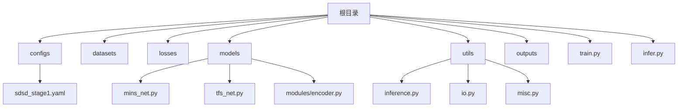
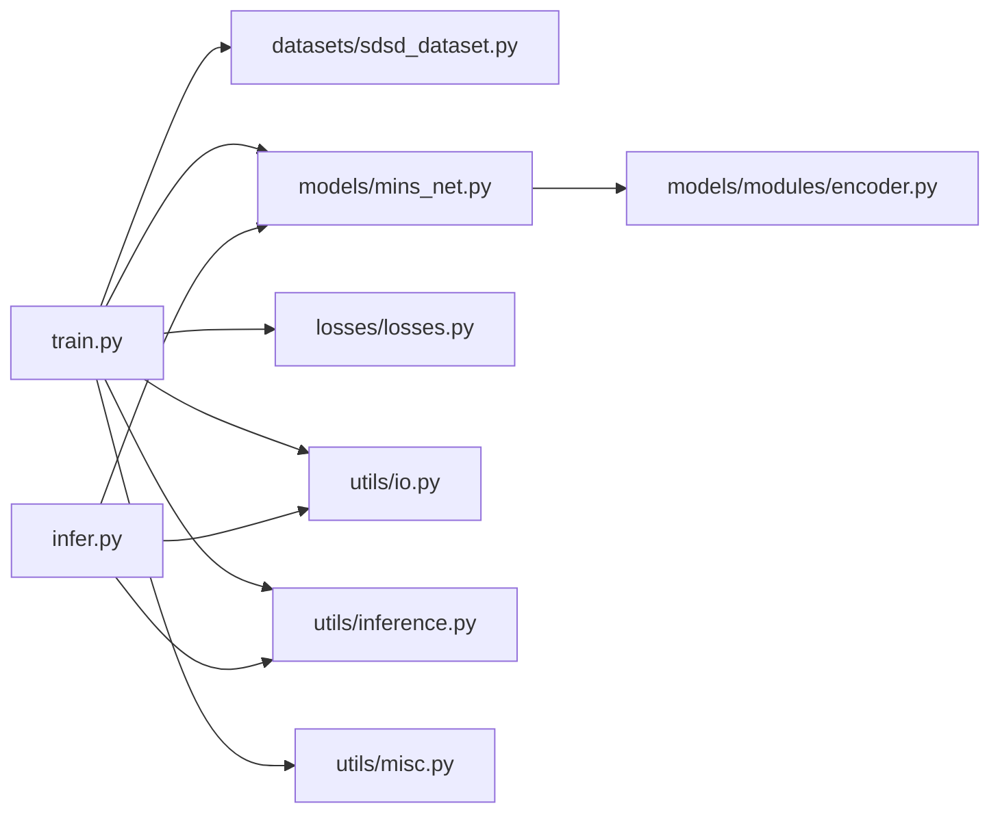

# 快速开始

<cite>
**本文引用的文件列表**
- [README.md](file://README.md)
- [requirements.txt](file://requirements.txt)
- [train.py](file://train.py)
- [infer.py](file://infer.py)
- [configs/sdsd_stage1.yaml](file://configs/sdsd_stage1.yaml)
- [datasets/sdsd_dataset.py](file://datasets/sdsd_dataset.py)
- [losses/losses.py](file://losses/losses.py)
- [models/mins_net.py](file://models/mins_net.py)
- [models/tfs_net.py](file://models/tfs_net.py)
- [models/modules/encoder.py](file://models/modules/encoder.py)
- [utils/inference.py](file://utils/inference.py)
- [utils/io.py](file://utils/io.py)
- [utils/misc.py](file://utils/misc.py)
</cite>

## 目录
1. [简介](#简介)
2. [项目结构](#项目结构)
3. [核心组件](#核心组件)
4. [架构总览](#架构总览)
5. [详细组件解析](#详细组件解析)
6. [依赖关系分析](#依赖关系分析)
7. [性能与资源建议](#性能与资源建议)
8. [故障排查](#故障排查)
9. [结论](#结论)
10. [附录](#附录)

## 简介
本指南面向首次接触 TFS-Net（MINS-Net 的首个可运行版本）的新手开发者，帮助你在本地快速完成环境准备、依赖安装、配置修改、训练启动与推理执行，并获得第一次成功的训练与推理结果。项目专注于 SDSD 数据集上的视频低光增强，提供从配置到训练再到推理的完整流程。

## 项目结构
仓库采用按功能分层的组织方式：
- 根目录包含入口脚本、配置文件与输出目录
- configs 存放 YAML 配置
- datasets 提供数据集封装与变换
- losses 定义损失函数
- models 包含网络主干与子模块
- utils 提供通用工具（日志、IO、推理切片等）
- outputs 存放训练与推理产物



图表来源
- [train.py:1-264](file://train.py#L1-L264)
- [infer.py:1-109](file://infer.py#L1-L109)
- [configs/sdsd_stage1.yaml:1-34](file://configs/sdsd_stage1.yaml#L1-L34)
- [models/mins_net.py:1-67](file://models/mins_net.py#L1-L67)
- [models/tfs_net.py:1-181](file://models/tfs_net.py#L1-L181)
- [models/modules/encoder.py:1-102](file://models/modules/encoder.py#L1-L102)
- [utils/inference.py:1-61](file://utils/inference.py#L1-L61)
- [utils/io.py:1-27](file://utils/io.py#L1-L27)
- [utils/misc.py:1-49](file://utils/misc.py#L1-L49)

章节来源
- [README.md:1-24](file://README.md#L1-L24)
- [requirements.txt:1-8](file://requirements.txt#L1-L8)

## 核心组件
- 训练入口：通过命令行加载配置并驱动训练循环，包含数据加载、模型构建、损失计算、优化器与学习率调度、混合精度、验证与检查点保存。
- 推理入口：加载预训练权重，对输入序列进行滑窗增强，支持混合精度与内存切片，输出增强后的图像。
- 数据集：SDSD 数据集适配，支持窗口采样、随机裁剪、翻转与时序反转等增强。
- 模型：MINS-Net 主干，包含金字塔编码器、MINS/ISPN/MSPN/重建流水线。
- 损失：像素 L1、SSIM、感知损失与先验平滑正则。
- 工具：日志记录、检查点 IO、推理切片与指标计算辅助。

章节来源
- [train.py:36-264](file://train.py#L36-L264)
- [infer.py:31-109](file://infer.py#L31-L109)
- [datasets/sdsd_dataset.py:18-81](file://datasets/sdsd_dataset.py#L18-L81)
- [models/mins_net.py:11-67](file://models/mins_net.py#L11-L67)
- [losses/losses.py:80-114](file://losses/losses.py#L80-L114)
- [utils/inference.py:26-61](file://utils/inference.py#L26-L61)
- [utils/io.py:12-27](file://utils/io.py#L12-L27)
- [utils/misc.py:33-49](file://utils/misc.py#L33-L49)

## 架构总览
下面的图展示了从命令行到数据、模型、损失与日志的端到端流程。

```mermaid
sequenceDiagram
participant CLI as "命令行"
participant Train as "train.py"
participant DS as "SDSDDataset"
participant Net as "MINSNet"
participant Loss as "MINSLoss"
participant Opt as "AdamW+CosineAnnealingLR"
participant AMP as "GradScaler/Autocast"
participant Log as "Logger"
participant CKPT as "Checkpoint IO"
CLI->>Train : 解析参数(--config, --smoke)
Train->>Train : 加载配置(load_config)
Train->>DS : 构建训练/验证数据集
Train->>Net : 初始化模型(MINSNet)
Train->>Loss : 初始化损失(MINSLoss)
Train->>Opt : 创建优化器与调度器
loop 每个epoch
Train->>AMP : 启用混合精度(可选)
Train->>Net : 前向(clip)
Train->>Loss : 计算loss与分解项
Train->>Opt : 反向传播与优化
Train->>Log : 记录统计信息
alt 到达验证间隔
Train->>Net : 验证(tiled_forward)
Train->>CKPT : 保存latest.pth与best.pth
end
end
```

图表来源
- [train.py:187-264](file://train.py#L187-L264)
- [datasets/sdsd_dataset.py:18-81](file://datasets/sdsd_dataset.py#L18-L81)
- [models/mins_net.py:11-67](file://models/mins_net.py#L11-L67)
- [losses/losses.py:80-114](file://losses/losses.py#L80-L114)
- [utils/inference.py:26-61](file://utils/inference.py#L26-L61)
- [utils/io.py:12-27](file://utils/io.py#L12-L27)
- [utils/misc.py:33-49](file://utils/misc.py#L33-L49)

## 详细组件解析

### 环境与依赖
- Python 版本：建议使用 Python 3.8+（具体以项目依赖为准）
- 依赖包：torch、torchvision、Pillow、PyYAML、numpy、tqdm
- CUDA：若需要 GPU 训练，请确保安装与你的 PyTorch 对应的 CUDA 版本

安装步骤
- 创建虚拟环境并激活
- 安装依赖：pip install -r requirements.txt

章节来源
- [requirements.txt:1-8](file://requirements.txt#L1-L8)
- [README.md:12-13](file://README.md#L12-L13)

### 配置文件修改
- 默认配置位于 configs/sdsd_stage1.yaml
- 关键路径与超参包括：
  - 数据集路径：训练/验证输入与目标根目录
  - 窗口大小与裁剪尺寸
  - 模型通道与窗口大小
  - 训练批大小、学习率、权重衰减、周期、日志与验证间隔
  - 推理切片尺寸与重叠
  - 损失权重与感知损失是否使用预训练特征

修改建议
- 将训练/验证路径指向你本地的 SDSD 数据集目录
- 如显存不足，适当降低 batch_size、tile_size 并开启 eval.amp
- 若感知损失下载失败或不需要，保持 perceptual_pretrained=false

章节来源
- [configs/sdsd_stage1.yaml:1-34](file://configs/sdsd_stage1.yaml#L1-L34)
- [README.md:20-23](file://README.md#L20-L23)

### 训练启动
- 基本命令
  - python train.py --config configs/sdsd_stage1.yaml
  - 烟雾测试（快速验证）：添加 --smoke
- 关键参数
  - --config：指定 YAML 配置路径
  - --smoke：启用“烟雾测试”，仅跑少量样本验证流程
- 输出
  - 日志文件：logs 写入 output_dir/train.log
  - 检查点：latest.pth 与 best.pth 保存在 output_dir

章节来源
- [README.md:15-16](file://README.md#L15-L16)
- [train.py:36-41](file://train.py#L36-L41)
- [train.py:187-264](file://train.py#L187-L264)
- [utils/misc.py:33-49](file://utils/misc.py#L33-L49)
- [utils/io.py:12-18](file://utils/io.py#L12-L18)

### 推理执行
- 基本命令
  - python infer.py --config configs/sdsd_stage1.yaml --checkpoint path/to/best.pth --input_root PATH_TO_TEST_LOW_LIGHT --output_root outputs/infer
- 关键参数
  - --config：推理配置路径
  - --checkpoint：预训练权重路径
  - --input_root：测试低光序列根目录（支持多序列）
  - --output_root：输出增强结果根目录
- 流程要点
  - 自动遍历输入序列中的帧
  - 使用滑窗与混合精度进行增强
  - 保存增强后的 RGB 图像

章节来源
- [README.md:17-18](file://README.md#L17-L18)
- [infer.py:31-109](file://infer.py#L31-L109)
- [utils/inference.py:26-61](file://utils/inference.py#L26-L61)
- [utils/io.py:21-27](file://utils/io.py#L21-L27)

### 数据集与变换
- SDSDDataset
  - 支持按序列读取，自动对齐输入/目标帧名
  - 训练模式下支持随机裁剪、水平翻转与时序反转
  - 通过 window_size 生成多帧窗口，中心帧作为目标
- 变换
  - random_crop_pair、random_flip_pair、random_time_reverse

章节来源
- [datasets/sdsd_dataset.py:18-81](file://datasets/sdsd_dataset.py#L18-L81)

### 模型与模块
- MINSNet
  - 编码器：金字塔编码器，输出融合特征与可选最粗尺度特征
  - MINS/ISPN/MSPN/重建：多阶段特征处理与最终重建
  - 前向返回 res_t、delta 以及中间特征与先验
- TFSNet（当前未实现 SACE/IFPN/NDPN/MRPN）
  - 保留接口，当前会抛出 NotImplementedError（SACE）

章节来源
- [models/mins_net.py:11-67](file://models/mins_net.py#L11-L67)
- [models/tfs_net.py:34-181](file://models/tfs_net.py#L34-L181)
- [models/modules/encoder.py:35-102](file://models/modules/encoder.py#L35-L102)

### 损失函数
- MINSLoss
  - 组合 L1 像素误差、SSIM、感知损失与先验平滑正则
  - 可配置权重与感知损失是否使用预训练特征

章节来源
- [losses/losses.py:80-114](file://losses/losses.py#L80-L114)

### 推理切片与 IO
- tiled_forward
  - 将大图切片，避免显存不足，最后拼接平均
  - 支持混合精度
- IO 工具
  - 保存检查点、加载检查点、保存图像张量

章节来源
- [utils/inference.py:26-61](file://utils/inference.py#L26-L61)
- [utils/io.py:12-27](file://utils/io.py#L12-L27)

## 依赖关系分析


图表来源
- [train.py:27-33](file://train.py#L27-L33)
- [infer.py:26-28](file://infer.py#L26-L28)
- [models/mins_net.py:4-8](file://models/mins_net.py#L4-L8)
- [models/modules/encoder.py:20](file://models/modules/encoder.py#L20)

章节来源
- [train.py:27-33](file://train.py#L27-L33)
- [infer.py:26-28](file://infer.py#L26-L28)
- [models/mins_net.py:4-8](file://models/mins_net.py#L4-L8)
- [models/modules/encoder.py:20](file://models/modules/encoder.py#L20)

## 性能与资源建议
- 显存不足时
  - 降低 eval.tile_size 与 eval.tile_overlap
  - 在配置中开启 eval.amp
  - 减小 train.batch_size
- CPU/GPU 训练
  - 若无 GPU，脚本会自动回退到 CPU；速度较慢
- 日志与可视化
  - 训练日志输出至 output_dir/train.log
  - 可结合 TensorBoard 或自定义脚本观察指标变化

[本节为通用建议，无需特定文件来源]

## 故障排查
- 感知损失预训练权重下载失败
  - 现象：感知损失警告提示无法加载预训练权重
  - 处理：将配置中的 perceptual_pretrained 设置为 false
- 非有限损失导致跳过
  - 现象：日志出现“Skipping non-finite loss”警告
  - 处理：检查学习率是否过大、数据是否异常或梯度爆炸
- CUDA 不可用或显存不足
  - 现象：GPU 训练失败或 OOM
  - 处理：关闭 eval.amp，降低 tile_size，或使用 CPU
- 数据路径错误
  - 现象：找不到输入/目标序列或帧名不匹配
  - 处理：核对配置中的 train_input_root、train_target_root、val_* 路径
- TFSNet SACE/IFPN/NDPN/MRPN 未实现
  - 现象：调用时报 NotImplementedError
  - 处理：当前仅 MINSNet 可用；如需 TFSNet，请等待后续实现

章节来源
- [README.md:20-23](file://README.md#L20-L23)
- [train.py:126-129](file://train.py#L126-L129)
- [losses/losses.py:42-56](file://losses/losses.py#L42-L56)
- [models/tfs_net.py:134-139](file://models/tfs_net.py#L134-L139)

## 结论
按照本指南，你可以完成从环境准备到成功训练与推理的全流程。建议先用烟雾测试验证流程，再逐步调整配置参数与数据路径，最终在自己的数据集上完成高质量的视频低光增强任务。

[本节为总结性内容，无需特定文件来源]

## 附录

### 常用命令清单
- 安装依赖：pip install -r requirements.txt
- 训练（标准）：python train.py --config configs/sdsd_stage1.yaml
- 训练（烟雾测试）：python train.py --config configs/sdsd_stage1.yaml --smoke
- 推理：python infer.py --config configs/sdsd_stage1.yaml --checkpoint path/to/best.pth --input_root PATH --output_root outputs/infer

章节来源
- [README.md:12-18](file://README.md#L12-L18)
- [train.py:36-41](file://train.py#L36-L41)
- [infer.py:31-37](file://infer.py#L31-L37)