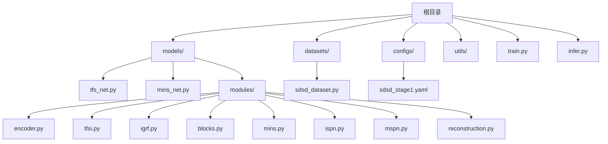
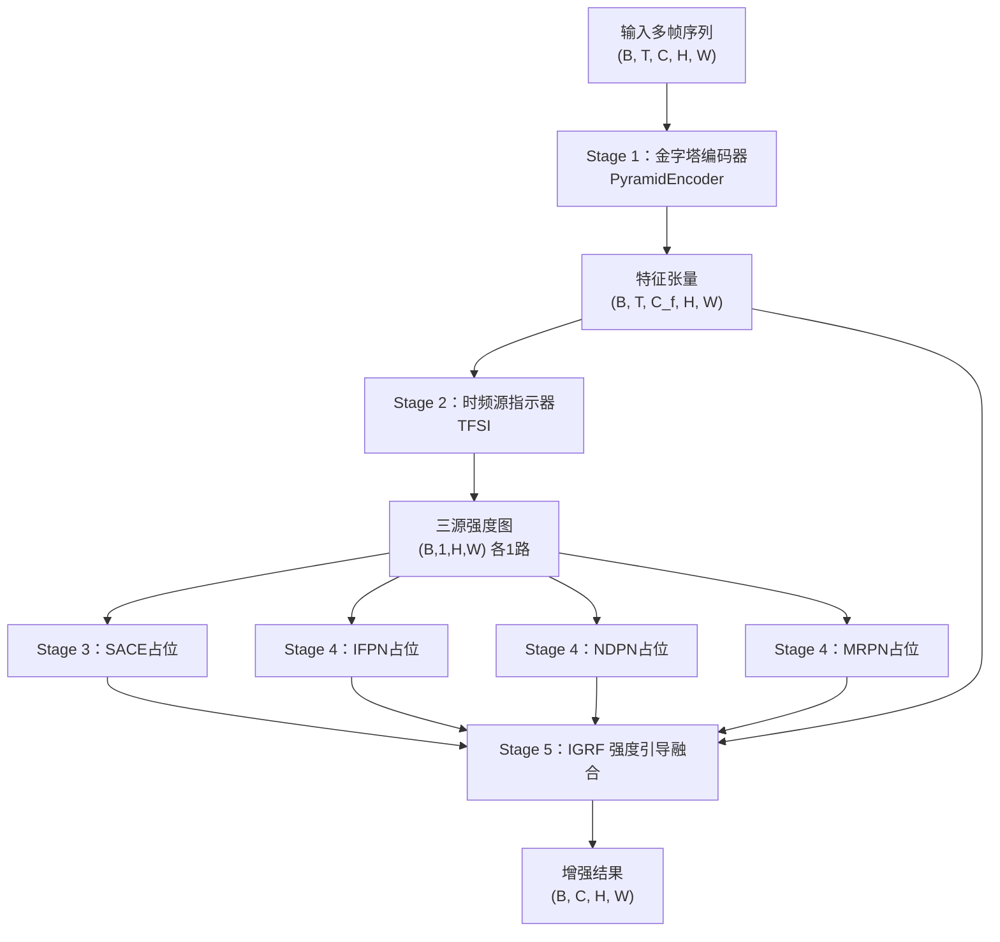
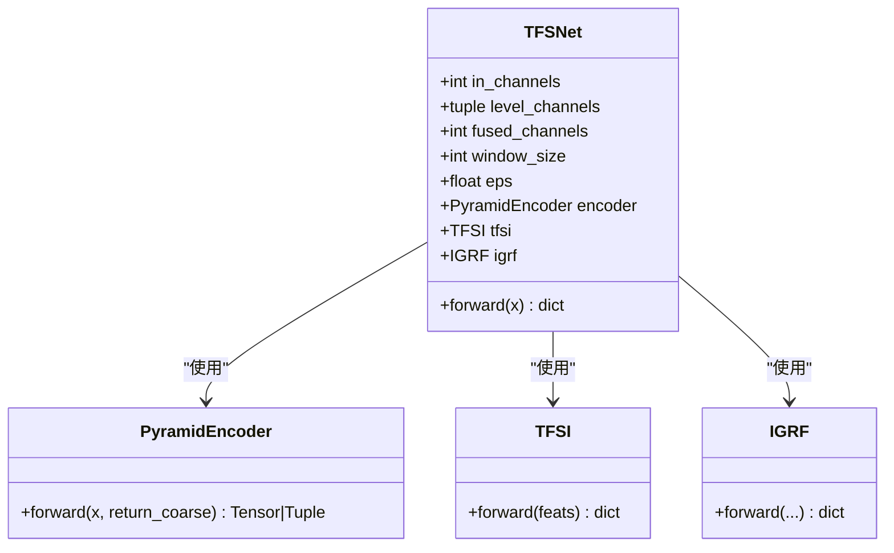
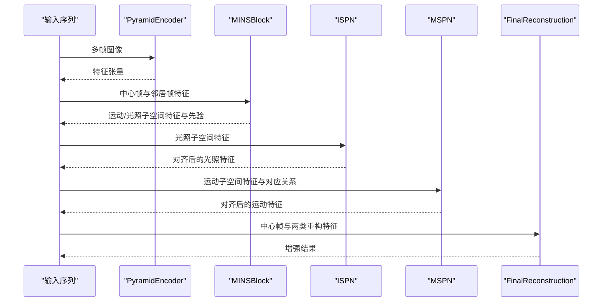
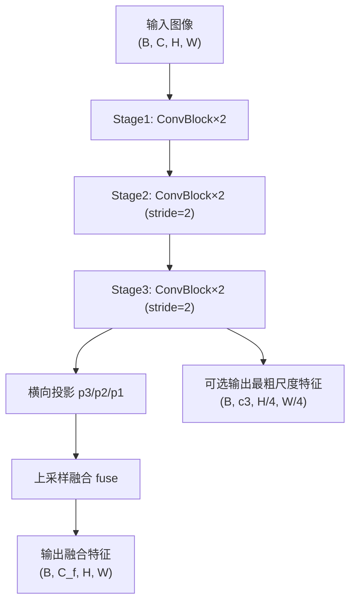
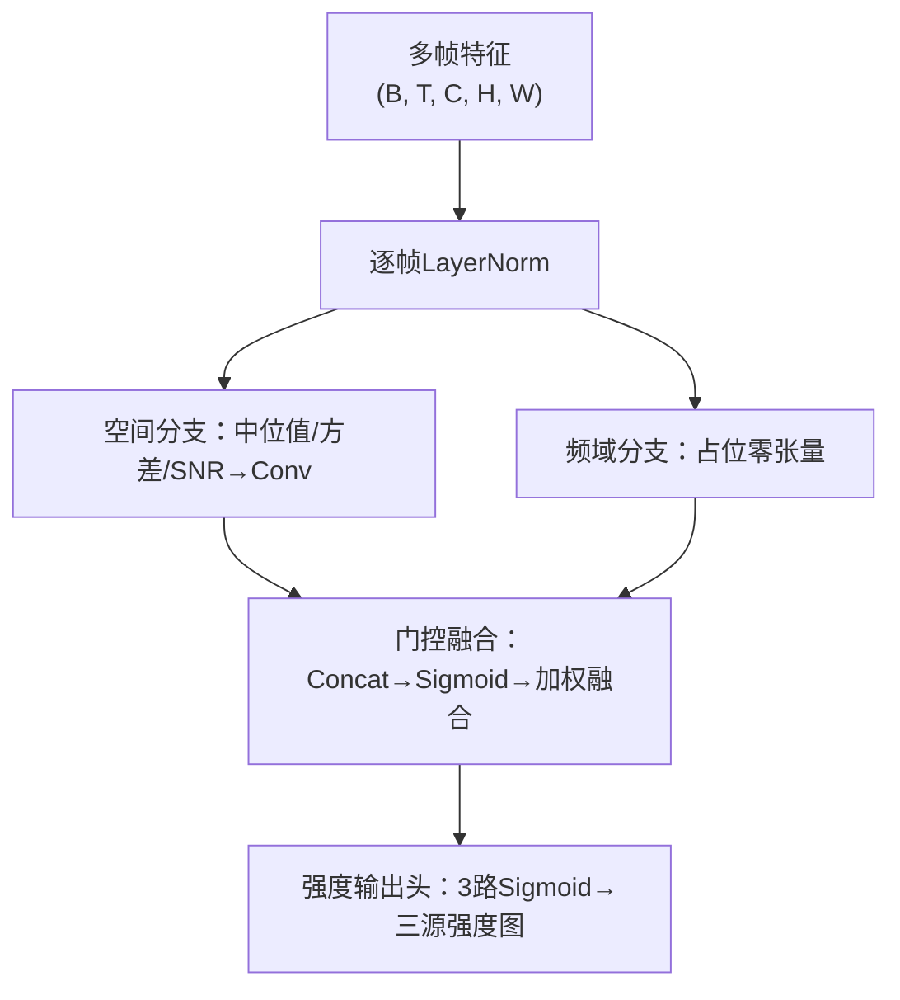
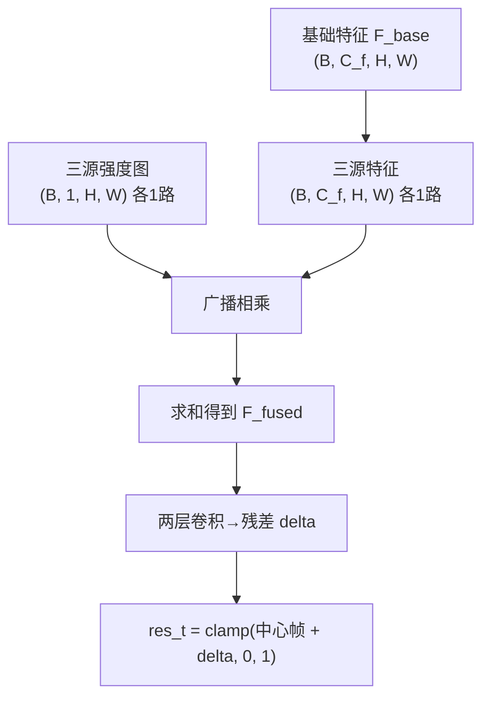
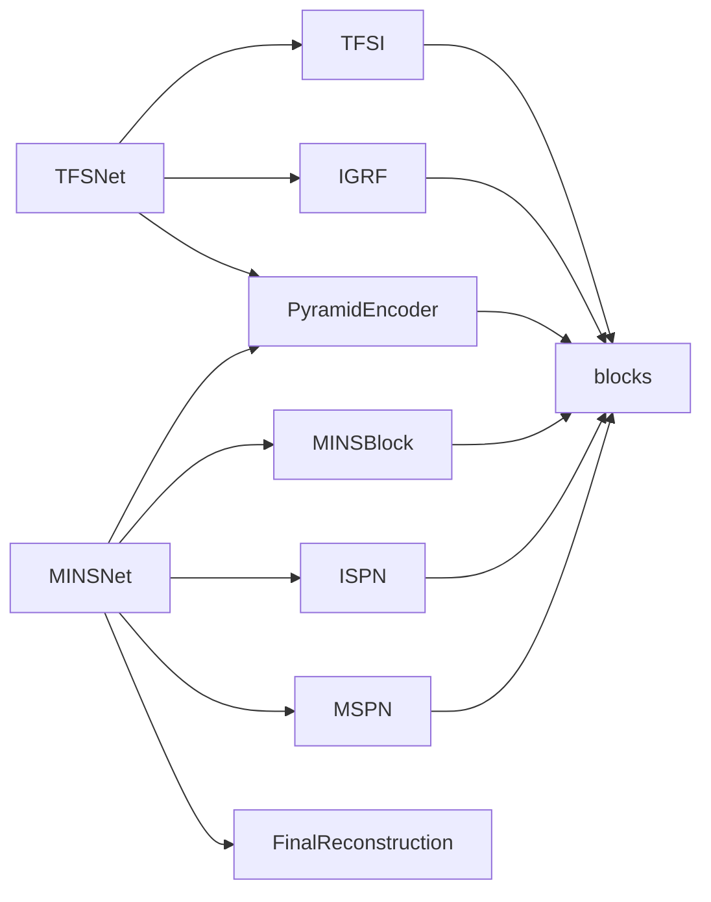

# 技术架构概览

<cite>
**本文引用的文件**
- [models/tfs_net.py](file://models/tfs_net.py)
- [models/mins_net.py](file://models/mins_net.py)
- [models/modules/encoder.py](file://models/modules/encoder.py)
- [models/modules/tfsi.py](file://models/modules/tfsi.py)
- [models/modules/igrf.py](file://models/modules/igrf.py)
- [models/modules/__init__.py](file://models/modules/__init__.py)
- [models/modules/blocks.py](file://models/modules/blocks.py)
- [models/modules/mins.py](file://models/modules/mins.py)
- [models/modules/ispn.py](file://models/modules/ispn.py)
- [models/modules/mspn.py](file://models/modules/mspn.py)
- [models/modules/reconstruction.py](file://models/modules/reconstruction.py)
- [datasets/sdsd_dataset.py](file://datasets/sdsd_dataset.py)
- [configs/sdsd_stage1.yaml](file://configs/sdsd_stage1.yaml)
- [train.py](file://train.py)
- [README.md](file://README.md)
</cite>

## 目录
1. [简介](#简介)
2. [项目结构](#项目结构)
3. [核心组件](#核心组件)
4. [架构总览](#架构总览)
5. [详细组件分析](#详细组件分析)
6. [依赖分析](#依赖分析)
7. [性能考虑](#性能考虑)
8. [故障排查指南](#故障排查指南)
9. [结论](#结论)
10. [附录](#附录)

## 简介
本文件面向TFS-Net项目的开发者与研究者，提供系统性的技术架构概览。重点阐述“五阶段数据流”设计、模块化架构理念以及组件间的协作关系。文档覆盖主网络TFSNet的整体结构、各子模块功能与相互关系，并给出从输入多帧序列到输出增强结果的完整处理流程图与架构图。同时总结设计决策与架构权衡，帮助读者快速建立对系统的整体认知。

## 项目结构
仓库采用“按功能域分层”的组织方式：
- models：网络架构与模块定义，包含主干网络与子模块
- datasets：数据集构建与读取逻辑
- configs：训练配置
- utils：工具函数（推理、指标、IO等）
- 训练与推理入口：train.py、infer.py（在根目录）



图表来源
- [models/tfs_net.py:1-181](file://models/tfs_net.py#L1-L181)
- [models/mins_net.py:1-67](file://models/mins_net.py#L1-L67)
- [models/modules/encoder.py:1-102](file://models/modules/encoder.py#L1-L102)
- [models/modules/tfsi.py:1-265](file://models/modules/tfsi.py#L1-L265)
- [models/modules/igrf.py:1-89](file://models/modules/igrf.py#L1-L89)
- [models/modules/blocks.py:1-110](file://models/modules/blocks.py#L1-L110)
- [models/modules/mins.py:1-131](file://models/modules/mins.py#L1-L131)
- [models/modules/ispn.py:1-26](file://models/modules/ispn.py#L1-L26)
- [models/modules/mspn.py:1-41](file://models/modules/mspn.py#L1-L41)
- [models/modules/reconstruction.py:1-24](file://models/modules/reconstruction.py#L1-L24)
- [datasets/sdsd_dataset.py:1-81](file://datasets/sdsd_dataset.py#L1-L81)
- [configs/sdsd_stage1.yaml:1-34](file://configs/sdsd_stage1.yaml#L1-L34)
- [train.py:1-264](file://train.py#L1-L264)

章节来源
- [README.md:1-24](file://README.md#L1-L24)
- [configs/sdsd_stage1.yaml:1-34](file://configs/sdsd_stage1.yaml#L1-L34)

## 核心组件
- 主网络TFSNet：实现五阶段数据流，当前已实现Stage 1（编码器）、Stage 2（TFSI）、Stage 5（IGRF），Stage 3/4为占位或待实现
- 主网络MINSNet：用于SDSD阶段的轻量化流水线，包含编码器、MINS、ISPN、MSPN与最终重建
- 数据集与配置：SDSDDataset提供窗口化采样，sdsd_stage1.yaml定义训练参数
- 训练脚本：train.py负责数据加载、模型构建、损失与优化器、训练循环与验证

章节来源
- [models/tfs_net.py:34-181](file://models/tfs_net.py#L34-L181)
- [models/mins_net.py:11-67](file://models/mins_net.py#L11-L67)
- [datasets/sdsd_dataset.py:18-81](file://datasets/sdsd_dataset.py#L18-L81)
- [configs/sdsd_stage1.yaml:1-34](file://configs/sdsd_stage1.yaml#L1-L34)
- [train.py:87-264](file://train.py#L87-L264)

## 架构总览
TFS-Net采用“五阶段数据流”设计，强调模块解耦与可扩展性。当前已实现部分如下：
- Stage 1：共享金字塔编码器（返回融合特征与最粗尺度特征）
- Stage 2：时频源指示器（TFSI）——输出三源强度图（光照、噪声、运动）
- Stage 3：源感知对应估计（SACE）——占位，待实现
- Stage 4：三源恢复分支（IFPN/NDPN/MRPN）——占位，待实现
- Stage 5：强度引导融合（IGRF）——将三源输出与基础特征按强度加权融合并重建



图表来源
- [models/tfs_net.py:100-181](file://models/tfs_net.py#L100-L181)
- [models/modules/encoder.py:76-102](file://models/modules/encoder.py#L76-L102)
- [models/modules/tfsi.py:217-265](file://models/modules/tfsi.py#L217-L265)
- [models/modules/igrf.py:56-89](file://models/modules/igrf.py#L56-L89)

## 详细组件分析

### TFSNet 主网络
- 功能定位：五阶段数据流主干，当前已实现Stage 1/2/5，Stage 3/4占位
- 关键参数：输入通道、各级编码器通道、融合通道、窗口大小、数值稳定系数
- 控制流：编码器→TFSI→（待实现）→IGRF→输出增强结果与中间变量



图表来源
- [models/tfs_net.py:48-98](file://models/tfs_net.py#L48-L98)
- [models/modules/encoder.py:35-102](file://models/modules/encoder.py#L35-L102)
- [models/modules/tfsi.py:187-265](file://models/modules/tfsi.py#L187-L265)
- [models/modules/igrf.py:27-89](file://models/modules/igrf.py#L27-L89)

章节来源
- [models/tfs_net.py:34-181](file://models/tfs_net.py#L34-L181)

### MINSNet（对比与基线）
- 功能定位：SDSD阶段的轻量化流水线，包含编码器、MINS、ISPN、MSPN与最终重建
- 数据流：编码器→MINS（运动/光照分解）→ISPN（光照对齐）→MSPN（运动聚合）→重建
- 与TFSNet的关系：同属多帧视频增强框架，MINSNet更聚焦于传统分解路径，TFSNet引入TFSI与IGRF的强度引导融合



图表来源
- [models/mins_net.py:20-67](file://models/mins_net.py#L20-L67)
- [models/modules/mins.py:62-131](file://models/modules/mins.py#L62-L131)
- [models/modules/ispn.py:13-25](file://models/modules/ispn.py#L13-L25)
- [models/modules/mspn.py:27-40](file://models/modules/mspn.py#L27-L40)
- [models/modules/reconstruction.py:12-23](file://models/modules/reconstruction.py#L12-L23)

章节来源
- [models/mins_net.py:11-67](file://models/mins_net.py#L11-L67)

### 金字塔编码器（Stage 1）
- 设计要点：三层编码器+横向连接+融合，支持返回最粗尺度特征以供后续模块使用
- 接口：单帧与多帧两种forward，多帧模式自动重排形状并还原
- 注意事项：当前最粗尺度分辨率为H/4×W/4，与v3设计文档中的H/8×W/8存在差异，需在后续设计澄清后调整



图表来源
- [models/modules/encoder.py:35-102](file://models/modules/encoder.py#L35-L102)

章节来源
- [models/modules/encoder.py:1-102](file://models/modules/encoder.py#L1-L102)

### 时频源指示器（Stage 2：TFSI）
- 设计目标：替代MINS中的分解，直接输出三源强度图（光照、噪声、运动）
- 组件构成：空间分支（时域统计量→卷积）、频域分支（占位）、门控融合、强度输出头
- 当前状态：空间分支与门控融合已实现，频域分支占位；可独立运行并输出中间变量



图表来源
- [models/modules/tfsi.py:23-265](file://models/modules/tfsi.py#L23-L265)

章节来源
- [models/modules/tfsi.py:1-265](file://models/modules/tfsi.py#L1-L265)

### 强度引导融合（Stage 5：IGRF）
- 设计目标：将三源恢复分支输出与基础特征按强度加权融合后重建
- 公式要点：F_fused = s_illum·F_illum + s_noise·F_noise + s_motion·F_motion + F_base；残差重建clamp到[0,1]
- 当前假设：F_base暂用编码器融合特征F_t



图表来源
- [models/modules/igrf.py:56-89](file://models/modules/igrf.py#L56-L89)

章节来源
- [models/modules/igrf.py:1-89](file://models/modules/igrf.py#L1-L89)

### 数据流与训练管线
- 数据集：SDSDDataset按窗口大小收集序列，随机裁剪、翻转与时间反转增强
- 训练：train.py加载配置、构建数据加载器、模型、损失与优化器，执行训练与验证，周期保存检查点

```mermaid
sequenceDiagram
participant CFG as "配置文件"
participant DS as "SDSDDataset"
participant DL as "DataLoader"
participant NET as "MINSNet/TFSNet"
participant OPT as "优化器/调度器"
participant LOG as "日志/检查点"
CFG->>DS : 读取路径与窗口大小
DS-->>DL : 序列样本clip, target, meta
loop 训练轮次
DL->>NET : 前向传播
NET-->>OPT : 损失反传
OPT-->>LOG : 记录指标与保存权重
end
```

图表来源
- [datasets/sdsd_dataset.py:18-81](file://datasets/sdsd_dataset.py#L18-L81)
- [train.py:48-264](file://train.py#L48-L264)
- [configs/sdsd_stage1.yaml:1-34](file://configs/sdsd_stage1.yaml#L1-L34)

章节来源
- [datasets/sdsd_dataset.py:1-81](file://datasets/sdsd_dataset.py#L1-L81)
- [train.py:1-264](file://train.py#L1-L264)
- [configs/sdsd_stage1.yaml:1-34](file://configs/sdsd_stage1.yaml#L1-L34)

## 依赖分析
- 模块内聚与耦合
  - TFSNet内部通过Stage划分实现高内聚低耦合，Stage 3/4为占位，便于逐步实现
  - TFSI与IGRF分别承担“源强度估计”和“融合重建”，职责清晰
- 直接与间接依赖
  - TFSNet依赖PyramidEncoder、TFSI、IGRF
  - MINSNet依赖PyramidEncoder、MINSBlock、ISPN、MSPN、FinalReconstruction
  - 所有模块共享blocks中的通用算子（卷积、归一化、窗口分割等）
- 外部依赖
  - 训练脚本依赖YAML配置、CUDA AMP、TQDM等



图表来源
- [models/tfs_net.py:29-31](file://models/tfs_net.py#L29-L31)
- [models/mins_net.py:4-8](file://models/mins_net.py#L4-L8)
- [models/modules/__init__.py:1-10](file://models/modules/__init__.py#L1-L10)

章节来源
- [models/modules/__init__.py:1-10](file://models/modules/__init__.py#L1-L10)

## 性能考虑
- 计算复杂度
  - 编码器采用多尺度下采样与横向连接，融合成本可控
  - TFSI的空间分支对多帧沿时间维统计，复杂度与帧数线性相关
  - IGRF为轻量卷积融合，计算开销较低
- 内存占用
  - 多帧窗口越大，中间特征存储越高；可通过滑窗/分块策略降低显存
- 训练稳定性
  - AMP混合精度可显著降低显存占用并提升吞吐
  - 损失函数包含像素、SSIM、感知与先验平滑项，有助于稳定收敛

## 故障排查指南
- 输入尺寸断言失败
  - 现象：报错提示时间窗口必须为奇数且≥3
  - 排查：确认输入张量形状与配置中的window_size一致
  - 参考：[models/tfs_net.py:115-117](file://models/tfs_net.py#L115-L117)、[models/mins_net.py:21-22](file://models/mins_net.py#L21-L22)
- 数据集路径与序列对齐
  - 现象：找不到公共帧或序列为空
  - 排查：核对输入/目标根目录、序列名与帧名是否一一对应
  - 参考：[datasets/sdsd_dataset.py:32-51](file://datasets/sdsd_dataset.py#L32-L51)
- 损失非有限
  - 现象：训练过程中出现非有限损失被跳过
  - 排查：检查学习率、梯度裁剪、AMP设置与数据预处理
  - 参考：[train.py:126-130](file://train.py#L126-L130)
- 验证指标异常
  - 现象：PSNR/SSIM异常或NaN
  - 排查：确认归一化范围、裁剪与边界处理、tile策略
  - 参考：[train.py:164-184](file://train.py#L164-L184)

章节来源
- [models/tfs_net.py:115-117](file://models/tfs_net.py#L115-L117)
- [models/mins_net.py:21-22](file://models/mins_net.py#L21-L22)
- [datasets/sdsd_dataset.py:32-51](file://datasets/sdsd_dataset.py#L32-L51)
- [train.py:126-130](file://train.py#L126-L130)
- [train.py:164-184](file://train.py#L164-L184)

## 结论
TFS-Net以“五阶段数据流”为核心，通过模块化设计实现了从多帧序列到增强结果的清晰路径。当前已实现的Stage 1/2/5构成了完整的端到端框架，Stage 3/4为后续扩展预留了接口。该架构在保持轻量化的同时，具备良好的可扩展性与工程落地潜力。建议在后续迭代中优先完成SACE与三源恢复分支，并结合具体任务场景进行模块定制与优化。

## 附录
- 关键术语
  - 三源强度图：光照、噪声、运动三种退化强度的独立估计
  - IGRF：基于三源强度的引导融合，将各分支特征加权合并
  - MINS：运动/光照子空间分解，用于传统视频增强流水线
- 相关文件索引
  - 主网络与模块：[models/tfs_net.py](file://models/tfs_net.py)、[models/modules/encoder.py](file://models/modules/encoder.py)、[models/modules/tfsi.py](file://models/modules/tfsi.py)、[models/modules/igrf.py](file://models/modules/igrf.py)
  - 对比网络：[models/mins_net.py](file://models/mins_net.py)、[models/modules/mins.py](file://models/modules/mins.py)、[models/modules/ispn.py](file://models/modules/ispn.py)、[models/modules/mspn.py](file://models/modules/mspn.py)、[models/modules/reconstruction.py](file://models/modules/reconstruction.py)
  - 数据与配置：[datasets/sdsd_dataset.py](file://datasets/sdsd_dataset.py)、[configs/sdsd_stage1.yaml](file://configs/sdsd_stage1.yaml)
  - 训练脚本：[train.py](file://train.py)