# 核心特性

<cite>
**本文引用的文件**
- [README.md](file://README.md)
- [configs/sdsd_stage1.yaml](file://configs/sdsd_stage1.yaml)
- [models/mains/tfs_net.py](file://models/tfs_net.py)
- [models/mains/mins_net.py](file://models/mins_net.py)
- [models/modules/encoder.py](file://models/modules/encoder.py)
- [models/modules/mins.py](file://models/modules/mins.py)
- [models/modules/ispn.py](file://models/modules/ispn.py)
- [models/modules/mspn.py](file://models/modules/mspn.py)
- [models/modules/reconstruction.py](file://models/modules/reconstruction.py)
- [models/modules/blocks.py](file://models/modules/blocks.py)
- [losses/losses.py](file://losses/losses.py)
- [datasets/sdsd_dataset.py](file://datasets/sdsd_dataset.py)
- [train.py](file://train.py)
- [infer.py](file://infer.py)
- [utils/inference.py](file://utils/inference.py)
- [utils/metrics.py](file://utils/metrics.py)
</cite>

## 目录
1. [简介](#简介)
2. [项目结构](#项目结构)
3. [核心组件](#核心组件)
4. [架构总览](#架构总览)
5. [详细组件分析](#详细组件分析)
6. [依赖分析](#依赖分析)
7. [性能考虑](#性能考虑)
8. [故障排查指南](#故障排查指南)
9. [结论](#结论)
10. [附录](#附录)

## 简介
本文件面向TFS-Net项目的“核心特性”说明，聚焦于以下能力：
- SDSD-first视频低光增强训练与推理流程
- 轻量级金字塔编码器
- MINS/ISPN/MSPN/最终重建流水线
- 滑动窗口中心帧监督
- 像素+SSIM+感知+先验平滑损失

这些特性共同构成从输入多帧低光序列到输出中心帧增强结果的完整端到端系统，并在配置驱动的训练脚本与推理脚本中得到验证。

## 项目结构
围绕核心特性，项目采用模块化分层组织：
- 配置层：以YAML配置驱动训练/推理参数
- 数据层：SDSD数据集构建与滑动窗口采样
- 模型层：MINSNet主干（金字塔编码器+MINS+ISPN+MSPN+重建）
- 损失层：MINSLoss（像素、SSIM、感知、TV先验）
- 训练/推理：统一的训练循环与瓦片推理策略

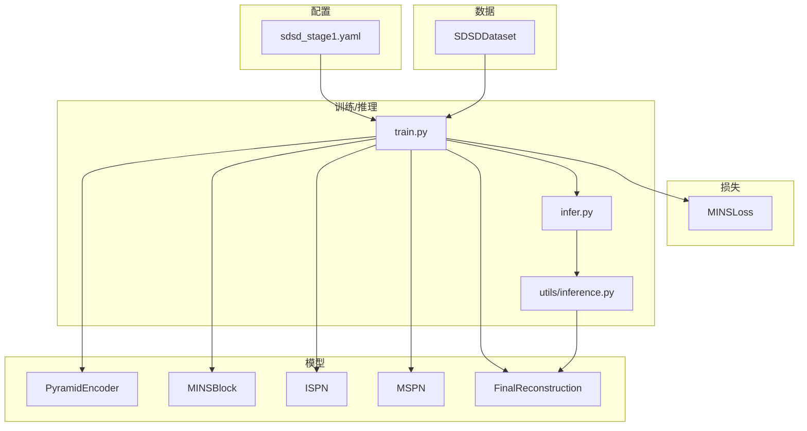

图表来源
- [configs/sdsd_stage1.yaml:1-34](file://configs/sdsd_stage1.yaml#L1-L34)
- [datasets/sdsd_dataset.py:18-81](file://datasets/sdsd_dataset.py#L18-L81)
- [models/modules/encoder.py:35-102](file://models/modules/encoder.py#L35-L102)
- [models/modules/mins.py:22-131](file://models/modules/mins.py#L22-L131)
- [models/modules/ispn.py:7-26](file://models/modules/ispn.py#L7-L26)
- [models/modules/mspn.py:7-41](file://models/modules/mspn.py#L7-L41)
- [models/modules/reconstruction.py:5-24](file://models/modules/reconstruction.py#L5-L24)
- [losses/losses.py:80-114](file://losses/losses.py#L80-L114)
- [train.py:48-84](file://train.py#L48-L84)
- [infer.py:68-105](file://infer.py#L68-L105)
- [utils/inference.py:26-61](file://utils/inference.py#L26-L61)

章节来源
- [README.md:1-24](file://README.md#L1-L24)
- [configs/sdsd_stage1.yaml:1-34](file://configs/sdsd_stage1.yaml#L1-L34)

## 核心组件
- SDSD-first视频低光增强：以SDSD数据集为主，构建滑动窗口序列，训练目标为增强后的中心帧与GT对齐。
- 轻量级金字塔编码器：多阶段卷积+横向连接融合，支持返回粗尺度特征用于后续分支。
- MINS/ISPN/MSPN/最终重建：MINS进行时域邻域聚合与熵门控分离，ISPN进行共享表征对齐，MSPN进行邻域对齐融合，最终通过重建模块输出增强结果。
- 滑动窗口中心帧监督：训练时仅以中心帧作为监督信号，避免跨帧误差传播。
- 像素+SSIM+感知+先验平滑损失：综合L1、SSIM、感知特征与先验TV正则，提升增强质量与先验一致性。

章节来源
- [README.md:5-10](file://README.md#L5-L10)
- [models/mins_net.py:11-67](file://models/mins_net.py#L11-L67)
- [models/modules/encoder.py:35-102](file://models/modules/encoder.py#L35-L102)
- [models/modules/mins.py:22-131](file://models/modules/mins.py#L22-L131)
- [models/modules/ispn.py:7-26](file://models/modules/ispn.py#L7-L26)
- [models/modules/mspn.py:7-41](file://models/modules/mspn.py#L7-L41)
- [models/modules/reconstruction.py:5-24](file://models/modules/reconstruction.py#L5-L24)
- [losses/losses.py:80-114](file://losses/losses.py#L80-L114)
- [datasets/sdsd_dataset.py:18-81](file://datasets/sdsd_dataset.py#L18-L81)

## 架构总览
下图展示MINSNet从输入到输出的关键数据流与模块交互：

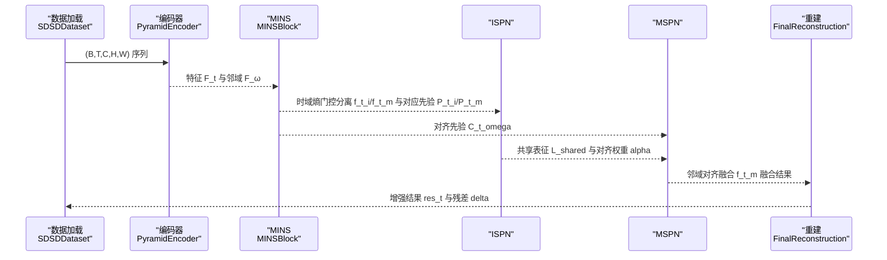

图表来源
- [models/mins_net.py:20-67](file://models/mins_net.py#L20-L67)
- [models/modules/encoder.py:35-102](file://models/modules/encoder.py#L35-L102)
- [models/modules/mins.py:62-131](file://models/modules/mins.py#L62-L131)
- [models/modules/ispn.py:13-24](file://models/modules/ispn.py#L13-L24)
- [models/modules/mspn.py:27-40](file://models/modules/mspn.py#L27-L40)
- [models/modules/reconstruction.py:12-22](file://models/modules/reconstruction.py#L12-L22)

## 详细组件分析

### SDSD-first视频低光增强
- 数据组织：按序列目录读取低光与GT帧，构建滑动窗口样本，中心帧作为监督目标。
- 训练/推理：训练脚本加载配置与数据，迭代优化；推理脚本对序列逐帧进行瓦片推理，保存增强结果。
- 监督策略：仅以中心帧监督，避免跨帧误差累积。

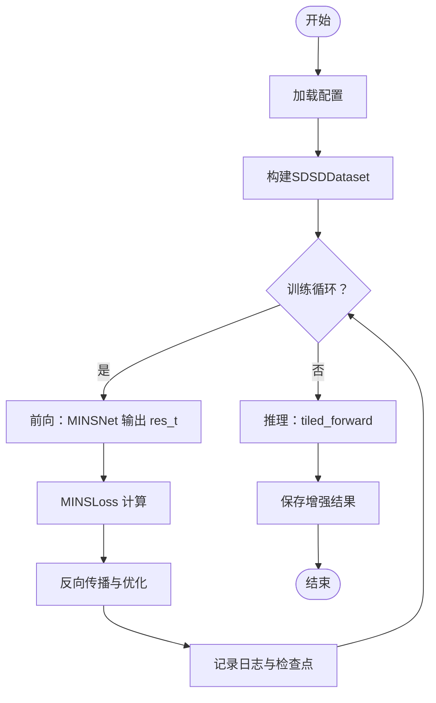

图表来源
- [configs/sdsd_stage1.yaml:1-34](file://configs/sdsd_stage1.yaml#L1-L34)
- [datasets/sdsd_dataset.py:18-81](file://datasets/sdsd_dataset.py#L18-L81)
- [train.py:108-161](file://train.py#L108-L161)
- [infer.py:68-105](file://infer.py#L68-L105)
- [utils/inference.py:26-61](file://utils/inference.py#L26-L61)

章节来源
- [datasets/sdsd_dataset.py:18-81](file://datasets/sdsd_dataset.py#L18-L81)
- [train.py:48-84](file://train.py#L48-L84)
- [infer.py:68-105](file://infer.py#L68-L105)
- [utils/inference.py:26-61](file://utils/inference.py#L26-L61)

### 轻量级金字塔编码器
- 结构：三层卷积阶段，stride分别为1、2、2；横向连接将c3/c2/c1投影至融合通道Cf；二次上采样融合得到全局特征。
- 扩展：支持返回最粗尺度特征l3，便于后续分支使用。
- 接口：单帧与多帧统一前向，多帧时自动展开与重塑。

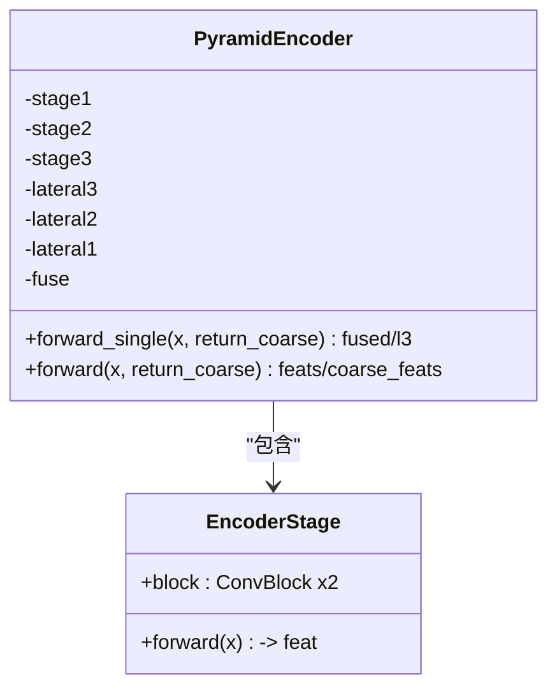

图表来源
- [models/modules/encoder.py:35-102](file://models/modules/encoder.py#L35-L102)

章节来源
- [models/modules/encoder.py:35-102](file://models/modules/encoder.py#L35-L102)

### MINS：时域熵门控与邻域聚合
- 功能：对中心帧与邻域帧进行窗口化注意力聚合，计算相似性与熵，通过熵门控分离“运动/光照”与“内容/纹理”成分。
- 关键点：窗口划分与反变换、邻居先验投影、熵计算与门控输出。

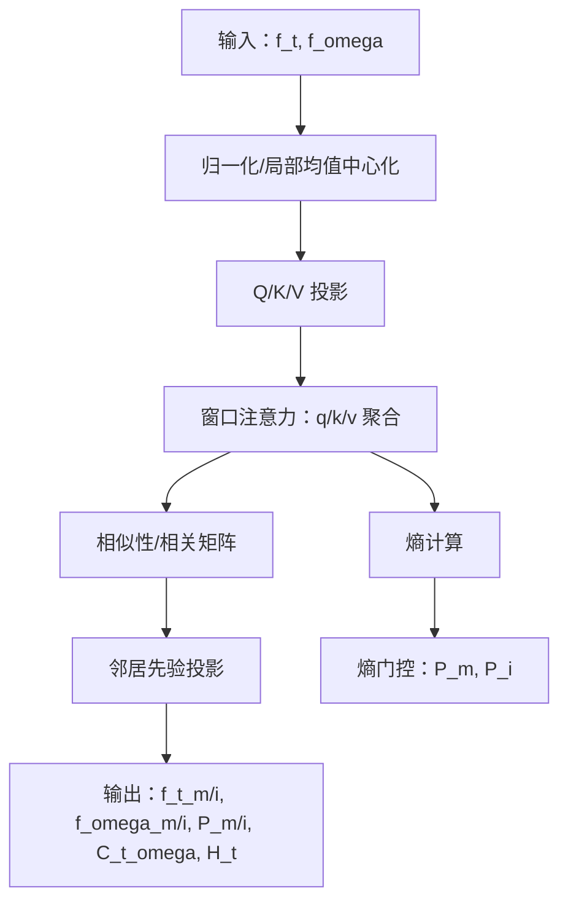

图表来源
- [models/modules/mins.py:62-131](file://models/modules/mins.py#L62-L131)
- [models/modules/blocks.py:46-95](file://models/modules/blocks.py#L46-L95)

章节来源
- [models/modules/mins.py:22-131](file://models/modules/mins.py#L22-L131)
- [models/modules/blocks.py:1-110](file://models/modules/blocks.py#L1-L110)

### ISPN：共享表征对齐与细化
- 功能：计算中心帧与邻域帧的成对余弦logits，得到对齐权重alpha，聚合共享表征L_shared，进行归一化与残差细化，输出对齐后的特征。

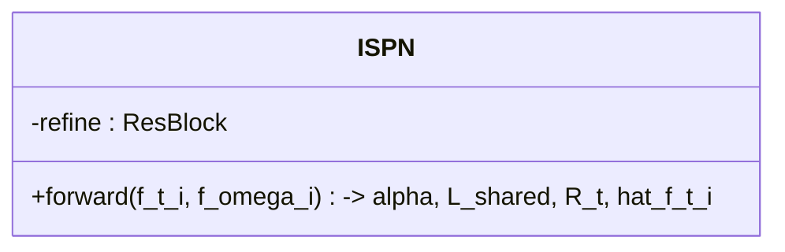

图表来源
- [models/modules/ispn.py:7-26](file://models/modules/ispn.py#L7-L26)
- [models/modules/blocks.py:20-30](file://models/modules/blocks.py#L20-L30)

章节来源
- [models/modules/ispn.py:7-26](file://models/modules/ispn.py#L7-L26)
- [models/modules/blocks.py:1-110](file://models/modules/blocks.py#L1-L110)

### MSPN：邻域对齐融合与门控
- 功能：利用MINS提供的相关矩阵对邻域特征进行窗口化对齐，拼接后经门控融合，再经残差细化得到最终融合特征。

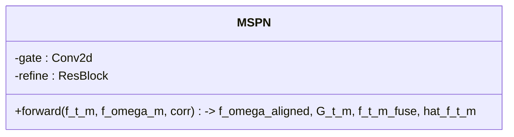

图表来源
- [models/modules/mspn.py:7-41](file://models/modules/mspn.py#L7-L41)
- [models/modules/blocks.py:20-30](file://models/modules/blocks.py#L20-L30)

章节来源
- [models/modules/mspn.py:7-41](file://models/modules/mspn.py#L7-L41)
- [models/modules/blocks.py:1-110](file://models/modules/blocks.py#L1-L110)

### 最终重建：像素融合与残差输出
- 功能：将ISPN与MSPN的重建特征按先验权重融合，经激活与卷积得到残差delta，叠加中心帧得到增强结果res_t，并裁剪至[0,1]。

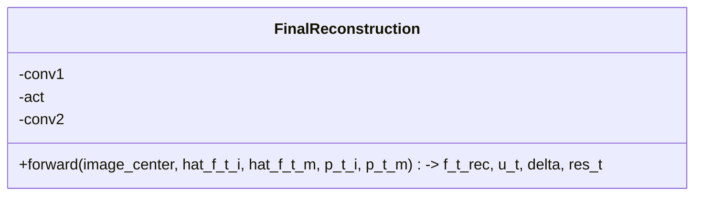

图表来源
- [models/modules/reconstruction.py:5-24](file://models/modules/reconstruction.py#L5-L24)

章节来源
- [models/modules/reconstruction.py:5-24](file://models/modules/reconstruction.py#L5-L24)

### 滑动窗口中心帧监督
- 数据侧：SDSDDataset按固定窗口大小构造序列，中心帧索引固定，训练时仅以中心帧GT作为监督。
- 模型侧：MINSNet在前向中显式取中心帧索引，确保监督信号集中于中心帧。

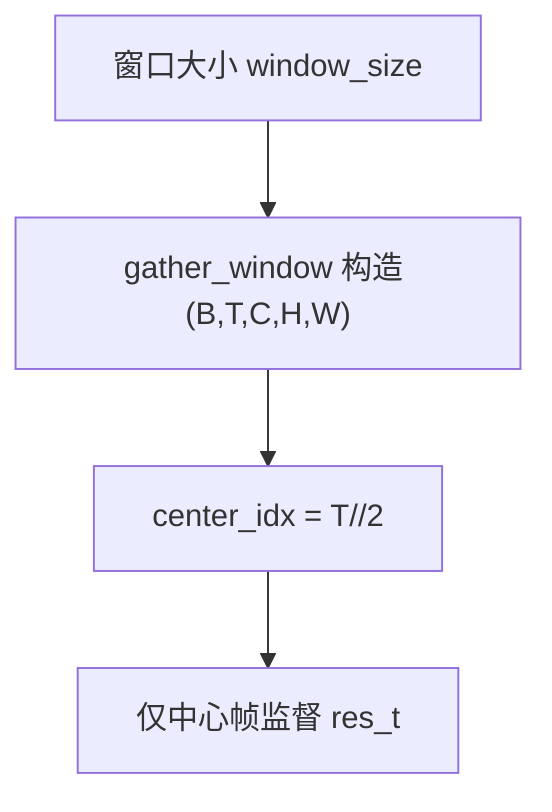

图表来源
- [datasets/sdsd_dataset.py:56-74](file://datasets/sdsd_dataset.py#L56-L74)
- [models/mins_net.py:20-38](file://models/mins_net.py#L20-L38)

章节来源
- [datasets/sdsd_dataset.py:18-81](file://datasets/sdsd_dataset.py#L18-L81)
- [models/mins_net.py:20-38](file://models/mins_net.py#L20-L38)

### 像素+SSIM+感知+先验平滑损失
- 组成：L1像素损失、SSIM映射损失、感知特征L1损失、先验TV正则（对P_t_m与P_t_i求TV）。
- 权重：由配置控制各项系数，可选择是否加载预训练感知骨干。

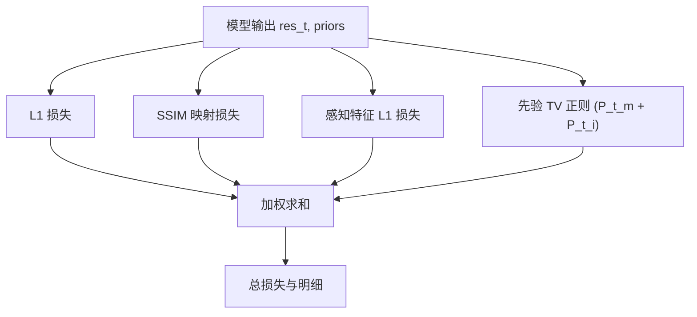

图表来源
- [losses/losses.py:80-114](file://losses/losses.py#L80-L114)

章节来源
- [losses/losses.py:1-114](file://losses/losses.py#L1-L114)
- [configs/sdsd_stage1.yaml:28-34](file://configs/sdsd_stage1.yaml#L28-L34)

## 依赖分析
- 模块内聚：MINSNet将编码器、MINS、ISPN、MSPN与重建组合为单一前向流程，耦合度适中，便于训练与推理。
- 外部依赖：torch、torchvision（感知损失）、PIL/numpy（数据读取）、PyYAML（配置解析）、tqdm（进度条）。
- 训练/推理耦合：训练脚本与推理脚本共享模型定义与瓦片推理策略，保证一致性。

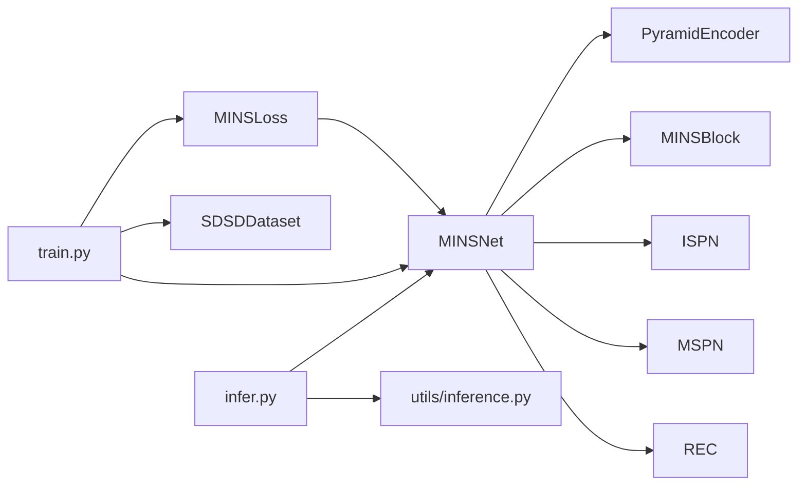

图表来源
- [models/mins_net.py:11-67](file://models/mins_net.py#L11-L67)
- [losses/losses.py:80-114](file://losses/losses.py#L80-L114)
- [datasets/sdsd_dataset.py:18-81](file://datasets/sdsd_dataset.py#L18-L81)
- [train.py:48-84](file://train.py#L48-L84)
- [infer.py:68-105](file://infer.py#L68-L105)
- [utils/inference.py:26-61](file://utils/inference.py#L26-L61)

章节来源
- [models/mins_net.py:11-67](file://models/mins_net.py#L11-L67)
- [train.py:87-106](file://train.py#L87-L106)
- [infer.py:73-81](file://infer.py#L73-L81)

## 性能考虑
- 瓦片推理：大尺寸输入通过滑窗与加权平均合并，降低显存占用，适合高分辨率视频增强。
- 窗口注意力：MINS使用窗口化注意力减少计算复杂度，窗口大小可调以平衡效率与效果。
- 感知损失：可选预训练VGG权重，若环境不可用则降级为零损失并告警，不影响训练启动。
- AMP与优化器：训练脚本支持混合精度与AdamW优化，结合余弦退火调度器，稳定收敛。

章节来源
- [utils/inference.py:26-61](file://utils/inference.py#L26-L61)
- [models/modules/mins.py:22-33](file://models/modules/mins.py#L22-L33)
- [losses/losses.py:38-71](file://losses/losses.py#L38-L71)
- [train.py:203-205](file://train.py#L203-L205)

## 故障排查指南
- 损失非有限：训练中遇到非有限损失会跳过该步并清空梯度，建议检查学习率与数值稳定性。
- 感知损失降级：若无法加载torchvision或VGG权重，感知损失将返回零并发出警告，不影响继续训练。
- 配置路径错误：请确认配置文件中的数据路径与权重路径正确，必要时在命令行覆盖或直接编辑YAML。
- 推理批大小：瓦片推理当前要求batch size为1，若传入更大批次将触发异常。

章节来源
- [train.py:126-134](file://train.py#L126-L134)
- [losses/losses.py:42-57](file://losses/losses.py#L42-L57)
- [infer.py:34-37](file://infer.py#L34-L37)
- [utils/inference.py:34-36](file://utils/inference.py#L34-L36)

## 结论
本项目围绕SDSD数据集构建了完整的视频低光增强流水线，通过轻量级金字塔编码器与MINS/ISPN/MSPN/重建链路，实现了以中心帧为监督的高质量增强。配合像素、SSIM、感知与先验TV损失，系统在PSNR/SSIM指标与视觉质量上取得良好平衡。训练与推理脚本与配置文件解耦，便于扩展与部署。

## 附录
- 快速开始：安装依赖后，按配置文件路径运行训练与推理脚本，即可完成SDSD-first的视频低光增强任务。
- 扩展方向：可在现有框架基础上接入更多时频源分支与更丰富的先验约束，逐步完善TFS-Net的完整架构。

章节来源
- [README.md:12-24](file://README.md#L12-L24)
- [configs/sdsd_stage1.yaml:1-34](file://configs/sdsd_stage1.yaml#L1-L34)
- [train.py:187-261](file://train.py#L187-L261)
- [infer.py:68-105](file://infer.py#L68-L105)