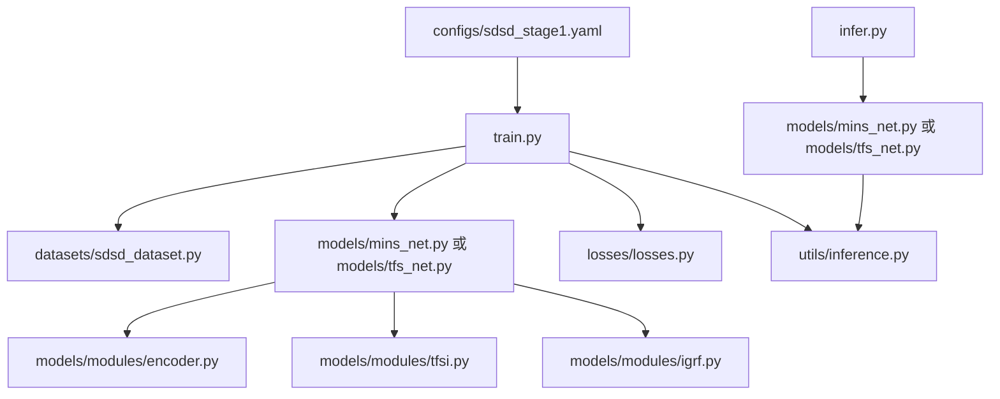
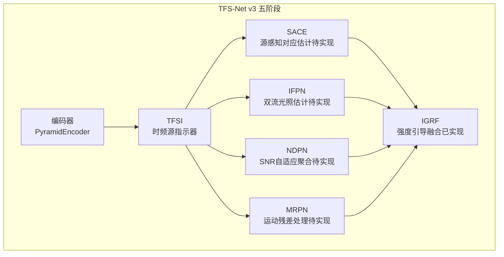
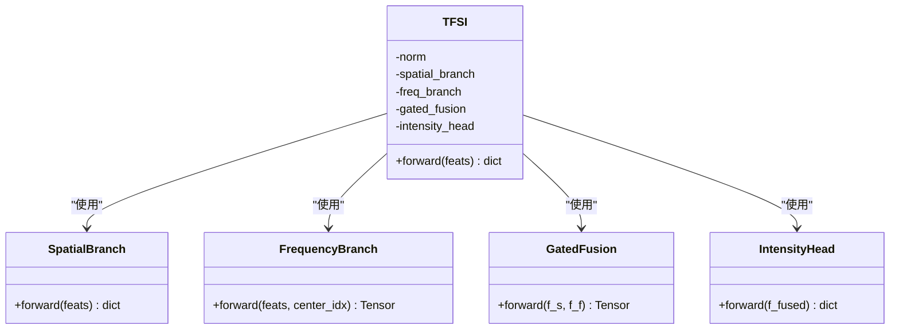
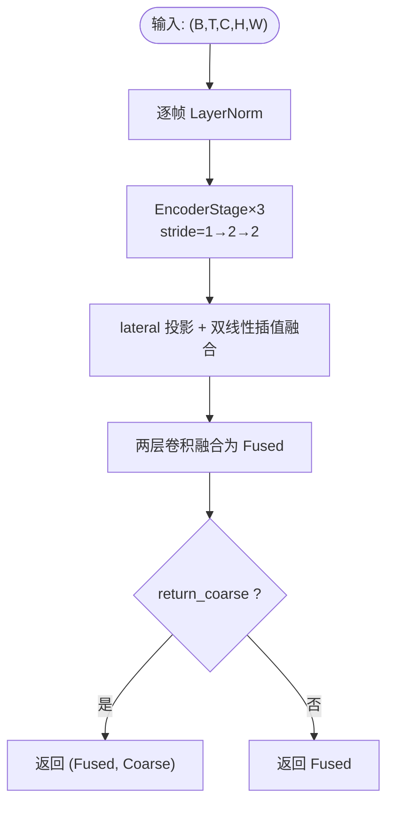
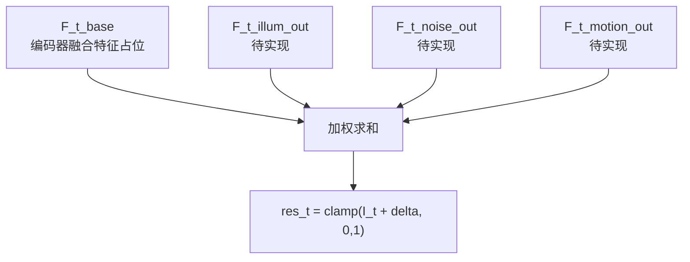
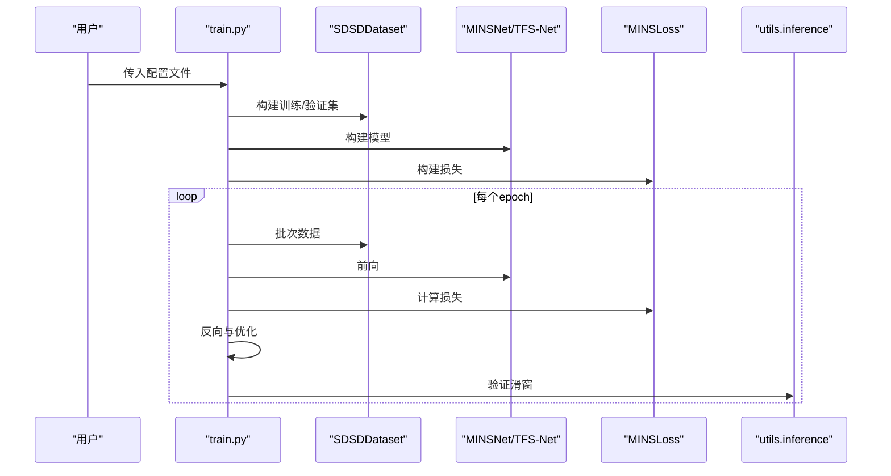
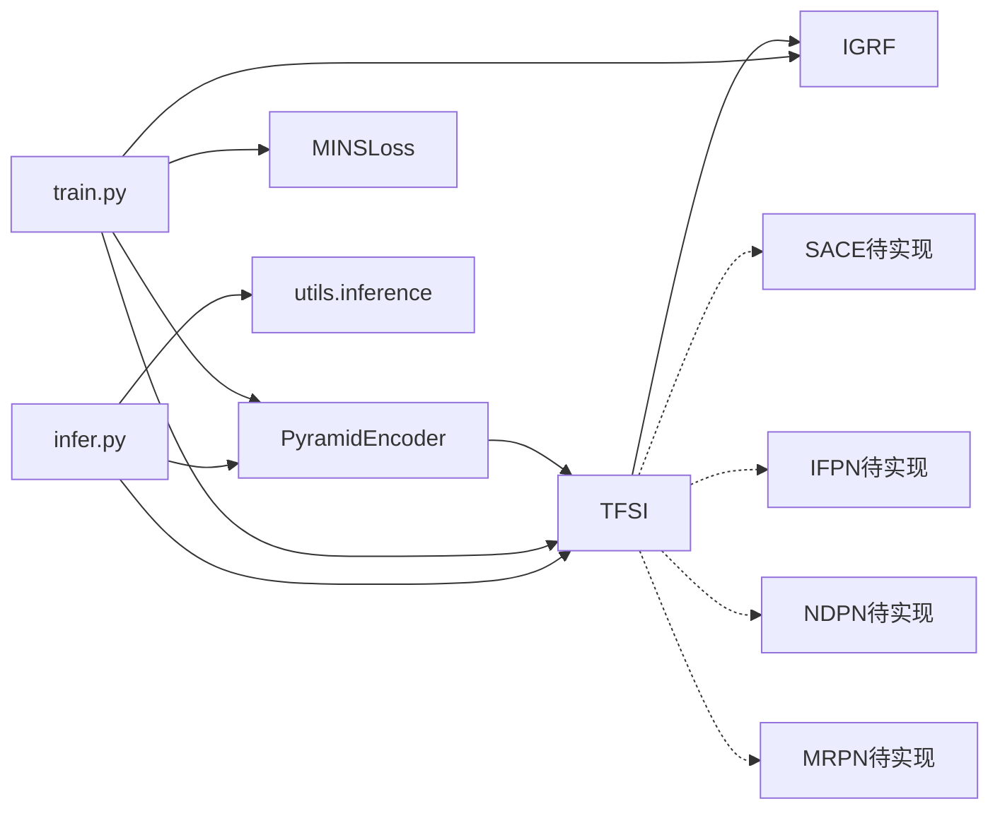

# 项目介绍

<cite>
**本文档引用的文件**
- [README.md](file://README.md)
- [TFSv3-result.md](file://TFSv3-result.md)
- [v3quest.md](file://v3quest.md)
- [tfs_net.py](file://models/tfs_net.py)
- [tfsi.py](file://models/modules/tfsi.py)
- [encoder.py](file://models/modules/encoder.py)
- [igrf.py](file://models/modules/igrf.py)
- [mins_net.py](file://models/mins_net.py)
- [sdsd_dataset.py](file://datasets/sdsd_dataset.py)
- [losses.py](file://losses/losses.py)
- [train.py](file://train.py)
- [infer.py](file://infer.py)
- [sdsd_stage1.yaml](file://configs/sdsd_stage1.yaml)
- [inference.py](file://utils/inference.py)
</cite>

## 目录
1. [简介](#简介)
2. [项目结构](#项目结构)
3. [核心组件](#核心组件)
4. [架构总览](#架构总览)
5. [详细组件分析](#详细组件分析)
6. [依赖关系分析](#依赖关系分析)
7. [性能考虑](#性能考虑)
8. [故障排查指南](#故障排查指南)
9. [结论](#结论)
10. [附录](#附录)

## 简介
本项目名为 TFS-Net（时频源网络），旨在探索“基于时频源指示器”的多源退化建模与融合重建范式，聚焦视频低光增强与图像质量提升。项目以“时频源指示器（TFSI）”为核心，从多帧时序特征中分离出光照、噪声与运动三类退化强度图，再结合金字塔编码器与强度引导融合（IGRF）实现高质量增强。当前版本提供轻量化主干（MINS-Net）与 TFS-Net v3 骨架，其中 TFSI 已完成空间分支与门控融合，频域分支占位；其余模块（SACE、IFPN、NDPN、MRPN）处于设计澄清与实现准备阶段。

技术价值与应用场景：
- 视频低光增强：在弱光场景下显著提升亮度与细节，同时抑制噪声与运动模糊。
- 图像质量提升：对低质量图像进行去噪、去模糊与细节恢复。
- 多源退化分离：通过三源强度图实现对光照、噪声、运动的解耦估计，便于针对性处理。
- 轻量化与可扩展：采用金字塔编码器与门控融合，参数量与计算开销可控，便于扩展至完整 TFS-Net v3 流水线。

## 项目结构
项目采用“模块化 + 配置驱动”的组织方式，核心目录与职责如下：
- configs：训练/推理配置（YAML）
- datasets：数据集封装与多帧窗口采样
- losses：损失函数（含感知损失与总变差）
- models：网络模块与主干（TFS-Net v3 骨架、MINS-Net v1）
- utils：推理切片（tiled_forward）、IO、指标与通用工具
- reference_repos：参考实现（BasicSR、FRBNet、NAFNet、Retinexformer 等）
- 训练/推理入口：train.py、infer.py
- README 与设计文档：README.md、TFSv3-result.md、v3quest.md

**图表来源**
- [sdsd_stage1.yaml:1-34](file://configs/sdsd_stage1.yaml#L1-L34)
- [train.py:48-94](file://train.py#L48-L94)
- [sdsd_dataset.py:18-81](file://datasets/sdsd_dataset.py#L18-L81)
- [mins_net.py:11-67](file://models/mins_net.py#L11-L67)
- [tfs_net.py:34-98](file://models/tfs_net.py#L34-L98)
- [encoder.py:35-102](file://models/modules/encoder.py#L35-L102)
- [tfsi.py:187-265](file://models/modules/tfsi.py#L187-L265)
- [igrf.py](file://models/modules/igrf.py)
- [losses.py:80-114](file://losses/losses.py#L80-L114)
- [inference.py:26-61](file://utils/inference.py#L26-L61)
- [infer.py:68-105](file://infer.py#L68-L105)

**章节来源**
- [README.md:1-24](file://README.md#L1-L24)
- [sdsd_stage1.yaml:1-34](file://configs/sdsd_stage1.yaml#L1-L34)
- [train.py:187-264](file://train.py#L187-L264)
- [infer.py:68-109](file://infer.py#L68-L109)

## 核心组件
- 金字塔编码器（PyramidEncoder）：多尺度特征融合，支持返回最粗尺度特征以供后续模块使用。
- 时频源指示器（TFSI）：从多帧时序统计中估计光照、噪声、运动强度图，采用门控融合整合空间与频域分支。
- 强度引导融合（IGRF）：以三源强度图加权融合多分支输出，形成最终增强结果。
- 数据集（SDSDDataset）：按窗口大小读取多帧序列，提供随机裁剪、翻转与时序反转增强。
- 损失函数（MINSLoss）：像素L1、SSIM、感知损失与先验平滑（TV）损失组合。
- 主干网络（MINSNet/TFS-Net）：MINS-Net v1 为主干，TFS-Net v3 为未来完整流水线骨架。

**章节来源**
- [encoder.py:35-102](file://models/modules/encoder.py#L35-L102)
- [tfsi.py:187-265](file://models/modules/tfsi.py#L187-L265)
- [igrf.py](file://models/modules/igrf.py)
- [sdsd_dataset.py:18-81](file://datasets/sdsd_dataset.py#L18-L81)
- [losses.py:80-114](file://losses/losses.py#L80-L114)
- [mins_net.py:11-67](file://models/mins_net.py#L11-L67)
- [tfs_net.py:34-98](file://models/tfs_net.py#L34-L98)

## 架构总览
TFS-Net v3 的五阶段数据流（当前实现状态）：
- Stage 1：共享金字塔编码器（返回融合特征与最粗尺度特征）
- Stage 2：TFSI 时频源指示器（空间分支已实现，频域分支占位）
- Stage 3：SACE 源感知对应估计（待实现）
- Stage 4：三源恢复分支（IFPN/NDPN/MRPN 均待实现）
- Stage 5：IGRF 强度引导融合（已实现）

**图表来源**
- [tfs_net.py:7-24](file://models/tfs_net.py#L7-L24)
- [tfs_net.py:100-181](file://models/tfs_net.py#L100-L181)
- [tfsi.py:187-265](file://models/modules/tfsi.py#L187-L265)
- [igrf.py](file://models/modules/igrf.py)

**章节来源**
- [tfs_net.py:7-24](file://models/tfs_net.py#L7-L24)
- [tfs_net.py:100-181](file://models/tfs_net.py#L100-L181)

## 详细组件分析

### 时频源指示器（TFSI）
TFSI 的核心思想是将多帧时序特征分解为三类退化强度图（光照、噪声、运动），并以门控融合整合空间与频域分支。当前实现：
- 空间分支：基于时域中位值、方差与 SNR 的统计量，经卷积映射为特征图 F_s。
- 频域分支：占位实现，返回零张量，待 LFF（可学习频率滤波）实现后替换。
- 门控融合：对 F_s 与 F_f 进行门控加权融合，得到 F_fused。
- 强度输出头：对 F_fused 做 1×1 卷积并通过 Sigmoid 得到三源强度图。

**图表来源**
- [tfsi.py:187-265](file://models/modules/tfsi.py#L187-L265)

**章节来源**
- [tfsi.py:23-78](file://models/modules/tfsi.py#L23-L78)
- [tfsi.py:80-115](file://models/modules/tfsi.py#L80-L115)
- [tfsi.py:117-146](file://models/modules/tfsi.py#L117-L146)
- [tfsi.py:148-185](file://models/modules/tfsi.py#L148-L185)

### 金字塔编码器（PyramidEncoder）
- 三层编码器（stride=1/2/2），lateral 投影与双线性插值融合，输出融合特征。
- 新增 return_coarse 参数：可同时返回最粗尺度特征（用于 IFPN 双流）。
- 与 TFSI 的配合：TFSI 输入为编码器输出的多帧特征，输出三源强度图。

**图表来源**
- [encoder.py:35-102](file://models/modules/encoder.py#L35-L102)

**章节来源**
- [encoder.py:35-102](file://models/modules/encoder.py#L35-L102)

### 强度引导融合（IGRF）
- 以三源强度图对多分支输出进行加权融合，加入基础特征项（当前以编码器融合特征占位）。
- 作为 TFS-Net v3 的最终融合阶段，负责生成增强结果。

**图表来源**
- [tfs_net.py:94-98](file://models/tfs_net.py#L94-L98)

**章节来源**
- [tfs_net.py:94-98](file://models/tfs_net.py#L94-L98)

### 数据集与训练/推理流程
- 数据集：按窗口大小读取多帧序列，提供随机裁剪、翻转与时序反转增强。
- 训练：AdamW 优化器、余弦退火调度、混合精度（可选）、滑窗验证。
- 推理：支持切片推理（tiled_forward）以降低显存占用。

**图表来源**
- [train.py:48-94](file://train.py#L48-L94)
- [sdsd_dataset.py:18-81](file://datasets/sdsd_dataset.py#L18-L81)
- [losses.py:80-114](file://losses/losses.py#L80-L114)
- [inference.py:26-61](file://utils/inference.py#L26-L61)

**章节来源**
- [sdsd_dataset.py:18-81](file://datasets/sdsd_dataset.py#L18-L81)
- [train.py:108-161](file://train.py#L108-L161)
- [train.py:163-185](file://train.py#L163-L185)
- [infer.py:68-109](file://infer.py#L68-L109)
- [inference.py:26-61](file://utils/inference.py#L26-L61)

## 依赖关系分析
- 模块内聚与耦合：
  - TFSI 与编码器强耦合（依赖多帧特征），与后续模块弱耦合（当前以占位实现）。
  - IGRF 依赖 TFSI 三源强度图与各恢复分支输出（待实现）。
- 外部依赖：
  - 训练/推理脚本依赖配置文件与数据集封装。
  - 损失函数依赖感知网络（可选）与 TV 正则。

**图表来源**
- [encoder.py:35-102](file://models/modules/encoder.py#L35-L102)
- [tfsi.py:187-265](file://models/modules/tfsi.py#L187-L265)
- [igrf.py](file://models/modules/igrf.py)
- [train.py:48-94](file://train.py#L48-L94)
- [infer.py:68-109](file://infer.py#L68-L109)
- [inference.py:26-61](file://utils/inference.py#L26-L61)
- [losses.py:80-114](file://losses/losses.py#L80-L114)

**章节来源**
- [train.py:48-94](file://train.py#L48-L94)
- [infer.py:68-109](file://infer.py#L68-L109)

## 性能考虑
- 计算复杂度：金字塔编码器与门控融合均为轻量设计，适合实时/在线推理。
- 显存优化：推理阶段采用切片（tiled_forward）策略，支持大尺寸输入。
- 训练稳定性：混合精度（可选）、梯度缩放、余弦退火调度有助于收敛稳定。
- 可扩展性：TFSI 骨架已就绪，后续模块（SACE/IFPN/NDPN/MRPN）按依赖顺序实现即可无缝接入。

[本节为一般性建议，无需特定文件引用]

## 故障排查指南
- 训练损失非有限：检查输入数据范围与数值稳定性，避免 NaN/Inf 导致的梯度异常。
- 推理显存不足：调整切片大小与重叠，或关闭混合精度。
- 数据路径错误：确认配置文件中的输入/目标根目录与窗口大小设置。
- 模型未实现模块报错：当前 TFS-Net v3 的 SACE/IFPN/NDPN/MRPN 为占位实现，需等待完整版本。

**章节来源**
- [train.py:126-130](file://train.py#L126-L130)
- [inference.py:26-61](file://utils/inference.py#L26-L61)
- [sdsd_stage1.yaml:4-10](file://configs/sdsd_stage1.yaml#L4-L10)
- [tfs_net.py:134-139](file://models/tfs_net.py#L134-L139)

## 结论
TFS-Net 以“时频源指示器”为核心，提出从多帧时序中分离光照、噪声与运动三类退化的新范式，并通过金字塔编码器与强度引导融合实现高质量增强。当前版本已完成 TFSI 骨架与 IGRF 实现，其余模块正在按依赖顺序推进。该方法在保持轻量化的同时具备良好的扩展性，适用于视频低光增强与图像质量提升等任务。

[本节为总结性内容，无需特定文件引用]

## 附录

### 创新点与技术优势
- 多源退化分离：通过 TFSI 输出三源强度图，实现光照、噪声、运动的解耦估计。
- 时频双域融合：空间分支与门控融合为基础，频域分支（LFF）为未来扩展留白。
- 轻量化主干：金字塔编码器与门控融合设计，参数量与计算开销可控。
- 可扩展流水线：TFS-Net v3 五阶段骨架清晰，便于逐步实现完整系统。

**章节来源**
- [tfsi.py:1-15](file://models/modules/tfsi.py#L1-L15)
- [tfs_net.py:7-24](file://models/tfs_net.py#L7-L24)

### 与其他相关工作的区别
- 相比传统单帧增强方法，TFS-Net 利用多帧时序统计，更准确估计退化类型与强度。
- 相比仅关注光照估计的方法，TFS-Net 同时建模噪声与运动，提升鲁棒性。
- 相比全卷积或Transformer的端到端方法，TFS-Net 通过“源指示器 + 融合”的模块化设计，具备更强的可解释性与可扩展性。

**章节来源**
- [v3quest.md:1-10](file://v3quest.md#L1-L10)
- [tfsi.py:1-15](file://models/modules/tfsi.py#L1-L15)

### 概念性理解（面向初学者）
- 什么是“时频源指示器”？可以理解为“退化类型识别器”，它从一组连续画面中判断哪些区域受光照影响、哪些区域受噪声干扰、哪些区域受运动模糊影响。
- 为什么要做“多源退化建模”？因为不同的退化需要不同的修复策略：光照弱用提亮，噪声多用去噪，运动模糊用对齐与锐化。
- “融合重建”是什么意思？把针对不同退化的修复结果，按照它们的可信度（强度图）进行加权合并，得到最终的高质量图像。

**章节来源**
- [tfsi.py:23-78](file://models/modules/tfsi.py#L23-L78)
- [tfsi.py:148-185](file://models/modules/tfsi.py#L148-L185)