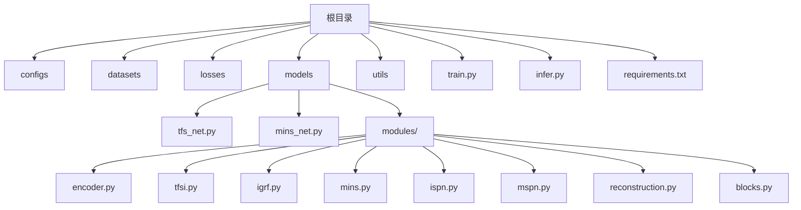
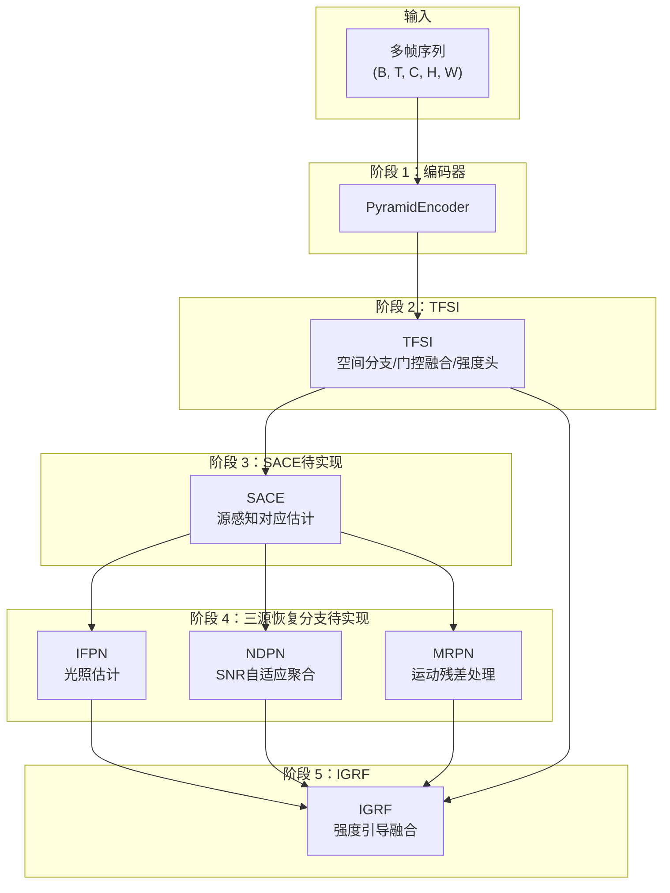
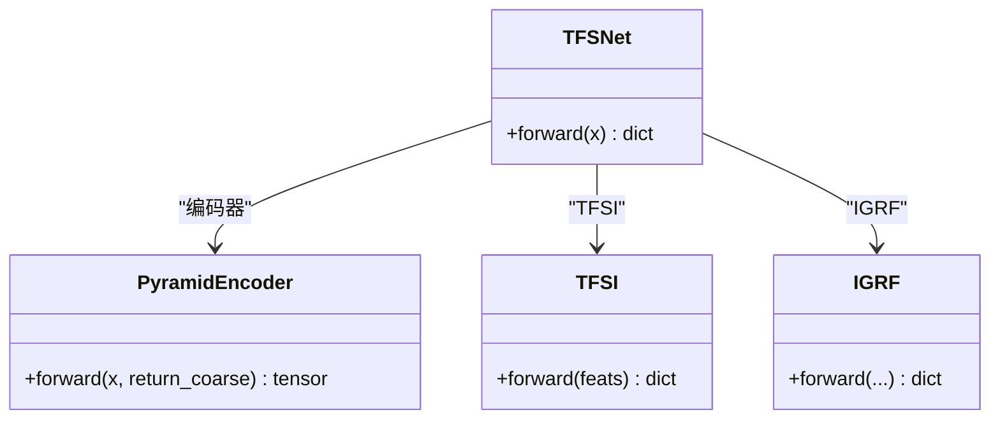
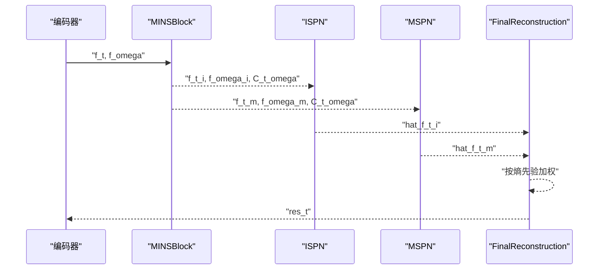
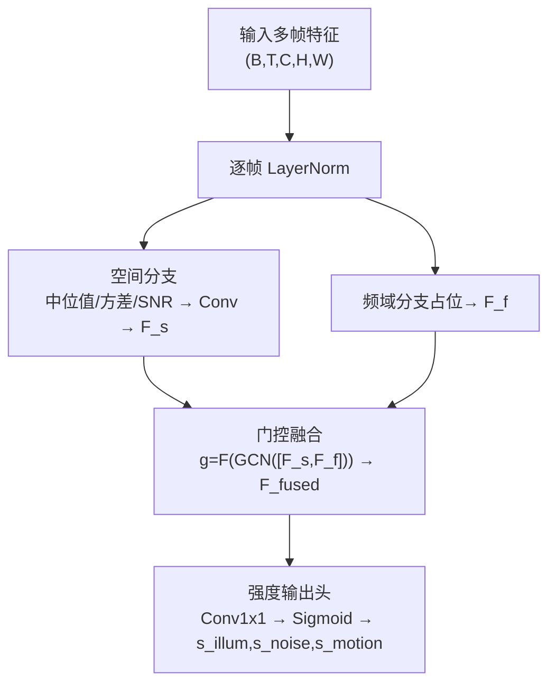
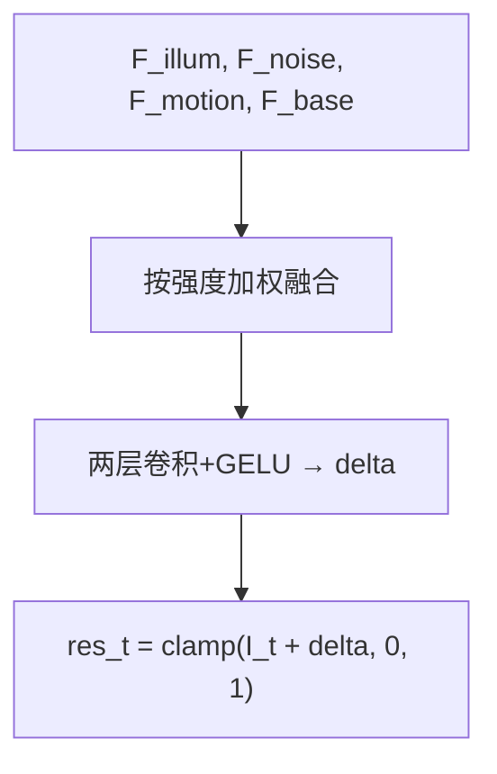
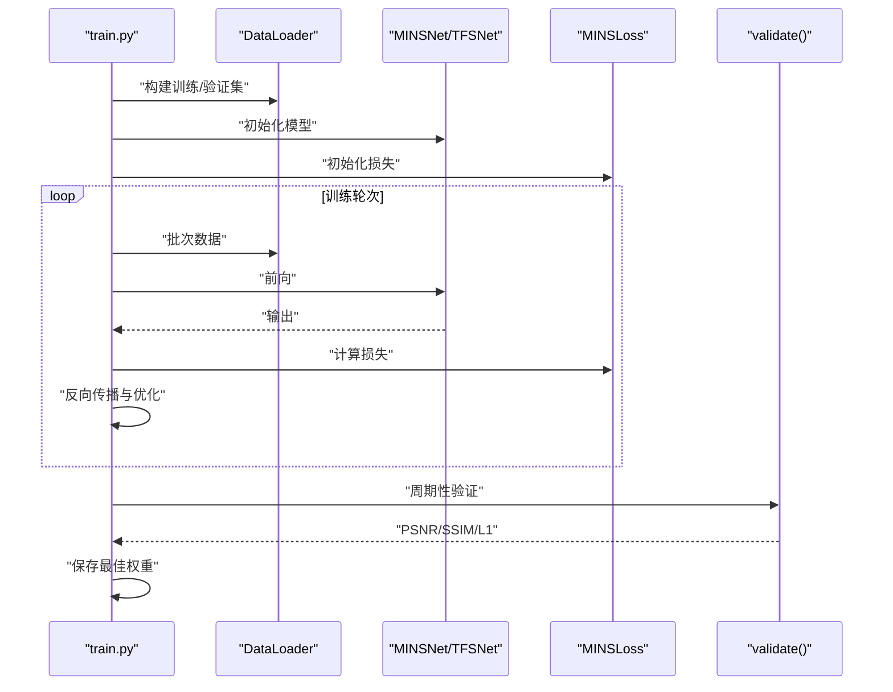
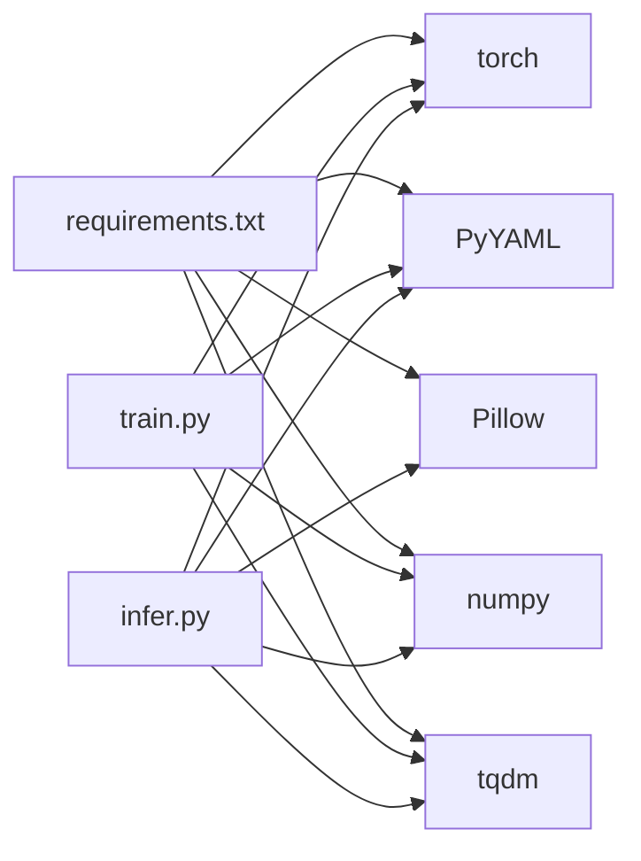

# 项目概述

<cite>
**本文引用的文件**
- [README.md](file://README.md)
- [requirements.txt](file://requirements.txt)
- [configs/sdsd_stage1.yaml](file://configs/sdsd_stage1.yaml)
- [models/tfs_net.py](file://models/tfs_net.py)
- [models/mins_net.py](file://models/mins_net.py)
- [models/modules/encoder.py](file://models/modules/encoder.py)
- [models/modules/tfsi.py](file://models/modules/tfsi.py)
- [models/modules/igrf.py](file://models/modules/igrf.py)
- [models/modules/mins.py](file://models/modules/mins.py)
- [models/modules/ispn.py](file://models/modules/ispn.py)
- [models/modules/mspn.py](file://models/modules/mspn.py)
- [models/modules/reconstruction.py](file://models/modules/reconstruction.py)
- [models/modules/blocks.py](file://models/modules/blocks.py)
- [datasets/sdsd_dataset.py](file://datasets/sdsd_dataset.py)
- [datasets/transforms.py](file://datasets/transforms.py)
- [losses/losses.py](file://losses/losses.py)
- [utils/inference.py](file://utils/inference.py)
- [utils/io.py](file://utils/io.py)
- [utils/metrics.py](file://utils/metrics.py)
- [utils/misc.py](file://utils/misc.py)
- [train.py](file://train.py)
- [infer.py](file://infer.py)
</cite>

## 目录
1. [简介](#简介)
2. [项目结构](#项目结构)
3. [核心组件](#核心组件)
4. [架构总览](#架构总览)
5. [详细组件分析](#详细组件分析)
6. [依赖分析](#依赖分析)
7. [性能考虑](#性能考虑)
8. [故障排查指南](#故障排查指南)
9. [结论](#结论)
10. [附录](#附录)

## 简介
本项目为 TFS-Net 的首个可运行版本，聚焦于视频低光增强（SDSD-first）。其核心目标是通过“时频源指示器（TFSI）”对多源退化进行建模，并在融合重建阶段实现高质量的视频增强。项目提供了轻量化金字塔编码器、MINS/ISPN/MSPN 的完整流水线以及滑动窗口中心帧监督策略，并采用像素损失、SSIM、感知损失与先验平滑损失的组合优化。

应用层面，该系统适用于视频低光增强与图像质量提升，尤其适合在光照不足、存在噪声与运动模糊的场景中恢复清晰、自然的视觉效果。项目当前实现了基于 TFSI 的多源强度估计与 IGRF 融合重建，部分后续模块（如 SACE、IFPN、NDPN、MRPN）处于设计与扩展阶段，便于未来集成更复杂的多源恢复分支。

章节来源
- [README.md:1-24](file://README.md#L1-L24)

## 项目结构
项目采用按功能分层的组织方式，核心目录与职责如下：
- configs：配置文件（如 SDSD-stage1 的训练参数）
- datasets：数据集构建与变换（SDSD 数据集）
- losses：损失函数定义（MINSLoss）
- models：主干网络与模块（TFS-Net、MINS-Net 及其子模块）
- utils：推理、IO、指标与工具函数
- 训练与推理入口：train.py、infer.py
- requirements.txt：环境依赖

图表来源
- [models/tfs_net.py:1-181](file://models/tfs_net.py#L1-L181)
- [models/mins_net.py:1-67](file://models/mins_net.py#L1-L67)
- [models/modules/encoder.py:1-102](file://models/modules/encoder.py#L1-L102)
- [models/modules/tfsi.py:1-265](file://models/modules/tfsi.py#L1-L265)
- [models/modules/igrf.py:1-89](file://models/modules/igrf.py#L1-L89)
- [models/modules/mins.py:1-131](file://models/modules/mins.py#L1-L131)
- [models/modules/ispn.py:1-26](file://models/modules/ispn.py#L1-L26)
- [models/modules/mspn.py:1-41](file://models/modules/mspn.py#L1-L41)
- [models/modules/reconstruction.py:1-24](file://models/modules/reconstruction.py#L1-L24)
- [models/modules/blocks.py:1-110](file://models/modules/blocks.py#L1-L110)

章节来源
- [requirements.txt:1-8](file://requirements.txt#L1-L8)
- [configs/sdsd_stage1.yaml:1-34](file://configs/sdsd_stage1.yaml#L1-L34)

## 核心组件
- TFS-Net v3：基于 TFSI 的五阶段流水线（编码器→TFSI→SACE→三源恢复分支→IGRF），当前已实现编码器、TFSI 与 IGRF，SACE 与三源恢复分支待实现。
- MINS-Net：面向 SDSD 的轻量级流水线，包含金字塔编码器、MINSBlock、ISPN、MSPN 与最终重建模块，用于中心帧增强与残差重建。
- 模块化基础：ConvBlock、ResBlock、LayerNorm2d、窗口划分与反划分等通用算子支撑各模块实现。
- 数据与损失：SDSDDataset 提供滑动窗口序列读取与裁剪；MINSLoss 组合像素、SSIM、感知与 TV 损失。
- 训练与推理：train.py 支持 AMP、余弦退火调度与验证；infer.py 支持瓦片推理与批量序列处理。

章节来源
- [models/tfs_net.py:34-181](file://models/tfs_net.py#L34-L181)
- [models/mins_net.py:11-67](file://models/mins_net.py#L11-L67)
- [models/modules/blocks.py:8-110](file://models/modules/blocks.py#L8-L110)
- [datasets/sdsd_dataset.py](file://datasets/sdsd_dataset.py)
- [losses/losses.py](file://losses/losses.py)
- [train.py:187-264](file://train.py#L187-L264)
- [infer.py:68-109](file://infer.py#L68-L109)

## 架构总览
下图展示了 TFS-Net v3 的五阶段数据流与当前实现状态。注意：SACE 与三源恢复分支（IFPN/NDPN/MRPN）在当前版本尚未实现，IGRF 已实现并可与 TFSI 独立运行。

图表来源
- [models/tfs_net.py:62-98](file://models/tfs_net.py#L62-L98)
- [models/modules/tfsi.py:187-265](file://models/modules/tfsi.py#L187-L265)
- [models/modules/igrf.py:27-89](file://models/modules/igrf.py#L27-L89)

## 详细组件分析

### TFS-Net v3：基于 TFSI 的多源退化建模与融合重建
- 流水线说明
  - 阶段1：共享金字塔编码器输出融合特征与粗尺度特征，支持返回粗尺度特征以供后续光照估计分支使用。
  - 阶段2：TFSI 输出三源强度图（光照、噪声、运动），并生成门控融合特征。
  - 阶段3：SACE（待实现）负责源感知对应估计，产出注意力图与光照归一化后的中位值，供后续分支使用。
  - 阶段4：三源恢复分支（待实现）分别估计光照、噪声与运动对应的特征，通道数统一为 C_f。
  - 阶段5：IGRF 将三源估计与基础特征按强度加权融合，再经两层卷积得到残差修正并重建增强帧。
- 关键特性
  - TFSI 当前实现空间分支与门控融合，频域分支为占位实现，保证整体可运行。
  - IGRF 假设基础特征为编码器融合特征，融合公式与残差重建清晰。
- 适用场景
  - 视频低光增强、弱光场景下的去噪与去模糊、运动鲁棒的帧重建。

图表来源
- [models/tfs_net.py:34-181](file://models/tfs_net.py#L34-L181)
- [models/modules/encoder.py:35-102](file://models/modules/encoder.py#L35-L102)
- [models/modules/tfsi.py:187-265](file://models/modules/tfsi.py#L187-L265)
- [models/modules/igrf.py:27-89](file://models/modules/igrf.py#L27-L89)

章节来源
- [models/tfs_net.py:14-24](file://models/tfs_net.py#L14-L24)
- [models/tfs_net.py:100-181](file://models/tfs_net.py#L100-L181)
- [models/modules/encoder.py:1-14](file://models/modules/encoder.py#L1-L14)
- [models/modules/igrf.py:14-21](file://models/modules/igrf.py#L14-L21)

### MINS-Net：多源分离与重建流水线
- 流水线说明
  - 编码器输出多帧融合特征，中心帧与邻域帧分离。
  - MINSBlock 对中心帧与邻域帧进行窗口化注意力聚合，输出运动/信息（M/I）分离特征与熵先验。
  - ISPN 对信息分量进行共享基估计与归一化，得到细化特征。
  - MSPN 对运动分量进行邻域对齐与门控融合，得到细化特征。
  - 最终重建模块将两路细化特征按熵先验加权，得到残差修正并重建增强帧。
- 关键特性
  - 窗口化注意力与熵先验驱动的 M/I 分离，提升对运动与纹理的建模能力。
  - 与 TFSI 的互补：MINS-Net 更强调时域邻域对齐与熵先验，TFSI 更强调多源强度估计。

图表来源
- [models/mins_net.py:20-67](file://models/mins_net.py#L20-L67)
- [models/modules/mins.py:62-131](file://models/modules/mins.py#L62-L131)
- [models/modules/ispn.py:13-26](file://models/modules/ispn.py#L13-L26)
- [models/modules/mspn.py:27-41](file://models/modules/mspn.py#L27-L41)
- [models/modules/reconstruction.py:12-24](file://models/modules/reconstruction.py#L12-L24)

章节来源
- [models/mins_net.py:11-67](file://models/mins_net.py#L11-L67)
- [models/modules/mins.py:22-131](file://models/modules/mins.py#L22-L131)
- [models/modules/ispn.py:7-26](file://models/modules/ispn.py#L7-L26)
- [models/modules/mspn.py:7-41](file://models/modules/mspn.py#L7-L41)
- [models/modules/reconstruction.py:5-24](file://models/modules/reconstruction.py#L5-L24)

### TFSI：时频源指示器（多源强度估计）
- 空间分支：沿时间维计算中位值、方差与 SNR，拼接后经卷积得到空间特征 F_s。
- 频域分支：当前为占位实现，返回零张量，留待 LFF 实现后接入。
- 门控融合：对 F_s 与 F_f 进行门控融合，得到 F_fused。
- 强度输出头：对 F_fused 进行 1×1 卷积并经 Sigmoid 得到三源强度图（s_illum, s_noise, s_motion）。

图表来源
- [models/modules/tfsi.py:23-265](file://models/modules/tfsi.py#L23-L265)

章节来源
- [models/modules/tfsi.py:1-15](file://models/modules/tfsi.py#L1-L15)
- [models/modules/tfsi.py:23-78](file://models/modules/tfsi.py#L23-L78)
- [models/modules/tfsi.py:80-115](file://models/modules/tfsi.py#L80-L115)
- [models/modules/tfsi.py:117-146](file://models/modules/tfsi.py#L117-L146)
- [models/modules/tfsi.py:148-185](file://models/modules/tfsi.py#L148-L185)

### IGRF：强度引导融合
- 融合公式：F_fused = s_illum·F_illum + s_noise·F_noise + s_motion·F_motion + F_base。
- 残差重建：经两层卷积与激活得到残差 delta，并与中心帧图像相加，clamp 到 [0,1]。

图表来源
- [models/modules/igrf.py:56-89](file://models/modules/igrf.py#L56-L89)

章节来源
- [models/modules/igrf.py:14-21](file://models/modules/igrf.py#L14-L21)
- [models/modules/igrf.py:56-89](file://models/modules/igrf.py#L56-L89)

### 训练与推理流程
- 训练流程：加载配置→构建数据集与 DataLoader→实例化模型与损失→AMP 训练→周期性验证与保存最佳权重。
- 推理流程：加载配置与检查点→构建模型→遍历序列→滑动窗口收集片段→瓦片推理→保存增强结果。

图表来源
- [train.py:187-264](file://train.py#L187-L264)
- [losses/losses.py](file://losses/losses.py)
- [utils/inference.py](file://utils/inference.py)

章节来源
- [train.py:48-84](file://train.py#L48-L84)
- [train.py:108-161](file://train.py#L108-L161)
- [train.py:163-185](file://train.py#L163-L185)
- [infer.py:68-109](file://infer.py#L68-L109)

## 依赖分析
- 运行时依赖：PyTorch、torchvision、Pillow、PyYAML、numpy、tqdm。
- 训练与推理依赖：AMP（混合精度）、余弦退火调度、滑动窗口与瓦片推理、指标计算（PSNR/SSIM）。
- 模块内聚与耦合：各模块通过统一的张量形状与通道约定协作；TFSI 与 IGRF 之间通过三源强度图耦合；MINS-Net 各模块通过熵先验与窗口注意力解耦。

图表来源
- [requirements.txt:1-8](file://requirements.txt#L1-L8)
- [train.py:1-34](file://train.py#L1-L34)
- [infer.py:1-29](file://infer.py#L1-L29)

章节来源
- [requirements.txt:1-8](file://requirements.txt#L1-L8)
- [train.py:1-34](file://train.py#L1-L34)
- [infer.py:1-29](file://infer.py#L1-L29)

## 性能考虑
- 滑动窗口与窗口注意力：MINSBlock 与 MSPN 使用窗口划分与反划分，减少长程依赖的计算开销，提高大分辨率下的内存效率。
- 瓦片推理：推理阶段采用瓦片大小与重叠策略，平衡显存占用与重建质量。
- AMP：训练阶段启用 AMP（CUDA 可用时），显著降低显存与加速收敛。
- 损失组合：像素、SSIM、感知与 TV 损失协同，兼顾保真度与纹理细节。

章节来源
- [models/modules/mins.py:42-54](file://models/modules/mins.py#L42-L54)
- [models/modules/mspn.py:15-26](file://models/modules/mspn.py#L15-L26)
- [train.py:205](file://train.py#L205)
- [configs/sdsd_stage1.yaml:28-33](file://configs/sdsd_stage1.yaml#L28-L33)

## 故障排查指南
- 损失非有限：若出现非有限损失，训练会跳过该步并记录警告，建议检查学习率与损失权重设置。
- 验证指标异常：验证阶段使用瓦片推理与 PSNR/SSIM 计算，若指标异常可调整瓦片大小与重叠。
- 配置路径错误：确保配置文件中的数据路径与检查点路径正确，必要时在配置文件中修改绝对路径。
- CUDA 不可用：当 CUDA 不可用时，程序自动回退至 CPU，训练速度会显著下降。

章节来源
- [train.py:126-130](file://train.py#L126-L130)
- [train.py:163-185](file://train.py#L163-L185)
- [configs/sdsd_stage1.yaml:4-7](file://configs/sdsd_stage1.yaml#L4-L7)
- [infer.py:71](file://infer.py#L71)

## 结论
本项目以 TFSI 为核心，构建了从多源退化建模到融合重建的完整框架，当前已实现编码器、TFSI 与 IGRF，具备独立运行与评估的能力。MINS-Net 提供了另一条以熵先验与窗口注意力为主的多源分离与重建路径。未来可在此基础上扩展 SACE 与三源恢复分支，进一步提升在复杂低光视频场景下的增强性能。

## 附录

### 快速开始
- 安装依赖：从 requirements.txt 安装所需包。
- 准备配置：根据本地路径修改配置文件（训练/验证数据路径）。
- 训练：执行训练脚本，指定配置文件路径。
- 推理：执行推理脚本，指定配置、检查点、输入与输出根目录。

章节来源
- [README.md:12-24](file://README.md#L12-L24)
- [requirements.txt:1-8](file://requirements.txt#L1-L8)
- [configs/sdsd_stage1.yaml:1-34](file://configs/sdsd_stage1.yaml#L1-L34)
- [train.py:187-264](file://train.py#L187-L264)
- [infer.py:68-109](file://infer.py#L68-L109)