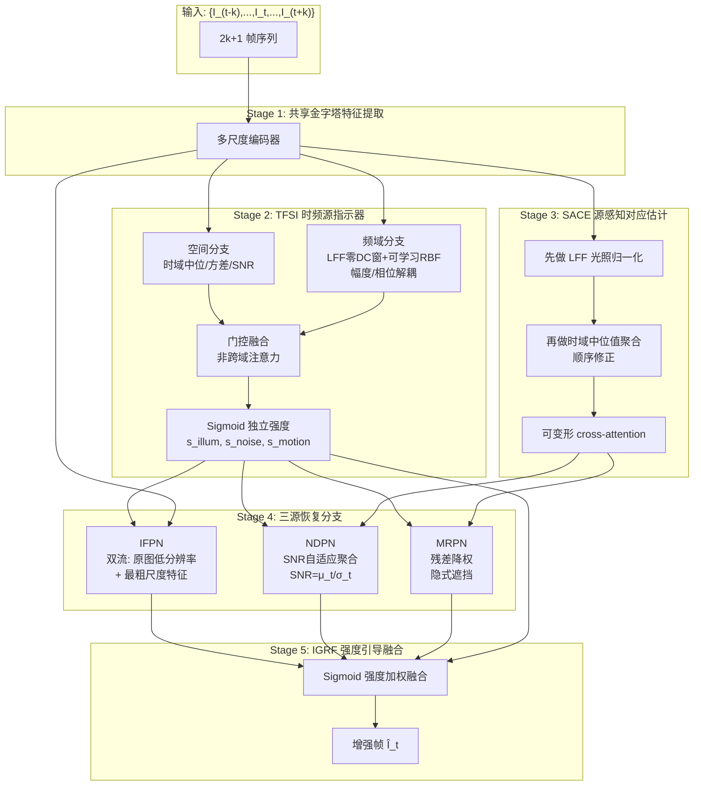

# TFS-Net v3：基于审稿质疑的深度修订框架

> 根据联网检索（检索于 2026-06-12T11:13:16+08:00），针对 TFSv2-5.md 中对 TFS-Net v2 的进一步质疑，完成第二轮修订。本轮重点：(1) 用 NeurIPS 2025 已发表方法替代审稿中的 arXiv 引用；(2) 重新审视跨域注意力的必要性；(3) 修正 SACE 的时域聚合顺序逻辑；(4) 明确 SNR 的训练/推理估计方案。

---

## 1. 现有框架分析与修改设计

### 1.1 TFSI 模块的再修订

#### 问题 1 再回应：可学习频域滤波的可靠依据

v2 中引用的 D3Net (arXiv 2502.19068) 仍在审稿，不能作为依据。经重新检索，**NeurIPS 2025 已正式接收的 FRBNet** 提供了更可靠且物理意义更深刻的方案。

**FRBNet 的核心贡献**（[Sing-Forevet/FRBNet, NeurIPS 2025](https://github.com/Sing-Forevet/FRBNet) / [openreview PDF](https://openreview.net/pdf?id=FWflRgqt8X)）：
- 从 Phong 光照模型扩展低光成像模型，**理论证明**频域通道比可提取光照不变特征
- 设计 **Learnable Frequency-domain Filter (LFF)**：
  - **Zero-DC 频率窗口** $W_g$：衰减载有光照信息的低频成分
  - **改进径向基滤波器 (RBF)** $H(u,v)$：编码频谱距离 + 方向角度调制
- 验证：暗光检测 +2.2 mAP，夜间分割 +2.9 mIoU

**v3 修改方案**：TFSI 的频域分支采用 FRBNet 的 LFF 设计——用零DC高斯窗口抑制低频光照成分，再用可学习径向基函数做频带选择性增强。这彻底替代了 v1 的"手工频带划分"和 v2 的"D3Net 风格 1×1 频域卷积"。

**其他正式发表的可学习频域滤波依据**：
- **HFre-Net** ([Knowledge-Based Systems 2026](https://www.sciencedirect.com/science/article/abs/pii/S0950705126007756))：Mixture-of-Frequency-Experts (MoFE)，证明不同退化（噪声/模糊/低光）在频域有可区分签名
- **EAFormer** ([Sensors 2025](https://www.mdpi.com/1424-8220/25/18/5912))：通过可学习频谱掩码大小动态划分高低频边界
- **AFSNet** ([Pattern Recognition Letters 2025](https://www.sciencedirect.com/science/article/abs/pii/S0141938225001738))：Region-Adaptive Frequency Decomposition (RAFD)，按区域语义内容自适应分解频率

#### 问题 2 再回应：放弃跨域注意力

经进一步检索，**图像/视频跨域（空间↔频域）注意力**的正式发表论文确实较少，主要是 EAFormer、AFSNet 等少数工作，且多数采用"并行双分支 + 末端融合"而非真正的 cross-attention。在缺乏强支撑的情况下，**v3 放弃跨域注意力**，改用更稳健的**并行双分支 + 门控融合**结构（与 AFSNet 的 DBAM 设计一致）：

```
空间分支：时域统计量 → Conv → 空间特征 F_s
频域分支：LFF (零DC窗 + 可学习RBF) → IFFT → 频域特征 F_f
融合：σ(Conv([F_s, F_f])) ⊙ F_s + (1-σ(...)) ⊙ F_f → 三源强度图
```

门控融合是图像恢复的标准操作（[Restormer, CVPR 2022]、[NAFNet, ECCV 2022]），稳健性远高于跨域注意力。

#### 问题 3 再回应：频域分离退化类型的其他依据

除 D3Net 外，正式发表的频域退化分离方法包括：
| 方法 | 发表 | 核心思想 |
|:---|:---|:---|
| [HFre-Net](https://www.sciencedirect.com/science/article/abs/pii/S0950705126007756) | KBS 2026 | 残差频谱在不同频段有退化特异签名（噪声/模糊→中高频；雾/低光→低中频） |
| [AFSNet](https://www.sciencedirect.com/science/article/abs/pii/S0141938225001738) | PRL 2025 | 区域自适应频率分解：双分支注意力（语义+频率） |
| [ExpoMamba](https://openaccess.thecvf.com/content/WACV2026/html/Adhikarla_From_Darkness_to_Detail_Frequency-Aware_SSMs_for_Low-Light_Vision_WACV_2026_paper.html) | WACV 2026 | 频域幅度↔强度、相位↔结构的解耦建模 |
| [Wavelet Cross-Attention](https://www.mdpi.com/2073-8994/18/3/470) | Symmetry 2026 | 小波域低频亮度增强 + 高频细节恢复 |

**重要发现**：ExpoMamba 的"**幅度↔光照强度、相位↔结构**"解耦为 TFSI 提供了新的物理依据——**光照闪烁主要污染幅度谱，运动/噪声主要污染相位谱**。这成为 v3 的新分离信号。

---

### 1.2 SACE 模块的再修订

#### 问题：时域平均时尚未去除光照闪烁

v2 中"时域中位值滤波抑制 i.i.d. 噪声"的顺序确实有逻辑缺陷——**若光照闪烁未消除，同一像素的不同帧亮度差异巨大，时域中位值会偏向某一光照水平的帧，导致结构信息被扭曲**。

**v3 修正方案：调整为"先光照归一化 → 再时域聚合"的顺序**

具体而言：
1. **Step 1 (新增前置)**：对每帧用 FRBNet 风格的 LFF 在频域抑制低频光照成分，得到光照归一化特征 $\bar{F}_i$
   $$\bar{F}_i = \mathcal{F}^{-1}\big(W_g \odot H_{RBF} \odot \mathcal{F}(F_i)\big)$$
2. **Step 2**：在光照归一化的 $\bar{F}_i$ 上做时域中位值聚合，此时各帧光照水平一致，中位值真实反映"干净结构"
   $$\mu_t(x,y) = \text{Median}_i\{\bar{F}_i(x,y)\}$$
3. **Step 3**：在 $\bar{F}_i$ 上做对应估计（可变形 cross-attention）

这一调整使得对应估计在"光照一致 + 噪声抑制"的双净化特征上进行，鲁棒性显著提升。

---

### 1.3 IFPN 模块的再修订

#### 问题：最粗尺度特征过于工程化

**v3 修改方案**：采用**双流输入设计**（参考 [HDRNet, SIGGRAPH 2017] 的双流思想）：
- **流 1（原始图像低分辨率版）**：$I_t^{down} \in \mathbb{R}^{H/8 \times W/8 \times 3}$，保留原始光照信息
- **流 2（最粗尺度特征）**：$F_t^{(L)} \in \mathbb{R}^{H/8 \times W/8 \times C}$，提供语义引导

光照图估计器为：
$$L_t = \text{IllumExtract}\big(\text{Concat}[I_t^{down}, \text{Conv}_{1\times1}(F_t^{(L)})]\big)$$

理由：
- 原始图像低分辨率版保留了真实光照分布（即使 SNR 低，下采样可平均化噪声）
- 最粗尺度特征提供语义先验，指导光照估计区分"暗物体"和"暗光照"
- 双流融合避免单一来源的局限

---

### 1.4 NDPN 模块的再修订

#### 问题：SNR 自适应在训练/推理中如何估计？

这是 v2 的关键遗漏。SNR 估计需要清晰的可计算方案。

**v3 方案：基于时域统计量的逐像素 SNR 估计**

**训练阶段**：
- **方案 A（推荐，无监督）**：直接利用 TFSI 输出的时域统计量
  $$\hat{\text{SNR}}(x,y) = \frac{|\mu_t(x,y)|}{\sigma_t(x,y) + \epsilon}$$
  其中 $\mu_t, \sigma_t$ 为光照归一化后的时域中位值和标准差（已在 SACE 中计算）
- **方案 B（监督辅助）**：若有 GT 干净帧，可用 $\text{SNR}_{GT} = \|I_t^{GT}\|_2 / \|I_t - I_t^{GT}\|_2$ 作为辅助监督训练一个 SNR 估计子网络

**推理阶段**：
- 仅用方案 A，无需 GT
- SNR 图先做 $3\times3$ 中值滤波平滑，再归一化到 $[0,1]$：$\tilde{s}_{SNR} = \text{sigmoid}((\hat{\text{SNR}} - \tau_{mid}) / \tau_{scale})$
- $\tau_{mid}, \tau_{scale}$ 为可学习标量（不是手工超参数）

**SNR 用法**：
- 高 SNR 区域：减少邻帧聚合权重（保留细节）
- 低 SNR 区域：增大邻帧聚合权重（提升信噪比）

具体而言，NDPN 的聚合权重为：
$$\alpha_i(x,y) = \sigma\big(\text{Conv}(|F_i^{aligned} - F_t|)\big) \cdot (1 - \tilde{s}_{SNR}(x,y))$$

即"对齐残差小 + SNR 低"的位置邻帧贡献最大。

---

## 2. 问题分析与创新切入点

### 2.1 物理退化模型（保持 v2）

$$I_t^{degraded} = \text{ISP}\Big(\gamma_t \cdot \big[\text{Blur}_{motion}(\mathbf{R} \cdot \mathbf{L}_t) + n_{shot}(\mathbf{L}_t) + n_{read}\big]\Big)$$

### 2.2 v3 新增物理观察

借鉴 [ExpoMamba, WACV 2026](https://openaccess.thecvf.com/content/WACV2026/html/Adhikarla_From_Darkness_to_Detail_Frequency-Aware_SSMs_for_Low-Light_Vision_WACV_2026_paper.html) 的频域解耦发现：

| 退化类型 | 频域签名（FFT） | 主要影响 |
|:---|:---|:---|
| 光照闪烁 $\gamma_t$ | 低频幅度谱波动 | 幅度谱低频段 |
| 成像噪声 $n_{shot}+n_{read}$ | 全频段相位扰动 | 相位谱全段 |
| 运动退化 $\text{Blur}_{motion}$ | 沿运动方向的带状幅度衰减 | 幅度谱中高频 |

**v3 的核心物理依据升级**：三源退化不仅在"时频联合域"可分离，还在"**幅度谱-相位谱**"维度上有结构性差异。这为 TFSI 提供了更精细的分离信号。

### 2.3 与最新工作的差异定位

| 工作 | 发表 | 与 TFS-Net v3 的对比 |
|:---|:---|:---|
| [FRBNet](https://github.com/Sing-Forevet/FRBNet) | NeurIPS 2025 | 仅处理光照不变特征，不区分多源退化；TFS-Net v3 **复用其 LFF 作为子模块**，扩展到三源分离 |
| [HFre-Net](https://www.sciencedirect.com/science/article/abs/pii/S0950705126007756) | KBS 2026 | All-in-one 通用恢复，**不针对视频时序**；TFS-Net v3 引入时域统计量+对齐 |
| [AFSNet](https://www.sciencedirect.com/science/article/abs/pii/S0141938225001738) | PRL 2025 | 单帧低光增强，**无时序建模**；TFS-Net v3 是视频框架 |
| [ExpoMamba](https://openaccess.thecvf.com/content/WACV2026/html/Adhikarla_From_Darkness_to_Detail_Frequency-Aware_SSMs_for_Low-Light_Vision_WACV_2026_paper.html) | WACV 2026 | 单帧 SSM，**无多帧聚合**；TFS-Net v3 综合多帧 + 频域 |

**核心创新空白**：尚无工作同时实现 (a) 视频时序建模，(b) 三源退化分离，(c) 频域可学习滤波，(d) 允许多源叠加的强度估计。

---

## 3. 整体架构设计



---

## 4. 关键模块详细设计

### 4.1 TFSI v3（时频源指示器）

**输入**：多帧特征 $\{F_i\}_{i=t-k}^{t+k}$

**Step 1：空间分支（时域统计）**
$$\mu_t(x,y) = \text{Median}_i\{F_i(x,y)\}, \quad \sigma_t^2(x,y) = \text{Var}_i\{F_i(x,y)\}$$
$$F_s = \text{Conv}_{3\times3}(\text{Concat}[\mu_t, \sigma_t, \mu_t/(\sigma_t+\epsilon)])$$

**Step 2：频域分支（FRBNet 风格 LFF）**

借鉴 [FRBNet, NeurIPS 2025](https://github.com/Sing-Forevet/FRBNet)：
$$\mathcal{F}_i = \text{FFT}(F_i), \quad |\mathcal{F}_i| = \text{Amplitude}, \quad \angle\mathcal{F}_i = \text{Phase}$$

零DC高斯窗 + 可学习径向基滤波：
$$W_g(u,v) = 1 - \exp\Big(-\frac{u^2+v^2}{2\sigma_g^2}\Big), \quad \sigma_g \text{ 可学习}$$
$$H(u,v) = \sum_{k=1}^{K} \omega_k \phi_k\big(\|(u,v)-\mu_k\|\big) \cdot \cos(\theta_{uv} - \theta_k)$$
$$\tilde{\mathcal{F}}_i = W_g \odot H \odot \mathcal{F}_i$$

幅度/相位分别处理（光照→幅度，结构→相位）：
$$F_f = \text{Conv}_{1\times1}\big(\text{Concat}[|\tilde{\mathcal{F}}_i|, \angle\tilde{\mathcal{F}}_i]\big)$$

**Step 3：门控融合（替代跨域注意力）**
$$g = \sigma\big(\text{Conv}_{1\times1}(\text{Concat}[F_s, F_f])\big)$$
$$F_{fused} = g \odot F_s + (1-g) \odot F_f$$

**Step 4：Sigmoid 独立强度输出**
$$[s_{illum}, s_{noise}, s_{motion}] = \sigma\big(\text{Conv}_{1\times1}(F_{fused})\big), \quad s_{*} \in [0,1]$$

**关键升级**：每个强度独立 Sigmoid，允许多源叠加（物理正确）。

---

### 4.2 SACE v3（顺序修正的源感知对应估计）

**Step 1：先光照归一化（修正 v2 顺序）**
$$\bar{F}_i = \text{LFF}(F_i) \quad \text{(复用 TFSI 频域分支的 LFF)}$$

**Step 2：再时域聚合去噪**
$$\mu_t^{clean}(x,y) = \text{Median}_i\{\bar{F}_i(x,y)\}$$

在光照一致的特征上做中位值聚合，避免光照差异污染结构估计。

**Step 3：可变形 cross-attention 对应估计**
$$Q_t = W_Q \bar{F}_t, \quad K_i = W_K \bar{F}_i(\cdot + \Delta p_i), \quad \Delta p_i \text{ 可学习偏移}$$
$$\mathbf{A}_{t \to i} = \text{Softmax}(Q_t K_i^T / \sqrt{d})$$

参考 [DAT, CVPR 2023]、[EDVR, CVPR 2019]。

---

### 4.3 IFPN v3（双流光照估计）

**输入**：
- 原始图像低分辨率版 $I_t^{down} = \text{Bicubic}(I_t, 1/8)$
- 最粗尺度特征 $F_t^{(L)}$

**光照估计器**：
$$L_t = \text{IllumExtract}\big(\text{Concat}[I_t^{down}, \text{Conv}_{1\times1}(F_t^{(L)})]\big)$$

参考 [HDRNet, SIGGRAPH 2017] 的双流设计 + [Retinexformer, ICCV 2023] 的光照估计器结构。

**邻帧参考光照**：
$$L_{ref} = \sum_{i \neq t} w_i L_i, \quad w_i = \text{Softmax}(\text{sim}(F_i, F_t))$$

**强度调制矫正**：
$$F_t^{illum\_out} = s_{illum} \cdot F_t^{illum} \cdot \frac{L_{ref}}{L_t + \epsilon} + (1-s_{illum}) \cdot F_t^{illum}$$

---

### 4.4 NDPN v3（SNR 自适应聚合）

**SNR 估计**（明确化）：
$$\hat{\text{SNR}}(x,y) = \frac{|\mu_t^{clean}(x,y)|}{\sigma_t(x,y) + \epsilon}$$
$$\tilde{s}_{SNR}(x,y) = \sigma\big((\hat{\text{SNR}} - \tau_{mid})/\tau_{scale}\big), \quad \tau_{mid}, \tau_{scale} \text{ 可学习}$$

**Step 1：注意力 Warp 对齐**
$$F_i^{aligned} = \mathbf{A}_{t \to i} \cdot W_V F_i$$

**Step 2：双因素动态权重**
$$\alpha_i(x,y) = \sigma\big(\text{Conv}(|F_i^{aligned} - F_t|)\big) \cdot (1 - \tilde{s}_{SNR}(x,y))$$

- 对齐残差小 + SNR 低 → 邻帧权重大
- 对齐残差大 OR SNR 高 → 邻帧权重小（保留细节）

**Step 3：聚合输出**
$$F_t^{denoised} = \frac{\sum_i \alpha_i F_i^{aligned}}{\sum_i \alpha_i + \epsilon}$$
$$F_t^{noise\_out} = s_{noise} F_t^{denoised} + (1-s_{noise}) F_t$$

参考 [DarkVRAI, AIM 2025]、[EDVR TSA, CVPR 2019]。

---

### 4.5 MRPN v3（保持 v2 设计）

残差驱动隐式遮挡处理，详见 v2，此处不重复。

---

### 4.6 IGRF v3（强度引导融合）

$$F_{fused} = s_{illum} F_t^{illum\_out} + s_{noise} F_t^{noise\_out} + s_{motion} F_t^{motion\_out} + F_t^{base}$$
$$\hat{I}_t = \text{Conv}_{3\times3}(F_{fused}) + I_t$$

---

## 5. 损失函数设计

### 5.1 总损失
$$\mathcal{L}_{total} = \mathcal{L}_{recon} + \lambda_1 \mathcal{L}_{temporal} + \lambda_2 \mathcal{L}_{consist} + \lambda_3 \mathcal{L}_{illum\_smooth} + \lambda_4 \mathcal{L}_{perc}$$

### 5.2 各项定义

**(1) 重建损失**（空间 + 频域）
$$\mathcal{L}_{recon} = \|\hat{I}_t - I_t^{GT}\|_1 + 0.1 \cdot \|\text{FFT}(\hat{I}_t) - \text{FFT}(I_t^{GT})\|_1$$
参考 [Cho et al., ICCV 2021]

**(2) 时序一致性损失**
$$\mathcal{L}_{temporal} = \sum_{i \neq t} \|\text{Warp}(\hat{I}_i, \text{Flow}_{i \to t}) - \hat{I}_t\|_1 \cdot (1-M_{occ})$$
RAFT 估计光流，遮挡 mask 抑制虚假梯度

**(3) 源强度时序一致性正则**（替代 v1 的正交损失）
$$\mathcal{L}_{consist} = \sum_{s \in \{illum,noise,motion\}} \|\text{Warp}(s^{(i)}, \text{Flow}) - s^{(t)}\|_1$$
物理依据：同一区域的退化类型不会帧间突变

**(4) 光照源强度空间平滑**（仅对 $s_{illum}$）
$$\mathcal{L}_{illum\_smooth} = \|\nabla s_{illum}\|_1 \cdot \exp(-\|\nabla I_t\|_1)$$
噪声/运动强度不施加此约束（v2 修正）

**(5) 感知损失**：VGG-19 标准 relu1_2, relu2_2, relu3_4

**超参数**：$\lambda_1=0.5, \lambda_2=0.1, \lambda_3=0.01, \lambda_4=0.1$

---

## 6. 参考文献列表

### 可学习频域滤波（v3 核心新增）
1. **[Sing et al., NeurIPS 2025]** [FRBNet: Revisiting Low-Light Vision through Frequency-Domain Radial Basis Network](https://openreview.net/pdf?id=FWflRgqt8X) — TFSI 频域分支的核心参考
2. **[Sun et al., Knowledge-Based Systems 2026]** [Hierarchical Frequency Adaptation for All-in-One Image Restoration](https://www.sciencedirect.com/science/article/abs/pii/S0950705126007756) — 频域退化分离依据
3. **[Adhikarla et al., WACV 2026]** [From Darkness to Detail: Frequency-Aware SSMs for Low-Light Vision (ExpoMamba)](https://openaccess.thecvf.com/content/WACV2026/html/Adhikarla_From_Darkness_to_Detail_Frequency-Aware_SSMs_for_Low-Light_Vision_WACV_2026_paper.html) — 幅度/相位解耦物理依据
4. **[EAFormer, Sensors 2025]** [Edge-Aware Guided Adaptive Frequency-Navigator Network](https://www.mdpi.com/1424-8220/25/18/5912) — 可学习频谱掩码
5. **[AFSNet, PRL 2025]** [Adaptive Frequency Selection Network for Low-Light Image Enhancement](https://www.sciencedirect.com/science/article/abs/pii/S0141938225001738) — 区域自适应频率分解

### 低光增强与视频恢复
6. **[Cai et al., ICCV 2023]** Retinexformer: One-stage Retinex-based Transformer
7. **[Wu et al., CVPR 2022]** URetinex-Net: Retinex-based Deep Unfolding Network
8. **[Gharbi et al., SIGGRAPH 2017]** Deep Bilateral Learning for Real-Time Image Enhancement (HDRNet) — 双流光照估计
9. **[Liang et al., TIP 2024]** VRT: A Video Restoration Transformer
10. **[Wang et al., CVPR 2019]** EDVR: Video Restoration with Enhanced Deformable Convolutional Networks
11. **[Chan et al., CVPR 2022]** BasicVSR++: Improving Video Super-Resolution
12. **[Jin et al., CVPR 2025]** [Classic Video Denoising in a Machine Learning World](https://openaccess.thecvf.com/content/CVPR2025/html/Jin_Classic_Video_Denoising_in_a_Machine_Learning_World_Robust_Fast_CVPR_2025_paper.html)

### 注意力与对齐
13. **[Zamir et al., CVPR 2022]** Restormer: Efficient Transformer for High-Resolution Image Restoration
14. **[Chen et al., ECCV 2022]** Simple Baselines for Image Restoration (NAFNet)
15. **[Xia et al., CVPR 2023]** Deformable Attention Transformer (DAT)
16. **[Wang et al., CVPR 2023]** InternImage: Exploring Large-Scale Vision Foundation Models with Deformable Convolutions

### 损失函数
17. **[Cho et al., ICCV 2021]** Rethinking Coarse-to-Fine Approach in Single Image Deblurring — 频率损失
18. **[Lai et al., TPAMI 2022]** Learning Blind Video Temporal Consistency — 时序一致性

---

## v3 相对 v2 的核心改进总结

| 模块 | v2 设计 | v3 修订 | 改进依据 |
|:---|:---|:---|:---|
| TFSI 频域 | D3Net 风格 1×1 频域卷积（arXiv 审稿中） | **FRBNet 的 LFF（零DC窗+可学习RBF）** | NeurIPS 2025 正式发表 |
| TFSI 融合 | 跨域 cross-attention | **门控融合**（更稳健） | 跨域注意力依据不足 |
| TFSI 信号 | 仅时频空间 | **新增幅度/相位解耦** | ExpoMamba WACV 2026 |
| SACE 顺序 | 时域去噪 → 光照归一化 | **光照归一化 → 时域去噪** | 逻辑修正 |
| IFPN 输入 | 仅最粗尺度特征 | **双流：低分辨率原图 + 最粗特征** | HDRNet 双流思想 |
| NDPN SNR | 未明确估计方案 | **$\hat{SNR}=\mu_t/\sigma_t$，可学习归一化参数** | 训练/推理一致 |
| 频域分离依据 | 仅 D3Net | **FRBNet + HFre-Net + ExpoMamba + AFSNet** | 4 篇正式发表论文 |

---

## 参考来源

- [FRBNet (NeurIPS 2025) - GitHub](https://github.com/Sing-Forevet/FRBNet)
- [FRBNet (NeurIPS 2025) - OpenReview](https://openreview.net/pdf?id=FWflRgqt8X)
- [HFre-Net (KBS 2026)](https://www.sciencedirect.com/science/article/abs/pii/S0950705126007756)
- [EAFormer (Sensors 2025)](https://www.mdpi.com/1424-8220/25/18/5912)
- [AFSNet (PRL 2025)](https://www.sciencedirect.com/science/article/abs/pii/S0141938225001738)
- [ExpoMamba (WACV 2026)](https://openaccess.thecvf.com/content/WACV2026/html/Adhikarla_From_Darkness_to_Detail_Frequency-Aware_SSMs_for_Low-Light_Vision_WACV_2026_paper.html)
- [Wavelet Cross-Attention (Symmetry 2026)](https://www.mdpi.com/2073-8994/18/3/470)
- [Classic Video Denoising (CVPR 2025)](https://openaccess.thecvf.com/content/CVPR2025/html/Jin_Classic_Video_Denoising_in_a_Machine_Learning_World_Robust_Fast_CVPR_2025_paper.html)

如需进一步推进——例如撰写消融实验设计、FRBNet LFF 模块的 PyTorch 实现代码、或针对某个审稿点的反驳论证——请告知。

