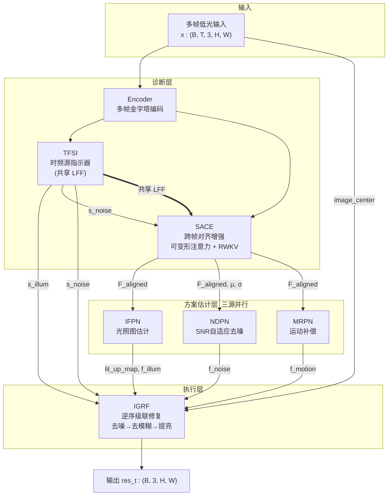
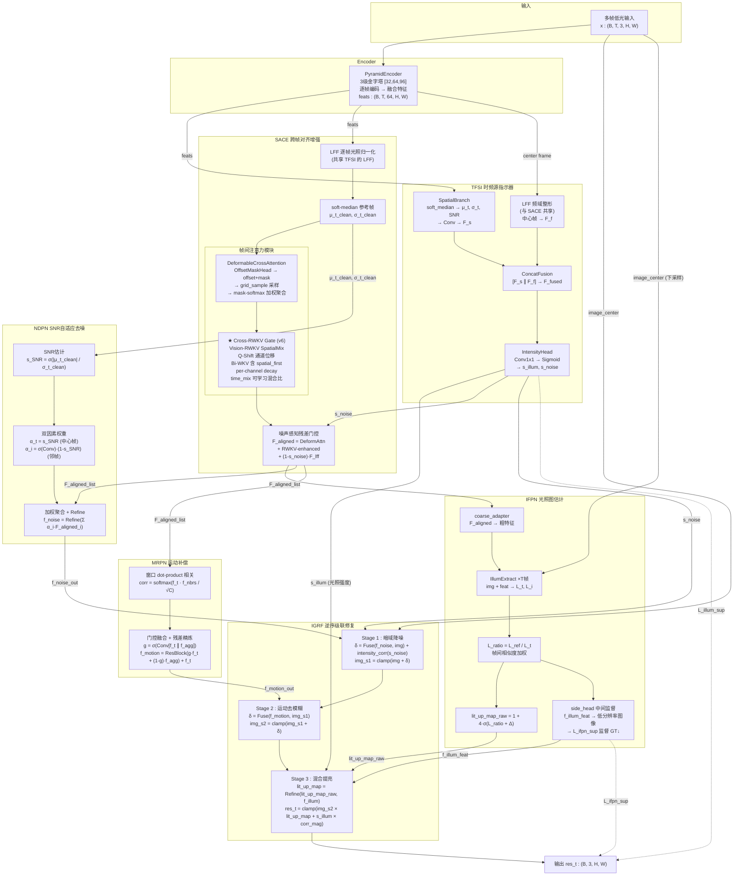

# TFS-Net v6 整体架构图（含 Cross-RWKV Gate 帧间注意力，2026-06-27）

## 图一：最简架构（概括框架）



### 框架要点

- **三源分离估计**：TFSI 从多帧特征诊断两种退化强度（s_illum 光照、s_noise 噪声），运动强度由 MRPN 隐式感知
- **TFSI ↔ SACE 共享 LFF**：LFF 是频域幅度整形模块。TFSI 用它从中心帧提取频域诊断特征；SACE 用它逐帧做光照归一化后再对齐
- **SACE 两阶段注意力**：第一阶段 DeformableCrossAttention 做空间精对齐（4组×9采样点），第二阶段 Cross-RWKV Gate 做多帧长程聚合（Vision-RWKV Bi-WKV + spatial_first）
- **三源处理**：IFPN/NDPN/MRPN 三个分支并行，各自从 SACE 对齐特征估计修复方案
- **IGRF 逆序执行**：物理逆序——去噪(n_t) → 去模糊(k_t) → 提亮(γ_t)，s_illum/s_noise 直入指导执行强度

---

## 图二：带细节架构（SACE 内部展开 + 全数据流）



### 关键模块说明

| 模块 | 核心机制 | 关键参数 |
|---|---|---|
| **Encoder** | 3 级金字塔编码，无归一化 Conv 主干 | fused=64ch, H×W 全分辨率 |
| **TFSI** | 双分支诊断：空间(中位值/方差/SNR) + 频域(LFF)，独立 Sigmoid 输出 | s_illum, s_noise ∈ [0,1] |
| **SACE DeformAttn** | 4 组 × 3×3 采样点 = 36 个偏移采样位置，offset+mask 直接预测 | n_groups=4, kernel_size=3 |
| **SACE Cross-RWKV** | Vision-RWKV Bi-WKV 含 spatial_first + time_mix 可学习混合比，per-channel decay | T=5 帧, C=64 通道 |
| **IFPN** | Retinex 光照估计 + L_ratio 锚点 + 特征 delta 修正 + side_head 中间监督 | lit_up_map ∈ [1,5] |
| **NDPN** | SNR 自适应双因素聚合权重 + Refine | s_SNR 控制中心帧置信度 |
| **MRPN** | 窗口 dot-product 相关 + 门控融合 + 残差精炼 | window_size=8 |
| **IGRF Stage1** | 暗域降噪 + s_noise 加法修正 | intensity_corr 零初始化 |
| **IGRF Stage2** | 运动去模糊，无强度先验 | — |
| **IGRF Stage3** | 混合提亮：乘法 lit_up_map + s_illum 加法修正 | illum_corr 零初始化 |

### TFSI ↔ SACE 关系

| 关系 | 说明 |
|---|---|
| **共享 LFF** | TFSI FrequencyBranch 和 SACE 使用**同一 LFF 模块实例**。TFSI 用 LFF 对中心帧提取频域诊断特征 F_f；SACE 用 LFF 对每帧做光照归一化后再对齐 |
| **s_noise 门控** | TFSI 输出的 s_noise 传入 SACE 的噪声感知残差门控：高噪区抑制残差（噪声不透穿），低噪区保留信息流 |
| **s_illum 直入 IGRF** | TFSI 输出的 s_illum 直入 IGRF Stage 3 做加法修正，不经 IFPN（避免通道稀释） |

### SACE 帧间注意力（v6）

```
SACE 内部数据流:
  feats → [LFF 归一化] → soft-median(μ_t_clean)
       → [DeformableCrossAttention]
            OffsetMaskHead → offset + mask → grid_sample 采样 → mask-softmax 加权
       → [Cross-RWKV Gate] ★ v6
            已对齐的 F_aligned → Q-Shift 通道位移
            → time_mix(xk = x·mix_k + shifted·(1-mix_k))
            → Bi-WKV: (u·k_t·v_t + Σ ew·k·v) / (u·k_t + Σ ew·k)
            → sigmoid(r) 门控 → output → +残差
       → F_aligned = DeformAttn + RWKV_enhanced + (1-s_noise)·F_lff
```

**Cross-RWKV Gate 关键设计**：
- 继承 Vision-RWKV (ICLR 2025) 的 Bi-WKV + Q-Shift + VRWKV_SpatialMix
- `spatial_first(u)` 给当前帧额外 boost 权重
- `spatial_mix_k/v/r` 可学习混合比（当前 vs 历史特征）
- per-channel decay 从 -5 到 +3 指数分布
- 零初始化输出投影 → 初始恒等 = 完全保留 v5.9.2 预训练质量
