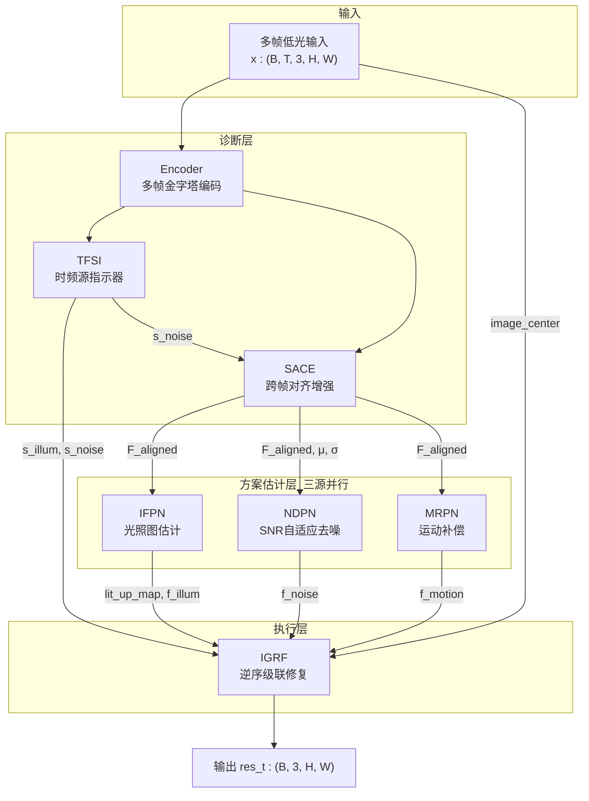
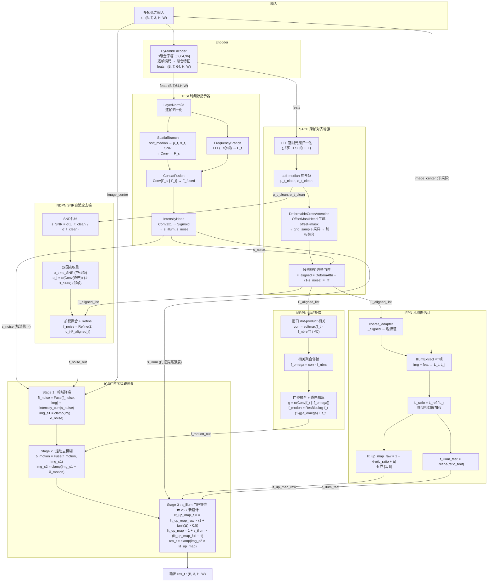

# TFS-Net v5.7 整体架构图（s_illum 门控提亮，2026-06-22）

## 图一：最简架构（概括框架）

### 框架要点

- **三源分离估计**：TFSI 从多帧特征诊断两种退化强度（s_illum 光照、s_noise 噪声），运动强度由 MRPN 隐式感知
- **三源处理**：IFPN/NDPN/MRPN 三个分支并行，各自从 SACE 对齐特征估计修复方案
- **修正去噪**：IGRF 按物理逆序执行修复——去噪→去模糊→提亮，s_illum 门控 lit_up_map（s_illum=0→无提亮→模型被迫让 s_illum>0），s_noise 作加法修正参与去噪
- **TFSI 与 SACE 的关系**：共享 LFF 频域模块；TFSI 用 LFF 诊断退化强度，SACE 用 LFF 做光照归一化后再对齐

---

## 图二：带细节的架构（模块内部数据流）

### v5.7 核心改动：s_illum 门控提亮（Stage 3）

| 版本 | Stage 3 公式 | s_illum 角色 | 问题 |
|------|-------------|-------------|------|
| v5.5 (加法修正) | `res_t = img_s2 × lit_up_map + s_illum × corr_mag` | 加法补正 (可旁路) | s_illum 塌缩到 0, lit_up_map 独自完成提亮 |
| **v5.7 (乘法门控)** | `lit_up_map = 1 + s_illum × (lit_up_map_full − 1)` `res_t = img_s2 × lit_up_map` | **门控因子 (不可旁路)** | s_illum=0→无提亮→高损失→**模型被迫让 s_illum>0** |

**门控机制的关键性质**：
- `lit_up_map_full` 提供"提亮什么"（内容感知的空间模式，来自 IFPN）
- `s_illum` 提供"提亮多少"（诊断驱动的强度门控，来自 TFSI）
- `s_illum=0` → `lit_up_map=1` → `res_t=img_s2`（无提亮）→ 重建损失高 → **s_illum 不能为 0**
- `s_illum=1` → `lit_up_map=lit_up_map_full`（完全提亮）
- 梯度：`∂res_t/∂s_illum = img_s2 × (lit_up_map_full − 1)`（非零，无衰减）

### 关键关系说明

| 关系 | 说明 |
|------|------|
| **TFSI ↔ SACE 共享 LFF** | LFF 是频域幅度整形模块。TFSI 用它从中心帧提取频域特征 F_f 供诊断；SACE 用它对每帧做光照归一化（低频抑制），使后续对齐不受光照差异干扰 |
| **TFSI → IGRF s_illum 门控** | s_illum 门控 lit_up_map：lit_up_map=1+s_illum×(lit_up_map_full−1)。s_illum=0→无提亮→模型被迫让 s_illum>0，消除功能冗余 |
| **TFSI → IGRF s_noise 加法** | s_noise 直入 Stage 1 作加法修正 intensity_corr(s_noise)，不经中间分支，避免梯度衰减 |
| **TFSI → SACE 门控** | s_noise 传入 SACE 的残差门控：高噪区 (s_noise→1) 抑制残差（噪声不穿透），低噪区保留信息流 |
| **三分支并行** | IFPN/NDPN/MRPN 各自从 SACE 对齐特征估计修复方案，不接收强度先验（纯数据驱动），互不依赖 |
| **IGRF 逆序执行** | 物理逆序：去噪(逆 n_t) → 去模糊(逆 k_t) → 提亮(逆 γ_t)。Stage 1/2 硬 clamp，最终输出硬 clamp |
| **SACE 可变形对齐** | OffsetMaskHead 从 [μ_t_clean ∥ F_lff] 预测 offset 和 mask；DeformableCrossAttention 在 offset 位置 grid_sample 采样，mask softmax 加权聚合。无 QK 点积，mask 即注意力权重 |
