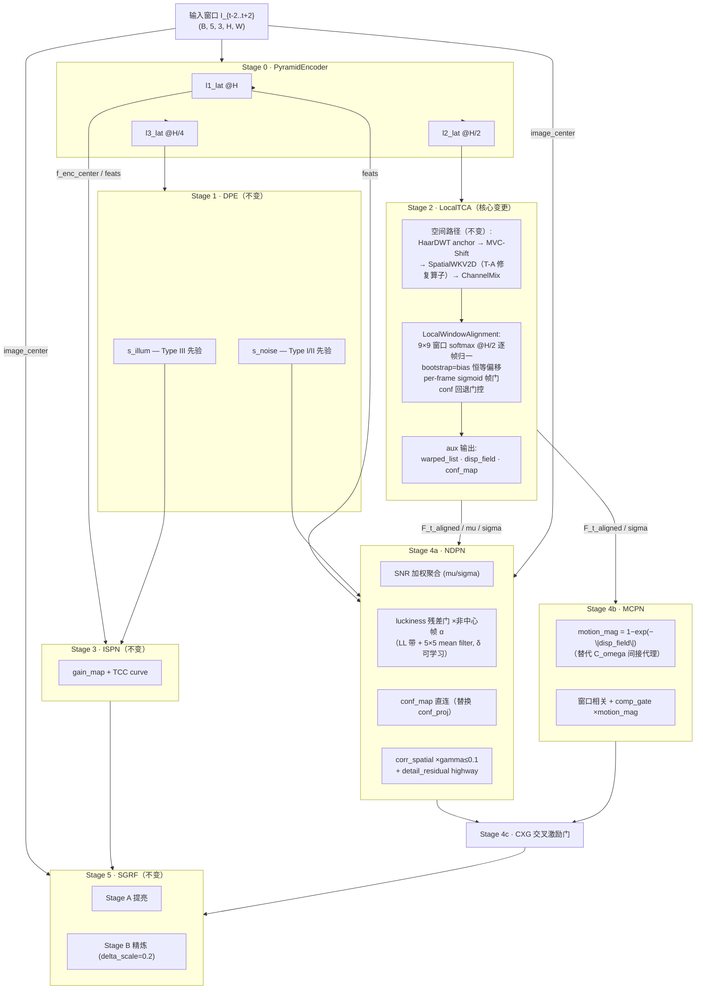
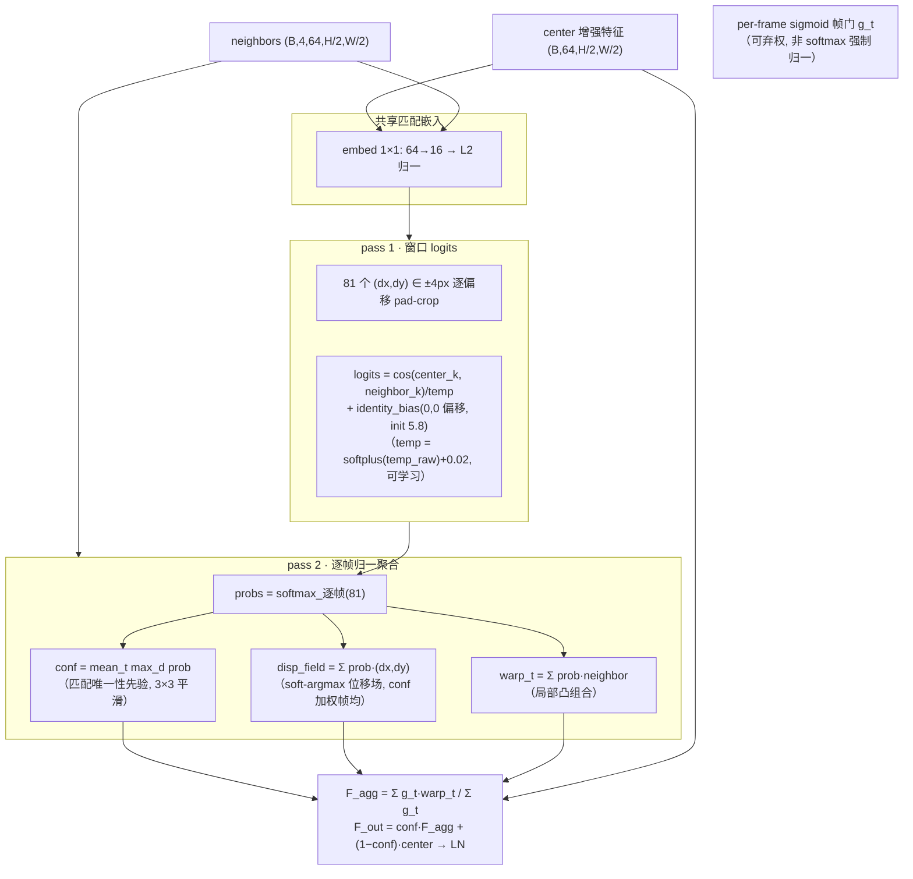

# Delta-Flight 11 FSD — 计划与实现文档

> 版本: Flight 11 FSD (2026-09-10 立项，当日实现并启动训练)
> 前置: Flight 10 Mark5 (F10m5, 基线 20.02@40) + 概念模型实验弧 (v1→v2→TBC1B) + 本地 LLVE 参考库代码调研
> 关联文档: `TSDR-framework-716.md`(理论) · `v6-architecture.md` §9(探索中变更) · `experiments/rwkv_only_v3/RESULTS.md`(实验证据) · `experiments/rwkv_only_v3/TCA_IMPROVEMENT.md`(机制设计)
> 执行状态: **训练中** — `outputs/sdsd_f11/`，40ep/AMP/keepalive，2026-09-10 15:24 启动

---

## 1. 立项动机

### 1.1 概念模型实验弧的最终裁决

| 实验 | 结论 |
|------|------|
| v1→v2 (概念模型) | 简化骨架 20.02@40 **反超** F10m5 完整模型 18.27@40 (+1.75dB) |
| 无TCA | TCA 整体净贡献 ≈0（早期负/后期正则化）|
| A / BC | head 微调路线穷尽（-0.29 / -0.11）|
| TA | WKV 算子数学修复（naive 对照 4.77e-07）中性 → 排除算子嫌疑 |
| TBC / TBC1B | 局部窗口对齐转正：**19.99@40 平基线 + pair45 运动场景 +0.65dB 决定性改善** |
| 路由假说 | 二次证伪（v2 gate 与 T-C max-prob 均不区分静态/运动）→ **移除运动路由，采用"始终开启聚合 + 可学习帧门"** |

### 1.2 Flight 11 的命题

**把概念模型验证胜出的 T-BC1b 主干移植回完整三分支架构**，同时按 TSDR 理论与 LLVE 参考实现（CDVD-TSP/fastdvdnet/DRWKV/URWKV 等）重构"多源分割 → 三分支"的信息供给。验收硬指标 **V1：pair45 ≥ 18**（TBC1B@40 = 15.69，v2 = 15.04）。

### 1.3 明确不做的事（承前定案）

- 不重新引入 WFR（Flight9 已裁撤，见 `TSDR-framework-716.md` 现状注记）
- 不恢复运动感知路由（二次证伪）
- 不移植 URWKV 双向 CUDA kernel（语义不可验证，已走纯 PyTorch 数学修复）
- 不恢复 15 项 Kendall UW 多损失与 stop-gradient（概念模型已证伪；本次沿用单路径可微）

---

## 2. 与 F10m5 的差异总表

| 模块 | F10m5 | Flight 11 | 计划项 |
|------|-------|-----------|:--:|
| TCA 时序聚合 | TemporalCorrespondence/Aggregation：32² 全局 softmax warp（全帧凸组合，结构性模糊；conf 退化为常数）| **LocalWindowAlignment**：H/2 全分辨率 9×9 窗口 softmax（逐帧归一）+ bootstrap=bias 恒等偏移（conf 起步 0.78）+ per-frame sigmoid 帧门 + 置信度回退 | 核心变更 |
| TCA 输出接口 | `F_aligned_list`(=32² warp 上采样) / `C_omega_list` | + `warped_list`(全分辨率逐帧) / `disp_field`(soft-argmax 位移场) / `conf_map` | P1/P2 接口 |
| NDPN 噪声源 | conf_proj(C_omega 对角线→conf，已退化) | **conf_map 直连**（LocalTCA 供给）+ **luckiness 残差门** `exp(−r²/2δ²)`（4×降采样≈LL带 + 5×5 mean filter，δ 可学习）乘入非中心帧 α | P2/P3 |
| MCPN 运动源 | motion_mag ← C_omega 对角线 motion_estimator（间接代理）| **motion_mag = 1−exp(−\|disp_field\|)**，位移矢量 L2 范数单调映射 (0,1) | P1 |
| 训练管线 | amp=false，80ep | **amp=true**（新管线组标准），**40ep**（v2/TBC1B 峰值均在 ep40）| 管线对齐 |
| WKV 算子 | `_scan_cumsum` 跨 chunk 衰减方向错误（2.4e-02 偏差）| 数学修复（naive 对照 4.77e-07），共享模块已生效 | T-A |
| 未变 | Encoder / DPE / ISPN / CXG / SGRF 零门控 / phase schedule / 损失结构 | 保持（P4-P7 属 S2，见 §5）| — |

参数量：1.535M（F10m5 ≈1.5M；LocalWindowAlignment +~75K，删 C_omega 相关 -约抵消）。

---

## 3. 架构

### 3.1 整体数据流（Flight 11）



### 3.2 LocalWindowAlignment 内部（核心变更细节）



关键数值行为（T-BC1 实测教训）：
- **逐帧 softmax**：联合 softmax 会让 4 个恒等偏移互相竞争，把 conf 上限钳在 1/Tn=0.25
- **bootstrap=bias（init 5.8）**：初始 conf≈0.78——T-BC1 的 max-prob 自门控在 init≈0.013 处发生冷启动死锁（对齐支路梯度被 conf 自身缩放 75×衰减），恒等偏移反转自举方向（"先信任对齐，学会在错误处不信任"）
- **disp_field**：soft-argmax 期望 Σprob·(dx,dy)，SDSD 小运动（±1-4px）落在窗口容限内，亚像素精度

---

## 4. 三分支信息供给（TSDR 契合的最终形态）

| 分支 | TSDR 机制 | Flight 11 供给（新）| 替代的旧供给（已证伪/退化）|
|------|----------|--------------------|--------------------------|
| NDPN (I+II) | 对齐后时间平均 + SNR 加权 | **warped_list 全分辨率逐帧**（平均前提成立）+ **luckiness 后验门** × SNR 先验门 | 32² warp 上采样（模糊材料）+ C_omega 对角 conf（常数）|
| MCPN (IV) | 显式对齐/补偿 + 边界定位 | **disp_field 位移场幅值**（直接测量）| sigma 间接代理 + 退化 C_omega |
| ISPN (III) | 空间平滑 + 时间锚定 | 不变（时间锚定 = S2/P5 待办，LAN 路线已论证）| — |
| conf_map 定位 | — | **匹配唯一性先验**（warp 前向权重），非运动判别器 | C_omega 对角线（同为非判别，但量级死亡 0.013）|

---

## 5. 训练配置与执行

| 项 | 值 | 备注 |
|----|-----|------|
| 配置文件 | `configs/delta_flight11.yaml` | 基于 flight10m5 衍生 |
| 输出目录 | `outputs/sdsd_f11/` | keepalive 守护（`scripts/keepalive_train.sh`，目标 40ep）|
| epochs / 验证 | 40 / 每 10ep | 对齐 v2/TBC1B 峰值出现位置 |
| AMP | true | 新管线组标准（-0.1dB 管线混淆已知，S3/X1 消融）|
| batch / accum | 2 / 8（等效 16）| 同 F10m5 |
| phase schedule | warmup 5 → phase1 → phase1_5 → phase2 | 同 F10m5，三分支渐进解锁 |
| 损失 | TFSNetLoss（沿用）| 损失简化留待 S2 后评估 |
| 部署 | E-core 钉绑（taskset 16-23）+ keepalive | 热治理：RAPL 墙需手动 `sudo bash scripts/thermal_limit.sh` |
| 启动 | 2026-09-10 15:24，step 550 时 loss=1.17 @ 2.9 it/s | warmup 阶段（ISPN-only，phase2 后降至 ~1.1 it/s）|

**预计完成**：~19-22h（40ep + 4 次验证）。

---

## 6. 实验计划与验收

### S1（本次训练）验收

| 验收项 | 指标 | 参照 |
|--------|------|------|
| **V1 硬指标** | **pair45 全量 127 帧 PSNR ≥ 18** | TBC1B@40 = 15.69 / v2@49 = 15.04 |
| 全局对照 | res_test PSNR vs 20.02@40 | v2 基线（-0.1dB 管线混淆已知）|
| 机制观测 | conf 轨迹维持高位 + 静止/运动场景开始分化（非验收门槛）| T-BC1 前车之鉴：PSNR 与机制诊断同等重要 |

### S1.5 损失函数审计结论与简化（2026-09-10 增补，配置已就绪待 S1 终判后启动）

**审计结论（逐项核查）**：现有 TFSNetLoss 的 SSIM 用法全部正确（7 处均为 `1−ssim`，日志键 `ssim=` 显示的是损失项非原始 SSIM）；Kendall UW 公式正确。但发现两类问题：

1. **结构性冲突（应删）**：`L_ndpn_aux = 1−SSIM(img_s1, GT)` 与 `L_mcpn_aux = L1(img_s2, GT)`——img_s1/img_s2 是去噪/去模糊阶段的**暗中间态**（提亮在其后），对亮 GT 的 SSIM 亮度项/L1 存在恒定偏置，把暗中间态往亮拉，与分阶物理序（denoise→deblur→brighten）直接冲突。代码自证：flight10m1 注释承认该失配（2μxμy/(μx²+μy²)≈0.3）；L_inter 的 img_s2·gain 版本才是 well-posed 形态（igrf.py 注释）
2. **死代码（惰性）**：L_wfr_reg/L_gamma_reg 已被 Flight10 注释中性化；L_align_warp/L_diag_prior 依赖 C_omega 非空——LocalTCA 下自动惰性（零行为影响）

**简化损失 `TFSNetLossSimple`（T3 形态，已实现）**：

```
L = Charbonnier(res_t, GT) + 0.2·(1−SSIM(res_t, GT))     ← 概念模型验证的核心（+1.75dB 证据）
  + 0.05·illum_spatial + 0.05·illum_tv                    ← DPE 反塌缩（Flight9/10 实修）
  + 0.05·gain_sup                                          ← ISPN 弱锚点（ic detach）
```

**修改前后逐项对比**：

| 损失项 | TFSNetLoss（修改前）| TFSNetLossSimple（修改后）| 处置依据 |
|--------|-------------------|--------------------------|---------|
| L_pix | Charbonnier，UW 加权 | Charbonnier，固定 λ=1.0 | **保留**（概念模型验证核心）|
| L_ssim | 1−SSIM(res_t)，UW | 1−SSIM(res_t)，固定 λ=0.2 | **保留**（同上）|
| L_illum_spatial | ReLU(1−std) 单边，λ=0.1 固定 | 同左，λ=0.05 固定 | **保留**（DPE 反塌缩，Flight9 实修）|
| L_illum_tv | 边缘感知 TV，λ=0.05 固定 | 同左，λ=0.05 固定 | **保留**（同上）|
| L_gain_sup | L1(gain, gt/ic.detach())，0.5 固定 | 同左，λ=0.05 固定 | **保留降权**（ISPN 锚点；目标非平稳，弱化）|
| L_freq | FFT 幅值 (+相位) L1，UW | ✗ 移除 | 稀释；与 SSIM 高频职责重叠 |
| L_perc | VGG 多层 L1，UW | ✗ 移除 | 稀释（实测 phase1_5 最大单项 0.688）|
| L_inter | Charbonnier(img_s2·gain, GT)，UW | ✗ 移除 | 端到端覆盖 well-posed 版本 |
| L_lit | L1(img_lit, GT)，0.5 固定 | ✗ 移除 | 中间监督稀释 |
| **L_ndpn_aux** | 1−SSIM(img_s1, GT)，0.2 固定 | ✗ 移除 | **结构性冲突**：暗 img_s1 vs 亮 GT 亮度项恒偏置（自证≈0.3），逆物理分阶 |
| **L_mcpn_aux** | L1(img_s2, GT)，0.1 固定 | ✗ 移除 | **结构性冲突**：暗 img_s2 vs 亮 GT 恒偏置；L_inter 才是 well-posed 形态 |
| L_ssim_s2 | 1−SSIM(img_s2, GT)，0.1 固定 | ✗ 移除 | 同上（暗中间态）|
| L_brightness_preserve | ReLU 单边亮度单调，0.5 固定 | ✗ 移除 | 稀释 |
| L_residual_reg | \|residual\|.mean()，0.1 固定 | ✗ 移除 | 稀释 |
| L_wfr_reg / L_gamma_reg / L_align_warp | 死代码（hasattr/C_omega 守卫恒 0）| ✗（TFSNetLoss 内保留惰性）| 零行为影响 |
| **Kendall UW** | 7 个可学习 log_var 加权 | ✗ 全部固定权重 | **核心变更**：UW 稀释 pixel 梯度且无法纠正错误任务集合（15 项 vs 2 项的 +1.75dB 证据）|

配置：`configs/delta_flight11_simple.yaml`（就绪未启动，S1 终判后接续——归因顺序：先骨干后损失，一次只动一个变量）。

### S2（V1 达标后）

- P4：DPE +s_edge 头（时序 mu 上）+ 分支组合自洽 loss（DRWKV GER 经验，治 DPE 塌缩）
- P5：ISPN ← LAN 式亮度状态调制（补时间锚定；**工程警告：LAN 发布代码在 forward 内现建层，移植必须挪 `__init__`**）
- P6/P7：s_noise 前置 concat（fastdvdnet 式）/ disp_field 外部匹配器监督（训练期，零推理成本）

### S3（定型前）

- X1 管线消融（AMP × 采样策略）、X2 旧管线重跑、X3 luckiness/s_edge/LAN 单独归因

---

## 7. 训练过程与损失变化分析（2026-09-10 21:00 增补，至 ep12 phase1_5）

### 7.1 相序轨迹与损失分量

| 阶段 | epoch | total | pix | ssim(1−SSIM) | i_sup | 说明 |
|------|:-----:|:-----:|:---:|:----:|:----:|------|
| warmup 起 | 1 | 0.708 | 0.278 | 0.543 | 0.591 | ISPN-only，gain_map 快速收敛 |
| warmup 末 | 5 | 0.169 | 0.120 | 0.366 | 0.163 | pix 降 57% |
| phase1 末 | 11 | 0.115 | 0.114 | 0.337 | 0.136 | pix 平台期 |
| **phase1_5 进入** | 12 | **1.785** | **0.189** | 0.381 | **0.259** | 分支解锁 + 辅助项激活 |

ep10 验证：**PSNR=16.70 / SSIM=0.651 / LPIPS=0.359**。diag：s_illum 0.899±0.096（未塌缩 ✓），gain 1.14（界内 ✓），分支 gamma=0.01（刚起步）。

### 7.2 与 F10m5 的同相序对照

| 对照点 | F10m5（旧主干）| Flight11（T-BC1b）| 判读 |
|--------|:--:|:--:|------|
| ep10 [phase1] | 16.78 / 0.646 | 16.70 / 0.651 | **-0.08 噪声内平手——且此对照无信息量** |
| ep20 [phase1_5, unlock≈0.5-0.6] | 16.77 / 0.676 | 待出（明早）| **首个有效判据** |

**关键洞察：ep10 对照对主干无信息量**——phase1 下 unlock=0，NDPN/MCPN 输出被置零，LocalTCA 的全部贡献（warped_list/disp_field/conf_map）经门控归零，两模型实际都在跑 ISPN-only 路径。16.70≈16.78 恰是预期行为。**主干的真正判据在 ep20（unlock≈0.6）与 ep30+（phase2 全开）**。

### 7.3 phase1_5 损失跳变的解构

total 0.115→1.785 的跳变由三部分构成：
1. **辅助项激活**：perc 0.688（最大单项）+ inter 0.222 + freq 0.020——这些正是 S1.5 要移除的稀释项
2. **pix 退化 0.114→0.189（+66%）**：双因混合——(a) 分支经 SGRF 零门开启扰动输出；(b) UW 重平衡挤压 pixel 梯度
3. **i_sup 回升 0.136→0.259**：gain_sup 目标 = gt/img_curved 非平稳——分支解锁改变 ic → 目标重置

### 7.4 对当前改进的思考

1. **损失稀释获得实证**：phase1（pix+ssim only）时 pix 单调降至 0.114；phase1_5 一开辅助项，pix 立刻退化 66%——S1.5 简化损失针对的现象在完整模型中同样存在。但分支扰动与梯度竞争混在一起，归因需靠 S1.5 对照（同主干、只换损失）
2. **perc 应是首个移除对象**：0.688 的常量大项，VGG 在中间态输出上的距离几乎不随训练下降
3. **gain_sup 目标非平稳是隐患**：ic 随分支解锁漂移使 ISPN 锚点抖动——Simple 版降权至 0.05 缓解，若仍有问题可改 gt/input_center（真平稳目标）
4. **预测**：F11@ep20 显著 >16.77 → 主干+P1/P2/P3 有效；≈16.77 → 需查 unlock 路径贡献（conf/gamma 轨迹）
5. **时间线**：~25min/epoch，ep20 验证明早、ep40 终判明下午

---

## 8. 风险与回退

| 风险 | 缓解/回退 |
|------|----------|
| V1 未达标（pair45 < 18）| TBC1B@40 checkpoint 仍是全局对照最优；回退分析 luckiness/conf 贡献（X3）|
| 断电（历史 7 次）| keepalive 自动续训 + 温度记录器 @reboot 自启；根因待硬件检修 |
| phase2 全分支后速度降至 ~1 it/s | 预期行为；40ep 预算已含 |
| AMP 与新分支的数值交互 | 冒烟已验证双 phase 前向/反向有限；若异常回退 amp:false（X1 一并消融）|

---

## 9. 关键文件

| 文件 | 角色 |
|------|------|
| `models/modules/local_tca.py` | LocalWindowAlignment + LocalTCA（主干核心，新增）|
| `models/tfs_net.py` | `use_local_tca`/`tca_bootstrap` 开关 + F_aligned_list 构建 + conf_map/disp_field 接线 |
| `models/modules/ndpn.py` | conf_map 直连 + luckiness 残差门（luck_delta 可学习）|
| `models/modules/mrpn.py` | disp_field → motion_mag（L2 范数单调映射）|
| `configs/delta_flight11.yaml` | 训练配置 |
| `scripts/keepalive_train.sh` | 通用训练保活（config/outdir/target 参数化）|
| `outputs/sdsd_f11/` | 训练输出（不入库）|
