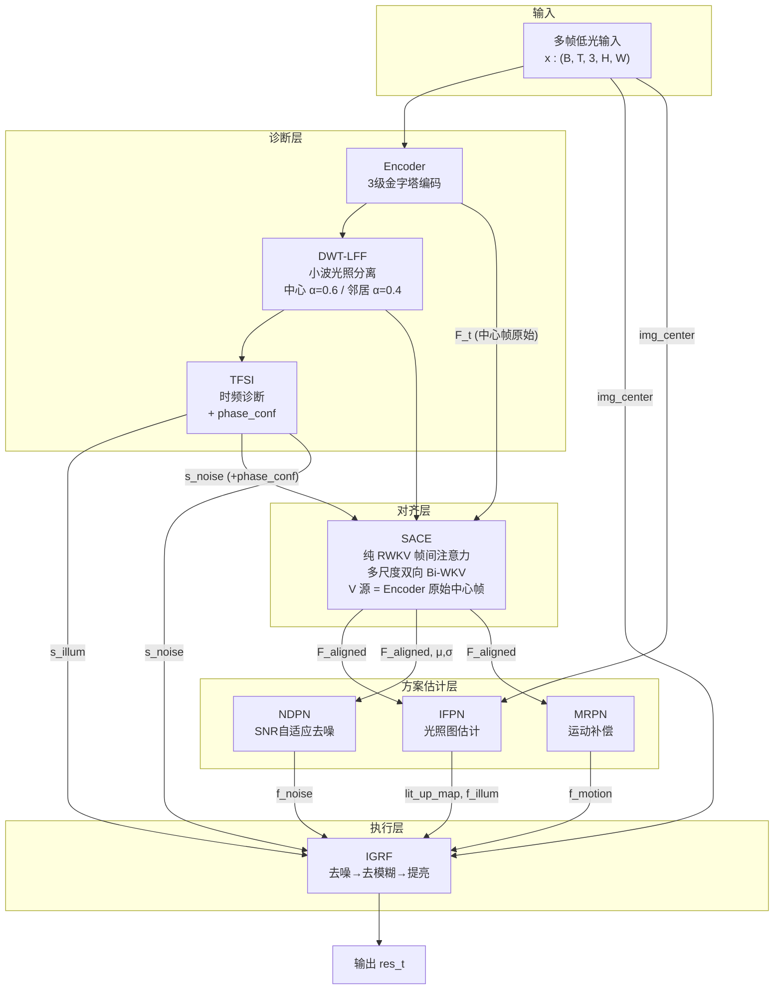
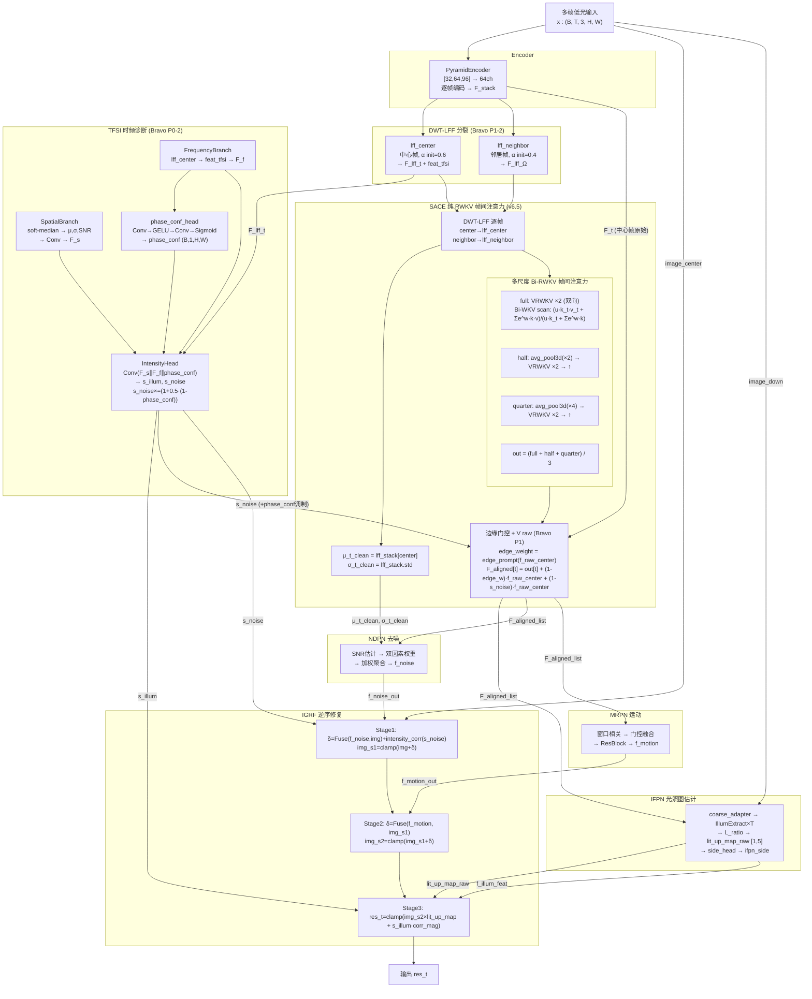

# TFS-Net v6 Bravo 整体架构图（2026-06-28）

## 图一：最简架构



## 图二：带细节架构



### SACE 帧间注意力详解

```
SACE 内部:
  F_stack (B,T,64,H,W)
    ├─ center frame → lff_center (α=0.6) → Q 源 (归一化锚定)
    ├─ neighbor frames → lff_neighbor (α=0.4) → K 源 (退化诊断)
    └─ f_raw_center (Encoder 原始) → V 源 (内容保留)
  
  多尺度 Bi-RWKV:
    full: VRWKVStyleSpatialMix(5帧, H×W) ×2 (前向+反向)
    half: avg_pool3d → VRWKV ×2 → bilinear ↑
    quarter: avg_pool3d → VRWKV ×2 → bilinear ↑
    out = (full + half + quarter) / 3
  
  残差:
    edge_weight = sigmoid(Conv(f_raw_center))
    F_aligned[t] = out[t] + (1-edge_weight)·f_raw_center + (1-s_noise)·f_raw_center
```

### 关键创新

| 创新 | 描述 | 来源 |
|---|---|---|
| **PureRWKV 替代 DAT** | 3尺度双向 Bi-WKV 替代可变形采样，省130K参数 | pureRWKV.md |
| **DWT-LFF 分裂** | 中心帧α=0.6(干净锚定) vs 邻居α=0.4(退化诊断) | VSRELL + STCD |
| **V 源 = Encoder 原始** | 对齐用归一化空间(Q/K)，内容用原始空间(V) | STCD |
| **phase_conf 调制 s_noise** | 相位不可靠→增强去噪 | FDN + FAN |
| **VGG/SSIM 主导损失** | L1降权0.3，VGG 0.8+SSIM 0.5主导 | BVI-Lowlight |
