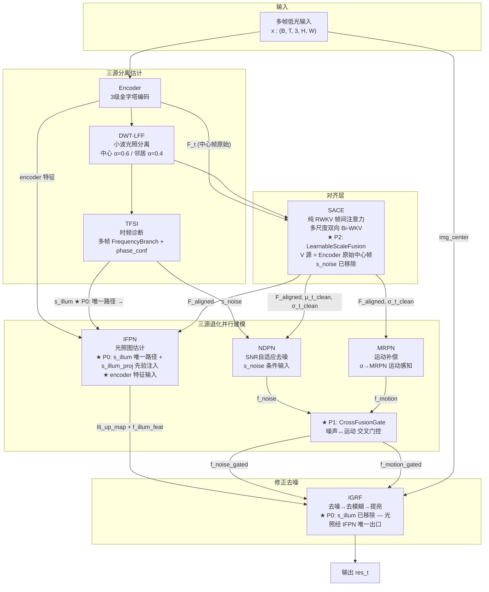
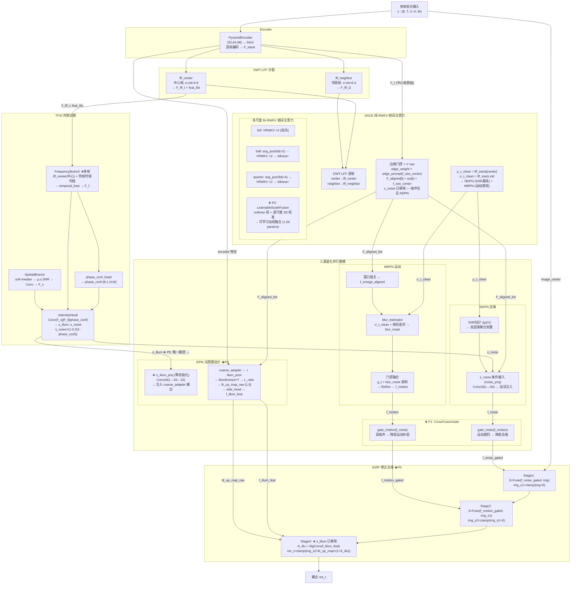

# TFS-Net v6 Charlie3 整体架构图 (2026-06-30, 更新: Charlie3 P0-P2 实施)

## 图一：最简架构（三源分离估计-三源处理-修正去噪）



### 框架要点

- **三源分离估计**：DWT-LFF + TFSI 联合诊断光照(s_illum)和噪声(s_noise)；SACE 通过帧间方差(σ_t_clean)隐式感知运动
- **s_illum 唯一路径 (P0)**：TFSI → IFPN（s_illum_proj 零初始化先验注入）→ IGRF（f_illum_feat 已蕴含光照信息）
- **CrossFusionGate (P1)**：NDPN/MRPN 各自独立推理后，交叉门控交换互补置信度（运动剧烈去噪低、高噪运动补偿低）
- **LearnableScaleFusion (P2)**：SACE 三尺度 softmax 加权融合，替代 concat+channel_mix（12K→1.5K 参数）

### Charlie3 vs Charlie2 核心差异

| 维度 | Charlie2 | Charlie3 |
|------|----------|----------|
| **s_illum 路径** | TFSI → IFPN + TFSI → IGRF 双路径 | ★ P0: TFSI → IFPN 唯一路径 |
| **IFPN 光照注入** | illumin_modulate × s_illum (对齐特征调制) | ★ P0: s_illum_proj (零初始化, coarse 级加法注入) |
| **IGRF Brighten** | 接收 s_illum 做 A_illu 门控 | ★ P0: 移除 s_illum, f_illum_feat 自含光照 |
| **NDPN↔MRPN 关系** | 无交互，各自直送 IGRF | ★ P1: CrossFusionGate 交叉门控 |
| **SACE 多尺度融合** | concat[3C]→Linear(3C→C) (~12K) | ★ P2: LearnableScaleFusion (~1.5K) |
| **参数量** | 1.26M | ★ 1.32M (+59K) |

---

## 图二：带细节架构



### Charlie3 数据流总览

```
TFSI → s_noise ──→ NDPN (noise_proj 条件输入)        — 保留
TFSI → s_illum ──→ IFPN (s_illum_proj ★P0 唯一出口)  — 新增, 替代双路径
TFSI → s_illum ─→ IGRF                              — ★P0: 已移除

SACE → σ_t_clean ─┬─ NDPN SNR 估计 (|μ|/σ)          — 保留
                   └─ blur_estimator → MRPN           — 保留

NDPN → f_noise ─┬─ CrossFusionGate.gate_motion ★P1   — 新增
MRPN → f_motion ─┼─ CrossFusionGate.gate_noise ★P1   — 新增
CFG → f_noise_gated, f_motion_gated → IGRF            — 替代直连

SACE 三尺度 → LearnableScaleFusion ★P2               — 替代 channel_mix
```

### 版本演进 (Charlie 系列)

| 版本 | 关键改动 | 参数量 | 收敛状态 |
|------|---------|--------|----------|
| Charlie | 多帧 FrequencyBranch + concat fusion + NDPN s_noise + σ→MRPN + blur_mask | 1.25M | ep1 loss=0.205 |
| Charlie2 | s_noise→NDPN only + encoder feat→IFPN + s_illum gate + VSRELL A_illu | 1.26M | 微不稳定 (loss 反升) |
| **Charlie3** | **s_illum 单路径 + CrossFusionGate + LearnableScaleFusion** | **1.32M** | 单调下降 (ep16 loss=0.183) |
