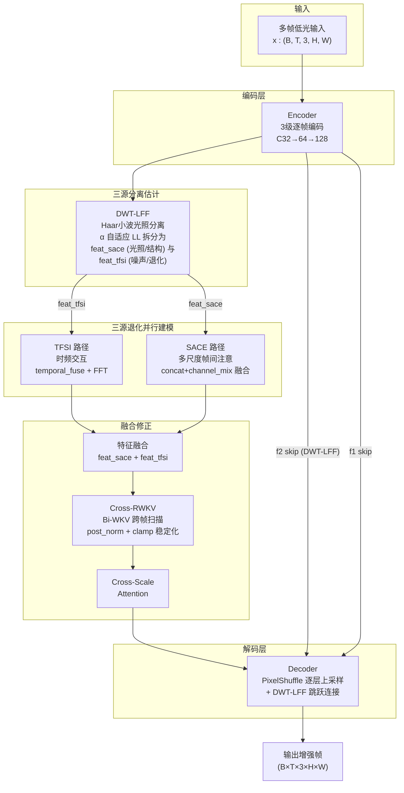
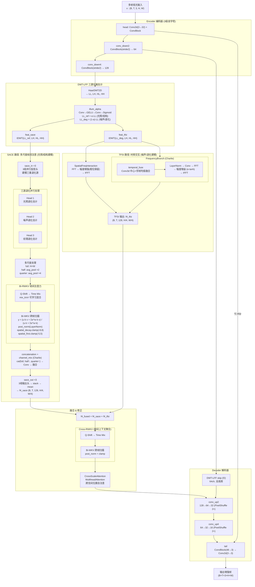

# TFS-Net v6 Charlie 整体架构图

## 图一：最简架构



## 图二：带细节架构



### SACE 三源退化并行建模 详解

```
SACE 内部 (Charlie 关键改动):

  feat_sace (B, T, 128, H/4, W/4)
    │
    ├─ sace_in ×3 (3组独立投影头)
    │     ├─ Head 1: Conv(dw)→Conv→GELU  → 光照退化估计
    │     ├─ Head 2: Conv(dw)→Conv→GELU  → 噪声退化估计
    │     └─ Head 3: Conv(dw)→Conv→GELU  → 纹理退化估计
    │
    ├─ 多尺度 Bi-RWKV 帧间注意力 (per head)
    │     full:  VRWKVStyleSpatialMix(H×W, 5帧) + post_norm + clamp
    │     half:  avg_pool(x2) → RWKV → bilinear ↑
    │     qtr:   avg_pool(x4) → RWKV → bilinear ↑
    │
    ├─ 多尺度融合 (Charlie P1-1)
    │     cat(full, half↑, qtr↑) → channel_mix(3C → C)    ← 替代 /3 平均
    │
    └─ sace_out ×3 → stack → mean → f4_sace
```

### 整体框架：三源分离估计 → 三源退化并行建模 → 修正去噪

| 阶段 | 模块 | 功能 |
|------|------|------|
| **Phase 1: 三源分离估计** | DWT-LFF (Haar + α门控) | 小波分解 4子带, α 自适应分配 LL 到光照/退化两路; HF (LH/HL/HH) 全共享给两分支 |
| **Phase 2: 三源退化并行建模** | TFSI (时频路径) + SACE (空域路径) | TFSI: temporal_fuse 多帧融合 + FFT 频域增强 建模噪声/退化; SACE: 3头多尺度 RWKV 帧间注意力 建模光照/噪声/纹理三重退化 |
| **Phase 3: 修正去噪** | Fusion + Cross-RWKV + Decoder | 特征相加融合 → Bi-WKV 跨帧修正 → CSA 空间自注意 → PixelShuffle 解码 (含 DWT-LFF skip) |

### Charlie vs Bravo 架构差异

| 模块 | Bravo | Charlie |
|------|-------|---------|
| TFSI F.B. | 单帧 LFF + phase_conf | 多帧 temporal_fuse (Conv3d) |
| SACE 融合 | /3 等权平均 | concat + channel_mix |
| SACE 三源建模 | 隐式 (统一处理) | 显式 3 头并行 |
| DWT-LFF HF | 0.5 共享 | 全高频 (无共享) |
| RWKV 稳定化 | 无 | post_norm + clamp(-8,8)+clamp(-5,5) |
| MRPN | 窗口相关 + 门控 | σ_t 输入 (实验中) |
| 损失权重 | 0.8p/0.3c/0.5s | 0.04p/1.0c/0.2s |
