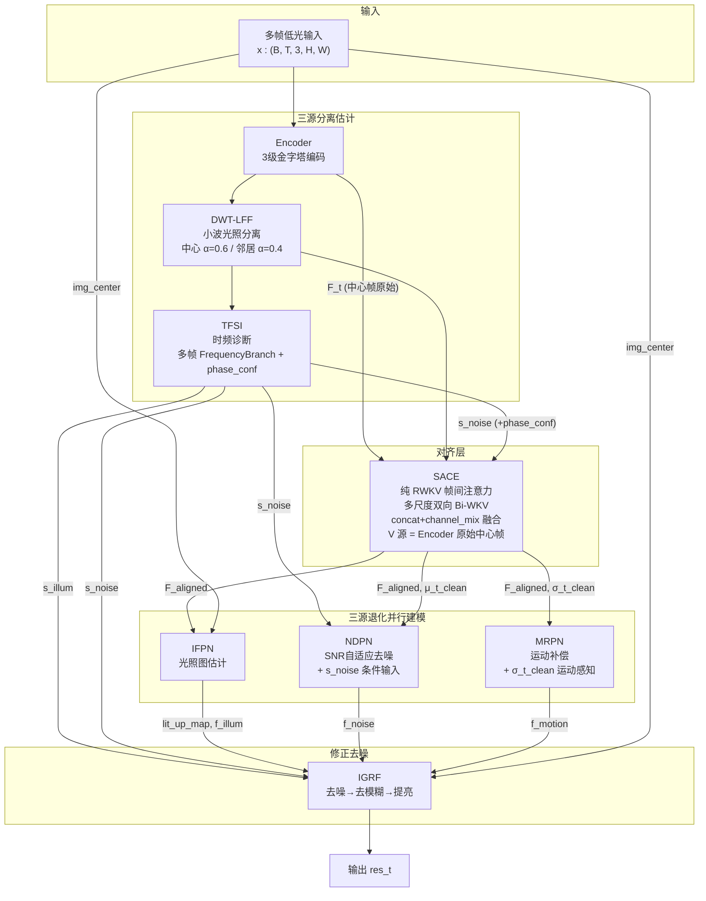
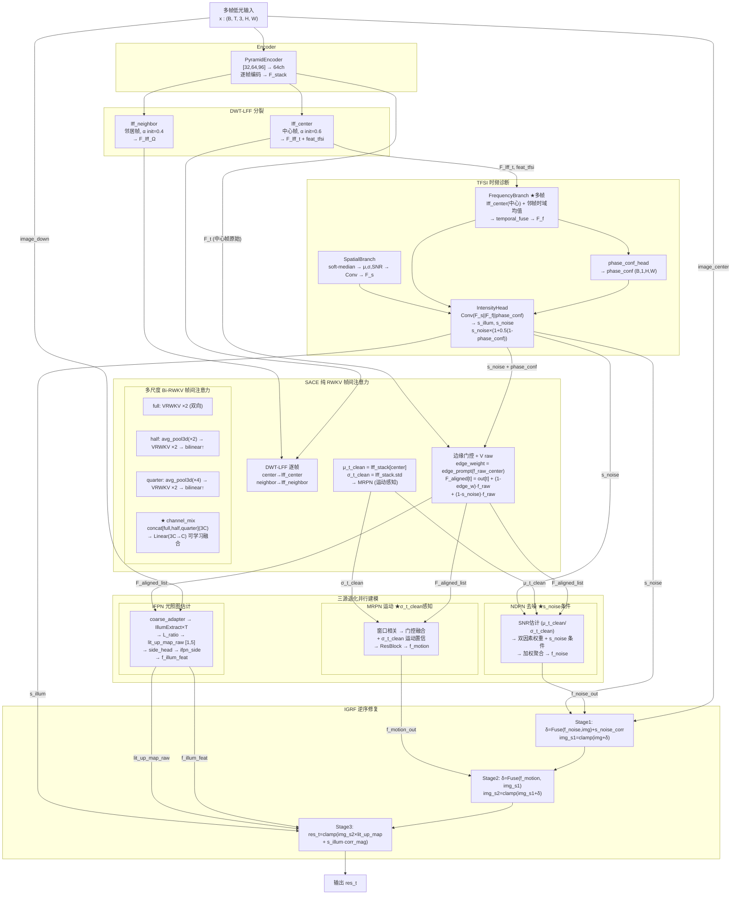

# TFS-Net v6 Charlie 整体架构图（2026-06-29）

## 图一：最简架构（三源分离估计-三源处理-修正去噪）



### 框架要点

- **三源分离估计**：DWT-LFF + TFSI 联合诊断光照(s_illum)和噪声(s_noise)；SACE 通过帧间方差(σ_t_clean)隐式感知运动
- **TFSI ↔ SACE 关系**：TFSI 的 FrequencyBranch 使用多帧邻居融合（Charlie P0-1）；SACE 使用 DWT-LFF 双实例（中心 α=0.6 / 邻居 α=0.4）做对齐前归一化；两者共享 DWT-LFF 核心思想但独立实现
- **三源并行处理**：IFPN/NDPN/MRPN 三个分支从 SACE 对齐特征各自估计修复方案；NDPN 接收 s_noise 作为条件输入，MRPN 接收 σ_t_clean 作为运动感知信号
- **SACE 纯 RWKV 注意力**：多尺度双向 Bi-WKV（full/half/quarter），concat+channel_mix 可学习融合（Charlie P1-1），V 源使用 Encoder 原始中心帧保留内容

---

## 图二：带细节架构



### Charlie vs Bravo 核心差异

| 维度 | Bravo | Charlie |
|---|---|---|
| **FrequencyBranch** | 仅中心帧 LFF | ★ 多帧：中心 LFF + 邻帧时域均值 → temporal_fuse |
| **多尺度融合** | /3 等权平均 | ★ concat+channel_mix (Linear 3C→C) |
| **σ_t_clean 路由** | → NDPN | ★ → MRPN (运动感知)，NDPN 保留 μ_t_clean |
| **s_noise 路由** | → SACE + IGRF | → SACE + **NDPN** (条件输入) + IGRF |

### SACE 纯 RWKV 注意力详解

```
F_stack (B,T,64,H,W)
  ├─ center frame → lff_center (α=0.6) → Q/V reference
  ├─ neighbor frames → lff_neighbor (α=0.4) → K source
  └─ f_raw_center (Encoder 原始) → V source (content)

多尺度 Bi-RWKV (Charlie P1-1):
  full → VRWKV ×2 (fwd+bwd)
  half → avg_pool3d(1,2,2) → VRWKV ×2 → bilinear↑
  quarter → avg_pool3d(1,4,4) → VRWKV ×2 → bilinear↑
  out = channel_mix(concat[full, half, quarter])  ← 可学习融合

边缘门控残差:
  edge_weight = sigmoid(Conv(f_raw_center))
  F_aligned[t] = out[t] + (1-edge_weight)·f_raw_center + (1-s_noise)·f_raw_center
```

### 损失函数

```
L_total = 1.0·Charbonnier(res, GT) + 0.04·VGG(relu3_3) + 0.2·(1-SSIM)
        + 0.05·L_freq + 0.001·L_illum_smooth + 0.02·L_illum_sup
        + 0.2·L_inter + 0.1·L_ifpn_sup
```
